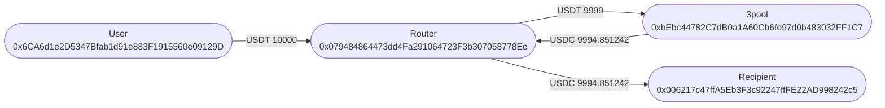
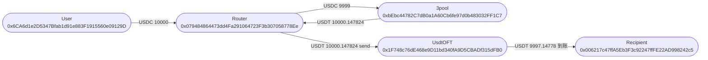
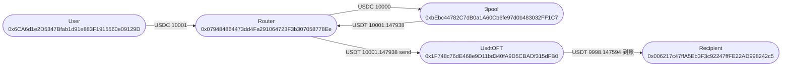
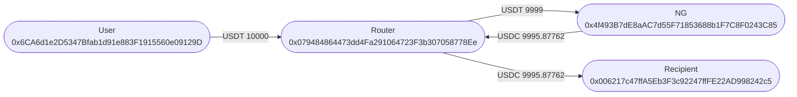
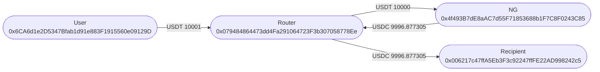
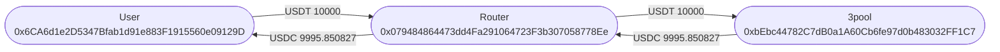
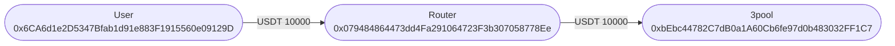
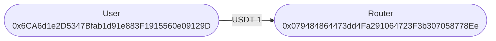
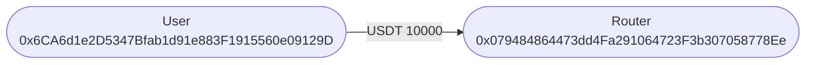

# StablecoinBridgeRouter fork 测试（旧 trace，勿对照）

下列 traces 为旧 ABI / 旧地址 `0x0794…` 的 Foundry `-vvvv` 输出，**不能**用来对接当前主网 Router `0x4A760E4c0Af6F369E07A97C5ED75E626c1369070`（固定 2 bps、无 `feeMode`/`swapFee`）。请以 `StablecoinBridgeRouter.md` 与 `test/StablecoinBridgeRouter.fork.t.sol` 为准。
`SwapParam` 字段顺序：`swapType, methodType, fillDeadline, swapFee, …, destAmount, nativeFee`。
跨链仅波场；route 1 为 USDC→USDT 后 UsdtOFT `send`；route 2 为 USDT 直接 `send`。
本金约 **10000** USDT/USDC；比例费 **万分之一**（`feeRate=100`）；固定费 **1**。

---

## 兑换矩阵

`swapType` 0 = 3pool（大额深度）；1 = NG USDC/USDT（小额，协议汇率更好）。

|  | 比例费 | 固定费 | 免费 |
|---|---|---|---|
| 只兑 USDT→USDC | `SwapRate` | `SwapFixed` | `SwapFree` |
| 兑后跨链 USDC→USDT→波场 | `SwapBridgeRate` | `SwapBridgeFixed` | `SwapBridgeFree` |
| 只跨链 USDT | | | `BridgeUsdtFree` |

## 成交汇率（本页 10000）

免 Router 费、USDT→USDC：3pool `10000 → 9995.850827`（约 4.15 bps）；同额 NG `10000 → 9996.877305`（约 3.12 bps）。NG 费率更低。万分之一比例费后再比：3pool `9999 → 9994.851242`，NG `9999 → 9995.87762`。同是 NG 时大额并不比小额差，小额走 NG 是因为对 3pool 更优，不是金额越小越好。池状态会变。

## 边界

`recipient=0` 只兑打给发送方；滑点；固定费超过本金；同币；`feeRate=0` 当免费。跨链必须填 `recipient`、`msg.value==nativeFee`。

---

## 资金流向图

| 角色 | 地址 |
|---|---|
| User | `0x6CA6d1e2D5347Bfab1d91e883F1915560e09129D` |
| Router | `0x079484864473dd4Fa291064723F3b307058778Ee` |
| 3pool | `0xbEbc44782C7dB0a1A60Cb6fe97d0b483032FF1C7` |
| NG USDC/USDT | `0x4f493B7dE8aAC7d55F71853688b1F7C8F0243C85` |
| Recipient | `0x006217c47ffA5Eb3F3c92247ffFE22AD998242c5` |
| UsdtOFT | `0x1F748c76dE468e9D11bd340fA9D5CBADf315dFB0` |
| USDT | `0xdAC17F958D2ee523a2206206994597C13D831ec7` |
| USDC | `0xA0b86991c6218b36c1d19D4a2e9Eb0cE3606eB48` |

边上是该笔 Transfer / OFT 到账数量（6 位小数），不是步骤序号。每个图下方是 `forge test -vvvv` 原样 traces（自动换行）。顺序：Rate → Fixed → Free。

### 成功 / 失败路径

### `test_3pool_SwapRate`



<details>
<summary><code>forge -vvvv</code> 原样 traces（自动换行）</summary>

<pre style="white-space:pre-wrap;overflow-wrap:anywhere;word-break:break-word;font-family:ui-monospace,SFMono-Regular,Menlo,monospace;font-size:12px;line-height:1.4;max-width:100%;overflow-x:hidden;margin:8px 0 0;">[PASS] test_3pool_SwapRate() (gas: 598912)
Traces:
  [753905] StablecoinBridgeRouterForkTest::test_3pool_SwapRate()
    ├─ [2387] 0x079484864473dd4Fa291064723F3b307058778Ee::owner() [staticcall]
    │   └─ ← [Return] 0x23A755FfB0db88E27E3Ee2b2B254064f2CCf3f53
    ├─ [0] VM::prank(0x23A755FfB0db88E27E3Ee2b2B254064f2CCf3f53)
    │   └─ ← [Return]
    ├─ [25040] 0x079484864473dd4Fa291064723F3b307058778Ee::setFeeInfo(FeeInfo({ feeRate: 100, feeRecipient: 0x006217c47ffA5Eb3F3c92247ffFE22AD998242c5 }))
    │   ├─ emit FeeInfoUpdated(feeRate: 100, feeRecipient: recipient: [0x006217c47ffA5Eb3F3c92247ffFE22AD998242c5])
    │   └─ ← [Stop]
    ├─ [5031] 0xdAC17F958D2ee523a2206206994597C13D831ec7::balanceOf(user: [0x6CA6d1e2D5347Bfab1d91e883F1915560e09129D]) [staticcall]
    │   └─ ← [Return] 0
    ├─ [0] VM::record()
    │   └─ ← [Return]
    ├─ [1031] 0xdAC17F958D2ee523a2206206994597C13D831ec7::balanceOf(user: [0x6CA6d1e2D5347Bfab1d91e883F1915560e09129D]) [staticcall]
    │   └─ ← [Return] 0
    ├─ [0] VM::accesses(0xdAC17F958D2ee523a2206206994597C13D831ec7) [staticcall]
    │   └─ ← [Return] [0x000000000000000000000000000000000000000000000000000000000000000a, 0xa538a16e4df34e4bf499ccf9f74cf244c60a53d9ee86f86dadea15e80aa5f68c], []
    ├─ [0] VM::load(0xdAC17F958D2ee523a2206206994597C13D831ec7, 0xa538a16e4df34e4bf499ccf9f74cf244c60a53d9ee86f86dadea15e80aa5f68c) [staticcall]
    │   └─ ← [Return] 0x0000000000000000000000000000000000000000000000000000000000000000
    ├─ emit WARNING_UninitedSlot(who: 0xdAC17F958D2ee523a2206206994597C13D831ec7, slot: 74731677606831646949679148269468332300218948596556520771794951177379418338956 [7.473e76])
    ├─ [0] VM::load(0xdAC17F958D2ee523a2206206994597C13D831ec7, 0xa538a16e4df34e4bf499ccf9f74cf244c60a53d9ee86f86dadea15e80aa5f68c) [staticcall]
    │   └─ ← [Return] 0x0000000000000000000000000000000000000000000000000000000000000000
    ├─ [1031] 0xdAC17F958D2ee523a2206206994597C13D831ec7::balanceOf(user: [0x6CA6d1e2D5347Bfab1d91e883F1915560e09129D]) [staticcall]
    │   └─ ← [Return] 0
    ├─ [0] VM::store(0xdAC17F958D2ee523a2206206994597C13D831ec7, 0xa538a16e4df34e4bf499ccf9f74cf244c60a53d9ee86f86dadea15e80aa5f68c, 0xffffffffffffffffffffffffffffffffffffffffffffffffffffffffffffffff)
    │   └─ ← [Return]
    ├─ [1031] 0xdAC17F958D2ee523a2206206994597C13D831ec7::balanceOf(user: [0x6CA6d1e2D5347Bfab1d91e883F1915560e09129D]) [staticcall]
    │   └─ ← [Return] 115792089237316195423570985008687907853269984665640564039457584007913129639935 [1.157e77]
    ├─ [0] VM::store(0xdAC17F958D2ee523a2206206994597C13D831ec7, 0xa538a16e4df34e4bf499ccf9f74cf244c60a53d9ee86f86dadea15e80aa5f68c, 0x0000000000000000000000000000000000000000000000000000000000000000)
    │   └─ ← [Return]
    ├─ emit SlotFound(who: 0xdAC17F958D2ee523a2206206994597C13D831ec7, fsig: 0x70a08231, keysHash: 0xb4260ebeada881f749f68942b3f0e36ae8ba2751d11fbbad46a58feb7b4cda51, slot: 74731677606831646949679148269468332300218948596556520771794951177379418338956 [7.473e76])
    ├─ [0] VM::load(0xdAC17F958D2ee523a2206206994597C13D831ec7, 0xa538a16e4df34e4bf499ccf9f74cf244c60a53d9ee86f86dadea15e80aa5f68c) [staticcall]
    │   └─ ← [Return] 0x0000000000000000000000000000000000000000000000000000000000000000
    ├─ [0] VM::store(0xdAC17F958D2ee523a2206206994597C13D831ec7, 0xa538a16e4df34e4bf499ccf9f74cf244c60a53d9ee86f86dadea15e80aa5f68c, 0x00000000000000000000000000000000000000000000000000000002540be400)
    │   └─ ← [Return]
    ├─ [1031] 0xdAC17F958D2ee523a2206206994597C13D831ec7::balanceOf(user: [0x6CA6d1e2D5347Bfab1d91e883F1915560e09129D]) [staticcall]
    │   └─ ← [Return] 10000000000 [1e10]
    ├─ [2611] 0xdAC17F958D2ee523a2206206994597C13D831ec7::totalSupply() [staticcall]
    │   └─ ← [Return] 0x0000000000000000000000000000000000000000000000000139b9dd91e94bbb
    ├─ [0] VM::record()
    │   └─ ← [Return]
    ├─ [611] 0xdAC17F958D2ee523a2206206994597C13D831ec7::totalSupply() [staticcall]
    │   └─ ← [Return] 0x0000000000000000000000000000000000000000000000000139b9dd91e94bbb
    ├─ [0] VM::accesses(0xdAC17F958D2ee523a2206206994597C13D831ec7) [staticcall]
    │   └─ ← [Return] [0x000000000000000000000000000000000000000000000000000000000000000a, 0x0000000000000000000000000000000000000000000000000000000000000001], []
    ├─ [0] VM::load(0xdAC17F958D2ee523a2206206994597C13D831ec7, 0x0000000000000000000000000000000000000000000000000000000000000001) [staticcall]
    │   └─ ← [Return] 0x0000000000000000000000000000000000000000000000000139b9dd91e94bbb
    ├─ [0] VM::load(0xdAC17F958D2ee523a2206206994597C13D831ec7, 0x0000000000000000000000000000000000000000000000000000000000000001) [staticcall]
    │   └─ ← [Return] 0x0000000000000000000000000000000000000000000000000139b9dd91e94bbb
    ├─ [611] 0xdAC17F958D2ee523a2206206994597C13D831ec7::totalSupply() [staticcall]
    │   └─ ← [Return] 0x0000000000000000000000000000000000000000000000000139b9dd91e94bbb
    ├─ [0] VM::store(0xdAC17F958D2ee523a2206206994597C13D831ec7, 0x0000000000000000000000000000000000000000000000000000000000000001, 0x0000000000000000000000000000000000000000000000000000000000000000)
    │   └─ ← [Return]
    ├─ [611] 0xdAC17F958D2ee523a2206206994597C13D831ec7::totalSupply() [staticcall]
    │   └─ ← [Return] 0x0000000000000000000000000000000000000000000000000000000000000000
    ├─ [0] VM::store(0xdAC17F958D2ee523a2206206994597C13D831ec7, 0x0000000000000000000000000000000000000000000000000000000000000001, 0x0000000000000000000000000000000000000000000000000139b9dd91e94bbb)
    │   └─ ← [Return]
    ├─ emit SlotFound(who: 0xdAC17F958D2ee523a2206206994597C13D831ec7, fsig: 0x18160ddd, keysHash: 0x290decd9548b62a8d60345a988386fc84ba6bc95484008f6362f93160ef3e563, slot: 1)
    ├─ [0] VM::load(0xdAC17F958D2ee523a2206206994597C13D831ec7, 0x0000000000000000000000000000000000000000000000000000000000000001) [staticcall]
    │   └─ ← [Return] 0x0000000000000000000000000000000000000000000000000139b9dd91e94bbb
    ├─ [0] VM::store(0xdAC17F958D2ee523a2206206994597C13D831ec7, 0x0000000000000000000000000000000000000000000000000000000000000001, 0x0000000000000000000000000000000000000000000000000139b9dfe5f52fbb)
    │   └─ ← [Return]
    ├─ [611] 0xdAC17F958D2ee523a2206206994597C13D831ec7::totalSupply() [staticcall]
    │   └─ ← [Return] 0x0000000000000000000000000000000000000000000000000139b9dfe5f52fbb
    ├─ [1031] 0xdAC17F958D2ee523a2206206994597C13D831ec7::balanceOf(user: [0x6CA6d1e2D5347Bfab1d91e883F1915560e09129D]) [staticcall]
    │   └─ ← [Return] 10000000000 [1e10]
    ├─ [0] VM::startPrank(user: [0x6CA6d1e2D5347Bfab1d91e883F1915560e09129D])
    │   └─ ← [Return]
    ├─ [4860] 0xdAC17F958D2ee523a2206206994597C13D831ec7::approve(0x079484864473dd4Fa291064723F3b307058778Ee, 0)
    │   ├─ emit Approval(owner: user: [0x6CA6d1e2D5347Bfab1d91e883F1915560e09129D], spender: 0x079484864473dd4Fa291064723F3b307058778Ee, value: 0)
    │   └─ ← [Stop]
    ├─ [22953] 0xdAC17F958D2ee523a2206206994597C13D831ec7::approve(0x079484864473dd4Fa291064723F3b307058778Ee, 10000000000 [1e10])
    │   ├─ emit Approval(owner: user: [0x6CA6d1e2D5347Bfab1d91e883F1915560e09129D], spender: 0x079484864473dd4Fa291064723F3b307058778Ee, value: 10000000000 [1e10])
    │   └─ ← [Stop]
    ├─ [0] VM::stopPrank()
    │   └─ ← [Return]
    ├─ [51339] 0x079484864473dd4Fa291064723F3b307058778Ee::getAmountOut(SwapParam({ swapType: 0, methodType: 32, fillDeadline: 0, swapFee: 0, tokenIn: 0xdAC17F958D2ee523a2206206994597C13D831ec7, tokenOut: 0xA0b86991c6218b36c1d19D4a2e9Eb0cE3606eB48, recipient: 0x006217c47ffA5Eb3F3c92247ffFE22AD998242c5, amountIn: 10000000000 [1e10], minAmountOut: 0, destChainId: 728126428 [7.281e8], destToken: 0x0000000000000000000000000000000000000000, destAmount: 0, nativeFee: 0 })) [staticcall]
    │   ├─ [3201] 0xbEbc44782C7dB0a1A60Cb6fe97d0b483032FF1C7::coins(0) [staticcall]
    │   │   └─ ← [Return] 0x0000000000000000000000006b175474e89094c44da98b954eedeac495271d0f
    │   ├─ [3201] 0xbEbc44782C7dB0a1A60Cb6fe97d0b483032FF1C7::coins(1) [staticcall]
    │   │   └─ ← [Return] 0x000000000000000000000000a0b86991c6218b36c1d19d4a2e9eb0ce3606eb48
    │   ├─ [3201] 0xbEbc44782C7dB0a1A60Cb6fe97d0b483032FF1C7::coins(2) [staticcall]
    │   │   └─ ← [Return] 0x000000000000000000000000dac17f958d2ee523a2206206994597c13d831ec7
    │   ├─ [1201] 0xbEbc44782C7dB0a1A60Cb6fe97d0b483032FF1C7::coins(0) [staticcall]
    │   │   └─ ← [Return] 0x0000000000000000000000006b175474e89094c44da98b954eedeac495271d0f
    │   ├─ [1201] 0xbEbc44782C7dB0a1A60Cb6fe97d0b483032FF1C7::coins(1) [staticcall]
    │   │   └─ ← [Return] 0x000000000000000000000000a0b86991c6218b36c1d19d4a2e9eb0ce3606eb48
    │   ├─ [31343] 0xbEbc44782C7dB0a1A60Cb6fe97d0b483032FF1C7::get_dy(2, 1, 9999000000 [9.999e9]) [staticcall]
    │   │   └─ ← [Return] 0x0000000000000000000000000000000000000000000000000000000253bd53ab
    │   └─ ← [Return] 9994851243 [9.994e9]
    ├─ [9839] 0xA0b86991c6218b36c1d19D4a2e9Eb0cE3606eB48::balanceOf(recipient: [0x006217c47ffA5Eb3F3c92247ffFE22AD998242c5]) [staticcall]
    │   ├─ [2553] 0x43506849D7C04F9138D1A2050bbF3A0c054402dd::balanceOf(recipient: [0x006217c47ffA5Eb3F3c92247ffFE22AD998242c5]) [delegatecall]
    │   │   └─ ← [Return] 0
    │   └─ ← [Return] 0
    ├─ [598] 0x079484864473dd4Fa291064723F3b307058778Ee::feeInfo() [staticcall]
    │   └─ ← [Return] FeeInfo({ feeRate: 100, feeRecipient: 0x006217c47ffA5Eb3F3c92247ffFE22AD998242c5 })
    ├─ [0] VM::prank(user: [0x6CA6d1e2D5347Bfab1d91e883F1915560e09129D])
    │   └─ ← [Return]
    ├─ [230771] 0x079484864473dd4Fa291064723F3b307058778Ee::execute(SwapParam({ swapType: 0, methodType: 32, fillDeadline: 0, swapFee: 0, tokenIn: 0xdAC17F958D2ee523a2206206994597C13D831ec7, tokenOut: 0xA0b86991c6218b36c1d19D4a2e9Eb0cE3606eB48, recipient: 0x006217c47ffA5Eb3F3c92247ffFE22AD998242c5, amountIn: 10000000000 [1e10], minAmountOut: 9894902730 [9.894e9], destChainId: 728126428 [7.281e8], destToken: 0x0000000000000000000000000000000000000000, destAmount: 0, nativeFee: 0 }))
    │   ├─ [35224] 0xdAC17F958D2ee523a2206206994597C13D831ec7::transferFrom(user: [0x6CA6d1e2D5347Bfab1d91e883F1915560e09129D], 0x079484864473dd4Fa291064723F3b307058778Ee, 10000000000 [1e10])
    │   │   ├─ emit Transfer(from: user: [0x6CA6d1e2D5347Bfab1d91e883F1915560e09129D], to: 0x079484864473dd4Fa291064723F3b307058778Ee, value: 10000000000 [1e10])
    │   │   └─ ← [Stop]
    │   ├─ emit FeeCharged(token: 0xdAC17F958D2ee523a2206206994597C13D831ec7, holder: 0x079484864473dd4Fa291064723F3b307058778Ee, fee: 1000000 [1e6], feeMode: 2)
    │   ├─ [1201] 0xbEbc44782C7dB0a1A60Cb6fe97d0b483032FF1C7::coins(0) [staticcall]
    │   │   └─ ← [Return] 0x0000000000000000000000006b175474e89094c44da98b954eedeac495271d0f
    │   ├─ [1201] 0xbEbc44782C7dB0a1A60Cb6fe97d0b483032FF1C7::coins(1) [staticcall]
    │   │   └─ ← [Return] 0x000000000000000000000000a0b86991c6218b36c1d19d4a2e9eb0ce3606eb48
    │   ├─ [1201] 0xbEbc44782C7dB0a1A60Cb6fe97d0b483032FF1C7::coins(2) [staticcall]
    │   │   └─ ← [Return] 0x000000000000000000000000dac17f958d2ee523a2206206994597c13d831ec7
    │   ├─ [1201] 0xbEbc44782C7dB0a1A60Cb6fe97d0b483032FF1C7::coins(0) [staticcall]
    │   │   └─ ← [Return] 0x0000000000000000000000006b175474e89094c44da98b954eedeac495271d0f
    │   ├─ [1201] 0xbEbc44782C7dB0a1A60Cb6fe97d0b483032FF1C7::coins(1) [staticcall]
    │   │   └─ ← [Return] 0x000000000000000000000000a0b86991c6218b36c1d19d4a2e9eb0ce3606eb48
    │   ├─ [4860] 0xdAC17F958D2ee523a2206206994597C13D831ec7::approve(0xbEbc44782C7dB0a1A60Cb6fe97d0b483032FF1C7, 0)
    │   │   ├─ emit Approval(owner: 0x079484864473dd4Fa291064723F3b307058778Ee, spender: 0xbEbc44782C7dB0a1A60Cb6fe97d0b483032FF1C7, value: 0)
    │   │   └─ ← [Stop]
    │   ├─ [22953] 0xdAC17F958D2ee523a2206206994597C13D831ec7::approve(0xbEbc44782C7dB0a1A60Cb6fe97d0b483032FF1C7, 9999000000 [9.999e9])
    │   │   ├─ emit Approval(owner: 0x079484864473dd4Fa291064723F3b307058778Ee, spender: 0xbEbc44782C7dB0a1A60Cb6fe97d0b483032FF1C7, value: 9999000000 [9.999e9])
    │   │   └─ ← [Stop]
    │   ├─ [3339] 0xA0b86991c6218b36c1d19D4a2e9Eb0cE3606eB48::balanceOf(0x079484864473dd4Fa291064723F3b307058778Ee) [staticcall]
    │   │   ├─ [2553] 0x43506849D7C04F9138D1A2050bbF3A0c054402dd::balanceOf(0x079484864473dd4Fa291064723F3b307058778Ee) [delegatecall]
    │   │   │   └─ ← [Return] 0
    │   │   └─ ← [Return] 0
    │   ├─ [109838] 0xbEbc44782C7dB0a1A60Cb6fe97d0b483032FF1C7::exchange(2, 1, 9999000000 [9.999e9], 9894902730 [9.894e9])
    │   │   ├─ [3031] 0xdAC17F958D2ee523a2206206994597C13D831ec7::balanceOf(0xbEbc44782C7dB0a1A60Cb6fe97d0b483032FF1C7) [staticcall]
    │   │   │   └─ ← [Return] 84351611940974 [8.435e13]
    │   │   ├─ [18] PRECOMPILES::identity(0x23b872dd)
    │   │   │   └─ ← [Return] 0x23b872dd
    │   │   ├─ [30] PRECOMPILES::identity(0x000000000000000000000000000000000000000000000000000000000000006423b872dd000000000000000000000000079484864473dd4fa291064723f3b307058778ee000000000000000000000000bebc44782c7db0a1a60cb6fe97d0b483032ff1c70000000000000000000000000000000000000000000000000000000253fca1c0)
    │   │   │   └─ ← [Return] 0x000000000000000000000000000000000000000000000000000000000000006423b872dd000000000000000000000000079484864473dd4fa291064723f3b307058778ee000000000000000000000000bebc44782c7db0a1a60cb6fe97d0b483032ff1c70000000000000000000000000000000000000000000000000000000253fca1c0
    │   │   ├─ [10124] 0xdAC17F958D2ee523a2206206994597C13D831ec7::transferFrom(0x079484864473dd4Fa291064723F3b307058778Ee, 0xbEbc44782C7dB0a1A60Cb6fe97d0b483032FF1C7, 9999000000 [9.999e9])
    │   │   │   ├─ emit Transfer(from: 0x079484864473dd4Fa291064723F3b307058778Ee, to: 0xbEbc44782C7dB0a1A60Cb6fe97d0b483032FF1C7, value: 9999000000 [9.999e9])
    │   │   │   └─ ← [Stop]
    │   │   ├─ [18] PRECOMPILES::identity(0x0000000000000000000000000000000000000000000000000000000000000000)
    │   │   │   └─ ← [Return] 0x0000000000000000000000000000000000000000000000000000000000000000
    │   │   ├─ [1031] 0xdAC17F958D2ee523a2206206994597C13D831ec7::balanceOf(0xbEbc44782C7dB0a1A60Cb6fe97d0b483032FF1C7) [staticcall]
    │   │   │   └─ ← [Return] 84361610940974 [8.436e13]
    │   │   ├─ [18] PRECOMPILES::identity(0xa9059cbb)
    │   │   │   └─ ← [Return] 0xa9059cbb
    │   │   ├─ [27] PRECOMPILES::identity(0x0000000000000000000000000000000000000000000000000000000000000044a9059cbb000000000000000000000000079484864473dd4fa291064723f3b307058778ee0000000000000000000000000000000000000000000000000000000253bd53aa)
    │   │   │   └─ ← [Return] 0x0000000000000000000000000000000000000000000000000000000000000044a9059cbb000000000000000000000000079484864473dd4fa291064723f3b307058778ee0000000000000000000000000000000000000000000000000000000253bd53aa
    │   │   ├─ [32152] 0xA0b86991c6218b36c1d19D4a2e9Eb0cE3606eB48::transfer(0x079484864473dd4Fa291064723F3b307058778Ee, 9994851242 [9.994e9])
    │   │   │   ├─ [31363] 0x43506849D7C04F9138D1A2050bbF3A0c054402dd::transfer(0x079484864473dd4Fa291064723F3b307058778Ee, 9994851242 [9.994e9]) [delegatecall]
    │   │   │   │   ├─ emit Transfer(from: 0xbEbc44782C7dB0a1A60Cb6fe97d0b483032FF1C7, to: 0x079484864473dd4Fa291064723F3b307058778Ee, value: 9994851242 [9.994e9])
    │   │   │   │   └─ ← [Return] 0x0000000000000000000000000000000000000000000000000000000000000001
    │   │   │   └─ ← [Return] 0x0000000000000000000000000000000000000000000000000000000000000001
    │   │   ├─ [21] PRECOMPILES::identity(0x00000000000000000000000000000000000000000000000000000000000000200000000000000000000000000000000000000000000000000000000000000001)
    │   │   │   └─ ← [Return] 0x00000000000000000000000000000000000000000000000000000000000000200000000000000000000000000000000000000000000000000000000000000001
    │   │   ├─ emit TokenExchange(param0: 0x079484864473dd4Fa291064723F3b307058778Ee, param1: 2, param2: 9999000000 [9.999e9], param3: 1, param4: 9994851242 [9.994e9])
    │   │   └─ ← [Stop]
    │   ├─ [1339] 0xA0b86991c6218b36c1d19D4a2e9Eb0cE3606eB48::balanceOf(0x079484864473dd4Fa291064723F3b307058778Ee) [staticcall]
    │   │   ├─ [553] 0x43506849D7C04F9138D1A2050bbF3A0c054402dd::balanceOf(0x079484864473dd4Fa291064723F3b307058778Ee) [delegatecall]
    │   │   │   └─ ← [Return] 9994851242 [9.994e9]
    │   │   └─ ← [Return] 9994851242 [9.994e9]
    │   ├─ [2760] 0xdAC17F958D2ee523a2206206994597C13D831ec7::approve(0xbEbc44782C7dB0a1A60Cb6fe97d0b483032FF1C7, 0)
    │   │   ├─ emit Approval(owner: 0x079484864473dd4Fa291064723F3b307058778Ee, spender: 0xbEbc44782C7dB0a1A60Cb6fe97d0b483032FF1C7, value: 0)
    │   │   └─ ← [Stop]
    │   ├─ emit Swap(sender: user: [0x6CA6d1e2D5347Bfab1d91e883F1915560e09129D], recipient: recipient: [0x006217c47ffA5Eb3F3c92247ffFE22AD998242c5], pool: 0xbEbc44782C7dB0a1A60Cb6fe97d0b483032FF1C7, tokenIn: 0xdAC17F958D2ee523a2206206994597C13D831ec7, tokenOut: 0xA0b86991c6218b36c1d19D4a2e9Eb0cE3606eB48, amountIn: 9999000000 [9.999e9], amountOut: 9994851242 [9.994e9])
    │   ├─ [25352] 0xA0b86991c6218b36c1d19D4a2e9Eb0cE3606eB48::transfer(recipient: [0x006217c47ffA5Eb3F3c92247ffFE22AD998242c5], 9994851242 [9.994e9])
    │   │   ├─ [24563] 0x43506849D7C04F9138D1A2050bbF3A0c054402dd::transfer(recipient: [0x006217c47ffA5Eb3F3c92247ffFE22AD998242c5], 9994851242 [9.994e9]) [delegatecall]
    │   │   │   ├─ emit Transfer(from: 0x079484864473dd4Fa291064723F3b307058778Ee, to: recipient: [0x006217c47ffA5Eb3F3c92247ffFE22AD998242c5], value: 9994851242 [9.994e9])
    │   │   │   └─ ← [Return] 0x0000000000000000000000000000000000000000000000000000000000000001
    │   │   └─ ← [Return] 0x0000000000000000000000000000000000000000000000000000000000000001
    │   └─ ← [Return] 9994851242 [9.994e9]
    ├─ [0] VM::assertApproxEqAbs(9994851242 [9.994e9], 9994851243 [9.994e9], 2) [staticcall]
    │   └─ ← [Return]
    ├─ [1339] 0xA0b86991c6218b36c1d19D4a2e9Eb0cE3606eB48::balanceOf(recipient: [0x006217c47ffA5Eb3F3c92247ffFE22AD998242c5]) [staticcall]
    │   ├─ [553] 0x43506849D7C04F9138D1A2050bbF3A0c054402dd::balanceOf(recipient: [0x006217c47ffA5Eb3F3c92247ffFE22AD998242c5]) [delegatecall]
    │   │   └─ ← [Return] 9994851242 [9.994e9]
    │   └─ ← [Return] 9994851242 [9.994e9]
    ├─ [1031] 0xdAC17F958D2ee523a2206206994597C13D831ec7::balanceOf(0x079484864473dd4Fa291064723F3b307058778Ee) [staticcall]
    │   └─ ← [Return] 1000000 [1e6]
    └─ ← [Return]
</pre>
</details>

### `test_3pool_SwapFixed`


<details>
<summary><code>forge -vvvv</code> 原样 traces（自动换行）</summary>

<pre style="white-space:pre-wrap;overflow-wrap:anywhere;word-break:break-word;font-family:ui-monospace,SFMono-Regular,Menlo,monospace;font-size:12px;line-height:1.4;max-width:100%;overflow-x:hidden;margin:8px 0 0;">[PASS] test_3pool_SwapFixed() (gas: 574015)
Traces:
  [722784] StablecoinBridgeRouterForkTest::test_3pool_SwapFixed()
    ├─ [5031] 0xdAC17F958D2ee523a2206206994597C13D831ec7::balanceOf(user: [0x6CA6d1e2D5347Bfab1d91e883F1915560e09129D]) [staticcall]
    │   └─ ← [Return] 0
    ├─ [0] VM::record()
    │   └─ ← [Return]
    ├─ [1031] 0xdAC17F958D2ee523a2206206994597C13D831ec7::balanceOf(user: [0x6CA6d1e2D5347Bfab1d91e883F1915560e09129D]) [staticcall]
    │   └─ ← [Return] 0
    ├─ [0] VM::accesses(0xdAC17F958D2ee523a2206206994597C13D831ec7) [staticcall]
    │   └─ ← [Return] [0x000000000000000000000000000000000000000000000000000000000000000a, 0xa538a16e4df34e4bf499ccf9f74cf244c60a53d9ee86f86dadea15e80aa5f68c], []
    ├─ [0] VM::load(0xdAC17F958D2ee523a2206206994597C13D831ec7, 0xa538a16e4df34e4bf499ccf9f74cf244c60a53d9ee86f86dadea15e80aa5f68c) [staticcall]
    │   └─ ← [Return] 0x0000000000000000000000000000000000000000000000000000000000000000
    ├─ emit WARNING_UninitedSlot(who: 0xdAC17F958D2ee523a2206206994597C13D831ec7, slot: 74731677606831646949679148269468332300218948596556520771794951177379418338956 [7.473e76])
    ├─ [0] VM::load(0xdAC17F958D2ee523a2206206994597C13D831ec7, 0xa538a16e4df34e4bf499ccf9f74cf244c60a53d9ee86f86dadea15e80aa5f68c) [staticcall]
    │   └─ ← [Return] 0x0000000000000000000000000000000000000000000000000000000000000000
    ├─ [1031] 0xdAC17F958D2ee523a2206206994597C13D831ec7::balanceOf(user: [0x6CA6d1e2D5347Bfab1d91e883F1915560e09129D]) [staticcall]
    │   └─ ← [Return] 0
    ├─ [0] VM::store(0xdAC17F958D2ee523a2206206994597C13D831ec7, 0xa538a16e4df34e4bf499ccf9f74cf244c60a53d9ee86f86dadea15e80aa5f68c, 0xffffffffffffffffffffffffffffffffffffffffffffffffffffffffffffffff)
    │   └─ ← [Return]
    ├─ [1031] 0xdAC17F958D2ee523a2206206994597C13D831ec7::balanceOf(user: [0x6CA6d1e2D5347Bfab1d91e883F1915560e09129D]) [staticcall]
    │   └─ ← [Return] 115792089237316195423570985008687907853269984665640564039457584007913129639935 [1.157e77]
    ├─ [0] VM::store(0xdAC17F958D2ee523a2206206994597C13D831ec7, 0xa538a16e4df34e4bf499ccf9f74cf244c60a53d9ee86f86dadea15e80aa5f68c, 0x0000000000000000000000000000000000000000000000000000000000000000)
    │   └─ ← [Return]
    ├─ emit SlotFound(who: 0xdAC17F958D2ee523a2206206994597C13D831ec7, fsig: 0x70a08231, keysHash: 0xb4260ebeada881f749f68942b3f0e36ae8ba2751d11fbbad46a58feb7b4cda51, slot: 74731677606831646949679148269468332300218948596556520771794951177379418338956 [7.473e76])
    ├─ [0] VM::load(0xdAC17F958D2ee523a2206206994597C13D831ec7, 0xa538a16e4df34e4bf499ccf9f74cf244c60a53d9ee86f86dadea15e80aa5f68c) [staticcall]
    │   └─ ← [Return] 0x0000000000000000000000000000000000000000000000000000000000000000
    ├─ [0] VM::store(0xdAC17F958D2ee523a2206206994597C13D831ec7, 0xa538a16e4df34e4bf499ccf9f74cf244c60a53d9ee86f86dadea15e80aa5f68c, 0x00000000000000000000000000000000000000000000000000000002541b2640)
    │   └─ ← [Return]
    ├─ [1031] 0xdAC17F958D2ee523a2206206994597C13D831ec7::balanceOf(user: [0x6CA6d1e2D5347Bfab1d91e883F1915560e09129D]) [staticcall]
    │   └─ ← [Return] 10001000000 [1e10]
    ├─ [2611] 0xdAC17F958D2ee523a2206206994597C13D831ec7::totalSupply() [staticcall]
    │   └─ ← [Return] 0x0000000000000000000000000000000000000000000000000139b9dd91e94bbb
    ├─ [0] VM::record()
    │   └─ ← [Return]
    ├─ [611] 0xdAC17F958D2ee523a2206206994597C13D831ec7::totalSupply() [staticcall]
    │   └─ ← [Return] 0x0000000000000000000000000000000000000000000000000139b9dd91e94bbb
    ├─ [0] VM::accesses(0xdAC17F958D2ee523a2206206994597C13D831ec7) [staticcall]
    │   └─ ← [Return] [0x000000000000000000000000000000000000000000000000000000000000000a, 0x0000000000000000000000000000000000000000000000000000000000000001], []
    ├─ [0] VM::load(0xdAC17F958D2ee523a2206206994597C13D831ec7, 0x0000000000000000000000000000000000000000000000000000000000000001) [staticcall]
    │   └─ ← [Return] 0x0000000000000000000000000000000000000000000000000139b9dd91e94bbb
    ├─ [0] VM::load(0xdAC17F958D2ee523a2206206994597C13D831ec7, 0x0000000000000000000000000000000000000000000000000000000000000001) [staticcall]
    │   └─ ← [Return] 0x0000000000000000000000000000000000000000000000000139b9dd91e94bbb
    ├─ [611] 0xdAC17F958D2ee523a2206206994597C13D831ec7::totalSupply() [staticcall]
    │   └─ ← [Return] 0x0000000000000000000000000000000000000000000000000139b9dd91e94bbb
    ├─ [0] VM::store(0xdAC17F958D2ee523a2206206994597C13D831ec7, 0x0000000000000000000000000000000000000000000000000000000000000001, 0x0000000000000000000000000000000000000000000000000000000000000000)
    │   └─ ← [Return]
    ├─ [611] 0xdAC17F958D2ee523a2206206994597C13D831ec7::totalSupply() [staticcall]
    │   └─ ← [Return] 0x0000000000000000000000000000000000000000000000000000000000000000
    ├─ [0] VM::store(0xdAC17F958D2ee523a2206206994597C13D831ec7, 0x0000000000000000000000000000000000000000000000000000000000000001, 0x0000000000000000000000000000000000000000000000000139b9dd91e94bbb)
    │   └─ ← [Return]
    ├─ emit SlotFound(who: 0xdAC17F958D2ee523a2206206994597C13D831ec7, fsig: 0x18160ddd, keysHash: 0x290decd9548b62a8d60345a988386fc84ba6bc95484008f6362f93160ef3e563, slot: 1)
    ├─ [0] VM::load(0xdAC17F958D2ee523a2206206994597C13D831ec7, 0x0000000000000000000000000000000000000000000000000000000000000001) [staticcall]
    │   └─ ← [Return] 0x0000000000000000000000000000000000000000000000000139b9dd91e94bbb
    ├─ [0] VM::store(0xdAC17F958D2ee523a2206206994597C13D831ec7, 0x0000000000000000000000000000000000000000000000000000000000000001, 0x0000000000000000000000000000000000000000000000000139b9dfe60471fb)
    │   └─ ← [Return]
    ├─ [611] 0xdAC17F958D2ee523a2206206994597C13D831ec7::totalSupply() [staticcall]
    │   └─ ← [Return] 0x0000000000000000000000000000000000000000000000000139b9dfe60471fb
    ├─ [1031] 0xdAC17F958D2ee523a2206206994597C13D831ec7::balanceOf(user: [0x6CA6d1e2D5347Bfab1d91e883F1915560e09129D]) [staticcall]
    │   └─ ← [Return] 10001000000 [1e10]
    ├─ [0] VM::startPrank(user: [0x6CA6d1e2D5347Bfab1d91e883F1915560e09129D])
    │   └─ ← [Return]
    ├─ [4860] 0xdAC17F958D2ee523a2206206994597C13D831ec7::approve(0x079484864473dd4Fa291064723F3b307058778Ee, 0)
    │   ├─ emit Approval(owner: user: [0x6CA6d1e2D5347Bfab1d91e883F1915560e09129D], spender: 0x079484864473dd4Fa291064723F3b307058778Ee, value: 0)
    │   └─ ← [Stop]
    ├─ [22953] 0xdAC17F958D2ee523a2206206994597C13D831ec7::approve(0x079484864473dd4Fa291064723F3b307058778Ee, 10001000000 [1e10])
    │   ├─ emit Approval(owner: user: [0x6CA6d1e2D5347Bfab1d91e883F1915560e09129D], spender: 0x079484864473dd4Fa291064723F3b307058778Ee, value: 10001000000 [1e10])
    │   └─ ← [Stop]
    ├─ [0] VM::stopPrank()
    │   └─ ← [Return]
    ├─ [50966] 0x079484864473dd4Fa291064723F3b307058778Ee::getAmountOut(SwapParam({ swapType: 0, methodType: 16, fillDeadline: 0, swapFee: 1000000 [1e6], tokenIn: 0xdAC17F958D2ee523a2206206994597C13D831ec7, tokenOut: 0xA0b86991c6218b36c1d19D4a2e9Eb0cE3606eB48, recipient: 0x006217c47ffA5Eb3F3c92247ffFE22AD998242c5, amountIn: 10001000000 [1e10], minAmountOut: 0, destChainId: 728126428 [7.281e8], destToken: 0x0000000000000000000000000000000000000000, destAmount: 0, nativeFee: 0 })) [staticcall]
    │   ├─ [3201] 0xbEbc44782C7dB0a1A60Cb6fe97d0b483032FF1C7::coins(0) [staticcall]
    │   │   └─ ← [Return] 0x0000000000000000000000006b175474e89094c44da98b954eedeac495271d0f
    │   ├─ [3201] 0xbEbc44782C7dB0a1A60Cb6fe97d0b483032FF1C7::coins(1) [staticcall]
    │   │   └─ ← [Return] 0x000000000000000000000000a0b86991c6218b36c1d19d4a2e9eb0ce3606eb48
    │   ├─ [3201] 0xbEbc44782C7dB0a1A60Cb6fe97d0b483032FF1C7::coins(2) [staticcall]
    │   │   └─ ← [Return] 0x000000000000000000000000dac17f958d2ee523a2206206994597c13d831ec7
    │   ├─ [1201] 0xbEbc44782C7dB0a1A60Cb6fe97d0b483032FF1C7::coins(0) [staticcall]
    │   │   └─ ← [Return] 0x0000000000000000000000006b175474e89094c44da98b954eedeac495271d0f
    │   ├─ [1201] 0xbEbc44782C7dB0a1A60Cb6fe97d0b483032FF1C7::coins(1) [staticcall]
    │   │   └─ ← [Return] 0x000000000000000000000000a0b86991c6218b36c1d19d4a2e9eb0ce3606eb48
    │   ├─ [31343] 0xbEbc44782C7dB0a1A60Cb6fe97d0b483032FF1C7::get_dy(2, 1, 10000000000 [1e10]) [staticcall]
    │   │   └─ ← [Return] 0x0000000000000000000000000000000000000000000000000000000253cc944c
    │   └─ ← [Return] 9995850828 [9.995e9]
    ├─ [9839] 0xA0b86991c6218b36c1d19D4a2e9Eb0cE3606eB48::balanceOf(recipient: [0x006217c47ffA5Eb3F3c92247ffFE22AD998242c5]) [staticcall]
    │   ├─ [2553] 0x43506849D7C04F9138D1A2050bbF3A0c054402dd::balanceOf(recipient: [0x006217c47ffA5Eb3F3c92247ffFE22AD998242c5]) [delegatecall]
    │   │   └─ ← [Return] 0
    │   └─ ← [Return] 0
    ├─ [0] VM::prank(user: [0x6CA6d1e2D5347Bfab1d91e883F1915560e09129D])
    │   └─ ← [Return]
    ├─ [230398] 0x079484864473dd4Fa291064723F3b307058778Ee::execute(SwapParam({ swapType: 0, methodType: 16, fillDeadline: 0, swapFee: 1000000 [1e6], tokenIn: 0xdAC17F958D2ee523a2206206994597C13D831ec7, tokenOut: 0xA0b86991c6218b36c1d19D4a2e9Eb0cE3606eB48, recipient: 0x006217c47ffA5Eb3F3c92247ffFE22AD998242c5, amountIn: 10001000000 [1e10], minAmountOut: 9895892319 [9.895e9], destChainId: 728126428 [7.281e8], destToken: 0x0000000000000000000000000000000000000000, destAmount: 0, nativeFee: 0 }))
    │   ├─ [35224] 0xdAC17F958D2ee523a2206206994597C13D831ec7::transferFrom(user: [0x6CA6d1e2D5347Bfab1d91e883F1915560e09129D], 0x079484864473dd4Fa291064723F3b307058778Ee, 10001000000 [1e10])
    │   │   ├─ emit Transfer(from: user: [0x6CA6d1e2D5347Bfab1d91e883F1915560e09129D], to: 0x079484864473dd4Fa291064723F3b307058778Ee, value: 10001000000 [1e10])
    │   │   └─ ← [Stop]
    │   ├─ emit FeeCharged(token: 0xdAC17F958D2ee523a2206206994597C13D831ec7, holder: 0x079484864473dd4Fa291064723F3b307058778Ee, fee: 1000000 [1e6], feeMode: 1)
    │   ├─ [1201] 0xbEbc44782C7dB0a1A60Cb6fe97d0b483032FF1C7::coins(0) [staticcall]
    │   │   └─ ← [Return] 0x0000000000000000000000006b175474e89094c44da98b954eedeac495271d0f
    │   ├─ [1201] 0xbEbc44782C7dB0a1A60Cb6fe97d0b483032FF1C7::coins(1) [staticcall]
    │   │   └─ ← [Return] 0x000000000000000000000000a0b86991c6218b36c1d19d4a2e9eb0ce3606eb48
    │   ├─ [1201] 0xbEbc44782C7dB0a1A60Cb6fe97d0b483032FF1C7::coins(2) [staticcall]
    │   │   └─ ← [Return] 0x000000000000000000000000dac17f958d2ee523a2206206994597c13d831ec7
    │   ├─ [1201] 0xbEbc44782C7dB0a1A60Cb6fe97d0b483032FF1C7::coins(0) [staticcall]
    │   │   └─ ← [Return] 0x0000000000000000000000006b175474e89094c44da98b954eedeac495271d0f
    │   ├─ [1201] 0xbEbc44782C7dB0a1A60Cb6fe97d0b483032FF1C7::coins(1) [staticcall]
    │   │   └─ ← [Return] 0x000000000000000000000000a0b86991c6218b36c1d19d4a2e9eb0ce3606eb48
    │   ├─ [4860] 0xdAC17F958D2ee523a2206206994597C13D831ec7::approve(0xbEbc44782C7dB0a1A60Cb6fe97d0b483032FF1C7, 0)
    │   │   ├─ emit Approval(owner: 0x079484864473dd4Fa291064723F3b307058778Ee, spender: 0xbEbc44782C7dB0a1A60Cb6fe97d0b483032FF1C7, value: 0)
    │   │   └─ ← [Stop]
    │   ├─ [22953] 0xdAC17F958D2ee523a2206206994597C13D831ec7::approve(0xbEbc44782C7dB0a1A60Cb6fe97d0b483032FF1C7, 10000000000 [1e10])
    │   │   ├─ emit Approval(owner: 0x079484864473dd4Fa291064723F3b307058778Ee, spender: 0xbEbc44782C7dB0a1A60Cb6fe97d0b483032FF1C7, value: 10000000000 [1e10])
    │   │   └─ ← [Stop]
    │   ├─ [3339] 0xA0b86991c6218b36c1d19D4a2e9Eb0cE3606eB48::balanceOf(0x079484864473dd4Fa291064723F3b307058778Ee) [staticcall]
    │   │   ├─ [2553] 0x43506849D7C04F9138D1A2050bbF3A0c054402dd::balanceOf(0x079484864473dd4Fa291064723F3b307058778Ee) [delegatecall]
    │   │   │   └─ ← [Return] 0
    │   │   └─ ← [Return] 0
    │   ├─ [109838] 0xbEbc44782C7dB0a1A60Cb6fe97d0b483032FF1C7::exchange(2, 1, 10000000000 [1e10], 9895892319 [9.895e9])
    │   │   ├─ [3031] 0xdAC17F958D2ee523a2206206994597C13D831ec7::balanceOf(0xbEbc44782C7dB0a1A60Cb6fe97d0b483032FF1C7) [staticcall]
    │   │   │   └─ ← [Return] 84351611940974 [8.435e13]
    │   │   ├─ [18] PRECOMPILES::identity(0x23b872dd)
    │   │   │   └─ ← [Return] 0x23b872dd
    │   │   ├─ [30] PRECOMPILES::identity(0x000000000000000000000000000000000000000000000000000000000000006423b872dd000000000000000000000000079484864473dd4fa291064723f3b307058778ee000000000000000000000000bebc44782c7db0a1a60cb6fe97d0b483032ff1c700000000000000000000000000000000000000000000000000000002540be400)
    │   │   │   └─ ← [Return] 0x000000000000000000000000000000000000000000000000000000000000006423b872dd000000000000000000000000079484864473dd4fa291064723f3b307058778ee000000000000000000000000bebc44782c7db0a1a60cb6fe97d0b483032ff1c700000000000000000000000000000000000000000000000000000002540be400
    │   │   ├─ [10124] 0xdAC17F958D2ee523a2206206994597C13D831ec7::transferFrom(0x079484864473dd4Fa291064723F3b307058778Ee, 0xbEbc44782C7dB0a1A60Cb6fe97d0b483032FF1C7, 10000000000 [1e10])
    │   │   │   ├─ emit Transfer(from: 0x079484864473dd4Fa291064723F3b307058778Ee, to: 0xbEbc44782C7dB0a1A60Cb6fe97d0b483032FF1C7, value: 10000000000 [1e10])
    │   │   │   └─ ← [Stop]
    │   │   ├─ [18] PRECOMPILES::identity(0x0000000000000000000000000000000000000000000000000000000000000000)
    │   │   │   └─ ← [Return] 0x0000000000000000000000000000000000000000000000000000000000000000
    │   │   ├─ [1031] 0xdAC17F958D2ee523a2206206994597C13D831ec7::balanceOf(0xbEbc44782C7dB0a1A60Cb6fe97d0b483032FF1C7) [staticcall]
    │   │   │   └─ ← [Return] 84361611940974 [8.436e13]
    │   │   ├─ [18] PRECOMPILES::identity(0xa9059cbb)
    │   │   │   └─ ← [Return] 0xa9059cbb
    │   │   ├─ [27] PRECOMPILES::identity(0x0000000000000000000000000000000000000000000000000000000000000044a9059cbb000000000000000000000000079484864473dd4fa291064723f3b307058778ee0000000000000000000000000000000000000000000000000000000253cc944b)
    │   │   │   └─ ← [Return] 0x0000000000000000000000000000000000000000000000000000000000000044a9059cbb000000000000000000000000079484864473dd4fa291064723f3b307058778ee0000000000000000000000000000000000000000000000000000000253cc944b
    │   │   ├─ [32152] 0xA0b86991c6218b36c1d19D4a2e9Eb0cE3606eB48::transfer(0x079484864473dd4Fa291064723F3b307058778Ee, 9995850827 [9.995e9])
    │   │   │   ├─ [31363] 0x43506849D7C04F9138D1A2050bbF3A0c054402dd::transfer(0x079484864473dd4Fa291064723F3b307058778Ee, 9995850827 [9.995e9]) [delegatecall]
    │   │   │   │   ├─ emit Transfer(from: 0xbEbc44782C7dB0a1A60Cb6fe97d0b483032FF1C7, to: 0x079484864473dd4Fa291064723F3b307058778Ee, value: 9995850827 [9.995e9])
    │   │   │   │   └─ ← [Return] 0x0000000000000000000000000000000000000000000000000000000000000001
    │   │   │   └─ ← [Return] 0x0000000000000000000000000000000000000000000000000000000000000001
    │   │   ├─ [21] PRECOMPILES::identity(0x00000000000000000000000000000000000000000000000000000000000000200000000000000000000000000000000000000000000000000000000000000001)
    │   │   │   └─ ← [Return] 0x00000000000000000000000000000000000000000000000000000000000000200000000000000000000000000000000000000000000000000000000000000001
    │   │   ├─ emit TokenExchange(param0: 0x079484864473dd4Fa291064723F3b307058778Ee, param1: 2, param2: 10000000000 [1e10], param3: 1, param4: 9995850827 [9.995e9])
    │   │   └─ ← [Stop]
    │   ├─ [1339] 0xA0b86991c6218b36c1d19D4a2e9Eb0cE3606eB48::balanceOf(0x079484864473dd4Fa291064723F3b307058778Ee) [staticcall]
    │   │   ├─ [553] 0x43506849D7C04F9138D1A2050bbF3A0c054402dd::balanceOf(0x079484864473dd4Fa291064723F3b307058778Ee) [delegatecall]
    │   │   │   └─ ← [Return] 9995850827 [9.995e9]
    │   │   └─ ← [Return] 9995850827 [9.995e9]
    │   ├─ [2760] 0xdAC17F958D2ee523a2206206994597C13D831ec7::approve(0xbEbc44782C7dB0a1A60Cb6fe97d0b483032FF1C7, 0)
    │   │   ├─ emit Approval(owner: 0x079484864473dd4Fa291064723F3b307058778Ee, spender: 0xbEbc44782C7dB0a1A60Cb6fe97d0b483032FF1C7, value: 0)
    │   │   └─ ← [Stop]
    │   ├─ emit Swap(sender: user: [0x6CA6d1e2D5347Bfab1d91e883F1915560e09129D], recipient: recipient: [0x006217c47ffA5Eb3F3c92247ffFE22AD998242c5], pool: 0xbEbc44782C7dB0a1A60Cb6fe97d0b483032FF1C7, tokenIn: 0xdAC17F958D2ee523a2206206994597C13D831ec7, tokenOut: 0xA0b86991c6218b36c1d19D4a2e9Eb0cE3606eB48, amountIn: 10000000000 [1e10], amountOut: 9995850827 [9.995e9])
    │   ├─ [25352] 0xA0b86991c6218b36c1d19D4a2e9Eb0cE3606eB48::transfer(recipient: [0x006217c47ffA5Eb3F3c92247ffFE22AD998242c5], 9995850827 [9.995e9])
    │   │   ├─ [24563] 0x43506849D7C04F9138D1A2050bbF3A0c054402dd::transfer(recipient: [0x006217c47ffA5Eb3F3c92247ffFE22AD998242c5], 9995850827 [9.995e9]) [delegatecall]
    │   │   │   ├─ emit Transfer(from: 0x079484864473dd4Fa291064723F3b307058778Ee, to: recipient: [0x006217c47ffA5Eb3F3c92247ffFE22AD998242c5], value: 9995850827 [9.995e9])
    │   │   │   └─ ← [Return] 0x0000000000000000000000000000000000000000000000000000000000000001
    │   │   └─ ← [Return] 0x0000000000000000000000000000000000000000000000000000000000000001
    │   └─ ← [Return] 9995850827 [9.995e9]
    ├─ [0] VM::assertApproxEqAbs(9995850827 [9.995e9], 9995850828 [9.995e9], 2) [staticcall]
    │   └─ ← [Return]
    ├─ [1339] 0xA0b86991c6218b36c1d19D4a2e9Eb0cE3606eB48::balanceOf(recipient: [0x006217c47ffA5Eb3F3c92247ffFE22AD998242c5]) [staticcall]
    │   ├─ [553] 0x43506849D7C04F9138D1A2050bbF3A0c054402dd::balanceOf(recipient: [0x006217c47ffA5Eb3F3c92247ffFE22AD998242c5]) [delegatecall]
    │   │   └─ ← [Return] 9995850827 [9.995e9]
    │   └─ ← [Return] 9995850827 [9.995e9]
    ├─ [1031] 0xdAC17F958D2ee523a2206206994597C13D831ec7::balanceOf(0x079484864473dd4Fa291064723F3b307058778Ee) [staticcall]
    │   └─ ← [Return] 1000000 [1e6]
    └─ ← [Return]
</pre>
</details>

### `test_3pool_SwapFree`


<details>
<summary><code>forge -vvvv</code> 原样 traces（自动换行）</summary>

<pre style="white-space:pre-wrap;overflow-wrap:anywhere;word-break:break-word;font-family:ui-monospace,SFMono-Regular,Menlo,monospace;font-size:12px;line-height:1.4;max-width:100%;overflow-x:hidden;margin:8px 0 0;">[PASS] test_3pool_SwapFree() (gas: 571619)
Traces:
  [719789] StablecoinBridgeRouterForkTest::test_3pool_SwapFree()
    ├─ [5031] 0xdAC17F958D2ee523a2206206994597C13D831ec7::balanceOf(user: [0x6CA6d1e2D5347Bfab1d91e883F1915560e09129D]) [staticcall]
    │   └─ ← [Return] 0
    ├─ [0] VM::record()
    │   └─ ← [Return]
    ├─ [1031] 0xdAC17F958D2ee523a2206206994597C13D831ec7::balanceOf(user: [0x6CA6d1e2D5347Bfab1d91e883F1915560e09129D]) [staticcall]
    │   └─ ← [Return] 0
    ├─ [0] VM::accesses(0xdAC17F958D2ee523a2206206994597C13D831ec7) [staticcall]
    │   └─ ← [Return] [0x000000000000000000000000000000000000000000000000000000000000000a, 0xa538a16e4df34e4bf499ccf9f74cf244c60a53d9ee86f86dadea15e80aa5f68c], []
    ├─ [0] VM::load(0xdAC17F958D2ee523a2206206994597C13D831ec7, 0xa538a16e4df34e4bf499ccf9f74cf244c60a53d9ee86f86dadea15e80aa5f68c) [staticcall]
    │   └─ ← [Return] 0x0000000000000000000000000000000000000000000000000000000000000000
    ├─ emit WARNING_UninitedSlot(who: 0xdAC17F958D2ee523a2206206994597C13D831ec7, slot: 74731677606831646949679148269468332300218948596556520771794951177379418338956 [7.473e76])
    ├─ [0] VM::load(0xdAC17F958D2ee523a2206206994597C13D831ec7, 0xa538a16e4df34e4bf499ccf9f74cf244c60a53d9ee86f86dadea15e80aa5f68c) [staticcall]
    │   └─ ← [Return] 0x0000000000000000000000000000000000000000000000000000000000000000
    ├─ [1031] 0xdAC17F958D2ee523a2206206994597C13D831ec7::balanceOf(user: [0x6CA6d1e2D5347Bfab1d91e883F1915560e09129D]) [staticcall]
    │   └─ ← [Return] 0
    ├─ [0] VM::store(0xdAC17F958D2ee523a2206206994597C13D831ec7, 0xa538a16e4df34e4bf499ccf9f74cf244c60a53d9ee86f86dadea15e80aa5f68c, 0xffffffffffffffffffffffffffffffffffffffffffffffffffffffffffffffff)
    │   └─ ← [Return]
    ├─ [1031] 0xdAC17F958D2ee523a2206206994597C13D831ec7::balanceOf(user: [0x6CA6d1e2D5347Bfab1d91e883F1915560e09129D]) [staticcall]
    │   └─ ← [Return] 115792089237316195423570985008687907853269984665640564039457584007913129639935 [1.157e77]
    ├─ [0] VM::store(0xdAC17F958D2ee523a2206206994597C13D831ec7, 0xa538a16e4df34e4bf499ccf9f74cf244c60a53d9ee86f86dadea15e80aa5f68c, 0x0000000000000000000000000000000000000000000000000000000000000000)
    │   └─ ← [Return]
    ├─ emit SlotFound(who: 0xdAC17F958D2ee523a2206206994597C13D831ec7, fsig: 0x70a08231, keysHash: 0xb4260ebeada881f749f68942b3f0e36ae8ba2751d11fbbad46a58feb7b4cda51, slot: 74731677606831646949679148269468332300218948596556520771794951177379418338956 [7.473e76])
    ├─ [0] VM::load(0xdAC17F958D2ee523a2206206994597C13D831ec7, 0xa538a16e4df34e4bf499ccf9f74cf244c60a53d9ee86f86dadea15e80aa5f68c) [staticcall]
    │   └─ ← [Return] 0x0000000000000000000000000000000000000000000000000000000000000000
    ├─ [0] VM::store(0xdAC17F958D2ee523a2206206994597C13D831ec7, 0xa538a16e4df34e4bf499ccf9f74cf244c60a53d9ee86f86dadea15e80aa5f68c, 0x00000000000000000000000000000000000000000000000000000002540be400)
    │   └─ ← [Return]
    ├─ [1031] 0xdAC17F958D2ee523a2206206994597C13D831ec7::balanceOf(user: [0x6CA6d1e2D5347Bfab1d91e883F1915560e09129D]) [staticcall]
    │   └─ ← [Return] 10000000000 [1e10]
    ├─ [2611] 0xdAC17F958D2ee523a2206206994597C13D831ec7::totalSupply() [staticcall]
    │   └─ ← [Return] 0x0000000000000000000000000000000000000000000000000139b9dd91e94bbb
    ├─ [0] VM::record()
    │   └─ ← [Return]
    ├─ [611] 0xdAC17F958D2ee523a2206206994597C13D831ec7::totalSupply() [staticcall]
    │   └─ ← [Return] 0x0000000000000000000000000000000000000000000000000139b9dd91e94bbb
    ├─ [0] VM::accesses(0xdAC17F958D2ee523a2206206994597C13D831ec7) [staticcall]
    │   └─ ← [Return] [0x000000000000000000000000000000000000000000000000000000000000000a, 0x0000000000000000000000000000000000000000000000000000000000000001], []
    ├─ [0] VM::load(0xdAC17F958D2ee523a2206206994597C13D831ec7, 0x0000000000000000000000000000000000000000000000000000000000000001) [staticcall]
    │   └─ ← [Return] 0x0000000000000000000000000000000000000000000000000139b9dd91e94bbb
    ├─ [0] VM::load(0xdAC17F958D2ee523a2206206994597C13D831ec7, 0x0000000000000000000000000000000000000000000000000000000000000001) [staticcall]
    │   └─ ← [Return] 0x0000000000000000000000000000000000000000000000000139b9dd91e94bbb
    ├─ [611] 0xdAC17F958D2ee523a2206206994597C13D831ec7::totalSupply() [staticcall]
    │   └─ ← [Return] 0x0000000000000000000000000000000000000000000000000139b9dd91e94bbb
    ├─ [0] VM::store(0xdAC17F958D2ee523a2206206994597C13D831ec7, 0x0000000000000000000000000000000000000000000000000000000000000001, 0x0000000000000000000000000000000000000000000000000000000000000000)
    │   └─ ← [Return]
    ├─ [611] 0xdAC17F958D2ee523a2206206994597C13D831ec7::totalSupply() [staticcall]
    │   └─ ← [Return] 0x0000000000000000000000000000000000000000000000000000000000000000
    ├─ [0] VM::store(0xdAC17F958D2ee523a2206206994597C13D831ec7, 0x0000000000000000000000000000000000000000000000000000000000000001, 0x0000000000000000000000000000000000000000000000000139b9dd91e94bbb)
    │   └─ ← [Return]
    ├─ emit SlotFound(who: 0xdAC17F958D2ee523a2206206994597C13D831ec7, fsig: 0x18160ddd, keysHash: 0x290decd9548b62a8d60345a988386fc84ba6bc95484008f6362f93160ef3e563, slot: 1)
    ├─ [0] VM::load(0xdAC17F958D2ee523a2206206994597C13D831ec7, 0x0000000000000000000000000000000000000000000000000000000000000001) [staticcall]
    │   └─ ← [Return] 0x0000000000000000000000000000000000000000000000000139b9dd91e94bbb
    ├─ [0] VM::store(0xdAC17F958D2ee523a2206206994597C13D831ec7, 0x0000000000000000000000000000000000000000000000000000000000000001, 0x0000000000000000000000000000000000000000000000000139b9dfe5f52fbb)
    │   └─ ← [Return]
    ├─ [611] 0xdAC17F958D2ee523a2206206994597C13D831ec7::totalSupply() [staticcall]
    │   └─ ← [Return] 0x0000000000000000000000000000000000000000000000000139b9dfe5f52fbb
    ├─ [1031] 0xdAC17F958D2ee523a2206206994597C13D831ec7::balanceOf(user: [0x6CA6d1e2D5347Bfab1d91e883F1915560e09129D]) [staticcall]
    │   └─ ← [Return] 10000000000 [1e10]
    ├─ [0] VM::startPrank(user: [0x6CA6d1e2D5347Bfab1d91e883F1915560e09129D])
    │   └─ ← [Return]
    ├─ [4860] 0xdAC17F958D2ee523a2206206994597C13D831ec7::approve(0x079484864473dd4Fa291064723F3b307058778Ee, 0)
    │   ├─ emit Approval(owner: user: [0x6CA6d1e2D5347Bfab1d91e883F1915560e09129D], spender: 0x079484864473dd4Fa291064723F3b307058778Ee, value: 0)
    │   └─ ← [Stop]
    ├─ [22953] 0xdAC17F958D2ee523a2206206994597C13D831ec7::approve(0x079484864473dd4Fa291064723F3b307058778Ee, 10000000000 [1e10])
    │   ├─ emit Approval(owner: user: [0x6CA6d1e2D5347Bfab1d91e883F1915560e09129D], spender: 0x079484864473dd4Fa291064723F3b307058778Ee, value: 10000000000 [1e10])
    │   └─ ← [Stop]
    ├─ [0] VM::stopPrank()
    │   └─ ← [Return]
    ├─ [50919] 0x079484864473dd4Fa291064723F3b307058778Ee::getAmountOut(SwapParam({ swapType: 0, methodType: 0, fillDeadline: 0, swapFee: 0, tokenIn: 0xdAC17F958D2ee523a2206206994597C13D831ec7, tokenOut: 0xA0b86991c6218b36c1d19D4a2e9Eb0cE3606eB48, recipient: 0x006217c47ffA5Eb3F3c92247ffFE22AD998242c5, amountIn: 10000000000 [1e10], minAmountOut: 0, destChainId: 728126428 [7.281e8], destToken: 0x0000000000000000000000000000000000000000, destAmount: 0, nativeFee: 0 })) [staticcall]
    │   ├─ [3201] 0xbEbc44782C7dB0a1A60Cb6fe97d0b483032FF1C7::coins(0) [staticcall]
    │   │   └─ ← [Return] 0x0000000000000000000000006b175474e89094c44da98b954eedeac495271d0f
    │   ├─ [3201] 0xbEbc44782C7dB0a1A60Cb6fe97d0b483032FF1C7::coins(1) [staticcall]
    │   │   └─ ← [Return] 0x000000000000000000000000a0b86991c6218b36c1d19d4a2e9eb0ce3606eb48
    │   ├─ [3201] 0xbEbc44782C7dB0a1A60Cb6fe97d0b483032FF1C7::coins(2) [staticcall]
    │   │   └─ ← [Return] 0x000000000000000000000000dac17f958d2ee523a2206206994597c13d831ec7
    │   ├─ [1201] 0xbEbc44782C7dB0a1A60Cb6fe97d0b483032FF1C7::coins(0) [staticcall]
    │   │   └─ ← [Return] 0x0000000000000000000000006b175474e89094c44da98b954eedeac495271d0f
    │   ├─ [1201] 0xbEbc44782C7dB0a1A60Cb6fe97d0b483032FF1C7::coins(1) [staticcall]
    │   │   └─ ← [Return] 0x000000000000000000000000a0b86991c6218b36c1d19d4a2e9eb0ce3606eb48
    │   ├─ [31343] 0xbEbc44782C7dB0a1A60Cb6fe97d0b483032FF1C7::get_dy(2, 1, 10000000000 [1e10]) [staticcall]
    │   │   └─ ← [Return] 0x0000000000000000000000000000000000000000000000000000000253cc944c
    │   └─ ← [Return] 9995850828 [9.995e9]
    ├─ [9839] 0xA0b86991c6218b36c1d19D4a2e9Eb0cE3606eB48::balanceOf(recipient: [0x006217c47ffA5Eb3F3c92247ffFE22AD998242c5]) [staticcall]
    │   ├─ [2553] 0x43506849D7C04F9138D1A2050bbF3A0c054402dd::balanceOf(recipient: [0x006217c47ffA5Eb3F3c92247ffFE22AD998242c5]) [delegatecall]
    │   │   └─ ← [Return] 0
    │   └─ ← [Return] 0
    ├─ [0] VM::prank(user: [0x6CA6d1e2D5347Bfab1d91e883F1915560e09129D])
    │   └─ ← [Return]
    ├─ [228244] 0x079484864473dd4Fa291064723F3b307058778Ee::execute(SwapParam({ swapType: 0, methodType: 0, fillDeadline: 0, swapFee: 0, tokenIn: 0xdAC17F958D2ee523a2206206994597C13D831ec7, tokenOut: 0xA0b86991c6218b36c1d19D4a2e9Eb0cE3606eB48, recipient: 0x006217c47ffA5Eb3F3c92247ffFE22AD998242c5, amountIn: 10000000000 [1e10], minAmountOut: 9895892319 [9.895e9], destChainId: 728126428 [7.281e8], destToken: 0x0000000000000000000000000000000000000000, destAmount: 0, nativeFee: 0 }))
    │   ├─ [35224] 0xdAC17F958D2ee523a2206206994597C13D831ec7::transferFrom(user: [0x6CA6d1e2D5347Bfab1d91e883F1915560e09129D], 0x079484864473dd4Fa291064723F3b307058778Ee, 10000000000 [1e10])
    │   │   ├─ emit Transfer(from: user: [0x6CA6d1e2D5347Bfab1d91e883F1915560e09129D], to: 0x079484864473dd4Fa291064723F3b307058778Ee, value: 10000000000 [1e10])
    │   │   └─ ← [Stop]
    │   ├─ [1201] 0xbEbc44782C7dB0a1A60Cb6fe97d0b483032FF1C7::coins(0) [staticcall]
    │   │   └─ ← [Return] 0x0000000000000000000000006b175474e89094c44da98b954eedeac495271d0f
    │   ├─ [1201] 0xbEbc44782C7dB0a1A60Cb6fe97d0b483032FF1C7::coins(1) [staticcall]
    │   │   └─ ← [Return] 0x000000000000000000000000a0b86991c6218b36c1d19d4a2e9eb0ce3606eb48
    │   ├─ [1201] 0xbEbc44782C7dB0a1A60Cb6fe97d0b483032FF1C7::coins(2) [staticcall]
    │   │   └─ ← [Return] 0x000000000000000000000000dac17f958d2ee523a2206206994597c13d831ec7
    │   ├─ [1201] 0xbEbc44782C7dB0a1A60Cb6fe97d0b483032FF1C7::coins(0) [staticcall]
    │   │   └─ ← [Return] 0x0000000000000000000000006b175474e89094c44da98b954eedeac495271d0f
    │   ├─ [1201] 0xbEbc44782C7dB0a1A60Cb6fe97d0b483032FF1C7::coins(1) [staticcall]
    │   │   └─ ← [Return] 0x000000000000000000000000a0b86991c6218b36c1d19d4a2e9eb0ce3606eb48
    │   ├─ [4860] 0xdAC17F958D2ee523a2206206994597C13D831ec7::approve(0xbEbc44782C7dB0a1A60Cb6fe97d0b483032FF1C7, 0)
    │   │   ├─ emit Approval(owner: 0x079484864473dd4Fa291064723F3b307058778Ee, spender: 0xbEbc44782C7dB0a1A60Cb6fe97d0b483032FF1C7, value: 0)
    │   │   └─ ← [Stop]
    │   ├─ [22953] 0xdAC17F958D2ee523a2206206994597C13D831ec7::approve(0xbEbc44782C7dB0a1A60Cb6fe97d0b483032FF1C7, 10000000000 [1e10])
    │   │   ├─ emit Approval(owner: 0x079484864473dd4Fa291064723F3b307058778Ee, spender: 0xbEbc44782C7dB0a1A60Cb6fe97d0b483032FF1C7, value: 10000000000 [1e10])
    │   │   └─ ← [Stop]
    │   ├─ [3339] 0xA0b86991c6218b36c1d19D4a2e9Eb0cE3606eB48::balanceOf(0x079484864473dd4Fa291064723F3b307058778Ee) [staticcall]
    │   │   ├─ [2553] 0x43506849D7C04F9138D1A2050bbF3A0c054402dd::balanceOf(0x079484864473dd4Fa291064723F3b307058778Ee) [delegatecall]
    │   │   │   └─ ← [Return] 0
    │   │   └─ ← [Return] 0
    │   ├─ [109838] 0xbEbc44782C7dB0a1A60Cb6fe97d0b483032FF1C7::exchange(2, 1, 10000000000 [1e10], 9895892319 [9.895e9])
    │   │   ├─ [3031] 0xdAC17F958D2ee523a2206206994597C13D831ec7::balanceOf(0xbEbc44782C7dB0a1A60Cb6fe97d0b483032FF1C7) [staticcall]
    │   │   │   └─ ← [Return] 84351611940974 [8.435e13]
    │   │   ├─ [18] PRECOMPILES::identity(0x23b872dd)
    │   │   │   └─ ← [Return] 0x23b872dd
    │   │   ├─ [30] PRECOMPILES::identity(0x000000000000000000000000000000000000000000000000000000000000006423b872dd000000000000000000000000079484864473dd4fa291064723f3b307058778ee000000000000000000000000bebc44782c7db0a1a60cb6fe97d0b483032ff1c700000000000000000000000000000000000000000000000000000002540be400)
    │   │   │   └─ ← [Return] 0x000000000000000000000000000000000000000000000000000000000000006423b872dd000000000000000000000000079484864473dd4fa291064723f3b307058778ee000000000000000000000000bebc44782c7db0a1a60cb6fe97d0b483032ff1c700000000000000000000000000000000000000000000000000000002540be400
    │   │   ├─ [10124] 0xdAC17F958D2ee523a2206206994597C13D831ec7::transferFrom(0x079484864473dd4Fa291064723F3b307058778Ee, 0xbEbc44782C7dB0a1A60Cb6fe97d0b483032FF1C7, 10000000000 [1e10])
    │   │   │   ├─ emit Transfer(from: 0x079484864473dd4Fa291064723F3b307058778Ee, to: 0xbEbc44782C7dB0a1A60Cb6fe97d0b483032FF1C7, value: 10000000000 [1e10])
    │   │   │   └─ ← [Stop]
    │   │   ├─ [18] PRECOMPILES::identity(0x0000000000000000000000000000000000000000000000000000000000000000)
    │   │   │   └─ ← [Return] 0x0000000000000000000000000000000000000000000000000000000000000000
    │   │   ├─ [1031] 0xdAC17F958D2ee523a2206206994597C13D831ec7::balanceOf(0xbEbc44782C7dB0a1A60Cb6fe97d0b483032FF1C7) [staticcall]
    │   │   │   └─ ← [Return] 84361611940974 [8.436e13]
    │   │   ├─ [18] PRECOMPILES::identity(0xa9059cbb)
    │   │   │   └─ ← [Return] 0xa9059cbb
    │   │   ├─ [27] PRECOMPILES::identity(0x0000000000000000000000000000000000000000000000000000000000000044a9059cbb000000000000000000000000079484864473dd4fa291064723f3b307058778ee0000000000000000000000000000000000000000000000000000000253cc944b)
    │   │   │   └─ ← [Return] 0x0000000000000000000000000000000000000000000000000000000000000044a9059cbb000000000000000000000000079484864473dd4fa291064723f3b307058778ee0000000000000000000000000000000000000000000000000000000253cc944b
    │   │   ├─ [32152] 0xA0b86991c6218b36c1d19D4a2e9Eb0cE3606eB48::transfer(0x079484864473dd4Fa291064723F3b307058778Ee, 9995850827 [9.995e9])
    │   │   │   ├─ [31363] 0x43506849D7C04F9138D1A2050bbF3A0c054402dd::transfer(0x079484864473dd4Fa291064723F3b307058778Ee, 9995850827 [9.995e9]) [delegatecall]
    │   │   │   │   ├─ emit Transfer(from: 0xbEbc44782C7dB0a1A60Cb6fe97d0b483032FF1C7, to: 0x079484864473dd4Fa291064723F3b307058778Ee, value: 9995850827 [9.995e9])
    │   │   │   │   └─ ← [Return] 0x0000000000000000000000000000000000000000000000000000000000000001
    │   │   │   └─ ← [Return] 0x0000000000000000000000000000000000000000000000000000000000000001
    │   │   ├─ [21] PRECOMPILES::identity(0x00000000000000000000000000000000000000000000000000000000000000200000000000000000000000000000000000000000000000000000000000000001)
    │   │   │   └─ ← [Return] 0x00000000000000000000000000000000000000000000000000000000000000200000000000000000000000000000000000000000000000000000000000000001
    │   │   ├─ emit TokenExchange(param0: 0x079484864473dd4Fa291064723F3b307058778Ee, param1: 2, param2: 10000000000 [1e10], param3: 1, param4: 9995850827 [9.995e9])
    │   │   └─ ← [Stop]
    │   ├─ [1339] 0xA0b86991c6218b36c1d19D4a2e9Eb0cE3606eB48::balanceOf(0x079484864473dd4Fa291064723F3b307058778Ee) [staticcall]
    │   │   ├─ [553] 0x43506849D7C04F9138D1A2050bbF3A0c054402dd::balanceOf(0x079484864473dd4Fa291064723F3b307058778Ee) [delegatecall]
    │   │   │   └─ ← [Return] 9995850827 [9.995e9]
    │   │   └─ ← [Return] 9995850827 [9.995e9]
    │   ├─ [2760] 0xdAC17F958D2ee523a2206206994597C13D831ec7::approve(0xbEbc44782C7dB0a1A60Cb6fe97d0b483032FF1C7, 0)
    │   │   ├─ emit Approval(owner: 0x079484864473dd4Fa291064723F3b307058778Ee, spender: 0xbEbc44782C7dB0a1A60Cb6fe97d0b483032FF1C7, value: 0)
    │   │   └─ ← [Stop]
    │   ├─ emit Swap(sender: user: [0x6CA6d1e2D5347Bfab1d91e883F1915560e09129D], recipient: recipient: [0x006217c47ffA5Eb3F3c92247ffFE22AD998242c5], pool: 0xbEbc44782C7dB0a1A60Cb6fe97d0b483032FF1C7, tokenIn: 0xdAC17F958D2ee523a2206206994597C13D831ec7, tokenOut: 0xA0b86991c6218b36c1d19D4a2e9Eb0cE3606eB48, amountIn: 10000000000 [1e10], amountOut: 9995850827 [9.995e9])
    │   ├─ [25352] 0xA0b86991c6218b36c1d19D4a2e9Eb0cE3606eB48::transfer(recipient: [0x006217c47ffA5Eb3F3c92247ffFE22AD998242c5], 9995850827 [9.995e9])
    │   │   ├─ [24563] 0x43506849D7C04F9138D1A2050bbF3A0c054402dd::transfer(recipient: [0x006217c47ffA5Eb3F3c92247ffFE22AD998242c5], 9995850827 [9.995e9]) [delegatecall]
    │   │   │   ├─ emit Transfer(from: 0x079484864473dd4Fa291064723F3b307058778Ee, to: recipient: [0x006217c47ffA5Eb3F3c92247ffFE22AD998242c5], value: 9995850827 [9.995e9])
    │   │   │   └─ ← [Return] 0x0000000000000000000000000000000000000000000000000000000000000001
    │   │   └─ ← [Return] 0x0000000000000000000000000000000000000000000000000000000000000001
    │   └─ ← [Return] 9995850827 [9.995e9]
    ├─ [0] VM::assertApproxEqAbs(9995850827 [9.995e9], 9995850828 [9.995e9], 2) [staticcall]
    │   └─ ← [Return]
    ├─ [1339] 0xA0b86991c6218b36c1d19D4a2e9Eb0cE3606eB48::balanceOf(recipient: [0x006217c47ffA5Eb3F3c92247ffFE22AD998242c5]) [staticcall]
    │   ├─ [553] 0x43506849D7C04F9138D1A2050bbF3A0c054402dd::balanceOf(recipient: [0x006217c47ffA5Eb3F3c92247ffFE22AD998242c5]) [delegatecall]
    │   │   └─ ← [Return] 9995850827 [9.995e9]
    │   └─ ← [Return] 9995850827 [9.995e9]
    ├─ [1031] 0xdAC17F958D2ee523a2206206994597C13D831ec7::balanceOf(0x079484864473dd4Fa291064723F3b307058778Ee) [staticcall]
    │   └─ ← [Return] 0
    └─ ← [Return]
</pre>
</details>

### `test_3pool_SwapBridgeRate`



<details>
<summary><code>forge -vvvv</code> 原样 traces（自动换行）</summary>

<pre style="white-space:pre-wrap;overflow-wrap:anywhere;word-break:break-word;font-family:ui-monospace,SFMono-Regular,Menlo,monospace;font-size:12px;line-height:1.4;max-width:100%;overflow-x:hidden;margin:8px 0 0;">[PASS] test_3pool_SwapBridgeRate() (gas: 903068)
Traces:
  [1134101] StablecoinBridgeRouterForkTest::test_3pool_SwapBridgeRate()
    ├─ [2387] 0x079484864473dd4Fa291064723F3b307058778Ee::owner() [staticcall]
    │   └─ ← [Return] 0x23A755FfB0db88E27E3Ee2b2B254064f2CCf3f53
    ├─ [0] VM::prank(0x23A755FfB0db88E27E3Ee2b2B254064f2CCf3f53)
    │   └─ ← [Return]
    ├─ [25040] 0x079484864473dd4Fa291064723F3b307058778Ee::setFeeInfo(FeeInfo({ feeRate: 100, feeRecipient: 0x006217c47ffA5Eb3F3c92247ffFE22AD998242c5 }))
    │   ├─ emit FeeInfoUpdated(feeRate: 100, feeRecipient: recipient: [0x006217c47ffA5Eb3F3c92247ffFE22AD998242c5])
    │   └─ ← [Stop]
    ├─ [9839] 0xA0b86991c6218b36c1d19D4a2e9Eb0cE3606eB48::balanceOf(user: [0x6CA6d1e2D5347Bfab1d91e883F1915560e09129D]) [staticcall]
    │   ├─ [2553] 0x43506849D7C04F9138D1A2050bbF3A0c054402dd::balanceOf(user: [0x6CA6d1e2D5347Bfab1d91e883F1915560e09129D]) [delegatecall]
    │   │   └─ ← [Return] 0
    │   └─ ← [Return] 0
    ├─ [0] VM::record()
    │   └─ ← [Return]
    ├─ [1339] 0xA0b86991c6218b36c1d19D4a2e9Eb0cE3606eB48::balanceOf(user: [0x6CA6d1e2D5347Bfab1d91e883F1915560e09129D]) [staticcall]
    │   ├─ [553] 0x43506849D7C04F9138D1A2050bbF3A0c054402dd::balanceOf(user: [0x6CA6d1e2D5347Bfab1d91e883F1915560e09129D]) [delegatecall]
    │   │   └─ ← [Return] 0
    │   └─ ← [Return] 0
    ├─ [0] VM::accesses(0xA0b86991c6218b36c1d19D4a2e9Eb0cE3606eB48) [staticcall]
    │   └─ ← [Return] [0x10d6a54a4754c8869d6886b5f5d7fbfa5b4522237ea5c60d11bc4e7a1ff9390b, 0x7050c9e0f4ca769c69bd3a8ef740bc37934f8e2c036e5a723fd8ee048ed3f8c3, 0x8bbc4a9be9544343f1fbe013b7de489c3216e8b1896dbc6b2961cb3e47735e4e], []
    ├─ [0] VM::load(0xA0b86991c6218b36c1d19D4a2e9Eb0cE3606eB48, 0x8bbc4a9be9544343f1fbe013b7de489c3216e8b1896dbc6b2961cb3e47735e4e) [staticcall]
    │   └─ ← [Return] 0x0000000000000000000000000000000000000000000000000000000000000000
    ├─ emit WARNING_UninitedSlot(who: 0xA0b86991c6218b36c1d19D4a2e9Eb0cE3606eB48, slot: 63204168133846187793748935659197381111303415789805576409186943508283542167118 [6.32e76])
    ├─ [0] VM::load(0xA0b86991c6218b36c1d19D4a2e9Eb0cE3606eB48, 0x8bbc4a9be9544343f1fbe013b7de489c3216e8b1896dbc6b2961cb3e47735e4e) [staticcall]
    │   └─ ← [Return] 0x0000000000000000000000000000000000000000000000000000000000000000
    ├─ [1339] 0xA0b86991c6218b36c1d19D4a2e9Eb0cE3606eB48::balanceOf(user: [0x6CA6d1e2D5347Bfab1d91e883F1915560e09129D]) [staticcall]
    │   ├─ [553] 0x43506849D7C04F9138D1A2050bbF3A0c054402dd::balanceOf(user: [0x6CA6d1e2D5347Bfab1d91e883F1915560e09129D]) [delegatecall]
    │   │   └─ ← [Return] 0
    │   └─ ← [Return] 0
    ├─ [0] VM::store(0xA0b86991c6218b36c1d19D4a2e9Eb0cE3606eB48, 0x8bbc4a9be9544343f1fbe013b7de489c3216e8b1896dbc6b2961cb3e47735e4e, 0xffffffffffffffffffffffffffffffffffffffffffffffffffffffffffffffff)
    │   └─ ← [Return]
    ├─ [1339] 0xA0b86991c6218b36c1d19D4a2e9Eb0cE3606eB48::balanceOf(user: [0x6CA6d1e2D5347Bfab1d91e883F1915560e09129D]) [staticcall]
    │   ├─ [553] 0x43506849D7C04F9138D1A2050bbF3A0c054402dd::balanceOf(user: [0x6CA6d1e2D5347Bfab1d91e883F1915560e09129D]) [delegatecall]
    │   │   └─ ← [Return] 57896044618658097711785492504343953926634992332820282019728792003956564819967 [5.789e76]
    │   └─ ← [Return] 57896044618658097711785492504343953926634992332820282019728792003956564819967 [5.789e76]
    ├─ [0] VM::store(0xA0b86991c6218b36c1d19D4a2e9Eb0cE3606eB48, 0x8bbc4a9be9544343f1fbe013b7de489c3216e8b1896dbc6b2961cb3e47735e4e, 0x0000000000000000000000000000000000000000000000000000000000000000)
    │   └─ ← [Return]
    ├─ emit SlotFound(who: 0xA0b86991c6218b36c1d19D4a2e9Eb0cE3606eB48, fsig: 0x70a08231, keysHash: 0xb4260ebeada881f749f68942b3f0e36ae8ba2751d11fbbad46a58feb7b4cda51, slot: 63204168133846187793748935659197381111303415789805576409186943508283542167118 [6.32e76])
    ├─ [0] VM::load(0xA0b86991c6218b36c1d19D4a2e9Eb0cE3606eB48, 0x8bbc4a9be9544343f1fbe013b7de489c3216e8b1896dbc6b2961cb3e47735e4e) [staticcall]
    │   └─ ← [Return] 0x0000000000000000000000000000000000000000000000000000000000000000
    ├─ [0] VM::store(0xA0b86991c6218b36c1d19D4a2e9Eb0cE3606eB48, 0x8bbc4a9be9544343f1fbe013b7de489c3216e8b1896dbc6b2961cb3e47735e4e, 0x00000000000000000000000000000000000000000000000000000002540be400)
    │   └─ ← [Return]
    ├─ [1339] 0xA0b86991c6218b36c1d19D4a2e9Eb0cE3606eB48::balanceOf(user: [0x6CA6d1e2D5347Bfab1d91e883F1915560e09129D]) [staticcall]
    │   ├─ [553] 0x43506849D7C04F9138D1A2050bbF3A0c054402dd::balanceOf(user: [0x6CA6d1e2D5347Bfab1d91e883F1915560e09129D]) [delegatecall]
    │   │   └─ ← [Return] 10000000000 [1e10]
    │   └─ ← [Return] 10000000000 [1e10]
    ├─ [3195] 0xA0b86991c6218b36c1d19D4a2e9Eb0cE3606eB48::totalSupply() [staticcall]
    │   ├─ [2412] 0x43506849D7C04F9138D1A2050bbF3A0c054402dd::totalSupply() [delegatecall]
    │   │   └─ ← [Return] 0x00000000000000000000000000000000000000000000000000b3f49182d3d4e6
    │   └─ ← [Return] 0x00000000000000000000000000000000000000000000000000b3f49182d3d4e6
    ├─ [0] VM::record()
    │   └─ ← [Return]
    ├─ [1195] 0xA0b86991c6218b36c1d19D4a2e9Eb0cE3606eB48::totalSupply() [staticcall]
    │   ├─ [412] 0x43506849D7C04F9138D1A2050bbF3A0c054402dd::totalSupply() [delegatecall]
    │   │   └─ ← [Return] 0x00000000000000000000000000000000000000000000000000b3f49182d3d4e6
    │   └─ ← [Return] 0x00000000000000000000000000000000000000000000000000b3f49182d3d4e6
    ├─ [0] VM::accesses(0xA0b86991c6218b36c1d19D4a2e9Eb0cE3606eB48) [staticcall]
    │   └─ ← [Return] [0x10d6a54a4754c8869d6886b5f5d7fbfa5b4522237ea5c60d11bc4e7a1ff9390b, 0x7050c9e0f4ca769c69bd3a8ef740bc37934f8e2c036e5a723fd8ee048ed3f8c3, 0x000000000000000000000000000000000000000000000000000000000000000b], []
    ├─ [0] VM::load(0xA0b86991c6218b36c1d19D4a2e9Eb0cE3606eB48, 0x000000000000000000000000000000000000000000000000000000000000000b) [staticcall]
    │   └─ ← [Return] 0x00000000000000000000000000000000000000000000000000b3f49182d3d4e6
    ├─ [0] VM::load(0xA0b86991c6218b36c1d19D4a2e9Eb0cE3606eB48, 0x000000000000000000000000000000000000000000000000000000000000000b) [staticcall]
    │   └─ ← [Return] 0x00000000000000000000000000000000000000000000000000b3f49182d3d4e6
    ├─ [1195] 0xA0b86991c6218b36c1d19D4a2e9Eb0cE3606eB48::totalSupply() [staticcall]
    │   ├─ [412] 0x43506849D7C04F9138D1A2050bbF3A0c054402dd::totalSupply() [delegatecall]
    │   │   └─ ← [Return] 0x00000000000000000000000000000000000000000000000000b3f49182d3d4e6
    │   └─ ← [Return] 0x00000000000000000000000000000000000000000000000000b3f49182d3d4e6
    ├─ [0] VM::store(0xA0b86991c6218b36c1d19D4a2e9Eb0cE3606eB48, 0x000000000000000000000000000000000000000000000000000000000000000b, 0x0000000000000000000000000000000000000000000000000000000000000000)
    │   └─ ← [Return]
    ├─ [1195] 0xA0b86991c6218b36c1d19D4a2e9Eb0cE3606eB48::totalSupply() [staticcall]
    │   ├─ [412] 0x43506849D7C04F9138D1A2050bbF3A0c054402dd::totalSupply() [delegatecall]
    │   │   └─ ← [Return] 0x0000000000000000000000000000000000000000000000000000000000000000
    │   └─ ← [Return] 0x0000000000000000000000000000000000000000000000000000000000000000
    ├─ [0] VM::store(0xA0b86991c6218b36c1d19D4a2e9Eb0cE3606eB48, 0x000000000000000000000000000000000000000000000000000000000000000b, 0x00000000000000000000000000000000000000000000000000b3f49182d3d4e6)
    │   └─ ← [Return]
    ├─ emit SlotFound(who: 0xA0b86991c6218b36c1d19D4a2e9Eb0cE3606eB48, fsig: 0x18160ddd, keysHash: 0x290decd9548b62a8d60345a988386fc84ba6bc95484008f6362f93160ef3e563, slot: 11)
    ├─ [0] VM::load(0xA0b86991c6218b36c1d19D4a2e9Eb0cE3606eB48, 0x000000000000000000000000000000000000000000000000000000000000000b) [staticcall]
    │   └─ ← [Return] 0x00000000000000000000000000000000000000000000000000b3f49182d3d4e6
    ├─ [0] VM::store(0xA0b86991c6218b36c1d19D4a2e9Eb0cE3606eB48, 0x000000000000000000000000000000000000000000000000000000000000000b, 0x00000000000000000000000000000000000000000000000000b3f493d6dfb8e6)
    │   └─ ← [Return]
    ├─ [1195] 0xA0b86991c6218b36c1d19D4a2e9Eb0cE3606eB48::totalSupply() [staticcall]
    │   ├─ [412] 0x43506849D7C04F9138D1A2050bbF3A0c054402dd::totalSupply() [delegatecall]
    │   │   └─ ← [Return] 0x00000000000000000000000000000000000000000000000000b3f493d6dfb8e6
    │   └─ ← [Return] 0x00000000000000000000000000000000000000000000000000b3f493d6dfb8e6
    ├─ [0] VM::startPrank(user: [0x6CA6d1e2D5347Bfab1d91e883F1915560e09129D])
    │   └─ ← [Return]
    ├─ [7562] 0xA0b86991c6218b36c1d19D4a2e9Eb0cE3606eB48::approve(0x079484864473dd4Fa291064723F3b307058778Ee, 0)
    │   ├─ [6773] 0x43506849D7C04F9138D1A2050bbF3A0c054402dd::approve(0x079484864473dd4Fa291064723F3b307058778Ee, 0) [delegatecall]
    │   │   ├─ emit Approval(owner: user: [0x6CA6d1e2D5347Bfab1d91e883F1915560e09129D], spender: 0x079484864473dd4Fa291064723F3b307058778Ee, value: 0)
    │   │   └─ ← [Return] 0x0000000000000000000000000000000000000000000000000000000000000001
    │   └─ ← [Return] 0x0000000000000000000000000000000000000000000000000000000000000001
    ├─ [23362] 0xA0b86991c6218b36c1d19D4a2e9Eb0cE3606eB48::approve(0x079484864473dd4Fa291064723F3b307058778Ee, 10000000000 [1e10])
    │   ├─ [22573] 0x43506849D7C04F9138D1A2050bbF3A0c054402dd::approve(0x079484864473dd4Fa291064723F3b307058778Ee, 10000000000 [1e10]) [delegatecall]
    │   │   ├─ emit Approval(owner: user: [0x6CA6d1e2D5347Bfab1d91e883F1915560e09129D], spender: 0x079484864473dd4Fa291064723F3b307058778Ee, value: 10000000000 [1e10])
    │   │   └─ ← [Return] 0x0000000000000000000000000000000000000000000000000000000000000001
    │   └─ ← [Return] 0x0000000000000000000000000000000000000000000000000000000000000001
    ├─ [0] VM::stopPrank()
    │   └─ ← [Return]
    ├─ [220384] 0x079484864473dd4Fa291064723F3b307058778Ee::quoteBridge(SwapParam({ swapType: 0, methodType: 33, fillDeadline: 0, swapFee: 0, tokenIn: 0xA0b86991c6218b36c1d19D4a2e9Eb0cE3606eB48, tokenOut: 0xdAC17F958D2ee523a2206206994597C13D831ec7, recipient: 0x006217c47ffA5Eb3F3c92247ffFE22AD998242c5, amountIn: 10000000000 [1e10], minAmountOut: 1, destChainId: 728126428 [7.281e8], destToken: 0x0000000000000000000000000000000000000000, destAmount: 0, nativeFee: 0 })) [staticcall]
    │   ├─ [3201] 0xbEbc44782C7dB0a1A60Cb6fe97d0b483032FF1C7::coins(0) [staticcall]
    │   │   └─ ← [Return] 0x0000000000000000000000006b175474e89094c44da98b954eedeac495271d0f
    │   ├─ [3201] 0xbEbc44782C7dB0a1A60Cb6fe97d0b483032FF1C7::coins(1) [staticcall]
    │   │   └─ ← [Return] 0x000000000000000000000000a0b86991c6218b36c1d19d4a2e9eb0ce3606eb48
    │   ├─ [1201] 0xbEbc44782C7dB0a1A60Cb6fe97d0b483032FF1C7::coins(0) [staticcall]
    │   │   └─ ← [Return] 0x0000000000000000000000006b175474e89094c44da98b954eedeac495271d0f
    │   ├─ [1201] 0xbEbc44782C7dB0a1A60Cb6fe97d0b483032FF1C7::coins(1) [staticcall]
    │   │   └─ ← [Return] 0x000000000000000000000000a0b86991c6218b36c1d19d4a2e9eb0ce3606eb48
    │   ├─ [3201] 0xbEbc44782C7dB0a1A60Cb6fe97d0b483032FF1C7::coins(2) [staticcall]
    │   │   └─ ← [Return] 0x000000000000000000000000dac17f958d2ee523a2206206994597c13d831ec7
    │   ├─ [30802] 0xbEbc44782C7dB0a1A60Cb6fe97d0b483032FF1C7::get_dy(1, 2, 9999000000 [9.999e9]) [staticcall]
    │   │   └─ ← [Return] 0x00000000000000000000000000000000000000000000000000000002540e2570
    │   ├─ [5979] 0x1F748c76dE468e9D11bd340fA9D5CBADf315dFB0::quoteOFT((30420 [3.042e4], 0x000000000000000000000041006217c47ffa5eb3f3c92247fffe22ad998242c5, 10000147824 [1e10], 0, 0x, 0x, 0x)) [staticcall]
    │   │   └─ ← [Return] 0x00000000000000000000000000000000000000000000000000000000000000000000000000000000000000000000000000000000000000000000001da819a57200000000000000000000000000000000000000000000000000000000000000a000000000000000000000000000000000000000000000000000000002540e25700000000000000000000000000000000000000000000000000000000253e05e840000000000000000000000000000000000000000000000000000000000000000
    │   ├─ [157712] 0x1F748c76dE468e9D11bd340fA9D5CBADf315dFB0::quoteSend((30420 [3.042e4], 0x000000000000000000000041006217c47ffa5eb3f3c92247fffe22ad998242c5, 10000147824 [1e10], 9997147780 [9.997e9], 0x, 0x, 0x), false) [staticcall]
    │   │   ├─ [145117] 0x1a44076050125825900e736c501f859c50fE728c::quote((30420 [3.042e4], 0x0000000000000000000000003a08f76772e200653bb55c2a92998daca62e0e97, 0x0002000000000000000000000041006217c47ffa5eb3f3c92247fffe22ad998242c50000000253e05e84, 0x00030100110100000000000000000000000000030d40, false), 0x1F748c76dE468e9D11bd340fA9D5CBADf315dFB0) [staticcall]
    │   │   │   ├─ [133713] 0xbB2Ea70C9E858123480642Cf96acbcCE1372dCe1::quote((28133 [2.813e4], 30101 [3.01e4], 0x1F748c76dE468e9D11bd340fA9D5CBADf315dFB0, 30420 [3.042e4], 0x0000000000000000000000003a08f76772e200653bb55c2a92998daca62e0e97, 0xdc2ff18b04bda8967d85c0078e2342abc105ebae8ecd7abbddc50ec7406c4085, 0x0002000000000000000000000041006217c47ffa5eb3f3c92247fffe22ad998242c50000000253e05e84), 0x00030100110100000000000000000000000000030d40, false) [staticcall]
    │   │   │   │   ├─ [37527] 0x3b0531eB02Ab4aD72e7a531180beeF9493a00dD2::getFee(30420 [3.042e4], 16, 0x1F748c76dE468e9D11bd340fA9D5CBADf315dFB0, 0x) [staticcall]
    │   │   │   │   │   ├─ [22147] 0x7087B8011caC9541b388B639a1460D9cbA4eA0A2::getFee((0xC03f31fD86a9077785b7bCf6598Ce3598Fa91113, 30420 [3.042e4], 16, 0x1F748c76dE468e9D11bd340fA9D5CBADf315dFB0, 1, 12000 [1.2e4]), (38000 [3.8e4], 12000 [1.2e4], 0), 0x) [staticcall]
    │   │   │   │   │   │   ├─ [15790] 0xC03f31fD86a9077785b7bCf6598Ce3598Fa91113::estimateFeeByEid(30420 [3.042e4], 676, 38000 [3.8e4]) [staticcall]
    │   │   │   │   │   │   │   ├─ [10703] 0x319AE539b5BA554b09A46791cdb88b10E4d8F627::estimateFeeByEid(30420 [3.042e4], 676, 38000 [3.8e4]) [delegatecall]
    │   │   │   │   │   │   │   │   └─ ← [Return] 0x00000000000000000000000000000000000000000000000000018cb98c2f127400000000000000000000000000000000000000002c03b59f1830708510661ff40000000000000000000000000000000000000000000000056bc75e2d6310000000000000000000000000000000000000000000000000351e11c3c728e2910000
    │   │   │   │   │   │   │   └─ ← [Return] 0x00000000000000000000000000000000000000000000000000018cb98c2f127400000000000000000000000000000000000000002c03b59f1830708510661ff40000000000000000000000000000000000000000000000056bc75e2d6310000000000000000000000000000000000000000000000000351e11c3c728e2910000
    │   │   │   │   │   │   └─ ← [Return] 0x0000000000000000000000000000000000000000000000000001dc11db6bafbe
    │   │   │   │   │   └─ ← [Return] 0x0000000000000000000000000000000000000000000000000001dc11db6bafbe
    │   │   │   │   ├─ [22150] 0x589dEDbD617e0CBcB916A9223F4d1300c294236b::getFee(30420 [3.042e4], 16, 0x1F748c76dE468e9D11bd340fA9D5CBADf315dFB0, 0x) [staticcall]
    │   │   │   │   │   ├─ [6780] 0xb3e790273f0A89e53d2C20dD4dFe82AA00bbf91b::getFee((0xC03f31fD86a9077785b7bCf6598Ce3598Fa91113, 30420 [3.042e4], 16, 0x1F748c76dE468e9D11bd340fA9D5CBADf315dFB0, 2, 12200 [1.22e4]), (38000 [3.8e4], 12000 [1.2e4], 0), 0x) [staticcall]
    │   │   │   │   │   │   ├─ [3290] 0xC03f31fD86a9077785b7bCf6598Ce3598Fa91113::estimateFeeByEid(30420 [3.042e4], 516, 38000 [3.8e4]) [staticcall]
    │   │   │   │   │   │   │   ├─ [2703] 0x319AE539b5BA554b09A46791cdb88b10E4d8F627::estimateFeeByEid(30420 [3.042e4], 516, 38000 [3.8e4]) [delegatecall]
    │   │   │   │   │   │   │   │   └─ ← [Return] 0x000000000000000000000000000000000000000000000000000187f7a95ad76500000000000000000000000000000000000000002c03b59f1830708510661ff40000000000000000000000000000000000000000000000056bc75e2d6310000000000000000000000000000000000000000000000000351e11c3c728e2910000
    │   │   │   │   │   │   │   └─ ← [Return] 0x000000000000000000000000000000000000000000000000000187f7a95ad76500000000000000000000000000000000000000002c03b59f1830708510661ff40000000000000000000000000000000000000000000000056bc75e2d6310000000000000000000000000000000000000000000000000351e11c3c728e2910000
    │   │   │   │   │   │   └─ ← [Return] 0x0000000000000000000000000000000000000000000000000001d65c64d368df
    │   │   │   │   │   └─ ← [Return] 0x0000000000000000000000000000000000000000000000000001d65c64d368df
    │   │   │   │   ├─ [31818] 0x173272739Bd7Aa6e4e214714048a9fE699453059::getFee(30420 [3.042e4], 0x1F748c76dE468e9D11bd340fA9D5CBADf315dFB0, 42, 0x0100110100000000000000000000000000030d40) [staticcall]
    │   │   │   │   │   ├─ [26722] 0xfE9AB78eD4f9f3DbB168d9f5E5213d78605C9805::getFee(30420 [3.042e4], 0x1F748c76dE468e9D11bd340fA9D5CBADf315dFB0, 42, 0x0100110100000000000000000000000000030d40) [delegatecall]
    │   │   │   │   │   │   ├─ [9321] 0x4e9C57FD2Bd0f47C43F2D62642C1b05894fb9ed0::getFee((0xC03f31fD86a9077785b7bCf6598Ce3598Fa91113, 30420 [3.042e4], 0x1F748c76dE468e9D11bd340fA9D5CBADf315dFB0, 42, 12000 [1.2e4]), (71000 [7.1e4], 12000 [1.2e4], 150000000000000000000 [1.5e20], 200000000 [2e8], 71000 [7.1e4]), 0x0100110100000000000000000000000000030d40) [staticcall]
    │   │   │   │   │   │   │   ├─ [3290] 0xC03f31fD86a9077785b7bCf6598Ce3598Fa91113::estimateFeeByEid(30420 [3.042e4], 42, 271000 [2.71e5]) [staticcall]
    │   │   │   │   │   │   │   │   ├─ [2703] 0x319AE539b5BA554b09A46791cdb88b10E4d8F627::estimateFeeByEid(30420 [3.042e4], 42, 271000 [2.71e5]) [delegatecall]
    │   │   │   │   │   │   │   │   │   └─ ← [Return] 0x000000000000000000000000000000000000000000000000000a7f2ddc7f3a8800000000000000000000000000000000000000002c03b59f1830708510661ff40000000000000000000000000000000000000000000000056bc75e2d6310000000000000000000000000000000000000000000000000351e11c3c728e2910000
    │   │   │   │   │   │   │   │   └─ ← [Return] 0x000000000000000000000000000000000000000000000000000a7f2ddc7f3a8800000000000000000000000000000000000000002c03b59f1830708510661ff40000000000000000000000000000000000000000000000056bc75e2d6310000000000000000000000000000000000000000000000000351e11c3c728e2910000
    │   │   │   │   │   │   │   └─ ← [Return] 0x000000000000000000000000000000000000000000000000000c9f0c5fbb5990
    │   │   │   │   │   │   └─ ← [Return] 0x000000000000000000000000000000000000000000000000000c9f0c5fbb5990
    │   │   │   │   │   └─ ← [Return] 0x000000000000000000000000000000000000000000000000000c9f0c5fbb5990
    │   │   │   │   ├─ [2896] 0x5ebB3f2feaA15271101a927869B3A56837e73056::getFee(0x1F748c76dE468e9D11bd340fA9D5CBADf315dFB0, 30420 [3.042e4], 4593186739221037 [4.593e15], false) [staticcall]
    │   │   │   │   │   └─ ← [Return] 0x0000000000000000000000000000000000000000000000000000000000000000
    │   │   │   │   └─ ← [Return] 0x0000000000000000000000000000000000000000000000000010517a9ffa722d0000000000000000000000000000000000000000000000000000000000000000
    │   │   │   └─ ← [Return] 0x0000000000000000000000000000000000000000000000000010517a9ffa722d0000000000000000000000000000000000000000000000000000000000000000
    │   │   └─ ← [Return] 0x0000000000000000000000000000000000000000000000000010517a9ffa722d0000000000000000000000000000000000000000000000000000000000000000
    │   └─ ← [Return] SendParam({ dstEid: 30420 [3.042e4], to: 0x000000000000000000000041006217c47ffa5eb3f3c92247fffe22ad998242c5, amountLD: 10000147824 [1e10], minAmountLD: 9997147780 [9.997e9], extraOptions: 0x, composeMsg: 0x, oftCmd: 0x }), 4593186739221037 [4.593e15], 9997147780 [9.997e9]
    ├─ [34143] 0x079484864473dd4Fa291064723F3b307058778Ee::getAmountOut(SwapParam({ swapType: 0, methodType: 33, fillDeadline: 0, swapFee: 0, tokenIn: 0xA0b86991c6218b36c1d19D4a2e9Eb0cE3606eB48, tokenOut: 0xdAC17F958D2ee523a2206206994597C13D831ec7, recipient: 0x006217c47ffA5Eb3F3c92247ffFE22AD998242c5, amountIn: 10000000000 [1e10], minAmountOut: 1, destChainId: 728126428 [7.281e8], destToken: 0x0000000000000000000000000000000000000000, destAmount: 9997147780 [9.997e9], nativeFee: 4593186739221037 [4.593e15] })) [staticcall]
    │   ├─ [1201] 0xbEbc44782C7dB0a1A60Cb6fe97d0b483032FF1C7::coins(0) [staticcall]
    │   │   └─ ← [Return] 0x0000000000000000000000006b175474e89094c44da98b954eedeac495271d0f
    │   ├─ [1201] 0xbEbc44782C7dB0a1A60Cb6fe97d0b483032FF1C7::coins(1) [staticcall]
    │   │   └─ ← [Return] 0x000000000000000000000000a0b86991c6218b36c1d19d4a2e9eb0ce3606eb48
    │   ├─ [1201] 0xbEbc44782C7dB0a1A60Cb6fe97d0b483032FF1C7::coins(0) [staticcall]
    │   │   └─ ← [Return] 0x0000000000000000000000006b175474e89094c44da98b954eedeac495271d0f
    │   ├─ [1201] 0xbEbc44782C7dB0a1A60Cb6fe97d0b483032FF1C7::coins(1) [staticcall]
    │   │   └─ ← [Return] 0x000000000000000000000000a0b86991c6218b36c1d19d4a2e9eb0ce3606eb48
    │   ├─ [1201] 0xbEbc44782C7dB0a1A60Cb6fe97d0b483032FF1C7::coins(2) [staticcall]
    │   │   └─ ← [Return] 0x000000000000000000000000dac17f958d2ee523a2206206994597c13d831ec7
    │   ├─ [18802] 0xbEbc44782C7dB0a1A60Cb6fe97d0b483032FF1C7::get_dy(1, 2, 9999000000 [9.999e9]) [staticcall]
    │   │   └─ ← [Return] 0x00000000000000000000000000000000000000000000000000000002540e2570
    │   ├─ [1979] 0x1F748c76dE468e9D11bd340fA9D5CBADf315dFB0::quoteOFT((30420 [3.042e4], 0x000000000000000000000041006217c47ffa5eb3f3c92247fffe22ad998242c5, 10000147824 [1e10], 9997147780 [9.997e9], 0x, 0x, 0x)) [staticcall]
    │   │   └─ ← [Return] 0x00000000000000000000000000000000000000000000000000000000000000000000000000000000000000000000000000000000000000000000001da819a57200000000000000000000000000000000000000000000000000000000000000a000000000000000000000000000000000000000000000000000000002540e25700000000000000000000000000000000000000000000000000000000253e05e840000000000000000000000000000000000000000000000000000000000000000
    │   └─ ← [Return] 9997147780 [9.997e9]
    ├─ [0] VM::prank(user: [0x6CA6d1e2D5347Bfab1d91e883F1915560e09129D])
    │   └─ ← [Return]
    ├─ [402178] 0x079484864473dd4Fa291064723F3b307058778Ee::execute{value: 4593186739221037}(SwapParam({ swapType: 0, methodType: 33, fillDeadline: 0, swapFee: 0, tokenIn: 0xA0b86991c6218b36c1d19D4a2e9Eb0cE3606eB48, tokenOut: 0xdAC17F958D2ee523a2206206994597C13D831ec7, recipient: 0x006217c47ffA5Eb3F3c92247ffFE22AD998242c5, amountIn: 10000000000 [1e10], minAmountOut: 1, destChainId: 728126428 [7.281e8], destToken: 0x0000000000000000000000000000000000000000, destAmount: 9997147780 [9.997e9], nativeFee: 4593186739221037 [4.593e15] }))
    │   ├─ [28449] 0xA0b86991c6218b36c1d19D4a2e9Eb0cE3606eB48::transferFrom(user: [0x6CA6d1e2D5347Bfab1d91e883F1915560e09129D], 0x079484864473dd4Fa291064723F3b307058778Ee, 10000000000 [1e10])
    │   │   ├─ [27654] 0x43506849D7C04F9138D1A2050bbF3A0c054402dd::transferFrom(user: [0x6CA6d1e2D5347Bfab1d91e883F1915560e09129D], 0x079484864473dd4Fa291064723F3b307058778Ee, 10000000000 [1e10]) [delegatecall]
    │   │   │   ├─ emit Transfer(from: user: [0x6CA6d1e2D5347Bfab1d91e883F1915560e09129D], to: 0x079484864473dd4Fa291064723F3b307058778Ee, value: 10000000000 [1e10])
    │   │   │   └─ ← [Return] true
    │   │   └─ ← [Return] true
    │   ├─ emit FeeCharged(token: 0xA0b86991c6218b36c1d19D4a2e9Eb0cE3606eB48, holder: 0x079484864473dd4Fa291064723F3b307058778Ee, fee: 1000000 [1e6], feeMode: 2)
    │   ├─ [1201] 0xbEbc44782C7dB0a1A60Cb6fe97d0b483032FF1C7::coins(0) [staticcall]
    │   │   └─ ← [Return] 0x0000000000000000000000006b175474e89094c44da98b954eedeac495271d0f
    │   ├─ [1201] 0xbEbc44782C7dB0a1A60Cb6fe97d0b483032FF1C7::coins(1) [staticcall]
    │   │   └─ ← [Return] 0x000000000000000000000000a0b86991c6218b36c1d19d4a2e9eb0ce3606eb48
    │   ├─ [1201] 0xbEbc44782C7dB0a1A60Cb6fe97d0b483032FF1C7::coins(0) [staticcall]
    │   │   └─ ← [Return] 0x0000000000000000000000006b175474e89094c44da98b954eedeac495271d0f
    │   ├─ [1201] 0xbEbc44782C7dB0a1A60Cb6fe97d0b483032FF1C7::coins(1) [staticcall]
    │   │   └─ ← [Return] 0x000000000000000000000000a0b86991c6218b36c1d19d4a2e9eb0ce3606eb48
    │   ├─ [1201] 0xbEbc44782C7dB0a1A60Cb6fe97d0b483032FF1C7::coins(2) [staticcall]
    │   │   └─ ← [Return] 0x000000000000000000000000dac17f958d2ee523a2206206994597c13d831ec7
    │   ├─ [5562] 0xA0b86991c6218b36c1d19D4a2e9Eb0cE3606eB48::approve(0xbEbc44782C7dB0a1A60Cb6fe97d0b483032FF1C7, 0)
    │   │   ├─ [4773] 0x43506849D7C04F9138D1A2050bbF3A0c054402dd::approve(0xbEbc44782C7dB0a1A60Cb6fe97d0b483032FF1C7, 0) [delegatecall]
    │   │   │   ├─ emit Approval(owner: 0x079484864473dd4Fa291064723F3b307058778Ee, spender: 0xbEbc44782C7dB0a1A60Cb6fe97d0b483032FF1C7, value: 0)
    │   │   │   └─ ← [Return] 0x0000000000000000000000000000000000000000000000000000000000000001
    │   │   └─ ← [Return] 0x0000000000000000000000000000000000000000000000000000000000000001
    │   ├─ [23362] 0xA0b86991c6218b36c1d19D4a2e9Eb0cE3606eB48::approve(0xbEbc44782C7dB0a1A60Cb6fe97d0b483032FF1C7, 9999000000 [9.999e9])
    │   │   ├─ [22573] 0x43506849D7C04F9138D1A2050bbF3A0c054402dd::approve(0xbEbc44782C7dB0a1A60Cb6fe97d0b483032FF1C7, 9999000000 [9.999e9]) [delegatecall]
    │   │   │   ├─ emit Approval(owner: 0x079484864473dd4Fa291064723F3b307058778Ee, spender: 0xbEbc44782C7dB0a1A60Cb6fe97d0b483032FF1C7, value: 9999000000 [9.999e9])
    │   │   │   └─ ← [Return] 0x0000000000000000000000000000000000000000000000000000000000000001
    │   │   └─ ← [Return] 0x0000000000000000000000000000000000000000000000000000000000000001
    │   ├─ [5031] 0xdAC17F958D2ee523a2206206994597C13D831ec7::balanceOf(0x079484864473dd4Fa291064723F3b307058778Ee) [staticcall]
    │   │   └─ ← [Return] 0
    │   ├─ [111478] 0xbEbc44782C7dB0a1A60Cb6fe97d0b483032FF1C7::exchange(1, 2, 9999000000 [9.999e9], 1)
    │   │   ├─ [18] PRECOMPILES::identity(0x23b872dd)
    │   │   │   └─ ← [Return] 0x23b872dd
    │   │   ├─ [30] PRECOMPILES::identity(0x000000000000000000000000000000000000000000000000000000000000006423b872dd000000000000000000000000079484864473dd4fa291064723f3b307058778ee000000000000000000000000bebc44782c7db0a1a60cb6fe97d0b483032ff1c70000000000000000000000000000000000000000000000000000000253fca1c0)
    │   │   │   └─ ← [Return] 0x000000000000000000000000000000000000000000000000000000000000006423b872dd000000000000000000000000079484864473dd4fa291064723f3b307058778ee000000000000000000000000bebc44782c7db0a1a60cb6fe97d0b483032ff1c70000000000000000000000000000000000000000000000000000000253fca1c0
    │   │   ├─ [11349] 0xA0b86991c6218b36c1d19D4a2e9Eb0cE3606eB48::transferFrom(0x079484864473dd4Fa291064723F3b307058778Ee, 0xbEbc44782C7dB0a1A60Cb6fe97d0b483032FF1C7, 9999000000 [9.999e9])
    │   │   │   ├─ [10554] 0x43506849D7C04F9138D1A2050bbF3A0c054402dd::transferFrom(0x079484864473dd4Fa291064723F3b307058778Ee, 0xbEbc44782C7dB0a1A60Cb6fe97d0b483032FF1C7, 9999000000 [9.999e9]) [delegatecall]
    │   │   │   │   ├─ emit Transfer(from: 0x079484864473dd4Fa291064723F3b307058778Ee, to: 0xbEbc44782C7dB0a1A60Cb6fe97d0b483032FF1C7, value: 9999000000 [9.999e9])
    │   │   │   │   └─ ← [Return] true
    │   │   │   └─ ← [Return] true
    │   │   ├─ [21] PRECOMPILES::identity(0x00000000000000000000000000000000000000000000000000000000000000200000000000000000000000000000000000000000000000000000000000000001)
    │   │   │   └─ ← [Return] 0x00000000000000000000000000000000000000000000000000000000000000200000000000000000000000000000000000000000000000000000000000000001
    │   │   ├─ [18] PRECOMPILES::identity(0xa9059cbb)
    │   │   │   └─ ← [Return] 0xa9059cbb
    │   │   ├─ [27] PRECOMPILES::identity(0x0000000000000000000000000000000000000000000000000000000000000044a9059cbb000000000000000000000000079484864473dd4fa291064723f3b307058778ee00000000000000000000000000000000000000000000000000000002540e2570)
    │   │   │   └─ ← [Return] 0x0000000000000000000000000000000000000000000000000000000000000044a9059cbb000000000000000000000000079484864473dd4fa291064723f3b307058778ee00000000000000000000000000000000000000000000000000000002540e2570
    │   │   ├─ [37601] 0xdAC17F958D2ee523a2206206994597C13D831ec7::transfer(0x079484864473dd4Fa291064723F3b307058778Ee, 10000147824 [1e10])
    │   │   │   ├─ emit Transfer(from: 0xbEbc44782C7dB0a1A60Cb6fe97d0b483032FF1C7, to: 0x079484864473dd4Fa291064723F3b307058778Ee, value: 10000147824 [1e10])
    │   │   │   └─ ← [Stop]
    │   │   ├─ [18] PRECOMPILES::identity(0x0000000000000000000000000000000000000000000000000000000000000000)
    │   │   │   └─ ← [Return] 0x0000000000000000000000000000000000000000000000000000000000000000
    │   │   ├─ emit TokenExchange(param0: 0x079484864473dd4Fa291064723F3b307058778Ee, param1: 1, param2: 9999000000 [9.999e9], param3: 2, param4: 10000147824 [1e10])
    │   │   └─ ← [Stop]
    │   ├─ [1031] 0xdAC17F958D2ee523a2206206994597C13D831ec7::balanceOf(0x079484864473dd4Fa291064723F3b307058778Ee) [staticcall]
    │   │   └─ ← [Return] 10000147824 [1e10]
    │   ├─ [3462] 0xA0b86991c6218b36c1d19D4a2e9Eb0cE3606eB48::approve(0xbEbc44782C7dB0a1A60Cb6fe97d0b483032FF1C7, 0)
    │   │   ├─ [2673] 0x43506849D7C04F9138D1A2050bbF3A0c054402dd::approve(0xbEbc44782C7dB0a1A60Cb6fe97d0b483032FF1C7, 0) [delegatecall]
    │   │   │   ├─ emit Approval(owner: 0x079484864473dd4Fa291064723F3b307058778Ee, spender: 0xbEbc44782C7dB0a1A60Cb6fe97d0b483032FF1C7, value: 0)
    │   │   │   └─ ← [Return] 0x0000000000000000000000000000000000000000000000000000000000000001
    │   │   └─ ← [Return] 0x0000000000000000000000000000000000000000000000000000000000000001
    │   ├─ emit Swap(sender: user: [0x6CA6d1e2D5347Bfab1d91e883F1915560e09129D], recipient: recipient: [0x006217c47ffA5Eb3F3c92247ffFE22AD998242c5], pool: 0xbEbc44782C7dB0a1A60Cb6fe97d0b483032FF1C7, tokenIn: 0xA0b86991c6218b36c1d19D4a2e9Eb0cE3606eB48, tokenOut: 0xdAC17F958D2ee523a2206206994597C13D831ec7, amountIn: 9999000000 [9.999e9], amountOut: 10000147824 [1e10])
    │   ├─ [1979] 0x1F748c76dE468e9D11bd340fA9D5CBADf315dFB0::quoteOFT((30420 [3.042e4], 0x000000000000000000000041006217c47ffa5eb3f3c92247fffe22ad998242c5, 10000147824 [1e10], 9997147780 [9.997e9], 0x, 0x, 0x)) [staticcall]
    │   │   └─ ← [Return] 0x00000000000000000000000000000000000000000000000000000000000000000000000000000000000000000000000000000000000000000000001da819a57200000000000000000000000000000000000000000000000000000000000000a000000000000000000000000000000000000000000000000000000002540e25700000000000000000000000000000000000000000000000000000000253e05e840000000000000000000000000000000000000000000000000000000000000000
    │   ├─ [4860] 0xdAC17F958D2ee523a2206206994597C13D831ec7::approve(0x1F748c76dE468e9D11bd340fA9D5CBADf315dFB0, 0)
    │   │   ├─ emit Approval(owner: 0x079484864473dd4Fa291064723F3b307058778Ee, spender: 0x1F748c76dE468e9D11bd340fA9D5CBADf315dFB0, value: 0)
    │   │   └─ ← [Stop]
    │   ├─ [22953] 0xdAC17F958D2ee523a2206206994597C13D831ec7::approve(0x1F748c76dE468e9D11bd340fA9D5CBADf315dFB0, 10000147824 [1e10])
    │   │   ├─ emit Approval(owner: 0x079484864473dd4Fa291064723F3b307058778Ee, spender: 0x1F748c76dE468e9D11bd340fA9D5CBADf315dFB0, value: 10000147824 [1e10])
    │   │   └─ ← [Stop]
    │   ├─ [151525] 0x1F748c76dE468e9D11bd340fA9D5CBADf315dFB0::send{value: 4593186739221037}((30420 [3.042e4], 0x000000000000000000000041006217c47ffa5eb3f3c92247fffe22ad998242c5, 10000147824 [1e10], 9997147780 [9.997e9], 0x, 0x, 0x), (4593186739221037 [4.593e15], 0), user: [0x6CA6d1e2D5347Bfab1d91e883F1915560e09129D])
    │   │   ├─ [12124] 0xdAC17F958D2ee523a2206206994597C13D831ec7::transferFrom(0x079484864473dd4Fa291064723F3b307058778Ee, 0x1F748c76dE468e9D11bd340fA9D5CBADf315dFB0, 10000147824 [1e10])
    │   │   │   ├─ emit Transfer(from: 0x079484864473dd4Fa291064723F3b307058778Ee, to: 0x1F748c76dE468e9D11bd340fA9D5CBADf315dFB0, value: 10000147824 [1e10])
    │   │   │   └─ ← [Stop]
    │   │   ├─ [108625] 0x1a44076050125825900e736c501f859c50fE728c::send{value: 4593186739221037}((30420 [3.042e4], 0x0000000000000000000000003a08f76772e200653bb55c2a92998daca62e0e97, 0x0002000000000000000000000041006217c47ffa5eb3f3c92247fffe22ad998242c50000000253e05e84, 0x00030100110100000000000000000000000000030d40, false), user: [0x6CA6d1e2D5347Bfab1d91e883F1915560e09129D])
    │   │   │   ├─ [79862] 0xbB2Ea70C9E858123480642Cf96acbcCE1372dCe1::send((28133 [2.813e4], 30101 [3.01e4], 0x1F748c76dE468e9D11bd340fA9D5CBADf315dFB0, 30420 [3.042e4], 0x0000000000000000000000003a08f76772e200653bb55c2a92998daca62e0e97, 0xdc2ff18b04bda8967d85c0078e2342abc105ebae8ecd7abbddc50ec7406c4085, 0x0002000000000000000000000041006217c47ffa5eb3f3c92247fffe22ad998242c50000000253e05e84), 0x00030100110100000000000000000000000000030d40, false)
    │   │   │   │   ├─ [15210] 0x173272739Bd7Aa6e4e214714048a9fE699453059::assignJob(30420 [3.042e4], 0x1F748c76dE468e9D11bd340fA9D5CBADf315dFB0, 42, 0x0100110100000000000000000000000000030d40)
    │   │   │   │   │   ├─ [14614] 0xfE9AB78eD4f9f3DbB168d9f5E5213d78605C9805::assignJob(30420 [3.042e4], 0x1F748c76dE468e9D11bd340fA9D5CBADf315dFB0, 42, 0x0100110100000000000000000000000000030d40) [delegatecall]
    │   │   │   │   │   │   ├─ [9354] 0x4e9C57FD2Bd0f47C43F2D62642C1b05894fb9ed0::getFeeOnSend((0xC03f31fD86a9077785b7bCf6598Ce3598Fa91113, 30420 [3.042e4], 0x1F748c76dE468e9D11bd340fA9D5CBADf315dFB0, 42, 12000 [1.2e4]), (71000 [7.1e4], 12000 [1.2e4], 150000000000000000000 [1.5e20], 200000000 [2e8], 71000 [7.1e4]), 0x0100110100000000000000000000000000030d40)
    │   │   │   │   │   │   │   ├─ [3290] 0xC03f31fD86a9077785b7bCf6598Ce3598Fa91113::estimateFeeByEid(30420 [3.042e4], 42, 271000 [2.71e5]) [staticcall]
    │   │   │   │   │   │   │   │   ├─ [2703] 0x319AE539b5BA554b09A46791cdb88b10E4d8F627::estimateFeeByEid(30420 [3.042e4], 42, 271000 [2.71e5]) [delegatecall]
    │   │   │   │   │   │   │   │   │   └─ ← [Return] 0x000000000000000000000000000000000000000000000000000a7f2ddc7f3a8800000000000000000000000000000000000000002c03b59f1830708510661ff40000000000000000000000000000000000000000000000056bc75e2d6310000000000000000000000000000000000000000000000000351e11c3c728e2910000
    │   │   │   │   │   │   │   │   └─ ← [Return] 0x000000000000000000000000000000000000000000000000000a7f2ddc7f3a8800000000000000000000000000000000000000002c03b59f1830708510661ff40000000000000000000000000000000000000000000000056bc75e2d6310000000000000000000000000000000000000000000000000351e11c3c728e2910000
    │   │   │   │   │   │   │   └─ ← [Return] 0x000000000000000000000000000000000000000000000000000c9f0c5fbb5990
    │   │   │   │   │   │   └─ ← [Return] 0x000000000000000000000000000000000000000000000000000c9f0c5fbb5990
    │   │   │   │   │   └─ ← [Return] 0x000000000000000000000000000000000000000000000000000c9f0c5fbb5990
    │   │   │   │   ├─ emit ExecutorFeePaid(: 0x173272739Bd7Aa6e4e214714048a9fE699453059, : 3552575215065488 [3.552e15])
    │   │   │   │   ├─ [13001] 0x3b0531eB02Ab4aD72e7a531180beeF9493a00dD2::assignJob((30420 [3.042e4], 0x010000000000006de5000075950000000000000000000000001f748c76de468e9d11bd340fa9d5cbadf315dfb0000076d40000000000000000000000003a08f76772e200653bb55c2a92998daca62e0e97, 0x97b7015a50c09b56474fcde2627d587c0fe6484f5a0e81fb8851aa644118aaf5, 16, 0x1F748c76dE468e9D11bd340fA9D5CBADf315dFB0), 0x)
    │   │   │   │   │   ├─ [7133] 0x7087B8011caC9541b388B639a1460D9cbA4eA0A2::getFeeOnSend((0xC03f31fD86a9077785b7bCf6598Ce3598Fa91113, 30420 [3.042e4], 16, 0x1F748c76dE468e9D11bd340fA9D5CBADf315dFB0, 1, 12000 [1.2e4]), (38000 [3.8e4], 12000 [1.2e4], 0), 0x)
    │   │   │   │   │   │   ├─ [3290] 0xC03f31fD86a9077785b7bCf6598Ce3598Fa91113::estimateFeeByEid(30420 [3.042e4], 676, 38000 [3.8e4]) [staticcall]
    │   │   │   │   │   │   │   ├─ [2703] 0x319AE539b5BA554b09A46791cdb88b10E4d8F627::estimateFeeByEid(30420 [3.042e4], 676, 38000 [3.8e4]) [delegatecall]
    │   │   │   │   │   │   │   │   └─ ← [Return] 0x00000000000000000000000000000000000000000000000000018cb98c2f127400000000000000000000000000000000000000002c03b59f1830708510661ff40000000000000000000000000000000000000000000000056bc75e2d6310000000000000000000000000000000000000000000000000351e11c3c728e2910000
    │   │   │   │   │   │   │   └─ ← [Return] 0x00000000000000000000000000000000000000000000000000018cb98c2f127400000000000000000000000000000000000000002c03b59f1830708510661ff40000000000000000000000000000000000000000000000056bc75e2d6310000000000000000000000000000000000000000000000000351e11c3c728e2910000
    │   │   │   │   │   │   └─ ← [Return] 0x0000000000000000000000000000000000000000000000000001dc11db6bafbe
    │   │   │   │   │   └─ ← [Return] 0x0000000000000000000000000000000000000000000000000001dc11db6bafbe
    │   │   │   │   ├─ [12519] 0x589dEDbD617e0CBcB916A9223F4d1300c294236b::assignJob((30420 [3.042e4], 0x010000000000006de5000075950000000000000000000000001f748c76de468e9d11bd340fa9d5cbadf315dfb0000076d40000000000000000000000003a08f76772e200653bb55c2a92998daca62e0e97, 0x97b7015a50c09b56474fcde2627d587c0fe6484f5a0e81fb8851aa644118aaf5, 16, 0x1F748c76dE468e9D11bd340fA9D5CBADf315dFB0), 0x)
    │   │   │   │   │   ├─ [6663] 0xb3e790273f0A89e53d2C20dD4dFe82AA00bbf91b::getFeeOnSend((0xC03f31fD86a9077785b7bCf6598Ce3598Fa91113, 30420 [3.042e4], 16, 0x1F748c76dE468e9D11bd340fA9D5CBADf315dFB0, 2, 12200 [1.22e4]), (38000 [3.8e4], 12000 [1.2e4], 0), 0x)
    │   │   │   │   │   │   ├─ [3217] 0xC03f31fD86a9077785b7bCf6598Ce3598Fa91113::estimateFeeOnSend(30420 [3.042e4], 516, 38000 [3.8e4])
    │   │   │   │   │   │   │   ├─ [2630] 0x319AE539b5BA554b09A46791cdb88b10E4d8F627::estimateFeeOnSend(30420 [3.042e4], 516, 38000 [3.8e4]) [delegatecall]
    │   │   │   │   │   │   │   │   └─ ← [Return] 0x000000000000000000000000000000000000000000000000000187f7a95ad76500000000000000000000000000000000000000002c03b59f1830708510661ff40000000000000000000000000000000000000000000000056bc75e2d6310000000000000000000000000000000000000000000000000351e11c3c728e2910000
    │   │   │   │   │   │   │   └─ ← [Return] 0x000000000000000000000000000000000000000000000000000187f7a95ad76500000000000000000000000000000000000000002c03b59f1830708510661ff40000000000000000000000000000000000000000000000056bc75e2d6310000000000000000000000000000000000000000000000000351e11c3c728e2910000
    │   │   │   │   │   │   └─ ← [Return] 0x0000000000000000000000000000000000000000000000000001d65c64d368df
    │   │   │   │   │   └─ ← [Return] 0x0000000000000000000000000000000000000000000000000001d65c64d368df
    │   │   │   │   ├─ emit DVNFeePaid(: [0x3b0531eB02Ab4aD72e7a531180beeF9493a00dD2, 0x589dEDbD617e0CBcB916A9223F4d1300c294236b], : [], : [523444230533054 [5.234e14], 517167293622495 [5.171e14]])
    │   │   │   │   ├─ [894] 0x5ebB3f2feaA15271101a927869B3A56837e73056::payFee(0x1F748c76dE468e9D11bd340fA9D5CBADf315dFB0, 30420 [3.042e4], 4593186739221037 [4.593e15], false)
    │   │   │   │   │   └─ ← [Return] 0x0000000000000000000000000000000000000000000000000000000000000000
    │   │   │   │   └─ ← [Return] 0x0000000000000000000000000000000000000000000000000010517a9ffa722d00000000000000000000000000000000000000000000000000000000000000000000000000000000000000000000000000000000000000000000000000000060000000000000000000000000000000000000000000000000000000000000009b010000000000006de5000075950000000000000000000000001f748c76de468e9d11bd340fa9d5cbadf315dfb0000076d40000000000000000000000003a08f76772e200653bb55c2a92998daca62e0e97dc2ff18b04bda8967d85c0078e2342abc105ebae8ecd7abbddc50ec7406c40850002000000000000000000000041006217c47ffa5eb3f3c92247fffe22ad998242c50000000253e05e840000000000
    │   │   │   ├─ emit PacketSent(: 0x010000000000006de5000075950000000000000000000000001f748c76de468e9d11bd340fa9d5cbadf315dfb0000076d40000000000000000000000003a08f76772e200653bb55c2a92998daca62e0e97dc2ff18b04bda8967d85c0078e2342abc105ebae8ecd7abbddc50ec7406c40850002000000000000000000000041006217c47ffa5eb3f3c92247fffe22ad998242c50000000253e05e84, : 0x00030100110100000000000000000000000000030d40, : 0xbB2Ea70C9E858123480642Cf96acbcCE1372dCe1)
    │   │   │   ├─ [55] 0xbB2Ea70C9E858123480642Cf96acbcCE1372dCe1::fallback{value: 4593186739221037}()
    │   │   │   │   └─ ← [Stop]
    │   │   │   └─ ← [Return] 0xdc2ff18b04bda8967d85c0078e2342abc105ebae8ecd7abbddc50ec7406c40850000000000000000000000000000000000000000000000000000000000006de50000000000000000000000000000000000000000000000000010517a9ffa722d0000000000000000000000000000000000000000000000000000000000000000
    │   │   ├─  emit topic 0: 0x85496b760a4b7f8d66384b9df21b381f5d1b1e79f229a47aaf4c232edc2fe59a
    │   │   │        topic 1: 0xdc2ff18b04bda8967d85c0078e2342abc105ebae8ecd7abbddc50ec7406c4085
    │   │   │        topic 2: 0x000000000000000000000000079484864473dd4fa291064723f3b307058778ee
    │   │   │           data: 0x00000000000000000000000000000000000000000000000000000000000076d400000000000000000000000000000000000000000000000000000002540e25700000000000000000000000000000000000000000000000000000000253e05e84
    │   │   └─ ← [Return] 0xdc2ff18b04bda8967d85c0078e2342abc105ebae8ecd7abbddc50ec7406c40850000000000000000000000000000000000000000000000000000000000006de50000000000000000000000000000000000000000000000000010517a9ffa722d000000000000000000000000000000000000000000000000000000000000000000000000000000000000000000000000000000000000000000000002540e25700000000000000000000000000000000000000000000000000000000253e05e84
    │   ├─ [2760] 0xdAC17F958D2ee523a2206206994597C13D831ec7::approve(0x1F748c76dE468e9D11bd340fA9D5CBADf315dFB0, 0)
    │   │   ├─ emit Approval(owner: 0x079484864473dd4Fa291064723F3b307058778Ee, spender: 0x1F748c76dE468e9D11bd340fA9D5CBADf315dFB0, value: 0)
    │   │   └─ ← [Stop]
    │   ├─ emit Bridge(sender: user: [0x6CA6d1e2D5347Bfab1d91e883F1915560e09129D], recipient: recipient: [0x006217c47ffA5Eb3F3c92247ffFE22AD998242c5], token: 0xdAC17F958D2ee523a2206206994597C13D831ec7, amount: 9997147780 [9.997e9], destChainId: 728126428 [7.281e8])
    │   └─ ← [Return] 9997147780 [9.997e9]
    ├─ [0] VM::assertApproxEqAbs(9997147780 [9.997e9], 9997147780 [9.997e9], 2) [staticcall]
    │   └─ ← [Return]
    ├─ [1339] 0xA0b86991c6218b36c1d19D4a2e9Eb0cE3606eB48::balanceOf(0x079484864473dd4Fa291064723F3b307058778Ee) [staticcall]
    │   ├─ [553] 0x43506849D7C04F9138D1A2050bbF3A0c054402dd::balanceOf(0x079484864473dd4Fa291064723F3b307058778Ee) [delegatecall]
    │   │   └─ ← [Return] 1000000 [1e6]
    │   └─ ← [Return] 1000000 [1e6]
    ├─ [598] 0x079484864473dd4Fa291064723F3b307058778Ee::feeInfo() [staticcall]
    │   └─ ← [Return] FeeInfo({ feeRate: 100, feeRecipient: 0x006217c47ffA5Eb3F3c92247ffFE22AD998242c5 })
    └─ ← [Return]
</pre>
</details>

### `test_3pool_SwapBridgeFixed`



<details>
<summary><code>forge -vvvv</code> 原样 traces（自动换行）</summary>

<pre style="white-space:pre-wrap;overflow-wrap:anywhere;word-break:break-word;font-family:ui-monospace,SFMono-Regular,Menlo,monospace;font-size:12px;line-height:1.4;max-width:100%;overflow-x:hidden;margin:8px 0 0;">[PASS] test_3pool_SwapBridgeFixed() (gas: 878102)
Traces:
  [1102893] StablecoinBridgeRouterForkTest::test_3pool_SwapBridgeFixed()
    ├─ [9839] 0xA0b86991c6218b36c1d19D4a2e9Eb0cE3606eB48::balanceOf(user: [0x6CA6d1e2D5347Bfab1d91e883F1915560e09129D]) [staticcall]
    │   ├─ [2553] 0x43506849D7C04F9138D1A2050bbF3A0c054402dd::balanceOf(user: [0x6CA6d1e2D5347Bfab1d91e883F1915560e09129D]) [delegatecall]
    │   │   └─ ← [Return] 0
    │   └─ ← [Return] 0
    ├─ [0] VM::record()
    │   └─ ← [Return]
    ├─ [1339] 0xA0b86991c6218b36c1d19D4a2e9Eb0cE3606eB48::balanceOf(user: [0x6CA6d1e2D5347Bfab1d91e883F1915560e09129D]) [staticcall]
    │   ├─ [553] 0x43506849D7C04F9138D1A2050bbF3A0c054402dd::balanceOf(user: [0x6CA6d1e2D5347Bfab1d91e883F1915560e09129D]) [delegatecall]
    │   │   └─ ← [Return] 0
    │   └─ ← [Return] 0
    ├─ [0] VM::accesses(0xA0b86991c6218b36c1d19D4a2e9Eb0cE3606eB48) [staticcall]
    │   └─ ← [Return] [0x10d6a54a4754c8869d6886b5f5d7fbfa5b4522237ea5c60d11bc4e7a1ff9390b, 0x7050c9e0f4ca769c69bd3a8ef740bc37934f8e2c036e5a723fd8ee048ed3f8c3, 0x8bbc4a9be9544343f1fbe013b7de489c3216e8b1896dbc6b2961cb3e47735e4e], []
    ├─ [0] VM::load(0xA0b86991c6218b36c1d19D4a2e9Eb0cE3606eB48, 0x8bbc4a9be9544343f1fbe013b7de489c3216e8b1896dbc6b2961cb3e47735e4e) [staticcall]
    │   └─ ← [Return] 0x0000000000000000000000000000000000000000000000000000000000000000
    ├─ emit WARNING_UninitedSlot(who: 0xA0b86991c6218b36c1d19D4a2e9Eb0cE3606eB48, slot: 63204168133846187793748935659197381111303415789805576409186943508283542167118 [6.32e76])
    ├─ [0] VM::load(0xA0b86991c6218b36c1d19D4a2e9Eb0cE3606eB48, 0x8bbc4a9be9544343f1fbe013b7de489c3216e8b1896dbc6b2961cb3e47735e4e) [staticcall]
    │   └─ ← [Return] 0x0000000000000000000000000000000000000000000000000000000000000000
    ├─ [1339] 0xA0b86991c6218b36c1d19D4a2e9Eb0cE3606eB48::balanceOf(user: [0x6CA6d1e2D5347Bfab1d91e883F1915560e09129D]) [staticcall]
    │   ├─ [553] 0x43506849D7C04F9138D1A2050bbF3A0c054402dd::balanceOf(user: [0x6CA6d1e2D5347Bfab1d91e883F1915560e09129D]) [delegatecall]
    │   │   └─ ← [Return] 0
    │   └─ ← [Return] 0
    ├─ [0] VM::store(0xA0b86991c6218b36c1d19D4a2e9Eb0cE3606eB48, 0x8bbc4a9be9544343f1fbe013b7de489c3216e8b1896dbc6b2961cb3e47735e4e, 0xffffffffffffffffffffffffffffffffffffffffffffffffffffffffffffffff)
    │   └─ ← [Return]
    ├─ [1339] 0xA0b86991c6218b36c1d19D4a2e9Eb0cE3606eB48::balanceOf(user: [0x6CA6d1e2D5347Bfab1d91e883F1915560e09129D]) [staticcall]
    │   ├─ [553] 0x43506849D7C04F9138D1A2050bbF3A0c054402dd::balanceOf(user: [0x6CA6d1e2D5347Bfab1d91e883F1915560e09129D]) [delegatecall]
    │   │   └─ ← [Return] 57896044618658097711785492504343953926634992332820282019728792003956564819967 [5.789e76]
    │   └─ ← [Return] 57896044618658097711785492504343953926634992332820282019728792003956564819967 [5.789e76]
    ├─ [0] VM::store(0xA0b86991c6218b36c1d19D4a2e9Eb0cE3606eB48, 0x8bbc4a9be9544343f1fbe013b7de489c3216e8b1896dbc6b2961cb3e47735e4e, 0x0000000000000000000000000000000000000000000000000000000000000000)
    │   └─ ← [Return]
    ├─ emit SlotFound(who: 0xA0b86991c6218b36c1d19D4a2e9Eb0cE3606eB48, fsig: 0x70a08231, keysHash: 0xb4260ebeada881f749f68942b3f0e36ae8ba2751d11fbbad46a58feb7b4cda51, slot: 63204168133846187793748935659197381111303415789805576409186943508283542167118 [6.32e76])
    ├─ [0] VM::load(0xA0b86991c6218b36c1d19D4a2e9Eb0cE3606eB48, 0x8bbc4a9be9544343f1fbe013b7de489c3216e8b1896dbc6b2961cb3e47735e4e) [staticcall]
    │   └─ ← [Return] 0x0000000000000000000000000000000000000000000000000000000000000000
    ├─ [0] VM::store(0xA0b86991c6218b36c1d19D4a2e9Eb0cE3606eB48, 0x8bbc4a9be9544343f1fbe013b7de489c3216e8b1896dbc6b2961cb3e47735e4e, 0x00000000000000000000000000000000000000000000000000000002541b2640)
    │   └─ ← [Return]
    ├─ [1339] 0xA0b86991c6218b36c1d19D4a2e9Eb0cE3606eB48::balanceOf(user: [0x6CA6d1e2D5347Bfab1d91e883F1915560e09129D]) [staticcall]
    │   ├─ [553] 0x43506849D7C04F9138D1A2050bbF3A0c054402dd::balanceOf(user: [0x6CA6d1e2D5347Bfab1d91e883F1915560e09129D]) [delegatecall]
    │   │   └─ ← [Return] 10001000000 [1e10]
    │   └─ ← [Return] 10001000000 [1e10]
    ├─ [3195] 0xA0b86991c6218b36c1d19D4a2e9Eb0cE3606eB48::totalSupply() [staticcall]
    │   ├─ [2412] 0x43506849D7C04F9138D1A2050bbF3A0c054402dd::totalSupply() [delegatecall]
    │   │   └─ ← [Return] 0x00000000000000000000000000000000000000000000000000b3f49182d3d4e6
    │   └─ ← [Return] 0x00000000000000000000000000000000000000000000000000b3f49182d3d4e6
    ├─ [0] VM::record()
    │   └─ ← [Return]
    ├─ [1195] 0xA0b86991c6218b36c1d19D4a2e9Eb0cE3606eB48::totalSupply() [staticcall]
    │   ├─ [412] 0x43506849D7C04F9138D1A2050bbF3A0c054402dd::totalSupply() [delegatecall]
    │   │   └─ ← [Return] 0x00000000000000000000000000000000000000000000000000b3f49182d3d4e6
    │   └─ ← [Return] 0x00000000000000000000000000000000000000000000000000b3f49182d3d4e6
    ├─ [0] VM::accesses(0xA0b86991c6218b36c1d19D4a2e9Eb0cE3606eB48) [staticcall]
    │   └─ ← [Return] [0x10d6a54a4754c8869d6886b5f5d7fbfa5b4522237ea5c60d11bc4e7a1ff9390b, 0x7050c9e0f4ca769c69bd3a8ef740bc37934f8e2c036e5a723fd8ee048ed3f8c3, 0x000000000000000000000000000000000000000000000000000000000000000b], []
    ├─ [0] VM::load(0xA0b86991c6218b36c1d19D4a2e9Eb0cE3606eB48, 0x000000000000000000000000000000000000000000000000000000000000000b) [staticcall]
    │   └─ ← [Return] 0x00000000000000000000000000000000000000000000000000b3f49182d3d4e6
    ├─ [0] VM::load(0xA0b86991c6218b36c1d19D4a2e9Eb0cE3606eB48, 0x000000000000000000000000000000000000000000000000000000000000000b) [staticcall]
    │   └─ ← [Return] 0x00000000000000000000000000000000000000000000000000b3f49182d3d4e6
    ├─ [1195] 0xA0b86991c6218b36c1d19D4a2e9Eb0cE3606eB48::totalSupply() [staticcall]
    │   ├─ [412] 0x43506849D7C04F9138D1A2050bbF3A0c054402dd::totalSupply() [delegatecall]
    │   │   └─ ← [Return] 0x00000000000000000000000000000000000000000000000000b3f49182d3d4e6
    │   └─ ← [Return] 0x00000000000000000000000000000000000000000000000000b3f49182d3d4e6
    ├─ [0] VM::store(0xA0b86991c6218b36c1d19D4a2e9Eb0cE3606eB48, 0x000000000000000000000000000000000000000000000000000000000000000b, 0x0000000000000000000000000000000000000000000000000000000000000000)
    │   └─ ← [Return]
    ├─ [1195] 0xA0b86991c6218b36c1d19D4a2e9Eb0cE3606eB48::totalSupply() [staticcall]
    │   ├─ [412] 0x43506849D7C04F9138D1A2050bbF3A0c054402dd::totalSupply() [delegatecall]
    │   │   └─ ← [Return] 0x0000000000000000000000000000000000000000000000000000000000000000
    │   └─ ← [Return] 0x0000000000000000000000000000000000000000000000000000000000000000
    ├─ [0] VM::store(0xA0b86991c6218b36c1d19D4a2e9Eb0cE3606eB48, 0x000000000000000000000000000000000000000000000000000000000000000b, 0x00000000000000000000000000000000000000000000000000b3f49182d3d4e6)
    │   └─ ← [Return]
    ├─ emit SlotFound(who: 0xA0b86991c6218b36c1d19D4a2e9Eb0cE3606eB48, fsig: 0x18160ddd, keysHash: 0x290decd9548b62a8d60345a988386fc84ba6bc95484008f6362f93160ef3e563, slot: 11)
    ├─ [0] VM::load(0xA0b86991c6218b36c1d19D4a2e9Eb0cE3606eB48, 0x000000000000000000000000000000000000000000000000000000000000000b) [staticcall]
    │   └─ ← [Return] 0x00000000000000000000000000000000000000000000000000b3f49182d3d4e6
    ├─ [0] VM::store(0xA0b86991c6218b36c1d19D4a2e9Eb0cE3606eB48, 0x000000000000000000000000000000000000000000000000000000000000000b, 0x00000000000000000000000000000000000000000000000000b3f493d6eefb26)
    │   └─ ← [Return]
    ├─ [1195] 0xA0b86991c6218b36c1d19D4a2e9Eb0cE3606eB48::totalSupply() [staticcall]
    │   ├─ [412] 0x43506849D7C04F9138D1A2050bbF3A0c054402dd::totalSupply() [delegatecall]
    │   │   └─ ← [Return] 0x00000000000000000000000000000000000000000000000000b3f493d6eefb26
    │   └─ ← [Return] 0x00000000000000000000000000000000000000000000000000b3f493d6eefb26
    ├─ [0] VM::startPrank(user: [0x6CA6d1e2D5347Bfab1d91e883F1915560e09129D])
    │   └─ ← [Return]
    ├─ [7562] 0xA0b86991c6218b36c1d19D4a2e9Eb0cE3606eB48::approve(0x079484864473dd4Fa291064723F3b307058778Ee, 0)
    │   ├─ [6773] 0x43506849D7C04F9138D1A2050bbF3A0c054402dd::approve(0x079484864473dd4Fa291064723F3b307058778Ee, 0) [delegatecall]
    │   │   ├─ emit Approval(owner: user: [0x6CA6d1e2D5347Bfab1d91e883F1915560e09129D], spender: 0x079484864473dd4Fa291064723F3b307058778Ee, value: 0)
    │   │   └─ ← [Return] 0x0000000000000000000000000000000000000000000000000000000000000001
    │   └─ ← [Return] 0x0000000000000000000000000000000000000000000000000000000000000001
    ├─ [23362] 0xA0b86991c6218b36c1d19D4a2e9Eb0cE3606eB48::approve(0x079484864473dd4Fa291064723F3b307058778Ee, 10001000000 [1e10])
    │   ├─ [22573] 0x43506849D7C04F9138D1A2050bbF3A0c054402dd::approve(0x079484864473dd4Fa291064723F3b307058778Ee, 10001000000 [1e10]) [delegatecall]
    │   │   ├─ emit Approval(owner: user: [0x6CA6d1e2D5347Bfab1d91e883F1915560e09129D], spender: 0x079484864473dd4Fa291064723F3b307058778Ee, value: 10001000000 [1e10])
    │   │   └─ ← [Return] 0x0000000000000000000000000000000000000000000000000000000000000001
    │   └─ ← [Return] 0x0000000000000000000000000000000000000000000000000000000000000001
    ├─ [0] VM::stopPrank()
    │   └─ ← [Return]
    ├─ [220011] 0x079484864473dd4Fa291064723F3b307058778Ee::quoteBridge(SwapParam({ swapType: 0, methodType: 17, fillDeadline: 0, swapFee: 1000000 [1e6], tokenIn: 0xA0b86991c6218b36c1d19D4a2e9Eb0cE3606eB48, tokenOut: 0xdAC17F958D2ee523a2206206994597C13D831ec7, recipient: 0x006217c47ffA5Eb3F3c92247ffFE22AD998242c5, amountIn: 10001000000 [1e10], minAmountOut: 1, destChainId: 728126428 [7.281e8], destToken: 0x0000000000000000000000000000000000000000, destAmount: 0, nativeFee: 0 })) [staticcall]
    │   ├─ [3201] 0xbEbc44782C7dB0a1A60Cb6fe97d0b483032FF1C7::coins(0) [staticcall]
    │   │   └─ ← [Return] 0x0000000000000000000000006b175474e89094c44da98b954eedeac495271d0f
    │   ├─ [3201] 0xbEbc44782C7dB0a1A60Cb6fe97d0b483032FF1C7::coins(1) [staticcall]
    │   │   └─ ← [Return] 0x000000000000000000000000a0b86991c6218b36c1d19d4a2e9eb0ce3606eb48
    │   ├─ [1201] 0xbEbc44782C7dB0a1A60Cb6fe97d0b483032FF1C7::coins(0) [staticcall]
    │   │   └─ ← [Return] 0x0000000000000000000000006b175474e89094c44da98b954eedeac495271d0f
    │   ├─ [1201] 0xbEbc44782C7dB0a1A60Cb6fe97d0b483032FF1C7::coins(1) [staticcall]
    │   │   └─ ← [Return] 0x000000000000000000000000a0b86991c6218b36c1d19d4a2e9eb0ce3606eb48
    │   ├─ [3201] 0xbEbc44782C7dB0a1A60Cb6fe97d0b483032FF1C7::coins(2) [staticcall]
    │   │   └─ ← [Return] 0x000000000000000000000000dac17f958d2ee523a2206206994597c13d831ec7
    │   ├─ [30802] 0xbEbc44782C7dB0a1A60Cb6fe97d0b483032FF1C7::get_dy(1, 2, 10000000000 [1e10]) [staticcall]
    │   │   └─ ← [Return] 0x00000000000000000000000000000000000000000000000000000002541d6822
    │   ├─ [5979] 0x1F748c76dE468e9D11bd340fA9D5CBADf315dFB0::quoteOFT((30420 [3.042e4], 0x000000000000000000000041006217c47ffa5eb3f3c92247fffe22ad998242c5, 10001147938 [1e10], 0, 0x, 0x, 0x)) [staticcall]
    │   │   └─ ← [Return] 0x00000000000000000000000000000000000000000000000000000000000000000000000000000000000000000000000000000000000000000000001da819a57200000000000000000000000000000000000000000000000000000000000000a000000000000000000000000000000000000000000000000000000002541d68220000000000000000000000000000000000000000000000000000000253efa00a0000000000000000000000000000000000000000000000000000000000000000
    │   ├─ [157712] 0x1F748c76dE468e9D11bd340fA9D5CBADf315dFB0::quoteSend((30420 [3.042e4], 0x000000000000000000000041006217c47ffa5eb3f3c92247fffe22ad998242c5, 10001147938 [1e10], 9998147594 [9.998e9], 0x, 0x, 0x), false) [staticcall]
    │   │   ├─ [145117] 0x1a44076050125825900e736c501f859c50fE728c::quote((30420 [3.042e4], 0x0000000000000000000000003a08f76772e200653bb55c2a92998daca62e0e97, 0x0002000000000000000000000041006217c47ffa5eb3f3c92247fffe22ad998242c50000000253efa00a, 0x00030100110100000000000000000000000000030d40, false), 0x1F748c76dE468e9D11bd340fA9D5CBADf315dFB0) [staticcall]
    │   │   │   ├─ [133713] 0xbB2Ea70C9E858123480642Cf96acbcCE1372dCe1::quote((28133 [2.813e4], 30101 [3.01e4], 0x1F748c76dE468e9D11bd340fA9D5CBADf315dFB0, 30420 [3.042e4], 0x0000000000000000000000003a08f76772e200653bb55c2a92998daca62e0e97, 0xdc2ff18b04bda8967d85c0078e2342abc105ebae8ecd7abbddc50ec7406c4085, 0x0002000000000000000000000041006217c47ffa5eb3f3c92247fffe22ad998242c50000000253efa00a), 0x00030100110100000000000000000000000000030d40, false) [staticcall]
    │   │   │   │   ├─ [37527] 0x3b0531eB02Ab4aD72e7a531180beeF9493a00dD2::getFee(30420 [3.042e4], 16, 0x1F748c76dE468e9D11bd340fA9D5CBADf315dFB0, 0x) [staticcall]
    │   │   │   │   │   ├─ [22147] 0x7087B8011caC9541b388B639a1460D9cbA4eA0A2::getFee((0xC03f31fD86a9077785b7bCf6598Ce3598Fa91113, 30420 [3.042e4], 16, 0x1F748c76dE468e9D11bd340fA9D5CBADf315dFB0, 1, 12000 [1.2e4]), (38000 [3.8e4], 12000 [1.2e4], 0), 0x) [staticcall]
    │   │   │   │   │   │   ├─ [15790] 0xC03f31fD86a9077785b7bCf6598Ce3598Fa91113::estimateFeeByEid(30420 [3.042e4], 676, 38000 [3.8e4]) [staticcall]
    │   │   │   │   │   │   │   ├─ [10703] 0x319AE539b5BA554b09A46791cdb88b10E4d8F627::estimateFeeByEid(30420 [3.042e4], 676, 38000 [3.8e4]) [delegatecall]
    │   │   │   │   │   │   │   │   └─ ← [Return] 0x00000000000000000000000000000000000000000000000000018cb98c2f127400000000000000000000000000000000000000002c03b59f1830708510661ff40000000000000000000000000000000000000000000000056bc75e2d6310000000000000000000000000000000000000000000000000351e11c3c728e2910000
    │   │   │   │   │   │   │   └─ ← [Return] 0x00000000000000000000000000000000000000000000000000018cb98c2f127400000000000000000000000000000000000000002c03b59f1830708510661ff40000000000000000000000000000000000000000000000056bc75e2d6310000000000000000000000000000000000000000000000000351e11c3c728e2910000
    │   │   │   │   │   │   └─ ← [Return] 0x0000000000000000000000000000000000000000000000000001dc11db6bafbe
    │   │   │   │   │   └─ ← [Return] 0x0000000000000000000000000000000000000000000000000001dc11db6bafbe
    │   │   │   │   ├─ [22150] 0x589dEDbD617e0CBcB916A9223F4d1300c294236b::getFee(30420 [3.042e4], 16, 0x1F748c76dE468e9D11bd340fA9D5CBADf315dFB0, 0x) [staticcall]
    │   │   │   │   │   ├─ [6780] 0xb3e790273f0A89e53d2C20dD4dFe82AA00bbf91b::getFee((0xC03f31fD86a9077785b7bCf6598Ce3598Fa91113, 30420 [3.042e4], 16, 0x1F748c76dE468e9D11bd340fA9D5CBADf315dFB0, 2, 12200 [1.22e4]), (38000 [3.8e4], 12000 [1.2e4], 0), 0x) [staticcall]
    │   │   │   │   │   │   ├─ [3290] 0xC03f31fD86a9077785b7bCf6598Ce3598Fa91113::estimateFeeByEid(30420 [3.042e4], 516, 38000 [3.8e4]) [staticcall]
    │   │   │   │   │   │   │   ├─ [2703] 0x319AE539b5BA554b09A46791cdb88b10E4d8F627::estimateFeeByEid(30420 [3.042e4], 516, 38000 [3.8e4]) [delegatecall]
    │   │   │   │   │   │   │   │   └─ ← [Return] 0x000000000000000000000000000000000000000000000000000187f7a95ad76500000000000000000000000000000000000000002c03b59f1830708510661ff40000000000000000000000000000000000000000000000056bc75e2d6310000000000000000000000000000000000000000000000000351e11c3c728e2910000
    │   │   │   │   │   │   │   └─ ← [Return] 0x000000000000000000000000000000000000000000000000000187f7a95ad76500000000000000000000000000000000000000002c03b59f1830708510661ff40000000000000000000000000000000000000000000000056bc75e2d6310000000000000000000000000000000000000000000000000351e11c3c728e2910000
    │   │   │   │   │   │   └─ ← [Return] 0x0000000000000000000000000000000000000000000000000001d65c64d368df
    │   │   │   │   │   └─ ← [Return] 0x0000000000000000000000000000000000000000000000000001d65c64d368df
    │   │   │   │   ├─ [31818] 0x173272739Bd7Aa6e4e214714048a9fE699453059::getFee(30420 [3.042e4], 0x1F748c76dE468e9D11bd340fA9D5CBADf315dFB0, 42, 0x0100110100000000000000000000000000030d40) [staticcall]
    │   │   │   │   │   ├─ [26722] 0xfE9AB78eD4f9f3DbB168d9f5E5213d78605C9805::getFee(30420 [3.042e4], 0x1F748c76dE468e9D11bd340fA9D5CBADf315dFB0, 42, 0x0100110100000000000000000000000000030d40) [delegatecall]
    │   │   │   │   │   │   ├─ [9321] 0x4e9C57FD2Bd0f47C43F2D62642C1b05894fb9ed0::getFee((0xC03f31fD86a9077785b7bCf6598Ce3598Fa91113, 30420 [3.042e4], 0x1F748c76dE468e9D11bd340fA9D5CBADf315dFB0, 42, 12000 [1.2e4]), (71000 [7.1e4], 12000 [1.2e4], 150000000000000000000 [1.5e20], 200000000 [2e8], 71000 [7.1e4]), 0x0100110100000000000000000000000000030d40) [staticcall]
    │   │   │   │   │   │   │   ├─ [3290] 0xC03f31fD86a9077785b7bCf6598Ce3598Fa91113::estimateFeeByEid(30420 [3.042e4], 42, 271000 [2.71e5]) [staticcall]
    │   │   │   │   │   │   │   │   ├─ [2703] 0x319AE539b5BA554b09A46791cdb88b10E4d8F627::estimateFeeByEid(30420 [3.042e4], 42, 271000 [2.71e5]) [delegatecall]
    │   │   │   │   │   │   │   │   │   └─ ← [Return] 0x000000000000000000000000000000000000000000000000000a7f2ddc7f3a8800000000000000000000000000000000000000002c03b59f1830708510661ff40000000000000000000000000000000000000000000000056bc75e2d6310000000000000000000000000000000000000000000000000351e11c3c728e2910000
    │   │   │   │   │   │   │   │   └─ ← [Return] 0x000000000000000000000000000000000000000000000000000a7f2ddc7f3a8800000000000000000000000000000000000000002c03b59f1830708510661ff40000000000000000000000000000000000000000000000056bc75e2d6310000000000000000000000000000000000000000000000000351e11c3c728e2910000
    │   │   │   │   │   │   │   └─ ← [Return] 0x000000000000000000000000000000000000000000000000000c9f0c5fbb5990
    │   │   │   │   │   │   └─ ← [Return] 0x000000000000000000000000000000000000000000000000000c9f0c5fbb5990
    │   │   │   │   │   └─ ← [Return] 0x000000000000000000000000000000000000000000000000000c9f0c5fbb5990
    │   │   │   │   ├─ [2896] 0x5ebB3f2feaA15271101a927869B3A56837e73056::getFee(0x1F748c76dE468e9D11bd340fA9D5CBADf315dFB0, 30420 [3.042e4], 4593186739221037 [4.593e15], false) [staticcall]
    │   │   │   │   │   └─ ← [Return] 0x0000000000000000000000000000000000000000000000000000000000000000
    │   │   │   │   └─ ← [Return] 0x0000000000000000000000000000000000000000000000000010517a9ffa722d0000000000000000000000000000000000000000000000000000000000000000
    │   │   │   └─ ← [Return] 0x0000000000000000000000000000000000000000000000000010517a9ffa722d0000000000000000000000000000000000000000000000000000000000000000
    │   │   └─ ← [Return] 0x0000000000000000000000000000000000000000000000000010517a9ffa722d0000000000000000000000000000000000000000000000000000000000000000
    │   └─ ← [Return] SendParam({ dstEid: 30420 [3.042e4], to: 0x000000000000000000000041006217c47ffa5eb3f3c92247fffe22ad998242c5, amountLD: 10001147938 [1e10], minAmountLD: 9998147594 [9.998e9], extraOptions: 0x, composeMsg: 0x, oftCmd: 0x }), 4593186739221037 [4.593e15], 9998147594 [9.998e9]
    ├─ [33770] 0x079484864473dd4Fa291064723F3b307058778Ee::getAmountOut(SwapParam({ swapType: 0, methodType: 17, fillDeadline: 0, swapFee: 1000000 [1e6], tokenIn: 0xA0b86991c6218b36c1d19D4a2e9Eb0cE3606eB48, tokenOut: 0xdAC17F958D2ee523a2206206994597C13D831ec7, recipient: 0x006217c47ffA5Eb3F3c92247ffFE22AD998242c5, amountIn: 10001000000 [1e10], minAmountOut: 1, destChainId: 728126428 [7.281e8], destToken: 0x0000000000000000000000000000000000000000, destAmount: 9998147594 [9.998e9], nativeFee: 4593186739221037 [4.593e15] })) [staticcall]
    │   ├─ [1201] 0xbEbc44782C7dB0a1A60Cb6fe97d0b483032FF1C7::coins(0) [staticcall]
    │   │   └─ ← [Return] 0x0000000000000000000000006b175474e89094c44da98b954eedeac495271d0f
    │   ├─ [1201] 0xbEbc44782C7dB0a1A60Cb6fe97d0b483032FF1C7::coins(1) [staticcall]
    │   │   └─ ← [Return] 0x000000000000000000000000a0b86991c6218b36c1d19d4a2e9eb0ce3606eb48
    │   ├─ [1201] 0xbEbc44782C7dB0a1A60Cb6fe97d0b483032FF1C7::coins(0) [staticcall]
    │   │   └─ ← [Return] 0x0000000000000000000000006b175474e89094c44da98b954eedeac495271d0f
    │   ├─ [1201] 0xbEbc44782C7dB0a1A60Cb6fe97d0b483032FF1C7::coins(1) [staticcall]
    │   │   └─ ← [Return] 0x000000000000000000000000a0b86991c6218b36c1d19d4a2e9eb0ce3606eb48
    │   ├─ [1201] 0xbEbc44782C7dB0a1A60Cb6fe97d0b483032FF1C7::coins(2) [staticcall]
    │   │   └─ ← [Return] 0x000000000000000000000000dac17f958d2ee523a2206206994597c13d831ec7
    │   ├─ [18802] 0xbEbc44782C7dB0a1A60Cb6fe97d0b483032FF1C7::get_dy(1, 2, 10000000000 [1e10]) [staticcall]
    │   │   └─ ← [Return] 0x00000000000000000000000000000000000000000000000000000002541d6822
    │   ├─ [1979] 0x1F748c76dE468e9D11bd340fA9D5CBADf315dFB0::quoteOFT((30420 [3.042e4], 0x000000000000000000000041006217c47ffa5eb3f3c92247fffe22ad998242c5, 10001147938 [1e10], 9998147594 [9.998e9], 0x, 0x, 0x)) [staticcall]
    │   │   └─ ← [Return] 0x00000000000000000000000000000000000000000000000000000000000000000000000000000000000000000000000000000000000000000000001da819a57200000000000000000000000000000000000000000000000000000000000000a000000000000000000000000000000000000000000000000000000002541d68220000000000000000000000000000000000000000000000000000000253efa00a0000000000000000000000000000000000000000000000000000000000000000
    │   └─ ← [Return] 9998147594 [9.998e9]
    ├─ [0] VM::prank(user: [0x6CA6d1e2D5347Bfab1d91e883F1915560e09129D])
    │   └─ ← [Return]
    ├─ [401805] 0x079484864473dd4Fa291064723F3b307058778Ee::execute{value: 4593186739221037}(SwapParam({ swapType: 0, methodType: 17, fillDeadline: 0, swapFee: 1000000 [1e6], tokenIn: 0xA0b86991c6218b36c1d19D4a2e9Eb0cE3606eB48, tokenOut: 0xdAC17F958D2ee523a2206206994597C13D831ec7, recipient: 0x006217c47ffA5Eb3F3c92247ffFE22AD998242c5, amountIn: 10001000000 [1e10], minAmountOut: 1, destChainId: 728126428 [7.281e8], destToken: 0x0000000000000000000000000000000000000000, destAmount: 9998147594 [9.998e9], nativeFee: 4593186739221037 [4.593e15] }))
    │   ├─ [28449] 0xA0b86991c6218b36c1d19D4a2e9Eb0cE3606eB48::transferFrom(user: [0x6CA6d1e2D5347Bfab1d91e883F1915560e09129D], 0x079484864473dd4Fa291064723F3b307058778Ee, 10001000000 [1e10])
    │   │   ├─ [27654] 0x43506849D7C04F9138D1A2050bbF3A0c054402dd::transferFrom(user: [0x6CA6d1e2D5347Bfab1d91e883F1915560e09129D], 0x079484864473dd4Fa291064723F3b307058778Ee, 10001000000 [1e10]) [delegatecall]
    │   │   │   ├─ emit Transfer(from: user: [0x6CA6d1e2D5347Bfab1d91e883F1915560e09129D], to: 0x079484864473dd4Fa291064723F3b307058778Ee, value: 10001000000 [1e10])
    │   │   │   └─ ← [Return] true
    │   │   └─ ← [Return] true
    │   ├─ emit FeeCharged(token: 0xA0b86991c6218b36c1d19D4a2e9Eb0cE3606eB48, holder: 0x079484864473dd4Fa291064723F3b307058778Ee, fee: 1000000 [1e6], feeMode: 1)
    │   ├─ [1201] 0xbEbc44782C7dB0a1A60Cb6fe97d0b483032FF1C7::coins(0) [staticcall]
    │   │   └─ ← [Return] 0x0000000000000000000000006b175474e89094c44da98b954eedeac495271d0f
    │   ├─ [1201] 0xbEbc44782C7dB0a1A60Cb6fe97d0b483032FF1C7::coins(1) [staticcall]
    │   │   └─ ← [Return] 0x000000000000000000000000a0b86991c6218b36c1d19d4a2e9eb0ce3606eb48
    │   ├─ [1201] 0xbEbc44782C7dB0a1A60Cb6fe97d0b483032FF1C7::coins(0) [staticcall]
    │   │   └─ ← [Return] 0x0000000000000000000000006b175474e89094c44da98b954eedeac495271d0f
    │   ├─ [1201] 0xbEbc44782C7dB0a1A60Cb6fe97d0b483032FF1C7::coins(1) [staticcall]
    │   │   └─ ← [Return] 0x000000000000000000000000a0b86991c6218b36c1d19d4a2e9eb0ce3606eb48
    │   ├─ [1201] 0xbEbc44782C7dB0a1A60Cb6fe97d0b483032FF1C7::coins(2) [staticcall]
    │   │   └─ ← [Return] 0x000000000000000000000000dac17f958d2ee523a2206206994597c13d831ec7
    │   ├─ [5562] 0xA0b86991c6218b36c1d19D4a2e9Eb0cE3606eB48::approve(0xbEbc44782C7dB0a1A60Cb6fe97d0b483032FF1C7, 0)
    │   │   ├─ [4773] 0x43506849D7C04F9138D1A2050bbF3A0c054402dd::approve(0xbEbc44782C7dB0a1A60Cb6fe97d0b483032FF1C7, 0) [delegatecall]
    │   │   │   ├─ emit Approval(owner: 0x079484864473dd4Fa291064723F3b307058778Ee, spender: 0xbEbc44782C7dB0a1A60Cb6fe97d0b483032FF1C7, value: 0)
    │   │   │   └─ ← [Return] 0x0000000000000000000000000000000000000000000000000000000000000001
    │   │   └─ ← [Return] 0x0000000000000000000000000000000000000000000000000000000000000001
    │   ├─ [23362] 0xA0b86991c6218b36c1d19D4a2e9Eb0cE3606eB48::approve(0xbEbc44782C7dB0a1A60Cb6fe97d0b483032FF1C7, 10000000000 [1e10])
    │   │   ├─ [22573] 0x43506849D7C04F9138D1A2050bbF3A0c054402dd::approve(0xbEbc44782C7dB0a1A60Cb6fe97d0b483032FF1C7, 10000000000 [1e10]) [delegatecall]
    │   │   │   ├─ emit Approval(owner: 0x079484864473dd4Fa291064723F3b307058778Ee, spender: 0xbEbc44782C7dB0a1A60Cb6fe97d0b483032FF1C7, value: 10000000000 [1e10])
    │   │   │   └─ ← [Return] 0x0000000000000000000000000000000000000000000000000000000000000001
    │   │   └─ ← [Return] 0x0000000000000000000000000000000000000000000000000000000000000001
    │   ├─ [5031] 0xdAC17F958D2ee523a2206206994597C13D831ec7::balanceOf(0x079484864473dd4Fa291064723F3b307058778Ee) [staticcall]
    │   │   └─ ← [Return] 0
    │   ├─ [111478] 0xbEbc44782C7dB0a1A60Cb6fe97d0b483032FF1C7::exchange(1, 2, 10000000000 [1e10], 1)
    │   │   ├─ [18] PRECOMPILES::identity(0x23b872dd)
    │   │   │   └─ ← [Return] 0x23b872dd
    │   │   ├─ [30] PRECOMPILES::identity(0x000000000000000000000000000000000000000000000000000000000000006423b872dd000000000000000000000000079484864473dd4fa291064723f3b307058778ee000000000000000000000000bebc44782c7db0a1a60cb6fe97d0b483032ff1c700000000000000000000000000000000000000000000000000000002540be400)
    │   │   │   └─ ← [Return] 0x000000000000000000000000000000000000000000000000000000000000006423b872dd000000000000000000000000079484864473dd4fa291064723f3b307058778ee000000000000000000000000bebc44782c7db0a1a60cb6fe97d0b483032ff1c700000000000000000000000000000000000000000000000000000002540be400
    │   │   ├─ [11349] 0xA0b86991c6218b36c1d19D4a2e9Eb0cE3606eB48::transferFrom(0x079484864473dd4Fa291064723F3b307058778Ee, 0xbEbc44782C7dB0a1A60Cb6fe97d0b483032FF1C7, 10000000000 [1e10])
    │   │   │   ├─ [10554] 0x43506849D7C04F9138D1A2050bbF3A0c054402dd::transferFrom(0x079484864473dd4Fa291064723F3b307058778Ee, 0xbEbc44782C7dB0a1A60Cb6fe97d0b483032FF1C7, 10000000000 [1e10]) [delegatecall]
    │   │   │   │   ├─ emit Transfer(from: 0x079484864473dd4Fa291064723F3b307058778Ee, to: 0xbEbc44782C7dB0a1A60Cb6fe97d0b483032FF1C7, value: 10000000000 [1e10])
    │   │   │   │   └─ ← [Return] true
    │   │   │   └─ ← [Return] true
    │   │   ├─ [21] PRECOMPILES::identity(0x00000000000000000000000000000000000000000000000000000000000000200000000000000000000000000000000000000000000000000000000000000001)
    │   │   │   └─ ← [Return] 0x00000000000000000000000000000000000000000000000000000000000000200000000000000000000000000000000000000000000000000000000000000001
    │   │   ├─ [18] PRECOMPILES::identity(0xa9059cbb)
    │   │   │   └─ ← [Return] 0xa9059cbb
    │   │   ├─ [27] PRECOMPILES::identity(0x0000000000000000000000000000000000000000000000000000000000000044a9059cbb000000000000000000000000079484864473dd4fa291064723f3b307058778ee00000000000000000000000000000000000000000000000000000002541d6822)
    │   │   │   └─ ← [Return] 0x0000000000000000000000000000000000000000000000000000000000000044a9059cbb000000000000000000000000079484864473dd4fa291064723f3b307058778ee00000000000000000000000000000000000000000000000000000002541d6822
    │   │   ├─ [37601] 0xdAC17F958D2ee523a2206206994597C13D831ec7::transfer(0x079484864473dd4Fa291064723F3b307058778Ee, 10001147938 [1e10])
    │   │   │   ├─ emit Transfer(from: 0xbEbc44782C7dB0a1A60Cb6fe97d0b483032FF1C7, to: 0x079484864473dd4Fa291064723F3b307058778Ee, value: 10001147938 [1e10])
    │   │   │   └─ ← [Stop]
    │   │   ├─ [18] PRECOMPILES::identity(0x0000000000000000000000000000000000000000000000000000000000000000)
    │   │   │   └─ ← [Return] 0x0000000000000000000000000000000000000000000000000000000000000000
    │   │   ├─ emit TokenExchange(param0: 0x079484864473dd4Fa291064723F3b307058778Ee, param1: 1, param2: 10000000000 [1e10], param3: 2, param4: 10001147938 [1e10])
    │   │   └─ ← [Stop]
    │   ├─ [1031] 0xdAC17F958D2ee523a2206206994597C13D831ec7::balanceOf(0x079484864473dd4Fa291064723F3b307058778Ee) [staticcall]
    │   │   └─ ← [Return] 10001147938 [1e10]
    │   ├─ [3462] 0xA0b86991c6218b36c1d19D4a2e9Eb0cE3606eB48::approve(0xbEbc44782C7dB0a1A60Cb6fe97d0b483032FF1C7, 0)
    │   │   ├─ [2673] 0x43506849D7C04F9138D1A2050bbF3A0c054402dd::approve(0xbEbc44782C7dB0a1A60Cb6fe97d0b483032FF1C7, 0) [delegatecall]
    │   │   │   ├─ emit Approval(owner: 0x079484864473dd4Fa291064723F3b307058778Ee, spender: 0xbEbc44782C7dB0a1A60Cb6fe97d0b483032FF1C7, value: 0)
    │   │   │   └─ ← [Return] 0x0000000000000000000000000000000000000000000000000000000000000001
    │   │   └─ ← [Return] 0x0000000000000000000000000000000000000000000000000000000000000001
    │   ├─ emit Swap(sender: user: [0x6CA6d1e2D5347Bfab1d91e883F1915560e09129D], recipient: recipient: [0x006217c47ffA5Eb3F3c92247ffFE22AD998242c5], pool: 0xbEbc44782C7dB0a1A60Cb6fe97d0b483032FF1C7, tokenIn: 0xA0b86991c6218b36c1d19D4a2e9Eb0cE3606eB48, tokenOut: 0xdAC17F958D2ee523a2206206994597C13D831ec7, amountIn: 10000000000 [1e10], amountOut: 10001147938 [1e10])
    │   ├─ [1979] 0x1F748c76dE468e9D11bd340fA9D5CBADf315dFB0::quoteOFT((30420 [3.042e4], 0x000000000000000000000041006217c47ffa5eb3f3c92247fffe22ad998242c5, 10001147938 [1e10], 9998147594 [9.998e9], 0x, 0x, 0x)) [staticcall]
    │   │   └─ ← [Return] 0x00000000000000000000000000000000000000000000000000000000000000000000000000000000000000000000000000000000000000000000001da819a57200000000000000000000000000000000000000000000000000000000000000a000000000000000000000000000000000000000000000000000000002541d68220000000000000000000000000000000000000000000000000000000253efa00a0000000000000000000000000000000000000000000000000000000000000000
    │   ├─ [4860] 0xdAC17F958D2ee523a2206206994597C13D831ec7::approve(0x1F748c76dE468e9D11bd340fA9D5CBADf315dFB0, 0)
    │   │   ├─ emit Approval(owner: 0x079484864473dd4Fa291064723F3b307058778Ee, spender: 0x1F748c76dE468e9D11bd340fA9D5CBADf315dFB0, value: 0)
    │   │   └─ ← [Stop]
    │   ├─ [22953] 0xdAC17F958D2ee523a2206206994597C13D831ec7::approve(0x1F748c76dE468e9D11bd340fA9D5CBADf315dFB0, 10001147938 [1e10])
    │   │   ├─ emit Approval(owner: 0x079484864473dd4Fa291064723F3b307058778Ee, spender: 0x1F748c76dE468e9D11bd340fA9D5CBADf315dFB0, value: 10001147938 [1e10])
    │   │   └─ ← [Stop]
    │   ├─ [151525] 0x1F748c76dE468e9D11bd340fA9D5CBADf315dFB0::send{value: 4593186739221037}((30420 [3.042e4], 0x000000000000000000000041006217c47ffa5eb3f3c92247fffe22ad998242c5, 10001147938 [1e10], 9998147594 [9.998e9], 0x, 0x, 0x), (4593186739221037 [4.593e15], 0), user: [0x6CA6d1e2D5347Bfab1d91e883F1915560e09129D])
    │   │   ├─ [12124] 0xdAC17F958D2ee523a2206206994597C13D831ec7::transferFrom(0x079484864473dd4Fa291064723F3b307058778Ee, 0x1F748c76dE468e9D11bd340fA9D5CBADf315dFB0, 10001147938 [1e10])
    │   │   │   ├─ emit Transfer(from: 0x079484864473dd4Fa291064723F3b307058778Ee, to: 0x1F748c76dE468e9D11bd340fA9D5CBADf315dFB0, value: 10001147938 [1e10])
    │   │   │   └─ ← [Stop]
    │   │   ├─ [108625] 0x1a44076050125825900e736c501f859c50fE728c::send{value: 4593186739221037}((30420 [3.042e4], 0x0000000000000000000000003a08f76772e200653bb55c2a92998daca62e0e97, 0x0002000000000000000000000041006217c47ffa5eb3f3c92247fffe22ad998242c50000000253efa00a, 0x00030100110100000000000000000000000000030d40, false), user: [0x6CA6d1e2D5347Bfab1d91e883F1915560e09129D])
    │   │   │   ├─ [79862] 0xbB2Ea70C9E858123480642Cf96acbcCE1372dCe1::send((28133 [2.813e4], 30101 [3.01e4], 0x1F748c76dE468e9D11bd340fA9D5CBADf315dFB0, 30420 [3.042e4], 0x0000000000000000000000003a08f76772e200653bb55c2a92998daca62e0e97, 0xdc2ff18b04bda8967d85c0078e2342abc105ebae8ecd7abbddc50ec7406c4085, 0x0002000000000000000000000041006217c47ffa5eb3f3c92247fffe22ad998242c50000000253efa00a), 0x00030100110100000000000000000000000000030d40, false)
    │   │   │   │   ├─ [15210] 0x173272739Bd7Aa6e4e214714048a9fE699453059::assignJob(30420 [3.042e4], 0x1F748c76dE468e9D11bd340fA9D5CBADf315dFB0, 42, 0x0100110100000000000000000000000000030d40)
    │   │   │   │   │   ├─ [14614] 0xfE9AB78eD4f9f3DbB168d9f5E5213d78605C9805::assignJob(30420 [3.042e4], 0x1F748c76dE468e9D11bd340fA9D5CBADf315dFB0, 42, 0x0100110100000000000000000000000000030d40) [delegatecall]
    │   │   │   │   │   │   ├─ [9354] 0x4e9C57FD2Bd0f47C43F2D62642C1b05894fb9ed0::getFeeOnSend((0xC03f31fD86a9077785b7bCf6598Ce3598Fa91113, 30420 [3.042e4], 0x1F748c76dE468e9D11bd340fA9D5CBADf315dFB0, 42, 12000 [1.2e4]), (71000 [7.1e4], 12000 [1.2e4], 150000000000000000000 [1.5e20], 200000000 [2e8], 71000 [7.1e4]), 0x0100110100000000000000000000000000030d40)
    │   │   │   │   │   │   │   ├─ [3290] 0xC03f31fD86a9077785b7bCf6598Ce3598Fa91113::estimateFeeByEid(30420 [3.042e4], 42, 271000 [2.71e5]) [staticcall]
    │   │   │   │   │   │   │   │   ├─ [2703] 0x319AE539b5BA554b09A46791cdb88b10E4d8F627::estimateFeeByEid(30420 [3.042e4], 42, 271000 [2.71e5]) [delegatecall]
    │   │   │   │   │   │   │   │   │   └─ ← [Return] 0x000000000000000000000000000000000000000000000000000a7f2ddc7f3a8800000000000000000000000000000000000000002c03b59f1830708510661ff40000000000000000000000000000000000000000000000056bc75e2d6310000000000000000000000000000000000000000000000000351e11c3c728e2910000
    │   │   │   │   │   │   │   │   └─ ← [Return] 0x000000000000000000000000000000000000000000000000000a7f2ddc7f3a8800000000000000000000000000000000000000002c03b59f1830708510661ff40000000000000000000000000000000000000000000000056bc75e2d6310000000000000000000000000000000000000000000000000351e11c3c728e2910000
    │   │   │   │   │   │   │   └─ ← [Return] 0x000000000000000000000000000000000000000000000000000c9f0c5fbb5990
    │   │   │   │   │   │   └─ ← [Return] 0x000000000000000000000000000000000000000000000000000c9f0c5fbb5990
    │   │   │   │   │   └─ ← [Return] 0x000000000000000000000000000000000000000000000000000c9f0c5fbb5990
    │   │   │   │   ├─ emit ExecutorFeePaid(: 0x173272739Bd7Aa6e4e214714048a9fE699453059, : 3552575215065488 [3.552e15])
    │   │   │   │   ├─ [13001] 0x3b0531eB02Ab4aD72e7a531180beeF9493a00dD2::assignJob((30420 [3.042e4], 0x010000000000006de5000075950000000000000000000000001f748c76de468e9d11bd340fa9d5cbadf315dfb0000076d40000000000000000000000003a08f76772e200653bb55c2a92998daca62e0e97, 0x47b73cfbf87affa06abbc82a97fa774bf851aa8058b2be90833beee71a687669, 16, 0x1F748c76dE468e9D11bd340fA9D5CBADf315dFB0), 0x)
    │   │   │   │   │   ├─ [7133] 0x7087B8011caC9541b388B639a1460D9cbA4eA0A2::getFeeOnSend((0xC03f31fD86a9077785b7bCf6598Ce3598Fa91113, 30420 [3.042e4], 16, 0x1F748c76dE468e9D11bd340fA9D5CBADf315dFB0, 1, 12000 [1.2e4]), (38000 [3.8e4], 12000 [1.2e4], 0), 0x)
    │   │   │   │   │   │   ├─ [3290] 0xC03f31fD86a9077785b7bCf6598Ce3598Fa91113::estimateFeeByEid(30420 [3.042e4], 676, 38000 [3.8e4]) [staticcall]
    │   │   │   │   │   │   │   ├─ [2703] 0x319AE539b5BA554b09A46791cdb88b10E4d8F627::estimateFeeByEid(30420 [3.042e4], 676, 38000 [3.8e4]) [delegatecall]
    │   │   │   │   │   │   │   │   └─ ← [Return] 0x00000000000000000000000000000000000000000000000000018cb98c2f127400000000000000000000000000000000000000002c03b59f1830708510661ff40000000000000000000000000000000000000000000000056bc75e2d6310000000000000000000000000000000000000000000000000351e11c3c728e2910000
    │   │   │   │   │   │   │   └─ ← [Return] 0x00000000000000000000000000000000000000000000000000018cb98c2f127400000000000000000000000000000000000000002c03b59f1830708510661ff40000000000000000000000000000000000000000000000056bc75e2d6310000000000000000000000000000000000000000000000000351e11c3c728e2910000
    │   │   │   │   │   │   └─ ← [Return] 0x0000000000000000000000000000000000000000000000000001dc11db6bafbe
    │   │   │   │   │   └─ ← [Return] 0x0000000000000000000000000000000000000000000000000001dc11db6bafbe
    │   │   │   │   ├─ [12519] 0x589dEDbD617e0CBcB916A9223F4d1300c294236b::assignJob((30420 [3.042e4], 0x010000000000006de5000075950000000000000000000000001f748c76de468e9d11bd340fa9d5cbadf315dfb0000076d40000000000000000000000003a08f76772e200653bb55c2a92998daca62e0e97, 0x47b73cfbf87affa06abbc82a97fa774bf851aa8058b2be90833beee71a687669, 16, 0x1F748c76dE468e9D11bd340fA9D5CBADf315dFB0), 0x)
    │   │   │   │   │   ├─ [6663] 0xb3e790273f0A89e53d2C20dD4dFe82AA00bbf91b::getFeeOnSend((0xC03f31fD86a9077785b7bCf6598Ce3598Fa91113, 30420 [3.042e4], 16, 0x1F748c76dE468e9D11bd340fA9D5CBADf315dFB0, 2, 12200 [1.22e4]), (38000 [3.8e4], 12000 [1.2e4], 0), 0x)
    │   │   │   │   │   │   ├─ [3217] 0xC03f31fD86a9077785b7bCf6598Ce3598Fa91113::estimateFeeOnSend(30420 [3.042e4], 516, 38000 [3.8e4])
    │   │   │   │   │   │   │   ├─ [2630] 0x319AE539b5BA554b09A46791cdb88b10E4d8F627::estimateFeeOnSend(30420 [3.042e4], 516, 38000 [3.8e4]) [delegatecall]
    │   │   │   │   │   │   │   │   └─ ← [Return] 0x000000000000000000000000000000000000000000000000000187f7a95ad76500000000000000000000000000000000000000002c03b59f1830708510661ff40000000000000000000000000000000000000000000000056bc75e2d6310000000000000000000000000000000000000000000000000351e11c3c728e2910000
    │   │   │   │   │   │   │   └─ ← [Return] 0x000000000000000000000000000000000000000000000000000187f7a95ad76500000000000000000000000000000000000000002c03b59f1830708510661ff40000000000000000000000000000000000000000000000056bc75e2d6310000000000000000000000000000000000000000000000000351e11c3c728e2910000
    │   │   │   │   │   │   └─ ← [Return] 0x0000000000000000000000000000000000000000000000000001d65c64d368df
    │   │   │   │   │   └─ ← [Return] 0x0000000000000000000000000000000000000000000000000001d65c64d368df
    │   │   │   │   ├─ emit DVNFeePaid(: [0x3b0531eB02Ab4aD72e7a531180beeF9493a00dD2, 0x589dEDbD617e0CBcB916A9223F4d1300c294236b], : [], : [523444230533054 [5.234e14], 517167293622495 [5.171e14]])
    │   │   │   │   ├─ [894] 0x5ebB3f2feaA15271101a927869B3A56837e73056::payFee(0x1F748c76dE468e9D11bd340fA9D5CBADf315dFB0, 30420 [3.042e4], 4593186739221037 [4.593e15], false)
    │   │   │   │   │   └─ ← [Return] 0x0000000000000000000000000000000000000000000000000000000000000000
    │   │   │   │   └─ ← [Return] 0x0000000000000000000000000000000000000000000000000010517a9ffa722d00000000000000000000000000000000000000000000000000000000000000000000000000000000000000000000000000000000000000000000000000000060000000000000000000000000000000000000000000000000000000000000009b010000000000006de5000075950000000000000000000000001f748c76de468e9d11bd340fa9d5cbadf315dfb0000076d40000000000000000000000003a08f76772e200653bb55c2a92998daca62e0e97dc2ff18b04bda8967d85c0078e2342abc105ebae8ecd7abbddc50ec7406c40850002000000000000000000000041006217c47ffa5eb3f3c92247fffe22ad998242c50000000253efa00a0000000000
    │   │   │   ├─ emit PacketSent(: 0x010000000000006de5000075950000000000000000000000001f748c76de468e9d11bd340fa9d5cbadf315dfb0000076d40000000000000000000000003a08f76772e200653bb55c2a92998daca62e0e97dc2ff18b04bda8967d85c0078e2342abc105ebae8ecd7abbddc50ec7406c40850002000000000000000000000041006217c47ffa5eb3f3c92247fffe22ad998242c50000000253efa00a, : 0x00030100110100000000000000000000000000030d40, : 0xbB2Ea70C9E858123480642Cf96acbcCE1372dCe1)
    │   │   │   ├─ [55] 0xbB2Ea70C9E858123480642Cf96acbcCE1372dCe1::fallback{value: 4593186739221037}()
    │   │   │   │   └─ ← [Stop]
    │   │   │   └─ ← [Return] 0xdc2ff18b04bda8967d85c0078e2342abc105ebae8ecd7abbddc50ec7406c40850000000000000000000000000000000000000000000000000000000000006de50000000000000000000000000000000000000000000000000010517a9ffa722d0000000000000000000000000000000000000000000000000000000000000000
    │   │   ├─  emit topic 0: 0x85496b760a4b7f8d66384b9df21b381f5d1b1e79f229a47aaf4c232edc2fe59a
    │   │   │        topic 1: 0xdc2ff18b04bda8967d85c0078e2342abc105ebae8ecd7abbddc50ec7406c4085
    │   │   │        topic 2: 0x000000000000000000000000079484864473dd4fa291064723f3b307058778ee
    │   │   │           data: 0x00000000000000000000000000000000000000000000000000000000000076d400000000000000000000000000000000000000000000000000000002541d68220000000000000000000000000000000000000000000000000000000253efa00a
    │   │   └─ ← [Return] 0xdc2ff18b04bda8967d85c0078e2342abc105ebae8ecd7abbddc50ec7406c40850000000000000000000000000000000000000000000000000000000000006de50000000000000000000000000000000000000000000000000010517a9ffa722d000000000000000000000000000000000000000000000000000000000000000000000000000000000000000000000000000000000000000000000002541d68220000000000000000000000000000000000000000000000000000000253efa00a
    │   ├─ [2760] 0xdAC17F958D2ee523a2206206994597C13D831ec7::approve(0x1F748c76dE468e9D11bd340fA9D5CBADf315dFB0, 0)
    │   │   ├─ emit Approval(owner: 0x079484864473dd4Fa291064723F3b307058778Ee, spender: 0x1F748c76dE468e9D11bd340fA9D5CBADf315dFB0, value: 0)
    │   │   └─ ← [Stop]
    │   ├─ emit Bridge(sender: user: [0x6CA6d1e2D5347Bfab1d91e883F1915560e09129D], recipient: recipient: [0x006217c47ffA5Eb3F3c92247ffFE22AD998242c5], token: 0xdAC17F958D2ee523a2206206994597C13D831ec7, amount: 9998147594 [9.998e9], destChainId: 728126428 [7.281e8])
    │   └─ ← [Return] 9998147594 [9.998e9]
    ├─ [0] VM::assertApproxEqAbs(9998147594 [9.998e9], 9998147594 [9.998e9], 2) [staticcall]
    │   └─ ← [Return]
    ├─ [1339] 0xA0b86991c6218b36c1d19D4a2e9Eb0cE3606eB48::balanceOf(0x079484864473dd4Fa291064723F3b307058778Ee) [staticcall]
    │   ├─ [553] 0x43506849D7C04F9138D1A2050bbF3A0c054402dd::balanceOf(0x079484864473dd4Fa291064723F3b307058778Ee) [delegatecall]
    │   │   └─ ← [Return] 1000000 [1e6]
    │   └─ ← [Return] 1000000 [1e6]
    └─ ← [Return]
</pre>
</details>

### `test_3pool_SwapBridgeFree`


<details>
<summary><code>forge -vvvv</code> 原样 traces（自动换行）</summary>

<pre style="white-space:pre-wrap;overflow-wrap:anywhere;word-break:break-word;font-family:ui-monospace,SFMono-Regular,Menlo,monospace;font-size:12px;line-height:1.4;max-width:100%;overflow-x:hidden;margin:8px 0 0;">[PASS] test_3pool_SwapBridgeFree() (gas: 876208)
Traces:
  [1100526] StablecoinBridgeRouterForkTest::test_3pool_SwapBridgeFree()
    ├─ [9839] 0xA0b86991c6218b36c1d19D4a2e9Eb0cE3606eB48::balanceOf(user: [0x6CA6d1e2D5347Bfab1d91e883F1915560e09129D]) [staticcall]
    │   ├─ [2553] 0x43506849D7C04F9138D1A2050bbF3A0c054402dd::balanceOf(user: [0x6CA6d1e2D5347Bfab1d91e883F1915560e09129D]) [delegatecall]
    │   │   └─ ← [Return] 0
    │   └─ ← [Return] 0
    ├─ [0] VM::record()
    │   └─ ← [Return]
    ├─ [1339] 0xA0b86991c6218b36c1d19D4a2e9Eb0cE3606eB48::balanceOf(user: [0x6CA6d1e2D5347Bfab1d91e883F1915560e09129D]) [staticcall]
    │   ├─ [553] 0x43506849D7C04F9138D1A2050bbF3A0c054402dd::balanceOf(user: [0x6CA6d1e2D5347Bfab1d91e883F1915560e09129D]) [delegatecall]
    │   │   └─ ← [Return] 0
    │   └─ ← [Return] 0
    ├─ [0] VM::accesses(0xA0b86991c6218b36c1d19D4a2e9Eb0cE3606eB48) [staticcall]
    │   └─ ← [Return] [0x10d6a54a4754c8869d6886b5f5d7fbfa5b4522237ea5c60d11bc4e7a1ff9390b, 0x7050c9e0f4ca769c69bd3a8ef740bc37934f8e2c036e5a723fd8ee048ed3f8c3, 0x8bbc4a9be9544343f1fbe013b7de489c3216e8b1896dbc6b2961cb3e47735e4e], []
    ├─ [0] VM::load(0xA0b86991c6218b36c1d19D4a2e9Eb0cE3606eB48, 0x8bbc4a9be9544343f1fbe013b7de489c3216e8b1896dbc6b2961cb3e47735e4e) [staticcall]
    │   └─ ← [Return] 0x0000000000000000000000000000000000000000000000000000000000000000
    ├─ emit WARNING_UninitedSlot(who: 0xA0b86991c6218b36c1d19D4a2e9Eb0cE3606eB48, slot: 63204168133846187793748935659197381111303415789805576409186943508283542167118 [6.32e76])
    ├─ [0] VM::load(0xA0b86991c6218b36c1d19D4a2e9Eb0cE3606eB48, 0x8bbc4a9be9544343f1fbe013b7de489c3216e8b1896dbc6b2961cb3e47735e4e) [staticcall]
    │   └─ ← [Return] 0x0000000000000000000000000000000000000000000000000000000000000000
    ├─ [1339] 0xA0b86991c6218b36c1d19D4a2e9Eb0cE3606eB48::balanceOf(user: [0x6CA6d1e2D5347Bfab1d91e883F1915560e09129D]) [staticcall]
    │   ├─ [553] 0x43506849D7C04F9138D1A2050bbF3A0c054402dd::balanceOf(user: [0x6CA6d1e2D5347Bfab1d91e883F1915560e09129D]) [delegatecall]
    │   │   └─ ← [Return] 0
    │   └─ ← [Return] 0
    ├─ [0] VM::store(0xA0b86991c6218b36c1d19D4a2e9Eb0cE3606eB48, 0x8bbc4a9be9544343f1fbe013b7de489c3216e8b1896dbc6b2961cb3e47735e4e, 0xffffffffffffffffffffffffffffffffffffffffffffffffffffffffffffffff)
    │   └─ ← [Return]
    ├─ [1339] 0xA0b86991c6218b36c1d19D4a2e9Eb0cE3606eB48::balanceOf(user: [0x6CA6d1e2D5347Bfab1d91e883F1915560e09129D]) [staticcall]
    │   ├─ [553] 0x43506849D7C04F9138D1A2050bbF3A0c054402dd::balanceOf(user: [0x6CA6d1e2D5347Bfab1d91e883F1915560e09129D]) [delegatecall]
    │   │   └─ ← [Return] 57896044618658097711785492504343953926634992332820282019728792003956564819967 [5.789e76]
    │   └─ ← [Return] 57896044618658097711785492504343953926634992332820282019728792003956564819967 [5.789e76]
    ├─ [0] VM::store(0xA0b86991c6218b36c1d19D4a2e9Eb0cE3606eB48, 0x8bbc4a9be9544343f1fbe013b7de489c3216e8b1896dbc6b2961cb3e47735e4e, 0x0000000000000000000000000000000000000000000000000000000000000000)
    │   └─ ← [Return]
    ├─ emit SlotFound(who: 0xA0b86991c6218b36c1d19D4a2e9Eb0cE3606eB48, fsig: 0x70a08231, keysHash: 0xb4260ebeada881f749f68942b3f0e36ae8ba2751d11fbbad46a58feb7b4cda51, slot: 63204168133846187793748935659197381111303415789805576409186943508283542167118 [6.32e76])
    ├─ [0] VM::load(0xA0b86991c6218b36c1d19D4a2e9Eb0cE3606eB48, 0x8bbc4a9be9544343f1fbe013b7de489c3216e8b1896dbc6b2961cb3e47735e4e) [staticcall]
    │   └─ ← [Return] 0x0000000000000000000000000000000000000000000000000000000000000000
    ├─ [0] VM::store(0xA0b86991c6218b36c1d19D4a2e9Eb0cE3606eB48, 0x8bbc4a9be9544343f1fbe013b7de489c3216e8b1896dbc6b2961cb3e47735e4e, 0x00000000000000000000000000000000000000000000000000000002540be400)
    │   └─ ← [Return]
    ├─ [1339] 0xA0b86991c6218b36c1d19D4a2e9Eb0cE3606eB48::balanceOf(user: [0x6CA6d1e2D5347Bfab1d91e883F1915560e09129D]) [staticcall]
    │   ├─ [553] 0x43506849D7C04F9138D1A2050bbF3A0c054402dd::balanceOf(user: [0x6CA6d1e2D5347Bfab1d91e883F1915560e09129D]) [delegatecall]
    │   │   └─ ← [Return] 10000000000 [1e10]
    │   └─ ← [Return] 10000000000 [1e10]
    ├─ [3195] 0xA0b86991c6218b36c1d19D4a2e9Eb0cE3606eB48::totalSupply() [staticcall]
    │   ├─ [2412] 0x43506849D7C04F9138D1A2050bbF3A0c054402dd::totalSupply() [delegatecall]
    │   │   └─ ← [Return] 0x00000000000000000000000000000000000000000000000000b3f49182d3d4e6
    │   └─ ← [Return] 0x00000000000000000000000000000000000000000000000000b3f49182d3d4e6
    ├─ [0] VM::record()
    │   └─ ← [Return]
    ├─ [1195] 0xA0b86991c6218b36c1d19D4a2e9Eb0cE3606eB48::totalSupply() [staticcall]
    │   ├─ [412] 0x43506849D7C04F9138D1A2050bbF3A0c054402dd::totalSupply() [delegatecall]
    │   │   └─ ← [Return] 0x00000000000000000000000000000000000000000000000000b3f49182d3d4e6
    │   └─ ← [Return] 0x00000000000000000000000000000000000000000000000000b3f49182d3d4e6
    ├─ [0] VM::accesses(0xA0b86991c6218b36c1d19D4a2e9Eb0cE3606eB48) [staticcall]
    │   └─ ← [Return] [0x10d6a54a4754c8869d6886b5f5d7fbfa5b4522237ea5c60d11bc4e7a1ff9390b, 0x7050c9e0f4ca769c69bd3a8ef740bc37934f8e2c036e5a723fd8ee048ed3f8c3, 0x000000000000000000000000000000000000000000000000000000000000000b], []
    ├─ [0] VM::load(0xA0b86991c6218b36c1d19D4a2e9Eb0cE3606eB48, 0x000000000000000000000000000000000000000000000000000000000000000b) [staticcall]
    │   └─ ← [Return] 0x00000000000000000000000000000000000000000000000000b3f49182d3d4e6
    ├─ [0] VM::load(0xA0b86991c6218b36c1d19D4a2e9Eb0cE3606eB48, 0x000000000000000000000000000000000000000000000000000000000000000b) [staticcall]
    │   └─ ← [Return] 0x00000000000000000000000000000000000000000000000000b3f49182d3d4e6
    ├─ [1195] 0xA0b86991c6218b36c1d19D4a2e9Eb0cE3606eB48::totalSupply() [staticcall]
    │   ├─ [412] 0x43506849D7C04F9138D1A2050bbF3A0c054402dd::totalSupply() [delegatecall]
    │   │   └─ ← [Return] 0x00000000000000000000000000000000000000000000000000b3f49182d3d4e6
    │   └─ ← [Return] 0x00000000000000000000000000000000000000000000000000b3f49182d3d4e6
    ├─ [0] VM::store(0xA0b86991c6218b36c1d19D4a2e9Eb0cE3606eB48, 0x000000000000000000000000000000000000000000000000000000000000000b, 0x0000000000000000000000000000000000000000000000000000000000000000)
    │   └─ ← [Return]
    ├─ [1195] 0xA0b86991c6218b36c1d19D4a2e9Eb0cE3606eB48::totalSupply() [staticcall]
    │   ├─ [412] 0x43506849D7C04F9138D1A2050bbF3A0c054402dd::totalSupply() [delegatecall]
    │   │   └─ ← [Return] 0x0000000000000000000000000000000000000000000000000000000000000000
    │   └─ ← [Return] 0x0000000000000000000000000000000000000000000000000000000000000000
    ├─ [0] VM::store(0xA0b86991c6218b36c1d19D4a2e9Eb0cE3606eB48, 0x000000000000000000000000000000000000000000000000000000000000000b, 0x00000000000000000000000000000000000000000000000000b3f49182d3d4e6)
    │   └─ ← [Return]
    ├─ emit SlotFound(who: 0xA0b86991c6218b36c1d19D4a2e9Eb0cE3606eB48, fsig: 0x18160ddd, keysHash: 0x290decd9548b62a8d60345a988386fc84ba6bc95484008f6362f93160ef3e563, slot: 11)
    ├─ [0] VM::load(0xA0b86991c6218b36c1d19D4a2e9Eb0cE3606eB48, 0x000000000000000000000000000000000000000000000000000000000000000b) [staticcall]
    │   └─ ← [Return] 0x00000000000000000000000000000000000000000000000000b3f49182d3d4e6
    ├─ [0] VM::store(0xA0b86991c6218b36c1d19D4a2e9Eb0cE3606eB48, 0x000000000000000000000000000000000000000000000000000000000000000b, 0x00000000000000000000000000000000000000000000000000b3f493d6dfb8e6)
    │   └─ ← [Return]
    ├─ [1195] 0xA0b86991c6218b36c1d19D4a2e9Eb0cE3606eB48::totalSupply() [staticcall]
    │   ├─ [412] 0x43506849D7C04F9138D1A2050bbF3A0c054402dd::totalSupply() [delegatecall]
    │   │   └─ ← [Return] 0x00000000000000000000000000000000000000000000000000b3f493d6dfb8e6
    │   └─ ← [Return] 0x00000000000000000000000000000000000000000000000000b3f493d6dfb8e6
    ├─ [0] VM::startPrank(user: [0x6CA6d1e2D5347Bfab1d91e883F1915560e09129D])
    │   └─ ← [Return]
    ├─ [7562] 0xA0b86991c6218b36c1d19D4a2e9Eb0cE3606eB48::approve(0x079484864473dd4Fa291064723F3b307058778Ee, 0)
    │   ├─ [6773] 0x43506849D7C04F9138D1A2050bbF3A0c054402dd::approve(0x079484864473dd4Fa291064723F3b307058778Ee, 0) [delegatecall]
    │   │   ├─ emit Approval(owner: user: [0x6CA6d1e2D5347Bfab1d91e883F1915560e09129D], spender: 0x079484864473dd4Fa291064723F3b307058778Ee, value: 0)
    │   │   └─ ← [Return] 0x0000000000000000000000000000000000000000000000000000000000000001
    │   └─ ← [Return] 0x0000000000000000000000000000000000000000000000000000000000000001
    ├─ [23362] 0xA0b86991c6218b36c1d19D4a2e9Eb0cE3606eB48::approve(0x079484864473dd4Fa291064723F3b307058778Ee, 10000000000 [1e10])
    │   ├─ [22573] 0x43506849D7C04F9138D1A2050bbF3A0c054402dd::approve(0x079484864473dd4Fa291064723F3b307058778Ee, 10000000000 [1e10]) [delegatecall]
    │   │   ├─ emit Approval(owner: user: [0x6CA6d1e2D5347Bfab1d91e883F1915560e09129D], spender: 0x079484864473dd4Fa291064723F3b307058778Ee, value: 10000000000 [1e10])
    │   │   └─ ← [Return] 0x0000000000000000000000000000000000000000000000000000000000000001
    │   └─ ← [Return] 0x0000000000000000000000000000000000000000000000000000000000000001
    ├─ [0] VM::stopPrank()
    │   └─ ← [Return]
    ├─ [219964] 0x079484864473dd4Fa291064723F3b307058778Ee::quoteBridge(SwapParam({ swapType: 0, methodType: 1, fillDeadline: 0, swapFee: 0, tokenIn: 0xA0b86991c6218b36c1d19D4a2e9Eb0cE3606eB48, tokenOut: 0xdAC17F958D2ee523a2206206994597C13D831ec7, recipient: 0x006217c47ffA5Eb3F3c92247ffFE22AD998242c5, amountIn: 10000000000 [1e10], minAmountOut: 1, destChainId: 728126428 [7.281e8], destToken: 0x0000000000000000000000000000000000000000, destAmount: 0, nativeFee: 0 })) [staticcall]
    │   ├─ [3201] 0xbEbc44782C7dB0a1A60Cb6fe97d0b483032FF1C7::coins(0) [staticcall]
    │   │   └─ ← [Return] 0x0000000000000000000000006b175474e89094c44da98b954eedeac495271d0f
    │   ├─ [3201] 0xbEbc44782C7dB0a1A60Cb6fe97d0b483032FF1C7::coins(1) [staticcall]
    │   │   └─ ← [Return] 0x000000000000000000000000a0b86991c6218b36c1d19d4a2e9eb0ce3606eb48
    │   ├─ [1201] 0xbEbc44782C7dB0a1A60Cb6fe97d0b483032FF1C7::coins(0) [staticcall]
    │   │   └─ ← [Return] 0x0000000000000000000000006b175474e89094c44da98b954eedeac495271d0f
    │   ├─ [1201] 0xbEbc44782C7dB0a1A60Cb6fe97d0b483032FF1C7::coins(1) [staticcall]
    │   │   └─ ← [Return] 0x000000000000000000000000a0b86991c6218b36c1d19d4a2e9eb0ce3606eb48
    │   ├─ [3201] 0xbEbc44782C7dB0a1A60Cb6fe97d0b483032FF1C7::coins(2) [staticcall]
    │   │   └─ ← [Return] 0x000000000000000000000000dac17f958d2ee523a2206206994597c13d831ec7
    │   ├─ [30802] 0xbEbc44782C7dB0a1A60Cb6fe97d0b483032FF1C7::get_dy(1, 2, 10000000000 [1e10]) [staticcall]
    │   │   └─ ← [Return] 0x00000000000000000000000000000000000000000000000000000002541d6822
    │   ├─ [5979] 0x1F748c76dE468e9D11bd340fA9D5CBADf315dFB0::quoteOFT((30420 [3.042e4], 0x000000000000000000000041006217c47ffa5eb3f3c92247fffe22ad998242c5, 10001147938 [1e10], 0, 0x, 0x, 0x)) [staticcall]
    │   │   └─ ← [Return] 0x00000000000000000000000000000000000000000000000000000000000000000000000000000000000000000000000000000000000000000000001da819a57200000000000000000000000000000000000000000000000000000000000000a000000000000000000000000000000000000000000000000000000002541d68220000000000000000000000000000000000000000000000000000000253efa00a0000000000000000000000000000000000000000000000000000000000000000
    │   ├─ [157712] 0x1F748c76dE468e9D11bd340fA9D5CBADf315dFB0::quoteSend((30420 [3.042e4], 0x000000000000000000000041006217c47ffa5eb3f3c92247fffe22ad998242c5, 10001147938 [1e10], 9998147594 [9.998e9], 0x, 0x, 0x), false) [staticcall]
    │   │   ├─ [145117] 0x1a44076050125825900e736c501f859c50fE728c::quote((30420 [3.042e4], 0x0000000000000000000000003a08f76772e200653bb55c2a92998daca62e0e97, 0x0002000000000000000000000041006217c47ffa5eb3f3c92247fffe22ad998242c50000000253efa00a, 0x00030100110100000000000000000000000000030d40, false), 0x1F748c76dE468e9D11bd340fA9D5CBADf315dFB0) [staticcall]
    │   │   │   ├─ [133713] 0xbB2Ea70C9E858123480642Cf96acbcCE1372dCe1::quote((28133 [2.813e4], 30101 [3.01e4], 0x1F748c76dE468e9D11bd340fA9D5CBADf315dFB0, 30420 [3.042e4], 0x0000000000000000000000003a08f76772e200653bb55c2a92998daca62e0e97, 0xdc2ff18b04bda8967d85c0078e2342abc105ebae8ecd7abbddc50ec7406c4085, 0x0002000000000000000000000041006217c47ffa5eb3f3c92247fffe22ad998242c50000000253efa00a), 0x00030100110100000000000000000000000000030d40, false) [staticcall]
    │   │   │   │   ├─ [37527] 0x3b0531eB02Ab4aD72e7a531180beeF9493a00dD2::getFee(30420 [3.042e4], 16, 0x1F748c76dE468e9D11bd340fA9D5CBADf315dFB0, 0x) [staticcall]
    │   │   │   │   │   ├─ [22147] 0x7087B8011caC9541b388B639a1460D9cbA4eA0A2::getFee((0xC03f31fD86a9077785b7bCf6598Ce3598Fa91113, 30420 [3.042e4], 16, 0x1F748c76dE468e9D11bd340fA9D5CBADf315dFB0, 1, 12000 [1.2e4]), (38000 [3.8e4], 12000 [1.2e4], 0), 0x) [staticcall]
    │   │   │   │   │   │   ├─ [15790] 0xC03f31fD86a9077785b7bCf6598Ce3598Fa91113::estimateFeeByEid(30420 [3.042e4], 676, 38000 [3.8e4]) [staticcall]
    │   │   │   │   │   │   │   ├─ [10703] 0x319AE539b5BA554b09A46791cdb88b10E4d8F627::estimateFeeByEid(30420 [3.042e4], 676, 38000 [3.8e4]) [delegatecall]
    │   │   │   │   │   │   │   │   └─ ← [Return] 0x00000000000000000000000000000000000000000000000000018cb98c2f127400000000000000000000000000000000000000002c03b59f1830708510661ff40000000000000000000000000000000000000000000000056bc75e2d6310000000000000000000000000000000000000000000000000351e11c3c728e2910000
    │   │   │   │   │   │   │   └─ ← [Return] 0x00000000000000000000000000000000000000000000000000018cb98c2f127400000000000000000000000000000000000000002c03b59f1830708510661ff40000000000000000000000000000000000000000000000056bc75e2d6310000000000000000000000000000000000000000000000000351e11c3c728e2910000
    │   │   │   │   │   │   └─ ← [Return] 0x0000000000000000000000000000000000000000000000000001dc11db6bafbe
    │   │   │   │   │   └─ ← [Return] 0x0000000000000000000000000000000000000000000000000001dc11db6bafbe
    │   │   │   │   ├─ [22150] 0x589dEDbD617e0CBcB916A9223F4d1300c294236b::getFee(30420 [3.042e4], 16, 0x1F748c76dE468e9D11bd340fA9D5CBADf315dFB0, 0x) [staticcall]
    │   │   │   │   │   ├─ [6780] 0xb3e790273f0A89e53d2C20dD4dFe82AA00bbf91b::getFee((0xC03f31fD86a9077785b7bCf6598Ce3598Fa91113, 30420 [3.042e4], 16, 0x1F748c76dE468e9D11bd340fA9D5CBADf315dFB0, 2, 12200 [1.22e4]), (38000 [3.8e4], 12000 [1.2e4], 0), 0x) [staticcall]
    │   │   │   │   │   │   ├─ [3290] 0xC03f31fD86a9077785b7bCf6598Ce3598Fa91113::estimateFeeByEid(30420 [3.042e4], 516, 38000 [3.8e4]) [staticcall]
    │   │   │   │   │   │   │   ├─ [2703] 0x319AE539b5BA554b09A46791cdb88b10E4d8F627::estimateFeeByEid(30420 [3.042e4], 516, 38000 [3.8e4]) [delegatecall]
    │   │   │   │   │   │   │   │   └─ ← [Return] 0x000000000000000000000000000000000000000000000000000187f7a95ad76500000000000000000000000000000000000000002c03b59f1830708510661ff40000000000000000000000000000000000000000000000056bc75e2d6310000000000000000000000000000000000000000000000000351e11c3c728e2910000
    │   │   │   │   │   │   │   └─ ← [Return] 0x000000000000000000000000000000000000000000000000000187f7a95ad76500000000000000000000000000000000000000002c03b59f1830708510661ff40000000000000000000000000000000000000000000000056bc75e2d6310000000000000000000000000000000000000000000000000351e11c3c728e2910000
    │   │   │   │   │   │   └─ ← [Return] 0x0000000000000000000000000000000000000000000000000001d65c64d368df
    │   │   │   │   │   └─ ← [Return] 0x0000000000000000000000000000000000000000000000000001d65c64d368df
    │   │   │   │   ├─ [31818] 0x173272739Bd7Aa6e4e214714048a9fE699453059::getFee(30420 [3.042e4], 0x1F748c76dE468e9D11bd340fA9D5CBADf315dFB0, 42, 0x0100110100000000000000000000000000030d40) [staticcall]
    │   │   │   │   │   ├─ [26722] 0xfE9AB78eD4f9f3DbB168d9f5E5213d78605C9805::getFee(30420 [3.042e4], 0x1F748c76dE468e9D11bd340fA9D5CBADf315dFB0, 42, 0x0100110100000000000000000000000000030d40) [delegatecall]
    │   │   │   │   │   │   ├─ [9321] 0x4e9C57FD2Bd0f47C43F2D62642C1b05894fb9ed0::getFee((0xC03f31fD86a9077785b7bCf6598Ce3598Fa91113, 30420 [3.042e4], 0x1F748c76dE468e9D11bd340fA9D5CBADf315dFB0, 42, 12000 [1.2e4]), (71000 [7.1e4], 12000 [1.2e4], 150000000000000000000 [1.5e20], 200000000 [2e8], 71000 [7.1e4]), 0x0100110100000000000000000000000000030d40) [staticcall]
    │   │   │   │   │   │   │   ├─ [3290] 0xC03f31fD86a9077785b7bCf6598Ce3598Fa91113::estimateFeeByEid(30420 [3.042e4], 42, 271000 [2.71e5]) [staticcall]
    │   │   │   │   │   │   │   │   ├─ [2703] 0x319AE539b5BA554b09A46791cdb88b10E4d8F627::estimateFeeByEid(30420 [3.042e4], 42, 271000 [2.71e5]) [delegatecall]
    │   │   │   │   │   │   │   │   │   └─ ← [Return] 0x000000000000000000000000000000000000000000000000000a7f2ddc7f3a8800000000000000000000000000000000000000002c03b59f1830708510661ff40000000000000000000000000000000000000000000000056bc75e2d6310000000000000000000000000000000000000000000000000351e11c3c728e2910000
    │   │   │   │   │   │   │   │   └─ ← [Return] 0x000000000000000000000000000000000000000000000000000a7f2ddc7f3a8800000000000000000000000000000000000000002c03b59f1830708510661ff40000000000000000000000000000000000000000000000056bc75e2d6310000000000000000000000000000000000000000000000000351e11c3c728e2910000
    │   │   │   │   │   │   │   └─ ← [Return] 0x000000000000000000000000000000000000000000000000000c9f0c5fbb5990
    │   │   │   │   │   │   └─ ← [Return] 0x000000000000000000000000000000000000000000000000000c9f0c5fbb5990
    │   │   │   │   │   └─ ← [Return] 0x000000000000000000000000000000000000000000000000000c9f0c5fbb5990
    │   │   │   │   ├─ [2896] 0x5ebB3f2feaA15271101a927869B3A56837e73056::getFee(0x1F748c76dE468e9D11bd340fA9D5CBADf315dFB0, 30420 [3.042e4], 4593186739221037 [4.593e15], false) [staticcall]
    │   │   │   │   │   └─ ← [Return] 0x0000000000000000000000000000000000000000000000000000000000000000
    │   │   │   │   └─ ← [Return] 0x0000000000000000000000000000000000000000000000000010517a9ffa722d0000000000000000000000000000000000000000000000000000000000000000
    │   │   │   └─ ← [Return] 0x0000000000000000000000000000000000000000000000000010517a9ffa722d0000000000000000000000000000000000000000000000000000000000000000
    │   │   └─ ← [Return] 0x0000000000000000000000000000000000000000000000000010517a9ffa722d0000000000000000000000000000000000000000000000000000000000000000
    │   └─ ← [Return] SendParam({ dstEid: 30420 [3.042e4], to: 0x000000000000000000000041006217c47ffa5eb3f3c92247fffe22ad998242c5, amountLD: 10001147938 [1e10], minAmountLD: 9998147594 [9.998e9], extraOptions: 0x, composeMsg: 0x, oftCmd: 0x }), 4593186739221037 [4.593e15], 9998147594 [9.998e9]
    ├─ [33723] 0x079484864473dd4Fa291064723F3b307058778Ee::getAmountOut(SwapParam({ swapType: 0, methodType: 1, fillDeadline: 0, swapFee: 0, tokenIn: 0xA0b86991c6218b36c1d19D4a2e9Eb0cE3606eB48, tokenOut: 0xdAC17F958D2ee523a2206206994597C13D831ec7, recipient: 0x006217c47ffA5Eb3F3c92247ffFE22AD998242c5, amountIn: 10000000000 [1e10], minAmountOut: 1, destChainId: 728126428 [7.281e8], destToken: 0x0000000000000000000000000000000000000000, destAmount: 9998147594 [9.998e9], nativeFee: 4593186739221037 [4.593e15] })) [staticcall]
    │   ├─ [1201] 0xbEbc44782C7dB0a1A60Cb6fe97d0b483032FF1C7::coins(0) [staticcall]
    │   │   └─ ← [Return] 0x0000000000000000000000006b175474e89094c44da98b954eedeac495271d0f
    │   ├─ [1201] 0xbEbc44782C7dB0a1A60Cb6fe97d0b483032FF1C7::coins(1) [staticcall]
    │   │   └─ ← [Return] 0x000000000000000000000000a0b86991c6218b36c1d19d4a2e9eb0ce3606eb48
    │   ├─ [1201] 0xbEbc44782C7dB0a1A60Cb6fe97d0b483032FF1C7::coins(0) [staticcall]
    │   │   └─ ← [Return] 0x0000000000000000000000006b175474e89094c44da98b954eedeac495271d0f
    │   ├─ [1201] 0xbEbc44782C7dB0a1A60Cb6fe97d0b483032FF1C7::coins(1) [staticcall]
    │   │   └─ ← [Return] 0x000000000000000000000000a0b86991c6218b36c1d19d4a2e9eb0ce3606eb48
    │   ├─ [1201] 0xbEbc44782C7dB0a1A60Cb6fe97d0b483032FF1C7::coins(2) [staticcall]
    │   │   └─ ← [Return] 0x000000000000000000000000dac17f958d2ee523a2206206994597c13d831ec7
    │   ├─ [18802] 0xbEbc44782C7dB0a1A60Cb6fe97d0b483032FF1C7::get_dy(1, 2, 10000000000 [1e10]) [staticcall]
    │   │   └─ ← [Return] 0x00000000000000000000000000000000000000000000000000000002541d6822
    │   ├─ [1979] 0x1F748c76dE468e9D11bd340fA9D5CBADf315dFB0::quoteOFT((30420 [3.042e4], 0x000000000000000000000041006217c47ffa5eb3f3c92247fffe22ad998242c5, 10001147938 [1e10], 9998147594 [9.998e9], 0x, 0x, 0x)) [staticcall]
    │   │   └─ ← [Return] 0x00000000000000000000000000000000000000000000000000000000000000000000000000000000000000000000000000000000000000000000001da819a57200000000000000000000000000000000000000000000000000000000000000a000000000000000000000000000000000000000000000000000000002541d68220000000000000000000000000000000000000000000000000000000253efa00a0000000000000000000000000000000000000000000000000000000000000000
    │   └─ ← [Return] 9998147594 [9.998e9]
    ├─ [0] VM::prank(user: [0x6CA6d1e2D5347Bfab1d91e883F1915560e09129D])
    │   └─ ← [Return]
    ├─ [399651] 0x079484864473dd4Fa291064723F3b307058778Ee::execute{value: 4593186739221037}(SwapParam({ swapType: 0, methodType: 1, fillDeadline: 0, swapFee: 0, tokenIn: 0xA0b86991c6218b36c1d19D4a2e9Eb0cE3606eB48, tokenOut: 0xdAC17F958D2ee523a2206206994597C13D831ec7, recipient: 0x006217c47ffA5Eb3F3c92247ffFE22AD998242c5, amountIn: 10000000000 [1e10], minAmountOut: 1, destChainId: 728126428 [7.281e8], destToken: 0x0000000000000000000000000000000000000000, destAmount: 9998147594 [9.998e9], nativeFee: 4593186739221037 [4.593e15] }))
    │   ├─ [28449] 0xA0b86991c6218b36c1d19D4a2e9Eb0cE3606eB48::transferFrom(user: [0x6CA6d1e2D5347Bfab1d91e883F1915560e09129D], 0x079484864473dd4Fa291064723F3b307058778Ee, 10000000000 [1e10])
    │   │   ├─ [27654] 0x43506849D7C04F9138D1A2050bbF3A0c054402dd::transferFrom(user: [0x6CA6d1e2D5347Bfab1d91e883F1915560e09129D], 0x079484864473dd4Fa291064723F3b307058778Ee, 10000000000 [1e10]) [delegatecall]
    │   │   │   ├─ emit Transfer(from: user: [0x6CA6d1e2D5347Bfab1d91e883F1915560e09129D], to: 0x079484864473dd4Fa291064723F3b307058778Ee, value: 10000000000 [1e10])
    │   │   │   └─ ← [Return] true
    │   │   └─ ← [Return] true
    │   ├─ [1201] 0xbEbc44782C7dB0a1A60Cb6fe97d0b483032FF1C7::coins(0) [staticcall]
    │   │   └─ ← [Return] 0x0000000000000000000000006b175474e89094c44da98b954eedeac495271d0f
    │   ├─ [1201] 0xbEbc44782C7dB0a1A60Cb6fe97d0b483032FF1C7::coins(1) [staticcall]
    │   │   └─ ← [Return] 0x000000000000000000000000a0b86991c6218b36c1d19d4a2e9eb0ce3606eb48
    │   ├─ [1201] 0xbEbc44782C7dB0a1A60Cb6fe97d0b483032FF1C7::coins(0) [staticcall]
    │   │   └─ ← [Return] 0x0000000000000000000000006b175474e89094c44da98b954eedeac495271d0f
    │   ├─ [1201] 0xbEbc44782C7dB0a1A60Cb6fe97d0b483032FF1C7::coins(1) [staticcall]
    │   │   └─ ← [Return] 0x000000000000000000000000a0b86991c6218b36c1d19d4a2e9eb0ce3606eb48
    │   ├─ [1201] 0xbEbc44782C7dB0a1A60Cb6fe97d0b483032FF1C7::coins(2) [staticcall]
    │   │   └─ ← [Return] 0x000000000000000000000000dac17f958d2ee523a2206206994597c13d831ec7
    │   ├─ [5562] 0xA0b86991c6218b36c1d19D4a2e9Eb0cE3606eB48::approve(0xbEbc44782C7dB0a1A60Cb6fe97d0b483032FF1C7, 0)
    │   │   ├─ [4773] 0x43506849D7C04F9138D1A2050bbF3A0c054402dd::approve(0xbEbc44782C7dB0a1A60Cb6fe97d0b483032FF1C7, 0) [delegatecall]
    │   │   │   ├─ emit Approval(owner: 0x079484864473dd4Fa291064723F3b307058778Ee, spender: 0xbEbc44782C7dB0a1A60Cb6fe97d0b483032FF1C7, value: 0)
    │   │   │   └─ ← [Return] 0x0000000000000000000000000000000000000000000000000000000000000001
    │   │   └─ ← [Return] 0x0000000000000000000000000000000000000000000000000000000000000001
    │   ├─ [23362] 0xA0b86991c6218b36c1d19D4a2e9Eb0cE3606eB48::approve(0xbEbc44782C7dB0a1A60Cb6fe97d0b483032FF1C7, 10000000000 [1e10])
    │   │   ├─ [22573] 0x43506849D7C04F9138D1A2050bbF3A0c054402dd::approve(0xbEbc44782C7dB0a1A60Cb6fe97d0b483032FF1C7, 10000000000 [1e10]) [delegatecall]
    │   │   │   ├─ emit Approval(owner: 0x079484864473dd4Fa291064723F3b307058778Ee, spender: 0xbEbc44782C7dB0a1A60Cb6fe97d0b483032FF1C7, value: 10000000000 [1e10])
    │   │   │   └─ ← [Return] 0x0000000000000000000000000000000000000000000000000000000000000001
    │   │   └─ ← [Return] 0x0000000000000000000000000000000000000000000000000000000000000001
    │   ├─ [5031] 0xdAC17F958D2ee523a2206206994597C13D831ec7::balanceOf(0x079484864473dd4Fa291064723F3b307058778Ee) [staticcall]
    │   │   └─ ← [Return] 0
    │   ├─ [111478] 0xbEbc44782C7dB0a1A60Cb6fe97d0b483032FF1C7::exchange(1, 2, 10000000000 [1e10], 1)
    │   │   ├─ [18] PRECOMPILES::identity(0x23b872dd)
    │   │   │   └─ ← [Return] 0x23b872dd
    │   │   ├─ [30] PRECOMPILES::identity(0x000000000000000000000000000000000000000000000000000000000000006423b872dd000000000000000000000000079484864473dd4fa291064723f3b307058778ee000000000000000000000000bebc44782c7db0a1a60cb6fe97d0b483032ff1c700000000000000000000000000000000000000000000000000000002540be400)
    │   │   │   └─ ← [Return] 0x000000000000000000000000000000000000000000000000000000000000006423b872dd000000000000000000000000079484864473dd4fa291064723f3b307058778ee000000000000000000000000bebc44782c7db0a1a60cb6fe97d0b483032ff1c700000000000000000000000000000000000000000000000000000002540be400
    │   │   ├─ [11349] 0xA0b86991c6218b36c1d19D4a2e9Eb0cE3606eB48::transferFrom(0x079484864473dd4Fa291064723F3b307058778Ee, 0xbEbc44782C7dB0a1A60Cb6fe97d0b483032FF1C7, 10000000000 [1e10])
    │   │   │   ├─ [10554] 0x43506849D7C04F9138D1A2050bbF3A0c054402dd::transferFrom(0x079484864473dd4Fa291064723F3b307058778Ee, 0xbEbc44782C7dB0a1A60Cb6fe97d0b483032FF1C7, 10000000000 [1e10]) [delegatecall]
    │   │   │   │   ├─ emit Transfer(from: 0x079484864473dd4Fa291064723F3b307058778Ee, to: 0xbEbc44782C7dB0a1A60Cb6fe97d0b483032FF1C7, value: 10000000000 [1e10])
    │   │   │   │   └─ ← [Return] true
    │   │   │   └─ ← [Return] true
    │   │   ├─ [21] PRECOMPILES::identity(0x00000000000000000000000000000000000000000000000000000000000000200000000000000000000000000000000000000000000000000000000000000001)
    │   │   │   └─ ← [Return] 0x00000000000000000000000000000000000000000000000000000000000000200000000000000000000000000000000000000000000000000000000000000001
    │   │   ├─ [18] PRECOMPILES::identity(0xa9059cbb)
    │   │   │   └─ ← [Return] 0xa9059cbb
    │   │   ├─ [27] PRECOMPILES::identity(0x0000000000000000000000000000000000000000000000000000000000000044a9059cbb000000000000000000000000079484864473dd4fa291064723f3b307058778ee00000000000000000000000000000000000000000000000000000002541d6822)
    │   │   │   └─ ← [Return] 0x0000000000000000000000000000000000000000000000000000000000000044a9059cbb000000000000000000000000079484864473dd4fa291064723f3b307058778ee00000000000000000000000000000000000000000000000000000002541d6822
    │   │   ├─ [37601] 0xdAC17F958D2ee523a2206206994597C13D831ec7::transfer(0x079484864473dd4Fa291064723F3b307058778Ee, 10001147938 [1e10])
    │   │   │   ├─ emit Transfer(from: 0xbEbc44782C7dB0a1A60Cb6fe97d0b483032FF1C7, to: 0x079484864473dd4Fa291064723F3b307058778Ee, value: 10001147938 [1e10])
    │   │   │   └─ ← [Stop]
    │   │   ├─ [18] PRECOMPILES::identity(0x0000000000000000000000000000000000000000000000000000000000000000)
    │   │   │   └─ ← [Return] 0x0000000000000000000000000000000000000000000000000000000000000000
    │   │   ├─ emit TokenExchange(param0: 0x079484864473dd4Fa291064723F3b307058778Ee, param1: 1, param2: 10000000000 [1e10], param3: 2, param4: 10001147938 [1e10])
    │   │   └─ ← [Stop]
    │   ├─ [1031] 0xdAC17F958D2ee523a2206206994597C13D831ec7::balanceOf(0x079484864473dd4Fa291064723F3b307058778Ee) [staticcall]
    │   │   └─ ← [Return] 10001147938 [1e10]
    │   ├─ [3462] 0xA0b86991c6218b36c1d19D4a2e9Eb0cE3606eB48::approve(0xbEbc44782C7dB0a1A60Cb6fe97d0b483032FF1C7, 0)
    │   │   ├─ [2673] 0x43506849D7C04F9138D1A2050bbF3A0c054402dd::approve(0xbEbc44782C7dB0a1A60Cb6fe97d0b483032FF1C7, 0) [delegatecall]
    │   │   │   ├─ emit Approval(owner: 0x079484864473dd4Fa291064723F3b307058778Ee, spender: 0xbEbc44782C7dB0a1A60Cb6fe97d0b483032FF1C7, value: 0)
    │   │   │   └─ ← [Return] 0x0000000000000000000000000000000000000000000000000000000000000001
    │   │   └─ ← [Return] 0x0000000000000000000000000000000000000000000000000000000000000001
    │   ├─ emit Swap(sender: user: [0x6CA6d1e2D5347Bfab1d91e883F1915560e09129D], recipient: recipient: [0x006217c47ffA5Eb3F3c92247ffFE22AD998242c5], pool: 0xbEbc44782C7dB0a1A60Cb6fe97d0b483032FF1C7, tokenIn: 0xA0b86991c6218b36c1d19D4a2e9Eb0cE3606eB48, tokenOut: 0xdAC17F958D2ee523a2206206994597C13D831ec7, amountIn: 10000000000 [1e10], amountOut: 10001147938 [1e10])
    │   ├─ [1979] 0x1F748c76dE468e9D11bd340fA9D5CBADf315dFB0::quoteOFT((30420 [3.042e4], 0x000000000000000000000041006217c47ffa5eb3f3c92247fffe22ad998242c5, 10001147938 [1e10], 9998147594 [9.998e9], 0x, 0x, 0x)) [staticcall]
    │   │   └─ ← [Return] 0x00000000000000000000000000000000000000000000000000000000000000000000000000000000000000000000000000000000000000000000001da819a57200000000000000000000000000000000000000000000000000000000000000a000000000000000000000000000000000000000000000000000000002541d68220000000000000000000000000000000000000000000000000000000253efa00a0000000000000000000000000000000000000000000000000000000000000000
    │   ├─ [4860] 0xdAC17F958D2ee523a2206206994597C13D831ec7::approve(0x1F748c76dE468e9D11bd340fA9D5CBADf315dFB0, 0)
    │   │   ├─ emit Approval(owner: 0x079484864473dd4Fa291064723F3b307058778Ee, spender: 0x1F748c76dE468e9D11bd340fA9D5CBADf315dFB0, value: 0)
    │   │   └─ ← [Stop]
    │   ├─ [22953] 0xdAC17F958D2ee523a2206206994597C13D831ec7::approve(0x1F748c76dE468e9D11bd340fA9D5CBADf315dFB0, 10001147938 [1e10])
    │   │   ├─ emit Approval(owner: 0x079484864473dd4Fa291064723F3b307058778Ee, spender: 0x1F748c76dE468e9D11bd340fA9D5CBADf315dFB0, value: 10001147938 [1e10])
    │   │   └─ ← [Stop]
    │   ├─ [151525] 0x1F748c76dE468e9D11bd340fA9D5CBADf315dFB0::send{value: 4593186739221037}((30420 [3.042e4], 0x000000000000000000000041006217c47ffa5eb3f3c92247fffe22ad998242c5, 10001147938 [1e10], 9998147594 [9.998e9], 0x, 0x, 0x), (4593186739221037 [4.593e15], 0), user: [0x6CA6d1e2D5347Bfab1d91e883F1915560e09129D])
    │   │   ├─ [12124] 0xdAC17F958D2ee523a2206206994597C13D831ec7::transferFrom(0x079484864473dd4Fa291064723F3b307058778Ee, 0x1F748c76dE468e9D11bd340fA9D5CBADf315dFB0, 10001147938 [1e10])
    │   │   │   ├─ emit Transfer(from: 0x079484864473dd4Fa291064723F3b307058778Ee, to: 0x1F748c76dE468e9D11bd340fA9D5CBADf315dFB0, value: 10001147938 [1e10])
    │   │   │   └─ ← [Stop]
    │   │   ├─ [108625] 0x1a44076050125825900e736c501f859c50fE728c::send{value: 4593186739221037}((30420 [3.042e4], 0x0000000000000000000000003a08f76772e200653bb55c2a92998daca62e0e97, 0x0002000000000000000000000041006217c47ffa5eb3f3c92247fffe22ad998242c50000000253efa00a, 0x00030100110100000000000000000000000000030d40, false), user: [0x6CA6d1e2D5347Bfab1d91e883F1915560e09129D])
    │   │   │   ├─ [79862] 0xbB2Ea70C9E858123480642Cf96acbcCE1372dCe1::send((28133 [2.813e4], 30101 [3.01e4], 0x1F748c76dE468e9D11bd340fA9D5CBADf315dFB0, 30420 [3.042e4], 0x0000000000000000000000003a08f76772e200653bb55c2a92998daca62e0e97, 0xdc2ff18b04bda8967d85c0078e2342abc105ebae8ecd7abbddc50ec7406c4085, 0x0002000000000000000000000041006217c47ffa5eb3f3c92247fffe22ad998242c50000000253efa00a), 0x00030100110100000000000000000000000000030d40, false)
    │   │   │   │   ├─ [15210] 0x173272739Bd7Aa6e4e214714048a9fE699453059::assignJob(30420 [3.042e4], 0x1F748c76dE468e9D11bd340fA9D5CBADf315dFB0, 42, 0x0100110100000000000000000000000000030d40)
    │   │   │   │   │   ├─ [14614] 0xfE9AB78eD4f9f3DbB168d9f5E5213d78605C9805::assignJob(30420 [3.042e4], 0x1F748c76dE468e9D11bd340fA9D5CBADf315dFB0, 42, 0x0100110100000000000000000000000000030d40) [delegatecall]
    │   │   │   │   │   │   ├─ [9354] 0x4e9C57FD2Bd0f47C43F2D62642C1b05894fb9ed0::getFeeOnSend((0xC03f31fD86a9077785b7bCf6598Ce3598Fa91113, 30420 [3.042e4], 0x1F748c76dE468e9D11bd340fA9D5CBADf315dFB0, 42, 12000 [1.2e4]), (71000 [7.1e4], 12000 [1.2e4], 150000000000000000000 [1.5e20], 200000000 [2e8], 71000 [7.1e4]), 0x0100110100000000000000000000000000030d40)
    │   │   │   │   │   │   │   ├─ [3290] 0xC03f31fD86a9077785b7bCf6598Ce3598Fa91113::estimateFeeByEid(30420 [3.042e4], 42, 271000 [2.71e5]) [staticcall]
    │   │   │   │   │   │   │   │   ├─ [2703] 0x319AE539b5BA554b09A46791cdb88b10E4d8F627::estimateFeeByEid(30420 [3.042e4], 42, 271000 [2.71e5]) [delegatecall]
    │   │   │   │   │   │   │   │   │   └─ ← [Return] 0x000000000000000000000000000000000000000000000000000a7f2ddc7f3a8800000000000000000000000000000000000000002c03b59f1830708510661ff40000000000000000000000000000000000000000000000056bc75e2d6310000000000000000000000000000000000000000000000000351e11c3c728e2910000
    │   │   │   │   │   │   │   │   └─ ← [Return] 0x000000000000000000000000000000000000000000000000000a7f2ddc7f3a8800000000000000000000000000000000000000002c03b59f1830708510661ff40000000000000000000000000000000000000000000000056bc75e2d6310000000000000000000000000000000000000000000000000351e11c3c728e2910000
    │   │   │   │   │   │   │   └─ ← [Return] 0x000000000000000000000000000000000000000000000000000c9f0c5fbb5990
    │   │   │   │   │   │   └─ ← [Return] 0x000000000000000000000000000000000000000000000000000c9f0c5fbb5990
    │   │   │   │   │   └─ ← [Return] 0x000000000000000000000000000000000000000000000000000c9f0c5fbb5990
    │   │   │   │   ├─ emit ExecutorFeePaid(: 0x173272739Bd7Aa6e4e214714048a9fE699453059, : 3552575215065488 [3.552e15])
    │   │   │   │   ├─ [13001] 0x3b0531eB02Ab4aD72e7a531180beeF9493a00dD2::assignJob((30420 [3.042e4], 0x010000000000006de5000075950000000000000000000000001f748c76de468e9d11bd340fa9d5cbadf315dfb0000076d40000000000000000000000003a08f76772e200653bb55c2a92998daca62e0e97, 0x47b73cfbf87affa06abbc82a97fa774bf851aa8058b2be90833beee71a687669, 16, 0x1F748c76dE468e9D11bd340fA9D5CBADf315dFB0), 0x)
    │   │   │   │   │   ├─ [7133] 0x7087B8011caC9541b388B639a1460D9cbA4eA0A2::getFeeOnSend((0xC03f31fD86a9077785b7bCf6598Ce3598Fa91113, 30420 [3.042e4], 16, 0x1F748c76dE468e9D11bd340fA9D5CBADf315dFB0, 1, 12000 [1.2e4]), (38000 [3.8e4], 12000 [1.2e4], 0), 0x)
    │   │   │   │   │   │   ├─ [3290] 0xC03f31fD86a9077785b7bCf6598Ce3598Fa91113::estimateFeeByEid(30420 [3.042e4], 676, 38000 [3.8e4]) [staticcall]
    │   │   │   │   │   │   │   ├─ [2703] 0x319AE539b5BA554b09A46791cdb88b10E4d8F627::estimateFeeByEid(30420 [3.042e4], 676, 38000 [3.8e4]) [delegatecall]
    │   │   │   │   │   │   │   │   └─ ← [Return] 0x00000000000000000000000000000000000000000000000000018cb98c2f127400000000000000000000000000000000000000002c03b59f1830708510661ff40000000000000000000000000000000000000000000000056bc75e2d6310000000000000000000000000000000000000000000000000351e11c3c728e2910000
    │   │   │   │   │   │   │   └─ ← [Return] 0x00000000000000000000000000000000000000000000000000018cb98c2f127400000000000000000000000000000000000000002c03b59f1830708510661ff40000000000000000000000000000000000000000000000056bc75e2d6310000000000000000000000000000000000000000000000000351e11c3c728e2910000
    │   │   │   │   │   │   └─ ← [Return] 0x0000000000000000000000000000000000000000000000000001dc11db6bafbe
    │   │   │   │   │   └─ ← [Return] 0x0000000000000000000000000000000000000000000000000001dc11db6bafbe
    │   │   │   │   ├─ [12519] 0x589dEDbD617e0CBcB916A9223F4d1300c294236b::assignJob((30420 [3.042e4], 0x010000000000006de5000075950000000000000000000000001f748c76de468e9d11bd340fa9d5cbadf315dfb0000076d40000000000000000000000003a08f76772e200653bb55c2a92998daca62e0e97, 0x47b73cfbf87affa06abbc82a97fa774bf851aa8058b2be90833beee71a687669, 16, 0x1F748c76dE468e9D11bd340fA9D5CBADf315dFB0), 0x)
    │   │   │   │   │   ├─ [6663] 0xb3e790273f0A89e53d2C20dD4dFe82AA00bbf91b::getFeeOnSend((0xC03f31fD86a9077785b7bCf6598Ce3598Fa91113, 30420 [3.042e4], 16, 0x1F748c76dE468e9D11bd340fA9D5CBADf315dFB0, 2, 12200 [1.22e4]), (38000 [3.8e4], 12000 [1.2e4], 0), 0x)
    │   │   │   │   │   │   ├─ [3217] 0xC03f31fD86a9077785b7bCf6598Ce3598Fa91113::estimateFeeOnSend(30420 [3.042e4], 516, 38000 [3.8e4])
    │   │   │   │   │   │   │   ├─ [2630] 0x319AE539b5BA554b09A46791cdb88b10E4d8F627::estimateFeeOnSend(30420 [3.042e4], 516, 38000 [3.8e4]) [delegatecall]
    │   │   │   │   │   │   │   │   └─ ← [Return] 0x000000000000000000000000000000000000000000000000000187f7a95ad76500000000000000000000000000000000000000002c03b59f1830708510661ff40000000000000000000000000000000000000000000000056bc75e2d6310000000000000000000000000000000000000000000000000351e11c3c728e2910000
    │   │   │   │   │   │   │   └─ ← [Return] 0x000000000000000000000000000000000000000000000000000187f7a95ad76500000000000000000000000000000000000000002c03b59f1830708510661ff40000000000000000000000000000000000000000000000056bc75e2d6310000000000000000000000000000000000000000000000000351e11c3c728e2910000
    │   │   │   │   │   │   └─ ← [Return] 0x0000000000000000000000000000000000000000000000000001d65c64d368df
    │   │   │   │   │   └─ ← [Return] 0x0000000000000000000000000000000000000000000000000001d65c64d368df
    │   │   │   │   ├─ emit DVNFeePaid(: [0x3b0531eB02Ab4aD72e7a531180beeF9493a00dD2, 0x589dEDbD617e0CBcB916A9223F4d1300c294236b], : [], : [523444230533054 [5.234e14], 517167293622495 [5.171e14]])
    │   │   │   │   ├─ [894] 0x5ebB3f2feaA15271101a927869B3A56837e73056::payFee(0x1F748c76dE468e9D11bd340fA9D5CBADf315dFB0, 30420 [3.042e4], 4593186739221037 [4.593e15], false)
    │   │   │   │   │   └─ ← [Return] 0x0000000000000000000000000000000000000000000000000000000000000000
    │   │   │   │   └─ ← [Return] 0x0000000000000000000000000000000000000000000000000010517a9ffa722d00000000000000000000000000000000000000000000000000000000000000000000000000000000000000000000000000000000000000000000000000000060000000000000000000000000000000000000000000000000000000000000009b010000000000006de5000075950000000000000000000000001f748c76de468e9d11bd340fa9d5cbadf315dfb0000076d40000000000000000000000003a08f76772e200653bb55c2a92998daca62e0e97dc2ff18b04bda8967d85c0078e2342abc105ebae8ecd7abbddc50ec7406c40850002000000000000000000000041006217c47ffa5eb3f3c92247fffe22ad998242c50000000253efa00a0000000000
    │   │   │   ├─ emit PacketSent(: 0x010000000000006de5000075950000000000000000000000001f748c76de468e9d11bd340fa9d5cbadf315dfb0000076d40000000000000000000000003a08f76772e200653bb55c2a92998daca62e0e97dc2ff18b04bda8967d85c0078e2342abc105ebae8ecd7abbddc50ec7406c40850002000000000000000000000041006217c47ffa5eb3f3c92247fffe22ad998242c50000000253efa00a, : 0x00030100110100000000000000000000000000030d40, : 0xbB2Ea70C9E858123480642Cf96acbcCE1372dCe1)
    │   │   │   ├─ [55] 0xbB2Ea70C9E858123480642Cf96acbcCE1372dCe1::fallback{value: 4593186739221037}()
    │   │   │   │   └─ ← [Stop]
    │   │   │   └─ ← [Return] 0xdc2ff18b04bda8967d85c0078e2342abc105ebae8ecd7abbddc50ec7406c40850000000000000000000000000000000000000000000000000000000000006de50000000000000000000000000000000000000000000000000010517a9ffa722d0000000000000000000000000000000000000000000000000000000000000000
    │   │   ├─  emit topic 0: 0x85496b760a4b7f8d66384b9df21b381f5d1b1e79f229a47aaf4c232edc2fe59a
    │   │   │        topic 1: 0xdc2ff18b04bda8967d85c0078e2342abc105ebae8ecd7abbddc50ec7406c4085
    │   │   │        topic 2: 0x000000000000000000000000079484864473dd4fa291064723f3b307058778ee
    │   │   │           data: 0x00000000000000000000000000000000000000000000000000000000000076d400000000000000000000000000000000000000000000000000000002541d68220000000000000000000000000000000000000000000000000000000253efa00a
    │   │   └─ ← [Return] 0xdc2ff18b04bda8967d85c0078e2342abc105ebae8ecd7abbddc50ec7406c40850000000000000000000000000000000000000000000000000000000000006de50000000000000000000000000000000000000000000000000010517a9ffa722d000000000000000000000000000000000000000000000000000000000000000000000000000000000000000000000000000000000000000000000002541d68220000000000000000000000000000000000000000000000000000000253efa00a
    │   ├─ [2760] 0xdAC17F958D2ee523a2206206994597C13D831ec7::approve(0x1F748c76dE468e9D11bd340fA9D5CBADf315dFB0, 0)
    │   │   ├─ emit Approval(owner: 0x079484864473dd4Fa291064723F3b307058778Ee, spender: 0x1F748c76dE468e9D11bd340fA9D5CBADf315dFB0, value: 0)
    │   │   └─ ← [Stop]
    │   ├─ emit Bridge(sender: user: [0x6CA6d1e2D5347Bfab1d91e883F1915560e09129D], recipient: recipient: [0x006217c47ffA5Eb3F3c92247ffFE22AD998242c5], token: 0xdAC17F958D2ee523a2206206994597C13D831ec7, amount: 9998147594 [9.998e9], destChainId: 728126428 [7.281e8])
    │   └─ ← [Return] 9998147594 [9.998e9]
    ├─ [0] VM::assertApproxEqAbs(9998147594 [9.998e9], 9998147594 [9.998e9], 2) [staticcall]
    │   └─ ← [Return]
    ├─ [1339] 0xA0b86991c6218b36c1d19D4a2e9Eb0cE3606eB48::balanceOf(0x079484864473dd4Fa291064723F3b307058778Ee) [staticcall]
    │   ├─ [553] 0x43506849D7C04F9138D1A2050bbF3A0c054402dd::balanceOf(0x079484864473dd4Fa291064723F3b307058778Ee) [delegatecall]
    │   │   └─ ← [Return] 0
    │   └─ ← [Return] 0
    └─ ← [Return]
</pre>
</details>

### `test_Ng_SwapRate`



<details>
<summary><code>forge -vvvv</code> 原样 traces（自动换行）</summary>

<pre style="white-space:pre-wrap;overflow-wrap:anywhere;word-break:break-word;font-family:ui-monospace,SFMono-Regular,Menlo,monospace;font-size:12px;line-height:1.4;max-width:100%;overflow-x:hidden;margin:8px 0 0;">[PASS] test_Ng_SwapRate() (gas: 600835)
Traces:
  [756309] StablecoinBridgeRouterForkTest::test_Ng_SwapRate()
    ├─ [2387] 0x079484864473dd4Fa291064723F3b307058778Ee::owner() [staticcall]
    │   └─ ← [Return] 0x23A755FfB0db88E27E3Ee2b2B254064f2CCf3f53
    ├─ [0] VM::prank(0x23A755FfB0db88E27E3Ee2b2B254064f2CCf3f53)
    │   └─ ← [Return]
    ├─ [25040] 0x079484864473dd4Fa291064723F3b307058778Ee::setFeeInfo(FeeInfo({ feeRate: 100, feeRecipient: 0x006217c47ffA5Eb3F3c92247ffFE22AD998242c5 }))
    │   ├─ emit FeeInfoUpdated(feeRate: 100, feeRecipient: recipient: [0x006217c47ffA5Eb3F3c92247ffFE22AD998242c5])
    │   └─ ← [Stop]
    ├─ [5031] 0xdAC17F958D2ee523a2206206994597C13D831ec7::balanceOf(user: [0x6CA6d1e2D5347Bfab1d91e883F1915560e09129D]) [staticcall]
    │   └─ ← [Return] 0
    ├─ [0] VM::record()
    │   └─ ← [Return]
    ├─ [1031] 0xdAC17F958D2ee523a2206206994597C13D831ec7::balanceOf(user: [0x6CA6d1e2D5347Bfab1d91e883F1915560e09129D]) [staticcall]
    │   └─ ← [Return] 0
    ├─ [0] VM::accesses(0xdAC17F958D2ee523a2206206994597C13D831ec7) [staticcall]
    │   └─ ← [Return] [0x000000000000000000000000000000000000000000000000000000000000000a, 0xa538a16e4df34e4bf499ccf9f74cf244c60a53d9ee86f86dadea15e80aa5f68c], []
    ├─ [0] VM::load(0xdAC17F958D2ee523a2206206994597C13D831ec7, 0xa538a16e4df34e4bf499ccf9f74cf244c60a53d9ee86f86dadea15e80aa5f68c) [staticcall]
    │   └─ ← [Return] 0x0000000000000000000000000000000000000000000000000000000000000000
    ├─ emit WARNING_UninitedSlot(who: 0xdAC17F958D2ee523a2206206994597C13D831ec7, slot: 74731677606831646949679148269468332300218948596556520771794951177379418338956 [7.473e76])
    ├─ [0] VM::load(0xdAC17F958D2ee523a2206206994597C13D831ec7, 0xa538a16e4df34e4bf499ccf9f74cf244c60a53d9ee86f86dadea15e80aa5f68c) [staticcall]
    │   └─ ← [Return] 0x0000000000000000000000000000000000000000000000000000000000000000
    ├─ [1031] 0xdAC17F958D2ee523a2206206994597C13D831ec7::balanceOf(user: [0x6CA6d1e2D5347Bfab1d91e883F1915560e09129D]) [staticcall]
    │   └─ ← [Return] 0
    ├─ [0] VM::store(0xdAC17F958D2ee523a2206206994597C13D831ec7, 0xa538a16e4df34e4bf499ccf9f74cf244c60a53d9ee86f86dadea15e80aa5f68c, 0xffffffffffffffffffffffffffffffffffffffffffffffffffffffffffffffff)
    │   └─ ← [Return]
    ├─ [1031] 0xdAC17F958D2ee523a2206206994597C13D831ec7::balanceOf(user: [0x6CA6d1e2D5347Bfab1d91e883F1915560e09129D]) [staticcall]
    │   └─ ← [Return] 115792089237316195423570985008687907853269984665640564039457584007913129639935 [1.157e77]
    ├─ [0] VM::store(0xdAC17F958D2ee523a2206206994597C13D831ec7, 0xa538a16e4df34e4bf499ccf9f74cf244c60a53d9ee86f86dadea15e80aa5f68c, 0x0000000000000000000000000000000000000000000000000000000000000000)
    │   └─ ← [Return]
    ├─ emit SlotFound(who: 0xdAC17F958D2ee523a2206206994597C13D831ec7, fsig: 0x70a08231, keysHash: 0xb4260ebeada881f749f68942b3f0e36ae8ba2751d11fbbad46a58feb7b4cda51, slot: 74731677606831646949679148269468332300218948596556520771794951177379418338956 [7.473e76])
    ├─ [0] VM::load(0xdAC17F958D2ee523a2206206994597C13D831ec7, 0xa538a16e4df34e4bf499ccf9f74cf244c60a53d9ee86f86dadea15e80aa5f68c) [staticcall]
    │   └─ ← [Return] 0x0000000000000000000000000000000000000000000000000000000000000000
    ├─ [0] VM::store(0xdAC17F958D2ee523a2206206994597C13D831ec7, 0xa538a16e4df34e4bf499ccf9f74cf244c60a53d9ee86f86dadea15e80aa5f68c, 0x00000000000000000000000000000000000000000000000000000002540be400)
    │   └─ ← [Return]
    ├─ [1031] 0xdAC17F958D2ee523a2206206994597C13D831ec7::balanceOf(user: [0x6CA6d1e2D5347Bfab1d91e883F1915560e09129D]) [staticcall]
    │   └─ ← [Return] 10000000000 [1e10]
    ├─ [2611] 0xdAC17F958D2ee523a2206206994597C13D831ec7::totalSupply() [staticcall]
    │   └─ ← [Return] 0x0000000000000000000000000000000000000000000000000139b9dd91e94bbb
    ├─ [0] VM::record()
    │   └─ ← [Return]
    ├─ [611] 0xdAC17F958D2ee523a2206206994597C13D831ec7::totalSupply() [staticcall]
    │   └─ ← [Return] 0x0000000000000000000000000000000000000000000000000139b9dd91e94bbb
    ├─ [0] VM::accesses(0xdAC17F958D2ee523a2206206994597C13D831ec7) [staticcall]
    │   └─ ← [Return] [0x000000000000000000000000000000000000000000000000000000000000000a, 0x0000000000000000000000000000000000000000000000000000000000000001], []
    ├─ [0] VM::load(0xdAC17F958D2ee523a2206206994597C13D831ec7, 0x0000000000000000000000000000000000000000000000000000000000000001) [staticcall]
    │   └─ ← [Return] 0x0000000000000000000000000000000000000000000000000139b9dd91e94bbb
    ├─ [0] VM::load(0xdAC17F958D2ee523a2206206994597C13D831ec7, 0x0000000000000000000000000000000000000000000000000000000000000001) [staticcall]
    │   └─ ← [Return] 0x0000000000000000000000000000000000000000000000000139b9dd91e94bbb
    ├─ [611] 0xdAC17F958D2ee523a2206206994597C13D831ec7::totalSupply() [staticcall]
    │   └─ ← [Return] 0x0000000000000000000000000000000000000000000000000139b9dd91e94bbb
    ├─ [0] VM::store(0xdAC17F958D2ee523a2206206994597C13D831ec7, 0x0000000000000000000000000000000000000000000000000000000000000001, 0x0000000000000000000000000000000000000000000000000000000000000000)
    │   └─ ← [Return]
    ├─ [611] 0xdAC17F958D2ee523a2206206994597C13D831ec7::totalSupply() [staticcall]
    │   └─ ← [Return] 0x0000000000000000000000000000000000000000000000000000000000000000
    ├─ [0] VM::store(0xdAC17F958D2ee523a2206206994597C13D831ec7, 0x0000000000000000000000000000000000000000000000000000000000000001, 0x0000000000000000000000000000000000000000000000000139b9dd91e94bbb)
    │   └─ ← [Return]
    ├─ emit SlotFound(who: 0xdAC17F958D2ee523a2206206994597C13D831ec7, fsig: 0x18160ddd, keysHash: 0x290decd9548b62a8d60345a988386fc84ba6bc95484008f6362f93160ef3e563, slot: 1)
    ├─ [0] VM::load(0xdAC17F958D2ee523a2206206994597C13D831ec7, 0x0000000000000000000000000000000000000000000000000000000000000001) [staticcall]
    │   └─ ← [Return] 0x0000000000000000000000000000000000000000000000000139b9dd91e94bbb
    ├─ [0] VM::store(0xdAC17F958D2ee523a2206206994597C13D831ec7, 0x0000000000000000000000000000000000000000000000000000000000000001, 0x0000000000000000000000000000000000000000000000000139b9dfe5f52fbb)
    │   └─ ← [Return]
    ├─ [611] 0xdAC17F958D2ee523a2206206994597C13D831ec7::totalSupply() [staticcall]
    │   └─ ← [Return] 0x0000000000000000000000000000000000000000000000000139b9dfe5f52fbb
    ├─ [1031] 0xdAC17F958D2ee523a2206206994597C13D831ec7::balanceOf(user: [0x6CA6d1e2D5347Bfab1d91e883F1915560e09129D]) [staticcall]
    │   └─ ← [Return] 10000000000 [1e10]
    ├─ [0] VM::startPrank(user: [0x6CA6d1e2D5347Bfab1d91e883F1915560e09129D])
    │   └─ ← [Return]
    ├─ [4860] 0xdAC17F958D2ee523a2206206994597C13D831ec7::approve(0x079484864473dd4Fa291064723F3b307058778Ee, 0)
    │   ├─ emit Approval(owner: user: [0x6CA6d1e2D5347Bfab1d91e883F1915560e09129D], spender: 0x079484864473dd4Fa291064723F3b307058778Ee, value: 0)
    │   └─ ← [Stop]
    ├─ [22953] 0xdAC17F958D2ee523a2206206994597C13D831ec7::approve(0x079484864473dd4Fa291064723F3b307058778Ee, 10000000000 [1e10])
    │   ├─ emit Approval(owner: user: [0x6CA6d1e2D5347Bfab1d91e883F1915560e09129D], spender: 0x079484864473dd4Fa291064723F3b307058778Ee, value: 10000000000 [1e10])
    │   └─ ← [Stop]
    ├─ [0] VM::stopPrank()
    │   └─ ← [Return]
    ├─ [58089] 0x079484864473dd4Fa291064723F3b307058778Ee::getAmountOut(SwapParam({ swapType: 1, methodType: 32, fillDeadline: 0, swapFee: 0, tokenIn: 0xdAC17F958D2ee523a2206206994597C13D831ec7, tokenOut: 0xA0b86991c6218b36c1d19D4a2e9Eb0cE3606eB48, recipient: 0x006217c47ffA5Eb3F3c92247ffFE22AD998242c5, amountIn: 10000000000 [1e10], minAmountOut: 0, destChainId: 728126428 [7.281e8], destToken: 0x0000000000000000000000000000000000000000, destAmount: 0, nativeFee: 0 })) [staticcall]
    │   ├─ [337] 0x4f493B7dE8aAC7d55F71853688b1F7C8F0243C85::coins(0) [staticcall]
    │   │   └─ ← [Return] 0x000000000000000000000000a0b86991c6218b36c1d19d4a2e9eb0ce3606eb48
    │   ├─ [337] 0x4f493B7dE8aAC7d55F71853688b1F7C8F0243C85::coins(1) [staticcall]
    │   │   └─ ← [Return] 0x000000000000000000000000dac17f958d2ee523a2206206994597c13d831ec7
    │   ├─ [337] 0x4f493B7dE8aAC7d55F71853688b1F7C8F0243C85::coins(0) [staticcall]
    │   │   └─ ← [Return] 0x000000000000000000000000a0b86991c6218b36c1d19d4a2e9eb0ce3606eb48
    │   ├─ [49720] 0x4f493B7dE8aAC7d55F71853688b1F7C8F0243C85::get_dy(1, 0, 9999000000 [9.999e9]) [staticcall]
    │   │   ├─ [2221] 0x6A8cbed756804B16E05E741eDaBd5cB544AE21bf::views_implementation() [staticcall]
    │   │   │   └─ ← [Return] 0x000000000000000000000000ff53042865df617de4bb871bd0988e7b93439ccf
    │   │   ├─ [41693] 0xFF53042865dF617de4bB871bD0988E7B93439cCF::get_dy(1, 0, 9999000000 [9.999e9], 0x4f493B7dE8aAC7d55F71853688b1F7C8F0243C85) [staticcall]
    │   │   │   ├─ [275] 0x4f493B7dE8aAC7d55F71853688b1F7C8F0243C85::N_COINS() [staticcall]
    │   │   │   │   └─ ← [Return] 0x0000000000000000000000000000000000000000000000000000000000000002
    │   │   │   ├─ [1478] 0x4f493B7dE8aAC7d55F71853688b1F7C8F0243C85::stored_rates() [staticcall]
    │   │   │   │   ├─ [24] PRECOMPILES::identity(0x0000000000000000000000000000000000000000000000000000000000000002000000000000000000000000000000000000000c9f2c9cd04674edea40000000000000000000000000000000000000000000000c9f2c9cd04674edea40000000) [staticcall]
    │   │   │   │   │   └─ ← [Return] 0x0000000000000000000000000000000000000000000000000000000000000002000000000000000000000000000000000000000c9f2c9cd04674edea40000000000000000000000000000000000000000000000c9f2c9cd04674edea40000000
    │   │   │   │   └─ ← [Return] 0x00000000000000000000000000000000000000000000000000000000000000200000000000000000000000000000000000000000000000000000000000000002000000000000000000000000000000000000000c9f2c9cd04674edea40000000000000000000000000000000000000000000000c9f2c9cd04674edea40000000
    │   │   │   ├─ [24] PRECOMPILES::identity(0x0000000000000000000000000000000000000000000000000000000000000002000000000000000000000000000000000000000c9f2c9cd04674edea40000000000000000000000000000000000000000000000c9f2c9cd04674edea40000000) [staticcall]
    │   │   │   │   └─ ← [Return] 0x0000000000000000000000000000000000000000000000000000000000000002000000000000000000000000000000000000000c9f2c9cd04674edea40000000000000000000000000000000000000000000000c9f2c9cd04674edea40000000
    │   │   │   ├─ [24] PRECOMPILES::identity(0x0000000000000000000000000000000000000000000000000000000000000002000000000000000000000000000000000000000c9f2c9cd04674edea40000000000000000000000000000000000000000000000c9f2c9cd04674edea40000000) [staticcall]
    │   │   │   │   └─ ← [Return] 0x0000000000000000000000000000000000000000000000000000000000000002000000000000000000000000000000000000000c9f2c9cd04674edea40000000000000000000000000000000000000000000000c9f2c9cd04674edea40000000
    │   │   │   ├─ [14258] 0x4f493B7dE8aAC7d55F71853688b1F7C8F0243C85::get_balances() [staticcall]
    │   │   │   │   ├─ [24] PRECOMPILES::identity(0x00000000000000000000000000000000000000000000000000000000000000020000000000000000000000000000000000000000000000000000010dbaf6de7800000000000000000000000000000000000000000000000000000439e8672269) [staticcall]
    │   │   │   │   │   └─ ← [Return] 0x00000000000000000000000000000000000000000000000000000000000000020000000000000000000000000000000000000000000000000000010dbaf6de7800000000000000000000000000000000000000000000000000000439e8672269
    │   │   │   │   └─ ← [Return] 0x000000000000000000000000000000000000000000000000000000000000002000000000000000000000000000000000000000000000000000000000000000020000000000000000000000000000000000000000000000000000010dbaf6de7800000000000000000000000000000000000000000000000000000439e8672269
    │   │   │   ├─ [24] PRECOMPILES::identity(0x00000000000000000000000000000000000000000000000000000000000000020000000000000000000000000000000000000000000000000000010dbaf6de7800000000000000000000000000000000000000000000000000000439e8672269) [staticcall]
    │   │   │   │   └─ ← [Return] 0x00000000000000000000000000000000000000000000000000000000000000020000000000000000000000000000000000000000000000000000010dbaf6de7800000000000000000000000000000000000000000000000000000439e8672269
    │   │   │   ├─ [24] PRECOMPILES::identity(0x00000000000000000000000000000000000000000000000000000000000000020000000000000000000000000000000000000000000000000000010dbaf6de7800000000000000000000000000000000000000000000000000000439e8672269) [staticcall]
    │   │   │   │   └─ ← [Return] 0x00000000000000000000000000000000000000000000000000000000000000020000000000000000000000000000000000000000000000000000010dbaf6de7800000000000000000000000000000000000000000000000000000439e8672269
    │   │   │   ├─ [24] PRECOMPILES::identity(0x0000000000000000000000000000000000000000000000000000000000000002000000000000000000000000000000000000000c9f2c9cd04674edea40000000000000000000000000000000000000000000000c9f2c9cd04674edea40000000) [staticcall]
    │   │   │   │   └─ ← [Return] 0x0000000000000000000000000000000000000000000000000000000000000002000000000000000000000000000000000000000c9f2c9cd04674edea40000000000000000000000000000000000000000000000c9f2c9cd04674edea40000000
    │   │   │   ├─ [24] PRECOMPILES::identity(0x00000000000000000000000000000000000000000000000000000000000000020000000000000000000000000000000000000000000000000000010dbaf6de7800000000000000000000000000000000000000000000000000000439e8672269) [staticcall]
    │   │   │   │   └─ ← [Return] 0x00000000000000000000000000000000000000000000000000000000000000020000000000000000000000000000000000000000000000000000010dbaf6de7800000000000000000000000000000000000000000000000000000439e8672269
    │   │   │   ├─ [24] PRECOMPILES::identity(0x000000000000000000000000000000000000000000000000000000000000000200000000000000000000000000000000000000000000f5517c7869c8313f800000000000000000000000000000000000000000000003d7fd4b8300a693d39000) [staticcall]
    │   │   │   │   └─ ← [Return] 0x000000000000000000000000000000000000000000000000000000000000000200000000000000000000000000000000000000000000f5517c7869c8313f800000000000000000000000000000000000000000000003d7fd4b8300a693d39000
    │   │   │   ├─ [24] PRECOMPILES::identity(0x0000000000000000000000000000000000000000000000000000000000000002000000000000000000000000000000000000000c9f2c9cd04674edea40000000000000000000000000000000000000000000000c9f2c9cd04674edea40000000) [staticcall]
    │   │   │   │   └─ ← [Return] 0x0000000000000000000000000000000000000000000000000000000000000002000000000000000000000000000000000000000c9f2c9cd04674edea40000000000000000000000000000000000000000000000c9f2c9cd04674edea40000000
    │   │   │   ├─ [24] PRECOMPILES::identity(0x00000000000000000000000000000000000000000000000000000000000000020000000000000000000000000000000000000000000000000000010dbaf6de7800000000000000000000000000000000000000000000000000000439e8672269) [staticcall]
    │   │   │   │   └─ ← [Return] 0x00000000000000000000000000000000000000000000000000000000000000020000000000000000000000000000000000000000000000000000010dbaf6de7800000000000000000000000000000000000000000000000000000439e8672269
    │   │   │   ├─ [24] PRECOMPILES::identity(0x000000000000000000000000000000000000000000000000000000000000000200000000000000000000000000000000000000000000f5517c7869c8313f800000000000000000000000000000000000000000000003d7fd4b8300a693d39000) [staticcall]
    │   │   │   │   └─ ← [Return] 0x000000000000000000000000000000000000000000000000000000000000000200000000000000000000000000000000000000000000f5517c7869c8313f800000000000000000000000000000000000000000000003d7fd4b8300a693d39000
    │   │   │   ├─ [4590] 0x4f493B7dE8aAC7d55F71853688b1F7C8F0243C85::A() [staticcall]
    │   │   │   │   └─ ← [Return] 0x0000000000000000000000000000000000000000000000000000000000002710
    │   │   │   ├─ [24] PRECOMPILES::identity(0x000000000000000000000000000000000000000000000000000000000000000200000000000000000000000000000000000000000000f5517c7869c8313f800000000000000000000000000000000000000000000003d7fd4b8300a693d39000) [staticcall]
    │   │   │   │   └─ ← [Return] 0x000000000000000000000000000000000000000000000000000000000000000200000000000000000000000000000000000000000000f5517c7869c8313f800000000000000000000000000000000000000000000003d7fd4b8300a693d39000
    │   │   │   ├─ [24] PRECOMPILES::identity(0x000000000000000000000000000000000000000000000000000000000000000200000000000000000000000000000000000000000000f5517c7869c8313f800000000000000000000000000000000000000000000003d7fd4b8300a693d39000) [staticcall]
    │   │   │   │   └─ ← [Return] 0x000000000000000000000000000000000000000000000000000000000000000200000000000000000000000000000000000000000000f5517c7869c8313f800000000000000000000000000000000000000000000003d7fd4b8300a693d39000
    │   │   │   ├─ [2369] 0x4f493B7dE8aAC7d55F71853688b1F7C8F0243C85::fee() [staticcall]
    │   │   │   │   └─ ← [Return] 0x00000000000000000000000000000000000000000000000000000000000186a0
    │   │   │   ├─ [2369] 0x4f493B7dE8aAC7d55F71853688b1F7C8F0243C85::offpeg_fee_multiplier() [staticcall]
    │   │   │   │   └─ ← [Return] 0x0000000000000000000000000000000000000000000000000000002e90edd000
    │   │   │   └─ ← [Return] 0x0000000000000000000000000000000000000000000000000000000253ccfcf4
    │   │   └─ ← [Return] 0x0000000000000000000000000000000000000000000000000000000253ccfcf4
    │   └─ ← [Return] 9995877620 [9.995e9]
    ├─ [9839] 0xA0b86991c6218b36c1d19D4a2e9Eb0cE3606eB48::balanceOf(recipient: [0x006217c47ffA5Eb3F3c92247ffFE22AD998242c5]) [staticcall]
    │   ├─ [2553] 0x43506849D7C04F9138D1A2050bbF3A0c054402dd::balanceOf(recipient: [0x006217c47ffA5Eb3F3c92247ffFE22AD998242c5]) [delegatecall]
    │   │   └─ ← [Return] 0
    │   └─ ← [Return] 0
    ├─ [598] 0x079484864473dd4Fa291064723F3b307058778Ee::feeInfo() [staticcall]
    │   └─ ← [Return] FeeInfo({ feeRate: 100, feeRecipient: 0x006217c47ffA5Eb3F3c92247ffFE22AD998242c5 })
    ├─ [0] VM::prank(user: [0x6CA6d1e2D5347Bfab1d91e883F1915560e09129D])
    │   └─ ← [Return]
    ├─ [226469] 0x079484864473dd4Fa291064723F3b307058778Ee::execute(SwapParam({ swapType: 1, methodType: 32, fillDeadline: 0, swapFee: 0, tokenIn: 0xdAC17F958D2ee523a2206206994597C13D831ec7, tokenOut: 0xA0b86991c6218b36c1d19D4a2e9Eb0cE3606eB48, recipient: 0x006217c47ffA5Eb3F3c92247ffFE22AD998242c5, amountIn: 10000000000 [1e10], minAmountOut: 9895918843 [9.895e9], destChainId: 728126428 [7.281e8], destToken: 0x0000000000000000000000000000000000000000, destAmount: 0, nativeFee: 0 }))
    │   ├─ [35224] 0xdAC17F958D2ee523a2206206994597C13D831ec7::transferFrom(user: [0x6CA6d1e2D5347Bfab1d91e883F1915560e09129D], 0x079484864473dd4Fa291064723F3b307058778Ee, 10000000000 [1e10])
    │   │   ├─ emit Transfer(from: user: [0x6CA6d1e2D5347Bfab1d91e883F1915560e09129D], to: 0x079484864473dd4Fa291064723F3b307058778Ee, value: 10000000000 [1e10])
    │   │   └─ ← [Stop]
    │   ├─ emit FeeCharged(token: 0xdAC17F958D2ee523a2206206994597C13D831ec7, holder: 0x079484864473dd4Fa291064723F3b307058778Ee, fee: 1000000 [1e6], feeMode: 2)
    │   ├─ [337] 0x4f493B7dE8aAC7d55F71853688b1F7C8F0243C85::coins(0) [staticcall]
    │   │   └─ ← [Return] 0x000000000000000000000000a0b86991c6218b36c1d19d4a2e9eb0ce3606eb48
    │   ├─ [337] 0x4f493B7dE8aAC7d55F71853688b1F7C8F0243C85::coins(1) [staticcall]
    │   │   └─ ← [Return] 0x000000000000000000000000dac17f958d2ee523a2206206994597c13d831ec7
    │   ├─ [337] 0x4f493B7dE8aAC7d55F71853688b1F7C8F0243C85::coins(0) [staticcall]
    │   │   └─ ← [Return] 0x000000000000000000000000a0b86991c6218b36c1d19d4a2e9eb0ce3606eb48
    │   ├─ [4860] 0xdAC17F958D2ee523a2206206994597C13D831ec7::approve(0x4f493B7dE8aAC7d55F71853688b1F7C8F0243C85, 0)
    │   │   ├─ emit Approval(owner: 0x079484864473dd4Fa291064723F3b307058778Ee, spender: 0x4f493B7dE8aAC7d55F71853688b1F7C8F0243C85, value: 0)
    │   │   └─ ← [Stop]
    │   ├─ [22953] 0xdAC17F958D2ee523a2206206994597C13D831ec7::approve(0x4f493B7dE8aAC7d55F71853688b1F7C8F0243C85, 9999000000 [9.999e9])
    │   │   ├─ emit Approval(owner: 0x079484864473dd4Fa291064723F3b307058778Ee, spender: 0x4f493B7dE8aAC7d55F71853688b1F7C8F0243C85, value: 9999000000 [9.999e9])
    │   │   └─ ← [Stop]
    │   ├─ [3339] 0xA0b86991c6218b36c1d19D4a2e9Eb0cE3606eB48::balanceOf(0x079484864473dd4Fa291064723F3b307058778Ee) [staticcall]
    │   │   ├─ [2553] 0x43506849D7C04F9138D1A2050bbF3A0c054402dd::balanceOf(0x079484864473dd4Fa291064723F3b307058778Ee) [delegatecall]
    │   │   │   └─ ← [Return] 0
    │   │   └─ ← [Return] 0
    │   ├─ [111126] 0x4f493B7dE8aAC7d55F71853688b1F7C8F0243C85::exchange(1, 0, 9999000000 [9.999e9], 9895918843 [9.895e9], 0x079484864473dd4Fa291064723F3b307058778Ee)
    │   │   ├─ [24] PRECOMPILES::identity(0x0000000000000000000000000000000000000000000000000000000000000002000000000000000000000000000000000000000c9f2c9cd04674edea40000000000000000000000000000000000000000000000c9f2c9cd04674edea40000000) [staticcall]
    │   │   │   └─ ← [Return] 0x0000000000000000000000000000000000000000000000000000000000000002000000000000000000000000000000000000000c9f2c9cd04674edea40000000000000000000000000000000000000000000000c9f2c9cd04674edea40000000
    │   │   ├─ [24] PRECOMPILES::identity(0x0000000000000000000000000000000000000000000000000000000000000002000000000000000000000000000000000000000c9f2c9cd04674edea40000000000000000000000000000000000000000000000c9f2c9cd04674edea40000000) [staticcall]
    │   │   │   └─ ← [Return] 0x0000000000000000000000000000000000000000000000000000000000000002000000000000000000000000000000000000000c9f2c9cd04674edea40000000000000000000000000000000000000000000000c9f2c9cd04674edea40000000
    │   │   ├─ [24] PRECOMPILES::identity(0x00000000000000000000000000000000000000000000000000000000000000020000000000000000000000000000000000000000000000000000010dbaf6de7800000000000000000000000000000000000000000000000000000439e8672269) [staticcall]
    │   │   │   └─ ← [Return] 0x00000000000000000000000000000000000000000000000000000000000000020000000000000000000000000000000000000000000000000000010dbaf6de7800000000000000000000000000000000000000000000000000000439e8672269
    │   │   ├─ [24] PRECOMPILES::identity(0x00000000000000000000000000000000000000000000000000000000000000020000000000000000000000000000000000000000000000000000010dbaf6de7800000000000000000000000000000000000000000000000000000439e8672269) [staticcall]
    │   │   │   └─ ← [Return] 0x00000000000000000000000000000000000000000000000000000000000000020000000000000000000000000000000000000000000000000000010dbaf6de7800000000000000000000000000000000000000000000000000000439e8672269
    │   │   ├─ [24] PRECOMPILES::identity(0x0000000000000000000000000000000000000000000000000000000000000002000000000000000000000000000000000000000c9f2c9cd04674edea40000000000000000000000000000000000000000000000c9f2c9cd04674edea40000000) [staticcall]
    │   │   │   └─ ← [Return] 0x0000000000000000000000000000000000000000000000000000000000000002000000000000000000000000000000000000000c9f2c9cd04674edea40000000000000000000000000000000000000000000000c9f2c9cd04674edea40000000
    │   │   ├─ [24] PRECOMPILES::identity(0x00000000000000000000000000000000000000000000000000000000000000020000000000000000000000000000000000000000000000000000010dbaf6de7800000000000000000000000000000000000000000000000000000439e8672269) [staticcall]
    │   │   │   └─ ← [Return] 0x00000000000000000000000000000000000000000000000000000000000000020000000000000000000000000000000000000000000000000000010dbaf6de7800000000000000000000000000000000000000000000000000000439e8672269
    │   │   ├─ [24] PRECOMPILES::identity(0x000000000000000000000000000000000000000000000000000000000000000200000000000000000000000000000000000000000000f5517c7869c8313f800000000000000000000000000000000000000000000003d7fd4b8300a693d39000) [staticcall]
    │   │   │   └─ ← [Return] 0x000000000000000000000000000000000000000000000000000000000000000200000000000000000000000000000000000000000000f5517c7869c8313f800000000000000000000000000000000000000000000003d7fd4b8300a693d39000
    │   │   ├─ [24] PRECOMPILES::identity(0x000000000000000000000000000000000000000000000000000000000000000200000000000000000000000000000000000000000000f5517c7869c8313f800000000000000000000000000000000000000000000003d7fd4b8300a693d39000) [staticcall]
    │   │   │   └─ ← [Return] 0x000000000000000000000000000000000000000000000000000000000000000200000000000000000000000000000000000000000000f5517c7869c8313f800000000000000000000000000000000000000000000003d7fd4b8300a693d39000
    │   │   ├─ [3031] 0xdAC17F958D2ee523a2206206994597C13D831ec7::balanceOf(0x4f493B7dE8aAC7d55F71853688b1F7C8F0243C85) [staticcall]
    │   │   │   └─ ← [Return] 4646764829595 [4.646e12]
    │   │   ├─ [10124] 0xdAC17F958D2ee523a2206206994597C13D831ec7::transferFrom(0x079484864473dd4Fa291064723F3b307058778Ee, 0x4f493B7dE8aAC7d55F71853688b1F7C8F0243C85, 9999000000 [9.999e9])
    │   │   │   ├─ emit Transfer(from: 0x079484864473dd4Fa291064723F3b307058778Ee, to: 0x4f493B7dE8aAC7d55F71853688b1F7C8F0243C85, value: 9999000000 [9.999e9])
    │   │   │   └─ ← [Stop]
    │   │   ├─ [1031] 0xdAC17F958D2ee523a2206206994597C13D831ec7::balanceOf(0x4f493B7dE8aAC7d55F71853688b1F7C8F0243C85) [staticcall]
    │   │   │   └─ ← [Return] 4656763829595 [4.656e12]
    │   │   ├─ [24] PRECOMPILES::identity(0x000000000000000000000000000000000000000000000000000000000000000200000000000000000000000000000000000000000000f5517c7869c8313f800000000000000000000000000000000000000000000003d7fd4b8300a693d39000) [staticcall]
    │   │   │   └─ ← [Return] 0x000000000000000000000000000000000000000000000000000000000000000200000000000000000000000000000000000000000000f5517c7869c8313f800000000000000000000000000000000000000000000003d7fd4b8300a693d39000
    │   │   ├─ [24] PRECOMPILES::identity(0x0000000000000000000000000000000000000000000000000000000000000002000000000000000000000000000000000000000c9f2c9cd04674edea40000000000000000000000000000000000000000000000c9f2c9cd04674edea40000000) [staticcall]
    │   │   │   └─ ← [Return] 0x0000000000000000000000000000000000000000000000000000000000000002000000000000000000000000000000000000000c9f2c9cd04674edea40000000000000000000000000000000000000000000000c9f2c9cd04674edea40000000
    │   │   ├─ [24] PRECOMPILES::identity(0x000000000000000000000000000000000000000000000000000000000000000200000000000000000000000000000000000000000000f5517c7869c8313f800000000000000000000000000000000000000000000003d7fd4b8300a693d39000) [staticcall]
    │   │   │   └─ ← [Return] 0x000000000000000000000000000000000000000000000000000000000000000200000000000000000000000000000000000000000000f5517c7869c8313f800000000000000000000000000000000000000000000003d7fd4b8300a693d39000
    │   │   ├─ [24] PRECOMPILES::identity(0x000000000000000000000000000000000000000000000000000000000000000200000000000000000000000000000000000000000000f5517c7869c8313f800000000000000000000000000000000000000000000003d7fd4b8300a693d39000) [staticcall]
    │   │   │   └─ ← [Return] 0x000000000000000000000000000000000000000000000000000000000000000200000000000000000000000000000000000000000000f5517c7869c8313f800000000000000000000000000000000000000000000003d7fd4b8300a693d39000
    │   │   ├─ [24] PRECOMPILES::identity(0x000000000000000000000000000000000000000000000000000000000000000200000000000000000000000000000000000000000000f5517c7869c8313f800000000000000000000000000000000000000000000003d7fd4b8300a693d39000) [staticcall]
    │   │   │   └─ ← [Return] 0x000000000000000000000000000000000000000000000000000000000000000200000000000000000000000000000000000000000000f5517c7869c8313f800000000000000000000000000000000000000000000003d7fd4b8300a693d39000
    │   │   ├─ [24] PRECOMPILES::identity(0x000000000000000000000000000000000000000000000000000000000000000200000000000000000000000000000000000000000000f33399af1880430d2dc700000000000000000000000000000000000000000003da1b578313ad9eaf9000) [staticcall]
    │   │   │   └─ ← [Return] 0x000000000000000000000000000000000000000000000000000000000000000200000000000000000000000000000000000000000000f33399af1880430d2dc700000000000000000000000000000000000000000003da1b578313ad9eaf9000
    │   │   ├─ [21] PRECOMPILES::identity(0x000000000000000000000000000000000000000000000000000000006aa3cff3000000000000000000000000000000000000000000000000000000006aa3cff3) [staticcall]
    │   │   │   └─ ← [Return] 0x000000000000000000000000000000000000000000000000000000006aa3cff3000000000000000000000000000000000000000000000000000000006aa3cff3
    │   │   ├─ [21] PRECOMPILES::identity(0x000000000000000000000000000000000000000000000000000000000000000100000000000000000ddfbc1018b2ac6a00000000000000000ddfab188e42c1f2) [staticcall]
    │   │   │   └─ ← [Return] 0x000000000000000000000000000000000000000000000000000000000000000100000000000000000ddfbc1018b2ac6a00000000000000000ddfab188e42c1f2
    │   │   ├─ [24] PRECOMPILES::identity(0x000000000000000000000000000000000000000000000000000000000000000200000000000000000000000000000000000000000000f33399af1880430d2dc700000000000000000000000000000000000000000003da1b578313ad9eaf9000) [staticcall]
    │   │   │   └─ ← [Return] 0x000000000000000000000000000000000000000000000000000000000000000200000000000000000000000000000000000000000000f33399af1880430d2dc700000000000000000000000000000000000000000003da1b578313ad9eaf9000
    │   │   ├─ [21] PRECOMPILES::identity(0x00000000000000000000000000000000000000000000000000000000000000010000000000000000000000000000000000000000000000000ddfa6087d14bc71) [staticcall]
    │   │   │   └─ ← [Return] 0x00000000000000000000000000000000000000000000000000000000000000010000000000000000000000000000000000000000000000000ddfa6087d14bc71
    │   │   ├─ [21] PRECOMPILES::identity(0x00000000000000000000000000000000000000000000000000000000000000010000000000000000000000000000000000000000000000000ddfa6087d14bc71) [staticcall]
    │   │   │   └─ ← [Return] 0x00000000000000000000000000000000000000000000000000000000000000010000000000000000000000000000000000000000000000000ddfa6087d14bc71
    │   │   ├─ [21] PRECOMPILES::identity(0x0000000000000000000000000000000000000000000000000ddfa6087d14bc710000000000000000000000000000000000000000000000000ddfbb25e57cde76) [staticcall]
    │   │   │   └─ ← [Return] 0x0000000000000000000000000000000000000000000000000ddfa6087d14bc710000000000000000000000000000000000000000000000000ddfbb25e57cde76
    │   │   ├─ [21] PRECOMPILES::identity(0x00000000000000000000000000000000000000000004cd45e416584b092e4b6c0000000000000000000000000000000000000000000467c636810d6da4dcb714) [staticcall]
    │   │   │   └─ ← [Return] 0x00000000000000000000000000000000000000000004cd45e416584b092e4b6c0000000000000000000000000000000000000000000467c636810d6da4dcb714
    │   │   ├─ [32152] 0xA0b86991c6218b36c1d19D4a2e9Eb0cE3606eB48::transfer(0x079484864473dd4Fa291064723F3b307058778Ee, 9995877620 [9.995e9])
    │   │   │   ├─ [31363] 0x43506849D7C04F9138D1A2050bbF3A0c054402dd::transfer(0x079484864473dd4Fa291064723F3b307058778Ee, 9995877620 [9.995e9]) [delegatecall]
    │   │   │   │   ├─ emit Transfer(from: 0x4f493B7dE8aAC7d55F71853688b1F7C8F0243C85, to: 0x079484864473dd4Fa291064723F3b307058778Ee, value: 9995877620 [9.995e9])
    │   │   │   │   └─ ← [Return] 0x0000000000000000000000000000000000000000000000000000000000000001
    │   │   │   └─ ← [Return] 0x0000000000000000000000000000000000000000000000000000000000000001
    │   │   ├─ emit TokenExchange(param0: 0x079484864473dd4Fa291064723F3b307058778Ee, param1: 1, param2: 9999000000 [9.999e9], param3: 0, param4: 9995877620 [9.995e9])
    │   │   └─ ← [Return] 0x0000000000000000000000000000000000000000000000000000000253ccfcf4
    │   ├─ [1339] 0xA0b86991c6218b36c1d19D4a2e9Eb0cE3606eB48::balanceOf(0x079484864473dd4Fa291064723F3b307058778Ee) [staticcall]
    │   │   ├─ [553] 0x43506849D7C04F9138D1A2050bbF3A0c054402dd::balanceOf(0x079484864473dd4Fa291064723F3b307058778Ee) [delegatecall]
    │   │   │   └─ ← [Return] 9995877620 [9.995e9]
    │   │   └─ ← [Return] 9995877620 [9.995e9]
    │   ├─ [2760] 0xdAC17F958D2ee523a2206206994597C13D831ec7::approve(0x4f493B7dE8aAC7d55F71853688b1F7C8F0243C85, 0)
    │   │   ├─ emit Approval(owner: 0x079484864473dd4Fa291064723F3b307058778Ee, spender: 0x4f493B7dE8aAC7d55F71853688b1F7C8F0243C85, value: 0)
    │   │   └─ ← [Stop]
    │   ├─ emit Swap(sender: user: [0x6CA6d1e2D5347Bfab1d91e883F1915560e09129D], recipient: recipient: [0x006217c47ffA5Eb3F3c92247ffFE22AD998242c5], pool: 0x4f493B7dE8aAC7d55F71853688b1F7C8F0243C85, tokenIn: 0xdAC17F958D2ee523a2206206994597C13D831ec7, tokenOut: 0xA0b86991c6218b36c1d19D4a2e9Eb0cE3606eB48, amountIn: 9999000000 [9.999e9], amountOut: 9995877620 [9.995e9])
    │   ├─ [25352] 0xA0b86991c6218b36c1d19D4a2e9Eb0cE3606eB48::transfer(recipient: [0x006217c47ffA5Eb3F3c92247ffFE22AD998242c5], 9995877620 [9.995e9])
    │   │   ├─ [24563] 0x43506849D7C04F9138D1A2050bbF3A0c054402dd::transfer(recipient: [0x006217c47ffA5Eb3F3c92247ffFE22AD998242c5], 9995877620 [9.995e9]) [delegatecall]
    │   │   │   ├─ emit Transfer(from: 0x079484864473dd4Fa291064723F3b307058778Ee, to: recipient: [0x006217c47ffA5Eb3F3c92247ffFE22AD998242c5], value: 9995877620 [9.995e9])
    │   │   │   └─ ← [Return] 0x0000000000000000000000000000000000000000000000000000000000000001
    │   │   └─ ← [Return] 0x0000000000000000000000000000000000000000000000000000000000000001
    │   └─ ← [Return] 9995877620 [9.995e9]
    ├─ [0] VM::assertApproxEqAbs(9995877620 [9.995e9], 9995877620 [9.995e9], 2) [staticcall]
    │   └─ ← [Return]
    ├─ [1339] 0xA0b86991c6218b36c1d19D4a2e9Eb0cE3606eB48::balanceOf(recipient: [0x006217c47ffA5Eb3F3c92247ffFE22AD998242c5]) [staticcall]
    │   ├─ [553] 0x43506849D7C04F9138D1A2050bbF3A0c054402dd::balanceOf(recipient: [0x006217c47ffA5Eb3F3c92247ffFE22AD998242c5]) [delegatecall]
    │   │   └─ ← [Return] 9995877620 [9.995e9]
    │   └─ ← [Return] 9995877620 [9.995e9]
    ├─ [1031] 0xdAC17F958D2ee523a2206206994597C13D831ec7::balanceOf(0x079484864473dd4Fa291064723F3b307058778Ee) [staticcall]
    │   └─ ← [Return] 1000000 [1e6]
    └─ ← [Return]
</pre>
</details>

### `test_Ng_SwapFixed`



<details>
<summary><code>forge -vvvv</code> 原样 traces（自动换行）</summary>

<pre style="white-space:pre-wrap;overflow-wrap:anywhere;word-break:break-word;font-family:ui-monospace,SFMono-Regular,Menlo,monospace;font-size:12px;line-height:1.4;max-width:100%;overflow-x:hidden;margin:8px 0 0;">[PASS] test_Ng_SwapFixed() (gas: 575675)
Traces:
  [724859] StablecoinBridgeRouterForkTest::test_Ng_SwapFixed()
    ├─ [5031] 0xdAC17F958D2ee523a2206206994597C13D831ec7::balanceOf(user: [0x6CA6d1e2D5347Bfab1d91e883F1915560e09129D]) [staticcall]
    │   └─ ← [Return] 0
    ├─ [0] VM::record()
    │   └─ ← [Return]
    ├─ [1031] 0xdAC17F958D2ee523a2206206994597C13D831ec7::balanceOf(user: [0x6CA6d1e2D5347Bfab1d91e883F1915560e09129D]) [staticcall]
    │   └─ ← [Return] 0
    ├─ [0] VM::accesses(0xdAC17F958D2ee523a2206206994597C13D831ec7) [staticcall]
    │   └─ ← [Return] [0x000000000000000000000000000000000000000000000000000000000000000a, 0xa538a16e4df34e4bf499ccf9f74cf244c60a53d9ee86f86dadea15e80aa5f68c], []
    ├─ [0] VM::load(0xdAC17F958D2ee523a2206206994597C13D831ec7, 0xa538a16e4df34e4bf499ccf9f74cf244c60a53d9ee86f86dadea15e80aa5f68c) [staticcall]
    │   └─ ← [Return] 0x0000000000000000000000000000000000000000000000000000000000000000
    ├─ emit WARNING_UninitedSlot(who: 0xdAC17F958D2ee523a2206206994597C13D831ec7, slot: 74731677606831646949679148269468332300218948596556520771794951177379418338956 [7.473e76])
    ├─ [0] VM::load(0xdAC17F958D2ee523a2206206994597C13D831ec7, 0xa538a16e4df34e4bf499ccf9f74cf244c60a53d9ee86f86dadea15e80aa5f68c) [staticcall]
    │   └─ ← [Return] 0x0000000000000000000000000000000000000000000000000000000000000000
    ├─ [1031] 0xdAC17F958D2ee523a2206206994597C13D831ec7::balanceOf(user: [0x6CA6d1e2D5347Bfab1d91e883F1915560e09129D]) [staticcall]
    │   └─ ← [Return] 0
    ├─ [0] VM::store(0xdAC17F958D2ee523a2206206994597C13D831ec7, 0xa538a16e4df34e4bf499ccf9f74cf244c60a53d9ee86f86dadea15e80aa5f68c, 0xffffffffffffffffffffffffffffffffffffffffffffffffffffffffffffffff)
    │   └─ ← [Return]
    ├─ [1031] 0xdAC17F958D2ee523a2206206994597C13D831ec7::balanceOf(user: [0x6CA6d1e2D5347Bfab1d91e883F1915560e09129D]) [staticcall]
    │   └─ ← [Return] 115792089237316195423570985008687907853269984665640564039457584007913129639935 [1.157e77]
    ├─ [0] VM::store(0xdAC17F958D2ee523a2206206994597C13D831ec7, 0xa538a16e4df34e4bf499ccf9f74cf244c60a53d9ee86f86dadea15e80aa5f68c, 0x0000000000000000000000000000000000000000000000000000000000000000)
    │   └─ ← [Return]
    ├─ emit SlotFound(who: 0xdAC17F958D2ee523a2206206994597C13D831ec7, fsig: 0x70a08231, keysHash: 0xb4260ebeada881f749f68942b3f0e36ae8ba2751d11fbbad46a58feb7b4cda51, slot: 74731677606831646949679148269468332300218948596556520771794951177379418338956 [7.473e76])
    ├─ [0] VM::load(0xdAC17F958D2ee523a2206206994597C13D831ec7, 0xa538a16e4df34e4bf499ccf9f74cf244c60a53d9ee86f86dadea15e80aa5f68c) [staticcall]
    │   └─ ← [Return] 0x0000000000000000000000000000000000000000000000000000000000000000
    ├─ [0] VM::store(0xdAC17F958D2ee523a2206206994597C13D831ec7, 0xa538a16e4df34e4bf499ccf9f74cf244c60a53d9ee86f86dadea15e80aa5f68c, 0x00000000000000000000000000000000000000000000000000000002541b2640)
    │   └─ ← [Return]
    ├─ [1031] 0xdAC17F958D2ee523a2206206994597C13D831ec7::balanceOf(user: [0x6CA6d1e2D5347Bfab1d91e883F1915560e09129D]) [staticcall]
    │   └─ ← [Return] 10001000000 [1e10]
    ├─ [2611] 0xdAC17F958D2ee523a2206206994597C13D831ec7::totalSupply() [staticcall]
    │   └─ ← [Return] 0x0000000000000000000000000000000000000000000000000139b9dd91e94bbb
    ├─ [0] VM::record()
    │   └─ ← [Return]
    ├─ [611] 0xdAC17F958D2ee523a2206206994597C13D831ec7::totalSupply() [staticcall]
    │   └─ ← [Return] 0x0000000000000000000000000000000000000000000000000139b9dd91e94bbb
    ├─ [0] VM::accesses(0xdAC17F958D2ee523a2206206994597C13D831ec7) [staticcall]
    │   └─ ← [Return] [0x000000000000000000000000000000000000000000000000000000000000000a, 0x0000000000000000000000000000000000000000000000000000000000000001], []
    ├─ [0] VM::load(0xdAC17F958D2ee523a2206206994597C13D831ec7, 0x0000000000000000000000000000000000000000000000000000000000000001) [staticcall]
    │   └─ ← [Return] 0x0000000000000000000000000000000000000000000000000139b9dd91e94bbb
    ├─ [0] VM::load(0xdAC17F958D2ee523a2206206994597C13D831ec7, 0x0000000000000000000000000000000000000000000000000000000000000001) [staticcall]
    │   └─ ← [Return] 0x0000000000000000000000000000000000000000000000000139b9dd91e94bbb
    ├─ [611] 0xdAC17F958D2ee523a2206206994597C13D831ec7::totalSupply() [staticcall]
    │   └─ ← [Return] 0x0000000000000000000000000000000000000000000000000139b9dd91e94bbb
    ├─ [0] VM::store(0xdAC17F958D2ee523a2206206994597C13D831ec7, 0x0000000000000000000000000000000000000000000000000000000000000001, 0x0000000000000000000000000000000000000000000000000000000000000000)
    │   └─ ← [Return]
    ├─ [611] 0xdAC17F958D2ee523a2206206994597C13D831ec7::totalSupply() [staticcall]
    │   └─ ← [Return] 0x0000000000000000000000000000000000000000000000000000000000000000
    ├─ [0] VM::store(0xdAC17F958D2ee523a2206206994597C13D831ec7, 0x0000000000000000000000000000000000000000000000000000000000000001, 0x0000000000000000000000000000000000000000000000000139b9dd91e94bbb)
    │   └─ ← [Return]
    ├─ emit SlotFound(who: 0xdAC17F958D2ee523a2206206994597C13D831ec7, fsig: 0x18160ddd, keysHash: 0x290decd9548b62a8d60345a988386fc84ba6bc95484008f6362f93160ef3e563, slot: 1)
    ├─ [0] VM::load(0xdAC17F958D2ee523a2206206994597C13D831ec7, 0x0000000000000000000000000000000000000000000000000000000000000001) [staticcall]
    │   └─ ← [Return] 0x0000000000000000000000000000000000000000000000000139b9dd91e94bbb
    ├─ [0] VM::store(0xdAC17F958D2ee523a2206206994597C13D831ec7, 0x0000000000000000000000000000000000000000000000000000000000000001, 0x0000000000000000000000000000000000000000000000000139b9dfe60471fb)
    │   └─ ← [Return]
    ├─ [611] 0xdAC17F958D2ee523a2206206994597C13D831ec7::totalSupply() [staticcall]
    │   └─ ← [Return] 0x0000000000000000000000000000000000000000000000000139b9dfe60471fb
    ├─ [1031] 0xdAC17F958D2ee523a2206206994597C13D831ec7::balanceOf(user: [0x6CA6d1e2D5347Bfab1d91e883F1915560e09129D]) [staticcall]
    │   └─ ← [Return] 10001000000 [1e10]
    ├─ [0] VM::startPrank(user: [0x6CA6d1e2D5347Bfab1d91e883F1915560e09129D])
    │   └─ ← [Return]
    ├─ [4860] 0xdAC17F958D2ee523a2206206994597C13D831ec7::approve(0x079484864473dd4Fa291064723F3b307058778Ee, 0)
    │   ├─ emit Approval(owner: user: [0x6CA6d1e2D5347Bfab1d91e883F1915560e09129D], spender: 0x079484864473dd4Fa291064723F3b307058778Ee, value: 0)
    │   └─ ← [Stop]
    ├─ [22953] 0xdAC17F958D2ee523a2206206994597C13D831ec7::approve(0x079484864473dd4Fa291064723F3b307058778Ee, 10001000000 [1e10])
    │   ├─ emit Approval(owner: user: [0x6CA6d1e2D5347Bfab1d91e883F1915560e09129D], spender: 0x079484864473dd4Fa291064723F3b307058778Ee, value: 10001000000 [1e10])
    │   └─ ← [Stop]
    ├─ [0] VM::stopPrank()
    │   └─ ← [Return]
    ├─ [57716] 0x079484864473dd4Fa291064723F3b307058778Ee::getAmountOut(SwapParam({ swapType: 1, methodType: 16, fillDeadline: 0, swapFee: 1000000 [1e6], tokenIn: 0xdAC17F958D2ee523a2206206994597C13D831ec7, tokenOut: 0xA0b86991c6218b36c1d19D4a2e9Eb0cE3606eB48, recipient: 0x006217c47ffA5Eb3F3c92247ffFE22AD998242c5, amountIn: 10001000000 [1e10], minAmountOut: 0, destChainId: 728126428 [7.281e8], destToken: 0x0000000000000000000000000000000000000000, destAmount: 0, nativeFee: 0 })) [staticcall]
    │   ├─ [337] 0x4f493B7dE8aAC7d55F71853688b1F7C8F0243C85::coins(0) [staticcall]
    │   │   └─ ← [Return] 0x000000000000000000000000a0b86991c6218b36c1d19d4a2e9eb0ce3606eb48
    │   ├─ [337] 0x4f493B7dE8aAC7d55F71853688b1F7C8F0243C85::coins(1) [staticcall]
    │   │   └─ ← [Return] 0x000000000000000000000000dac17f958d2ee523a2206206994597c13d831ec7
    │   ├─ [337] 0x4f493B7dE8aAC7d55F71853688b1F7C8F0243C85::coins(0) [staticcall]
    │   │   └─ ← [Return] 0x000000000000000000000000a0b86991c6218b36c1d19d4a2e9eb0ce3606eb48
    │   ├─ [49720] 0x4f493B7dE8aAC7d55F71853688b1F7C8F0243C85::get_dy(1, 0, 10000000000 [1e10]) [staticcall]
    │   │   ├─ [2221] 0x6A8cbed756804B16E05E741eDaBd5cB544AE21bf::views_implementation() [staticcall]
    │   │   │   └─ ← [Return] 0x000000000000000000000000ff53042865df617de4bb871bd0988e7b93439ccf
    │   │   ├─ [41693] 0xFF53042865dF617de4bB871bD0988E7B93439cCF::get_dy(1, 0, 10000000000 [1e10], 0x4f493B7dE8aAC7d55F71853688b1F7C8F0243C85) [staticcall]
    │   │   │   ├─ [275] 0x4f493B7dE8aAC7d55F71853688b1F7C8F0243C85::N_COINS() [staticcall]
    │   │   │   │   └─ ← [Return] 0x0000000000000000000000000000000000000000000000000000000000000002
    │   │   │   ├─ [1478] 0x4f493B7dE8aAC7d55F71853688b1F7C8F0243C85::stored_rates() [staticcall]
    │   │   │   │   ├─ [24] PRECOMPILES::identity(0x0000000000000000000000000000000000000000000000000000000000000002000000000000000000000000000000000000000c9f2c9cd04674edea40000000000000000000000000000000000000000000000c9f2c9cd04674edea40000000) [staticcall]
    │   │   │   │   │   └─ ← [Return] 0x0000000000000000000000000000000000000000000000000000000000000002000000000000000000000000000000000000000c9f2c9cd04674edea40000000000000000000000000000000000000000000000c9f2c9cd04674edea40000000
    │   │   │   │   └─ ← [Return] 0x00000000000000000000000000000000000000000000000000000000000000200000000000000000000000000000000000000000000000000000000000000002000000000000000000000000000000000000000c9f2c9cd04674edea40000000000000000000000000000000000000000000000c9f2c9cd04674edea40000000
    │   │   │   ├─ [24] PRECOMPILES::identity(0x0000000000000000000000000000000000000000000000000000000000000002000000000000000000000000000000000000000c9f2c9cd04674edea40000000000000000000000000000000000000000000000c9f2c9cd04674edea40000000) [staticcall]
    │   │   │   │   └─ ← [Return] 0x0000000000000000000000000000000000000000000000000000000000000002000000000000000000000000000000000000000c9f2c9cd04674edea40000000000000000000000000000000000000000000000c9f2c9cd04674edea40000000
    │   │   │   ├─ [24] PRECOMPILES::identity(0x0000000000000000000000000000000000000000000000000000000000000002000000000000000000000000000000000000000c9f2c9cd04674edea40000000000000000000000000000000000000000000000c9f2c9cd04674edea40000000) [staticcall]
    │   │   │   │   └─ ← [Return] 0x0000000000000000000000000000000000000000000000000000000000000002000000000000000000000000000000000000000c9f2c9cd04674edea40000000000000000000000000000000000000000000000c9f2c9cd04674edea40000000
    │   │   │   ├─ [14258] 0x4f493B7dE8aAC7d55F71853688b1F7C8F0243C85::get_balances() [staticcall]
    │   │   │   │   ├─ [24] PRECOMPILES::identity(0x00000000000000000000000000000000000000000000000000000000000000020000000000000000000000000000000000000000000000000000010dbaf6de7800000000000000000000000000000000000000000000000000000439e8672269) [staticcall]
    │   │   │   │   │   └─ ← [Return] 0x00000000000000000000000000000000000000000000000000000000000000020000000000000000000000000000000000000000000000000000010dbaf6de7800000000000000000000000000000000000000000000000000000439e8672269
    │   │   │   │   └─ ← [Return] 0x000000000000000000000000000000000000000000000000000000000000002000000000000000000000000000000000000000000000000000000000000000020000000000000000000000000000000000000000000000000000010dbaf6de7800000000000000000000000000000000000000000000000000000439e8672269
    │   │   │   ├─ [24] PRECOMPILES::identity(0x00000000000000000000000000000000000000000000000000000000000000020000000000000000000000000000000000000000000000000000010dbaf6de7800000000000000000000000000000000000000000000000000000439e8672269) [staticcall]
    │   │   │   │   └─ ← [Return] 0x00000000000000000000000000000000000000000000000000000000000000020000000000000000000000000000000000000000000000000000010dbaf6de7800000000000000000000000000000000000000000000000000000439e8672269
    │   │   │   ├─ [24] PRECOMPILES::identity(0x00000000000000000000000000000000000000000000000000000000000000020000000000000000000000000000000000000000000000000000010dbaf6de7800000000000000000000000000000000000000000000000000000439e8672269) [staticcall]
    │   │   │   │   └─ ← [Return] 0x00000000000000000000000000000000000000000000000000000000000000020000000000000000000000000000000000000000000000000000010dbaf6de7800000000000000000000000000000000000000000000000000000439e8672269
    │   │   │   ├─ [24] PRECOMPILES::identity(0x0000000000000000000000000000000000000000000000000000000000000002000000000000000000000000000000000000000c9f2c9cd04674edea40000000000000000000000000000000000000000000000c9f2c9cd04674edea40000000) [staticcall]
    │   │   │   │   └─ ← [Return] 0x0000000000000000000000000000000000000000000000000000000000000002000000000000000000000000000000000000000c9f2c9cd04674edea40000000000000000000000000000000000000000000000c9f2c9cd04674edea40000000
    │   │   │   ├─ [24] PRECOMPILES::identity(0x00000000000000000000000000000000000000000000000000000000000000020000000000000000000000000000000000000000000000000000010dbaf6de7800000000000000000000000000000000000000000000000000000439e8672269) [staticcall]
    │   │   │   │   └─ ← [Return] 0x00000000000000000000000000000000000000000000000000000000000000020000000000000000000000000000000000000000000000000000010dbaf6de7800000000000000000000000000000000000000000000000000000439e8672269
    │   │   │   ├─ [24] PRECOMPILES::identity(0x000000000000000000000000000000000000000000000000000000000000000200000000000000000000000000000000000000000000f5517c7869c8313f800000000000000000000000000000000000000000000003d7fd4b8300a693d39000) [staticcall]
    │   │   │   │   └─ ← [Return] 0x000000000000000000000000000000000000000000000000000000000000000200000000000000000000000000000000000000000000f5517c7869c8313f800000000000000000000000000000000000000000000003d7fd4b8300a693d39000
    │   │   │   ├─ [24] PRECOMPILES::identity(0x0000000000000000000000000000000000000000000000000000000000000002000000000000000000000000000000000000000c9f2c9cd04674edea40000000000000000000000000000000000000000000000c9f2c9cd04674edea40000000) [staticcall]
    │   │   │   │   └─ ← [Return] 0x0000000000000000000000000000000000000000000000000000000000000002000000000000000000000000000000000000000c9f2c9cd04674edea40000000000000000000000000000000000000000000000c9f2c9cd04674edea40000000
    │   │   │   ├─ [24] PRECOMPILES::identity(0x00000000000000000000000000000000000000000000000000000000000000020000000000000000000000000000000000000000000000000000010dbaf6de7800000000000000000000000000000000000000000000000000000439e8672269) [staticcall]
    │   │   │   │   └─ ← [Return] 0x00000000000000000000000000000000000000000000000000000000000000020000000000000000000000000000000000000000000000000000010dbaf6de7800000000000000000000000000000000000000000000000000000439e8672269
    │   │   │   ├─ [24] PRECOMPILES::identity(0x000000000000000000000000000000000000000000000000000000000000000200000000000000000000000000000000000000000000f5517c7869c8313f800000000000000000000000000000000000000000000003d7fd4b8300a693d39000) [staticcall]
    │   │   │   │   └─ ← [Return] 0x000000000000000000000000000000000000000000000000000000000000000200000000000000000000000000000000000000000000f5517c7869c8313f800000000000000000000000000000000000000000000003d7fd4b8300a693d39000
    │   │   │   ├─ [4590] 0x4f493B7dE8aAC7d55F71853688b1F7C8F0243C85::A() [staticcall]
    │   │   │   │   └─ ← [Return] 0x0000000000000000000000000000000000000000000000000000000000002710
    │   │   │   ├─ [24] PRECOMPILES::identity(0x000000000000000000000000000000000000000000000000000000000000000200000000000000000000000000000000000000000000f5517c7869c8313f800000000000000000000000000000000000000000000003d7fd4b8300a693d39000) [staticcall]
    │   │   │   │   └─ ← [Return] 0x000000000000000000000000000000000000000000000000000000000000000200000000000000000000000000000000000000000000f5517c7869c8313f800000000000000000000000000000000000000000000003d7fd4b8300a693d39000
    │   │   │   ├─ [24] PRECOMPILES::identity(0x000000000000000000000000000000000000000000000000000000000000000200000000000000000000000000000000000000000000f5517c7869c8313f800000000000000000000000000000000000000000000003d7fd4b8300a693d39000) [staticcall]
    │   │   │   │   └─ ← [Return] 0x000000000000000000000000000000000000000000000000000000000000000200000000000000000000000000000000000000000000f5517c7869c8313f800000000000000000000000000000000000000000000003d7fd4b8300a693d39000
    │   │   │   ├─ [2369] 0x4f493B7dE8aAC7d55F71853688b1F7C8F0243C85::fee() [staticcall]
    │   │   │   │   └─ ← [Return] 0x00000000000000000000000000000000000000000000000000000000000186a0
    │   │   │   ├─ [2369] 0x4f493B7dE8aAC7d55F71853688b1F7C8F0243C85::offpeg_fee_multiplier() [staticcall]
    │   │   │   │   └─ ← [Return] 0x0000000000000000000000000000000000000000000000000000002e90edd000
    │   │   │   └─ ← [Return] 0x0000000000000000000000000000000000000000000000000000000253dc3df9
    │   │   └─ ← [Return] 0x0000000000000000000000000000000000000000000000000000000253dc3df9
    │   └─ ← [Return] 9996877305 [9.996e9]
    ├─ [9839] 0xA0b86991c6218b36c1d19D4a2e9Eb0cE3606eB48::balanceOf(recipient: [0x006217c47ffA5Eb3F3c92247ffFE22AD998242c5]) [staticcall]
    │   ├─ [2553] 0x43506849D7C04F9138D1A2050bbF3A0c054402dd::balanceOf(recipient: [0x006217c47ffA5Eb3F3c92247ffFE22AD998242c5]) [delegatecall]
    │   │   └─ ← [Return] 0
    │   └─ ← [Return] 0
    ├─ [0] VM::prank(user: [0x6CA6d1e2D5347Bfab1d91e883F1915560e09129D])
    │   └─ ← [Return]
    ├─ [226096] 0x079484864473dd4Fa291064723F3b307058778Ee::execute(SwapParam({ swapType: 1, methodType: 16, fillDeadline: 0, swapFee: 1000000 [1e6], tokenIn: 0xdAC17F958D2ee523a2206206994597C13D831ec7, tokenOut: 0xA0b86991c6218b36c1d19D4a2e9Eb0cE3606eB48, recipient: 0x006217c47ffA5Eb3F3c92247ffFE22AD998242c5, amountIn: 10001000000 [1e10], minAmountOut: 9896908531 [9.896e9], destChainId: 728126428 [7.281e8], destToken: 0x0000000000000000000000000000000000000000, destAmount: 0, nativeFee: 0 }))
    │   ├─ [35224] 0xdAC17F958D2ee523a2206206994597C13D831ec7::transferFrom(user: [0x6CA6d1e2D5347Bfab1d91e883F1915560e09129D], 0x079484864473dd4Fa291064723F3b307058778Ee, 10001000000 [1e10])
    │   │   ├─ emit Transfer(from: user: [0x6CA6d1e2D5347Bfab1d91e883F1915560e09129D], to: 0x079484864473dd4Fa291064723F3b307058778Ee, value: 10001000000 [1e10])
    │   │   └─ ← [Stop]
    │   ├─ emit FeeCharged(token: 0xdAC17F958D2ee523a2206206994597C13D831ec7, holder: 0x079484864473dd4Fa291064723F3b307058778Ee, fee: 1000000 [1e6], feeMode: 1)
    │   ├─ [337] 0x4f493B7dE8aAC7d55F71853688b1F7C8F0243C85::coins(0) [staticcall]
    │   │   └─ ← [Return] 0x000000000000000000000000a0b86991c6218b36c1d19d4a2e9eb0ce3606eb48
    │   ├─ [337] 0x4f493B7dE8aAC7d55F71853688b1F7C8F0243C85::coins(1) [staticcall]
    │   │   └─ ← [Return] 0x000000000000000000000000dac17f958d2ee523a2206206994597c13d831ec7
    │   ├─ [337] 0x4f493B7dE8aAC7d55F71853688b1F7C8F0243C85::coins(0) [staticcall]
    │   │   └─ ← [Return] 0x000000000000000000000000a0b86991c6218b36c1d19d4a2e9eb0ce3606eb48
    │   ├─ [4860] 0xdAC17F958D2ee523a2206206994597C13D831ec7::approve(0x4f493B7dE8aAC7d55F71853688b1F7C8F0243C85, 0)
    │   │   ├─ emit Approval(owner: 0x079484864473dd4Fa291064723F3b307058778Ee, spender: 0x4f493B7dE8aAC7d55F71853688b1F7C8F0243C85, value: 0)
    │   │   └─ ← [Stop]
    │   ├─ [22953] 0xdAC17F958D2ee523a2206206994597C13D831ec7::approve(0x4f493B7dE8aAC7d55F71853688b1F7C8F0243C85, 10000000000 [1e10])
    │   │   ├─ emit Approval(owner: 0x079484864473dd4Fa291064723F3b307058778Ee, spender: 0x4f493B7dE8aAC7d55F71853688b1F7C8F0243C85, value: 10000000000 [1e10])
    │   │   └─ ← [Stop]
    │   ├─ [3339] 0xA0b86991c6218b36c1d19D4a2e9Eb0cE3606eB48::balanceOf(0x079484864473dd4Fa291064723F3b307058778Ee) [staticcall]
    │   │   ├─ [2553] 0x43506849D7C04F9138D1A2050bbF3A0c054402dd::balanceOf(0x079484864473dd4Fa291064723F3b307058778Ee) [delegatecall]
    │   │   │   └─ ← [Return] 0
    │   │   └─ ← [Return] 0
    │   ├─ [111126] 0x4f493B7dE8aAC7d55F71853688b1F7C8F0243C85::exchange(1, 0, 10000000000 [1e10], 9896908531 [9.896e9], 0x079484864473dd4Fa291064723F3b307058778Ee)
    │   │   ├─ [24] PRECOMPILES::identity(0x0000000000000000000000000000000000000000000000000000000000000002000000000000000000000000000000000000000c9f2c9cd04674edea40000000000000000000000000000000000000000000000c9f2c9cd04674edea40000000) [staticcall]
    │   │   │   └─ ← [Return] 0x0000000000000000000000000000000000000000000000000000000000000002000000000000000000000000000000000000000c9f2c9cd04674edea40000000000000000000000000000000000000000000000c9f2c9cd04674edea40000000
    │   │   ├─ [24] PRECOMPILES::identity(0x0000000000000000000000000000000000000000000000000000000000000002000000000000000000000000000000000000000c9f2c9cd04674edea40000000000000000000000000000000000000000000000c9f2c9cd04674edea40000000) [staticcall]
    │   │   │   └─ ← [Return] 0x0000000000000000000000000000000000000000000000000000000000000002000000000000000000000000000000000000000c9f2c9cd04674edea40000000000000000000000000000000000000000000000c9f2c9cd04674edea40000000
    │   │   ├─ [24] PRECOMPILES::identity(0x00000000000000000000000000000000000000000000000000000000000000020000000000000000000000000000000000000000000000000000010dbaf6de7800000000000000000000000000000000000000000000000000000439e8672269) [staticcall]
    │   │   │   └─ ← [Return] 0x00000000000000000000000000000000000000000000000000000000000000020000000000000000000000000000000000000000000000000000010dbaf6de7800000000000000000000000000000000000000000000000000000439e8672269
    │   │   ├─ [24] PRECOMPILES::identity(0x00000000000000000000000000000000000000000000000000000000000000020000000000000000000000000000000000000000000000000000010dbaf6de7800000000000000000000000000000000000000000000000000000439e8672269) [staticcall]
    │   │   │   └─ ← [Return] 0x00000000000000000000000000000000000000000000000000000000000000020000000000000000000000000000000000000000000000000000010dbaf6de7800000000000000000000000000000000000000000000000000000439e8672269
    │   │   ├─ [24] PRECOMPILES::identity(0x0000000000000000000000000000000000000000000000000000000000000002000000000000000000000000000000000000000c9f2c9cd04674edea40000000000000000000000000000000000000000000000c9f2c9cd04674edea40000000) [staticcall]
    │   │   │   └─ ← [Return] 0x0000000000000000000000000000000000000000000000000000000000000002000000000000000000000000000000000000000c9f2c9cd04674edea40000000000000000000000000000000000000000000000c9f2c9cd04674edea40000000
    │   │   ├─ [24] PRECOMPILES::identity(0x00000000000000000000000000000000000000000000000000000000000000020000000000000000000000000000000000000000000000000000010dbaf6de7800000000000000000000000000000000000000000000000000000439e8672269) [staticcall]
    │   │   │   └─ ← [Return] 0x00000000000000000000000000000000000000000000000000000000000000020000000000000000000000000000000000000000000000000000010dbaf6de7800000000000000000000000000000000000000000000000000000439e8672269
    │   │   ├─ [24] PRECOMPILES::identity(0x000000000000000000000000000000000000000000000000000000000000000200000000000000000000000000000000000000000000f5517c7869c8313f800000000000000000000000000000000000000000000003d7fd4b8300a693d39000) [staticcall]
    │   │   │   └─ ← [Return] 0x000000000000000000000000000000000000000000000000000000000000000200000000000000000000000000000000000000000000f5517c7869c8313f800000000000000000000000000000000000000000000003d7fd4b8300a693d39000
    │   │   ├─ [24] PRECOMPILES::identity(0x000000000000000000000000000000000000000000000000000000000000000200000000000000000000000000000000000000000000f5517c7869c8313f800000000000000000000000000000000000000000000003d7fd4b8300a693d39000) [staticcall]
    │   │   │   └─ ← [Return] 0x000000000000000000000000000000000000000000000000000000000000000200000000000000000000000000000000000000000000f5517c7869c8313f800000000000000000000000000000000000000000000003d7fd4b8300a693d39000
    │   │   ├─ [3031] 0xdAC17F958D2ee523a2206206994597C13D831ec7::balanceOf(0x4f493B7dE8aAC7d55F71853688b1F7C8F0243C85) [staticcall]
    │   │   │   └─ ← [Return] 4646764829595 [4.646e12]
    │   │   ├─ [10124] 0xdAC17F958D2ee523a2206206994597C13D831ec7::transferFrom(0x079484864473dd4Fa291064723F3b307058778Ee, 0x4f493B7dE8aAC7d55F71853688b1F7C8F0243C85, 10000000000 [1e10])
    │   │   │   ├─ emit Transfer(from: 0x079484864473dd4Fa291064723F3b307058778Ee, to: 0x4f493B7dE8aAC7d55F71853688b1F7C8F0243C85, value: 10000000000 [1e10])
    │   │   │   └─ ← [Stop]
    │   │   ├─ [1031] 0xdAC17F958D2ee523a2206206994597C13D831ec7::balanceOf(0x4f493B7dE8aAC7d55F71853688b1F7C8F0243C85) [staticcall]
    │   │   │   └─ ← [Return] 4656764829595 [4.656e12]
    │   │   ├─ [24] PRECOMPILES::identity(0x000000000000000000000000000000000000000000000000000000000000000200000000000000000000000000000000000000000000f5517c7869c8313f800000000000000000000000000000000000000000000003d7fd4b8300a693d39000) [staticcall]
    │   │   │   └─ ← [Return] 0x000000000000000000000000000000000000000000000000000000000000000200000000000000000000000000000000000000000000f5517c7869c8313f800000000000000000000000000000000000000000000003d7fd4b8300a693d39000
    │   │   ├─ [24] PRECOMPILES::identity(0x0000000000000000000000000000000000000000000000000000000000000002000000000000000000000000000000000000000c9f2c9cd04674edea40000000000000000000000000000000000000000000000c9f2c9cd04674edea40000000) [staticcall]
    │   │   │   └─ ← [Return] 0x0000000000000000000000000000000000000000000000000000000000000002000000000000000000000000000000000000000c9f2c9cd04674edea40000000000000000000000000000000000000000000000c9f2c9cd04674edea40000000
    │   │   ├─ [24] PRECOMPILES::identity(0x000000000000000000000000000000000000000000000000000000000000000200000000000000000000000000000000000000000000f5517c7869c8313f800000000000000000000000000000000000000000000003d7fd4b8300a693d39000) [staticcall]
    │   │   │   └─ ← [Return] 0x000000000000000000000000000000000000000000000000000000000000000200000000000000000000000000000000000000000000f5517c7869c8313f800000000000000000000000000000000000000000000003d7fd4b8300a693d39000
    │   │   ├─ [24] PRECOMPILES::identity(0x000000000000000000000000000000000000000000000000000000000000000200000000000000000000000000000000000000000000f5517c7869c8313f800000000000000000000000000000000000000000000003d7fd4b8300a693d39000) [staticcall]
    │   │   │   └─ ← [Return] 0x000000000000000000000000000000000000000000000000000000000000000200000000000000000000000000000000000000000000f5517c7869c8313f800000000000000000000000000000000000000000000003d7fd4b8300a693d39000
    │   │   ├─ [24] PRECOMPILES::identity(0x000000000000000000000000000000000000000000000000000000000000000200000000000000000000000000000000000000000000f5517c7869c8313f800000000000000000000000000000000000000000000003d7fd4b8300a693d39000) [staticcall]
    │   │   │   └─ ← [Return] 0x000000000000000000000000000000000000000000000000000000000000000200000000000000000000000000000000000000000000f5517c7869c8313f800000000000000000000000000000000000000000000003d7fd4b8300a693d39000
    │   │   ├─ [24] PRECOMPILES::identity(0x000000000000000000000000000000000000000000000000000000000000000200000000000000000000000000000000000000000000f3338bcf7277d6c66e2c00000000000000000000000000000000000000000003da1b6563ca6146139000) [staticcall]
    │   │   │   └─ ← [Return] 0x000000000000000000000000000000000000000000000000000000000000000200000000000000000000000000000000000000000000f3338bcf7277d6c66e2c00000000000000000000000000000000000000000003da1b6563ca6146139000
    │   │   ├─ [21] PRECOMPILES::identity(0x000000000000000000000000000000000000000000000000000000006aa3cff3000000000000000000000000000000000000000000000000000000006aa3cff3) [staticcall]
    │   │   │   └─ ← [Return] 0x000000000000000000000000000000000000000000000000000000006aa3cff3000000000000000000000000000000000000000000000000000000006aa3cff3
    │   │   ├─ [21] PRECOMPILES::identity(0x000000000000000000000000000000000000000000000000000000000000000100000000000000000ddfbc1018b2ac6a00000000000000000ddfab188e42c1f2) [staticcall]
    │   │   │   └─ ← [Return] 0x000000000000000000000000000000000000000000000000000000000000000100000000000000000ddfbc1018b2ac6a00000000000000000ddfab188e42c1f2
    │   │   ├─ [24] PRECOMPILES::identity(0x000000000000000000000000000000000000000000000000000000000000000200000000000000000000000000000000000000000000f3338bcf7277d6c66e2c00000000000000000000000000000000000000000003da1b6563ca6146139000) [staticcall]
    │   │   │   └─ ← [Return] 0x000000000000000000000000000000000000000000000000000000000000000200000000000000000000000000000000000000000000f3338bcf7277d6c66e2c00000000000000000000000000000000000000000003da1b6563ca6146139000
    │   │   ├─ [21] PRECOMPILES::identity(0x00000000000000000000000000000000000000000000000000000000000000010000000000000000000000000000000000000000000000000ddfa6085b78c1d4) [staticcall]
    │   │   │   └─ ← [Return] 0x00000000000000000000000000000000000000000000000000000000000000010000000000000000000000000000000000000000000000000ddfa6085b78c1d4
    │   │   ├─ [21] PRECOMPILES::identity(0x00000000000000000000000000000000000000000000000000000000000000010000000000000000000000000000000000000000000000000ddfa6085b78c1d4) [staticcall]
    │   │   │   └─ ← [Return] 0x00000000000000000000000000000000000000000000000000000000000000010000000000000000000000000000000000000000000000000ddfa6085b78c1d4
    │   │   ├─ [21] PRECOMPILES::identity(0x0000000000000000000000000000000000000000000000000ddfa6085b78c1d40000000000000000000000000000000000000000000000000ddfbb25e57cde76) [staticcall]
    │   │   │   └─ ← [Return] 0x0000000000000000000000000000000000000000000000000ddfa6085b78c1d40000000000000000000000000000000000000000000000000ddfbb25e57cde76
    │   │   ├─ [21] PRECOMPILES::identity(0x00000000000000000000000000000000000000000004cd45e416584b092e4b6c0000000000000000000000000000000000000000000467c636810d6da4dcb714) [staticcall]
    │   │   │   └─ ← [Return] 0x00000000000000000000000000000000000000000004cd45e416584b092e4b6c0000000000000000000000000000000000000000000467c636810d6da4dcb714
    │   │   ├─ [32152] 0xA0b86991c6218b36c1d19D4a2e9Eb0cE3606eB48::transfer(0x079484864473dd4Fa291064723F3b307058778Ee, 9996877305 [9.996e9])
    │   │   │   ├─ [31363] 0x43506849D7C04F9138D1A2050bbF3A0c054402dd::transfer(0x079484864473dd4Fa291064723F3b307058778Ee, 9996877305 [9.996e9]) [delegatecall]
    │   │   │   │   ├─ emit Transfer(from: 0x4f493B7dE8aAC7d55F71853688b1F7C8F0243C85, to: 0x079484864473dd4Fa291064723F3b307058778Ee, value: 9996877305 [9.996e9])
    │   │   │   │   └─ ← [Return] 0x0000000000000000000000000000000000000000000000000000000000000001
    │   │   │   └─ ← [Return] 0x0000000000000000000000000000000000000000000000000000000000000001
    │   │   ├─ emit TokenExchange(param0: 0x079484864473dd4Fa291064723F3b307058778Ee, param1: 1, param2: 10000000000 [1e10], param3: 0, param4: 9996877305 [9.996e9])
    │   │   └─ ← [Return] 0x0000000000000000000000000000000000000000000000000000000253dc3df9
    │   ├─ [1339] 0xA0b86991c6218b36c1d19D4a2e9Eb0cE3606eB48::balanceOf(0x079484864473dd4Fa291064723F3b307058778Ee) [staticcall]
    │   │   ├─ [553] 0x43506849D7C04F9138D1A2050bbF3A0c054402dd::balanceOf(0x079484864473dd4Fa291064723F3b307058778Ee) [delegatecall]
    │   │   │   └─ ← [Return] 9996877305 [9.996e9]
    │   │   └─ ← [Return] 9996877305 [9.996e9]
    │   ├─ [2760] 0xdAC17F958D2ee523a2206206994597C13D831ec7::approve(0x4f493B7dE8aAC7d55F71853688b1F7C8F0243C85, 0)
    │   │   ├─ emit Approval(owner: 0x079484864473dd4Fa291064723F3b307058778Ee, spender: 0x4f493B7dE8aAC7d55F71853688b1F7C8F0243C85, value: 0)
    │   │   └─ ← [Stop]
    │   ├─ emit Swap(sender: user: [0x6CA6d1e2D5347Bfab1d91e883F1915560e09129D], recipient: recipient: [0x006217c47ffA5Eb3F3c92247ffFE22AD998242c5], pool: 0x4f493B7dE8aAC7d55F71853688b1F7C8F0243C85, tokenIn: 0xdAC17F958D2ee523a2206206994597C13D831ec7, tokenOut: 0xA0b86991c6218b36c1d19D4a2e9Eb0cE3606eB48, amountIn: 10000000000 [1e10], amountOut: 9996877305 [9.996e9])
    │   ├─ [25352] 0xA0b86991c6218b36c1d19D4a2e9Eb0cE3606eB48::transfer(recipient: [0x006217c47ffA5Eb3F3c92247ffFE22AD998242c5], 9996877305 [9.996e9])
    │   │   ├─ [24563] 0x43506849D7C04F9138D1A2050bbF3A0c054402dd::transfer(recipient: [0x006217c47ffA5Eb3F3c92247ffFE22AD998242c5], 9996877305 [9.996e9]) [delegatecall]
    │   │   │   ├─ emit Transfer(from: 0x079484864473dd4Fa291064723F3b307058778Ee, to: recipient: [0x006217c47ffA5Eb3F3c92247ffFE22AD998242c5], value: 9996877305 [9.996e9])
    │   │   │   └─ ← [Return] 0x0000000000000000000000000000000000000000000000000000000000000001
    │   │   └─ ← [Return] 0x0000000000000000000000000000000000000000000000000000000000000001
    │   └─ ← [Return] 9996877305 [9.996e9]
    ├─ [0] VM::assertApproxEqAbs(9996877305 [9.996e9], 9996877305 [9.996e9], 2) [staticcall]
    │   └─ ← [Return]
    ├─ [1339] 0xA0b86991c6218b36c1d19D4a2e9Eb0cE3606eB48::balanceOf(recipient: [0x006217c47ffA5Eb3F3c92247ffFE22AD998242c5]) [staticcall]
    │   ├─ [553] 0x43506849D7C04F9138D1A2050bbF3A0c054402dd::balanceOf(recipient: [0x006217c47ffA5Eb3F3c92247ffFE22AD998242c5]) [delegatecall]
    │   │   └─ ← [Return] 9996877305 [9.996e9]
    │   └─ ← [Return] 9996877305 [9.996e9]
    ├─ [1031] 0xdAC17F958D2ee523a2206206994597C13D831ec7::balanceOf(0x079484864473dd4Fa291064723F3b307058778Ee) [staticcall]
    │   └─ ← [Return] 1000000 [1e6]
    └─ ← [Return]
</pre>
</details>

### `test_Ng_SwapFree`


<details>
<summary><code>forge -vvvv</code> 原样 traces（自动换行）</summary>

<pre style="white-space:pre-wrap;overflow-wrap:anywhere;word-break:break-word;font-family:ui-monospace,SFMono-Regular,Menlo,monospace;font-size:12px;line-height:1.4;max-width:100%;overflow-x:hidden;margin:8px 0 0;">[PASS] test_Ng_SwapFree() (gas: 574193)
Traces:
  [723007] StablecoinBridgeRouterForkTest::test_Ng_SwapFree()
    ├─ [5031] 0xdAC17F958D2ee523a2206206994597C13D831ec7::balanceOf(user: [0x6CA6d1e2D5347Bfab1d91e883F1915560e09129D]) [staticcall]
    │   └─ ← [Return] 0
    ├─ [0] VM::record()
    │   └─ ← [Return]
    ├─ [1031] 0xdAC17F958D2ee523a2206206994597C13D831ec7::balanceOf(user: [0x6CA6d1e2D5347Bfab1d91e883F1915560e09129D]) [staticcall]
    │   └─ ← [Return] 0
    ├─ [0] VM::accesses(0xdAC17F958D2ee523a2206206994597C13D831ec7) [staticcall]
    │   └─ ← [Return] [0x000000000000000000000000000000000000000000000000000000000000000a, 0xa538a16e4df34e4bf499ccf9f74cf244c60a53d9ee86f86dadea15e80aa5f68c], []
    ├─ [0] VM::load(0xdAC17F958D2ee523a2206206994597C13D831ec7, 0xa538a16e4df34e4bf499ccf9f74cf244c60a53d9ee86f86dadea15e80aa5f68c) [staticcall]
    │   └─ ← [Return] 0x0000000000000000000000000000000000000000000000000000000000000000
    ├─ emit WARNING_UninitedSlot(who: 0xdAC17F958D2ee523a2206206994597C13D831ec7, slot: 74731677606831646949679148269468332300218948596556520771794951177379418338956 [7.473e76])
    ├─ [0] VM::load(0xdAC17F958D2ee523a2206206994597C13D831ec7, 0xa538a16e4df34e4bf499ccf9f74cf244c60a53d9ee86f86dadea15e80aa5f68c) [staticcall]
    │   └─ ← [Return] 0x0000000000000000000000000000000000000000000000000000000000000000
    ├─ [1031] 0xdAC17F958D2ee523a2206206994597C13D831ec7::balanceOf(user: [0x6CA6d1e2D5347Bfab1d91e883F1915560e09129D]) [staticcall]
    │   └─ ← [Return] 0
    ├─ [0] VM::store(0xdAC17F958D2ee523a2206206994597C13D831ec7, 0xa538a16e4df34e4bf499ccf9f74cf244c60a53d9ee86f86dadea15e80aa5f68c, 0xffffffffffffffffffffffffffffffffffffffffffffffffffffffffffffffff)
    │   └─ ← [Return]
    ├─ [1031] 0xdAC17F958D2ee523a2206206994597C13D831ec7::balanceOf(user: [0x6CA6d1e2D5347Bfab1d91e883F1915560e09129D]) [staticcall]
    │   └─ ← [Return] 115792089237316195423570985008687907853269984665640564039457584007913129639935 [1.157e77]
    ├─ [0] VM::store(0xdAC17F958D2ee523a2206206994597C13D831ec7, 0xa538a16e4df34e4bf499ccf9f74cf244c60a53d9ee86f86dadea15e80aa5f68c, 0x0000000000000000000000000000000000000000000000000000000000000000)
    │   └─ ← [Return]
    ├─ emit SlotFound(who: 0xdAC17F958D2ee523a2206206994597C13D831ec7, fsig: 0x70a08231, keysHash: 0xb4260ebeada881f749f68942b3f0e36ae8ba2751d11fbbad46a58feb7b4cda51, slot: 74731677606831646949679148269468332300218948596556520771794951177379418338956 [7.473e76])
    ├─ [0] VM::load(0xdAC17F958D2ee523a2206206994597C13D831ec7, 0xa538a16e4df34e4bf499ccf9f74cf244c60a53d9ee86f86dadea15e80aa5f68c) [staticcall]
    │   └─ ← [Return] 0x0000000000000000000000000000000000000000000000000000000000000000
    ├─ [0] VM::store(0xdAC17F958D2ee523a2206206994597C13D831ec7, 0xa538a16e4df34e4bf499ccf9f74cf244c60a53d9ee86f86dadea15e80aa5f68c, 0x00000000000000000000000000000000000000000000000000000002540be400)
    │   └─ ← [Return]
    ├─ [1031] 0xdAC17F958D2ee523a2206206994597C13D831ec7::balanceOf(user: [0x6CA6d1e2D5347Bfab1d91e883F1915560e09129D]) [staticcall]
    │   └─ ← [Return] 10000000000 [1e10]
    ├─ [2611] 0xdAC17F958D2ee523a2206206994597C13D831ec7::totalSupply() [staticcall]
    │   └─ ← [Return] 0x0000000000000000000000000000000000000000000000000139b9dd91e94bbb
    ├─ [0] VM::record()
    │   └─ ← [Return]
    ├─ [611] 0xdAC17F958D2ee523a2206206994597C13D831ec7::totalSupply() [staticcall]
    │   └─ ← [Return] 0x0000000000000000000000000000000000000000000000000139b9dd91e94bbb
    ├─ [0] VM::accesses(0xdAC17F958D2ee523a2206206994597C13D831ec7) [staticcall]
    │   └─ ← [Return] [0x000000000000000000000000000000000000000000000000000000000000000a, 0x0000000000000000000000000000000000000000000000000000000000000001], []
    ├─ [0] VM::load(0xdAC17F958D2ee523a2206206994597C13D831ec7, 0x0000000000000000000000000000000000000000000000000000000000000001) [staticcall]
    │   └─ ← [Return] 0x0000000000000000000000000000000000000000000000000139b9dd91e94bbb
    ├─ [0] VM::load(0xdAC17F958D2ee523a2206206994597C13D831ec7, 0x0000000000000000000000000000000000000000000000000000000000000001) [staticcall]
    │   └─ ← [Return] 0x0000000000000000000000000000000000000000000000000139b9dd91e94bbb
    ├─ [611] 0xdAC17F958D2ee523a2206206994597C13D831ec7::totalSupply() [staticcall]
    │   └─ ← [Return] 0x0000000000000000000000000000000000000000000000000139b9dd91e94bbb
    ├─ [0] VM::store(0xdAC17F958D2ee523a2206206994597C13D831ec7, 0x0000000000000000000000000000000000000000000000000000000000000001, 0x0000000000000000000000000000000000000000000000000000000000000000)
    │   └─ ← [Return]
    ├─ [611] 0xdAC17F958D2ee523a2206206994597C13D831ec7::totalSupply() [staticcall]
    │   └─ ← [Return] 0x0000000000000000000000000000000000000000000000000000000000000000
    ├─ [0] VM::store(0xdAC17F958D2ee523a2206206994597C13D831ec7, 0x0000000000000000000000000000000000000000000000000000000000000001, 0x0000000000000000000000000000000000000000000000000139b9dd91e94bbb)
    │   └─ ← [Return]
    ├─ emit SlotFound(who: 0xdAC17F958D2ee523a2206206994597C13D831ec7, fsig: 0x18160ddd, keysHash: 0x290decd9548b62a8d60345a988386fc84ba6bc95484008f6362f93160ef3e563, slot: 1)
    ├─ [0] VM::load(0xdAC17F958D2ee523a2206206994597C13D831ec7, 0x0000000000000000000000000000000000000000000000000000000000000001) [staticcall]
    │   └─ ← [Return] 0x0000000000000000000000000000000000000000000000000139b9dd91e94bbb
    ├─ [0] VM::store(0xdAC17F958D2ee523a2206206994597C13D831ec7, 0x0000000000000000000000000000000000000000000000000000000000000001, 0x0000000000000000000000000000000000000000000000000139b9dfe5f52fbb)
    │   └─ ← [Return]
    ├─ [611] 0xdAC17F958D2ee523a2206206994597C13D831ec7::totalSupply() [staticcall]
    │   └─ ← [Return] 0x0000000000000000000000000000000000000000000000000139b9dfe5f52fbb
    ├─ [1031] 0xdAC17F958D2ee523a2206206994597C13D831ec7::balanceOf(user: [0x6CA6d1e2D5347Bfab1d91e883F1915560e09129D]) [staticcall]
    │   └─ ← [Return] 10000000000 [1e10]
    ├─ [0] VM::startPrank(user: [0x6CA6d1e2D5347Bfab1d91e883F1915560e09129D])
    │   └─ ← [Return]
    ├─ [4860] 0xdAC17F958D2ee523a2206206994597C13D831ec7::approve(0x079484864473dd4Fa291064723F3b307058778Ee, 0)
    │   ├─ emit Approval(owner: user: [0x6CA6d1e2D5347Bfab1d91e883F1915560e09129D], spender: 0x079484864473dd4Fa291064723F3b307058778Ee, value: 0)
    │   └─ ← [Stop]
    ├─ [22953] 0xdAC17F958D2ee523a2206206994597C13D831ec7::approve(0x079484864473dd4Fa291064723F3b307058778Ee, 10000000000 [1e10])
    │   ├─ emit Approval(owner: user: [0x6CA6d1e2D5347Bfab1d91e883F1915560e09129D], spender: 0x079484864473dd4Fa291064723F3b307058778Ee, value: 10000000000 [1e10])
    │   └─ ← [Stop]
    ├─ [0] VM::stopPrank()
    │   └─ ← [Return]
    ├─ [57669] 0x079484864473dd4Fa291064723F3b307058778Ee::getAmountOut(SwapParam({ swapType: 1, methodType: 0, fillDeadline: 0, swapFee: 0, tokenIn: 0xdAC17F958D2ee523a2206206994597C13D831ec7, tokenOut: 0xA0b86991c6218b36c1d19D4a2e9Eb0cE3606eB48, recipient: 0x006217c47ffA5Eb3F3c92247ffFE22AD998242c5, amountIn: 10000000000 [1e10], minAmountOut: 0, destChainId: 728126428 [7.281e8], destToken: 0x0000000000000000000000000000000000000000, destAmount: 0, nativeFee: 0 })) [staticcall]
    │   ├─ [337] 0x4f493B7dE8aAC7d55F71853688b1F7C8F0243C85::coins(0) [staticcall]
    │   │   └─ ← [Return] 0x000000000000000000000000a0b86991c6218b36c1d19d4a2e9eb0ce3606eb48
    │   ├─ [337] 0x4f493B7dE8aAC7d55F71853688b1F7C8F0243C85::coins(1) [staticcall]
    │   │   └─ ← [Return] 0x000000000000000000000000dac17f958d2ee523a2206206994597c13d831ec7
    │   ├─ [337] 0x4f493B7dE8aAC7d55F71853688b1F7C8F0243C85::coins(0) [staticcall]
    │   │   └─ ← [Return] 0x000000000000000000000000a0b86991c6218b36c1d19d4a2e9eb0ce3606eb48
    │   ├─ [49720] 0x4f493B7dE8aAC7d55F71853688b1F7C8F0243C85::get_dy(1, 0, 10000000000 [1e10]) [staticcall]
    │   │   ├─ [2221] 0x6A8cbed756804B16E05E741eDaBd5cB544AE21bf::views_implementation() [staticcall]
    │   │   │   └─ ← [Return] 0x000000000000000000000000ff53042865df617de4bb871bd0988e7b93439ccf
    │   │   ├─ [41693] 0xFF53042865dF617de4bB871bD0988E7B93439cCF::get_dy(1, 0, 10000000000 [1e10], 0x4f493B7dE8aAC7d55F71853688b1F7C8F0243C85) [staticcall]
    │   │   │   ├─ [275] 0x4f493B7dE8aAC7d55F71853688b1F7C8F0243C85::N_COINS() [staticcall]
    │   │   │   │   └─ ← [Return] 0x0000000000000000000000000000000000000000000000000000000000000002
    │   │   │   ├─ [1478] 0x4f493B7dE8aAC7d55F71853688b1F7C8F0243C85::stored_rates() [staticcall]
    │   │   │   │   ├─ [24] PRECOMPILES::identity(0x0000000000000000000000000000000000000000000000000000000000000002000000000000000000000000000000000000000c9f2c9cd04674edea40000000000000000000000000000000000000000000000c9f2c9cd04674edea40000000) [staticcall]
    │   │   │   │   │   └─ ← [Return] 0x0000000000000000000000000000000000000000000000000000000000000002000000000000000000000000000000000000000c9f2c9cd04674edea40000000000000000000000000000000000000000000000c9f2c9cd04674edea40000000
    │   │   │   │   └─ ← [Return] 0x00000000000000000000000000000000000000000000000000000000000000200000000000000000000000000000000000000000000000000000000000000002000000000000000000000000000000000000000c9f2c9cd04674edea40000000000000000000000000000000000000000000000c9f2c9cd04674edea40000000
    │   │   │   ├─ [24] PRECOMPILES::identity(0x0000000000000000000000000000000000000000000000000000000000000002000000000000000000000000000000000000000c9f2c9cd04674edea40000000000000000000000000000000000000000000000c9f2c9cd04674edea40000000) [staticcall]
    │   │   │   │   └─ ← [Return] 0x0000000000000000000000000000000000000000000000000000000000000002000000000000000000000000000000000000000c9f2c9cd04674edea40000000000000000000000000000000000000000000000c9f2c9cd04674edea40000000
    │   │   │   ├─ [24] PRECOMPILES::identity(0x0000000000000000000000000000000000000000000000000000000000000002000000000000000000000000000000000000000c9f2c9cd04674edea40000000000000000000000000000000000000000000000c9f2c9cd04674edea40000000) [staticcall]
    │   │   │   │   └─ ← [Return] 0x0000000000000000000000000000000000000000000000000000000000000002000000000000000000000000000000000000000c9f2c9cd04674edea40000000000000000000000000000000000000000000000c9f2c9cd04674edea40000000
    │   │   │   ├─ [14258] 0x4f493B7dE8aAC7d55F71853688b1F7C8F0243C85::get_balances() [staticcall]
    │   │   │   │   ├─ [24] PRECOMPILES::identity(0x00000000000000000000000000000000000000000000000000000000000000020000000000000000000000000000000000000000000000000000010dbaf6de7800000000000000000000000000000000000000000000000000000439e8672269) [staticcall]
    │   │   │   │   │   └─ ← [Return] 0x00000000000000000000000000000000000000000000000000000000000000020000000000000000000000000000000000000000000000000000010dbaf6de7800000000000000000000000000000000000000000000000000000439e8672269
    │   │   │   │   └─ ← [Return] 0x000000000000000000000000000000000000000000000000000000000000002000000000000000000000000000000000000000000000000000000000000000020000000000000000000000000000000000000000000000000000010dbaf6de7800000000000000000000000000000000000000000000000000000439e8672269
    │   │   │   ├─ [24] PRECOMPILES::identity(0x00000000000000000000000000000000000000000000000000000000000000020000000000000000000000000000000000000000000000000000010dbaf6de7800000000000000000000000000000000000000000000000000000439e8672269) [staticcall]
    │   │   │   │   └─ ← [Return] 0x00000000000000000000000000000000000000000000000000000000000000020000000000000000000000000000000000000000000000000000010dbaf6de7800000000000000000000000000000000000000000000000000000439e8672269
    │   │   │   ├─ [24] PRECOMPILES::identity(0x00000000000000000000000000000000000000000000000000000000000000020000000000000000000000000000000000000000000000000000010dbaf6de7800000000000000000000000000000000000000000000000000000439e8672269) [staticcall]
    │   │   │   │   └─ ← [Return] 0x00000000000000000000000000000000000000000000000000000000000000020000000000000000000000000000000000000000000000000000010dbaf6de7800000000000000000000000000000000000000000000000000000439e8672269
    │   │   │   ├─ [24] PRECOMPILES::identity(0x0000000000000000000000000000000000000000000000000000000000000002000000000000000000000000000000000000000c9f2c9cd04674edea40000000000000000000000000000000000000000000000c9f2c9cd04674edea40000000) [staticcall]
    │   │   │   │   └─ ← [Return] 0x0000000000000000000000000000000000000000000000000000000000000002000000000000000000000000000000000000000c9f2c9cd04674edea40000000000000000000000000000000000000000000000c9f2c9cd04674edea40000000
    │   │   │   ├─ [24] PRECOMPILES::identity(0x00000000000000000000000000000000000000000000000000000000000000020000000000000000000000000000000000000000000000000000010dbaf6de7800000000000000000000000000000000000000000000000000000439e8672269) [staticcall]
    │   │   │   │   └─ ← [Return] 0x00000000000000000000000000000000000000000000000000000000000000020000000000000000000000000000000000000000000000000000010dbaf6de7800000000000000000000000000000000000000000000000000000439e8672269
    │   │   │   ├─ [24] PRECOMPILES::identity(0x000000000000000000000000000000000000000000000000000000000000000200000000000000000000000000000000000000000000f5517c7869c8313f800000000000000000000000000000000000000000000003d7fd4b8300a693d39000) [staticcall]
    │   │   │   │   └─ ← [Return] 0x000000000000000000000000000000000000000000000000000000000000000200000000000000000000000000000000000000000000f5517c7869c8313f800000000000000000000000000000000000000000000003d7fd4b8300a693d39000
    │   │   │   ├─ [24] PRECOMPILES::identity(0x0000000000000000000000000000000000000000000000000000000000000002000000000000000000000000000000000000000c9f2c9cd04674edea40000000000000000000000000000000000000000000000c9f2c9cd04674edea40000000) [staticcall]
    │   │   │   │   └─ ← [Return] 0x0000000000000000000000000000000000000000000000000000000000000002000000000000000000000000000000000000000c9f2c9cd04674edea40000000000000000000000000000000000000000000000c9f2c9cd04674edea40000000
    │   │   │   ├─ [24] PRECOMPILES::identity(0x00000000000000000000000000000000000000000000000000000000000000020000000000000000000000000000000000000000000000000000010dbaf6de7800000000000000000000000000000000000000000000000000000439e8672269) [staticcall]
    │   │   │   │   └─ ← [Return] 0x00000000000000000000000000000000000000000000000000000000000000020000000000000000000000000000000000000000000000000000010dbaf6de7800000000000000000000000000000000000000000000000000000439e8672269
    │   │   │   ├─ [24] PRECOMPILES::identity(0x000000000000000000000000000000000000000000000000000000000000000200000000000000000000000000000000000000000000f5517c7869c8313f800000000000000000000000000000000000000000000003d7fd4b8300a693d39000) [staticcall]
    │   │   │   │   └─ ← [Return] 0x000000000000000000000000000000000000000000000000000000000000000200000000000000000000000000000000000000000000f5517c7869c8313f800000000000000000000000000000000000000000000003d7fd4b8300a693d39000
    │   │   │   ├─ [4590] 0x4f493B7dE8aAC7d55F71853688b1F7C8F0243C85::A() [staticcall]
    │   │   │   │   └─ ← [Return] 0x0000000000000000000000000000000000000000000000000000000000002710
    │   │   │   ├─ [24] PRECOMPILES::identity(0x000000000000000000000000000000000000000000000000000000000000000200000000000000000000000000000000000000000000f5517c7869c8313f800000000000000000000000000000000000000000000003d7fd4b8300a693d39000) [staticcall]
    │   │   │   │   └─ ← [Return] 0x000000000000000000000000000000000000000000000000000000000000000200000000000000000000000000000000000000000000f5517c7869c8313f800000000000000000000000000000000000000000000003d7fd4b8300a693d39000
    │   │   │   ├─ [24] PRECOMPILES::identity(0x000000000000000000000000000000000000000000000000000000000000000200000000000000000000000000000000000000000000f5517c7869c8313f800000000000000000000000000000000000000000000003d7fd4b8300a693d39000) [staticcall]
    │   │   │   │   └─ ← [Return] 0x000000000000000000000000000000000000000000000000000000000000000200000000000000000000000000000000000000000000f5517c7869c8313f800000000000000000000000000000000000000000000003d7fd4b8300a693d39000
    │   │   │   ├─ [2369] 0x4f493B7dE8aAC7d55F71853688b1F7C8F0243C85::fee() [staticcall]
    │   │   │   │   └─ ← [Return] 0x00000000000000000000000000000000000000000000000000000000000186a0
    │   │   │   ├─ [2369] 0x4f493B7dE8aAC7d55F71853688b1F7C8F0243C85::offpeg_fee_multiplier() [staticcall]
    │   │   │   │   └─ ← [Return] 0x0000000000000000000000000000000000000000000000000000002e90edd000
    │   │   │   └─ ← [Return] 0x0000000000000000000000000000000000000000000000000000000253dc3df9
    │   │   └─ ← [Return] 0x0000000000000000000000000000000000000000000000000000000253dc3df9
    │   └─ ← [Return] 9996877305 [9.996e9]
    ├─ [9839] 0xA0b86991c6218b36c1d19D4a2e9Eb0cE3606eB48::balanceOf(recipient: [0x006217c47ffA5Eb3F3c92247ffFE22AD998242c5]) [staticcall]
    │   ├─ [2553] 0x43506849D7C04F9138D1A2050bbF3A0c054402dd::balanceOf(recipient: [0x006217c47ffA5Eb3F3c92247ffFE22AD998242c5]) [delegatecall]
    │   │   └─ ← [Return] 0
    │   └─ ← [Return] 0
    ├─ [0] VM::prank(user: [0x6CA6d1e2D5347Bfab1d91e883F1915560e09129D])
    │   └─ ← [Return]
    ├─ [223942] 0x079484864473dd4Fa291064723F3b307058778Ee::execute(SwapParam({ swapType: 1, methodType: 0, fillDeadline: 0, swapFee: 0, tokenIn: 0xdAC17F958D2ee523a2206206994597C13D831ec7, tokenOut: 0xA0b86991c6218b36c1d19D4a2e9Eb0cE3606eB48, recipient: 0x006217c47ffA5Eb3F3c92247ffFE22AD998242c5, amountIn: 10000000000 [1e10], minAmountOut: 9896908531 [9.896e9], destChainId: 728126428 [7.281e8], destToken: 0x0000000000000000000000000000000000000000, destAmount: 0, nativeFee: 0 }))
    │   ├─ [35224] 0xdAC17F958D2ee523a2206206994597C13D831ec7::transferFrom(user: [0x6CA6d1e2D5347Bfab1d91e883F1915560e09129D], 0x079484864473dd4Fa291064723F3b307058778Ee, 10000000000 [1e10])
    │   │   ├─ emit Transfer(from: user: [0x6CA6d1e2D5347Bfab1d91e883F1915560e09129D], to: 0x079484864473dd4Fa291064723F3b307058778Ee, value: 10000000000 [1e10])
    │   │   └─ ← [Stop]
    │   ├─ [337] 0x4f493B7dE8aAC7d55F71853688b1F7C8F0243C85::coins(0) [staticcall]
    │   │   └─ ← [Return] 0x000000000000000000000000a0b86991c6218b36c1d19d4a2e9eb0ce3606eb48
    │   ├─ [337] 0x4f493B7dE8aAC7d55F71853688b1F7C8F0243C85::coins(1) [staticcall]
    │   │   └─ ← [Return] 0x000000000000000000000000dac17f958d2ee523a2206206994597c13d831ec7
    │   ├─ [337] 0x4f493B7dE8aAC7d55F71853688b1F7C8F0243C85::coins(0) [staticcall]
    │   │   └─ ← [Return] 0x000000000000000000000000a0b86991c6218b36c1d19d4a2e9eb0ce3606eb48
    │   ├─ [4860] 0xdAC17F958D2ee523a2206206994597C13D831ec7::approve(0x4f493B7dE8aAC7d55F71853688b1F7C8F0243C85, 0)
    │   │   ├─ emit Approval(owner: 0x079484864473dd4Fa291064723F3b307058778Ee, spender: 0x4f493B7dE8aAC7d55F71853688b1F7C8F0243C85, value: 0)
    │   │   └─ ← [Stop]
    │   ├─ [22953] 0xdAC17F958D2ee523a2206206994597C13D831ec7::approve(0x4f493B7dE8aAC7d55F71853688b1F7C8F0243C85, 10000000000 [1e10])
    │   │   ├─ emit Approval(owner: 0x079484864473dd4Fa291064723F3b307058778Ee, spender: 0x4f493B7dE8aAC7d55F71853688b1F7C8F0243C85, value: 10000000000 [1e10])
    │   │   └─ ← [Stop]
    │   ├─ [3339] 0xA0b86991c6218b36c1d19D4a2e9Eb0cE3606eB48::balanceOf(0x079484864473dd4Fa291064723F3b307058778Ee) [staticcall]
    │   │   ├─ [2553] 0x43506849D7C04F9138D1A2050bbF3A0c054402dd::balanceOf(0x079484864473dd4Fa291064723F3b307058778Ee) [delegatecall]
    │   │   │   └─ ← [Return] 0
    │   │   └─ ← [Return] 0
    │   ├─ [111126] 0x4f493B7dE8aAC7d55F71853688b1F7C8F0243C85::exchange(1, 0, 10000000000 [1e10], 9896908531 [9.896e9], 0x079484864473dd4Fa291064723F3b307058778Ee)
    │   │   ├─ [24] PRECOMPILES::identity(0x0000000000000000000000000000000000000000000000000000000000000002000000000000000000000000000000000000000c9f2c9cd04674edea40000000000000000000000000000000000000000000000c9f2c9cd04674edea40000000) [staticcall]
    │   │   │   └─ ← [Return] 0x0000000000000000000000000000000000000000000000000000000000000002000000000000000000000000000000000000000c9f2c9cd04674edea40000000000000000000000000000000000000000000000c9f2c9cd04674edea40000000
    │   │   ├─ [24] PRECOMPILES::identity(0x0000000000000000000000000000000000000000000000000000000000000002000000000000000000000000000000000000000c9f2c9cd04674edea40000000000000000000000000000000000000000000000c9f2c9cd04674edea40000000) [staticcall]
    │   │   │   └─ ← [Return] 0x0000000000000000000000000000000000000000000000000000000000000002000000000000000000000000000000000000000c9f2c9cd04674edea40000000000000000000000000000000000000000000000c9f2c9cd04674edea40000000
    │   │   ├─ [24] PRECOMPILES::identity(0x00000000000000000000000000000000000000000000000000000000000000020000000000000000000000000000000000000000000000000000010dbaf6de7800000000000000000000000000000000000000000000000000000439e8672269) [staticcall]
    │   │   │   └─ ← [Return] 0x00000000000000000000000000000000000000000000000000000000000000020000000000000000000000000000000000000000000000000000010dbaf6de7800000000000000000000000000000000000000000000000000000439e8672269
    │   │   ├─ [24] PRECOMPILES::identity(0x00000000000000000000000000000000000000000000000000000000000000020000000000000000000000000000000000000000000000000000010dbaf6de7800000000000000000000000000000000000000000000000000000439e8672269) [staticcall]
    │   │   │   └─ ← [Return] 0x00000000000000000000000000000000000000000000000000000000000000020000000000000000000000000000000000000000000000000000010dbaf6de7800000000000000000000000000000000000000000000000000000439e8672269
    │   │   ├─ [24] PRECOMPILES::identity(0x0000000000000000000000000000000000000000000000000000000000000002000000000000000000000000000000000000000c9f2c9cd04674edea40000000000000000000000000000000000000000000000c9f2c9cd04674edea40000000) [staticcall]
    │   │   │   └─ ← [Return] 0x0000000000000000000000000000000000000000000000000000000000000002000000000000000000000000000000000000000c9f2c9cd04674edea40000000000000000000000000000000000000000000000c9f2c9cd04674edea40000000
    │   │   ├─ [24] PRECOMPILES::identity(0x00000000000000000000000000000000000000000000000000000000000000020000000000000000000000000000000000000000000000000000010dbaf6de7800000000000000000000000000000000000000000000000000000439e8672269) [staticcall]
    │   │   │   └─ ← [Return] 0x00000000000000000000000000000000000000000000000000000000000000020000000000000000000000000000000000000000000000000000010dbaf6de7800000000000000000000000000000000000000000000000000000439e8672269
    │   │   ├─ [24] PRECOMPILES::identity(0x000000000000000000000000000000000000000000000000000000000000000200000000000000000000000000000000000000000000f5517c7869c8313f800000000000000000000000000000000000000000000003d7fd4b8300a693d39000) [staticcall]
    │   │   │   └─ ← [Return] 0x000000000000000000000000000000000000000000000000000000000000000200000000000000000000000000000000000000000000f5517c7869c8313f800000000000000000000000000000000000000000000003d7fd4b8300a693d39000
    │   │   ├─ [24] PRECOMPILES::identity(0x000000000000000000000000000000000000000000000000000000000000000200000000000000000000000000000000000000000000f5517c7869c8313f800000000000000000000000000000000000000000000003d7fd4b8300a693d39000) [staticcall]
    │   │   │   └─ ← [Return] 0x000000000000000000000000000000000000000000000000000000000000000200000000000000000000000000000000000000000000f5517c7869c8313f800000000000000000000000000000000000000000000003d7fd4b8300a693d39000
    │   │   ├─ [3031] 0xdAC17F958D2ee523a2206206994597C13D831ec7::balanceOf(0x4f493B7dE8aAC7d55F71853688b1F7C8F0243C85) [staticcall]
    │   │   │   └─ ← [Return] 4646764829595 [4.646e12]
    │   │   ├─ [10124] 0xdAC17F958D2ee523a2206206994597C13D831ec7::transferFrom(0x079484864473dd4Fa291064723F3b307058778Ee, 0x4f493B7dE8aAC7d55F71853688b1F7C8F0243C85, 10000000000 [1e10])
    │   │   │   ├─ emit Transfer(from: 0x079484864473dd4Fa291064723F3b307058778Ee, to: 0x4f493B7dE8aAC7d55F71853688b1F7C8F0243C85, value: 10000000000 [1e10])
    │   │   │   └─ ← [Stop]
    │   │   ├─ [1031] 0xdAC17F958D2ee523a2206206994597C13D831ec7::balanceOf(0x4f493B7dE8aAC7d55F71853688b1F7C8F0243C85) [staticcall]
    │   │   │   └─ ← [Return] 4656764829595 [4.656e12]
    │   │   ├─ [24] PRECOMPILES::identity(0x000000000000000000000000000000000000000000000000000000000000000200000000000000000000000000000000000000000000f5517c7869c8313f800000000000000000000000000000000000000000000003d7fd4b8300a693d39000) [staticcall]
    │   │   │   └─ ← [Return] 0x000000000000000000000000000000000000000000000000000000000000000200000000000000000000000000000000000000000000f5517c7869c8313f800000000000000000000000000000000000000000000003d7fd4b8300a693d39000
    │   │   ├─ [24] PRECOMPILES::identity(0x0000000000000000000000000000000000000000000000000000000000000002000000000000000000000000000000000000000c9f2c9cd04674edea40000000000000000000000000000000000000000000000c9f2c9cd04674edea40000000) [staticcall]
    │   │   │   └─ ← [Return] 0x0000000000000000000000000000000000000000000000000000000000000002000000000000000000000000000000000000000c9f2c9cd04674edea40000000000000000000000000000000000000000000000c9f2c9cd04674edea40000000
    │   │   ├─ [24] PRECOMPILES::identity(0x000000000000000000000000000000000000000000000000000000000000000200000000000000000000000000000000000000000000f5517c7869c8313f800000000000000000000000000000000000000000000003d7fd4b8300a693d39000) [staticcall]
    │   │   │   └─ ← [Return] 0x000000000000000000000000000000000000000000000000000000000000000200000000000000000000000000000000000000000000f5517c7869c8313f800000000000000000000000000000000000000000000003d7fd4b8300a693d39000
    │   │   ├─ [24] PRECOMPILES::identity(0x000000000000000000000000000000000000000000000000000000000000000200000000000000000000000000000000000000000000f5517c7869c8313f800000000000000000000000000000000000000000000003d7fd4b8300a693d39000) [staticcall]
    │   │   │   └─ ← [Return] 0x000000000000000000000000000000000000000000000000000000000000000200000000000000000000000000000000000000000000f5517c7869c8313f800000000000000000000000000000000000000000000003d7fd4b8300a693d39000
    │   │   ├─ [24] PRECOMPILES::identity(0x000000000000000000000000000000000000000000000000000000000000000200000000000000000000000000000000000000000000f5517c7869c8313f800000000000000000000000000000000000000000000003d7fd4b8300a693d39000) [staticcall]
    │   │   │   └─ ← [Return] 0x000000000000000000000000000000000000000000000000000000000000000200000000000000000000000000000000000000000000f5517c7869c8313f800000000000000000000000000000000000000000000003d7fd4b8300a693d39000
    │   │   ├─ [24] PRECOMPILES::identity(0x000000000000000000000000000000000000000000000000000000000000000200000000000000000000000000000000000000000000f3338bcf7277d6c66e2c00000000000000000000000000000000000000000003da1b6563ca6146139000) [staticcall]
    │   │   │   └─ ← [Return] 0x000000000000000000000000000000000000000000000000000000000000000200000000000000000000000000000000000000000000f3338bcf7277d6c66e2c00000000000000000000000000000000000000000003da1b6563ca6146139000
    │   │   ├─ [21] PRECOMPILES::identity(0x000000000000000000000000000000000000000000000000000000006aa3cff3000000000000000000000000000000000000000000000000000000006aa3cff3) [staticcall]
    │   │   │   └─ ← [Return] 0x000000000000000000000000000000000000000000000000000000006aa3cff3000000000000000000000000000000000000000000000000000000006aa3cff3
    │   │   ├─ [21] PRECOMPILES::identity(0x000000000000000000000000000000000000000000000000000000000000000100000000000000000ddfbc1018b2ac6a00000000000000000ddfab188e42c1f2) [staticcall]
    │   │   │   └─ ← [Return] 0x000000000000000000000000000000000000000000000000000000000000000100000000000000000ddfbc1018b2ac6a00000000000000000ddfab188e42c1f2
    │   │   ├─ [24] PRECOMPILES::identity(0x000000000000000000000000000000000000000000000000000000000000000200000000000000000000000000000000000000000000f3338bcf7277d6c66e2c00000000000000000000000000000000000000000003da1b6563ca6146139000) [staticcall]
    │   │   │   └─ ← [Return] 0x000000000000000000000000000000000000000000000000000000000000000200000000000000000000000000000000000000000000f3338bcf7277d6c66e2c00000000000000000000000000000000000000000003da1b6563ca6146139000
    │   │   ├─ [21] PRECOMPILES::identity(0x00000000000000000000000000000000000000000000000000000000000000010000000000000000000000000000000000000000000000000ddfa6085b78c1d4) [staticcall]
    │   │   │   └─ ← [Return] 0x00000000000000000000000000000000000000000000000000000000000000010000000000000000000000000000000000000000000000000ddfa6085b78c1d4
    │   │   ├─ [21] PRECOMPILES::identity(0x00000000000000000000000000000000000000000000000000000000000000010000000000000000000000000000000000000000000000000ddfa6085b78c1d4) [staticcall]
    │   │   │   └─ ← [Return] 0x00000000000000000000000000000000000000000000000000000000000000010000000000000000000000000000000000000000000000000ddfa6085b78c1d4
    │   │   ├─ [21] PRECOMPILES::identity(0x0000000000000000000000000000000000000000000000000ddfa6085b78c1d40000000000000000000000000000000000000000000000000ddfbb25e57cde76) [staticcall]
    │   │   │   └─ ← [Return] 0x0000000000000000000000000000000000000000000000000ddfa6085b78c1d40000000000000000000000000000000000000000000000000ddfbb25e57cde76
    │   │   ├─ [21] PRECOMPILES::identity(0x00000000000000000000000000000000000000000004cd45e416584b092e4b6c0000000000000000000000000000000000000000000467c636810d6da4dcb714) [staticcall]
    │   │   │   └─ ← [Return] 0x00000000000000000000000000000000000000000004cd45e416584b092e4b6c0000000000000000000000000000000000000000000467c636810d6da4dcb714
    │   │   ├─ [32152] 0xA0b86991c6218b36c1d19D4a2e9Eb0cE3606eB48::transfer(0x079484864473dd4Fa291064723F3b307058778Ee, 9996877305 [9.996e9])
    │   │   │   ├─ [31363] 0x43506849D7C04F9138D1A2050bbF3A0c054402dd::transfer(0x079484864473dd4Fa291064723F3b307058778Ee, 9996877305 [9.996e9]) [delegatecall]
    │   │   │   │   ├─ emit Transfer(from: 0x4f493B7dE8aAC7d55F71853688b1F7C8F0243C85, to: 0x079484864473dd4Fa291064723F3b307058778Ee, value: 9996877305 [9.996e9])
    │   │   │   │   └─ ← [Return] 0x0000000000000000000000000000000000000000000000000000000000000001
    │   │   │   └─ ← [Return] 0x0000000000000000000000000000000000000000000000000000000000000001
    │   │   ├─ emit TokenExchange(param0: 0x079484864473dd4Fa291064723F3b307058778Ee, param1: 1, param2: 10000000000 [1e10], param3: 0, param4: 9996877305 [9.996e9])
    │   │   └─ ← [Return] 0x0000000000000000000000000000000000000000000000000000000253dc3df9
    │   ├─ [1339] 0xA0b86991c6218b36c1d19D4a2e9Eb0cE3606eB48::balanceOf(0x079484864473dd4Fa291064723F3b307058778Ee) [staticcall]
    │   │   ├─ [553] 0x43506849D7C04F9138D1A2050bbF3A0c054402dd::balanceOf(0x079484864473dd4Fa291064723F3b307058778Ee) [delegatecall]
    │   │   │   └─ ← [Return] 9996877305 [9.996e9]
    │   │   └─ ← [Return] 9996877305 [9.996e9]
    │   ├─ [2760] 0xdAC17F958D2ee523a2206206994597C13D831ec7::approve(0x4f493B7dE8aAC7d55F71853688b1F7C8F0243C85, 0)
    │   │   ├─ emit Approval(owner: 0x079484864473dd4Fa291064723F3b307058778Ee, spender: 0x4f493B7dE8aAC7d55F71853688b1F7C8F0243C85, value: 0)
    │   │   └─ ← [Stop]
    │   ├─ emit Swap(sender: user: [0x6CA6d1e2D5347Bfab1d91e883F1915560e09129D], recipient: recipient: [0x006217c47ffA5Eb3F3c92247ffFE22AD998242c5], pool: 0x4f493B7dE8aAC7d55F71853688b1F7C8F0243C85, tokenIn: 0xdAC17F958D2ee523a2206206994597C13D831ec7, tokenOut: 0xA0b86991c6218b36c1d19D4a2e9Eb0cE3606eB48, amountIn: 10000000000 [1e10], amountOut: 9996877305 [9.996e9])
    │   ├─ [25352] 0xA0b86991c6218b36c1d19D4a2e9Eb0cE3606eB48::transfer(recipient: [0x006217c47ffA5Eb3F3c92247ffFE22AD998242c5], 9996877305 [9.996e9])
    │   │   ├─ [24563] 0x43506849D7C04F9138D1A2050bbF3A0c054402dd::transfer(recipient: [0x006217c47ffA5Eb3F3c92247ffFE22AD998242c5], 9996877305 [9.996e9]) [delegatecall]
    │   │   │   ├─ emit Transfer(from: 0x079484864473dd4Fa291064723F3b307058778Ee, to: recipient: [0x006217c47ffA5Eb3F3c92247ffFE22AD998242c5], value: 9996877305 [9.996e9])
    │   │   │   └─ ← [Return] 0x0000000000000000000000000000000000000000000000000000000000000001
    │   │   └─ ← [Return] 0x0000000000000000000000000000000000000000000000000000000000000001
    │   └─ ← [Return] 9996877305 [9.996e9]
    ├─ [0] VM::assertApproxEqAbs(9996877305 [9.996e9], 9996877305 [9.996e9], 2) [staticcall]
    │   └─ ← [Return]
    ├─ [1339] 0xA0b86991c6218b36c1d19D4a2e9Eb0cE3606eB48::balanceOf(recipient: [0x006217c47ffA5Eb3F3c92247ffFE22AD998242c5]) [staticcall]
    │   ├─ [553] 0x43506849D7C04F9138D1A2050bbF3A0c054402dd::balanceOf(recipient: [0x006217c47ffA5Eb3F3c92247ffFE22AD998242c5]) [delegatecall]
    │   │   └─ ← [Return] 9996877305 [9.996e9]
    │   └─ ← [Return] 9996877305 [9.996e9]
    ├─ [1031] 0xdAC17F958D2ee523a2206206994597C13D831ec7::balanceOf(0x079484864473dd4Fa291064723F3b307058778Ee) [staticcall]
    │   └─ ← [Return] 0
    └─ ← [Return]
</pre>
</details>

### `test_Ng_SwapBridgeRate`


<details>
<summary><code>forge -vvvv</code> 原样 traces（自动换行）</summary>

<pre style="white-space:pre-wrap;overflow-wrap:anywhere;word-break:break-word;font-family:ui-monospace,SFMono-Regular,Menlo,monospace;font-size:12px;line-height:1.4;max-width:100%;overflow-x:hidden;margin:8px 0 0;">[PASS] test_Ng_SwapBridgeRate() (gas: 909622)
Traces:
  [1136922] StablecoinBridgeRouterForkTest::test_Ng_SwapBridgeRate()
    ├─ [2387] 0x079484864473dd4Fa291064723F3b307058778Ee::owner() [staticcall]
    │   └─ ← [Return] 0x23A755FfB0db88E27E3Ee2b2B254064f2CCf3f53
    ├─ [0] VM::prank(0x23A755FfB0db88E27E3Ee2b2B254064f2CCf3f53)
    │   └─ ← [Return]
    ├─ [25040] 0x079484864473dd4Fa291064723F3b307058778Ee::setFeeInfo(FeeInfo({ feeRate: 100, feeRecipient: 0x006217c47ffA5Eb3F3c92247ffFE22AD998242c5 }))
    │   ├─ emit FeeInfoUpdated(feeRate: 100, feeRecipient: recipient: [0x006217c47ffA5Eb3F3c92247ffFE22AD998242c5])
    │   └─ ← [Stop]
    ├─ [9839] 0xA0b86991c6218b36c1d19D4a2e9Eb0cE3606eB48::balanceOf(user: [0x6CA6d1e2D5347Bfab1d91e883F1915560e09129D]) [staticcall]
    │   ├─ [2553] 0x43506849D7C04F9138D1A2050bbF3A0c054402dd::balanceOf(user: [0x6CA6d1e2D5347Bfab1d91e883F1915560e09129D]) [delegatecall]
    │   │   └─ ← [Return] 0
    │   └─ ← [Return] 0
    ├─ [0] VM::record()
    │   └─ ← [Return]
    ├─ [1339] 0xA0b86991c6218b36c1d19D4a2e9Eb0cE3606eB48::balanceOf(user: [0x6CA6d1e2D5347Bfab1d91e883F1915560e09129D]) [staticcall]
    │   ├─ [553] 0x43506849D7C04F9138D1A2050bbF3A0c054402dd::balanceOf(user: [0x6CA6d1e2D5347Bfab1d91e883F1915560e09129D]) [delegatecall]
    │   │   └─ ← [Return] 0
    │   └─ ← [Return] 0
    ├─ [0] VM::accesses(0xA0b86991c6218b36c1d19D4a2e9Eb0cE3606eB48) [staticcall]
    │   └─ ← [Return] [0x10d6a54a4754c8869d6886b5f5d7fbfa5b4522237ea5c60d11bc4e7a1ff9390b, 0x7050c9e0f4ca769c69bd3a8ef740bc37934f8e2c036e5a723fd8ee048ed3f8c3, 0x8bbc4a9be9544343f1fbe013b7de489c3216e8b1896dbc6b2961cb3e47735e4e], []
    ├─ [0] VM::load(0xA0b86991c6218b36c1d19D4a2e9Eb0cE3606eB48, 0x8bbc4a9be9544343f1fbe013b7de489c3216e8b1896dbc6b2961cb3e47735e4e) [staticcall]
    │   └─ ← [Return] 0x0000000000000000000000000000000000000000000000000000000000000000
    ├─ emit WARNING_UninitedSlot(who: 0xA0b86991c6218b36c1d19D4a2e9Eb0cE3606eB48, slot: 63204168133846187793748935659197381111303415789805576409186943508283542167118 [6.32e76])
    ├─ [0] VM::load(0xA0b86991c6218b36c1d19D4a2e9Eb0cE3606eB48, 0x8bbc4a9be9544343f1fbe013b7de489c3216e8b1896dbc6b2961cb3e47735e4e) [staticcall]
    │   └─ ← [Return] 0x0000000000000000000000000000000000000000000000000000000000000000
    ├─ [1339] 0xA0b86991c6218b36c1d19D4a2e9Eb0cE3606eB48::balanceOf(user: [0x6CA6d1e2D5347Bfab1d91e883F1915560e09129D]) [staticcall]
    │   ├─ [553] 0x43506849D7C04F9138D1A2050bbF3A0c054402dd::balanceOf(user: [0x6CA6d1e2D5347Bfab1d91e883F1915560e09129D]) [delegatecall]
    │   │   └─ ← [Return] 0
    │   └─ ← [Return] 0
    ├─ [0] VM::store(0xA0b86991c6218b36c1d19D4a2e9Eb0cE3606eB48, 0x8bbc4a9be9544343f1fbe013b7de489c3216e8b1896dbc6b2961cb3e47735e4e, 0xffffffffffffffffffffffffffffffffffffffffffffffffffffffffffffffff)
    │   └─ ← [Return]
    ├─ [1339] 0xA0b86991c6218b36c1d19D4a2e9Eb0cE3606eB48::balanceOf(user: [0x6CA6d1e2D5347Bfab1d91e883F1915560e09129D]) [staticcall]
    │   ├─ [553] 0x43506849D7C04F9138D1A2050bbF3A0c054402dd::balanceOf(user: [0x6CA6d1e2D5347Bfab1d91e883F1915560e09129D]) [delegatecall]
    │   │   └─ ← [Return] 57896044618658097711785492504343953926634992332820282019728792003956564819967 [5.789e76]
    │   └─ ← [Return] 57896044618658097711785492504343953926634992332820282019728792003956564819967 [5.789e76]
    ├─ [0] VM::store(0xA0b86991c6218b36c1d19D4a2e9Eb0cE3606eB48, 0x8bbc4a9be9544343f1fbe013b7de489c3216e8b1896dbc6b2961cb3e47735e4e, 0x0000000000000000000000000000000000000000000000000000000000000000)
    │   └─ ← [Return]
    ├─ emit SlotFound(who: 0xA0b86991c6218b36c1d19D4a2e9Eb0cE3606eB48, fsig: 0x70a08231, keysHash: 0xb4260ebeada881f749f68942b3f0e36ae8ba2751d11fbbad46a58feb7b4cda51, slot: 63204168133846187793748935659197381111303415789805576409186943508283542167118 [6.32e76])
    ├─ [0] VM::load(0xA0b86991c6218b36c1d19D4a2e9Eb0cE3606eB48, 0x8bbc4a9be9544343f1fbe013b7de489c3216e8b1896dbc6b2961cb3e47735e4e) [staticcall]
    │   └─ ← [Return] 0x0000000000000000000000000000000000000000000000000000000000000000
    ├─ [0] VM::store(0xA0b86991c6218b36c1d19D4a2e9Eb0cE3606eB48, 0x8bbc4a9be9544343f1fbe013b7de489c3216e8b1896dbc6b2961cb3e47735e4e, 0x00000000000000000000000000000000000000000000000000000002540be400)
    │   └─ ← [Return]
    ├─ [1339] 0xA0b86991c6218b36c1d19D4a2e9Eb0cE3606eB48::balanceOf(user: [0x6CA6d1e2D5347Bfab1d91e883F1915560e09129D]) [staticcall]
    │   ├─ [553] 0x43506849D7C04F9138D1A2050bbF3A0c054402dd::balanceOf(user: [0x6CA6d1e2D5347Bfab1d91e883F1915560e09129D]) [delegatecall]
    │   │   └─ ← [Return] 10000000000 [1e10]
    │   └─ ← [Return] 10000000000 [1e10]
    ├─ [3195] 0xA0b86991c6218b36c1d19D4a2e9Eb0cE3606eB48::totalSupply() [staticcall]
    │   ├─ [2412] 0x43506849D7C04F9138D1A2050bbF3A0c054402dd::totalSupply() [delegatecall]
    │   │   └─ ← [Return] 0x00000000000000000000000000000000000000000000000000b3f49182d3d4e6
    │   └─ ← [Return] 0x00000000000000000000000000000000000000000000000000b3f49182d3d4e6
    ├─ [0] VM::record()
    │   └─ ← [Return]
    ├─ [1195] 0xA0b86991c6218b36c1d19D4a2e9Eb0cE3606eB48::totalSupply() [staticcall]
    │   ├─ [412] 0x43506849D7C04F9138D1A2050bbF3A0c054402dd::totalSupply() [delegatecall]
    │   │   └─ ← [Return] 0x00000000000000000000000000000000000000000000000000b3f49182d3d4e6
    │   └─ ← [Return] 0x00000000000000000000000000000000000000000000000000b3f49182d3d4e6
    ├─ [0] VM::accesses(0xA0b86991c6218b36c1d19D4a2e9Eb0cE3606eB48) [staticcall]
    │   └─ ← [Return] [0x10d6a54a4754c8869d6886b5f5d7fbfa5b4522237ea5c60d11bc4e7a1ff9390b, 0x7050c9e0f4ca769c69bd3a8ef740bc37934f8e2c036e5a723fd8ee048ed3f8c3, 0x000000000000000000000000000000000000000000000000000000000000000b], []
    ├─ [0] VM::load(0xA0b86991c6218b36c1d19D4a2e9Eb0cE3606eB48, 0x000000000000000000000000000000000000000000000000000000000000000b) [staticcall]
    │   └─ ← [Return] 0x00000000000000000000000000000000000000000000000000b3f49182d3d4e6
    ├─ [0] VM::load(0xA0b86991c6218b36c1d19D4a2e9Eb0cE3606eB48, 0x000000000000000000000000000000000000000000000000000000000000000b) [staticcall]
    │   └─ ← [Return] 0x00000000000000000000000000000000000000000000000000b3f49182d3d4e6
    ├─ [1195] 0xA0b86991c6218b36c1d19D4a2e9Eb0cE3606eB48::totalSupply() [staticcall]
    │   ├─ [412] 0x43506849D7C04F9138D1A2050bbF3A0c054402dd::totalSupply() [delegatecall]
    │   │   └─ ← [Return] 0x00000000000000000000000000000000000000000000000000b3f49182d3d4e6
    │   └─ ← [Return] 0x00000000000000000000000000000000000000000000000000b3f49182d3d4e6
    ├─ [0] VM::store(0xA0b86991c6218b36c1d19D4a2e9Eb0cE3606eB48, 0x000000000000000000000000000000000000000000000000000000000000000b, 0x0000000000000000000000000000000000000000000000000000000000000000)
    │   └─ ← [Return]
    ├─ [1195] 0xA0b86991c6218b36c1d19D4a2e9Eb0cE3606eB48::totalSupply() [staticcall]
    │   ├─ [412] 0x43506849D7C04F9138D1A2050bbF3A0c054402dd::totalSupply() [delegatecall]
    │   │   └─ ← [Return] 0x0000000000000000000000000000000000000000000000000000000000000000
    │   └─ ← [Return] 0x0000000000000000000000000000000000000000000000000000000000000000
    ├─ [0] VM::store(0xA0b86991c6218b36c1d19D4a2e9Eb0cE3606eB48, 0x000000000000000000000000000000000000000000000000000000000000000b, 0x00000000000000000000000000000000000000000000000000b3f49182d3d4e6)
    │   └─ ← [Return]
    ├─ emit SlotFound(who: 0xA0b86991c6218b36c1d19D4a2e9Eb0cE3606eB48, fsig: 0x18160ddd, keysHash: 0x290decd9548b62a8d60345a988386fc84ba6bc95484008f6362f93160ef3e563, slot: 11)
    ├─ [0] VM::load(0xA0b86991c6218b36c1d19D4a2e9Eb0cE3606eB48, 0x000000000000000000000000000000000000000000000000000000000000000b) [staticcall]
    │   └─ ← [Return] 0x00000000000000000000000000000000000000000000000000b3f49182d3d4e6
    ├─ [0] VM::store(0xA0b86991c6218b36c1d19D4a2e9Eb0cE3606eB48, 0x000000000000000000000000000000000000000000000000000000000000000b, 0x00000000000000000000000000000000000000000000000000b3f493d6dfb8e6)
    │   └─ ← [Return]
    ├─ [1195] 0xA0b86991c6218b36c1d19D4a2e9Eb0cE3606eB48::totalSupply() [staticcall]
    │   ├─ [412] 0x43506849D7C04F9138D1A2050bbF3A0c054402dd::totalSupply() [delegatecall]
    │   │   └─ ← [Return] 0x00000000000000000000000000000000000000000000000000b3f493d6dfb8e6
    │   └─ ← [Return] 0x00000000000000000000000000000000000000000000000000b3f493d6dfb8e6
    ├─ [0] VM::startPrank(user: [0x6CA6d1e2D5347Bfab1d91e883F1915560e09129D])
    │   └─ ← [Return]
    ├─ [7562] 0xA0b86991c6218b36c1d19D4a2e9Eb0cE3606eB48::approve(0x079484864473dd4Fa291064723F3b307058778Ee, 0)
    │   ├─ [6773] 0x43506849D7C04F9138D1A2050bbF3A0c054402dd::approve(0x079484864473dd4Fa291064723F3b307058778Ee, 0) [delegatecall]
    │   │   ├─ emit Approval(owner: user: [0x6CA6d1e2D5347Bfab1d91e883F1915560e09129D], spender: 0x079484864473dd4Fa291064723F3b307058778Ee, value: 0)
    │   │   └─ ← [Return] 0x0000000000000000000000000000000000000000000000000000000000000001
    │   └─ ← [Return] 0x0000000000000000000000000000000000000000000000000000000000000001
    ├─ [23362] 0xA0b86991c6218b36c1d19D4a2e9Eb0cE3606eB48::approve(0x079484864473dd4Fa291064723F3b307058778Ee, 10000000000 [1e10])
    │   ├─ [22573] 0x43506849D7C04F9138D1A2050bbF3A0c054402dd::approve(0x079484864473dd4Fa291064723F3b307058778Ee, 10000000000 [1e10]) [delegatecall]
    │   │   ├─ emit Approval(owner: user: [0x6CA6d1e2D5347Bfab1d91e883F1915560e09129D], spender: 0x079484864473dd4Fa291064723F3b307058778Ee, value: 10000000000 [1e10])
    │   │   └─ ← [Return] 0x0000000000000000000000000000000000000000000000000000000000000001
    │   └─ ← [Return] 0x0000000000000000000000000000000000000000000000000000000000000001
    ├─ [0] VM::stopPrank()
    │   └─ ← [Return]
    ├─ [226753] 0x079484864473dd4Fa291064723F3b307058778Ee::quoteBridge(SwapParam({ swapType: 1, methodType: 33, fillDeadline: 0, swapFee: 0, tokenIn: 0xA0b86991c6218b36c1d19D4a2e9Eb0cE3606eB48, tokenOut: 0xdAC17F958D2ee523a2206206994597C13D831ec7, recipient: 0x006217c47ffA5Eb3F3c92247ffFE22AD998242c5, amountIn: 10000000000 [1e10], minAmountOut: 1, destChainId: 728126428 [7.281e8], destToken: 0x0000000000000000000000000000000000000000, destAmount: 0, nativeFee: 0 })) [staticcall]
    │   ├─ [337] 0x4f493B7dE8aAC7d55F71853688b1F7C8F0243C85::coins(0) [staticcall]
    │   │   └─ ← [Return] 0x000000000000000000000000a0b86991c6218b36c1d19d4a2e9eb0ce3606eb48
    │   ├─ [337] 0x4f493B7dE8aAC7d55F71853688b1F7C8F0243C85::coins(0) [staticcall]
    │   │   └─ ← [Return] 0x000000000000000000000000a0b86991c6218b36c1d19d4a2e9eb0ce3606eb48
    │   ├─ [337] 0x4f493B7dE8aAC7d55F71853688b1F7C8F0243C85::coins(1) [staticcall]
    │   │   └─ ← [Return] 0x000000000000000000000000dac17f958d2ee523a2206206994597c13d831ec7
    │   ├─ [48798] 0x4f493B7dE8aAC7d55F71853688b1F7C8F0243C85::get_dy(0, 1, 9999000000 [9.999e9]) [staticcall]
    │   │   ├─ [2221] 0x6A8cbed756804B16E05E741eDaBd5cB544AE21bf::views_implementation() [staticcall]
    │   │   │   └─ ← [Return] 0x000000000000000000000000ff53042865df617de4bb871bd0988e7b93439ccf
    │   │   ├─ [40771] 0xFF53042865dF617de4bB871bD0988E7B93439cCF::get_dy(0, 1, 9999000000 [9.999e9], 0x4f493B7dE8aAC7d55F71853688b1F7C8F0243C85) [staticcall]
    │   │   │   ├─ [275] 0x4f493B7dE8aAC7d55F71853688b1F7C8F0243C85::N_COINS() [staticcall]
    │   │   │   │   └─ ← [Return] 0x0000000000000000000000000000000000000000000000000000000000000002
    │   │   │   ├─ [1478] 0x4f493B7dE8aAC7d55F71853688b1F7C8F0243C85::stored_rates() [staticcall]
    │   │   │   │   ├─ [24] PRECOMPILES::identity(0x0000000000000000000000000000000000000000000000000000000000000002000000000000000000000000000000000000000c9f2c9cd04674edea40000000000000000000000000000000000000000000000c9f2c9cd04674edea40000000) [staticcall]
    │   │   │   │   │   └─ ← [Return] 0x0000000000000000000000000000000000000000000000000000000000000002000000000000000000000000000000000000000c9f2c9cd04674edea40000000000000000000000000000000000000000000000c9f2c9cd04674edea40000000
    │   │   │   │   └─ ← [Return] 0x00000000000000000000000000000000000000000000000000000000000000200000000000000000000000000000000000000000000000000000000000000002000000000000000000000000000000000000000c9f2c9cd04674edea40000000000000000000000000000000000000000000000c9f2c9cd04674edea40000000
    │   │   │   ├─ [24] PRECOMPILES::identity(0x0000000000000000000000000000000000000000000000000000000000000002000000000000000000000000000000000000000c9f2c9cd04674edea40000000000000000000000000000000000000000000000c9f2c9cd04674edea40000000) [staticcall]
    │   │   │   │   └─ ← [Return] 0x0000000000000000000000000000000000000000000000000000000000000002000000000000000000000000000000000000000c9f2c9cd04674edea40000000000000000000000000000000000000000000000c9f2c9cd04674edea40000000
    │   │   │   ├─ [24] PRECOMPILES::identity(0x0000000000000000000000000000000000000000000000000000000000000002000000000000000000000000000000000000000c9f2c9cd04674edea40000000000000000000000000000000000000000000000c9f2c9cd04674edea40000000) [staticcall]
    │   │   │   │   └─ ← [Return] 0x0000000000000000000000000000000000000000000000000000000000000002000000000000000000000000000000000000000c9f2c9cd04674edea40000000000000000000000000000000000000000000000c9f2c9cd04674edea40000000
    │   │   │   ├─ [14258] 0x4f493B7dE8aAC7d55F71853688b1F7C8F0243C85::get_balances() [staticcall]
    │   │   │   │   ├─ [24] PRECOMPILES::identity(0x00000000000000000000000000000000000000000000000000000000000000020000000000000000000000000000000000000000000000000000010dbaf6de7800000000000000000000000000000000000000000000000000000439e8672269) [staticcall]
    │   │   │   │   │   └─ ← [Return] 0x00000000000000000000000000000000000000000000000000000000000000020000000000000000000000000000000000000000000000000000010dbaf6de7800000000000000000000000000000000000000000000000000000439e8672269
    │   │   │   │   └─ ← [Return] 0x000000000000000000000000000000000000000000000000000000000000002000000000000000000000000000000000000000000000000000000000000000020000000000000000000000000000000000000000000000000000010dbaf6de7800000000000000000000000000000000000000000000000000000439e8672269
    │   │   │   ├─ [24] PRECOMPILES::identity(0x00000000000000000000000000000000000000000000000000000000000000020000000000000000000000000000000000000000000000000000010dbaf6de7800000000000000000000000000000000000000000000000000000439e8672269) [staticcall]
    │   │   │   │   └─ ← [Return] 0x00000000000000000000000000000000000000000000000000000000000000020000000000000000000000000000000000000000000000000000010dbaf6de7800000000000000000000000000000000000000000000000000000439e8672269
    │   │   │   ├─ [24] PRECOMPILES::identity(0x00000000000000000000000000000000000000000000000000000000000000020000000000000000000000000000000000000000000000000000010dbaf6de7800000000000000000000000000000000000000000000000000000439e8672269) [staticcall]
    │   │   │   │   └─ ← [Return] 0x00000000000000000000000000000000000000000000000000000000000000020000000000000000000000000000000000000000000000000000010dbaf6de7800000000000000000000000000000000000000000000000000000439e8672269
    │   │   │   ├─ [24] PRECOMPILES::identity(0x0000000000000000000000000000000000000000000000000000000000000002000000000000000000000000000000000000000c9f2c9cd04674edea40000000000000000000000000000000000000000000000c9f2c9cd04674edea40000000) [staticcall]
    │   │   │   │   └─ ← [Return] 0x0000000000000000000000000000000000000000000000000000000000000002000000000000000000000000000000000000000c9f2c9cd04674edea40000000000000000000000000000000000000000000000c9f2c9cd04674edea40000000
    │   │   │   ├─ [24] PRECOMPILES::identity(0x00000000000000000000000000000000000000000000000000000000000000020000000000000000000000000000000000000000000000000000010dbaf6de7800000000000000000000000000000000000000000000000000000439e8672269) [staticcall]
    │   │   │   │   └─ ← [Return] 0x00000000000000000000000000000000000000000000000000000000000000020000000000000000000000000000000000000000000000000000010dbaf6de7800000000000000000000000000000000000000000000000000000439e8672269
    │   │   │   ├─ [24] PRECOMPILES::identity(0x000000000000000000000000000000000000000000000000000000000000000200000000000000000000000000000000000000000000f5517c7869c8313f800000000000000000000000000000000000000000000003d7fd4b8300a693d39000) [staticcall]
    │   │   │   │   └─ ← [Return] 0x000000000000000000000000000000000000000000000000000000000000000200000000000000000000000000000000000000000000f5517c7869c8313f800000000000000000000000000000000000000000000003d7fd4b8300a693d39000
    │   │   │   ├─ [24] PRECOMPILES::identity(0x0000000000000000000000000000000000000000000000000000000000000002000000000000000000000000000000000000000c9f2c9cd04674edea40000000000000000000000000000000000000000000000c9f2c9cd04674edea40000000) [staticcall]
    │   │   │   │   └─ ← [Return] 0x0000000000000000000000000000000000000000000000000000000000000002000000000000000000000000000000000000000c9f2c9cd04674edea40000000000000000000000000000000000000000000000c9f2c9cd04674edea40000000
    │   │   │   ├─ [24] PRECOMPILES::identity(0x00000000000000000000000000000000000000000000000000000000000000020000000000000000000000000000000000000000000000000000010dbaf6de7800000000000000000000000000000000000000000000000000000439e8672269) [staticcall]
    │   │   │   │   └─ ← [Return] 0x00000000000000000000000000000000000000000000000000000000000000020000000000000000000000000000000000000000000000000000010dbaf6de7800000000000000000000000000000000000000000000000000000439e8672269
    │   │   │   ├─ [24] PRECOMPILES::identity(0x000000000000000000000000000000000000000000000000000000000000000200000000000000000000000000000000000000000000f5517c7869c8313f800000000000000000000000000000000000000000000003d7fd4b8300a693d39000) [staticcall]
    │   │   │   │   └─ ← [Return] 0x000000000000000000000000000000000000000000000000000000000000000200000000000000000000000000000000000000000000f5517c7869c8313f800000000000000000000000000000000000000000000003d7fd4b8300a693d39000
    │   │   │   ├─ [4590] 0x4f493B7dE8aAC7d55F71853688b1F7C8F0243C85::A() [staticcall]
    │   │   │   │   └─ ← [Return] 0x0000000000000000000000000000000000000000000000000000000000002710
    │   │   │   ├─ [24] PRECOMPILES::identity(0x000000000000000000000000000000000000000000000000000000000000000200000000000000000000000000000000000000000000f5517c7869c8313f800000000000000000000000000000000000000000000003d7fd4b8300a693d39000) [staticcall]
    │   │   │   │   └─ ← [Return] 0x000000000000000000000000000000000000000000000000000000000000000200000000000000000000000000000000000000000000f5517c7869c8313f800000000000000000000000000000000000000000000003d7fd4b8300a693d39000
    │   │   │   ├─ [24] PRECOMPILES::identity(0x000000000000000000000000000000000000000000000000000000000000000200000000000000000000000000000000000000000000f5517c7869c8313f800000000000000000000000000000000000000000000003d7fd4b8300a693d39000) [staticcall]
    │   │   │   │   └─ ← [Return] 0x000000000000000000000000000000000000000000000000000000000000000200000000000000000000000000000000000000000000f5517c7869c8313f800000000000000000000000000000000000000000000003d7fd4b8300a693d39000
    │   │   │   ├─ [2369] 0x4f493B7dE8aAC7d55F71853688b1F7C8F0243C85::fee() [staticcall]
    │   │   │   │   └─ ← [Return] 0x00000000000000000000000000000000000000000000000000000000000186a0
    │   │   │   ├─ [2369] 0x4f493B7dE8aAC7d55F71853688b1F7C8F0243C85::offpeg_fee_multiplier() [staticcall]
    │   │   │   │   └─ ← [Return] 0x0000000000000000000000000000000000000000000000000000002e90edd000
    │   │   │   └─ ← [Return] 0x000000000000000000000000000000000000000000000000000000025426ce1f
    │   │   └─ ← [Return] 0x000000000000000000000000000000000000000000000000000000025426ce1f
    │   ├─ [5979] 0x1F748c76dE468e9D11bd340fA9D5CBADf315dFB0::quoteOFT((30420 [3.042e4], 0x000000000000000000000041006217c47ffa5eb3f3c92247fffe22ad998242c5, 10001763871 [1e10], 0, 0x, 0x, 0x)) [staticcall]
    │   │   └─ ← [Return] 0x00000000000000000000000000000000000000000000000000000000000000000000000000000000000000000000000000000000000000000000001da819a57200000000000000000000000000000000000000000000000000000000000000a0000000000000000000000000000000000000000000000000000000025426ce1f0000000000000000000000000000000000000000000000000000000253f9054e0000000000000000000000000000000000000000000000000000000000000000
    │   ├─ [157712] 0x1F748c76dE468e9D11bd340fA9D5CBADf315dFB0::quoteSend((30420 [3.042e4], 0x000000000000000000000041006217c47ffa5eb3f3c92247fffe22ad998242c5, 10001763871 [1e10], 9998763342 [9.998e9], 0x, 0x, 0x), false) [staticcall]
    │   │   ├─ [145117] 0x1a44076050125825900e736c501f859c50fE728c::quote((30420 [3.042e4], 0x0000000000000000000000003a08f76772e200653bb55c2a92998daca62e0e97, 0x0002000000000000000000000041006217c47ffa5eb3f3c92247fffe22ad998242c50000000253f9054e, 0x00030100110100000000000000000000000000030d40, false), 0x1F748c76dE468e9D11bd340fA9D5CBADf315dFB0) [staticcall]
    │   │   │   ├─ [133713] 0xbB2Ea70C9E858123480642Cf96acbcCE1372dCe1::quote((28133 [2.813e4], 30101 [3.01e4], 0x1F748c76dE468e9D11bd340fA9D5CBADf315dFB0, 30420 [3.042e4], 0x0000000000000000000000003a08f76772e200653bb55c2a92998daca62e0e97, 0xdc2ff18b04bda8967d85c0078e2342abc105ebae8ecd7abbddc50ec7406c4085, 0x0002000000000000000000000041006217c47ffa5eb3f3c92247fffe22ad998242c50000000253f9054e), 0x00030100110100000000000000000000000000030d40, false) [staticcall]
    │   │   │   │   ├─ [37527] 0x3b0531eB02Ab4aD72e7a531180beeF9493a00dD2::getFee(30420 [3.042e4], 16, 0x1F748c76dE468e9D11bd340fA9D5CBADf315dFB0, 0x) [staticcall]
    │   │   │   │   │   ├─ [22147] 0x7087B8011caC9541b388B639a1460D9cbA4eA0A2::getFee((0xC03f31fD86a9077785b7bCf6598Ce3598Fa91113, 30420 [3.042e4], 16, 0x1F748c76dE468e9D11bd340fA9D5CBADf315dFB0, 1, 12000 [1.2e4]), (38000 [3.8e4], 12000 [1.2e4], 0), 0x) [staticcall]
    │   │   │   │   │   │   ├─ [15790] 0xC03f31fD86a9077785b7bCf6598Ce3598Fa91113::estimateFeeByEid(30420 [3.042e4], 676, 38000 [3.8e4]) [staticcall]
    │   │   │   │   │   │   │   ├─ [10703] 0x319AE539b5BA554b09A46791cdb88b10E4d8F627::estimateFeeByEid(30420 [3.042e4], 676, 38000 [3.8e4]) [delegatecall]
    │   │   │   │   │   │   │   │   └─ ← [Return] 0x00000000000000000000000000000000000000000000000000018cb98c2f127400000000000000000000000000000000000000002c03b59f1830708510661ff40000000000000000000000000000000000000000000000056bc75e2d6310000000000000000000000000000000000000000000000000351e11c3c728e2910000
    │   │   │   │   │   │   │   └─ ← [Return] 0x00000000000000000000000000000000000000000000000000018cb98c2f127400000000000000000000000000000000000000002c03b59f1830708510661ff40000000000000000000000000000000000000000000000056bc75e2d6310000000000000000000000000000000000000000000000000351e11c3c728e2910000
    │   │   │   │   │   │   └─ ← [Return] 0x0000000000000000000000000000000000000000000000000001dc11db6bafbe
    │   │   │   │   │   └─ ← [Return] 0x0000000000000000000000000000000000000000000000000001dc11db6bafbe
    │   │   │   │   ├─ [22150] 0x589dEDbD617e0CBcB916A9223F4d1300c294236b::getFee(30420 [3.042e4], 16, 0x1F748c76dE468e9D11bd340fA9D5CBADf315dFB0, 0x) [staticcall]
    │   │   │   │   │   ├─ [6780] 0xb3e790273f0A89e53d2C20dD4dFe82AA00bbf91b::getFee((0xC03f31fD86a9077785b7bCf6598Ce3598Fa91113, 30420 [3.042e4], 16, 0x1F748c76dE468e9D11bd340fA9D5CBADf315dFB0, 2, 12200 [1.22e4]), (38000 [3.8e4], 12000 [1.2e4], 0), 0x) [staticcall]
    │   │   │   │   │   │   ├─ [3290] 0xC03f31fD86a9077785b7bCf6598Ce3598Fa91113::estimateFeeByEid(30420 [3.042e4], 516, 38000 [3.8e4]) [staticcall]
    │   │   │   │   │   │   │   ├─ [2703] 0x319AE539b5BA554b09A46791cdb88b10E4d8F627::estimateFeeByEid(30420 [3.042e4], 516, 38000 [3.8e4]) [delegatecall]
    │   │   │   │   │   │   │   │   └─ ← [Return] 0x000000000000000000000000000000000000000000000000000187f7a95ad76500000000000000000000000000000000000000002c03b59f1830708510661ff40000000000000000000000000000000000000000000000056bc75e2d6310000000000000000000000000000000000000000000000000351e11c3c728e2910000
    │   │   │   │   │   │   │   └─ ← [Return] 0x000000000000000000000000000000000000000000000000000187f7a95ad76500000000000000000000000000000000000000002c03b59f1830708510661ff40000000000000000000000000000000000000000000000056bc75e2d6310000000000000000000000000000000000000000000000000351e11c3c728e2910000
    │   │   │   │   │   │   └─ ← [Return] 0x0000000000000000000000000000000000000000000000000001d65c64d368df
    │   │   │   │   │   └─ ← [Return] 0x0000000000000000000000000000000000000000000000000001d65c64d368df
    │   │   │   │   ├─ [31818] 0x173272739Bd7Aa6e4e214714048a9fE699453059::getFee(30420 [3.042e4], 0x1F748c76dE468e9D11bd340fA9D5CBADf315dFB0, 42, 0x0100110100000000000000000000000000030d40) [staticcall]
    │   │   │   │   │   ├─ [26722] 0xfE9AB78eD4f9f3DbB168d9f5E5213d78605C9805::getFee(30420 [3.042e4], 0x1F748c76dE468e9D11bd340fA9D5CBADf315dFB0, 42, 0x0100110100000000000000000000000000030d40) [delegatecall]
    │   │   │   │   │   │   ├─ [9321] 0x4e9C57FD2Bd0f47C43F2D62642C1b05894fb9ed0::getFee((0xC03f31fD86a9077785b7bCf6598Ce3598Fa91113, 30420 [3.042e4], 0x1F748c76dE468e9D11bd340fA9D5CBADf315dFB0, 42, 12000 [1.2e4]), (71000 [7.1e4], 12000 [1.2e4], 150000000000000000000 [1.5e20], 200000000 [2e8], 71000 [7.1e4]), 0x0100110100000000000000000000000000030d40) [staticcall]
    │   │   │   │   │   │   │   ├─ [3290] 0xC03f31fD86a9077785b7bCf6598Ce3598Fa91113::estimateFeeByEid(30420 [3.042e4], 42, 271000 [2.71e5]) [staticcall]
    │   │   │   │   │   │   │   │   ├─ [2703] 0x319AE539b5BA554b09A46791cdb88b10E4d8F627::estimateFeeByEid(30420 [3.042e4], 42, 271000 [2.71e5]) [delegatecall]
    │   │   │   │   │   │   │   │   │   └─ ← [Return] 0x000000000000000000000000000000000000000000000000000a7f2ddc7f3a8800000000000000000000000000000000000000002c03b59f1830708510661ff40000000000000000000000000000000000000000000000056bc75e2d6310000000000000000000000000000000000000000000000000351e11c3c728e2910000
    │   │   │   │   │   │   │   │   └─ ← [Return] 0x000000000000000000000000000000000000000000000000000a7f2ddc7f3a8800000000000000000000000000000000000000002c03b59f1830708510661ff40000000000000000000000000000000000000000000000056bc75e2d6310000000000000000000000000000000000000000000000000351e11c3c728e2910000
    │   │   │   │   │   │   │   └─ ← [Return] 0x000000000000000000000000000000000000000000000000000c9f0c5fbb5990
    │   │   │   │   │   │   └─ ← [Return] 0x000000000000000000000000000000000000000000000000000c9f0c5fbb5990
    │   │   │   │   │   └─ ← [Return] 0x000000000000000000000000000000000000000000000000000c9f0c5fbb5990
    │   │   │   │   ├─ [2896] 0x5ebB3f2feaA15271101a927869B3A56837e73056::getFee(0x1F748c76dE468e9D11bd340fA9D5CBADf315dFB0, 30420 [3.042e4], 4593186739221037 [4.593e15], false) [staticcall]
    │   │   │   │   │   └─ ← [Return] 0x0000000000000000000000000000000000000000000000000000000000000000
    │   │   │   │   └─ ← [Return] 0x0000000000000000000000000000000000000000000000000010517a9ffa722d0000000000000000000000000000000000000000000000000000000000000000
    │   │   │   └─ ← [Return] 0x0000000000000000000000000000000000000000000000000010517a9ffa722d0000000000000000000000000000000000000000000000000000000000000000
    │   │   └─ ← [Return] 0x0000000000000000000000000000000000000000000000000010517a9ffa722d0000000000000000000000000000000000000000000000000000000000000000
    │   └─ ← [Return] SendParam({ dstEid: 30420 [3.042e4], to: 0x000000000000000000000041006217c47ffa5eb3f3c92247fffe22ad998242c5, amountLD: 10001763871 [1e10], minAmountLD: 9998763342 [9.998e9], extraOptions: 0x, composeMsg: 0x, oftCmd: 0x }), 4593186739221037 [4.593e15], 9998763342 [9.998e9]
    ├─ [31512] 0x079484864473dd4Fa291064723F3b307058778Ee::getAmountOut(SwapParam({ swapType: 1, methodType: 33, fillDeadline: 0, swapFee: 0, tokenIn: 0xA0b86991c6218b36c1d19D4a2e9Eb0cE3606eB48, tokenOut: 0xdAC17F958D2ee523a2206206994597C13D831ec7, recipient: 0x006217c47ffA5Eb3F3c92247ffFE22AD998242c5, amountIn: 10000000000 [1e10], minAmountOut: 1, destChainId: 728126428 [7.281e8], destToken: 0x0000000000000000000000000000000000000000, destAmount: 9998763342 [9.998e9], nativeFee: 4593186739221037 [4.593e15] })) [staticcall]
    │   ├─ [337] 0x4f493B7dE8aAC7d55F71853688b1F7C8F0243C85::coins(0) [staticcall]
    │   │   └─ ← [Return] 0x000000000000000000000000a0b86991c6218b36c1d19d4a2e9eb0ce3606eb48
    │   ├─ [337] 0x4f493B7dE8aAC7d55F71853688b1F7C8F0243C85::coins(0) [staticcall]
    │   │   └─ ← [Return] 0x000000000000000000000000a0b86991c6218b36c1d19d4a2e9eb0ce3606eb48
    │   ├─ [337] 0x4f493B7dE8aAC7d55F71853688b1F7C8F0243C85::coins(1) [staticcall]
    │   │   └─ ← [Return] 0x000000000000000000000000dac17f958d2ee523a2206206994597c13d831ec7
    │   ├─ [21798] 0x4f493B7dE8aAC7d55F71853688b1F7C8F0243C85::get_dy(0, 1, 9999000000 [9.999e9]) [staticcall]
    │   │   ├─ [221] 0x6A8cbed756804B16E05E741eDaBd5cB544AE21bf::views_implementation() [staticcall]
    │   │   │   └─ ← [Return] 0x000000000000000000000000ff53042865df617de4bb871bd0988e7b93439ccf
    │   │   ├─ [20771] 0xFF53042865dF617de4bB871bD0988E7B93439cCF::get_dy(0, 1, 9999000000 [9.999e9], 0x4f493B7dE8aAC7d55F71853688b1F7C8F0243C85) [staticcall]
    │   │   │   ├─ [275] 0x4f493B7dE8aAC7d55F71853688b1F7C8F0243C85::N_COINS() [staticcall]
    │   │   │   │   └─ ← [Return] 0x0000000000000000000000000000000000000000000000000000000000000002
    │   │   │   ├─ [1478] 0x4f493B7dE8aAC7d55F71853688b1F7C8F0243C85::stored_rates() [staticcall]
    │   │   │   │   ├─ [24] PRECOMPILES::identity(0x0000000000000000000000000000000000000000000000000000000000000002000000000000000000000000000000000000000c9f2c9cd04674edea40000000000000000000000000000000000000000000000c9f2c9cd04674edea40000000) [staticcall]
    │   │   │   │   │   └─ ← [Return] 0x0000000000000000000000000000000000000000000000000000000000000002000000000000000000000000000000000000000c9f2c9cd04674edea40000000000000000000000000000000000000000000000c9f2c9cd04674edea40000000
    │   │   │   │   └─ ← [Return] 0x00000000000000000000000000000000000000000000000000000000000000200000000000000000000000000000000000000000000000000000000000000002000000000000000000000000000000000000000c9f2c9cd04674edea40000000000000000000000000000000000000000000000c9f2c9cd04674edea40000000
    │   │   │   ├─ [24] PRECOMPILES::identity(0x0000000000000000000000000000000000000000000000000000000000000002000000000000000000000000000000000000000c9f2c9cd04674edea40000000000000000000000000000000000000000000000c9f2c9cd04674edea40000000) [staticcall]
    │   │   │   │   └─ ← [Return] 0x0000000000000000000000000000000000000000000000000000000000000002000000000000000000000000000000000000000c9f2c9cd04674edea40000000000000000000000000000000000000000000000c9f2c9cd04674edea40000000
    │   │   │   ├─ [24] PRECOMPILES::identity(0x0000000000000000000000000000000000000000000000000000000000000002000000000000000000000000000000000000000c9f2c9cd04674edea40000000000000000000000000000000000000000000000c9f2c9cd04674edea40000000) [staticcall]
    │   │   │   │   └─ ← [Return] 0x0000000000000000000000000000000000000000000000000000000000000002000000000000000000000000000000000000000c9f2c9cd04674edea40000000000000000000000000000000000000000000000c9f2c9cd04674edea40000000
    │   │   │   ├─ [2258] 0x4f493B7dE8aAC7d55F71853688b1F7C8F0243C85::get_balances() [staticcall]
    │   │   │   │   ├─ [24] PRECOMPILES::identity(0x00000000000000000000000000000000000000000000000000000000000000020000000000000000000000000000000000000000000000000000010dbaf6de7800000000000000000000000000000000000000000000000000000439e8672269) [staticcall]
    │   │   │   │   │   └─ ← [Return] 0x00000000000000000000000000000000000000000000000000000000000000020000000000000000000000000000000000000000000000000000010dbaf6de7800000000000000000000000000000000000000000000000000000439e8672269
    │   │   │   │   └─ ← [Return] 0x000000000000000000000000000000000000000000000000000000000000002000000000000000000000000000000000000000000000000000000000000000020000000000000000000000000000000000000000000000000000010dbaf6de7800000000000000000000000000000000000000000000000000000439e8672269
    │   │   │   ├─ [24] PRECOMPILES::identity(0x00000000000000000000000000000000000000000000000000000000000000020000000000000000000000000000000000000000000000000000010dbaf6de7800000000000000000000000000000000000000000000000000000439e8672269) [staticcall]
    │   │   │   │   └─ ← [Return] 0x00000000000000000000000000000000000000000000000000000000000000020000000000000000000000000000000000000000000000000000010dbaf6de7800000000000000000000000000000000000000000000000000000439e8672269
    │   │   │   ├─ [24] PRECOMPILES::identity(0x00000000000000000000000000000000000000000000000000000000000000020000000000000000000000000000000000000000000000000000010dbaf6de7800000000000000000000000000000000000000000000000000000439e8672269) [staticcall]
    │   │   │   │   └─ ← [Return] 0x00000000000000000000000000000000000000000000000000000000000000020000000000000000000000000000000000000000000000000000010dbaf6de7800000000000000000000000000000000000000000000000000000439e8672269
    │   │   │   ├─ [24] PRECOMPILES::identity(0x0000000000000000000000000000000000000000000000000000000000000002000000000000000000000000000000000000000c9f2c9cd04674edea40000000000000000000000000000000000000000000000c9f2c9cd04674edea40000000) [staticcall]
    │   │   │   │   └─ ← [Return] 0x0000000000000000000000000000000000000000000000000000000000000002000000000000000000000000000000000000000c9f2c9cd04674edea40000000000000000000000000000000000000000000000c9f2c9cd04674edea40000000
    │   │   │   ├─ [24] PRECOMPILES::identity(0x00000000000000000000000000000000000000000000000000000000000000020000000000000000000000000000000000000000000000000000010dbaf6de7800000000000000000000000000000000000000000000000000000439e8672269) [staticcall]
    │   │   │   │   └─ ← [Return] 0x00000000000000000000000000000000000000000000000000000000000000020000000000000000000000000000000000000000000000000000010dbaf6de7800000000000000000000000000000000000000000000000000000439e8672269
    │   │   │   ├─ [24] PRECOMPILES::identity(0x000000000000000000000000000000000000000000000000000000000000000200000000000000000000000000000000000000000000f5517c7869c8313f800000000000000000000000000000000000000000000003d7fd4b8300a693d39000) [staticcall]
    │   │   │   │   └─ ← [Return] 0x000000000000000000000000000000000000000000000000000000000000000200000000000000000000000000000000000000000000f5517c7869c8313f800000000000000000000000000000000000000000000003d7fd4b8300a693d39000
    │   │   │   ├─ [24] PRECOMPILES::identity(0x0000000000000000000000000000000000000000000000000000000000000002000000000000000000000000000000000000000c9f2c9cd04674edea40000000000000000000000000000000000000000000000c9f2c9cd04674edea40000000) [staticcall]
    │   │   │   │   └─ ← [Return] 0x0000000000000000000000000000000000000000000000000000000000000002000000000000000000000000000000000000000c9f2c9cd04674edea40000000000000000000000000000000000000000000000c9f2c9cd04674edea40000000
    │   │   │   ├─ [24] PRECOMPILES::identity(0x00000000000000000000000000000000000000000000000000000000000000020000000000000000000000000000000000000000000000000000010dbaf6de7800000000000000000000000000000000000000000000000000000439e8672269) [staticcall]
    │   │   │   │   └─ ← [Return] 0x00000000000000000000000000000000000000000000000000000000000000020000000000000000000000000000000000000000000000000000010dbaf6de7800000000000000000000000000000000000000000000000000000439e8672269
    │   │   │   ├─ [24] PRECOMPILES::identity(0x000000000000000000000000000000000000000000000000000000000000000200000000000000000000000000000000000000000000f5517c7869c8313f800000000000000000000000000000000000000000000003d7fd4b8300a693d39000) [staticcall]
    │   │   │   │   └─ ← [Return] 0x000000000000000000000000000000000000000000000000000000000000000200000000000000000000000000000000000000000000f5517c7869c8313f800000000000000000000000000000000000000000000003d7fd4b8300a693d39000
    │   │   │   ├─ [590] 0x4f493B7dE8aAC7d55F71853688b1F7C8F0243C85::A() [staticcall]
    │   │   │   │   └─ ← [Return] 0x0000000000000000000000000000000000000000000000000000000000002710
    │   │   │   ├─ [24] PRECOMPILES::identity(0x000000000000000000000000000000000000000000000000000000000000000200000000000000000000000000000000000000000000f5517c7869c8313f800000000000000000000000000000000000000000000003d7fd4b8300a693d39000) [staticcall]
    │   │   │   │   └─ ← [Return] 0x000000000000000000000000000000000000000000000000000000000000000200000000000000000000000000000000000000000000f5517c7869c8313f800000000000000000000000000000000000000000000003d7fd4b8300a693d39000
    │   │   │   ├─ [24] PRECOMPILES::identity(0x000000000000000000000000000000000000000000000000000000000000000200000000000000000000000000000000000000000000f5517c7869c8313f800000000000000000000000000000000000000000000003d7fd4b8300a693d39000) [staticcall]
    │   │   │   │   └─ ← [Return] 0x000000000000000000000000000000000000000000000000000000000000000200000000000000000000000000000000000000000000f5517c7869c8313f800000000000000000000000000000000000000000000003d7fd4b8300a693d39000
    │   │   │   ├─ [369] 0x4f493B7dE8aAC7d55F71853688b1F7C8F0243C85::fee() [staticcall]
    │   │   │   │   └─ ← [Return] 0x00000000000000000000000000000000000000000000000000000000000186a0
    │   │   │   ├─ [369] 0x4f493B7dE8aAC7d55F71853688b1F7C8F0243C85::offpeg_fee_multiplier() [staticcall]
    │   │   │   │   └─ ← [Return] 0x0000000000000000000000000000000000000000000000000000002e90edd000
    │   │   │   └─ ← [Return] 0x000000000000000000000000000000000000000000000000000000025426ce1f
    │   │   └─ ← [Return] 0x000000000000000000000000000000000000000000000000000000025426ce1f
    │   ├─ [1979] 0x1F748c76dE468e9D11bd340fA9D5CBADf315dFB0::quoteOFT((30420 [3.042e4], 0x000000000000000000000041006217c47ffa5eb3f3c92247fffe22ad998242c5, 10001763871 [1e10], 9998763342 [9.998e9], 0x, 0x, 0x)) [staticcall]
    │   │   └─ ← [Return] 0x00000000000000000000000000000000000000000000000000000000000000000000000000000000000000000000000000000000000000000000001da819a57200000000000000000000000000000000000000000000000000000000000000a0000000000000000000000000000000000000000000000000000000025426ce1f0000000000000000000000000000000000000000000000000000000253f9054e0000000000000000000000000000000000000000000000000000000000000000
    │   └─ ← [Return] 9998763342 [9.998e9]
    ├─ [0] VM::prank(user: [0x6CA6d1e2D5347Bfab1d91e883F1915560e09129D])
    │   └─ ← [Return]
    ├─ [400601] 0x079484864473dd4Fa291064723F3b307058778Ee::execute{value: 4593186739221037}(SwapParam({ swapType: 1, methodType: 33, fillDeadline: 0, swapFee: 0, tokenIn: 0xA0b86991c6218b36c1d19D4a2e9Eb0cE3606eB48, tokenOut: 0xdAC17F958D2ee523a2206206994597C13D831ec7, recipient: 0x006217c47ffA5Eb3F3c92247ffFE22AD998242c5, amountIn: 10000000000 [1e10], minAmountOut: 1, destChainId: 728126428 [7.281e8], destToken: 0x0000000000000000000000000000000000000000, destAmount: 9998763342 [9.998e9], nativeFee: 4593186739221037 [4.593e15] }))
    │   ├─ [28449] 0xA0b86991c6218b36c1d19D4a2e9Eb0cE3606eB48::transferFrom(user: [0x6CA6d1e2D5347Bfab1d91e883F1915560e09129D], 0x079484864473dd4Fa291064723F3b307058778Ee, 10000000000 [1e10])
    │   │   ├─ [27654] 0x43506849D7C04F9138D1A2050bbF3A0c054402dd::transferFrom(user: [0x6CA6d1e2D5347Bfab1d91e883F1915560e09129D], 0x079484864473dd4Fa291064723F3b307058778Ee, 10000000000 [1e10]) [delegatecall]
    │   │   │   ├─ emit Transfer(from: user: [0x6CA6d1e2D5347Bfab1d91e883F1915560e09129D], to: 0x079484864473dd4Fa291064723F3b307058778Ee, value: 10000000000 [1e10])
    │   │   │   └─ ← [Return] true
    │   │   └─ ← [Return] true
    │   ├─ emit FeeCharged(token: 0xA0b86991c6218b36c1d19D4a2e9Eb0cE3606eB48, holder: 0x079484864473dd4Fa291064723F3b307058778Ee, fee: 1000000 [1e6], feeMode: 2)
    │   ├─ [337] 0x4f493B7dE8aAC7d55F71853688b1F7C8F0243C85::coins(0) [staticcall]
    │   │   └─ ← [Return] 0x000000000000000000000000a0b86991c6218b36c1d19d4a2e9eb0ce3606eb48
    │   ├─ [337] 0x4f493B7dE8aAC7d55F71853688b1F7C8F0243C85::coins(0) [staticcall]
    │   │   └─ ← [Return] 0x000000000000000000000000a0b86991c6218b36c1d19d4a2e9eb0ce3606eb48
    │   ├─ [337] 0x4f493B7dE8aAC7d55F71853688b1F7C8F0243C85::coins(1) [staticcall]
    │   │   └─ ← [Return] 0x000000000000000000000000dac17f958d2ee523a2206206994597c13d831ec7
    │   ├─ [5562] 0xA0b86991c6218b36c1d19D4a2e9Eb0cE3606eB48::approve(0x4f493B7dE8aAC7d55F71853688b1F7C8F0243C85, 0)
    │   │   ├─ [4773] 0x43506849D7C04F9138D1A2050bbF3A0c054402dd::approve(0x4f493B7dE8aAC7d55F71853688b1F7C8F0243C85, 0) [delegatecall]
    │   │   │   ├─ emit Approval(owner: 0x079484864473dd4Fa291064723F3b307058778Ee, spender: 0x4f493B7dE8aAC7d55F71853688b1F7C8F0243C85, value: 0)
    │   │   │   └─ ← [Return] 0x0000000000000000000000000000000000000000000000000000000000000001
    │   │   └─ ← [Return] 0x0000000000000000000000000000000000000000000000000000000000000001
    │   ├─ [23362] 0xA0b86991c6218b36c1d19D4a2e9Eb0cE3606eB48::approve(0x4f493B7dE8aAC7d55F71853688b1F7C8F0243C85, 9999000000 [9.999e9])
    │   │   ├─ [22573] 0x43506849D7C04F9138D1A2050bbF3A0c054402dd::approve(0x4f493B7dE8aAC7d55F71853688b1F7C8F0243C85, 9999000000 [9.999e9]) [delegatecall]
    │   │   │   ├─ emit Approval(owner: 0x079484864473dd4Fa291064723F3b307058778Ee, spender: 0x4f493B7dE8aAC7d55F71853688b1F7C8F0243C85, value: 9999000000 [9.999e9])
    │   │   │   └─ ← [Return] 0x0000000000000000000000000000000000000000000000000000000000000001
    │   │   └─ ← [Return] 0x0000000000000000000000000000000000000000000000000000000000000001
    │   ├─ [5031] 0xdAC17F958D2ee523a2206206994597C13D831ec7::balanceOf(0x079484864473dd4Fa291064723F3b307058778Ee) [staticcall]
    │   │   └─ ← [Return] 0
    │   ├─ [115494] 0x4f493B7dE8aAC7d55F71853688b1F7C8F0243C85::exchange(0, 1, 9999000000 [9.999e9], 1, 0x079484864473dd4Fa291064723F3b307058778Ee)
    │   │   ├─ [24] PRECOMPILES::identity(0x0000000000000000000000000000000000000000000000000000000000000002000000000000000000000000000000000000000c9f2c9cd04674edea40000000000000000000000000000000000000000000000c9f2c9cd04674edea40000000) [staticcall]
    │   │   │   └─ ← [Return] 0x0000000000000000000000000000000000000000000000000000000000000002000000000000000000000000000000000000000c9f2c9cd04674edea40000000000000000000000000000000000000000000000c9f2c9cd04674edea40000000
    │   │   ├─ [24] PRECOMPILES::identity(0x0000000000000000000000000000000000000000000000000000000000000002000000000000000000000000000000000000000c9f2c9cd04674edea40000000000000000000000000000000000000000000000c9f2c9cd04674edea40000000) [staticcall]
    │   │   │   └─ ← [Return] 0x0000000000000000000000000000000000000000000000000000000000000002000000000000000000000000000000000000000c9f2c9cd04674edea40000000000000000000000000000000000000000000000c9f2c9cd04674edea40000000
    │   │   ├─ [24] PRECOMPILES::identity(0x00000000000000000000000000000000000000000000000000000000000000020000000000000000000000000000000000000000000000000000010dbaf6de7800000000000000000000000000000000000000000000000000000439e8672269) [staticcall]
    │   │   │   └─ ← [Return] 0x00000000000000000000000000000000000000000000000000000000000000020000000000000000000000000000000000000000000000000000010dbaf6de7800000000000000000000000000000000000000000000000000000439e8672269
    │   │   ├─ [24] PRECOMPILES::identity(0x00000000000000000000000000000000000000000000000000000000000000020000000000000000000000000000000000000000000000000000010dbaf6de7800000000000000000000000000000000000000000000000000000439e8672269) [staticcall]
    │   │   │   └─ ← [Return] 0x00000000000000000000000000000000000000000000000000000000000000020000000000000000000000000000000000000000000000000000010dbaf6de7800000000000000000000000000000000000000000000000000000439e8672269
    │   │   ├─ [24] PRECOMPILES::identity(0x0000000000000000000000000000000000000000000000000000000000000002000000000000000000000000000000000000000c9f2c9cd04674edea40000000000000000000000000000000000000000000000c9f2c9cd04674edea40000000) [staticcall]
    │   │   │   └─ ← [Return] 0x0000000000000000000000000000000000000000000000000000000000000002000000000000000000000000000000000000000c9f2c9cd04674edea40000000000000000000000000000000000000000000000c9f2c9cd04674edea40000000
    │   │   ├─ [24] PRECOMPILES::identity(0x00000000000000000000000000000000000000000000000000000000000000020000000000000000000000000000000000000000000000000000010dbaf6de7800000000000000000000000000000000000000000000000000000439e8672269) [staticcall]
    │   │   │   └─ ← [Return] 0x00000000000000000000000000000000000000000000000000000000000000020000000000000000000000000000000000000000000000000000010dbaf6de7800000000000000000000000000000000000000000000000000000439e8672269
    │   │   ├─ [24] PRECOMPILES::identity(0x000000000000000000000000000000000000000000000000000000000000000200000000000000000000000000000000000000000000f5517c7869c8313f800000000000000000000000000000000000000000000003d7fd4b8300a693d39000) [staticcall]
    │   │   │   └─ ← [Return] 0x000000000000000000000000000000000000000000000000000000000000000200000000000000000000000000000000000000000000f5517c7869c8313f800000000000000000000000000000000000000000000003d7fd4b8300a693d39000
    │   │   ├─ [24] PRECOMPILES::identity(0x000000000000000000000000000000000000000000000000000000000000000200000000000000000000000000000000000000000000f5517c7869c8313f800000000000000000000000000000000000000000000003d7fd4b8300a693d39000) [staticcall]
    │   │   │   └─ ← [Return] 0x000000000000000000000000000000000000000000000000000000000000000200000000000000000000000000000000000000000000f5517c7869c8313f800000000000000000000000000000000000000000000003d7fd4b8300a693d39000
    │   │   ├─ [3339] 0xA0b86991c6218b36c1d19D4a2e9Eb0cE3606eB48::balanceOf(0x4f493B7dE8aAC7d55F71853688b1F7C8F0243C85) [staticcall]
    │   │   │   ├─ [2553] 0x43506849D7C04F9138D1A2050bbF3A0c054402dd::balanceOf(0x4f493B7dE8aAC7d55F71853688b1F7C8F0243C85) [delegatecall]
    │   │   │   │   └─ ← [Return] 1158489049233 [1.158e12]
    │   │   │   └─ ← [Return] 1158489049233 [1.158e12]
    │   │   ├─ [9349] 0xA0b86991c6218b36c1d19D4a2e9Eb0cE3606eB48::transferFrom(0x079484864473dd4Fa291064723F3b307058778Ee, 0x4f493B7dE8aAC7d55F71853688b1F7C8F0243C85, 9999000000 [9.999e9])
    │   │   │   ├─ [8554] 0x43506849D7C04F9138D1A2050bbF3A0c054402dd::transferFrom(0x079484864473dd4Fa291064723F3b307058778Ee, 0x4f493B7dE8aAC7d55F71853688b1F7C8F0243C85, 9999000000 [9.999e9]) [delegatecall]
    │   │   │   │   ├─ emit Transfer(from: 0x079484864473dd4Fa291064723F3b307058778Ee, to: 0x4f493B7dE8aAC7d55F71853688b1F7C8F0243C85, value: 9999000000 [9.999e9])
    │   │   │   │   └─ ← [Return] true
    │   │   │   └─ ← [Return] true
    │   │   ├─ [1339] 0xA0b86991c6218b36c1d19D4a2e9Eb0cE3606eB48::balanceOf(0x4f493B7dE8aAC7d55F71853688b1F7C8F0243C85) [staticcall]
    │   │   │   ├─ [553] 0x43506849D7C04F9138D1A2050bbF3A0c054402dd::balanceOf(0x4f493B7dE8aAC7d55F71853688b1F7C8F0243C85) [delegatecall]
    │   │   │   │   └─ ← [Return] 1168488049233 [1.168e12]
    │   │   │   └─ ← [Return] 1168488049233 [1.168e12]
    │   │   ├─ [24] PRECOMPILES::identity(0x000000000000000000000000000000000000000000000000000000000000000200000000000000000000000000000000000000000000f5517c7869c8313f800000000000000000000000000000000000000000000003d7fd4b8300a693d39000) [staticcall]
    │   │   │   └─ ← [Return] 0x000000000000000000000000000000000000000000000000000000000000000200000000000000000000000000000000000000000000f5517c7869c8313f800000000000000000000000000000000000000000000003d7fd4b8300a693d39000
    │   │   ├─ [24] PRECOMPILES::identity(0x0000000000000000000000000000000000000000000000000000000000000002000000000000000000000000000000000000000c9f2c9cd04674edea40000000000000000000000000000000000000000000000c9f2c9cd04674edea40000000) [staticcall]
    │   │   │   └─ ← [Return] 0x0000000000000000000000000000000000000000000000000000000000000002000000000000000000000000000000000000000c9f2c9cd04674edea40000000000000000000000000000000000000000000000c9f2c9cd04674edea40000000
    │   │   ├─ [24] PRECOMPILES::identity(0x000000000000000000000000000000000000000000000000000000000000000200000000000000000000000000000000000000000000f5517c7869c8313f800000000000000000000000000000000000000000000003d7fd4b8300a693d39000) [staticcall]
    │   │   │   └─ ← [Return] 0x000000000000000000000000000000000000000000000000000000000000000200000000000000000000000000000000000000000000f5517c7869c8313f800000000000000000000000000000000000000000000003d7fd4b8300a693d39000
    │   │   ├─ [24] PRECOMPILES::identity(0x000000000000000000000000000000000000000000000000000000000000000200000000000000000000000000000000000000000000f5517c7869c8313f800000000000000000000000000000000000000000000003d7fd4b8300a693d39000) [staticcall]
    │   │   │   └─ ← [Return] 0x000000000000000000000000000000000000000000000000000000000000000200000000000000000000000000000000000000000000f5517c7869c8313f800000000000000000000000000000000000000000000003d7fd4b8300a693d39000
    │   │   ├─ [24] PRECOMPILES::identity(0x000000000000000000000000000000000000000000000000000000000000000200000000000000000000000000000000000000000000f5517c7869c8313f800000000000000000000000000000000000000000000003d7fd4b8300a693d39000) [staticcall]
    │   │   │   └─ ← [Return] 0x000000000000000000000000000000000000000000000000000000000000000200000000000000000000000000000000000000000000f5517c7869c8313f800000000000000000000000000000000000000000000003d7fd4b8300a693d39000
    │   │   ├─ [24] PRECOMPILES::identity(0x000000000000000000000000000000000000000000000000000000000000000200000000000000000000000000000000000000000000f76f88787ccf3c1b800000000000000000000000000000000000000000000003d5df170c70852511e70d) [staticcall]
    │   │   │   └─ ← [Return] 0x000000000000000000000000000000000000000000000000000000000000000200000000000000000000000000000000000000000000f76f88787ccf3c1b800000000000000000000000000000000000000000000003d5df170c70852511e70d
    │   │   ├─ [21] PRECOMPILES::identity(0x000000000000000000000000000000000000000000000000000000006aa3cff3000000000000000000000000000000000000000000000000000000006aa3cff3) [staticcall]
    │   │   │   └─ ← [Return] 0x000000000000000000000000000000000000000000000000000000006aa3cff3000000000000000000000000000000000000000000000000000000006aa3cff3
    │   │   ├─ [21] PRECOMPILES::identity(0x000000000000000000000000000000000000000000000000000000000000000100000000000000000ddfbc1018b2ac6a00000000000000000ddfab188e42c1f2) [staticcall]
    │   │   │   └─ ← [Return] 0x000000000000000000000000000000000000000000000000000000000000000100000000000000000ddfbc1018b2ac6a00000000000000000ddfab188e42c1f2
    │   │   ├─ [24] PRECOMPILES::identity(0x000000000000000000000000000000000000000000000000000000000000000200000000000000000000000000000000000000000000f76f88787ccf3c1b800000000000000000000000000000000000000000000003d5df170c70852511e70d) [staticcall]
    │   │   │   └─ ← [Return] 0x000000000000000000000000000000000000000000000000000000000000000200000000000000000000000000000000000000000000f76f88787ccf3c1b800000000000000000000000000000000000000000000003d5df170c70852511e70d
    │   │   ├─ [21] PRECOMPILES::identity(0x00000000000000000000000000000000000000000000000000000000000000010000000000000000000000000000000000000000000000000ddfb0089abfc9f5) [staticcall]
    │   │   │   └─ ← [Return] 0x00000000000000000000000000000000000000000000000000000000000000010000000000000000000000000000000000000000000000000ddfb0089abfc9f5
    │   │   ├─ [21] PRECOMPILES::identity(0x00000000000000000000000000000000000000000000000000000000000000010000000000000000000000000000000000000000000000000ddfb0089abfc9f5) [staticcall]
    │   │   │   └─ ← [Return] 0x00000000000000000000000000000000000000000000000000000000000000010000000000000000000000000000000000000000000000000ddfb0089abfc9f5
    │   │   ├─ [21] PRECOMPILES::identity(0x0000000000000000000000000000000000000000000000000ddfb0089abfc9f50000000000000000000000000000000000000000000000000ddfbb25e57cde76) [staticcall]
    │   │   │   └─ ← [Return] 0x0000000000000000000000000000000000000000000000000ddfb0089abfc9f50000000000000000000000000000000000000000000000000ddfbb25e57cde76
    │   │   ├─ [21] PRECOMPILES::identity(0x00000000000000000000000000000000000000000004cd45e416584b092e4b6c0000000000000000000000000000000000000000000467c636810d6da4dcb714) [staticcall]
    │   │   │   └─ ← [Return] 0x00000000000000000000000000000000000000000004cd45e416584b092e4b6c0000000000000000000000000000000000000000000467c636810d6da4dcb714
    │   │   ├─ [37601] 0xdAC17F958D2ee523a2206206994597C13D831ec7::transfer(0x079484864473dd4Fa291064723F3b307058778Ee, 10001763871 [1e10])
    │   │   │   ├─ emit Transfer(from: 0x4f493B7dE8aAC7d55F71853688b1F7C8F0243C85, to: 0x079484864473dd4Fa291064723F3b307058778Ee, value: 10001763871 [1e10])
    │   │   │   └─ ← [Stop]
    │   │   ├─ emit TokenExchange(param0: 0x079484864473dd4Fa291064723F3b307058778Ee, param1: 0, param2: 9999000000 [9.999e9], param3: 1, param4: 10001763871 [1e10])
    │   │   └─ ← [Return] 0x000000000000000000000000000000000000000000000000000000025426ce1f
    │   ├─ [1031] 0xdAC17F958D2ee523a2206206994597C13D831ec7::balanceOf(0x079484864473dd4Fa291064723F3b307058778Ee) [staticcall]
    │   │   └─ ← [Return] 10001763871 [1e10]
    │   ├─ [3462] 0xA0b86991c6218b36c1d19D4a2e9Eb0cE3606eB48::approve(0x4f493B7dE8aAC7d55F71853688b1F7C8F0243C85, 0)
    │   │   ├─ [2673] 0x43506849D7C04F9138D1A2050bbF3A0c054402dd::approve(0x4f493B7dE8aAC7d55F71853688b1F7C8F0243C85, 0) [delegatecall]
    │   │   │   ├─ emit Approval(owner: 0x079484864473dd4Fa291064723F3b307058778Ee, spender: 0x4f493B7dE8aAC7d55F71853688b1F7C8F0243C85, value: 0)
    │   │   │   └─ ← [Return] 0x0000000000000000000000000000000000000000000000000000000000000001
    │   │   └─ ← [Return] 0x0000000000000000000000000000000000000000000000000000000000000001
    │   ├─ emit Swap(sender: user: [0x6CA6d1e2D5347Bfab1d91e883F1915560e09129D], recipient: recipient: [0x006217c47ffA5Eb3F3c92247ffFE22AD998242c5], pool: 0x4f493B7dE8aAC7d55F71853688b1F7C8F0243C85, tokenIn: 0xA0b86991c6218b36c1d19D4a2e9Eb0cE3606eB48, tokenOut: 0xdAC17F958D2ee523a2206206994597C13D831ec7, amountIn: 9999000000 [9.999e9], amountOut: 10001763871 [1e10])
    │   ├─ [1979] 0x1F748c76dE468e9D11bd340fA9D5CBADf315dFB0::quoteOFT((30420 [3.042e4], 0x000000000000000000000041006217c47ffa5eb3f3c92247fffe22ad998242c5, 10001763871 [1e10], 9998763342 [9.998e9], 0x, 0x, 0x)) [staticcall]
    │   │   └─ ← [Return] 0x00000000000000000000000000000000000000000000000000000000000000000000000000000000000000000000000000000000000000000000001da819a57200000000000000000000000000000000000000000000000000000000000000a0000000000000000000000000000000000000000000000000000000025426ce1f0000000000000000000000000000000000000000000000000000000253f9054e0000000000000000000000000000000000000000000000000000000000000000
    │   ├─ [4860] 0xdAC17F958D2ee523a2206206994597C13D831ec7::approve(0x1F748c76dE468e9D11bd340fA9D5CBADf315dFB0, 0)
    │   │   ├─ emit Approval(owner: 0x079484864473dd4Fa291064723F3b307058778Ee, spender: 0x1F748c76dE468e9D11bd340fA9D5CBADf315dFB0, value: 0)
    │   │   └─ ← [Stop]
    │   ├─ [22953] 0xdAC17F958D2ee523a2206206994597C13D831ec7::approve(0x1F748c76dE468e9D11bd340fA9D5CBADf315dFB0, 10001763871 [1e10])
    │   │   ├─ emit Approval(owner: 0x079484864473dd4Fa291064723F3b307058778Ee, spender: 0x1F748c76dE468e9D11bd340fA9D5CBADf315dFB0, value: 10001763871 [1e10])
    │   │   └─ ← [Stop]
    │   ├─ [151525] 0x1F748c76dE468e9D11bd340fA9D5CBADf315dFB0::send{value: 4593186739221037}((30420 [3.042e4], 0x000000000000000000000041006217c47ffa5eb3f3c92247fffe22ad998242c5, 10001763871 [1e10], 9998763342 [9.998e9], 0x, 0x, 0x), (4593186739221037 [4.593e15], 0), user: [0x6CA6d1e2D5347Bfab1d91e883F1915560e09129D])
    │   │   ├─ [12124] 0xdAC17F958D2ee523a2206206994597C13D831ec7::transferFrom(0x079484864473dd4Fa291064723F3b307058778Ee, 0x1F748c76dE468e9D11bd340fA9D5CBADf315dFB0, 10001763871 [1e10])
    │   │   │   ├─ emit Transfer(from: 0x079484864473dd4Fa291064723F3b307058778Ee, to: 0x1F748c76dE468e9D11bd340fA9D5CBADf315dFB0, value: 10001763871 [1e10])
    │   │   │   └─ ← [Stop]
    │   │   ├─ [108625] 0x1a44076050125825900e736c501f859c50fE728c::send{value: 4593186739221037}((30420 [3.042e4], 0x0000000000000000000000003a08f76772e200653bb55c2a92998daca62e0e97, 0x0002000000000000000000000041006217c47ffa5eb3f3c92247fffe22ad998242c50000000253f9054e, 0x00030100110100000000000000000000000000030d40, false), user: [0x6CA6d1e2D5347Bfab1d91e883F1915560e09129D])
    │   │   │   ├─ [79862] 0xbB2Ea70C9E858123480642Cf96acbcCE1372dCe1::send((28133 [2.813e4], 30101 [3.01e4], 0x1F748c76dE468e9D11bd340fA9D5CBADf315dFB0, 30420 [3.042e4], 0x0000000000000000000000003a08f76772e200653bb55c2a92998daca62e0e97, 0xdc2ff18b04bda8967d85c0078e2342abc105ebae8ecd7abbddc50ec7406c4085, 0x0002000000000000000000000041006217c47ffa5eb3f3c92247fffe22ad998242c50000000253f9054e), 0x00030100110100000000000000000000000000030d40, false)
    │   │   │   │   ├─ [15210] 0x173272739Bd7Aa6e4e214714048a9fE699453059::assignJob(30420 [3.042e4], 0x1F748c76dE468e9D11bd340fA9D5CBADf315dFB0, 42, 0x0100110100000000000000000000000000030d40)
    │   │   │   │   │   ├─ [14614] 0xfE9AB78eD4f9f3DbB168d9f5E5213d78605C9805::assignJob(30420 [3.042e4], 0x1F748c76dE468e9D11bd340fA9D5CBADf315dFB0, 42, 0x0100110100000000000000000000000000030d40) [delegatecall]
    │   │   │   │   │   │   ├─ [9354] 0x4e9C57FD2Bd0f47C43F2D62642C1b05894fb9ed0::getFeeOnSend((0xC03f31fD86a9077785b7bCf6598Ce3598Fa91113, 30420 [3.042e4], 0x1F748c76dE468e9D11bd340fA9D5CBADf315dFB0, 42, 12000 [1.2e4]), (71000 [7.1e4], 12000 [1.2e4], 150000000000000000000 [1.5e20], 200000000 [2e8], 71000 [7.1e4]), 0x0100110100000000000000000000000000030d40)
    │   │   │   │   │   │   │   ├─ [3290] 0xC03f31fD86a9077785b7bCf6598Ce3598Fa91113::estimateFeeByEid(30420 [3.042e4], 42, 271000 [2.71e5]) [staticcall]
    │   │   │   │   │   │   │   │   ├─ [2703] 0x319AE539b5BA554b09A46791cdb88b10E4d8F627::estimateFeeByEid(30420 [3.042e4], 42, 271000 [2.71e5]) [delegatecall]
    │   │   │   │   │   │   │   │   │   └─ ← [Return] 0x000000000000000000000000000000000000000000000000000a7f2ddc7f3a8800000000000000000000000000000000000000002c03b59f1830708510661ff40000000000000000000000000000000000000000000000056bc75e2d6310000000000000000000000000000000000000000000000000351e11c3c728e2910000
    │   │   │   │   │   │   │   │   └─ ← [Return] 0x000000000000000000000000000000000000000000000000000a7f2ddc7f3a8800000000000000000000000000000000000000002c03b59f1830708510661ff40000000000000000000000000000000000000000000000056bc75e2d6310000000000000000000000000000000000000000000000000351e11c3c728e2910000
    │   │   │   │   │   │   │   └─ ← [Return] 0x000000000000000000000000000000000000000000000000000c9f0c5fbb5990
    │   │   │   │   │   │   └─ ← [Return] 0x000000000000000000000000000000000000000000000000000c9f0c5fbb5990
    │   │   │   │   │   └─ ← [Return] 0x000000000000000000000000000000000000000000000000000c9f0c5fbb5990
    │   │   │   │   ├─ emit ExecutorFeePaid(: 0x173272739Bd7Aa6e4e214714048a9fE699453059, : 3552575215065488 [3.552e15])
    │   │   │   │   ├─ [13001] 0x3b0531eB02Ab4aD72e7a531180beeF9493a00dD2::assignJob((30420 [3.042e4], 0x010000000000006de5000075950000000000000000000000001f748c76de468e9d11bd340fa9d5cbadf315dfb0000076d40000000000000000000000003a08f76772e200653bb55c2a92998daca62e0e97, 0x367dee5ba04267acbcede98e6d6842c9874227c6521db3bd3ee39165a8752cc4, 16, 0x1F748c76dE468e9D11bd340fA9D5CBADf315dFB0), 0x)
    │   │   │   │   │   ├─ [7133] 0x7087B8011caC9541b388B639a1460D9cbA4eA0A2::getFeeOnSend((0xC03f31fD86a9077785b7bCf6598Ce3598Fa91113, 30420 [3.042e4], 16, 0x1F748c76dE468e9D11bd340fA9D5CBADf315dFB0, 1, 12000 [1.2e4]), (38000 [3.8e4], 12000 [1.2e4], 0), 0x)
    │   │   │   │   │   │   ├─ [3290] 0xC03f31fD86a9077785b7bCf6598Ce3598Fa91113::estimateFeeByEid(30420 [3.042e4], 676, 38000 [3.8e4]) [staticcall]
    │   │   │   │   │   │   │   ├─ [2703] 0x319AE539b5BA554b09A46791cdb88b10E4d8F627::estimateFeeByEid(30420 [3.042e4], 676, 38000 [3.8e4]) [delegatecall]
    │   │   │   │   │   │   │   │   └─ ← [Return] 0x00000000000000000000000000000000000000000000000000018cb98c2f127400000000000000000000000000000000000000002c03b59f1830708510661ff40000000000000000000000000000000000000000000000056bc75e2d6310000000000000000000000000000000000000000000000000351e11c3c728e2910000
    │   │   │   │   │   │   │   └─ ← [Return] 0x00000000000000000000000000000000000000000000000000018cb98c2f127400000000000000000000000000000000000000002c03b59f1830708510661ff40000000000000000000000000000000000000000000000056bc75e2d6310000000000000000000000000000000000000000000000000351e11c3c728e2910000
    │   │   │   │   │   │   └─ ← [Return] 0x0000000000000000000000000000000000000000000000000001dc11db6bafbe
    │   │   │   │   │   └─ ← [Return] 0x0000000000000000000000000000000000000000000000000001dc11db6bafbe
    │   │   │   │   ├─ [12519] 0x589dEDbD617e0CBcB916A9223F4d1300c294236b::assignJob((30420 [3.042e4], 0x010000000000006de5000075950000000000000000000000001f748c76de468e9d11bd340fa9d5cbadf315dfb0000076d40000000000000000000000003a08f76772e200653bb55c2a92998daca62e0e97, 0x367dee5ba04267acbcede98e6d6842c9874227c6521db3bd3ee39165a8752cc4, 16, 0x1F748c76dE468e9D11bd340fA9D5CBADf315dFB0), 0x)
    │   │   │   │   │   ├─ [6663] 0xb3e790273f0A89e53d2C20dD4dFe82AA00bbf91b::getFeeOnSend((0xC03f31fD86a9077785b7bCf6598Ce3598Fa91113, 30420 [3.042e4], 16, 0x1F748c76dE468e9D11bd340fA9D5CBADf315dFB0, 2, 12200 [1.22e4]), (38000 [3.8e4], 12000 [1.2e4], 0), 0x)
    │   │   │   │   │   │   ├─ [3217] 0xC03f31fD86a9077785b7bCf6598Ce3598Fa91113::estimateFeeOnSend(30420 [3.042e4], 516, 38000 [3.8e4])
    │   │   │   │   │   │   │   ├─ [2630] 0x319AE539b5BA554b09A46791cdb88b10E4d8F627::estimateFeeOnSend(30420 [3.042e4], 516, 38000 [3.8e4]) [delegatecall]
    │   │   │   │   │   │   │   │   └─ ← [Return] 0x000000000000000000000000000000000000000000000000000187f7a95ad76500000000000000000000000000000000000000002c03b59f1830708510661ff40000000000000000000000000000000000000000000000056bc75e2d6310000000000000000000000000000000000000000000000000351e11c3c728e2910000
    │   │   │   │   │   │   │   └─ ← [Return] 0x000000000000000000000000000000000000000000000000000187f7a95ad76500000000000000000000000000000000000000002c03b59f1830708510661ff40000000000000000000000000000000000000000000000056bc75e2d6310000000000000000000000000000000000000000000000000351e11c3c728e2910000
    │   │   │   │   │   │   └─ ← [Return] 0x0000000000000000000000000000000000000000000000000001d65c64d368df
    │   │   │   │   │   └─ ← [Return] 0x0000000000000000000000000000000000000000000000000001d65c64d368df
    │   │   │   │   ├─ emit DVNFeePaid(: [0x3b0531eB02Ab4aD72e7a531180beeF9493a00dD2, 0x589dEDbD617e0CBcB916A9223F4d1300c294236b], : [], : [523444230533054 [5.234e14], 517167293622495 [5.171e14]])
    │   │   │   │   ├─ [894] 0x5ebB3f2feaA15271101a927869B3A56837e73056::payFee(0x1F748c76dE468e9D11bd340fA9D5CBADf315dFB0, 30420 [3.042e4], 4593186739221037 [4.593e15], false)
    │   │   │   │   │   └─ ← [Return] 0x0000000000000000000000000000000000000000000000000000000000000000
    │   │   │   │   └─ ← [Return] 0x0000000000000000000000000000000000000000000000000010517a9ffa722d00000000000000000000000000000000000000000000000000000000000000000000000000000000000000000000000000000000000000000000000000000060000000000000000000000000000000000000000000000000000000000000009b010000000000006de5000075950000000000000000000000001f748c76de468e9d11bd340fa9d5cbadf315dfb0000076d40000000000000000000000003a08f76772e200653bb55c2a92998daca62e0e97dc2ff18b04bda8967d85c0078e2342abc105ebae8ecd7abbddc50ec7406c40850002000000000000000000000041006217c47ffa5eb3f3c92247fffe22ad998242c50000000253f9054e0000000000
    │   │   │   ├─ emit PacketSent(: 0x010000000000006de5000075950000000000000000000000001f748c76de468e9d11bd340fa9d5cbadf315dfb0000076d40000000000000000000000003a08f76772e200653bb55c2a92998daca62e0e97dc2ff18b04bda8967d85c0078e2342abc105ebae8ecd7abbddc50ec7406c40850002000000000000000000000041006217c47ffa5eb3f3c92247fffe22ad998242c50000000253f9054e, : 0x00030100110100000000000000000000000000030d40, : 0xbB2Ea70C9E858123480642Cf96acbcCE1372dCe1)
    │   │   │   ├─ [55] 0xbB2Ea70C9E858123480642Cf96acbcCE1372dCe1::fallback{value: 4593186739221037}()
    │   │   │   │   └─ ← [Stop]
    │   │   │   └─ ← [Return] 0xdc2ff18b04bda8967d85c0078e2342abc105ebae8ecd7abbddc50ec7406c40850000000000000000000000000000000000000000000000000000000000006de50000000000000000000000000000000000000000000000000010517a9ffa722d0000000000000000000000000000000000000000000000000000000000000000
    │   │   ├─  emit topic 0: 0x85496b760a4b7f8d66384b9df21b381f5d1b1e79f229a47aaf4c232edc2fe59a
    │   │   │        topic 1: 0xdc2ff18b04bda8967d85c0078e2342abc105ebae8ecd7abbddc50ec7406c4085
    │   │   │        topic 2: 0x000000000000000000000000079484864473dd4fa291064723f3b307058778ee
    │   │   │           data: 0x00000000000000000000000000000000000000000000000000000000000076d4000000000000000000000000000000000000000000000000000000025426ce1f0000000000000000000000000000000000000000000000000000000253f9054e
    │   │   └─ ← [Return] 0xdc2ff18b04bda8967d85c0078e2342abc105ebae8ecd7abbddc50ec7406c40850000000000000000000000000000000000000000000000000000000000006de50000000000000000000000000000000000000000000000000010517a9ffa722d0000000000000000000000000000000000000000000000000000000000000000000000000000000000000000000000000000000000000000000000025426ce1f0000000000000000000000000000000000000000000000000000000253f9054e
    │   ├─ [2760] 0xdAC17F958D2ee523a2206206994597C13D831ec7::approve(0x1F748c76dE468e9D11bd340fA9D5CBADf315dFB0, 0)
    │   │   ├─ emit Approval(owner: 0x079484864473dd4Fa291064723F3b307058778Ee, spender: 0x1F748c76dE468e9D11bd340fA9D5CBADf315dFB0, value: 0)
    │   │   └─ ← [Stop]
    │   ├─ emit Bridge(sender: user: [0x6CA6d1e2D5347Bfab1d91e883F1915560e09129D], recipient: recipient: [0x006217c47ffA5Eb3F3c92247ffFE22AD998242c5], token: 0xdAC17F958D2ee523a2206206994597C13D831ec7, amount: 9998763342 [9.998e9], destChainId: 728126428 [7.281e8])
    │   └─ ← [Return] 9998763342 [9.998e9]
    ├─ [0] VM::assertApproxEqAbs(9998763342 [9.998e9], 9998763342 [9.998e9], 2) [staticcall]
    │   └─ ← [Return]
    ├─ [1339] 0xA0b86991c6218b36c1d19D4a2e9Eb0cE3606eB48::balanceOf(0x079484864473dd4Fa291064723F3b307058778Ee) [staticcall]
    │   ├─ [553] 0x43506849D7C04F9138D1A2050bbF3A0c054402dd::balanceOf(0x079484864473dd4Fa291064723F3b307058778Ee) [delegatecall]
    │   │   └─ ← [Return] 1000000 [1e6]
    │   └─ ← [Return] 1000000 [1e6]
    ├─ [598] 0x079484864473dd4Fa291064723F3b307058778Ee::feeInfo() [staticcall]
    │   └─ ← [Return] FeeInfo({ feeRate: 100, feeRecipient: 0x006217c47ffA5Eb3F3c92247ffFE22AD998242c5 })
    └─ ← [Return]
</pre>
</details>

### `test_Ng_SwapBridgeFixed`


<details>
<summary><code>forge -vvvv</code> 原样 traces（自动换行）</summary>

<pre style="white-space:pre-wrap;overflow-wrap:anywhere;word-break:break-word;font-family:ui-monospace,SFMono-Regular,Menlo,monospace;font-size:12px;line-height:1.4;max-width:100%;overflow-x:hidden;margin:8px 0 0;">[PASS] test_Ng_SwapBridgeFixed() (gas: 879449)
Traces:
  [1104577] StablecoinBridgeRouterForkTest::test_Ng_SwapBridgeFixed()
    ├─ [9839] 0xA0b86991c6218b36c1d19D4a2e9Eb0cE3606eB48::balanceOf(user: [0x6CA6d1e2D5347Bfab1d91e883F1915560e09129D]) [staticcall]
    │   ├─ [2553] 0x43506849D7C04F9138D1A2050bbF3A0c054402dd::balanceOf(user: [0x6CA6d1e2D5347Bfab1d91e883F1915560e09129D]) [delegatecall]
    │   │   └─ ← [Return] 0
    │   └─ ← [Return] 0
    ├─ [0] VM::record()
    │   └─ ← [Return]
    ├─ [1339] 0xA0b86991c6218b36c1d19D4a2e9Eb0cE3606eB48::balanceOf(user: [0x6CA6d1e2D5347Bfab1d91e883F1915560e09129D]) [staticcall]
    │   ├─ [553] 0x43506849D7C04F9138D1A2050bbF3A0c054402dd::balanceOf(user: [0x6CA6d1e2D5347Bfab1d91e883F1915560e09129D]) [delegatecall]
    │   │   └─ ← [Return] 0
    │   └─ ← [Return] 0
    ├─ [0] VM::accesses(0xA0b86991c6218b36c1d19D4a2e9Eb0cE3606eB48) [staticcall]
    │   └─ ← [Return] [0x10d6a54a4754c8869d6886b5f5d7fbfa5b4522237ea5c60d11bc4e7a1ff9390b, 0x7050c9e0f4ca769c69bd3a8ef740bc37934f8e2c036e5a723fd8ee048ed3f8c3, 0x8bbc4a9be9544343f1fbe013b7de489c3216e8b1896dbc6b2961cb3e47735e4e], []
    ├─ [0] VM::load(0xA0b86991c6218b36c1d19D4a2e9Eb0cE3606eB48, 0x8bbc4a9be9544343f1fbe013b7de489c3216e8b1896dbc6b2961cb3e47735e4e) [staticcall]
    │   └─ ← [Return] 0x0000000000000000000000000000000000000000000000000000000000000000
    ├─ emit WARNING_UninitedSlot(who: 0xA0b86991c6218b36c1d19D4a2e9Eb0cE3606eB48, slot: 63204168133846187793748935659197381111303415789805576409186943508283542167118 [6.32e76])
    ├─ [0] VM::load(0xA0b86991c6218b36c1d19D4a2e9Eb0cE3606eB48, 0x8bbc4a9be9544343f1fbe013b7de489c3216e8b1896dbc6b2961cb3e47735e4e) [staticcall]
    │   └─ ← [Return] 0x0000000000000000000000000000000000000000000000000000000000000000
    ├─ [1339] 0xA0b86991c6218b36c1d19D4a2e9Eb0cE3606eB48::balanceOf(user: [0x6CA6d1e2D5347Bfab1d91e883F1915560e09129D]) [staticcall]
    │   ├─ [553] 0x43506849D7C04F9138D1A2050bbF3A0c054402dd::balanceOf(user: [0x6CA6d1e2D5347Bfab1d91e883F1915560e09129D]) [delegatecall]
    │   │   └─ ← [Return] 0
    │   └─ ← [Return] 0
    ├─ [0] VM::store(0xA0b86991c6218b36c1d19D4a2e9Eb0cE3606eB48, 0x8bbc4a9be9544343f1fbe013b7de489c3216e8b1896dbc6b2961cb3e47735e4e, 0xffffffffffffffffffffffffffffffffffffffffffffffffffffffffffffffff)
    │   └─ ← [Return]
    ├─ [1339] 0xA0b86991c6218b36c1d19D4a2e9Eb0cE3606eB48::balanceOf(user: [0x6CA6d1e2D5347Bfab1d91e883F1915560e09129D]) [staticcall]
    │   ├─ [553] 0x43506849D7C04F9138D1A2050bbF3A0c054402dd::balanceOf(user: [0x6CA6d1e2D5347Bfab1d91e883F1915560e09129D]) [delegatecall]
    │   │   └─ ← [Return] 57896044618658097711785492504343953926634992332820282019728792003956564819967 [5.789e76]
    │   └─ ← [Return] 57896044618658097711785492504343953926634992332820282019728792003956564819967 [5.789e76]
    ├─ [0] VM::store(0xA0b86991c6218b36c1d19D4a2e9Eb0cE3606eB48, 0x8bbc4a9be9544343f1fbe013b7de489c3216e8b1896dbc6b2961cb3e47735e4e, 0x0000000000000000000000000000000000000000000000000000000000000000)
    │   └─ ← [Return]
    ├─ emit SlotFound(who: 0xA0b86991c6218b36c1d19D4a2e9Eb0cE3606eB48, fsig: 0x70a08231, keysHash: 0xb4260ebeada881f749f68942b3f0e36ae8ba2751d11fbbad46a58feb7b4cda51, slot: 63204168133846187793748935659197381111303415789805576409186943508283542167118 [6.32e76])
    ├─ [0] VM::load(0xA0b86991c6218b36c1d19D4a2e9Eb0cE3606eB48, 0x8bbc4a9be9544343f1fbe013b7de489c3216e8b1896dbc6b2961cb3e47735e4e) [staticcall]
    │   └─ ← [Return] 0x0000000000000000000000000000000000000000000000000000000000000000
    ├─ [0] VM::store(0xA0b86991c6218b36c1d19D4a2e9Eb0cE3606eB48, 0x8bbc4a9be9544343f1fbe013b7de489c3216e8b1896dbc6b2961cb3e47735e4e, 0x00000000000000000000000000000000000000000000000000000002541b2640)
    │   └─ ← [Return]
    ├─ [1339] 0xA0b86991c6218b36c1d19D4a2e9Eb0cE3606eB48::balanceOf(user: [0x6CA6d1e2D5347Bfab1d91e883F1915560e09129D]) [staticcall]
    │   ├─ [553] 0x43506849D7C04F9138D1A2050bbF3A0c054402dd::balanceOf(user: [0x6CA6d1e2D5347Bfab1d91e883F1915560e09129D]) [delegatecall]
    │   │   └─ ← [Return] 10001000000 [1e10]
    │   └─ ← [Return] 10001000000 [1e10]
    ├─ [3195] 0xA0b86991c6218b36c1d19D4a2e9Eb0cE3606eB48::totalSupply() [staticcall]
    │   ├─ [2412] 0x43506849D7C04F9138D1A2050bbF3A0c054402dd::totalSupply() [delegatecall]
    │   │   └─ ← [Return] 0x00000000000000000000000000000000000000000000000000b3f49182d3d4e6
    │   └─ ← [Return] 0x00000000000000000000000000000000000000000000000000b3f49182d3d4e6
    ├─ [0] VM::record()
    │   └─ ← [Return]
    ├─ [1195] 0xA0b86991c6218b36c1d19D4a2e9Eb0cE3606eB48::totalSupply() [staticcall]
    │   ├─ [412] 0x43506849D7C04F9138D1A2050bbF3A0c054402dd::totalSupply() [delegatecall]
    │   │   └─ ← [Return] 0x00000000000000000000000000000000000000000000000000b3f49182d3d4e6
    │   └─ ← [Return] 0x00000000000000000000000000000000000000000000000000b3f49182d3d4e6
    ├─ [0] VM::accesses(0xA0b86991c6218b36c1d19D4a2e9Eb0cE3606eB48) [staticcall]
    │   └─ ← [Return] [0x10d6a54a4754c8869d6886b5f5d7fbfa5b4522237ea5c60d11bc4e7a1ff9390b, 0x7050c9e0f4ca769c69bd3a8ef740bc37934f8e2c036e5a723fd8ee048ed3f8c3, 0x000000000000000000000000000000000000000000000000000000000000000b], []
    ├─ [0] VM::load(0xA0b86991c6218b36c1d19D4a2e9Eb0cE3606eB48, 0x000000000000000000000000000000000000000000000000000000000000000b) [staticcall]
    │   └─ ← [Return] 0x00000000000000000000000000000000000000000000000000b3f49182d3d4e6
    ├─ [0] VM::load(0xA0b86991c6218b36c1d19D4a2e9Eb0cE3606eB48, 0x000000000000000000000000000000000000000000000000000000000000000b) [staticcall]
    │   └─ ← [Return] 0x00000000000000000000000000000000000000000000000000b3f49182d3d4e6
    ├─ [1195] 0xA0b86991c6218b36c1d19D4a2e9Eb0cE3606eB48::totalSupply() [staticcall]
    │   ├─ [412] 0x43506849D7C04F9138D1A2050bbF3A0c054402dd::totalSupply() [delegatecall]
    │   │   └─ ← [Return] 0x00000000000000000000000000000000000000000000000000b3f49182d3d4e6
    │   └─ ← [Return] 0x00000000000000000000000000000000000000000000000000b3f49182d3d4e6
    ├─ [0] VM::store(0xA0b86991c6218b36c1d19D4a2e9Eb0cE3606eB48, 0x000000000000000000000000000000000000000000000000000000000000000b, 0x0000000000000000000000000000000000000000000000000000000000000000)
    │   └─ ← [Return]
    ├─ [1195] 0xA0b86991c6218b36c1d19D4a2e9Eb0cE3606eB48::totalSupply() [staticcall]
    │   ├─ [412] 0x43506849D7C04F9138D1A2050bbF3A0c054402dd::totalSupply() [delegatecall]
    │   │   └─ ← [Return] 0x0000000000000000000000000000000000000000000000000000000000000000
    │   └─ ← [Return] 0x0000000000000000000000000000000000000000000000000000000000000000
    ├─ [0] VM::store(0xA0b86991c6218b36c1d19D4a2e9Eb0cE3606eB48, 0x000000000000000000000000000000000000000000000000000000000000000b, 0x00000000000000000000000000000000000000000000000000b3f49182d3d4e6)
    │   └─ ← [Return]
    ├─ emit SlotFound(who: 0xA0b86991c6218b36c1d19D4a2e9Eb0cE3606eB48, fsig: 0x18160ddd, keysHash: 0x290decd9548b62a8d60345a988386fc84ba6bc95484008f6362f93160ef3e563, slot: 11)
    ├─ [0] VM::load(0xA0b86991c6218b36c1d19D4a2e9Eb0cE3606eB48, 0x000000000000000000000000000000000000000000000000000000000000000b) [staticcall]
    │   └─ ← [Return] 0x00000000000000000000000000000000000000000000000000b3f49182d3d4e6
    ├─ [0] VM::store(0xA0b86991c6218b36c1d19D4a2e9Eb0cE3606eB48, 0x000000000000000000000000000000000000000000000000000000000000000b, 0x00000000000000000000000000000000000000000000000000b3f493d6eefb26)
    │   └─ ← [Return]
    ├─ [1195] 0xA0b86991c6218b36c1d19D4a2e9Eb0cE3606eB48::totalSupply() [staticcall]
    │   ├─ [412] 0x43506849D7C04F9138D1A2050bbF3A0c054402dd::totalSupply() [delegatecall]
    │   │   └─ ← [Return] 0x00000000000000000000000000000000000000000000000000b3f493d6eefb26
    │   └─ ← [Return] 0x00000000000000000000000000000000000000000000000000b3f493d6eefb26
    ├─ [0] VM::startPrank(user: [0x6CA6d1e2D5347Bfab1d91e883F1915560e09129D])
    │   └─ ← [Return]
    ├─ [7562] 0xA0b86991c6218b36c1d19D4a2e9Eb0cE3606eB48::approve(0x079484864473dd4Fa291064723F3b307058778Ee, 0)
    │   ├─ [6773] 0x43506849D7C04F9138D1A2050bbF3A0c054402dd::approve(0x079484864473dd4Fa291064723F3b307058778Ee, 0) [delegatecall]
    │   │   ├─ emit Approval(owner: user: [0x6CA6d1e2D5347Bfab1d91e883F1915560e09129D], spender: 0x079484864473dd4Fa291064723F3b307058778Ee, value: 0)
    │   │   └─ ← [Return] 0x0000000000000000000000000000000000000000000000000000000000000001
    │   └─ ← [Return] 0x0000000000000000000000000000000000000000000000000000000000000001
    ├─ [23362] 0xA0b86991c6218b36c1d19D4a2e9Eb0cE3606eB48::approve(0x079484864473dd4Fa291064723F3b307058778Ee, 10001000000 [1e10])
    │   ├─ [22573] 0x43506849D7C04F9138D1A2050bbF3A0c054402dd::approve(0x079484864473dd4Fa291064723F3b307058778Ee, 10001000000 [1e10]) [delegatecall]
    │   │   ├─ emit Approval(owner: user: [0x6CA6d1e2D5347Bfab1d91e883F1915560e09129D], spender: 0x079484864473dd4Fa291064723F3b307058778Ee, value: 10001000000 [1e10])
    │   │   └─ ← [Return] 0x0000000000000000000000000000000000000000000000000000000000000001
    │   └─ ← [Return] 0x0000000000000000000000000000000000000000000000000000000000000001
    ├─ [0] VM::stopPrank()
    │   └─ ← [Return]
    ├─ [226380] 0x079484864473dd4Fa291064723F3b307058778Ee::quoteBridge(SwapParam({ swapType: 1, methodType: 17, fillDeadline: 0, swapFee: 1000000 [1e6], tokenIn: 0xA0b86991c6218b36c1d19D4a2e9Eb0cE3606eB48, tokenOut: 0xdAC17F958D2ee523a2206206994597C13D831ec7, recipient: 0x006217c47ffA5Eb3F3c92247ffFE22AD998242c5, amountIn: 10001000000 [1e10], minAmountOut: 1, destChainId: 728126428 [7.281e8], destToken: 0x0000000000000000000000000000000000000000, destAmount: 0, nativeFee: 0 })) [staticcall]
    │   ├─ [337] 0x4f493B7dE8aAC7d55F71853688b1F7C8F0243C85::coins(0) [staticcall]
    │   │   └─ ← [Return] 0x000000000000000000000000a0b86991c6218b36c1d19d4a2e9eb0ce3606eb48
    │   ├─ [337] 0x4f493B7dE8aAC7d55F71853688b1F7C8F0243C85::coins(0) [staticcall]
    │   │   └─ ← [Return] 0x000000000000000000000000a0b86991c6218b36c1d19d4a2e9eb0ce3606eb48
    │   ├─ [337] 0x4f493B7dE8aAC7d55F71853688b1F7C8F0243C85::coins(1) [staticcall]
    │   │   └─ ← [Return] 0x000000000000000000000000dac17f958d2ee523a2206206994597c13d831ec7
    │   ├─ [48798] 0x4f493B7dE8aAC7d55F71853688b1F7C8F0243C85::get_dy(0, 1, 10000000000 [1e10]) [staticcall]
    │   │   ├─ [2221] 0x6A8cbed756804B16E05E741eDaBd5cB544AE21bf::views_implementation() [staticcall]
    │   │   │   └─ ← [Return] 0x000000000000000000000000ff53042865df617de4bb871bd0988e7b93439ccf
    │   │   ├─ [40771] 0xFF53042865dF617de4bB871bD0988E7B93439cCF::get_dy(0, 1, 10000000000 [1e10], 0x4f493B7dE8aAC7d55F71853688b1F7C8F0243C85) [staticcall]
    │   │   │   ├─ [275] 0x4f493B7dE8aAC7d55F71853688b1F7C8F0243C85::N_COINS() [staticcall]
    │   │   │   │   └─ ← [Return] 0x0000000000000000000000000000000000000000000000000000000000000002
    │   │   │   ├─ [1478] 0x4f493B7dE8aAC7d55F71853688b1F7C8F0243C85::stored_rates() [staticcall]
    │   │   │   │   ├─ [24] PRECOMPILES::identity(0x0000000000000000000000000000000000000000000000000000000000000002000000000000000000000000000000000000000c9f2c9cd04674edea40000000000000000000000000000000000000000000000c9f2c9cd04674edea40000000) [staticcall]
    │   │   │   │   │   └─ ← [Return] 0x0000000000000000000000000000000000000000000000000000000000000002000000000000000000000000000000000000000c9f2c9cd04674edea40000000000000000000000000000000000000000000000c9f2c9cd04674edea40000000
    │   │   │   │   └─ ← [Return] 0x00000000000000000000000000000000000000000000000000000000000000200000000000000000000000000000000000000000000000000000000000000002000000000000000000000000000000000000000c9f2c9cd04674edea40000000000000000000000000000000000000000000000c9f2c9cd04674edea40000000
    │   │   │   ├─ [24] PRECOMPILES::identity(0x0000000000000000000000000000000000000000000000000000000000000002000000000000000000000000000000000000000c9f2c9cd04674edea40000000000000000000000000000000000000000000000c9f2c9cd04674edea40000000) [staticcall]
    │   │   │   │   └─ ← [Return] 0x0000000000000000000000000000000000000000000000000000000000000002000000000000000000000000000000000000000c9f2c9cd04674edea40000000000000000000000000000000000000000000000c9f2c9cd04674edea40000000
    │   │   │   ├─ [24] PRECOMPILES::identity(0x0000000000000000000000000000000000000000000000000000000000000002000000000000000000000000000000000000000c9f2c9cd04674edea40000000000000000000000000000000000000000000000c9f2c9cd04674edea40000000) [staticcall]
    │   │   │   │   └─ ← [Return] 0x0000000000000000000000000000000000000000000000000000000000000002000000000000000000000000000000000000000c9f2c9cd04674edea40000000000000000000000000000000000000000000000c9f2c9cd04674edea40000000
    │   │   │   ├─ [14258] 0x4f493B7dE8aAC7d55F71853688b1F7C8F0243C85::get_balances() [staticcall]
    │   │   │   │   ├─ [24] PRECOMPILES::identity(0x00000000000000000000000000000000000000000000000000000000000000020000000000000000000000000000000000000000000000000000010dbaf6de7800000000000000000000000000000000000000000000000000000439e8672269) [staticcall]
    │   │   │   │   │   └─ ← [Return] 0x00000000000000000000000000000000000000000000000000000000000000020000000000000000000000000000000000000000000000000000010dbaf6de7800000000000000000000000000000000000000000000000000000439e8672269
    │   │   │   │   └─ ← [Return] 0x000000000000000000000000000000000000000000000000000000000000002000000000000000000000000000000000000000000000000000000000000000020000000000000000000000000000000000000000000000000000010dbaf6de7800000000000000000000000000000000000000000000000000000439e8672269
    │   │   │   ├─ [24] PRECOMPILES::identity(0x00000000000000000000000000000000000000000000000000000000000000020000000000000000000000000000000000000000000000000000010dbaf6de7800000000000000000000000000000000000000000000000000000439e8672269) [staticcall]
    │   │   │   │   └─ ← [Return] 0x00000000000000000000000000000000000000000000000000000000000000020000000000000000000000000000000000000000000000000000010dbaf6de7800000000000000000000000000000000000000000000000000000439e8672269
    │   │   │   ├─ [24] PRECOMPILES::identity(0x00000000000000000000000000000000000000000000000000000000000000020000000000000000000000000000000000000000000000000000010dbaf6de7800000000000000000000000000000000000000000000000000000439e8672269) [staticcall]
    │   │   │   │   └─ ← [Return] 0x00000000000000000000000000000000000000000000000000000000000000020000000000000000000000000000000000000000000000000000010dbaf6de7800000000000000000000000000000000000000000000000000000439e8672269
    │   │   │   ├─ [24] PRECOMPILES::identity(0x0000000000000000000000000000000000000000000000000000000000000002000000000000000000000000000000000000000c9f2c9cd04674edea40000000000000000000000000000000000000000000000c9f2c9cd04674edea40000000) [staticcall]
    │   │   │   │   └─ ← [Return] 0x0000000000000000000000000000000000000000000000000000000000000002000000000000000000000000000000000000000c9f2c9cd04674edea40000000000000000000000000000000000000000000000c9f2c9cd04674edea40000000
    │   │   │   ├─ [24] PRECOMPILES::identity(0x00000000000000000000000000000000000000000000000000000000000000020000000000000000000000000000000000000000000000000000010dbaf6de7800000000000000000000000000000000000000000000000000000439e8672269) [staticcall]
    │   │   │   │   └─ ← [Return] 0x00000000000000000000000000000000000000000000000000000000000000020000000000000000000000000000000000000000000000000000010dbaf6de7800000000000000000000000000000000000000000000000000000439e8672269
    │   │   │   ├─ [24] PRECOMPILES::identity(0x000000000000000000000000000000000000000000000000000000000000000200000000000000000000000000000000000000000000f5517c7869c8313f800000000000000000000000000000000000000000000003d7fd4b8300a693d39000) [staticcall]
    │   │   │   │   └─ ← [Return] 0x000000000000000000000000000000000000000000000000000000000000000200000000000000000000000000000000000000000000f5517c7869c8313f800000000000000000000000000000000000000000000003d7fd4b8300a693d39000
    │   │   │   ├─ [24] PRECOMPILES::identity(0x0000000000000000000000000000000000000000000000000000000000000002000000000000000000000000000000000000000c9f2c9cd04674edea40000000000000000000000000000000000000000000000c9f2c9cd04674edea40000000) [staticcall]
    │   │   │   │   └─ ← [Return] 0x0000000000000000000000000000000000000000000000000000000000000002000000000000000000000000000000000000000c9f2c9cd04674edea40000000000000000000000000000000000000000000000c9f2c9cd04674edea40000000
    │   │   │   ├─ [24] PRECOMPILES::identity(0x00000000000000000000000000000000000000000000000000000000000000020000000000000000000000000000000000000000000000000000010dbaf6de7800000000000000000000000000000000000000000000000000000439e8672269) [staticcall]
    │   │   │   │   └─ ← [Return] 0x00000000000000000000000000000000000000000000000000000000000000020000000000000000000000000000000000000000000000000000010dbaf6de7800000000000000000000000000000000000000000000000000000439e8672269
    │   │   │   ├─ [24] PRECOMPILES::identity(0x000000000000000000000000000000000000000000000000000000000000000200000000000000000000000000000000000000000000f5517c7869c8313f800000000000000000000000000000000000000000000003d7fd4b8300a693d39000) [staticcall]
    │   │   │   │   └─ ← [Return] 0x000000000000000000000000000000000000000000000000000000000000000200000000000000000000000000000000000000000000f5517c7869c8313f800000000000000000000000000000000000000000000003d7fd4b8300a693d39000
    │   │   │   ├─ [4590] 0x4f493B7dE8aAC7d55F71853688b1F7C8F0243C85::A() [staticcall]
    │   │   │   │   └─ ← [Return] 0x0000000000000000000000000000000000000000000000000000000000002710
    │   │   │   ├─ [24] PRECOMPILES::identity(0x000000000000000000000000000000000000000000000000000000000000000200000000000000000000000000000000000000000000f5517c7869c8313f800000000000000000000000000000000000000000000003d7fd4b8300a693d39000) [staticcall]
    │   │   │   │   └─ ← [Return] 0x000000000000000000000000000000000000000000000000000000000000000200000000000000000000000000000000000000000000f5517c7869c8313f800000000000000000000000000000000000000000000003d7fd4b8300a693d39000
    │   │   │   ├─ [24] PRECOMPILES::identity(0x000000000000000000000000000000000000000000000000000000000000000200000000000000000000000000000000000000000000f5517c7869c8313f800000000000000000000000000000000000000000000003d7fd4b8300a693d39000) [staticcall]
    │   │   │   │   └─ ← [Return] 0x000000000000000000000000000000000000000000000000000000000000000200000000000000000000000000000000000000000000f5517c7869c8313f800000000000000000000000000000000000000000000003d7fd4b8300a693d39000
    │   │   │   ├─ [2369] 0x4f493B7dE8aAC7d55F71853688b1F7C8F0243C85::fee() [staticcall]
    │   │   │   │   └─ ← [Return] 0x00000000000000000000000000000000000000000000000000000000000186a0
    │   │   │   ├─ [2369] 0x4f493B7dE8aAC7d55F71853688b1F7C8F0243C85::offpeg_fee_multiplier() [staticcall]
    │   │   │   │   └─ ← [Return] 0x0000000000000000000000000000000000000000000000000000002e90edd000
    │   │   │   └─ ← [Return] 0x0000000000000000000000000000000000000000000000000000000254361171
    │   │   └─ ← [Return] 0x0000000000000000000000000000000000000000000000000000000254361171
    │   ├─ [5979] 0x1F748c76dE468e9D11bd340fA9D5CBADf315dFB0::quoteOFT((30420 [3.042e4], 0x000000000000000000000041006217c47ffa5eb3f3c92247fffe22ad998242c5, 10002764145 [1e10], 0, 0x, 0x, 0x)) [staticcall]
    │   │   └─ ← [Return] 0x00000000000000000000000000000000000000000000000000000000000000000000000000000000000000000000000000000000000000000000001da819a57200000000000000000000000000000000000000000000000000000000000000a0000000000000000000000000000000000000000000000000000000025436117100000000000000000000000000000000000000000000000000000002540847740000000000000000000000000000000000000000000000000000000000000000
    │   ├─ [157712] 0x1F748c76dE468e9D11bd340fA9D5CBADf315dFB0::quoteSend((30420 [3.042e4], 0x000000000000000000000041006217c47ffa5eb3f3c92247fffe22ad998242c5, 10002764145 [1e10], 9999763316 [9.999e9], 0x, 0x, 0x), false) [staticcall]
    │   │   ├─ [145117] 0x1a44076050125825900e736c501f859c50fE728c::quote((30420 [3.042e4], 0x0000000000000000000000003a08f76772e200653bb55c2a92998daca62e0e97, 0x0002000000000000000000000041006217c47ffa5eb3f3c92247fffe22ad998242c50000000254084774, 0x00030100110100000000000000000000000000030d40, false), 0x1F748c76dE468e9D11bd340fA9D5CBADf315dFB0) [staticcall]
    │   │   │   ├─ [133713] 0xbB2Ea70C9E858123480642Cf96acbcCE1372dCe1::quote((28133 [2.813e4], 30101 [3.01e4], 0x1F748c76dE468e9D11bd340fA9D5CBADf315dFB0, 30420 [3.042e4], 0x0000000000000000000000003a08f76772e200653bb55c2a92998daca62e0e97, 0xdc2ff18b04bda8967d85c0078e2342abc105ebae8ecd7abbddc50ec7406c4085, 0x0002000000000000000000000041006217c47ffa5eb3f3c92247fffe22ad998242c50000000254084774), 0x00030100110100000000000000000000000000030d40, false) [staticcall]
    │   │   │   │   ├─ [37527] 0x3b0531eB02Ab4aD72e7a531180beeF9493a00dD2::getFee(30420 [3.042e4], 16, 0x1F748c76dE468e9D11bd340fA9D5CBADf315dFB0, 0x) [staticcall]
    │   │   │   │   │   ├─ [22147] 0x7087B8011caC9541b388B639a1460D9cbA4eA0A2::getFee((0xC03f31fD86a9077785b7bCf6598Ce3598Fa91113, 30420 [3.042e4], 16, 0x1F748c76dE468e9D11bd340fA9D5CBADf315dFB0, 1, 12000 [1.2e4]), (38000 [3.8e4], 12000 [1.2e4], 0), 0x) [staticcall]
    │   │   │   │   │   │   ├─ [15790] 0xC03f31fD86a9077785b7bCf6598Ce3598Fa91113::estimateFeeByEid(30420 [3.042e4], 676, 38000 [3.8e4]) [staticcall]
    │   │   │   │   │   │   │   ├─ [10703] 0x319AE539b5BA554b09A46791cdb88b10E4d8F627::estimateFeeByEid(30420 [3.042e4], 676, 38000 [3.8e4]) [delegatecall]
    │   │   │   │   │   │   │   │   └─ ← [Return] 0x00000000000000000000000000000000000000000000000000018cb98c2f127400000000000000000000000000000000000000002c03b59f1830708510661ff40000000000000000000000000000000000000000000000056bc75e2d6310000000000000000000000000000000000000000000000000351e11c3c728e2910000
    │   │   │   │   │   │   │   └─ ← [Return] 0x00000000000000000000000000000000000000000000000000018cb98c2f127400000000000000000000000000000000000000002c03b59f1830708510661ff40000000000000000000000000000000000000000000000056bc75e2d6310000000000000000000000000000000000000000000000000351e11c3c728e2910000
    │   │   │   │   │   │   └─ ← [Return] 0x0000000000000000000000000000000000000000000000000001dc11db6bafbe
    │   │   │   │   │   └─ ← [Return] 0x0000000000000000000000000000000000000000000000000001dc11db6bafbe
    │   │   │   │   ├─ [22150] 0x589dEDbD617e0CBcB916A9223F4d1300c294236b::getFee(30420 [3.042e4], 16, 0x1F748c76dE468e9D11bd340fA9D5CBADf315dFB0, 0x) [staticcall]
    │   │   │   │   │   ├─ [6780] 0xb3e790273f0A89e53d2C20dD4dFe82AA00bbf91b::getFee((0xC03f31fD86a9077785b7bCf6598Ce3598Fa91113, 30420 [3.042e4], 16, 0x1F748c76dE468e9D11bd340fA9D5CBADf315dFB0, 2, 12200 [1.22e4]), (38000 [3.8e4], 12000 [1.2e4], 0), 0x) [staticcall]
    │   │   │   │   │   │   ├─ [3290] 0xC03f31fD86a9077785b7bCf6598Ce3598Fa91113::estimateFeeByEid(30420 [3.042e4], 516, 38000 [3.8e4]) [staticcall]
    │   │   │   │   │   │   │   ├─ [2703] 0x319AE539b5BA554b09A46791cdb88b10E4d8F627::estimateFeeByEid(30420 [3.042e4], 516, 38000 [3.8e4]) [delegatecall]
    │   │   │   │   │   │   │   │   └─ ← [Return] 0x000000000000000000000000000000000000000000000000000187f7a95ad76500000000000000000000000000000000000000002c03b59f1830708510661ff40000000000000000000000000000000000000000000000056bc75e2d6310000000000000000000000000000000000000000000000000351e11c3c728e2910000
    │   │   │   │   │   │   │   └─ ← [Return] 0x000000000000000000000000000000000000000000000000000187f7a95ad76500000000000000000000000000000000000000002c03b59f1830708510661ff40000000000000000000000000000000000000000000000056bc75e2d6310000000000000000000000000000000000000000000000000351e11c3c728e2910000
    │   │   │   │   │   │   └─ ← [Return] 0x0000000000000000000000000000000000000000000000000001d65c64d368df
    │   │   │   │   │   └─ ← [Return] 0x0000000000000000000000000000000000000000000000000001d65c64d368df
    │   │   │   │   ├─ [31818] 0x173272739Bd7Aa6e4e214714048a9fE699453059::getFee(30420 [3.042e4], 0x1F748c76dE468e9D11bd340fA9D5CBADf315dFB0, 42, 0x0100110100000000000000000000000000030d40) [staticcall]
    │   │   │   │   │   ├─ [26722] 0xfE9AB78eD4f9f3DbB168d9f5E5213d78605C9805::getFee(30420 [3.042e4], 0x1F748c76dE468e9D11bd340fA9D5CBADf315dFB0, 42, 0x0100110100000000000000000000000000030d40) [delegatecall]
    │   │   │   │   │   │   ├─ [9321] 0x4e9C57FD2Bd0f47C43F2D62642C1b05894fb9ed0::getFee((0xC03f31fD86a9077785b7bCf6598Ce3598Fa91113, 30420 [3.042e4], 0x1F748c76dE468e9D11bd340fA9D5CBADf315dFB0, 42, 12000 [1.2e4]), (71000 [7.1e4], 12000 [1.2e4], 150000000000000000000 [1.5e20], 200000000 [2e8], 71000 [7.1e4]), 0x0100110100000000000000000000000000030d40) [staticcall]
    │   │   │   │   │   │   │   ├─ [3290] 0xC03f31fD86a9077785b7bCf6598Ce3598Fa91113::estimateFeeByEid(30420 [3.042e4], 42, 271000 [2.71e5]) [staticcall]
    │   │   │   │   │   │   │   │   ├─ [2703] 0x319AE539b5BA554b09A46791cdb88b10E4d8F627::estimateFeeByEid(30420 [3.042e4], 42, 271000 [2.71e5]) [delegatecall]
    │   │   │   │   │   │   │   │   │   └─ ← [Return] 0x000000000000000000000000000000000000000000000000000a7f2ddc7f3a8800000000000000000000000000000000000000002c03b59f1830708510661ff40000000000000000000000000000000000000000000000056bc75e2d6310000000000000000000000000000000000000000000000000351e11c3c728e2910000
    │   │   │   │   │   │   │   │   └─ ← [Return] 0x000000000000000000000000000000000000000000000000000a7f2ddc7f3a8800000000000000000000000000000000000000002c03b59f1830708510661ff40000000000000000000000000000000000000000000000056bc75e2d6310000000000000000000000000000000000000000000000000351e11c3c728e2910000
    │   │   │   │   │   │   │   └─ ← [Return] 0x000000000000000000000000000000000000000000000000000c9f0c5fbb5990
    │   │   │   │   │   │   └─ ← [Return] 0x000000000000000000000000000000000000000000000000000c9f0c5fbb5990
    │   │   │   │   │   └─ ← [Return] 0x000000000000000000000000000000000000000000000000000c9f0c5fbb5990
    │   │   │   │   ├─ [2896] 0x5ebB3f2feaA15271101a927869B3A56837e73056::getFee(0x1F748c76dE468e9D11bd340fA9D5CBADf315dFB0, 30420 [3.042e4], 4593186739221037 [4.593e15], false) [staticcall]
    │   │   │   │   │   └─ ← [Return] 0x0000000000000000000000000000000000000000000000000000000000000000
    │   │   │   │   └─ ← [Return] 0x0000000000000000000000000000000000000000000000000010517a9ffa722d0000000000000000000000000000000000000000000000000000000000000000
    │   │   │   └─ ← [Return] 0x0000000000000000000000000000000000000000000000000010517a9ffa722d0000000000000000000000000000000000000000000000000000000000000000
    │   │   └─ ← [Return] 0x0000000000000000000000000000000000000000000000000010517a9ffa722d0000000000000000000000000000000000000000000000000000000000000000
    │   └─ ← [Return] SendParam({ dstEid: 30420 [3.042e4], to: 0x000000000000000000000041006217c47ffa5eb3f3c92247fffe22ad998242c5, amountLD: 10002764145 [1e10], minAmountLD: 9999763316 [9.999e9], extraOptions: 0x, composeMsg: 0x, oftCmd: 0x }), 4593186739221037 [4.593e15], 9999763316 [9.999e9]
    ├─ [31139] 0x079484864473dd4Fa291064723F3b307058778Ee::getAmountOut(SwapParam({ swapType: 1, methodType: 17, fillDeadline: 0, swapFee: 1000000 [1e6], tokenIn: 0xA0b86991c6218b36c1d19D4a2e9Eb0cE3606eB48, tokenOut: 0xdAC17F958D2ee523a2206206994597C13D831ec7, recipient: 0x006217c47ffA5Eb3F3c92247ffFE22AD998242c5, amountIn: 10001000000 [1e10], minAmountOut: 1, destChainId: 728126428 [7.281e8], destToken: 0x0000000000000000000000000000000000000000, destAmount: 9999763316 [9.999e9], nativeFee: 4593186739221037 [4.593e15] })) [staticcall]
    │   ├─ [337] 0x4f493B7dE8aAC7d55F71853688b1F7C8F0243C85::coins(0) [staticcall]
    │   │   └─ ← [Return] 0x000000000000000000000000a0b86991c6218b36c1d19d4a2e9eb0ce3606eb48
    │   ├─ [337] 0x4f493B7dE8aAC7d55F71853688b1F7C8F0243C85::coins(0) [staticcall]
    │   │   └─ ← [Return] 0x000000000000000000000000a0b86991c6218b36c1d19d4a2e9eb0ce3606eb48
    │   ├─ [337] 0x4f493B7dE8aAC7d55F71853688b1F7C8F0243C85::coins(1) [staticcall]
    │   │   └─ ← [Return] 0x000000000000000000000000dac17f958d2ee523a2206206994597c13d831ec7
    │   ├─ [21798] 0x4f493B7dE8aAC7d55F71853688b1F7C8F0243C85::get_dy(0, 1, 10000000000 [1e10]) [staticcall]
    │   │   ├─ [221] 0x6A8cbed756804B16E05E741eDaBd5cB544AE21bf::views_implementation() [staticcall]
    │   │   │   └─ ← [Return] 0x000000000000000000000000ff53042865df617de4bb871bd0988e7b93439ccf
    │   │   ├─ [20771] 0xFF53042865dF617de4bB871bD0988E7B93439cCF::get_dy(0, 1, 10000000000 [1e10], 0x4f493B7dE8aAC7d55F71853688b1F7C8F0243C85) [staticcall]
    │   │   │   ├─ [275] 0x4f493B7dE8aAC7d55F71853688b1F7C8F0243C85::N_COINS() [staticcall]
    │   │   │   │   └─ ← [Return] 0x0000000000000000000000000000000000000000000000000000000000000002
    │   │   │   ├─ [1478] 0x4f493B7dE8aAC7d55F71853688b1F7C8F0243C85::stored_rates() [staticcall]
    │   │   │   │   ├─ [24] PRECOMPILES::identity(0x0000000000000000000000000000000000000000000000000000000000000002000000000000000000000000000000000000000c9f2c9cd04674edea40000000000000000000000000000000000000000000000c9f2c9cd04674edea40000000) [staticcall]
    │   │   │   │   │   └─ ← [Return] 0x0000000000000000000000000000000000000000000000000000000000000002000000000000000000000000000000000000000c9f2c9cd04674edea40000000000000000000000000000000000000000000000c9f2c9cd04674edea40000000
    │   │   │   │   └─ ← [Return] 0x00000000000000000000000000000000000000000000000000000000000000200000000000000000000000000000000000000000000000000000000000000002000000000000000000000000000000000000000c9f2c9cd04674edea40000000000000000000000000000000000000000000000c9f2c9cd04674edea40000000
    │   │   │   ├─ [24] PRECOMPILES::identity(0x0000000000000000000000000000000000000000000000000000000000000002000000000000000000000000000000000000000c9f2c9cd04674edea40000000000000000000000000000000000000000000000c9f2c9cd04674edea40000000) [staticcall]
    │   │   │   │   └─ ← [Return] 0x0000000000000000000000000000000000000000000000000000000000000002000000000000000000000000000000000000000c9f2c9cd04674edea40000000000000000000000000000000000000000000000c9f2c9cd04674edea40000000
    │   │   │   ├─ [24] PRECOMPILES::identity(0x0000000000000000000000000000000000000000000000000000000000000002000000000000000000000000000000000000000c9f2c9cd04674edea40000000000000000000000000000000000000000000000c9f2c9cd04674edea40000000) [staticcall]
    │   │   │   │   └─ ← [Return] 0x0000000000000000000000000000000000000000000000000000000000000002000000000000000000000000000000000000000c9f2c9cd04674edea40000000000000000000000000000000000000000000000c9f2c9cd04674edea40000000
    │   │   │   ├─ [2258] 0x4f493B7dE8aAC7d55F71853688b1F7C8F0243C85::get_balances() [staticcall]
    │   │   │   │   ├─ [24] PRECOMPILES::identity(0x00000000000000000000000000000000000000000000000000000000000000020000000000000000000000000000000000000000000000000000010dbaf6de7800000000000000000000000000000000000000000000000000000439e8672269) [staticcall]
    │   │   │   │   │   └─ ← [Return] 0x00000000000000000000000000000000000000000000000000000000000000020000000000000000000000000000000000000000000000000000010dbaf6de7800000000000000000000000000000000000000000000000000000439e8672269
    │   │   │   │   └─ ← [Return] 0x000000000000000000000000000000000000000000000000000000000000002000000000000000000000000000000000000000000000000000000000000000020000000000000000000000000000000000000000000000000000010dbaf6de7800000000000000000000000000000000000000000000000000000439e8672269
    │   │   │   ├─ [24] PRECOMPILES::identity(0x00000000000000000000000000000000000000000000000000000000000000020000000000000000000000000000000000000000000000000000010dbaf6de7800000000000000000000000000000000000000000000000000000439e8672269) [staticcall]
    │   │   │   │   └─ ← [Return] 0x00000000000000000000000000000000000000000000000000000000000000020000000000000000000000000000000000000000000000000000010dbaf6de7800000000000000000000000000000000000000000000000000000439e8672269
    │   │   │   ├─ [24] PRECOMPILES::identity(0x00000000000000000000000000000000000000000000000000000000000000020000000000000000000000000000000000000000000000000000010dbaf6de7800000000000000000000000000000000000000000000000000000439e8672269) [staticcall]
    │   │   │   │   └─ ← [Return] 0x00000000000000000000000000000000000000000000000000000000000000020000000000000000000000000000000000000000000000000000010dbaf6de7800000000000000000000000000000000000000000000000000000439e8672269
    │   │   │   ├─ [24] PRECOMPILES::identity(0x0000000000000000000000000000000000000000000000000000000000000002000000000000000000000000000000000000000c9f2c9cd04674edea40000000000000000000000000000000000000000000000c9f2c9cd04674edea40000000) [staticcall]
    │   │   │   │   └─ ← [Return] 0x0000000000000000000000000000000000000000000000000000000000000002000000000000000000000000000000000000000c9f2c9cd04674edea40000000000000000000000000000000000000000000000c9f2c9cd04674edea40000000
    │   │   │   ├─ [24] PRECOMPILES::identity(0x00000000000000000000000000000000000000000000000000000000000000020000000000000000000000000000000000000000000000000000010dbaf6de7800000000000000000000000000000000000000000000000000000439e8672269) [staticcall]
    │   │   │   │   └─ ← [Return] 0x00000000000000000000000000000000000000000000000000000000000000020000000000000000000000000000000000000000000000000000010dbaf6de7800000000000000000000000000000000000000000000000000000439e8672269
    │   │   │   ├─ [24] PRECOMPILES::identity(0x000000000000000000000000000000000000000000000000000000000000000200000000000000000000000000000000000000000000f5517c7869c8313f800000000000000000000000000000000000000000000003d7fd4b8300a693d39000) [staticcall]
    │   │   │   │   └─ ← [Return] 0x000000000000000000000000000000000000000000000000000000000000000200000000000000000000000000000000000000000000f5517c7869c8313f800000000000000000000000000000000000000000000003d7fd4b8300a693d39000
    │   │   │   ├─ [24] PRECOMPILES::identity(0x0000000000000000000000000000000000000000000000000000000000000002000000000000000000000000000000000000000c9f2c9cd04674edea40000000000000000000000000000000000000000000000c9f2c9cd04674edea40000000) [staticcall]
    │   │   │   │   └─ ← [Return] 0x0000000000000000000000000000000000000000000000000000000000000002000000000000000000000000000000000000000c9f2c9cd04674edea40000000000000000000000000000000000000000000000c9f2c9cd04674edea40000000
    │   │   │   ├─ [24] PRECOMPILES::identity(0x00000000000000000000000000000000000000000000000000000000000000020000000000000000000000000000000000000000000000000000010dbaf6de7800000000000000000000000000000000000000000000000000000439e8672269) [staticcall]
    │   │   │   │   └─ ← [Return] 0x00000000000000000000000000000000000000000000000000000000000000020000000000000000000000000000000000000000000000000000010dbaf6de7800000000000000000000000000000000000000000000000000000439e8672269
    │   │   │   ├─ [24] PRECOMPILES::identity(0x000000000000000000000000000000000000000000000000000000000000000200000000000000000000000000000000000000000000f5517c7869c8313f800000000000000000000000000000000000000000000003d7fd4b8300a693d39000) [staticcall]
    │   │   │   │   └─ ← [Return] 0x000000000000000000000000000000000000000000000000000000000000000200000000000000000000000000000000000000000000f5517c7869c8313f800000000000000000000000000000000000000000000003d7fd4b8300a693d39000
    │   │   │   ├─ [590] 0x4f493B7dE8aAC7d55F71853688b1F7C8F0243C85::A() [staticcall]
    │   │   │   │   └─ ← [Return] 0x0000000000000000000000000000000000000000000000000000000000002710
    │   │   │   ├─ [24] PRECOMPILES::identity(0x000000000000000000000000000000000000000000000000000000000000000200000000000000000000000000000000000000000000f5517c7869c8313f800000000000000000000000000000000000000000000003d7fd4b8300a693d39000) [staticcall]
    │   │   │   │   └─ ← [Return] 0x000000000000000000000000000000000000000000000000000000000000000200000000000000000000000000000000000000000000f5517c7869c8313f800000000000000000000000000000000000000000000003d7fd4b8300a693d39000
    │   │   │   ├─ [24] PRECOMPILES::identity(0x000000000000000000000000000000000000000000000000000000000000000200000000000000000000000000000000000000000000f5517c7869c8313f800000000000000000000000000000000000000000000003d7fd4b8300a693d39000) [staticcall]
    │   │   │   │   └─ ← [Return] 0x000000000000000000000000000000000000000000000000000000000000000200000000000000000000000000000000000000000000f5517c7869c8313f800000000000000000000000000000000000000000000003d7fd4b8300a693d39000
    │   │   │   ├─ [369] 0x4f493B7dE8aAC7d55F71853688b1F7C8F0243C85::fee() [staticcall]
    │   │   │   │   └─ ← [Return] 0x00000000000000000000000000000000000000000000000000000000000186a0
    │   │   │   ├─ [369] 0x4f493B7dE8aAC7d55F71853688b1F7C8F0243C85::offpeg_fee_multiplier() [staticcall]
    │   │   │   │   └─ ← [Return] 0x0000000000000000000000000000000000000000000000000000002e90edd000
    │   │   │   └─ ← [Return] 0x0000000000000000000000000000000000000000000000000000000254361171
    │   │   └─ ← [Return] 0x0000000000000000000000000000000000000000000000000000000254361171
    │   ├─ [1979] 0x1F748c76dE468e9D11bd340fA9D5CBADf315dFB0::quoteOFT((30420 [3.042e4], 0x000000000000000000000041006217c47ffa5eb3f3c92247fffe22ad998242c5, 10002764145 [1e10], 9999763316 [9.999e9], 0x, 0x, 0x)) [staticcall]
    │   │   └─ ← [Return] 0x00000000000000000000000000000000000000000000000000000000000000000000000000000000000000000000000000000000000000000000001da819a57200000000000000000000000000000000000000000000000000000000000000a0000000000000000000000000000000000000000000000000000000025436117100000000000000000000000000000000000000000000000000000002540847740000000000000000000000000000000000000000000000000000000000000000
    │   └─ ← [Return] 9999763316 [9.999e9]
    ├─ [0] VM::prank(user: [0x6CA6d1e2D5347Bfab1d91e883F1915560e09129D])
    │   └─ ← [Return]
    ├─ [400228] 0x079484864473dd4Fa291064723F3b307058778Ee::execute{value: 4593186739221037}(SwapParam({ swapType: 1, methodType: 17, fillDeadline: 0, swapFee: 1000000 [1e6], tokenIn: 0xA0b86991c6218b36c1d19D4a2e9Eb0cE3606eB48, tokenOut: 0xdAC17F958D2ee523a2206206994597C13D831ec7, recipient: 0x006217c47ffA5Eb3F3c92247ffFE22AD998242c5, amountIn: 10001000000 [1e10], minAmountOut: 1, destChainId: 728126428 [7.281e8], destToken: 0x0000000000000000000000000000000000000000, destAmount: 9999763316 [9.999e9], nativeFee: 4593186739221037 [4.593e15] }))
    │   ├─ [28449] 0xA0b86991c6218b36c1d19D4a2e9Eb0cE3606eB48::transferFrom(user: [0x6CA6d1e2D5347Bfab1d91e883F1915560e09129D], 0x079484864473dd4Fa291064723F3b307058778Ee, 10001000000 [1e10])
    │   │   ├─ [27654] 0x43506849D7C04F9138D1A2050bbF3A0c054402dd::transferFrom(user: [0x6CA6d1e2D5347Bfab1d91e883F1915560e09129D], 0x079484864473dd4Fa291064723F3b307058778Ee, 10001000000 [1e10]) [delegatecall]
    │   │   │   ├─ emit Transfer(from: user: [0x6CA6d1e2D5347Bfab1d91e883F1915560e09129D], to: 0x079484864473dd4Fa291064723F3b307058778Ee, value: 10001000000 [1e10])
    │   │   │   └─ ← [Return] true
    │   │   └─ ← [Return] true
    │   ├─ emit FeeCharged(token: 0xA0b86991c6218b36c1d19D4a2e9Eb0cE3606eB48, holder: 0x079484864473dd4Fa291064723F3b307058778Ee, fee: 1000000 [1e6], feeMode: 1)
    │   ├─ [337] 0x4f493B7dE8aAC7d55F71853688b1F7C8F0243C85::coins(0) [staticcall]
    │   │   └─ ← [Return] 0x000000000000000000000000a0b86991c6218b36c1d19d4a2e9eb0ce3606eb48
    │   ├─ [337] 0x4f493B7dE8aAC7d55F71853688b1F7C8F0243C85::coins(0) [staticcall]
    │   │   └─ ← [Return] 0x000000000000000000000000a0b86991c6218b36c1d19d4a2e9eb0ce3606eb48
    │   ├─ [337] 0x4f493B7dE8aAC7d55F71853688b1F7C8F0243C85::coins(1) [staticcall]
    │   │   └─ ← [Return] 0x000000000000000000000000dac17f958d2ee523a2206206994597c13d831ec7
    │   ├─ [5562] 0xA0b86991c6218b36c1d19D4a2e9Eb0cE3606eB48::approve(0x4f493B7dE8aAC7d55F71853688b1F7C8F0243C85, 0)
    │   │   ├─ [4773] 0x43506849D7C04F9138D1A2050bbF3A0c054402dd::approve(0x4f493B7dE8aAC7d55F71853688b1F7C8F0243C85, 0) [delegatecall]
    │   │   │   ├─ emit Approval(owner: 0x079484864473dd4Fa291064723F3b307058778Ee, spender: 0x4f493B7dE8aAC7d55F71853688b1F7C8F0243C85, value: 0)
    │   │   │   └─ ← [Return] 0x0000000000000000000000000000000000000000000000000000000000000001
    │   │   └─ ← [Return] 0x0000000000000000000000000000000000000000000000000000000000000001
    │   ├─ [23362] 0xA0b86991c6218b36c1d19D4a2e9Eb0cE3606eB48::approve(0x4f493B7dE8aAC7d55F71853688b1F7C8F0243C85, 10000000000 [1e10])
    │   │   ├─ [22573] 0x43506849D7C04F9138D1A2050bbF3A0c054402dd::approve(0x4f493B7dE8aAC7d55F71853688b1F7C8F0243C85, 10000000000 [1e10]) [delegatecall]
    │   │   │   ├─ emit Approval(owner: 0x079484864473dd4Fa291064723F3b307058778Ee, spender: 0x4f493B7dE8aAC7d55F71853688b1F7C8F0243C85, value: 10000000000 [1e10])
    │   │   │   └─ ← [Return] 0x0000000000000000000000000000000000000000000000000000000000000001
    │   │   └─ ← [Return] 0x0000000000000000000000000000000000000000000000000000000000000001
    │   ├─ [5031] 0xdAC17F958D2ee523a2206206994597C13D831ec7::balanceOf(0x079484864473dd4Fa291064723F3b307058778Ee) [staticcall]
    │   │   └─ ← [Return] 0
    │   ├─ [115494] 0x4f493B7dE8aAC7d55F71853688b1F7C8F0243C85::exchange(0, 1, 10000000000 [1e10], 1, 0x079484864473dd4Fa291064723F3b307058778Ee)
    │   │   ├─ [24] PRECOMPILES::identity(0x0000000000000000000000000000000000000000000000000000000000000002000000000000000000000000000000000000000c9f2c9cd04674edea40000000000000000000000000000000000000000000000c9f2c9cd04674edea40000000) [staticcall]
    │   │   │   └─ ← [Return] 0x0000000000000000000000000000000000000000000000000000000000000002000000000000000000000000000000000000000c9f2c9cd04674edea40000000000000000000000000000000000000000000000c9f2c9cd04674edea40000000
    │   │   ├─ [24] PRECOMPILES::identity(0x0000000000000000000000000000000000000000000000000000000000000002000000000000000000000000000000000000000c9f2c9cd04674edea40000000000000000000000000000000000000000000000c9f2c9cd04674edea40000000) [staticcall]
    │   │   │   └─ ← [Return] 0x0000000000000000000000000000000000000000000000000000000000000002000000000000000000000000000000000000000c9f2c9cd04674edea40000000000000000000000000000000000000000000000c9f2c9cd04674edea40000000
    │   │   ├─ [24] PRECOMPILES::identity(0x00000000000000000000000000000000000000000000000000000000000000020000000000000000000000000000000000000000000000000000010dbaf6de7800000000000000000000000000000000000000000000000000000439e8672269) [staticcall]
    │   │   │   └─ ← [Return] 0x00000000000000000000000000000000000000000000000000000000000000020000000000000000000000000000000000000000000000000000010dbaf6de7800000000000000000000000000000000000000000000000000000439e8672269
    │   │   ├─ [24] PRECOMPILES::identity(0x00000000000000000000000000000000000000000000000000000000000000020000000000000000000000000000000000000000000000000000010dbaf6de7800000000000000000000000000000000000000000000000000000439e8672269) [staticcall]
    │   │   │   └─ ← [Return] 0x00000000000000000000000000000000000000000000000000000000000000020000000000000000000000000000000000000000000000000000010dbaf6de7800000000000000000000000000000000000000000000000000000439e8672269
    │   │   ├─ [24] PRECOMPILES::identity(0x0000000000000000000000000000000000000000000000000000000000000002000000000000000000000000000000000000000c9f2c9cd04674edea40000000000000000000000000000000000000000000000c9f2c9cd04674edea40000000) [staticcall]
    │   │   │   └─ ← [Return] 0x0000000000000000000000000000000000000000000000000000000000000002000000000000000000000000000000000000000c9f2c9cd04674edea40000000000000000000000000000000000000000000000c9f2c9cd04674edea40000000
    │   │   ├─ [24] PRECOMPILES::identity(0x00000000000000000000000000000000000000000000000000000000000000020000000000000000000000000000000000000000000000000000010dbaf6de7800000000000000000000000000000000000000000000000000000439e8672269) [staticcall]
    │   │   │   └─ ← [Return] 0x00000000000000000000000000000000000000000000000000000000000000020000000000000000000000000000000000000000000000000000010dbaf6de7800000000000000000000000000000000000000000000000000000439e8672269
    │   │   ├─ [24] PRECOMPILES::identity(0x000000000000000000000000000000000000000000000000000000000000000200000000000000000000000000000000000000000000f5517c7869c8313f800000000000000000000000000000000000000000000003d7fd4b8300a693d39000) [staticcall]
    │   │   │   └─ ← [Return] 0x000000000000000000000000000000000000000000000000000000000000000200000000000000000000000000000000000000000000f5517c7869c8313f800000000000000000000000000000000000000000000003d7fd4b8300a693d39000
    │   │   ├─ [24] PRECOMPILES::identity(0x000000000000000000000000000000000000000000000000000000000000000200000000000000000000000000000000000000000000f5517c7869c8313f800000000000000000000000000000000000000000000003d7fd4b8300a693d39000) [staticcall]
    │   │   │   └─ ← [Return] 0x000000000000000000000000000000000000000000000000000000000000000200000000000000000000000000000000000000000000f5517c7869c8313f800000000000000000000000000000000000000000000003d7fd4b8300a693d39000
    │   │   ├─ [3339] 0xA0b86991c6218b36c1d19D4a2e9Eb0cE3606eB48::balanceOf(0x4f493B7dE8aAC7d55F71853688b1F7C8F0243C85) [staticcall]
    │   │   │   ├─ [2553] 0x43506849D7C04F9138D1A2050bbF3A0c054402dd::balanceOf(0x4f493B7dE8aAC7d55F71853688b1F7C8F0243C85) [delegatecall]
    │   │   │   │   └─ ← [Return] 1158489049233 [1.158e12]
    │   │   │   └─ ← [Return] 1158489049233 [1.158e12]
    │   │   ├─ [9349] 0xA0b86991c6218b36c1d19D4a2e9Eb0cE3606eB48::transferFrom(0x079484864473dd4Fa291064723F3b307058778Ee, 0x4f493B7dE8aAC7d55F71853688b1F7C8F0243C85, 10000000000 [1e10])
    │   │   │   ├─ [8554] 0x43506849D7C04F9138D1A2050bbF3A0c054402dd::transferFrom(0x079484864473dd4Fa291064723F3b307058778Ee, 0x4f493B7dE8aAC7d55F71853688b1F7C8F0243C85, 10000000000 [1e10]) [delegatecall]
    │   │   │   │   ├─ emit Transfer(from: 0x079484864473dd4Fa291064723F3b307058778Ee, to: 0x4f493B7dE8aAC7d55F71853688b1F7C8F0243C85, value: 10000000000 [1e10])
    │   │   │   │   └─ ← [Return] true
    │   │   │   └─ ← [Return] true
    │   │   ├─ [1339] 0xA0b86991c6218b36c1d19D4a2e9Eb0cE3606eB48::balanceOf(0x4f493B7dE8aAC7d55F71853688b1F7C8F0243C85) [staticcall]
    │   │   │   ├─ [553] 0x43506849D7C04F9138D1A2050bbF3A0c054402dd::balanceOf(0x4f493B7dE8aAC7d55F71853688b1F7C8F0243C85) [delegatecall]
    │   │   │   │   └─ ← [Return] 1168489049233 [1.168e12]
    │   │   │   └─ ← [Return] 1168489049233 [1.168e12]
    │   │   ├─ [24] PRECOMPILES::identity(0x000000000000000000000000000000000000000000000000000000000000000200000000000000000000000000000000000000000000f5517c7869c8313f800000000000000000000000000000000000000000000003d7fd4b8300a693d39000) [staticcall]
    │   │   │   └─ ← [Return] 0x000000000000000000000000000000000000000000000000000000000000000200000000000000000000000000000000000000000000f5517c7869c8313f800000000000000000000000000000000000000000000003d7fd4b8300a693d39000
    │   │   ├─ [24] PRECOMPILES::identity(0x0000000000000000000000000000000000000000000000000000000000000002000000000000000000000000000000000000000c9f2c9cd04674edea40000000000000000000000000000000000000000000000c9f2c9cd04674edea40000000) [staticcall]
    │   │   │   └─ ← [Return] 0x0000000000000000000000000000000000000000000000000000000000000002000000000000000000000000000000000000000c9f2c9cd04674edea40000000000000000000000000000000000000000000000c9f2c9cd04674edea40000000
    │   │   ├─ [24] PRECOMPILES::identity(0x000000000000000000000000000000000000000000000000000000000000000200000000000000000000000000000000000000000000f5517c7869c8313f800000000000000000000000000000000000000000000003d7fd4b8300a693d39000) [staticcall]
    │   │   │   └─ ← [Return] 0x000000000000000000000000000000000000000000000000000000000000000200000000000000000000000000000000000000000000f5517c7869c8313f800000000000000000000000000000000000000000000003d7fd4b8300a693d39000
    │   │   ├─ [24] PRECOMPILES::identity(0x000000000000000000000000000000000000000000000000000000000000000200000000000000000000000000000000000000000000f5517c7869c8313f800000000000000000000000000000000000000000000003d7fd4b8300a693d39000) [staticcall]
    │   │   │   └─ ← [Return] 0x000000000000000000000000000000000000000000000000000000000000000200000000000000000000000000000000000000000000f5517c7869c8313f800000000000000000000000000000000000000000000003d7fd4b8300a693d39000
    │   │   ├─ [24] PRECOMPILES::identity(0x000000000000000000000000000000000000000000000000000000000000000200000000000000000000000000000000000000000000f5517c7869c8313f800000000000000000000000000000000000000000000003d7fd4b8300a693d39000) [staticcall]
    │   │   │   └─ ← [Return] 0x000000000000000000000000000000000000000000000000000000000000000200000000000000000000000000000000000000000000f5517c7869c8313f800000000000000000000000000000000000000000000003d7fd4b8300a693d39000
    │   │   ├─ [24] PRECOMPILES::identity(0x000000000000000000000000000000000000000000000000000000000000000200000000000000000000000000000000000000000000f76f96593382e37f800000000000000000000000000000000000000000000003d5df092ab313140195d9) [staticcall]
    │   │   │   └─ ← [Return] 0x000000000000000000000000000000000000000000000000000000000000000200000000000000000000000000000000000000000000f76f96593382e37f800000000000000000000000000000000000000000000003d5df092ab313140195d9
    │   │   ├─ [21] PRECOMPILES::identity(0x000000000000000000000000000000000000000000000000000000006aa3cff3000000000000000000000000000000000000000000000000000000006aa3cff3) [staticcall]
    │   │   │   └─ ← [Return] 0x000000000000000000000000000000000000000000000000000000006aa3cff3000000000000000000000000000000000000000000000000000000006aa3cff3
    │   │   ├─ [21] PRECOMPILES::identity(0x000000000000000000000000000000000000000000000000000000000000000100000000000000000ddfbc1018b2ac6a00000000000000000ddfab188e42c1f2) [staticcall]
    │   │   │   └─ ← [Return] 0x000000000000000000000000000000000000000000000000000000000000000100000000000000000ddfbc1018b2ac6a00000000000000000ddfab188e42c1f2
    │   │   ├─ [24] PRECOMPILES::identity(0x000000000000000000000000000000000000000000000000000000000000000200000000000000000000000000000000000000000000f76f96593382e37f800000000000000000000000000000000000000000000003d5df092ab313140195d9) [staticcall]
    │   │   │   └─ ← [Return] 0x000000000000000000000000000000000000000000000000000000000000000200000000000000000000000000000000000000000000f76f96593382e37f800000000000000000000000000000000000000000000003d5df092ab313140195d9
    │   │   ├─ [21] PRECOMPILES::identity(0x00000000000000000000000000000000000000000000000000000000000000010000000000000000000000000000000000000000000000000ddfb008bab44c86) [staticcall]
    │   │   │   └─ ← [Return] 0x00000000000000000000000000000000000000000000000000000000000000010000000000000000000000000000000000000000000000000ddfb008bab44c86
    │   │   ├─ [21] PRECOMPILES::identity(0x00000000000000000000000000000000000000000000000000000000000000010000000000000000000000000000000000000000000000000ddfb008bab44c86) [staticcall]
    │   │   │   └─ ← [Return] 0x00000000000000000000000000000000000000000000000000000000000000010000000000000000000000000000000000000000000000000ddfb008bab44c86
    │   │   ├─ [21] PRECOMPILES::identity(0x0000000000000000000000000000000000000000000000000ddfb008bab44c860000000000000000000000000000000000000000000000000ddfbb25e57cde76) [staticcall]
    │   │   │   └─ ← [Return] 0x0000000000000000000000000000000000000000000000000ddfb008bab44c860000000000000000000000000000000000000000000000000ddfbb25e57cde76
    │   │   ├─ [21] PRECOMPILES::identity(0x00000000000000000000000000000000000000000004cd45e416584b092e4b6c0000000000000000000000000000000000000000000467c636810d6da4dcb714) [staticcall]
    │   │   │   └─ ← [Return] 0x00000000000000000000000000000000000000000004cd45e416584b092e4b6c0000000000000000000000000000000000000000000467c636810d6da4dcb714
    │   │   ├─ [37601] 0xdAC17F958D2ee523a2206206994597C13D831ec7::transfer(0x079484864473dd4Fa291064723F3b307058778Ee, 10002764145 [1e10])
    │   │   │   ├─ emit Transfer(from: 0x4f493B7dE8aAC7d55F71853688b1F7C8F0243C85, to: 0x079484864473dd4Fa291064723F3b307058778Ee, value: 10002764145 [1e10])
    │   │   │   └─ ← [Stop]
    │   │   ├─ emit TokenExchange(param0: 0x079484864473dd4Fa291064723F3b307058778Ee, param1: 0, param2: 10000000000 [1e10], param3: 1, param4: 10002764145 [1e10])
    │   │   └─ ← [Return] 0x0000000000000000000000000000000000000000000000000000000254361171
    │   ├─ [1031] 0xdAC17F958D2ee523a2206206994597C13D831ec7::balanceOf(0x079484864473dd4Fa291064723F3b307058778Ee) [staticcall]
    │   │   └─ ← [Return] 10002764145 [1e10]
    │   ├─ [3462] 0xA0b86991c6218b36c1d19D4a2e9Eb0cE3606eB48::approve(0x4f493B7dE8aAC7d55F71853688b1F7C8F0243C85, 0)
    │   │   ├─ [2673] 0x43506849D7C04F9138D1A2050bbF3A0c054402dd::approve(0x4f493B7dE8aAC7d55F71853688b1F7C8F0243C85, 0) [delegatecall]
    │   │   │   ├─ emit Approval(owner: 0x079484864473dd4Fa291064723F3b307058778Ee, spender: 0x4f493B7dE8aAC7d55F71853688b1F7C8F0243C85, value: 0)
    │   │   │   └─ ← [Return] 0x0000000000000000000000000000000000000000000000000000000000000001
    │   │   └─ ← [Return] 0x0000000000000000000000000000000000000000000000000000000000000001
    │   ├─ emit Swap(sender: user: [0x6CA6d1e2D5347Bfab1d91e883F1915560e09129D], recipient: recipient: [0x006217c47ffA5Eb3F3c92247ffFE22AD998242c5], pool: 0x4f493B7dE8aAC7d55F71853688b1F7C8F0243C85, tokenIn: 0xA0b86991c6218b36c1d19D4a2e9Eb0cE3606eB48, tokenOut: 0xdAC17F958D2ee523a2206206994597C13D831ec7, amountIn: 10000000000 [1e10], amountOut: 10002764145 [1e10])
    │   ├─ [1979] 0x1F748c76dE468e9D11bd340fA9D5CBADf315dFB0::quoteOFT((30420 [3.042e4], 0x000000000000000000000041006217c47ffa5eb3f3c92247fffe22ad998242c5, 10002764145 [1e10], 9999763316 [9.999e9], 0x, 0x, 0x)) [staticcall]
    │   │   └─ ← [Return] 0x00000000000000000000000000000000000000000000000000000000000000000000000000000000000000000000000000000000000000000000001da819a57200000000000000000000000000000000000000000000000000000000000000a0000000000000000000000000000000000000000000000000000000025436117100000000000000000000000000000000000000000000000000000002540847740000000000000000000000000000000000000000000000000000000000000000
    │   ├─ [4860] 0xdAC17F958D2ee523a2206206994597C13D831ec7::approve(0x1F748c76dE468e9D11bd340fA9D5CBADf315dFB0, 0)
    │   │   ├─ emit Approval(owner: 0x079484864473dd4Fa291064723F3b307058778Ee, spender: 0x1F748c76dE468e9D11bd340fA9D5CBADf315dFB0, value: 0)
    │   │   └─ ← [Stop]
    │   ├─ [22953] 0xdAC17F958D2ee523a2206206994597C13D831ec7::approve(0x1F748c76dE468e9D11bd340fA9D5CBADf315dFB0, 10002764145 [1e10])
    │   │   ├─ emit Approval(owner: 0x079484864473dd4Fa291064723F3b307058778Ee, spender: 0x1F748c76dE468e9D11bd340fA9D5CBADf315dFB0, value: 10002764145 [1e10])
    │   │   └─ ← [Stop]
    │   ├─ [151525] 0x1F748c76dE468e9D11bd340fA9D5CBADf315dFB0::send{value: 4593186739221037}((30420 [3.042e4], 0x000000000000000000000041006217c47ffa5eb3f3c92247fffe22ad998242c5, 10002764145 [1e10], 9999763316 [9.999e9], 0x, 0x, 0x), (4593186739221037 [4.593e15], 0), user: [0x6CA6d1e2D5347Bfab1d91e883F1915560e09129D])
    │   │   ├─ [12124] 0xdAC17F958D2ee523a2206206994597C13D831ec7::transferFrom(0x079484864473dd4Fa291064723F3b307058778Ee, 0x1F748c76dE468e9D11bd340fA9D5CBADf315dFB0, 10002764145 [1e10])
    │   │   │   ├─ emit Transfer(from: 0x079484864473dd4Fa291064723F3b307058778Ee, to: 0x1F748c76dE468e9D11bd340fA9D5CBADf315dFB0, value: 10002764145 [1e10])
    │   │   │   └─ ← [Stop]
    │   │   ├─ [108625] 0x1a44076050125825900e736c501f859c50fE728c::send{value: 4593186739221037}((30420 [3.042e4], 0x0000000000000000000000003a08f76772e200653bb55c2a92998daca62e0e97, 0x0002000000000000000000000041006217c47ffa5eb3f3c92247fffe22ad998242c50000000254084774, 0x00030100110100000000000000000000000000030d40, false), user: [0x6CA6d1e2D5347Bfab1d91e883F1915560e09129D])
    │   │   │   ├─ [79862] 0xbB2Ea70C9E858123480642Cf96acbcCE1372dCe1::send((28133 [2.813e4], 30101 [3.01e4], 0x1F748c76dE468e9D11bd340fA9D5CBADf315dFB0, 30420 [3.042e4], 0x0000000000000000000000003a08f76772e200653bb55c2a92998daca62e0e97, 0xdc2ff18b04bda8967d85c0078e2342abc105ebae8ecd7abbddc50ec7406c4085, 0x0002000000000000000000000041006217c47ffa5eb3f3c92247fffe22ad998242c50000000254084774), 0x00030100110100000000000000000000000000030d40, false)
    │   │   │   │   ├─ [15210] 0x173272739Bd7Aa6e4e214714048a9fE699453059::assignJob(30420 [3.042e4], 0x1F748c76dE468e9D11bd340fA9D5CBADf315dFB0, 42, 0x0100110100000000000000000000000000030d40)
    │   │   │   │   │   ├─ [14614] 0xfE9AB78eD4f9f3DbB168d9f5E5213d78605C9805::assignJob(30420 [3.042e4], 0x1F748c76dE468e9D11bd340fA9D5CBADf315dFB0, 42, 0x0100110100000000000000000000000000030d40) [delegatecall]
    │   │   │   │   │   │   ├─ [9354] 0x4e9C57FD2Bd0f47C43F2D62642C1b05894fb9ed0::getFeeOnSend((0xC03f31fD86a9077785b7bCf6598Ce3598Fa91113, 30420 [3.042e4], 0x1F748c76dE468e9D11bd340fA9D5CBADf315dFB0, 42, 12000 [1.2e4]), (71000 [7.1e4], 12000 [1.2e4], 150000000000000000000 [1.5e20], 200000000 [2e8], 71000 [7.1e4]), 0x0100110100000000000000000000000000030d40)
    │   │   │   │   │   │   │   ├─ [3290] 0xC03f31fD86a9077785b7bCf6598Ce3598Fa91113::estimateFeeByEid(30420 [3.042e4], 42, 271000 [2.71e5]) [staticcall]
    │   │   │   │   │   │   │   │   ├─ [2703] 0x319AE539b5BA554b09A46791cdb88b10E4d8F627::estimateFeeByEid(30420 [3.042e4], 42, 271000 [2.71e5]) [delegatecall]
    │   │   │   │   │   │   │   │   │   └─ ← [Return] 0x000000000000000000000000000000000000000000000000000a7f2ddc7f3a8800000000000000000000000000000000000000002c03b59f1830708510661ff40000000000000000000000000000000000000000000000056bc75e2d6310000000000000000000000000000000000000000000000000351e11c3c728e2910000
    │   │   │   │   │   │   │   │   └─ ← [Return] 0x000000000000000000000000000000000000000000000000000a7f2ddc7f3a8800000000000000000000000000000000000000002c03b59f1830708510661ff40000000000000000000000000000000000000000000000056bc75e2d6310000000000000000000000000000000000000000000000000351e11c3c728e2910000
    │   │   │   │   │   │   │   └─ ← [Return] 0x000000000000000000000000000000000000000000000000000c9f0c5fbb5990
    │   │   │   │   │   │   └─ ← [Return] 0x000000000000000000000000000000000000000000000000000c9f0c5fbb5990
    │   │   │   │   │   └─ ← [Return] 0x000000000000000000000000000000000000000000000000000c9f0c5fbb5990
    │   │   │   │   ├─ emit ExecutorFeePaid(: 0x173272739Bd7Aa6e4e214714048a9fE699453059, : 3552575215065488 [3.552e15])
    │   │   │   │   ├─ [13001] 0x3b0531eB02Ab4aD72e7a531180beeF9493a00dD2::assignJob((30420 [3.042e4], 0x010000000000006de5000075950000000000000000000000001f748c76de468e9d11bd340fa9d5cbadf315dfb0000076d40000000000000000000000003a08f76772e200653bb55c2a92998daca62e0e97, 0xee367b0b24c12305e66212f5e918e95feea6e5ccf102416f17caa31614e1e7d7, 16, 0x1F748c76dE468e9D11bd340fA9D5CBADf315dFB0), 0x)
    │   │   │   │   │   ├─ [7133] 0x7087B8011caC9541b388B639a1460D9cbA4eA0A2::getFeeOnSend((0xC03f31fD86a9077785b7bCf6598Ce3598Fa91113, 30420 [3.042e4], 16, 0x1F748c76dE468e9D11bd340fA9D5CBADf315dFB0, 1, 12000 [1.2e4]), (38000 [3.8e4], 12000 [1.2e4], 0), 0x)
    │   │   │   │   │   │   ├─ [3290] 0xC03f31fD86a9077785b7bCf6598Ce3598Fa91113::estimateFeeByEid(30420 [3.042e4], 676, 38000 [3.8e4]) [staticcall]
    │   │   │   │   │   │   │   ├─ [2703] 0x319AE539b5BA554b09A46791cdb88b10E4d8F627::estimateFeeByEid(30420 [3.042e4], 676, 38000 [3.8e4]) [delegatecall]
    │   │   │   │   │   │   │   │   └─ ← [Return] 0x00000000000000000000000000000000000000000000000000018cb98c2f127400000000000000000000000000000000000000002c03b59f1830708510661ff40000000000000000000000000000000000000000000000056bc75e2d6310000000000000000000000000000000000000000000000000351e11c3c728e2910000
    │   │   │   │   │   │   │   └─ ← [Return] 0x00000000000000000000000000000000000000000000000000018cb98c2f127400000000000000000000000000000000000000002c03b59f1830708510661ff40000000000000000000000000000000000000000000000056bc75e2d6310000000000000000000000000000000000000000000000000351e11c3c728e2910000
    │   │   │   │   │   │   └─ ← [Return] 0x0000000000000000000000000000000000000000000000000001dc11db6bafbe
    │   │   │   │   │   └─ ← [Return] 0x0000000000000000000000000000000000000000000000000001dc11db6bafbe
    │   │   │   │   ├─ [12519] 0x589dEDbD617e0CBcB916A9223F4d1300c294236b::assignJob((30420 [3.042e4], 0x010000000000006de5000075950000000000000000000000001f748c76de468e9d11bd340fa9d5cbadf315dfb0000076d40000000000000000000000003a08f76772e200653bb55c2a92998daca62e0e97, 0xee367b0b24c12305e66212f5e918e95feea6e5ccf102416f17caa31614e1e7d7, 16, 0x1F748c76dE468e9D11bd340fA9D5CBADf315dFB0), 0x)
    │   │   │   │   │   ├─ [6663] 0xb3e790273f0A89e53d2C20dD4dFe82AA00bbf91b::getFeeOnSend((0xC03f31fD86a9077785b7bCf6598Ce3598Fa91113, 30420 [3.042e4], 16, 0x1F748c76dE468e9D11bd340fA9D5CBADf315dFB0, 2, 12200 [1.22e4]), (38000 [3.8e4], 12000 [1.2e4], 0), 0x)
    │   │   │   │   │   │   ├─ [3217] 0xC03f31fD86a9077785b7bCf6598Ce3598Fa91113::estimateFeeOnSend(30420 [3.042e4], 516, 38000 [3.8e4])
    │   │   │   │   │   │   │   ├─ [2630] 0x319AE539b5BA554b09A46791cdb88b10E4d8F627::estimateFeeOnSend(30420 [3.042e4], 516, 38000 [3.8e4]) [delegatecall]
    │   │   │   │   │   │   │   │   └─ ← [Return] 0x000000000000000000000000000000000000000000000000000187f7a95ad76500000000000000000000000000000000000000002c03b59f1830708510661ff40000000000000000000000000000000000000000000000056bc75e2d6310000000000000000000000000000000000000000000000000351e11c3c728e2910000
    │   │   │   │   │   │   │   └─ ← [Return] 0x000000000000000000000000000000000000000000000000000187f7a95ad76500000000000000000000000000000000000000002c03b59f1830708510661ff40000000000000000000000000000000000000000000000056bc75e2d6310000000000000000000000000000000000000000000000000351e11c3c728e2910000
    │   │   │   │   │   │   └─ ← [Return] 0x0000000000000000000000000000000000000000000000000001d65c64d368df
    │   │   │   │   │   └─ ← [Return] 0x0000000000000000000000000000000000000000000000000001d65c64d368df
    │   │   │   │   ├─ emit DVNFeePaid(: [0x3b0531eB02Ab4aD72e7a531180beeF9493a00dD2, 0x589dEDbD617e0CBcB916A9223F4d1300c294236b], : [], : [523444230533054 [5.234e14], 517167293622495 [5.171e14]])
    │   │   │   │   ├─ [894] 0x5ebB3f2feaA15271101a927869B3A56837e73056::payFee(0x1F748c76dE468e9D11bd340fA9D5CBADf315dFB0, 30420 [3.042e4], 4593186739221037 [4.593e15], false)
    │   │   │   │   │   └─ ← [Return] 0x0000000000000000000000000000000000000000000000000000000000000000
    │   │   │   │   └─ ← [Return] 0x0000000000000000000000000000000000000000000000000010517a9ffa722d00000000000000000000000000000000000000000000000000000000000000000000000000000000000000000000000000000000000000000000000000000060000000000000000000000000000000000000000000000000000000000000009b010000000000006de5000075950000000000000000000000001f748c76de468e9d11bd340fa9d5cbadf315dfb0000076d40000000000000000000000003a08f76772e200653bb55c2a92998daca62e0e97dc2ff18b04bda8967d85c0078e2342abc105ebae8ecd7abbddc50ec7406c40850002000000000000000000000041006217c47ffa5eb3f3c92247fffe22ad998242c500000002540847740000000000
    │   │   │   ├─ emit PacketSent(: 0x010000000000006de5000075950000000000000000000000001f748c76de468e9d11bd340fa9d5cbadf315dfb0000076d40000000000000000000000003a08f76772e200653bb55c2a92998daca62e0e97dc2ff18b04bda8967d85c0078e2342abc105ebae8ecd7abbddc50ec7406c40850002000000000000000000000041006217c47ffa5eb3f3c92247fffe22ad998242c50000000254084774, : 0x00030100110100000000000000000000000000030d40, : 0xbB2Ea70C9E858123480642Cf96acbcCE1372dCe1)
    │   │   │   ├─ [55] 0xbB2Ea70C9E858123480642Cf96acbcCE1372dCe1::fallback{value: 4593186739221037}()
    │   │   │   │   └─ ← [Stop]
    │   │   │   └─ ← [Return] 0xdc2ff18b04bda8967d85c0078e2342abc105ebae8ecd7abbddc50ec7406c40850000000000000000000000000000000000000000000000000000000000006de50000000000000000000000000000000000000000000000000010517a9ffa722d0000000000000000000000000000000000000000000000000000000000000000
    │   │   ├─  emit topic 0: 0x85496b760a4b7f8d66384b9df21b381f5d1b1e79f229a47aaf4c232edc2fe59a
    │   │   │        topic 1: 0xdc2ff18b04bda8967d85c0078e2342abc105ebae8ecd7abbddc50ec7406c4085
    │   │   │        topic 2: 0x000000000000000000000000079484864473dd4fa291064723f3b307058778ee
    │   │   │           data: 0x00000000000000000000000000000000000000000000000000000000000076d400000000000000000000000000000000000000000000000000000002543611710000000000000000000000000000000000000000000000000000000254084774
    │   │   └─ ← [Return] 0xdc2ff18b04bda8967d85c0078e2342abc105ebae8ecd7abbddc50ec7406c40850000000000000000000000000000000000000000000000000000000000006de50000000000000000000000000000000000000000000000000010517a9ffa722d000000000000000000000000000000000000000000000000000000000000000000000000000000000000000000000000000000000000000000000002543611710000000000000000000000000000000000000000000000000000000254084774
    │   ├─ [2760] 0xdAC17F958D2ee523a2206206994597C13D831ec7::approve(0x1F748c76dE468e9D11bd340fA9D5CBADf315dFB0, 0)
    │   │   ├─ emit Approval(owner: 0x079484864473dd4Fa291064723F3b307058778Ee, spender: 0x1F748c76dE468e9D11bd340fA9D5CBADf315dFB0, value: 0)
    │   │   └─ ← [Stop]
    │   ├─ emit Bridge(sender: user: [0x6CA6d1e2D5347Bfab1d91e883F1915560e09129D], recipient: recipient: [0x006217c47ffA5Eb3F3c92247ffFE22AD998242c5], token: 0xdAC17F958D2ee523a2206206994597C13D831ec7, amount: 9999763316 [9.999e9], destChainId: 728126428 [7.281e8])
    │   └─ ← [Return] 9999763316 [9.999e9]
    ├─ [0] VM::assertApproxEqAbs(9999763316 [9.999e9], 9999763316 [9.999e9], 2) [staticcall]
    │   └─ ← [Return]
    ├─ [1339] 0xA0b86991c6218b36c1d19D4a2e9Eb0cE3606eB48::balanceOf(0x079484864473dd4Fa291064723F3b307058778Ee) [staticcall]
    │   ├─ [553] 0x43506849D7C04F9138D1A2050bbF3A0c054402dd::balanceOf(0x079484864473dd4Fa291064723F3b307058778Ee) [delegatecall]
    │   │   └─ ← [Return] 1000000 [1e6]
    │   └─ ← [Return] 1000000 [1e6]
    └─ ← [Return]
</pre>
</details>

### `test_Ng_SwapBridgeFree`


<details>
<summary><code>forge -vvvv</code> 原样 traces（自动换行）</summary>

<pre style="white-space:pre-wrap;overflow-wrap:anywhere;word-break:break-word;font-family:ui-monospace,SFMono-Regular,Menlo,monospace;font-size:12px;line-height:1.4;max-width:100%;overflow-x:hidden;margin:8px 0 0;">[PASS] test_Ng_SwapBridgeFree() (gas: 877972)
Traces:
  [1102731] StablecoinBridgeRouterForkTest::test_Ng_SwapBridgeFree()
    ├─ [9839] 0xA0b86991c6218b36c1d19D4a2e9Eb0cE3606eB48::balanceOf(user: [0x6CA6d1e2D5347Bfab1d91e883F1915560e09129D]) [staticcall]
    │   ├─ [2553] 0x43506849D7C04F9138D1A2050bbF3A0c054402dd::balanceOf(user: [0x6CA6d1e2D5347Bfab1d91e883F1915560e09129D]) [delegatecall]
    │   │   └─ ← [Return] 0
    │   └─ ← [Return] 0
    ├─ [0] VM::record()
    │   └─ ← [Return]
    ├─ [1339] 0xA0b86991c6218b36c1d19D4a2e9Eb0cE3606eB48::balanceOf(user: [0x6CA6d1e2D5347Bfab1d91e883F1915560e09129D]) [staticcall]
    │   ├─ [553] 0x43506849D7C04F9138D1A2050bbF3A0c054402dd::balanceOf(user: [0x6CA6d1e2D5347Bfab1d91e883F1915560e09129D]) [delegatecall]
    │   │   └─ ← [Return] 0
    │   └─ ← [Return] 0
    ├─ [0] VM::accesses(0xA0b86991c6218b36c1d19D4a2e9Eb0cE3606eB48) [staticcall]
    │   └─ ← [Return] [0x10d6a54a4754c8869d6886b5f5d7fbfa5b4522237ea5c60d11bc4e7a1ff9390b, 0x7050c9e0f4ca769c69bd3a8ef740bc37934f8e2c036e5a723fd8ee048ed3f8c3, 0x8bbc4a9be9544343f1fbe013b7de489c3216e8b1896dbc6b2961cb3e47735e4e], []
    ├─ [0] VM::load(0xA0b86991c6218b36c1d19D4a2e9Eb0cE3606eB48, 0x8bbc4a9be9544343f1fbe013b7de489c3216e8b1896dbc6b2961cb3e47735e4e) [staticcall]
    │   └─ ← [Return] 0x0000000000000000000000000000000000000000000000000000000000000000
    ├─ emit WARNING_UninitedSlot(who: 0xA0b86991c6218b36c1d19D4a2e9Eb0cE3606eB48, slot: 63204168133846187793748935659197381111303415789805576409186943508283542167118 [6.32e76])
    ├─ [0] VM::load(0xA0b86991c6218b36c1d19D4a2e9Eb0cE3606eB48, 0x8bbc4a9be9544343f1fbe013b7de489c3216e8b1896dbc6b2961cb3e47735e4e) [staticcall]
    │   └─ ← [Return] 0x0000000000000000000000000000000000000000000000000000000000000000
    ├─ [1339] 0xA0b86991c6218b36c1d19D4a2e9Eb0cE3606eB48::balanceOf(user: [0x6CA6d1e2D5347Bfab1d91e883F1915560e09129D]) [staticcall]
    │   ├─ [553] 0x43506849D7C04F9138D1A2050bbF3A0c054402dd::balanceOf(user: [0x6CA6d1e2D5347Bfab1d91e883F1915560e09129D]) [delegatecall]
    │   │   └─ ← [Return] 0
    │   └─ ← [Return] 0
    ├─ [0] VM::store(0xA0b86991c6218b36c1d19D4a2e9Eb0cE3606eB48, 0x8bbc4a9be9544343f1fbe013b7de489c3216e8b1896dbc6b2961cb3e47735e4e, 0xffffffffffffffffffffffffffffffffffffffffffffffffffffffffffffffff)
    │   └─ ← [Return]
    ├─ [1339] 0xA0b86991c6218b36c1d19D4a2e9Eb0cE3606eB48::balanceOf(user: [0x6CA6d1e2D5347Bfab1d91e883F1915560e09129D]) [staticcall]
    │   ├─ [553] 0x43506849D7C04F9138D1A2050bbF3A0c054402dd::balanceOf(user: [0x6CA6d1e2D5347Bfab1d91e883F1915560e09129D]) [delegatecall]
    │   │   └─ ← [Return] 57896044618658097711785492504343953926634992332820282019728792003956564819967 [5.789e76]
    │   └─ ← [Return] 57896044618658097711785492504343953926634992332820282019728792003956564819967 [5.789e76]
    ├─ [0] VM::store(0xA0b86991c6218b36c1d19D4a2e9Eb0cE3606eB48, 0x8bbc4a9be9544343f1fbe013b7de489c3216e8b1896dbc6b2961cb3e47735e4e, 0x0000000000000000000000000000000000000000000000000000000000000000)
    │   └─ ← [Return]
    ├─ emit SlotFound(who: 0xA0b86991c6218b36c1d19D4a2e9Eb0cE3606eB48, fsig: 0x70a08231, keysHash: 0xb4260ebeada881f749f68942b3f0e36ae8ba2751d11fbbad46a58feb7b4cda51, slot: 63204168133846187793748935659197381111303415789805576409186943508283542167118 [6.32e76])
    ├─ [0] VM::load(0xA0b86991c6218b36c1d19D4a2e9Eb0cE3606eB48, 0x8bbc4a9be9544343f1fbe013b7de489c3216e8b1896dbc6b2961cb3e47735e4e) [staticcall]
    │   └─ ← [Return] 0x0000000000000000000000000000000000000000000000000000000000000000
    ├─ [0] VM::store(0xA0b86991c6218b36c1d19D4a2e9Eb0cE3606eB48, 0x8bbc4a9be9544343f1fbe013b7de489c3216e8b1896dbc6b2961cb3e47735e4e, 0x00000000000000000000000000000000000000000000000000000002540be400)
    │   └─ ← [Return]
    ├─ [1339] 0xA0b86991c6218b36c1d19D4a2e9Eb0cE3606eB48::balanceOf(user: [0x6CA6d1e2D5347Bfab1d91e883F1915560e09129D]) [staticcall]
    │   ├─ [553] 0x43506849D7C04F9138D1A2050bbF3A0c054402dd::balanceOf(user: [0x6CA6d1e2D5347Bfab1d91e883F1915560e09129D]) [delegatecall]
    │   │   └─ ← [Return] 10000000000 [1e10]
    │   └─ ← [Return] 10000000000 [1e10]
    ├─ [3195] 0xA0b86991c6218b36c1d19D4a2e9Eb0cE3606eB48::totalSupply() [staticcall]
    │   ├─ [2412] 0x43506849D7C04F9138D1A2050bbF3A0c054402dd::totalSupply() [delegatecall]
    │   │   └─ ← [Return] 0x00000000000000000000000000000000000000000000000000b3f49182d3d4e6
    │   └─ ← [Return] 0x00000000000000000000000000000000000000000000000000b3f49182d3d4e6
    ├─ [0] VM::record()
    │   └─ ← [Return]
    ├─ [1195] 0xA0b86991c6218b36c1d19D4a2e9Eb0cE3606eB48::totalSupply() [staticcall]
    │   ├─ [412] 0x43506849D7C04F9138D1A2050bbF3A0c054402dd::totalSupply() [delegatecall]
    │   │   └─ ← [Return] 0x00000000000000000000000000000000000000000000000000b3f49182d3d4e6
    │   └─ ← [Return] 0x00000000000000000000000000000000000000000000000000b3f49182d3d4e6
    ├─ [0] VM::accesses(0xA0b86991c6218b36c1d19D4a2e9Eb0cE3606eB48) [staticcall]
    │   └─ ← [Return] [0x10d6a54a4754c8869d6886b5f5d7fbfa5b4522237ea5c60d11bc4e7a1ff9390b, 0x7050c9e0f4ca769c69bd3a8ef740bc37934f8e2c036e5a723fd8ee048ed3f8c3, 0x000000000000000000000000000000000000000000000000000000000000000b], []
    ├─ [0] VM::load(0xA0b86991c6218b36c1d19D4a2e9Eb0cE3606eB48, 0x000000000000000000000000000000000000000000000000000000000000000b) [staticcall]
    │   └─ ← [Return] 0x00000000000000000000000000000000000000000000000000b3f49182d3d4e6
    ├─ [0] VM::load(0xA0b86991c6218b36c1d19D4a2e9Eb0cE3606eB48, 0x000000000000000000000000000000000000000000000000000000000000000b) [staticcall]
    │   └─ ← [Return] 0x00000000000000000000000000000000000000000000000000b3f49182d3d4e6
    ├─ [1195] 0xA0b86991c6218b36c1d19D4a2e9Eb0cE3606eB48::totalSupply() [staticcall]
    │   ├─ [412] 0x43506849D7C04F9138D1A2050bbF3A0c054402dd::totalSupply() [delegatecall]
    │   │   └─ ← [Return] 0x00000000000000000000000000000000000000000000000000b3f49182d3d4e6
    │   └─ ← [Return] 0x00000000000000000000000000000000000000000000000000b3f49182d3d4e6
    ├─ [0] VM::store(0xA0b86991c6218b36c1d19D4a2e9Eb0cE3606eB48, 0x000000000000000000000000000000000000000000000000000000000000000b, 0x0000000000000000000000000000000000000000000000000000000000000000)
    │   └─ ← [Return]
    ├─ [1195] 0xA0b86991c6218b36c1d19D4a2e9Eb0cE3606eB48::totalSupply() [staticcall]
    │   ├─ [412] 0x43506849D7C04F9138D1A2050bbF3A0c054402dd::totalSupply() [delegatecall]
    │   │   └─ ← [Return] 0x0000000000000000000000000000000000000000000000000000000000000000
    │   └─ ← [Return] 0x0000000000000000000000000000000000000000000000000000000000000000
    ├─ [0] VM::store(0xA0b86991c6218b36c1d19D4a2e9Eb0cE3606eB48, 0x000000000000000000000000000000000000000000000000000000000000000b, 0x00000000000000000000000000000000000000000000000000b3f49182d3d4e6)
    │   └─ ← [Return]
    ├─ emit SlotFound(who: 0xA0b86991c6218b36c1d19D4a2e9Eb0cE3606eB48, fsig: 0x18160ddd, keysHash: 0x290decd9548b62a8d60345a988386fc84ba6bc95484008f6362f93160ef3e563, slot: 11)
    ├─ [0] VM::load(0xA0b86991c6218b36c1d19D4a2e9Eb0cE3606eB48, 0x000000000000000000000000000000000000000000000000000000000000000b) [staticcall]
    │   └─ ← [Return] 0x00000000000000000000000000000000000000000000000000b3f49182d3d4e6
    ├─ [0] VM::store(0xA0b86991c6218b36c1d19D4a2e9Eb0cE3606eB48, 0x000000000000000000000000000000000000000000000000000000000000000b, 0x00000000000000000000000000000000000000000000000000b3f493d6dfb8e6)
    │   └─ ← [Return]
    ├─ [1195] 0xA0b86991c6218b36c1d19D4a2e9Eb0cE3606eB48::totalSupply() [staticcall]
    │   ├─ [412] 0x43506849D7C04F9138D1A2050bbF3A0c054402dd::totalSupply() [delegatecall]
    │   │   └─ ← [Return] 0x00000000000000000000000000000000000000000000000000b3f493d6dfb8e6
    │   └─ ← [Return] 0x00000000000000000000000000000000000000000000000000b3f493d6dfb8e6
    ├─ [0] VM::startPrank(user: [0x6CA6d1e2D5347Bfab1d91e883F1915560e09129D])
    │   └─ ← [Return]
    ├─ [7562] 0xA0b86991c6218b36c1d19D4a2e9Eb0cE3606eB48::approve(0x079484864473dd4Fa291064723F3b307058778Ee, 0)
    │   ├─ [6773] 0x43506849D7C04F9138D1A2050bbF3A0c054402dd::approve(0x079484864473dd4Fa291064723F3b307058778Ee, 0) [delegatecall]
    │   │   ├─ emit Approval(owner: user: [0x6CA6d1e2D5347Bfab1d91e883F1915560e09129D], spender: 0x079484864473dd4Fa291064723F3b307058778Ee, value: 0)
    │   │   └─ ← [Return] 0x0000000000000000000000000000000000000000000000000000000000000001
    │   └─ ← [Return] 0x0000000000000000000000000000000000000000000000000000000000000001
    ├─ [23362] 0xA0b86991c6218b36c1d19D4a2e9Eb0cE3606eB48::approve(0x079484864473dd4Fa291064723F3b307058778Ee, 10000000000 [1e10])
    │   ├─ [22573] 0x43506849D7C04F9138D1A2050bbF3A0c054402dd::approve(0x079484864473dd4Fa291064723F3b307058778Ee, 10000000000 [1e10]) [delegatecall]
    │   │   ├─ emit Approval(owner: user: [0x6CA6d1e2D5347Bfab1d91e883F1915560e09129D], spender: 0x079484864473dd4Fa291064723F3b307058778Ee, value: 10000000000 [1e10])
    │   │   └─ ← [Return] 0x0000000000000000000000000000000000000000000000000000000000000001
    │   └─ ← [Return] 0x0000000000000000000000000000000000000000000000000000000000000001
    ├─ [0] VM::stopPrank()
    │   └─ ← [Return]
    ├─ [226333] 0x079484864473dd4Fa291064723F3b307058778Ee::quoteBridge(SwapParam({ swapType: 1, methodType: 1, fillDeadline: 0, swapFee: 0, tokenIn: 0xA0b86991c6218b36c1d19D4a2e9Eb0cE3606eB48, tokenOut: 0xdAC17F958D2ee523a2206206994597C13D831ec7, recipient: 0x006217c47ffA5Eb3F3c92247ffFE22AD998242c5, amountIn: 10000000000 [1e10], minAmountOut: 1, destChainId: 728126428 [7.281e8], destToken: 0x0000000000000000000000000000000000000000, destAmount: 0, nativeFee: 0 })) [staticcall]
    │   ├─ [337] 0x4f493B7dE8aAC7d55F71853688b1F7C8F0243C85::coins(0) [staticcall]
    │   │   └─ ← [Return] 0x000000000000000000000000a0b86991c6218b36c1d19d4a2e9eb0ce3606eb48
    │   ├─ [337] 0x4f493B7dE8aAC7d55F71853688b1F7C8F0243C85::coins(0) [staticcall]
    │   │   └─ ← [Return] 0x000000000000000000000000a0b86991c6218b36c1d19d4a2e9eb0ce3606eb48
    │   ├─ [337] 0x4f493B7dE8aAC7d55F71853688b1F7C8F0243C85::coins(1) [staticcall]
    │   │   └─ ← [Return] 0x000000000000000000000000dac17f958d2ee523a2206206994597c13d831ec7
    │   ├─ [48798] 0x4f493B7dE8aAC7d55F71853688b1F7C8F0243C85::get_dy(0, 1, 10000000000 [1e10]) [staticcall]
    │   │   ├─ [2221] 0x6A8cbed756804B16E05E741eDaBd5cB544AE21bf::views_implementation() [staticcall]
    │   │   │   └─ ← [Return] 0x000000000000000000000000ff53042865df617de4bb871bd0988e7b93439ccf
    │   │   ├─ [40771] 0xFF53042865dF617de4bB871bD0988E7B93439cCF::get_dy(0, 1, 10000000000 [1e10], 0x4f493B7dE8aAC7d55F71853688b1F7C8F0243C85) [staticcall]
    │   │   │   ├─ [275] 0x4f493B7dE8aAC7d55F71853688b1F7C8F0243C85::N_COINS() [staticcall]
    │   │   │   │   └─ ← [Return] 0x0000000000000000000000000000000000000000000000000000000000000002
    │   │   │   ├─ [1478] 0x4f493B7dE8aAC7d55F71853688b1F7C8F0243C85::stored_rates() [staticcall]
    │   │   │   │   ├─ [24] PRECOMPILES::identity(0x0000000000000000000000000000000000000000000000000000000000000002000000000000000000000000000000000000000c9f2c9cd04674edea40000000000000000000000000000000000000000000000c9f2c9cd04674edea40000000) [staticcall]
    │   │   │   │   │   └─ ← [Return] 0x0000000000000000000000000000000000000000000000000000000000000002000000000000000000000000000000000000000c9f2c9cd04674edea40000000000000000000000000000000000000000000000c9f2c9cd04674edea40000000
    │   │   │   │   └─ ← [Return] 0x00000000000000000000000000000000000000000000000000000000000000200000000000000000000000000000000000000000000000000000000000000002000000000000000000000000000000000000000c9f2c9cd04674edea40000000000000000000000000000000000000000000000c9f2c9cd04674edea40000000
    │   │   │   ├─ [24] PRECOMPILES::identity(0x0000000000000000000000000000000000000000000000000000000000000002000000000000000000000000000000000000000c9f2c9cd04674edea40000000000000000000000000000000000000000000000c9f2c9cd04674edea40000000) [staticcall]
    │   │   │   │   └─ ← [Return] 0x0000000000000000000000000000000000000000000000000000000000000002000000000000000000000000000000000000000c9f2c9cd04674edea40000000000000000000000000000000000000000000000c9f2c9cd04674edea40000000
    │   │   │   ├─ [24] PRECOMPILES::identity(0x0000000000000000000000000000000000000000000000000000000000000002000000000000000000000000000000000000000c9f2c9cd04674edea40000000000000000000000000000000000000000000000c9f2c9cd04674edea40000000) [staticcall]
    │   │   │   │   └─ ← [Return] 0x0000000000000000000000000000000000000000000000000000000000000002000000000000000000000000000000000000000c9f2c9cd04674edea40000000000000000000000000000000000000000000000c9f2c9cd04674edea40000000
    │   │   │   ├─ [14258] 0x4f493B7dE8aAC7d55F71853688b1F7C8F0243C85::get_balances() [staticcall]
    │   │   │   │   ├─ [24] PRECOMPILES::identity(0x00000000000000000000000000000000000000000000000000000000000000020000000000000000000000000000000000000000000000000000010dbaf6de7800000000000000000000000000000000000000000000000000000439e8672269) [staticcall]
    │   │   │   │   │   └─ ← [Return] 0x00000000000000000000000000000000000000000000000000000000000000020000000000000000000000000000000000000000000000000000010dbaf6de7800000000000000000000000000000000000000000000000000000439e8672269
    │   │   │   │   └─ ← [Return] 0x000000000000000000000000000000000000000000000000000000000000002000000000000000000000000000000000000000000000000000000000000000020000000000000000000000000000000000000000000000000000010dbaf6de7800000000000000000000000000000000000000000000000000000439e8672269
    │   │   │   ├─ [24] PRECOMPILES::identity(0x00000000000000000000000000000000000000000000000000000000000000020000000000000000000000000000000000000000000000000000010dbaf6de7800000000000000000000000000000000000000000000000000000439e8672269) [staticcall]
    │   │   │   │   └─ ← [Return] 0x00000000000000000000000000000000000000000000000000000000000000020000000000000000000000000000000000000000000000000000010dbaf6de7800000000000000000000000000000000000000000000000000000439e8672269
    │   │   │   ├─ [24] PRECOMPILES::identity(0x00000000000000000000000000000000000000000000000000000000000000020000000000000000000000000000000000000000000000000000010dbaf6de7800000000000000000000000000000000000000000000000000000439e8672269) [staticcall]
    │   │   │   │   └─ ← [Return] 0x00000000000000000000000000000000000000000000000000000000000000020000000000000000000000000000000000000000000000000000010dbaf6de7800000000000000000000000000000000000000000000000000000439e8672269
    │   │   │   ├─ [24] PRECOMPILES::identity(0x0000000000000000000000000000000000000000000000000000000000000002000000000000000000000000000000000000000c9f2c9cd04674edea40000000000000000000000000000000000000000000000c9f2c9cd04674edea40000000) [staticcall]
    │   │   │   │   └─ ← [Return] 0x0000000000000000000000000000000000000000000000000000000000000002000000000000000000000000000000000000000c9f2c9cd04674edea40000000000000000000000000000000000000000000000c9f2c9cd04674edea40000000
    │   │   │   ├─ [24] PRECOMPILES::identity(0x00000000000000000000000000000000000000000000000000000000000000020000000000000000000000000000000000000000000000000000010dbaf6de7800000000000000000000000000000000000000000000000000000439e8672269) [staticcall]
    │   │   │   │   └─ ← [Return] 0x00000000000000000000000000000000000000000000000000000000000000020000000000000000000000000000000000000000000000000000010dbaf6de7800000000000000000000000000000000000000000000000000000439e8672269
    │   │   │   ├─ [24] PRECOMPILES::identity(0x000000000000000000000000000000000000000000000000000000000000000200000000000000000000000000000000000000000000f5517c7869c8313f800000000000000000000000000000000000000000000003d7fd4b8300a693d39000) [staticcall]
    │   │   │   │   └─ ← [Return] 0x000000000000000000000000000000000000000000000000000000000000000200000000000000000000000000000000000000000000f5517c7869c8313f800000000000000000000000000000000000000000000003d7fd4b8300a693d39000
    │   │   │   ├─ [24] PRECOMPILES::identity(0x0000000000000000000000000000000000000000000000000000000000000002000000000000000000000000000000000000000c9f2c9cd04674edea40000000000000000000000000000000000000000000000c9f2c9cd04674edea40000000) [staticcall]
    │   │   │   │   └─ ← [Return] 0x0000000000000000000000000000000000000000000000000000000000000002000000000000000000000000000000000000000c9f2c9cd04674edea40000000000000000000000000000000000000000000000c9f2c9cd04674edea40000000
    │   │   │   ├─ [24] PRECOMPILES::identity(0x00000000000000000000000000000000000000000000000000000000000000020000000000000000000000000000000000000000000000000000010dbaf6de7800000000000000000000000000000000000000000000000000000439e8672269) [staticcall]
    │   │   │   │   └─ ← [Return] 0x00000000000000000000000000000000000000000000000000000000000000020000000000000000000000000000000000000000000000000000010dbaf6de7800000000000000000000000000000000000000000000000000000439e8672269
    │   │   │   ├─ [24] PRECOMPILES::identity(0x000000000000000000000000000000000000000000000000000000000000000200000000000000000000000000000000000000000000f5517c7869c8313f800000000000000000000000000000000000000000000003d7fd4b8300a693d39000) [staticcall]
    │   │   │   │   └─ ← [Return] 0x000000000000000000000000000000000000000000000000000000000000000200000000000000000000000000000000000000000000f5517c7869c8313f800000000000000000000000000000000000000000000003d7fd4b8300a693d39000
    │   │   │   ├─ [4590] 0x4f493B7dE8aAC7d55F71853688b1F7C8F0243C85::A() [staticcall]
    │   │   │   │   └─ ← [Return] 0x0000000000000000000000000000000000000000000000000000000000002710
    │   │   │   ├─ [24] PRECOMPILES::identity(0x000000000000000000000000000000000000000000000000000000000000000200000000000000000000000000000000000000000000f5517c7869c8313f800000000000000000000000000000000000000000000003d7fd4b8300a693d39000) [staticcall]
    │   │   │   │   └─ ← [Return] 0x000000000000000000000000000000000000000000000000000000000000000200000000000000000000000000000000000000000000f5517c7869c8313f800000000000000000000000000000000000000000000003d7fd4b8300a693d39000
    │   │   │   ├─ [24] PRECOMPILES::identity(0x000000000000000000000000000000000000000000000000000000000000000200000000000000000000000000000000000000000000f5517c7869c8313f800000000000000000000000000000000000000000000003d7fd4b8300a693d39000) [staticcall]
    │   │   │   │   └─ ← [Return] 0x000000000000000000000000000000000000000000000000000000000000000200000000000000000000000000000000000000000000f5517c7869c8313f800000000000000000000000000000000000000000000003d7fd4b8300a693d39000
    │   │   │   ├─ [2369] 0x4f493B7dE8aAC7d55F71853688b1F7C8F0243C85::fee() [staticcall]
    │   │   │   │   └─ ← [Return] 0x00000000000000000000000000000000000000000000000000000000000186a0
    │   │   │   ├─ [2369] 0x4f493B7dE8aAC7d55F71853688b1F7C8F0243C85::offpeg_fee_multiplier() [staticcall]
    │   │   │   │   └─ ← [Return] 0x0000000000000000000000000000000000000000000000000000002e90edd000
    │   │   │   └─ ← [Return] 0x0000000000000000000000000000000000000000000000000000000254361171
    │   │   └─ ← [Return] 0x0000000000000000000000000000000000000000000000000000000254361171
    │   ├─ [5979] 0x1F748c76dE468e9D11bd340fA9D5CBADf315dFB0::quoteOFT((30420 [3.042e4], 0x000000000000000000000041006217c47ffa5eb3f3c92247fffe22ad998242c5, 10002764145 [1e10], 0, 0x, 0x, 0x)) [staticcall]
    │   │   └─ ← [Return] 0x00000000000000000000000000000000000000000000000000000000000000000000000000000000000000000000000000000000000000000000001da819a57200000000000000000000000000000000000000000000000000000000000000a0000000000000000000000000000000000000000000000000000000025436117100000000000000000000000000000000000000000000000000000002540847740000000000000000000000000000000000000000000000000000000000000000
    │   ├─ [157712] 0x1F748c76dE468e9D11bd340fA9D5CBADf315dFB0::quoteSend((30420 [3.042e4], 0x000000000000000000000041006217c47ffa5eb3f3c92247fffe22ad998242c5, 10002764145 [1e10], 9999763316 [9.999e9], 0x, 0x, 0x), false) [staticcall]
    │   │   ├─ [145117] 0x1a44076050125825900e736c501f859c50fE728c::quote((30420 [3.042e4], 0x0000000000000000000000003a08f76772e200653bb55c2a92998daca62e0e97, 0x0002000000000000000000000041006217c47ffa5eb3f3c92247fffe22ad998242c50000000254084774, 0x00030100110100000000000000000000000000030d40, false), 0x1F748c76dE468e9D11bd340fA9D5CBADf315dFB0) [staticcall]
    │   │   │   ├─ [133713] 0xbB2Ea70C9E858123480642Cf96acbcCE1372dCe1::quote((28133 [2.813e4], 30101 [3.01e4], 0x1F748c76dE468e9D11bd340fA9D5CBADf315dFB0, 30420 [3.042e4], 0x0000000000000000000000003a08f76772e200653bb55c2a92998daca62e0e97, 0xdc2ff18b04bda8967d85c0078e2342abc105ebae8ecd7abbddc50ec7406c4085, 0x0002000000000000000000000041006217c47ffa5eb3f3c92247fffe22ad998242c50000000254084774), 0x00030100110100000000000000000000000000030d40, false) [staticcall]
    │   │   │   │   ├─ [37527] 0x3b0531eB02Ab4aD72e7a531180beeF9493a00dD2::getFee(30420 [3.042e4], 16, 0x1F748c76dE468e9D11bd340fA9D5CBADf315dFB0, 0x) [staticcall]
    │   │   │   │   │   ├─ [22147] 0x7087B8011caC9541b388B639a1460D9cbA4eA0A2::getFee((0xC03f31fD86a9077785b7bCf6598Ce3598Fa91113, 30420 [3.042e4], 16, 0x1F748c76dE468e9D11bd340fA9D5CBADf315dFB0, 1, 12000 [1.2e4]), (38000 [3.8e4], 12000 [1.2e4], 0), 0x) [staticcall]
    │   │   │   │   │   │   ├─ [15790] 0xC03f31fD86a9077785b7bCf6598Ce3598Fa91113::estimateFeeByEid(30420 [3.042e4], 676, 38000 [3.8e4]) [staticcall]
    │   │   │   │   │   │   │   ├─ [10703] 0x319AE539b5BA554b09A46791cdb88b10E4d8F627::estimateFeeByEid(30420 [3.042e4], 676, 38000 [3.8e4]) [delegatecall]
    │   │   │   │   │   │   │   │   └─ ← [Return] 0x00000000000000000000000000000000000000000000000000018cb98c2f127400000000000000000000000000000000000000002c03b59f1830708510661ff40000000000000000000000000000000000000000000000056bc75e2d6310000000000000000000000000000000000000000000000000351e11c3c728e2910000
    │   │   │   │   │   │   │   └─ ← [Return] 0x00000000000000000000000000000000000000000000000000018cb98c2f127400000000000000000000000000000000000000002c03b59f1830708510661ff40000000000000000000000000000000000000000000000056bc75e2d6310000000000000000000000000000000000000000000000000351e11c3c728e2910000
    │   │   │   │   │   │   └─ ← [Return] 0x0000000000000000000000000000000000000000000000000001dc11db6bafbe
    │   │   │   │   │   └─ ← [Return] 0x0000000000000000000000000000000000000000000000000001dc11db6bafbe
    │   │   │   │   ├─ [22150] 0x589dEDbD617e0CBcB916A9223F4d1300c294236b::getFee(30420 [3.042e4], 16, 0x1F748c76dE468e9D11bd340fA9D5CBADf315dFB0, 0x) [staticcall]
    │   │   │   │   │   ├─ [6780] 0xb3e790273f0A89e53d2C20dD4dFe82AA00bbf91b::getFee((0xC03f31fD86a9077785b7bCf6598Ce3598Fa91113, 30420 [3.042e4], 16, 0x1F748c76dE468e9D11bd340fA9D5CBADf315dFB0, 2, 12200 [1.22e4]), (38000 [3.8e4], 12000 [1.2e4], 0), 0x) [staticcall]
    │   │   │   │   │   │   ├─ [3290] 0xC03f31fD86a9077785b7bCf6598Ce3598Fa91113::estimateFeeByEid(30420 [3.042e4], 516, 38000 [3.8e4]) [staticcall]
    │   │   │   │   │   │   │   ├─ [2703] 0x319AE539b5BA554b09A46791cdb88b10E4d8F627::estimateFeeByEid(30420 [3.042e4], 516, 38000 [3.8e4]) [delegatecall]
    │   │   │   │   │   │   │   │   └─ ← [Return] 0x000000000000000000000000000000000000000000000000000187f7a95ad76500000000000000000000000000000000000000002c03b59f1830708510661ff40000000000000000000000000000000000000000000000056bc75e2d6310000000000000000000000000000000000000000000000000351e11c3c728e2910000
    │   │   │   │   │   │   │   └─ ← [Return] 0x000000000000000000000000000000000000000000000000000187f7a95ad76500000000000000000000000000000000000000002c03b59f1830708510661ff40000000000000000000000000000000000000000000000056bc75e2d6310000000000000000000000000000000000000000000000000351e11c3c728e2910000
    │   │   │   │   │   │   └─ ← [Return] 0x0000000000000000000000000000000000000000000000000001d65c64d368df
    │   │   │   │   │   └─ ← [Return] 0x0000000000000000000000000000000000000000000000000001d65c64d368df
    │   │   │   │   ├─ [31818] 0x173272739Bd7Aa6e4e214714048a9fE699453059::getFee(30420 [3.042e4], 0x1F748c76dE468e9D11bd340fA9D5CBADf315dFB0, 42, 0x0100110100000000000000000000000000030d40) [staticcall]
    │   │   │   │   │   ├─ [26722] 0xfE9AB78eD4f9f3DbB168d9f5E5213d78605C9805::getFee(30420 [3.042e4], 0x1F748c76dE468e9D11bd340fA9D5CBADf315dFB0, 42, 0x0100110100000000000000000000000000030d40) [delegatecall]
    │   │   │   │   │   │   ├─ [9321] 0x4e9C57FD2Bd0f47C43F2D62642C1b05894fb9ed0::getFee((0xC03f31fD86a9077785b7bCf6598Ce3598Fa91113, 30420 [3.042e4], 0x1F748c76dE468e9D11bd340fA9D5CBADf315dFB0, 42, 12000 [1.2e4]), (71000 [7.1e4], 12000 [1.2e4], 150000000000000000000 [1.5e20], 200000000 [2e8], 71000 [7.1e4]), 0x0100110100000000000000000000000000030d40) [staticcall]
    │   │   │   │   │   │   │   ├─ [3290] 0xC03f31fD86a9077785b7bCf6598Ce3598Fa91113::estimateFeeByEid(30420 [3.042e4], 42, 271000 [2.71e5]) [staticcall]
    │   │   │   │   │   │   │   │   ├─ [2703] 0x319AE539b5BA554b09A46791cdb88b10E4d8F627::estimateFeeByEid(30420 [3.042e4], 42, 271000 [2.71e5]) [delegatecall]
    │   │   │   │   │   │   │   │   │   └─ ← [Return] 0x000000000000000000000000000000000000000000000000000a7f2ddc7f3a8800000000000000000000000000000000000000002c03b59f1830708510661ff40000000000000000000000000000000000000000000000056bc75e2d6310000000000000000000000000000000000000000000000000351e11c3c728e2910000
    │   │   │   │   │   │   │   │   └─ ← [Return] 0x000000000000000000000000000000000000000000000000000a7f2ddc7f3a8800000000000000000000000000000000000000002c03b59f1830708510661ff40000000000000000000000000000000000000000000000056bc75e2d6310000000000000000000000000000000000000000000000000351e11c3c728e2910000
    │   │   │   │   │   │   │   └─ ← [Return] 0x000000000000000000000000000000000000000000000000000c9f0c5fbb5990
    │   │   │   │   │   │   └─ ← [Return] 0x000000000000000000000000000000000000000000000000000c9f0c5fbb5990
    │   │   │   │   │   └─ ← [Return] 0x000000000000000000000000000000000000000000000000000c9f0c5fbb5990
    │   │   │   │   ├─ [2896] 0x5ebB3f2feaA15271101a927869B3A56837e73056::getFee(0x1F748c76dE468e9D11bd340fA9D5CBADf315dFB0, 30420 [3.042e4], 4593186739221037 [4.593e15], false) [staticcall]
    │   │   │   │   │   └─ ← [Return] 0x0000000000000000000000000000000000000000000000000000000000000000
    │   │   │   │   └─ ← [Return] 0x0000000000000000000000000000000000000000000000000010517a9ffa722d0000000000000000000000000000000000000000000000000000000000000000
    │   │   │   └─ ← [Return] 0x0000000000000000000000000000000000000000000000000010517a9ffa722d0000000000000000000000000000000000000000000000000000000000000000
    │   │   └─ ← [Return] 0x0000000000000000000000000000000000000000000000000010517a9ffa722d0000000000000000000000000000000000000000000000000000000000000000
    │   └─ ← [Return] SendParam({ dstEid: 30420 [3.042e4], to: 0x000000000000000000000041006217c47ffa5eb3f3c92247fffe22ad998242c5, amountLD: 10002764145 [1e10], minAmountLD: 9999763316 [9.999e9], extraOptions: 0x, composeMsg: 0x, oftCmd: 0x }), 4593186739221037 [4.593e15], 9999763316 [9.999e9]
    ├─ [31092] 0x079484864473dd4Fa291064723F3b307058778Ee::getAmountOut(SwapParam({ swapType: 1, methodType: 1, fillDeadline: 0, swapFee: 0, tokenIn: 0xA0b86991c6218b36c1d19D4a2e9Eb0cE3606eB48, tokenOut: 0xdAC17F958D2ee523a2206206994597C13D831ec7, recipient: 0x006217c47ffA5Eb3F3c92247ffFE22AD998242c5, amountIn: 10000000000 [1e10], minAmountOut: 1, destChainId: 728126428 [7.281e8], destToken: 0x0000000000000000000000000000000000000000, destAmount: 9999763316 [9.999e9], nativeFee: 4593186739221037 [4.593e15] })) [staticcall]
    │   ├─ [337] 0x4f493B7dE8aAC7d55F71853688b1F7C8F0243C85::coins(0) [staticcall]
    │   │   └─ ← [Return] 0x000000000000000000000000a0b86991c6218b36c1d19d4a2e9eb0ce3606eb48
    │   ├─ [337] 0x4f493B7dE8aAC7d55F71853688b1F7C8F0243C85::coins(0) [staticcall]
    │   │   └─ ← [Return] 0x000000000000000000000000a0b86991c6218b36c1d19d4a2e9eb0ce3606eb48
    │   ├─ [337] 0x4f493B7dE8aAC7d55F71853688b1F7C8F0243C85::coins(1) [staticcall]
    │   │   └─ ← [Return] 0x000000000000000000000000dac17f958d2ee523a2206206994597c13d831ec7
    │   ├─ [21798] 0x4f493B7dE8aAC7d55F71853688b1F7C8F0243C85::get_dy(0, 1, 10000000000 [1e10]) [staticcall]
    │   │   ├─ [221] 0x6A8cbed756804B16E05E741eDaBd5cB544AE21bf::views_implementation() [staticcall]
    │   │   │   └─ ← [Return] 0x000000000000000000000000ff53042865df617de4bb871bd0988e7b93439ccf
    │   │   ├─ [20771] 0xFF53042865dF617de4bB871bD0988E7B93439cCF::get_dy(0, 1, 10000000000 [1e10], 0x4f493B7dE8aAC7d55F71853688b1F7C8F0243C85) [staticcall]
    │   │   │   ├─ [275] 0x4f493B7dE8aAC7d55F71853688b1F7C8F0243C85::N_COINS() [staticcall]
    │   │   │   │   └─ ← [Return] 0x0000000000000000000000000000000000000000000000000000000000000002
    │   │   │   ├─ [1478] 0x4f493B7dE8aAC7d55F71853688b1F7C8F0243C85::stored_rates() [staticcall]
    │   │   │   │   ├─ [24] PRECOMPILES::identity(0x0000000000000000000000000000000000000000000000000000000000000002000000000000000000000000000000000000000c9f2c9cd04674edea40000000000000000000000000000000000000000000000c9f2c9cd04674edea40000000) [staticcall]
    │   │   │   │   │   └─ ← [Return] 0x0000000000000000000000000000000000000000000000000000000000000002000000000000000000000000000000000000000c9f2c9cd04674edea40000000000000000000000000000000000000000000000c9f2c9cd04674edea40000000
    │   │   │   │   └─ ← [Return] 0x00000000000000000000000000000000000000000000000000000000000000200000000000000000000000000000000000000000000000000000000000000002000000000000000000000000000000000000000c9f2c9cd04674edea40000000000000000000000000000000000000000000000c9f2c9cd04674edea40000000
    │   │   │   ├─ [24] PRECOMPILES::identity(0x0000000000000000000000000000000000000000000000000000000000000002000000000000000000000000000000000000000c9f2c9cd04674edea40000000000000000000000000000000000000000000000c9f2c9cd04674edea40000000) [staticcall]
    │   │   │   │   └─ ← [Return] 0x0000000000000000000000000000000000000000000000000000000000000002000000000000000000000000000000000000000c9f2c9cd04674edea40000000000000000000000000000000000000000000000c9f2c9cd04674edea40000000
    │   │   │   ├─ [24] PRECOMPILES::identity(0x0000000000000000000000000000000000000000000000000000000000000002000000000000000000000000000000000000000c9f2c9cd04674edea40000000000000000000000000000000000000000000000c9f2c9cd04674edea40000000) [staticcall]
    │   │   │   │   └─ ← [Return] 0x0000000000000000000000000000000000000000000000000000000000000002000000000000000000000000000000000000000c9f2c9cd04674edea40000000000000000000000000000000000000000000000c9f2c9cd04674edea40000000
    │   │   │   ├─ [2258] 0x4f493B7dE8aAC7d55F71853688b1F7C8F0243C85::get_balances() [staticcall]
    │   │   │   │   ├─ [24] PRECOMPILES::identity(0x00000000000000000000000000000000000000000000000000000000000000020000000000000000000000000000000000000000000000000000010dbaf6de7800000000000000000000000000000000000000000000000000000439e8672269) [staticcall]
    │   │   │   │   │   └─ ← [Return] 0x00000000000000000000000000000000000000000000000000000000000000020000000000000000000000000000000000000000000000000000010dbaf6de7800000000000000000000000000000000000000000000000000000439e8672269
    │   │   │   │   └─ ← [Return] 0x000000000000000000000000000000000000000000000000000000000000002000000000000000000000000000000000000000000000000000000000000000020000000000000000000000000000000000000000000000000000010dbaf6de7800000000000000000000000000000000000000000000000000000439e8672269
    │   │   │   ├─ [24] PRECOMPILES::identity(0x00000000000000000000000000000000000000000000000000000000000000020000000000000000000000000000000000000000000000000000010dbaf6de7800000000000000000000000000000000000000000000000000000439e8672269) [staticcall]
    │   │   │   │   └─ ← [Return] 0x00000000000000000000000000000000000000000000000000000000000000020000000000000000000000000000000000000000000000000000010dbaf6de7800000000000000000000000000000000000000000000000000000439e8672269
    │   │   │   ├─ [24] PRECOMPILES::identity(0x00000000000000000000000000000000000000000000000000000000000000020000000000000000000000000000000000000000000000000000010dbaf6de7800000000000000000000000000000000000000000000000000000439e8672269) [staticcall]
    │   │   │   │   └─ ← [Return] 0x00000000000000000000000000000000000000000000000000000000000000020000000000000000000000000000000000000000000000000000010dbaf6de7800000000000000000000000000000000000000000000000000000439e8672269
    │   │   │   ├─ [24] PRECOMPILES::identity(0x0000000000000000000000000000000000000000000000000000000000000002000000000000000000000000000000000000000c9f2c9cd04674edea40000000000000000000000000000000000000000000000c9f2c9cd04674edea40000000) [staticcall]
    │   │   │   │   └─ ← [Return] 0x0000000000000000000000000000000000000000000000000000000000000002000000000000000000000000000000000000000c9f2c9cd04674edea40000000000000000000000000000000000000000000000c9f2c9cd04674edea40000000
    │   │   │   ├─ [24] PRECOMPILES::identity(0x00000000000000000000000000000000000000000000000000000000000000020000000000000000000000000000000000000000000000000000010dbaf6de7800000000000000000000000000000000000000000000000000000439e8672269) [staticcall]
    │   │   │   │   └─ ← [Return] 0x00000000000000000000000000000000000000000000000000000000000000020000000000000000000000000000000000000000000000000000010dbaf6de7800000000000000000000000000000000000000000000000000000439e8672269
    │   │   │   ├─ [24] PRECOMPILES::identity(0x000000000000000000000000000000000000000000000000000000000000000200000000000000000000000000000000000000000000f5517c7869c8313f800000000000000000000000000000000000000000000003d7fd4b8300a693d39000) [staticcall]
    │   │   │   │   └─ ← [Return] 0x000000000000000000000000000000000000000000000000000000000000000200000000000000000000000000000000000000000000f5517c7869c8313f800000000000000000000000000000000000000000000003d7fd4b8300a693d39000
    │   │   │   ├─ [24] PRECOMPILES::identity(0x0000000000000000000000000000000000000000000000000000000000000002000000000000000000000000000000000000000c9f2c9cd04674edea40000000000000000000000000000000000000000000000c9f2c9cd04674edea40000000) [staticcall]
    │   │   │   │   └─ ← [Return] 0x0000000000000000000000000000000000000000000000000000000000000002000000000000000000000000000000000000000c9f2c9cd04674edea40000000000000000000000000000000000000000000000c9f2c9cd04674edea40000000
    │   │   │   ├─ [24] PRECOMPILES::identity(0x00000000000000000000000000000000000000000000000000000000000000020000000000000000000000000000000000000000000000000000010dbaf6de7800000000000000000000000000000000000000000000000000000439e8672269) [staticcall]
    │   │   │   │   └─ ← [Return] 0x00000000000000000000000000000000000000000000000000000000000000020000000000000000000000000000000000000000000000000000010dbaf6de7800000000000000000000000000000000000000000000000000000439e8672269
    │   │   │   ├─ [24] PRECOMPILES::identity(0x000000000000000000000000000000000000000000000000000000000000000200000000000000000000000000000000000000000000f5517c7869c8313f800000000000000000000000000000000000000000000003d7fd4b8300a693d39000) [staticcall]
    │   │   │   │   └─ ← [Return] 0x000000000000000000000000000000000000000000000000000000000000000200000000000000000000000000000000000000000000f5517c7869c8313f800000000000000000000000000000000000000000000003d7fd4b8300a693d39000
    │   │   │   ├─ [590] 0x4f493B7dE8aAC7d55F71853688b1F7C8F0243C85::A() [staticcall]
    │   │   │   │   └─ ← [Return] 0x0000000000000000000000000000000000000000000000000000000000002710
    │   │   │   ├─ [24] PRECOMPILES::identity(0x000000000000000000000000000000000000000000000000000000000000000200000000000000000000000000000000000000000000f5517c7869c8313f800000000000000000000000000000000000000000000003d7fd4b8300a693d39000) [staticcall]
    │   │   │   │   └─ ← [Return] 0x000000000000000000000000000000000000000000000000000000000000000200000000000000000000000000000000000000000000f5517c7869c8313f800000000000000000000000000000000000000000000003d7fd4b8300a693d39000
    │   │   │   ├─ [24] PRECOMPILES::identity(0x000000000000000000000000000000000000000000000000000000000000000200000000000000000000000000000000000000000000f5517c7869c8313f800000000000000000000000000000000000000000000003d7fd4b8300a693d39000) [staticcall]
    │   │   │   │   └─ ← [Return] 0x000000000000000000000000000000000000000000000000000000000000000200000000000000000000000000000000000000000000f5517c7869c8313f800000000000000000000000000000000000000000000003d7fd4b8300a693d39000
    │   │   │   ├─ [369] 0x4f493B7dE8aAC7d55F71853688b1F7C8F0243C85::fee() [staticcall]
    │   │   │   │   └─ ← [Return] 0x00000000000000000000000000000000000000000000000000000000000186a0
    │   │   │   ├─ [369] 0x4f493B7dE8aAC7d55F71853688b1F7C8F0243C85::offpeg_fee_multiplier() [staticcall]
    │   │   │   │   └─ ← [Return] 0x0000000000000000000000000000000000000000000000000000002e90edd000
    │   │   │   └─ ← [Return] 0x0000000000000000000000000000000000000000000000000000000254361171
    │   │   └─ ← [Return] 0x0000000000000000000000000000000000000000000000000000000254361171
    │   ├─ [1979] 0x1F748c76dE468e9D11bd340fA9D5CBADf315dFB0::quoteOFT((30420 [3.042e4], 0x000000000000000000000041006217c47ffa5eb3f3c92247fffe22ad998242c5, 10002764145 [1e10], 9999763316 [9.999e9], 0x, 0x, 0x)) [staticcall]
    │   │   └─ ← [Return] 0x00000000000000000000000000000000000000000000000000000000000000000000000000000000000000000000000000000000000000000000001da819a57200000000000000000000000000000000000000000000000000000000000000a0000000000000000000000000000000000000000000000000000000025436117100000000000000000000000000000000000000000000000000000002540847740000000000000000000000000000000000000000000000000000000000000000
    │   └─ ← [Return] 9999763316 [9.999e9]
    ├─ [0] VM::prank(user: [0x6CA6d1e2D5347Bfab1d91e883F1915560e09129D])
    │   └─ ← [Return]
    ├─ [398074] 0x079484864473dd4Fa291064723F3b307058778Ee::execute{value: 4593186739221037}(SwapParam({ swapType: 1, methodType: 1, fillDeadline: 0, swapFee: 0, tokenIn: 0xA0b86991c6218b36c1d19D4a2e9Eb0cE3606eB48, tokenOut: 0xdAC17F958D2ee523a2206206994597C13D831ec7, recipient: 0x006217c47ffA5Eb3F3c92247ffFE22AD998242c5, amountIn: 10000000000 [1e10], minAmountOut: 1, destChainId: 728126428 [7.281e8], destToken: 0x0000000000000000000000000000000000000000, destAmount: 9999763316 [9.999e9], nativeFee: 4593186739221037 [4.593e15] }))
    │   ├─ [28449] 0xA0b86991c6218b36c1d19D4a2e9Eb0cE3606eB48::transferFrom(user: [0x6CA6d1e2D5347Bfab1d91e883F1915560e09129D], 0x079484864473dd4Fa291064723F3b307058778Ee, 10000000000 [1e10])
    │   │   ├─ [27654] 0x43506849D7C04F9138D1A2050bbF3A0c054402dd::transferFrom(user: [0x6CA6d1e2D5347Bfab1d91e883F1915560e09129D], 0x079484864473dd4Fa291064723F3b307058778Ee, 10000000000 [1e10]) [delegatecall]
    │   │   │   ├─ emit Transfer(from: user: [0x6CA6d1e2D5347Bfab1d91e883F1915560e09129D], to: 0x079484864473dd4Fa291064723F3b307058778Ee, value: 10000000000 [1e10])
    │   │   │   └─ ← [Return] true
    │   │   └─ ← [Return] true
    │   ├─ [337] 0x4f493B7dE8aAC7d55F71853688b1F7C8F0243C85::coins(0) [staticcall]
    │   │   └─ ← [Return] 0x000000000000000000000000a0b86991c6218b36c1d19d4a2e9eb0ce3606eb48
    │   ├─ [337] 0x4f493B7dE8aAC7d55F71853688b1F7C8F0243C85::coins(0) [staticcall]
    │   │   └─ ← [Return] 0x000000000000000000000000a0b86991c6218b36c1d19d4a2e9eb0ce3606eb48
    │   ├─ [337] 0x4f493B7dE8aAC7d55F71853688b1F7C8F0243C85::coins(1) [staticcall]
    │   │   └─ ← [Return] 0x000000000000000000000000dac17f958d2ee523a2206206994597c13d831ec7
    │   ├─ [5562] 0xA0b86991c6218b36c1d19D4a2e9Eb0cE3606eB48::approve(0x4f493B7dE8aAC7d55F71853688b1F7C8F0243C85, 0)
    │   │   ├─ [4773] 0x43506849D7C04F9138D1A2050bbF3A0c054402dd::approve(0x4f493B7dE8aAC7d55F71853688b1F7C8F0243C85, 0) [delegatecall]
    │   │   │   ├─ emit Approval(owner: 0x079484864473dd4Fa291064723F3b307058778Ee, spender: 0x4f493B7dE8aAC7d55F71853688b1F7C8F0243C85, value: 0)
    │   │   │   └─ ← [Return] 0x0000000000000000000000000000000000000000000000000000000000000001
    │   │   └─ ← [Return] 0x0000000000000000000000000000000000000000000000000000000000000001
    │   ├─ [23362] 0xA0b86991c6218b36c1d19D4a2e9Eb0cE3606eB48::approve(0x4f493B7dE8aAC7d55F71853688b1F7C8F0243C85, 10000000000 [1e10])
    │   │   ├─ [22573] 0x43506849D7C04F9138D1A2050bbF3A0c054402dd::approve(0x4f493B7dE8aAC7d55F71853688b1F7C8F0243C85, 10000000000 [1e10]) [delegatecall]
    │   │   │   ├─ emit Approval(owner: 0x079484864473dd4Fa291064723F3b307058778Ee, spender: 0x4f493B7dE8aAC7d55F71853688b1F7C8F0243C85, value: 10000000000 [1e10])
    │   │   │   └─ ← [Return] 0x0000000000000000000000000000000000000000000000000000000000000001
    │   │   └─ ← [Return] 0x0000000000000000000000000000000000000000000000000000000000000001
    │   ├─ [5031] 0xdAC17F958D2ee523a2206206994597C13D831ec7::balanceOf(0x079484864473dd4Fa291064723F3b307058778Ee) [staticcall]
    │   │   └─ ← [Return] 0
    │   ├─ [115494] 0x4f493B7dE8aAC7d55F71853688b1F7C8F0243C85::exchange(0, 1, 10000000000 [1e10], 1, 0x079484864473dd4Fa291064723F3b307058778Ee)
    │   │   ├─ [24] PRECOMPILES::identity(0x0000000000000000000000000000000000000000000000000000000000000002000000000000000000000000000000000000000c9f2c9cd04674edea40000000000000000000000000000000000000000000000c9f2c9cd04674edea40000000) [staticcall]
    │   │   │   └─ ← [Return] 0x0000000000000000000000000000000000000000000000000000000000000002000000000000000000000000000000000000000c9f2c9cd04674edea40000000000000000000000000000000000000000000000c9f2c9cd04674edea40000000
    │   │   ├─ [24] PRECOMPILES::identity(0x0000000000000000000000000000000000000000000000000000000000000002000000000000000000000000000000000000000c9f2c9cd04674edea40000000000000000000000000000000000000000000000c9f2c9cd04674edea40000000) [staticcall]
    │   │   │   └─ ← [Return] 0x0000000000000000000000000000000000000000000000000000000000000002000000000000000000000000000000000000000c9f2c9cd04674edea40000000000000000000000000000000000000000000000c9f2c9cd04674edea40000000
    │   │   ├─ [24] PRECOMPILES::identity(0x00000000000000000000000000000000000000000000000000000000000000020000000000000000000000000000000000000000000000000000010dbaf6de7800000000000000000000000000000000000000000000000000000439e8672269) [staticcall]
    │   │   │   └─ ← [Return] 0x00000000000000000000000000000000000000000000000000000000000000020000000000000000000000000000000000000000000000000000010dbaf6de7800000000000000000000000000000000000000000000000000000439e8672269
    │   │   ├─ [24] PRECOMPILES::identity(0x00000000000000000000000000000000000000000000000000000000000000020000000000000000000000000000000000000000000000000000010dbaf6de7800000000000000000000000000000000000000000000000000000439e8672269) [staticcall]
    │   │   │   └─ ← [Return] 0x00000000000000000000000000000000000000000000000000000000000000020000000000000000000000000000000000000000000000000000010dbaf6de7800000000000000000000000000000000000000000000000000000439e8672269
    │   │   ├─ [24] PRECOMPILES::identity(0x0000000000000000000000000000000000000000000000000000000000000002000000000000000000000000000000000000000c9f2c9cd04674edea40000000000000000000000000000000000000000000000c9f2c9cd04674edea40000000) [staticcall]
    │   │   │   └─ ← [Return] 0x0000000000000000000000000000000000000000000000000000000000000002000000000000000000000000000000000000000c9f2c9cd04674edea40000000000000000000000000000000000000000000000c9f2c9cd04674edea40000000
    │   │   ├─ [24] PRECOMPILES::identity(0x00000000000000000000000000000000000000000000000000000000000000020000000000000000000000000000000000000000000000000000010dbaf6de7800000000000000000000000000000000000000000000000000000439e8672269) [staticcall]
    │   │   │   └─ ← [Return] 0x00000000000000000000000000000000000000000000000000000000000000020000000000000000000000000000000000000000000000000000010dbaf6de7800000000000000000000000000000000000000000000000000000439e8672269
    │   │   ├─ [24] PRECOMPILES::identity(0x000000000000000000000000000000000000000000000000000000000000000200000000000000000000000000000000000000000000f5517c7869c8313f800000000000000000000000000000000000000000000003d7fd4b8300a693d39000) [staticcall]
    │   │   │   └─ ← [Return] 0x000000000000000000000000000000000000000000000000000000000000000200000000000000000000000000000000000000000000f5517c7869c8313f800000000000000000000000000000000000000000000003d7fd4b8300a693d39000
    │   │   ├─ [24] PRECOMPILES::identity(0x000000000000000000000000000000000000000000000000000000000000000200000000000000000000000000000000000000000000f5517c7869c8313f800000000000000000000000000000000000000000000003d7fd4b8300a693d39000) [staticcall]
    │   │   │   └─ ← [Return] 0x000000000000000000000000000000000000000000000000000000000000000200000000000000000000000000000000000000000000f5517c7869c8313f800000000000000000000000000000000000000000000003d7fd4b8300a693d39000
    │   │   ├─ [3339] 0xA0b86991c6218b36c1d19D4a2e9Eb0cE3606eB48::balanceOf(0x4f493B7dE8aAC7d55F71853688b1F7C8F0243C85) [staticcall]
    │   │   │   ├─ [2553] 0x43506849D7C04F9138D1A2050bbF3A0c054402dd::balanceOf(0x4f493B7dE8aAC7d55F71853688b1F7C8F0243C85) [delegatecall]
    │   │   │   │   └─ ← [Return] 1158489049233 [1.158e12]
    │   │   │   └─ ← [Return] 1158489049233 [1.158e12]
    │   │   ├─ [9349] 0xA0b86991c6218b36c1d19D4a2e9Eb0cE3606eB48::transferFrom(0x079484864473dd4Fa291064723F3b307058778Ee, 0x4f493B7dE8aAC7d55F71853688b1F7C8F0243C85, 10000000000 [1e10])
    │   │   │   ├─ [8554] 0x43506849D7C04F9138D1A2050bbF3A0c054402dd::transferFrom(0x079484864473dd4Fa291064723F3b307058778Ee, 0x4f493B7dE8aAC7d55F71853688b1F7C8F0243C85, 10000000000 [1e10]) [delegatecall]
    │   │   │   │   ├─ emit Transfer(from: 0x079484864473dd4Fa291064723F3b307058778Ee, to: 0x4f493B7dE8aAC7d55F71853688b1F7C8F0243C85, value: 10000000000 [1e10])
    │   │   │   │   └─ ← [Return] true
    │   │   │   └─ ← [Return] true
    │   │   ├─ [1339] 0xA0b86991c6218b36c1d19D4a2e9Eb0cE3606eB48::balanceOf(0x4f493B7dE8aAC7d55F71853688b1F7C8F0243C85) [staticcall]
    │   │   │   ├─ [553] 0x43506849D7C04F9138D1A2050bbF3A0c054402dd::balanceOf(0x4f493B7dE8aAC7d55F71853688b1F7C8F0243C85) [delegatecall]
    │   │   │   │   └─ ← [Return] 1168489049233 [1.168e12]
    │   │   │   └─ ← [Return] 1168489049233 [1.168e12]
    │   │   ├─ [24] PRECOMPILES::identity(0x000000000000000000000000000000000000000000000000000000000000000200000000000000000000000000000000000000000000f5517c7869c8313f800000000000000000000000000000000000000000000003d7fd4b8300a693d39000) [staticcall]
    │   │   │   └─ ← [Return] 0x000000000000000000000000000000000000000000000000000000000000000200000000000000000000000000000000000000000000f5517c7869c8313f800000000000000000000000000000000000000000000003d7fd4b8300a693d39000
    │   │   ├─ [24] PRECOMPILES::identity(0x0000000000000000000000000000000000000000000000000000000000000002000000000000000000000000000000000000000c9f2c9cd04674edea40000000000000000000000000000000000000000000000c9f2c9cd04674edea40000000) [staticcall]
    │   │   │   └─ ← [Return] 0x0000000000000000000000000000000000000000000000000000000000000002000000000000000000000000000000000000000c9f2c9cd04674edea40000000000000000000000000000000000000000000000c9f2c9cd04674edea40000000
    │   │   ├─ [24] PRECOMPILES::identity(0x000000000000000000000000000000000000000000000000000000000000000200000000000000000000000000000000000000000000f5517c7869c8313f800000000000000000000000000000000000000000000003d7fd4b8300a693d39000) [staticcall]
    │   │   │   └─ ← [Return] 0x000000000000000000000000000000000000000000000000000000000000000200000000000000000000000000000000000000000000f5517c7869c8313f800000000000000000000000000000000000000000000003d7fd4b8300a693d39000
    │   │   ├─ [24] PRECOMPILES::identity(0x000000000000000000000000000000000000000000000000000000000000000200000000000000000000000000000000000000000000f5517c7869c8313f800000000000000000000000000000000000000000000003d7fd4b8300a693d39000) [staticcall]
    │   │   │   └─ ← [Return] 0x000000000000000000000000000000000000000000000000000000000000000200000000000000000000000000000000000000000000f5517c7869c8313f800000000000000000000000000000000000000000000003d7fd4b8300a693d39000
    │   │   ├─ [24] PRECOMPILES::identity(0x000000000000000000000000000000000000000000000000000000000000000200000000000000000000000000000000000000000000f5517c7869c8313f800000000000000000000000000000000000000000000003d7fd4b8300a693d39000) [staticcall]
    │   │   │   └─ ← [Return] 0x000000000000000000000000000000000000000000000000000000000000000200000000000000000000000000000000000000000000f5517c7869c8313f800000000000000000000000000000000000000000000003d7fd4b8300a693d39000
    │   │   ├─ [24] PRECOMPILES::identity(0x000000000000000000000000000000000000000000000000000000000000000200000000000000000000000000000000000000000000f76f96593382e37f800000000000000000000000000000000000000000000003d5df092ab313140195d9) [staticcall]
    │   │   │   └─ ← [Return] 0x000000000000000000000000000000000000000000000000000000000000000200000000000000000000000000000000000000000000f76f96593382e37f800000000000000000000000000000000000000000000003d5df092ab313140195d9
    │   │   ├─ [21] PRECOMPILES::identity(0x000000000000000000000000000000000000000000000000000000006aa3cff3000000000000000000000000000000000000000000000000000000006aa3cff3) [staticcall]
    │   │   │   └─ ← [Return] 0x000000000000000000000000000000000000000000000000000000006aa3cff3000000000000000000000000000000000000000000000000000000006aa3cff3
    │   │   ├─ [21] PRECOMPILES::identity(0x000000000000000000000000000000000000000000000000000000000000000100000000000000000ddfbc1018b2ac6a00000000000000000ddfab188e42c1f2) [staticcall]
    │   │   │   └─ ← [Return] 0x000000000000000000000000000000000000000000000000000000000000000100000000000000000ddfbc1018b2ac6a00000000000000000ddfab188e42c1f2
    │   │   ├─ [24] PRECOMPILES::identity(0x000000000000000000000000000000000000000000000000000000000000000200000000000000000000000000000000000000000000f76f96593382e37f800000000000000000000000000000000000000000000003d5df092ab313140195d9) [staticcall]
    │   │   │   └─ ← [Return] 0x000000000000000000000000000000000000000000000000000000000000000200000000000000000000000000000000000000000000f76f96593382e37f800000000000000000000000000000000000000000000003d5df092ab313140195d9
    │   │   ├─ [21] PRECOMPILES::identity(0x00000000000000000000000000000000000000000000000000000000000000010000000000000000000000000000000000000000000000000ddfb008bab44c86) [staticcall]
    │   │   │   └─ ← [Return] 0x00000000000000000000000000000000000000000000000000000000000000010000000000000000000000000000000000000000000000000ddfb008bab44c86
    │   │   ├─ [21] PRECOMPILES::identity(0x00000000000000000000000000000000000000000000000000000000000000010000000000000000000000000000000000000000000000000ddfb008bab44c86) [staticcall]
    │   │   │   └─ ← [Return] 0x00000000000000000000000000000000000000000000000000000000000000010000000000000000000000000000000000000000000000000ddfb008bab44c86
    │   │   ├─ [21] PRECOMPILES::identity(0x0000000000000000000000000000000000000000000000000ddfb008bab44c860000000000000000000000000000000000000000000000000ddfbb25e57cde76) [staticcall]
    │   │   │   └─ ← [Return] 0x0000000000000000000000000000000000000000000000000ddfb008bab44c860000000000000000000000000000000000000000000000000ddfbb25e57cde76
    │   │   ├─ [21] PRECOMPILES::identity(0x00000000000000000000000000000000000000000004cd45e416584b092e4b6c0000000000000000000000000000000000000000000467c636810d6da4dcb714) [staticcall]
    │   │   │   └─ ← [Return] 0x00000000000000000000000000000000000000000004cd45e416584b092e4b6c0000000000000000000000000000000000000000000467c636810d6da4dcb714
    │   │   ├─ [37601] 0xdAC17F958D2ee523a2206206994597C13D831ec7::transfer(0x079484864473dd4Fa291064723F3b307058778Ee, 10002764145 [1e10])
    │   │   │   ├─ emit Transfer(from: 0x4f493B7dE8aAC7d55F71853688b1F7C8F0243C85, to: 0x079484864473dd4Fa291064723F3b307058778Ee, value: 10002764145 [1e10])
    │   │   │   └─ ← [Stop]
    │   │   ├─ emit TokenExchange(param0: 0x079484864473dd4Fa291064723F3b307058778Ee, param1: 0, param2: 10000000000 [1e10], param3: 1, param4: 10002764145 [1e10])
    │   │   └─ ← [Return] 0x0000000000000000000000000000000000000000000000000000000254361171
    │   ├─ [1031] 0xdAC17F958D2ee523a2206206994597C13D831ec7::balanceOf(0x079484864473dd4Fa291064723F3b307058778Ee) [staticcall]
    │   │   └─ ← [Return] 10002764145 [1e10]
    │   ├─ [3462] 0xA0b86991c6218b36c1d19D4a2e9Eb0cE3606eB48::approve(0x4f493B7dE8aAC7d55F71853688b1F7C8F0243C85, 0)
    │   │   ├─ [2673] 0x43506849D7C04F9138D1A2050bbF3A0c054402dd::approve(0x4f493B7dE8aAC7d55F71853688b1F7C8F0243C85, 0) [delegatecall]
    │   │   │   ├─ emit Approval(owner: 0x079484864473dd4Fa291064723F3b307058778Ee, spender: 0x4f493B7dE8aAC7d55F71853688b1F7C8F0243C85, value: 0)
    │   │   │   └─ ← [Return] 0x0000000000000000000000000000000000000000000000000000000000000001
    │   │   └─ ← [Return] 0x0000000000000000000000000000000000000000000000000000000000000001
    │   ├─ emit Swap(sender: user: [0x6CA6d1e2D5347Bfab1d91e883F1915560e09129D], recipient: recipient: [0x006217c47ffA5Eb3F3c92247ffFE22AD998242c5], pool: 0x4f493B7dE8aAC7d55F71853688b1F7C8F0243C85, tokenIn: 0xA0b86991c6218b36c1d19D4a2e9Eb0cE3606eB48, tokenOut: 0xdAC17F958D2ee523a2206206994597C13D831ec7, amountIn: 10000000000 [1e10], amountOut: 10002764145 [1e10])
    │   ├─ [1979] 0x1F748c76dE468e9D11bd340fA9D5CBADf315dFB0::quoteOFT((30420 [3.042e4], 0x000000000000000000000041006217c47ffa5eb3f3c92247fffe22ad998242c5, 10002764145 [1e10], 9999763316 [9.999e9], 0x, 0x, 0x)) [staticcall]
    │   │   └─ ← [Return] 0x00000000000000000000000000000000000000000000000000000000000000000000000000000000000000000000000000000000000000000000001da819a57200000000000000000000000000000000000000000000000000000000000000a0000000000000000000000000000000000000000000000000000000025436117100000000000000000000000000000000000000000000000000000002540847740000000000000000000000000000000000000000000000000000000000000000
    │   ├─ [4860] 0xdAC17F958D2ee523a2206206994597C13D831ec7::approve(0x1F748c76dE468e9D11bd340fA9D5CBADf315dFB0, 0)
    │   │   ├─ emit Approval(owner: 0x079484864473dd4Fa291064723F3b307058778Ee, spender: 0x1F748c76dE468e9D11bd340fA9D5CBADf315dFB0, value: 0)
    │   │   └─ ← [Stop]
    │   ├─ [22953] 0xdAC17F958D2ee523a2206206994597C13D831ec7::approve(0x1F748c76dE468e9D11bd340fA9D5CBADf315dFB0, 10002764145 [1e10])
    │   │   ├─ emit Approval(owner: 0x079484864473dd4Fa291064723F3b307058778Ee, spender: 0x1F748c76dE468e9D11bd340fA9D5CBADf315dFB0, value: 10002764145 [1e10])
    │   │   └─ ← [Stop]
    │   ├─ [151525] 0x1F748c76dE468e9D11bd340fA9D5CBADf315dFB0::send{value: 4593186739221037}((30420 [3.042e4], 0x000000000000000000000041006217c47ffa5eb3f3c92247fffe22ad998242c5, 10002764145 [1e10], 9999763316 [9.999e9], 0x, 0x, 0x), (4593186739221037 [4.593e15], 0), user: [0x6CA6d1e2D5347Bfab1d91e883F1915560e09129D])
    │   │   ├─ [12124] 0xdAC17F958D2ee523a2206206994597C13D831ec7::transferFrom(0x079484864473dd4Fa291064723F3b307058778Ee, 0x1F748c76dE468e9D11bd340fA9D5CBADf315dFB0, 10002764145 [1e10])
    │   │   │   ├─ emit Transfer(from: 0x079484864473dd4Fa291064723F3b307058778Ee, to: 0x1F748c76dE468e9D11bd340fA9D5CBADf315dFB0, value: 10002764145 [1e10])
    │   │   │   └─ ← [Stop]
    │   │   ├─ [108625] 0x1a44076050125825900e736c501f859c50fE728c::send{value: 4593186739221037}((30420 [3.042e4], 0x0000000000000000000000003a08f76772e200653bb55c2a92998daca62e0e97, 0x0002000000000000000000000041006217c47ffa5eb3f3c92247fffe22ad998242c50000000254084774, 0x00030100110100000000000000000000000000030d40, false), user: [0x6CA6d1e2D5347Bfab1d91e883F1915560e09129D])
    │   │   │   ├─ [79862] 0xbB2Ea70C9E858123480642Cf96acbcCE1372dCe1::send((28133 [2.813e4], 30101 [3.01e4], 0x1F748c76dE468e9D11bd340fA9D5CBADf315dFB0, 30420 [3.042e4], 0x0000000000000000000000003a08f76772e200653bb55c2a92998daca62e0e97, 0xdc2ff18b04bda8967d85c0078e2342abc105ebae8ecd7abbddc50ec7406c4085, 0x0002000000000000000000000041006217c47ffa5eb3f3c92247fffe22ad998242c50000000254084774), 0x00030100110100000000000000000000000000030d40, false)
    │   │   │   │   ├─ [15210] 0x173272739Bd7Aa6e4e214714048a9fE699453059::assignJob(30420 [3.042e4], 0x1F748c76dE468e9D11bd340fA9D5CBADf315dFB0, 42, 0x0100110100000000000000000000000000030d40)
    │   │   │   │   │   ├─ [14614] 0xfE9AB78eD4f9f3DbB168d9f5E5213d78605C9805::assignJob(30420 [3.042e4], 0x1F748c76dE468e9D11bd340fA9D5CBADf315dFB0, 42, 0x0100110100000000000000000000000000030d40) [delegatecall]
    │   │   │   │   │   │   ├─ [9354] 0x4e9C57FD2Bd0f47C43F2D62642C1b05894fb9ed0::getFeeOnSend((0xC03f31fD86a9077785b7bCf6598Ce3598Fa91113, 30420 [3.042e4], 0x1F748c76dE468e9D11bd340fA9D5CBADf315dFB0, 42, 12000 [1.2e4]), (71000 [7.1e4], 12000 [1.2e4], 150000000000000000000 [1.5e20], 200000000 [2e8], 71000 [7.1e4]), 0x0100110100000000000000000000000000030d40)
    │   │   │   │   │   │   │   ├─ [3290] 0xC03f31fD86a9077785b7bCf6598Ce3598Fa91113::estimateFeeByEid(30420 [3.042e4], 42, 271000 [2.71e5]) [staticcall]
    │   │   │   │   │   │   │   │   ├─ [2703] 0x319AE539b5BA554b09A46791cdb88b10E4d8F627::estimateFeeByEid(30420 [3.042e4], 42, 271000 [2.71e5]) [delegatecall]
    │   │   │   │   │   │   │   │   │   └─ ← [Return] 0x000000000000000000000000000000000000000000000000000a7f2ddc7f3a8800000000000000000000000000000000000000002c03b59f1830708510661ff40000000000000000000000000000000000000000000000056bc75e2d6310000000000000000000000000000000000000000000000000351e11c3c728e2910000
    │   │   │   │   │   │   │   │   └─ ← [Return] 0x000000000000000000000000000000000000000000000000000a7f2ddc7f3a8800000000000000000000000000000000000000002c03b59f1830708510661ff40000000000000000000000000000000000000000000000056bc75e2d6310000000000000000000000000000000000000000000000000351e11c3c728e2910000
    │   │   │   │   │   │   │   └─ ← [Return] 0x000000000000000000000000000000000000000000000000000c9f0c5fbb5990
    │   │   │   │   │   │   └─ ← [Return] 0x000000000000000000000000000000000000000000000000000c9f0c5fbb5990
    │   │   │   │   │   └─ ← [Return] 0x000000000000000000000000000000000000000000000000000c9f0c5fbb5990
    │   │   │   │   ├─ emit ExecutorFeePaid(: 0x173272739Bd7Aa6e4e214714048a9fE699453059, : 3552575215065488 [3.552e15])
    │   │   │   │   ├─ [13001] 0x3b0531eB02Ab4aD72e7a531180beeF9493a00dD2::assignJob((30420 [3.042e4], 0x010000000000006de5000075950000000000000000000000001f748c76de468e9d11bd340fa9d5cbadf315dfb0000076d40000000000000000000000003a08f76772e200653bb55c2a92998daca62e0e97, 0xee367b0b24c12305e66212f5e918e95feea6e5ccf102416f17caa31614e1e7d7, 16, 0x1F748c76dE468e9D11bd340fA9D5CBADf315dFB0), 0x)
    │   │   │   │   │   ├─ [7133] 0x7087B8011caC9541b388B639a1460D9cbA4eA0A2::getFeeOnSend((0xC03f31fD86a9077785b7bCf6598Ce3598Fa91113, 30420 [3.042e4], 16, 0x1F748c76dE468e9D11bd340fA9D5CBADf315dFB0, 1, 12000 [1.2e4]), (38000 [3.8e4], 12000 [1.2e4], 0), 0x)
    │   │   │   │   │   │   ├─ [3290] 0xC03f31fD86a9077785b7bCf6598Ce3598Fa91113::estimateFeeByEid(30420 [3.042e4], 676, 38000 [3.8e4]) [staticcall]
    │   │   │   │   │   │   │   ├─ [2703] 0x319AE539b5BA554b09A46791cdb88b10E4d8F627::estimateFeeByEid(30420 [3.042e4], 676, 38000 [3.8e4]) [delegatecall]
    │   │   │   │   │   │   │   │   └─ ← [Return] 0x00000000000000000000000000000000000000000000000000018cb98c2f127400000000000000000000000000000000000000002c03b59f1830708510661ff40000000000000000000000000000000000000000000000056bc75e2d6310000000000000000000000000000000000000000000000000351e11c3c728e2910000
    │   │   │   │   │   │   │   └─ ← [Return] 0x00000000000000000000000000000000000000000000000000018cb98c2f127400000000000000000000000000000000000000002c03b59f1830708510661ff40000000000000000000000000000000000000000000000056bc75e2d6310000000000000000000000000000000000000000000000000351e11c3c728e2910000
    │   │   │   │   │   │   └─ ← [Return] 0x0000000000000000000000000000000000000000000000000001dc11db6bafbe
    │   │   │   │   │   └─ ← [Return] 0x0000000000000000000000000000000000000000000000000001dc11db6bafbe
    │   │   │   │   ├─ [12519] 0x589dEDbD617e0CBcB916A9223F4d1300c294236b::assignJob((30420 [3.042e4], 0x010000000000006de5000075950000000000000000000000001f748c76de468e9d11bd340fa9d5cbadf315dfb0000076d40000000000000000000000003a08f76772e200653bb55c2a92998daca62e0e97, 0xee367b0b24c12305e66212f5e918e95feea6e5ccf102416f17caa31614e1e7d7, 16, 0x1F748c76dE468e9D11bd340fA9D5CBADf315dFB0), 0x)
    │   │   │   │   │   ├─ [6663] 0xb3e790273f0A89e53d2C20dD4dFe82AA00bbf91b::getFeeOnSend((0xC03f31fD86a9077785b7bCf6598Ce3598Fa91113, 30420 [3.042e4], 16, 0x1F748c76dE468e9D11bd340fA9D5CBADf315dFB0, 2, 12200 [1.22e4]), (38000 [3.8e4], 12000 [1.2e4], 0), 0x)
    │   │   │   │   │   │   ├─ [3217] 0xC03f31fD86a9077785b7bCf6598Ce3598Fa91113::estimateFeeOnSend(30420 [3.042e4], 516, 38000 [3.8e4])
    │   │   │   │   │   │   │   ├─ [2630] 0x319AE539b5BA554b09A46791cdb88b10E4d8F627::estimateFeeOnSend(30420 [3.042e4], 516, 38000 [3.8e4]) [delegatecall]
    │   │   │   │   │   │   │   │   └─ ← [Return] 0x000000000000000000000000000000000000000000000000000187f7a95ad76500000000000000000000000000000000000000002c03b59f1830708510661ff40000000000000000000000000000000000000000000000056bc75e2d6310000000000000000000000000000000000000000000000000351e11c3c728e2910000
    │   │   │   │   │   │   │   └─ ← [Return] 0x000000000000000000000000000000000000000000000000000187f7a95ad76500000000000000000000000000000000000000002c03b59f1830708510661ff40000000000000000000000000000000000000000000000056bc75e2d6310000000000000000000000000000000000000000000000000351e11c3c728e2910000
    │   │   │   │   │   │   └─ ← [Return] 0x0000000000000000000000000000000000000000000000000001d65c64d368df
    │   │   │   │   │   └─ ← [Return] 0x0000000000000000000000000000000000000000000000000001d65c64d368df
    │   │   │   │   ├─ emit DVNFeePaid(: [0x3b0531eB02Ab4aD72e7a531180beeF9493a00dD2, 0x589dEDbD617e0CBcB916A9223F4d1300c294236b], : [], : [523444230533054 [5.234e14], 517167293622495 [5.171e14]])
    │   │   │   │   ├─ [894] 0x5ebB3f2feaA15271101a927869B3A56837e73056::payFee(0x1F748c76dE468e9D11bd340fA9D5CBADf315dFB0, 30420 [3.042e4], 4593186739221037 [4.593e15], false)
    │   │   │   │   │   └─ ← [Return] 0x0000000000000000000000000000000000000000000000000000000000000000
    │   │   │   │   └─ ← [Return] 0x0000000000000000000000000000000000000000000000000010517a9ffa722d00000000000000000000000000000000000000000000000000000000000000000000000000000000000000000000000000000000000000000000000000000060000000000000000000000000000000000000000000000000000000000000009b010000000000006de5000075950000000000000000000000001f748c76de468e9d11bd340fa9d5cbadf315dfb0000076d40000000000000000000000003a08f76772e200653bb55c2a92998daca62e0e97dc2ff18b04bda8967d85c0078e2342abc105ebae8ecd7abbddc50ec7406c40850002000000000000000000000041006217c47ffa5eb3f3c92247fffe22ad998242c500000002540847740000000000
    │   │   │   ├─ emit PacketSent(: 0x010000000000006de5000075950000000000000000000000001f748c76de468e9d11bd340fa9d5cbadf315dfb0000076d40000000000000000000000003a08f76772e200653bb55c2a92998daca62e0e97dc2ff18b04bda8967d85c0078e2342abc105ebae8ecd7abbddc50ec7406c40850002000000000000000000000041006217c47ffa5eb3f3c92247fffe22ad998242c50000000254084774, : 0x00030100110100000000000000000000000000030d40, : 0xbB2Ea70C9E858123480642Cf96acbcCE1372dCe1)
    │   │   │   ├─ [55] 0xbB2Ea70C9E858123480642Cf96acbcCE1372dCe1::fallback{value: 4593186739221037}()
    │   │   │   │   └─ ← [Stop]
    │   │   │   └─ ← [Return] 0xdc2ff18b04bda8967d85c0078e2342abc105ebae8ecd7abbddc50ec7406c40850000000000000000000000000000000000000000000000000000000000006de50000000000000000000000000000000000000000000000000010517a9ffa722d0000000000000000000000000000000000000000000000000000000000000000
    │   │   ├─  emit topic 0: 0x85496b760a4b7f8d66384b9df21b381f5d1b1e79f229a47aaf4c232edc2fe59a
    │   │   │        topic 1: 0xdc2ff18b04bda8967d85c0078e2342abc105ebae8ecd7abbddc50ec7406c4085
    │   │   │        topic 2: 0x000000000000000000000000079484864473dd4fa291064723f3b307058778ee
    │   │   │           data: 0x00000000000000000000000000000000000000000000000000000000000076d400000000000000000000000000000000000000000000000000000002543611710000000000000000000000000000000000000000000000000000000254084774
    │   │   └─ ← [Return] 0xdc2ff18b04bda8967d85c0078e2342abc105ebae8ecd7abbddc50ec7406c40850000000000000000000000000000000000000000000000000000000000006de50000000000000000000000000000000000000000000000000010517a9ffa722d000000000000000000000000000000000000000000000000000000000000000000000000000000000000000000000000000000000000000000000002543611710000000000000000000000000000000000000000000000000000000254084774
    │   ├─ [2760] 0xdAC17F958D2ee523a2206206994597C13D831ec7::approve(0x1F748c76dE468e9D11bd340fA9D5CBADf315dFB0, 0)
    │   │   ├─ emit Approval(owner: 0x079484864473dd4Fa291064723F3b307058778Ee, spender: 0x1F748c76dE468e9D11bd340fA9D5CBADf315dFB0, value: 0)
    │   │   └─ ← [Stop]
    │   ├─ emit Bridge(sender: user: [0x6CA6d1e2D5347Bfab1d91e883F1915560e09129D], recipient: recipient: [0x006217c47ffA5Eb3F3c92247ffFE22AD998242c5], token: 0xdAC17F958D2ee523a2206206994597C13D831ec7, amount: 9999763316 [9.999e9], destChainId: 728126428 [7.281e8])
    │   └─ ← [Return] 9999763316 [9.999e9]
    ├─ [0] VM::assertApproxEqAbs(9999763316 [9.999e9], 9999763316 [9.999e9], 2) [staticcall]
    │   └─ ← [Return]
    ├─ [1339] 0xA0b86991c6218b36c1d19D4a2e9Eb0cE3606eB48::balanceOf(0x079484864473dd4Fa291064723F3b307058778Ee) [staticcall]
    │   ├─ [553] 0x43506849D7C04F9138D1A2050bbF3A0c054402dd::balanceOf(0x079484864473dd4Fa291064723F3b307058778Ee) [delegatecall]
    │   │   └─ ← [Return] 0
    │   └─ ← [Return] 0
    └─ ← [Return]
</pre>
</details>

### `test_3pool_BridgeUsdtFree`

```mermaid
flowchart LR
  User(["User\n0x6CA6d1e2D5347Bfab1d91e883F1915560e09129D"])
  Router(["Router\n0x079484864473dd4Fa291064723F3b307058778Ee"])
  Oft(["UsdtOFT\n0x1F748c76dE468e9D11bd340fA9D5CBADf315dFB0"])
  Recipient(["Recipient\n0x006217c47ffA5Eb3F3c92247ffFE22AD998242c5"])
  User -->|"USDT 10000"| Router
  Router -->|"USDT 10000 send"| Oft
  Oft -->|"USDT 9997 到账"| Recipient
```



<details>
<summary><code>forge -vvvv</code> 原样 traces（自动换行）</summary>

<pre style="white-space:pre-wrap;overflow-wrap:anywhere;word-break:break-word;font-family:ui-monospace,SFMono-Regular,Menlo,monospace;font-size:12px;line-height:1.4;max-width:100%;overflow-x:hidden;margin:8px 0 0;">[PASS] test_3pool_BridgeUsdtFree() (gas: 678046)
Traces:
  [852820] StablecoinBridgeRouterForkTest::test_3pool_BridgeUsdtFree()
    ├─ [5031] 0xdAC17F958D2ee523a2206206994597C13D831ec7::balanceOf(user: [0x6CA6d1e2D5347Bfab1d91e883F1915560e09129D]) [staticcall]
    │   └─ ← [Return] 0
    ├─ [0] VM::record()
    │   └─ ← [Return]
    ├─ [1031] 0xdAC17F958D2ee523a2206206994597C13D831ec7::balanceOf(user: [0x6CA6d1e2D5347Bfab1d91e883F1915560e09129D]) [staticcall]
    │   └─ ← [Return] 0
    ├─ [0] VM::accesses(0xdAC17F958D2ee523a2206206994597C13D831ec7) [staticcall]
    │   └─ ← [Return] [0x000000000000000000000000000000000000000000000000000000000000000a, 0xa538a16e4df34e4bf499ccf9f74cf244c60a53d9ee86f86dadea15e80aa5f68c], []
    ├─ [0] VM::load(0xdAC17F958D2ee523a2206206994597C13D831ec7, 0xa538a16e4df34e4bf499ccf9f74cf244c60a53d9ee86f86dadea15e80aa5f68c) [staticcall]
    │   └─ ← [Return] 0x0000000000000000000000000000000000000000000000000000000000000000
    ├─ emit WARNING_UninitedSlot(who: 0xdAC17F958D2ee523a2206206994597C13D831ec7, slot: 74731677606831646949679148269468332300218948596556520771794951177379418338956 [7.473e76])
    ├─ [0] VM::load(0xdAC17F958D2ee523a2206206994597C13D831ec7, 0xa538a16e4df34e4bf499ccf9f74cf244c60a53d9ee86f86dadea15e80aa5f68c) [staticcall]
    │   └─ ← [Return] 0x0000000000000000000000000000000000000000000000000000000000000000
    ├─ [1031] 0xdAC17F958D2ee523a2206206994597C13D831ec7::balanceOf(user: [0x6CA6d1e2D5347Bfab1d91e883F1915560e09129D]) [staticcall]
    │   └─ ← [Return] 0
    ├─ [0] VM::store(0xdAC17F958D2ee523a2206206994597C13D831ec7, 0xa538a16e4df34e4bf499ccf9f74cf244c60a53d9ee86f86dadea15e80aa5f68c, 0xffffffffffffffffffffffffffffffffffffffffffffffffffffffffffffffff)
    │   └─ ← [Return]
    ├─ [1031] 0xdAC17F958D2ee523a2206206994597C13D831ec7::balanceOf(user: [0x6CA6d1e2D5347Bfab1d91e883F1915560e09129D]) [staticcall]
    │   └─ ← [Return] 115792089237316195423570985008687907853269984665640564039457584007913129639935 [1.157e77]
    ├─ [0] VM::store(0xdAC17F958D2ee523a2206206994597C13D831ec7, 0xa538a16e4df34e4bf499ccf9f74cf244c60a53d9ee86f86dadea15e80aa5f68c, 0x0000000000000000000000000000000000000000000000000000000000000000)
    │   └─ ← [Return]
    ├─ emit SlotFound(who: 0xdAC17F958D2ee523a2206206994597C13D831ec7, fsig: 0x70a08231, keysHash: 0xb4260ebeada881f749f68942b3f0e36ae8ba2751d11fbbad46a58feb7b4cda51, slot: 74731677606831646949679148269468332300218948596556520771794951177379418338956 [7.473e76])
    ├─ [0] VM::load(0xdAC17F958D2ee523a2206206994597C13D831ec7, 0xa538a16e4df34e4bf499ccf9f74cf244c60a53d9ee86f86dadea15e80aa5f68c) [staticcall]
    │   └─ ← [Return] 0x0000000000000000000000000000000000000000000000000000000000000000
    ├─ [0] VM::store(0xdAC17F958D2ee523a2206206994597C13D831ec7, 0xa538a16e4df34e4bf499ccf9f74cf244c60a53d9ee86f86dadea15e80aa5f68c, 0x00000000000000000000000000000000000000000000000000000002540be400)
    │   └─ ← [Return]
    ├─ [1031] 0xdAC17F958D2ee523a2206206994597C13D831ec7::balanceOf(user: [0x6CA6d1e2D5347Bfab1d91e883F1915560e09129D]) [staticcall]
    │   └─ ← [Return] 10000000000 [1e10]
    ├─ [2611] 0xdAC17F958D2ee523a2206206994597C13D831ec7::totalSupply() [staticcall]
    │   └─ ← [Return] 0x0000000000000000000000000000000000000000000000000139b9dd91e94bbb
    ├─ [0] VM::record()
    │   └─ ← [Return]
    ├─ [611] 0xdAC17F958D2ee523a2206206994597C13D831ec7::totalSupply() [staticcall]
    │   └─ ← [Return] 0x0000000000000000000000000000000000000000000000000139b9dd91e94bbb
    ├─ [0] VM::accesses(0xdAC17F958D2ee523a2206206994597C13D831ec7) [staticcall]
    │   └─ ← [Return] [0x000000000000000000000000000000000000000000000000000000000000000a, 0x0000000000000000000000000000000000000000000000000000000000000001], []
    ├─ [0] VM::load(0xdAC17F958D2ee523a2206206994597C13D831ec7, 0x0000000000000000000000000000000000000000000000000000000000000001) [staticcall]
    │   └─ ← [Return] 0x0000000000000000000000000000000000000000000000000139b9dd91e94bbb
    ├─ [0] VM::load(0xdAC17F958D2ee523a2206206994597C13D831ec7, 0x0000000000000000000000000000000000000000000000000000000000000001) [staticcall]
    │   └─ ← [Return] 0x0000000000000000000000000000000000000000000000000139b9dd91e94bbb
    ├─ [611] 0xdAC17F958D2ee523a2206206994597C13D831ec7::totalSupply() [staticcall]
    │   └─ ← [Return] 0x0000000000000000000000000000000000000000000000000139b9dd91e94bbb
    ├─ [0] VM::store(0xdAC17F958D2ee523a2206206994597C13D831ec7, 0x0000000000000000000000000000000000000000000000000000000000000001, 0x0000000000000000000000000000000000000000000000000000000000000000)
    │   └─ ← [Return]
    ├─ [611] 0xdAC17F958D2ee523a2206206994597C13D831ec7::totalSupply() [staticcall]
    │   └─ ← [Return] 0x0000000000000000000000000000000000000000000000000000000000000000
    ├─ [0] VM::store(0xdAC17F958D2ee523a2206206994597C13D831ec7, 0x0000000000000000000000000000000000000000000000000000000000000001, 0x0000000000000000000000000000000000000000000000000139b9dd91e94bbb)
    │   └─ ← [Return]
    ├─ emit SlotFound(who: 0xdAC17F958D2ee523a2206206994597C13D831ec7, fsig: 0x18160ddd, keysHash: 0x290decd9548b62a8d60345a988386fc84ba6bc95484008f6362f93160ef3e563, slot: 1)
    ├─ [0] VM::load(0xdAC17F958D2ee523a2206206994597C13D831ec7, 0x0000000000000000000000000000000000000000000000000000000000000001) [staticcall]
    │   └─ ← [Return] 0x0000000000000000000000000000000000000000000000000139b9dd91e94bbb
    ├─ [0] VM::store(0xdAC17F958D2ee523a2206206994597C13D831ec7, 0x0000000000000000000000000000000000000000000000000000000000000001, 0x0000000000000000000000000000000000000000000000000139b9dfe5f52fbb)
    │   └─ ← [Return]
    ├─ [611] 0xdAC17F958D2ee523a2206206994597C13D831ec7::totalSupply() [staticcall]
    │   └─ ← [Return] 0x0000000000000000000000000000000000000000000000000139b9dfe5f52fbb
    ├─ [1031] 0xdAC17F958D2ee523a2206206994597C13D831ec7::balanceOf(user: [0x6CA6d1e2D5347Bfab1d91e883F1915560e09129D]) [staticcall]
    │   └─ ← [Return] 10000000000 [1e10]
    ├─ [0] VM::startPrank(user: [0x6CA6d1e2D5347Bfab1d91e883F1915560e09129D])
    │   └─ ← [Return]
    ├─ [4860] 0xdAC17F958D2ee523a2206206994597C13D831ec7::approve(0x079484864473dd4Fa291064723F3b307058778Ee, 0)
    │   ├─ emit Approval(owner: user: [0x6CA6d1e2D5347Bfab1d91e883F1915560e09129D], spender: 0x079484864473dd4Fa291064723F3b307058778Ee, value: 0)
    │   └─ ← [Stop]
    ├─ [22953] 0xdAC17F958D2ee523a2206206994597C13D831ec7::approve(0x079484864473dd4Fa291064723F3b307058778Ee, 10000000000 [1e10])
    │   ├─ emit Approval(owner: user: [0x6CA6d1e2D5347Bfab1d91e883F1915560e09129D], spender: 0x079484864473dd4Fa291064723F3b307058778Ee, value: 10000000000 [1e10])
    │   └─ ← [Stop]
    ├─ [0] VM::stopPrank()
    │   └─ ← [Return]
    ├─ [171506] 0x079484864473dd4Fa291064723F3b307058778Ee::quoteBridge(SwapParam({ swapType: 0, methodType: 2, fillDeadline: 0, swapFee: 0, tokenIn: 0xdAC17F958D2ee523a2206206994597C13D831ec7, tokenOut: 0xdAC17F958D2ee523a2206206994597C13D831ec7, recipient: 0x006217c47ffA5Eb3F3c92247ffFE22AD998242c5, amountIn: 10000000000 [1e10], minAmountOut: 0, destChainId: 728126428 [7.281e8], destToken: 0x0000000000000000000000000000000000000000, destAmount: 0, nativeFee: 0 })) [staticcall]
    │   ├─ [5979] 0x1F748c76dE468e9D11bd340fA9D5CBADf315dFB0::quoteOFT((30420 [3.042e4], 0x000000000000000000000041006217c47ffa5eb3f3c92247fffe22ad998242c5, 10000000000 [1e10], 0, 0x, 0x, 0x)) [staticcall]
    │   │   └─ ← [Return] 0x00000000000000000000000000000000000000000000000000000000000000000000000000000000000000000000000000000000000000000000001da819a57200000000000000000000000000000000000000000000000000000000000000a000000000000000000000000000000000000000000000000000000002540be4000000000000000000000000000000000000000000000000000000000253de1d400000000000000000000000000000000000000000000000000000000000000000
    │   ├─ [157712] 0x1F748c76dE468e9D11bd340fA9D5CBADf315dFB0::quoteSend((30420 [3.042e4], 0x000000000000000000000041006217c47ffa5eb3f3c92247fffe22ad998242c5, 10000000000 [1e10], 9997000000 [9.997e9], 0x, 0x, 0x), false) [staticcall]
    │   │   ├─ [145117] 0x1a44076050125825900e736c501f859c50fE728c::quote((30420 [3.042e4], 0x0000000000000000000000003a08f76772e200653bb55c2a92998daca62e0e97, 0x0002000000000000000000000041006217c47ffa5eb3f3c92247fffe22ad998242c50000000253de1d40, 0x00030100110100000000000000000000000000030d40, false), 0x1F748c76dE468e9D11bd340fA9D5CBADf315dFB0) [staticcall]
    │   │   │   ├─ [133713] 0xbB2Ea70C9E858123480642Cf96acbcCE1372dCe1::quote((28133 [2.813e4], 30101 [3.01e4], 0x1F748c76dE468e9D11bd340fA9D5CBADf315dFB0, 30420 [3.042e4], 0x0000000000000000000000003a08f76772e200653bb55c2a92998daca62e0e97, 0xdc2ff18b04bda8967d85c0078e2342abc105ebae8ecd7abbddc50ec7406c4085, 0x0002000000000000000000000041006217c47ffa5eb3f3c92247fffe22ad998242c50000000253de1d40), 0x00030100110100000000000000000000000000030d40, false) [staticcall]
    │   │   │   │   ├─ [37527] 0x3b0531eB02Ab4aD72e7a531180beeF9493a00dD2::getFee(30420 [3.042e4], 16, 0x1F748c76dE468e9D11bd340fA9D5CBADf315dFB0, 0x) [staticcall]
    │   │   │   │   │   ├─ [22147] 0x7087B8011caC9541b388B639a1460D9cbA4eA0A2::getFee((0xC03f31fD86a9077785b7bCf6598Ce3598Fa91113, 30420 [3.042e4], 16, 0x1F748c76dE468e9D11bd340fA9D5CBADf315dFB0, 1, 12000 [1.2e4]), (38000 [3.8e4], 12000 [1.2e4], 0), 0x) [staticcall]
    │   │   │   │   │   │   ├─ [15790] 0xC03f31fD86a9077785b7bCf6598Ce3598Fa91113::estimateFeeByEid(30420 [3.042e4], 676, 38000 [3.8e4]) [staticcall]
    │   │   │   │   │   │   │   ├─ [10703] 0x319AE539b5BA554b09A46791cdb88b10E4d8F627::estimateFeeByEid(30420 [3.042e4], 676, 38000 [3.8e4]) [delegatecall]
    │   │   │   │   │   │   │   │   └─ ← [Return] 0x00000000000000000000000000000000000000000000000000018cb98c2f127400000000000000000000000000000000000000002c03b59f1830708510661ff40000000000000000000000000000000000000000000000056bc75e2d6310000000000000000000000000000000000000000000000000351e11c3c728e2910000
    │   │   │   │   │   │   │   └─ ← [Return] 0x00000000000000000000000000000000000000000000000000018cb98c2f127400000000000000000000000000000000000000002c03b59f1830708510661ff40000000000000000000000000000000000000000000000056bc75e2d6310000000000000000000000000000000000000000000000000351e11c3c728e2910000
    │   │   │   │   │   │   └─ ← [Return] 0x0000000000000000000000000000000000000000000000000001dc11db6bafbe
    │   │   │   │   │   └─ ← [Return] 0x0000000000000000000000000000000000000000000000000001dc11db6bafbe
    │   │   │   │   ├─ [22150] 0x589dEDbD617e0CBcB916A9223F4d1300c294236b::getFee(30420 [3.042e4], 16, 0x1F748c76dE468e9D11bd340fA9D5CBADf315dFB0, 0x) [staticcall]
    │   │   │   │   │   ├─ [6780] 0xb3e790273f0A89e53d2C20dD4dFe82AA00bbf91b::getFee((0xC03f31fD86a9077785b7bCf6598Ce3598Fa91113, 30420 [3.042e4], 16, 0x1F748c76dE468e9D11bd340fA9D5CBADf315dFB0, 2, 12200 [1.22e4]), (38000 [3.8e4], 12000 [1.2e4], 0), 0x) [staticcall]
    │   │   │   │   │   │   ├─ [3290] 0xC03f31fD86a9077785b7bCf6598Ce3598Fa91113::estimateFeeByEid(30420 [3.042e4], 516, 38000 [3.8e4]) [staticcall]
    │   │   │   │   │   │   │   ├─ [2703] 0x319AE539b5BA554b09A46791cdb88b10E4d8F627::estimateFeeByEid(30420 [3.042e4], 516, 38000 [3.8e4]) [delegatecall]
    │   │   │   │   │   │   │   │   └─ ← [Return] 0x000000000000000000000000000000000000000000000000000187f7a95ad76500000000000000000000000000000000000000002c03b59f1830708510661ff40000000000000000000000000000000000000000000000056bc75e2d6310000000000000000000000000000000000000000000000000351e11c3c728e2910000
    │   │   │   │   │   │   │   └─ ← [Return] 0x000000000000000000000000000000000000000000000000000187f7a95ad76500000000000000000000000000000000000000002c03b59f1830708510661ff40000000000000000000000000000000000000000000000056bc75e2d6310000000000000000000000000000000000000000000000000351e11c3c728e2910000
    │   │   │   │   │   │   └─ ← [Return] 0x0000000000000000000000000000000000000000000000000001d65c64d368df
    │   │   │   │   │   └─ ← [Return] 0x0000000000000000000000000000000000000000000000000001d65c64d368df
    │   │   │   │   ├─ [31818] 0x173272739Bd7Aa6e4e214714048a9fE699453059::getFee(30420 [3.042e4], 0x1F748c76dE468e9D11bd340fA9D5CBADf315dFB0, 42, 0x0100110100000000000000000000000000030d40) [staticcall]
    │   │   │   │   │   ├─ [26722] 0xfE9AB78eD4f9f3DbB168d9f5E5213d78605C9805::getFee(30420 [3.042e4], 0x1F748c76dE468e9D11bd340fA9D5CBADf315dFB0, 42, 0x0100110100000000000000000000000000030d40) [delegatecall]
    │   │   │   │   │   │   ├─ [9321] 0x4e9C57FD2Bd0f47C43F2D62642C1b05894fb9ed0::getFee((0xC03f31fD86a9077785b7bCf6598Ce3598Fa91113, 30420 [3.042e4], 0x1F748c76dE468e9D11bd340fA9D5CBADf315dFB0, 42, 12000 [1.2e4]), (71000 [7.1e4], 12000 [1.2e4], 150000000000000000000 [1.5e20], 200000000 [2e8], 71000 [7.1e4]), 0x0100110100000000000000000000000000030d40) [staticcall]
    │   │   │   │   │   │   │   ├─ [3290] 0xC03f31fD86a9077785b7bCf6598Ce3598Fa91113::estimateFeeByEid(30420 [3.042e4], 42, 271000 [2.71e5]) [staticcall]
    │   │   │   │   │   │   │   │   ├─ [2703] 0x319AE539b5BA554b09A46791cdb88b10E4d8F627::estimateFeeByEid(30420 [3.042e4], 42, 271000 [2.71e5]) [delegatecall]
    │   │   │   │   │   │   │   │   │   └─ ← [Return] 0x000000000000000000000000000000000000000000000000000a7f2ddc7f3a8800000000000000000000000000000000000000002c03b59f1830708510661ff40000000000000000000000000000000000000000000000056bc75e2d6310000000000000000000000000000000000000000000000000351e11c3c728e2910000
    │   │   │   │   │   │   │   │   └─ ← [Return] 0x000000000000000000000000000000000000000000000000000a7f2ddc7f3a8800000000000000000000000000000000000000002c03b59f1830708510661ff40000000000000000000000000000000000000000000000056bc75e2d6310000000000000000000000000000000000000000000000000351e11c3c728e2910000
    │   │   │   │   │   │   │   └─ ← [Return] 0x000000000000000000000000000000000000000000000000000c9f0c5fbb5990
    │   │   │   │   │   │   └─ ← [Return] 0x000000000000000000000000000000000000000000000000000c9f0c5fbb5990
    │   │   │   │   │   └─ ← [Return] 0x000000000000000000000000000000000000000000000000000c9f0c5fbb5990
    │   │   │   │   ├─ [2896] 0x5ebB3f2feaA15271101a927869B3A56837e73056::getFee(0x1F748c76dE468e9D11bd340fA9D5CBADf315dFB0, 30420 [3.042e4], 4593186739221037 [4.593e15], false) [staticcall]
    │   │   │   │   │   └─ ← [Return] 0x0000000000000000000000000000000000000000000000000000000000000000
    │   │   │   │   └─ ← [Return] 0x0000000000000000000000000000000000000000000000000010517a9ffa722d0000000000000000000000000000000000000000000000000000000000000000
    │   │   │   └─ ← [Return] 0x0000000000000000000000000000000000000000000000000010517a9ffa722d0000000000000000000000000000000000000000000000000000000000000000
    │   │   └─ ← [Return] 0x0000000000000000000000000000000000000000000000000010517a9ffa722d0000000000000000000000000000000000000000000000000000000000000000
    │   └─ ← [Return] SendParam({ dstEid: 30420 [3.042e4], to: 0x000000000000000000000041006217c47ffa5eb3f3c92247fffe22ad998242c5, amountLD: 10000000000 [1e10], minAmountLD: 9997000000 [9.997e9], extraOptions: 0x, composeMsg: 0x, oftCmd: 0x }), 4593186739221037 [4.593e15], 9997000000 [9.997e9]
    ├─ [5765] 0x079484864473dd4Fa291064723F3b307058778Ee::getAmountOut(SwapParam({ swapType: 0, methodType: 2, fillDeadline: 0, swapFee: 0, tokenIn: 0xdAC17F958D2ee523a2206206994597C13D831ec7, tokenOut: 0xdAC17F958D2ee523a2206206994597C13D831ec7, recipient: 0x006217c47ffA5Eb3F3c92247ffFE22AD998242c5, amountIn: 10000000000 [1e10], minAmountOut: 0, destChainId: 728126428 [7.281e8], destToken: 0x0000000000000000000000000000000000000000, destAmount: 9997000000 [9.997e9], nativeFee: 4593186739221037 [4.593e15] })) [staticcall]
    │   ├─ [1979] 0x1F748c76dE468e9D11bd340fA9D5CBADf315dFB0::quoteOFT((30420 [3.042e4], 0x000000000000000000000041006217c47ffa5eb3f3c92247fffe22ad998242c5, 10000000000 [1e10], 9997000000 [9.997e9], 0x, 0x, 0x)) [staticcall]
    │   │   └─ ← [Return] 0x00000000000000000000000000000000000000000000000000000000000000000000000000000000000000000000000000000000000000000000001da819a57200000000000000000000000000000000000000000000000000000000000000a000000000000000000000000000000000000000000000000000000002540be4000000000000000000000000000000000000000000000000000000000253de1d400000000000000000000000000000000000000000000000000000000000000000
    │   └─ ← [Return] 9997000000 [9.997e9]
    ├─ [0] VM::prank(user: [0x6CA6d1e2D5347Bfab1d91e883F1915560e09129D])
    │   └─ ← [Return]
    ├─ [239816] 0x079484864473dd4Fa291064723F3b307058778Ee::execute{value: 4593186739221037}(SwapParam({ swapType: 0, methodType: 2, fillDeadline: 0, swapFee: 0, tokenIn: 0xdAC17F958D2ee523a2206206994597C13D831ec7, tokenOut: 0xdAC17F958D2ee523a2206206994597C13D831ec7, recipient: 0x006217c47ffA5Eb3F3c92247ffFE22AD998242c5, amountIn: 10000000000 [1e10], minAmountOut: 0, destChainId: 728126428 [7.281e8], destToken: 0x0000000000000000000000000000000000000000, destAmount: 9997000000 [9.997e9], nativeFee: 4593186739221037 [4.593e15] }))
    │   ├─ [35224] 0xdAC17F958D2ee523a2206206994597C13D831ec7::transferFrom(user: [0x6CA6d1e2D5347Bfab1d91e883F1915560e09129D], 0x079484864473dd4Fa291064723F3b307058778Ee, 10000000000 [1e10])
    │   │   ├─ emit Transfer(from: user: [0x6CA6d1e2D5347Bfab1d91e883F1915560e09129D], to: 0x079484864473dd4Fa291064723F3b307058778Ee, value: 10000000000 [1e10])
    │   │   └─ ← [Stop]
    │   ├─ [1979] 0x1F748c76dE468e9D11bd340fA9D5CBADf315dFB0::quoteOFT((30420 [3.042e4], 0x000000000000000000000041006217c47ffa5eb3f3c92247fffe22ad998242c5, 10000000000 [1e10], 9997000000 [9.997e9], 0x, 0x, 0x)) [staticcall]
    │   │   └─ ← [Return] 0x00000000000000000000000000000000000000000000000000000000000000000000000000000000000000000000000000000000000000000000001da819a57200000000000000000000000000000000000000000000000000000000000000a000000000000000000000000000000000000000000000000000000002540be4000000000000000000000000000000000000000000000000000000000253de1d400000000000000000000000000000000000000000000000000000000000000000
    │   ├─ [4860] 0xdAC17F958D2ee523a2206206994597C13D831ec7::approve(0x1F748c76dE468e9D11bd340fA9D5CBADf315dFB0, 0)
    │   │   ├─ emit Approval(owner: 0x079484864473dd4Fa291064723F3b307058778Ee, spender: 0x1F748c76dE468e9D11bd340fA9D5CBADf315dFB0, value: 0)
    │   │   └─ ← [Stop]
    │   ├─ [22953] 0xdAC17F958D2ee523a2206206994597C13D831ec7::approve(0x1F748c76dE468e9D11bd340fA9D5CBADf315dFB0, 10000000000 [1e10])
    │   │   ├─ emit Approval(owner: 0x079484864473dd4Fa291064723F3b307058778Ee, spender: 0x1F748c76dE468e9D11bd340fA9D5CBADf315dFB0, value: 10000000000 [1e10])
    │   │   └─ ← [Stop]
    │   ├─ [151525] 0x1F748c76dE468e9D11bd340fA9D5CBADf315dFB0::send{value: 4593186739221037}((30420 [3.042e4], 0x000000000000000000000041006217c47ffa5eb3f3c92247fffe22ad998242c5, 10000000000 [1e10], 9997000000 [9.997e9], 0x, 0x, 0x), (4593186739221037 [4.593e15], 0), user: [0x6CA6d1e2D5347Bfab1d91e883F1915560e09129D])
    │   │   ├─ [12124] 0xdAC17F958D2ee523a2206206994597C13D831ec7::transferFrom(0x079484864473dd4Fa291064723F3b307058778Ee, 0x1F748c76dE468e9D11bd340fA9D5CBADf315dFB0, 10000000000 [1e10])
    │   │   │   ├─ emit Transfer(from: 0x079484864473dd4Fa291064723F3b307058778Ee, to: 0x1F748c76dE468e9D11bd340fA9D5CBADf315dFB0, value: 10000000000 [1e10])
    │   │   │   └─ ← [Stop]
    │   │   ├─ [108625] 0x1a44076050125825900e736c501f859c50fE728c::send{value: 4593186739221037}((30420 [3.042e4], 0x0000000000000000000000003a08f76772e200653bb55c2a92998daca62e0e97, 0x0002000000000000000000000041006217c47ffa5eb3f3c92247fffe22ad998242c50000000253de1d40, 0x00030100110100000000000000000000000000030d40, false), user: [0x6CA6d1e2D5347Bfab1d91e883F1915560e09129D])
    │   │   │   ├─ [79862] 0xbB2Ea70C9E858123480642Cf96acbcCE1372dCe1::send((28133 [2.813e4], 30101 [3.01e4], 0x1F748c76dE468e9D11bd340fA9D5CBADf315dFB0, 30420 [3.042e4], 0x0000000000000000000000003a08f76772e200653bb55c2a92998daca62e0e97, 0xdc2ff18b04bda8967d85c0078e2342abc105ebae8ecd7abbddc50ec7406c4085, 0x0002000000000000000000000041006217c47ffa5eb3f3c92247fffe22ad998242c50000000253de1d40), 0x00030100110100000000000000000000000000030d40, false)
    │   │   │   │   ├─ [15210] 0x173272739Bd7Aa6e4e214714048a9fE699453059::assignJob(30420 [3.042e4], 0x1F748c76dE468e9D11bd340fA9D5CBADf315dFB0, 42, 0x0100110100000000000000000000000000030d40)
    │   │   │   │   │   ├─ [14614] 0xfE9AB78eD4f9f3DbB168d9f5E5213d78605C9805::assignJob(30420 [3.042e4], 0x1F748c76dE468e9D11bd340fA9D5CBADf315dFB0, 42, 0x0100110100000000000000000000000000030d40) [delegatecall]
    │   │   │   │   │   │   ├─ [9354] 0x4e9C57FD2Bd0f47C43F2D62642C1b05894fb9ed0::getFeeOnSend((0xC03f31fD86a9077785b7bCf6598Ce3598Fa91113, 30420 [3.042e4], 0x1F748c76dE468e9D11bd340fA9D5CBADf315dFB0, 42, 12000 [1.2e4]), (71000 [7.1e4], 12000 [1.2e4], 150000000000000000000 [1.5e20], 200000000 [2e8], 71000 [7.1e4]), 0x0100110100000000000000000000000000030d40)
    │   │   │   │   │   │   │   ├─ [3290] 0xC03f31fD86a9077785b7bCf6598Ce3598Fa91113::estimateFeeByEid(30420 [3.042e4], 42, 271000 [2.71e5]) [staticcall]
    │   │   │   │   │   │   │   │   ├─ [2703] 0x319AE539b5BA554b09A46791cdb88b10E4d8F627::estimateFeeByEid(30420 [3.042e4], 42, 271000 [2.71e5]) [delegatecall]
    │   │   │   │   │   │   │   │   │   └─ ← [Return] 0x000000000000000000000000000000000000000000000000000a7f2ddc7f3a8800000000000000000000000000000000000000002c03b59f1830708510661ff40000000000000000000000000000000000000000000000056bc75e2d6310000000000000000000000000000000000000000000000000351e11c3c728e2910000
    │   │   │   │   │   │   │   │   └─ ← [Return] 0x000000000000000000000000000000000000000000000000000a7f2ddc7f3a8800000000000000000000000000000000000000002c03b59f1830708510661ff40000000000000000000000000000000000000000000000056bc75e2d6310000000000000000000000000000000000000000000000000351e11c3c728e2910000
    │   │   │   │   │   │   │   └─ ← [Return] 0x000000000000000000000000000000000000000000000000000c9f0c5fbb5990
    │   │   │   │   │   │   └─ ← [Return] 0x000000000000000000000000000000000000000000000000000c9f0c5fbb5990
    │   │   │   │   │   └─ ← [Return] 0x000000000000000000000000000000000000000000000000000c9f0c5fbb5990
    │   │   │   │   ├─ emit ExecutorFeePaid(: 0x173272739Bd7Aa6e4e214714048a9fE699453059, : 3552575215065488 [3.552e15])
    │   │   │   │   ├─ [13001] 0x3b0531eB02Ab4aD72e7a531180beeF9493a00dD2::assignJob((30420 [3.042e4], 0x010000000000006de5000075950000000000000000000000001f748c76de468e9d11bd340fa9d5cbadf315dfb0000076d40000000000000000000000003a08f76772e200653bb55c2a92998daca62e0e97, 0xca6212779edafaf51014b6932fb53e95006ee90082c6164778c665239c6af5d8, 16, 0x1F748c76dE468e9D11bd340fA9D5CBADf315dFB0), 0x)
    │   │   │   │   │   ├─ [7133] 0x7087B8011caC9541b388B639a1460D9cbA4eA0A2::getFeeOnSend((0xC03f31fD86a9077785b7bCf6598Ce3598Fa91113, 30420 [3.042e4], 16, 0x1F748c76dE468e9D11bd340fA9D5CBADf315dFB0, 1, 12000 [1.2e4]), (38000 [3.8e4], 12000 [1.2e4], 0), 0x)
    │   │   │   │   │   │   ├─ [3290] 0xC03f31fD86a9077785b7bCf6598Ce3598Fa91113::estimateFeeByEid(30420 [3.042e4], 676, 38000 [3.8e4]) [staticcall]
    │   │   │   │   │   │   │   ├─ [2703] 0x319AE539b5BA554b09A46791cdb88b10E4d8F627::estimateFeeByEid(30420 [3.042e4], 676, 38000 [3.8e4]) [delegatecall]
    │   │   │   │   │   │   │   │   └─ ← [Return] 0x00000000000000000000000000000000000000000000000000018cb98c2f127400000000000000000000000000000000000000002c03b59f1830708510661ff40000000000000000000000000000000000000000000000056bc75e2d6310000000000000000000000000000000000000000000000000351e11c3c728e2910000
    │   │   │   │   │   │   │   └─ ← [Return] 0x00000000000000000000000000000000000000000000000000018cb98c2f127400000000000000000000000000000000000000002c03b59f1830708510661ff40000000000000000000000000000000000000000000000056bc75e2d6310000000000000000000000000000000000000000000000000351e11c3c728e2910000
    │   │   │   │   │   │   └─ ← [Return] 0x0000000000000000000000000000000000000000000000000001dc11db6bafbe
    │   │   │   │   │   └─ ← [Return] 0x0000000000000000000000000000000000000000000000000001dc11db6bafbe
    │   │   │   │   ├─ [12519] 0x589dEDbD617e0CBcB916A9223F4d1300c294236b::assignJob((30420 [3.042e4], 0x010000000000006de5000075950000000000000000000000001f748c76de468e9d11bd340fa9d5cbadf315dfb0000076d40000000000000000000000003a08f76772e200653bb55c2a92998daca62e0e97, 0xca6212779edafaf51014b6932fb53e95006ee90082c6164778c665239c6af5d8, 16, 0x1F748c76dE468e9D11bd340fA9D5CBADf315dFB0), 0x)
    │   │   │   │   │   ├─ [6663] 0xb3e790273f0A89e53d2C20dD4dFe82AA00bbf91b::getFeeOnSend((0xC03f31fD86a9077785b7bCf6598Ce3598Fa91113, 30420 [3.042e4], 16, 0x1F748c76dE468e9D11bd340fA9D5CBADf315dFB0, 2, 12200 [1.22e4]), (38000 [3.8e4], 12000 [1.2e4], 0), 0x)
    │   │   │   │   │   │   ├─ [3217] 0xC03f31fD86a9077785b7bCf6598Ce3598Fa91113::estimateFeeOnSend(30420 [3.042e4], 516, 38000 [3.8e4])
    │   │   │   │   │   │   │   ├─ [2630] 0x319AE539b5BA554b09A46791cdb88b10E4d8F627::estimateFeeOnSend(30420 [3.042e4], 516, 38000 [3.8e4]) [delegatecall]
    │   │   │   │   │   │   │   │   └─ ← [Return] 0x000000000000000000000000000000000000000000000000000187f7a95ad76500000000000000000000000000000000000000002c03b59f1830708510661ff40000000000000000000000000000000000000000000000056bc75e2d6310000000000000000000000000000000000000000000000000351e11c3c728e2910000
    │   │   │   │   │   │   │   └─ ← [Return] 0x000000000000000000000000000000000000000000000000000187f7a95ad76500000000000000000000000000000000000000002c03b59f1830708510661ff40000000000000000000000000000000000000000000000056bc75e2d6310000000000000000000000000000000000000000000000000351e11c3c728e2910000
    │   │   │   │   │   │   └─ ← [Return] 0x0000000000000000000000000000000000000000000000000001d65c64d368df
    │   │   │   │   │   └─ ← [Return] 0x0000000000000000000000000000000000000000000000000001d65c64d368df
    │   │   │   │   ├─ emit DVNFeePaid(: [0x3b0531eB02Ab4aD72e7a531180beeF9493a00dD2, 0x589dEDbD617e0CBcB916A9223F4d1300c294236b], : [], : [523444230533054 [5.234e14], 517167293622495 [5.171e14]])
    │   │   │   │   ├─ [894] 0x5ebB3f2feaA15271101a927869B3A56837e73056::payFee(0x1F748c76dE468e9D11bd340fA9D5CBADf315dFB0, 30420 [3.042e4], 4593186739221037 [4.593e15], false)
    │   │   │   │   │   └─ ← [Return] 0x0000000000000000000000000000000000000000000000000000000000000000
    │   │   │   │   └─ ← [Return] 0x0000000000000000000000000000000000000000000000000010517a9ffa722d00000000000000000000000000000000000000000000000000000000000000000000000000000000000000000000000000000000000000000000000000000060000000000000000000000000000000000000000000000000000000000000009b010000000000006de5000075950000000000000000000000001f748c76de468e9d11bd340fa9d5cbadf315dfb0000076d40000000000000000000000003a08f76772e200653bb55c2a92998daca62e0e97dc2ff18b04bda8967d85c0078e2342abc105ebae8ecd7abbddc50ec7406c40850002000000000000000000000041006217c47ffa5eb3f3c92247fffe22ad998242c50000000253de1d400000000000
    │   │   │   ├─ emit PacketSent(: 0x010000000000006de5000075950000000000000000000000001f748c76de468e9d11bd340fa9d5cbadf315dfb0000076d40000000000000000000000003a08f76772e200653bb55c2a92998daca62e0e97dc2ff18b04bda8967d85c0078e2342abc105ebae8ecd7abbddc50ec7406c40850002000000000000000000000041006217c47ffa5eb3f3c92247fffe22ad998242c50000000253de1d40, : 0x00030100110100000000000000000000000000030d40, : 0xbB2Ea70C9E858123480642Cf96acbcCE1372dCe1)
    │   │   │   ├─ [55] 0xbB2Ea70C9E858123480642Cf96acbcCE1372dCe1::fallback{value: 4593186739221037}()
    │   │   │   │   └─ ← [Stop]
    │   │   │   └─ ← [Return] 0xdc2ff18b04bda8967d85c0078e2342abc105ebae8ecd7abbddc50ec7406c40850000000000000000000000000000000000000000000000000000000000006de50000000000000000000000000000000000000000000000000010517a9ffa722d0000000000000000000000000000000000000000000000000000000000000000
    │   │   ├─  emit topic 0: 0x85496b760a4b7f8d66384b9df21b381f5d1b1e79f229a47aaf4c232edc2fe59a
    │   │   │        topic 1: 0xdc2ff18b04bda8967d85c0078e2342abc105ebae8ecd7abbddc50ec7406c4085
    │   │   │        topic 2: 0x000000000000000000000000079484864473dd4fa291064723f3b307058778ee
    │   │   │           data: 0x00000000000000000000000000000000000000000000000000000000000076d400000000000000000000000000000000000000000000000000000002540be4000000000000000000000000000000000000000000000000000000000253de1d40
    │   │   └─ ← [Return] 0xdc2ff18b04bda8967d85c0078e2342abc105ebae8ecd7abbddc50ec7406c40850000000000000000000000000000000000000000000000000000000000006de50000000000000000000000000000000000000000000000000010517a9ffa722d000000000000000000000000000000000000000000000000000000000000000000000000000000000000000000000000000000000000000000000002540be4000000000000000000000000000000000000000000000000000000000253de1d40
    │   ├─ [2760] 0xdAC17F958D2ee523a2206206994597C13D831ec7::approve(0x1F748c76dE468e9D11bd340fA9D5CBADf315dFB0, 0)
    │   │   ├─ emit Approval(owner: 0x079484864473dd4Fa291064723F3b307058778Ee, spender: 0x1F748c76dE468e9D11bd340fA9D5CBADf315dFB0, value: 0)
    │   │   └─ ← [Stop]
    │   ├─ emit Bridge(sender: user: [0x6CA6d1e2D5347Bfab1d91e883F1915560e09129D], recipient: recipient: [0x006217c47ffA5Eb3F3c92247ffFE22AD998242c5], token: 0xdAC17F958D2ee523a2206206994597C13D831ec7, amount: 9997000000 [9.997e9], destChainId: 728126428 [7.281e8])
    │   └─ ← [Return] 9997000000 [9.997e9]
    ├─ [0] VM::assertApproxEqAbs(9997000000 [9.997e9], 9997000000 [9.997e9], 2) [staticcall]
    │   └─ ← [Return]
    ├─ [1031] 0xdAC17F958D2ee523a2206206994597C13D831ec7::balanceOf(0x079484864473dd4Fa291064723F3b307058778Ee) [staticcall]
    │   └─ ← [Return] 0
    └─ ← [Return]
</pre>
</details>

### `test_3pool_RecipientZeroGoesToSender`



<details>
<summary><code>forge -vvvv</code> 原样 traces（自动换行）</summary>

<pre style="white-space:pre-wrap;overflow-wrap:anywhere;word-break:break-word;font-family:ui-monospace,SFMono-Regular,Menlo,monospace;font-size:12px;line-height:1.4;max-width:100%;overflow-x:hidden;margin:8px 0 0;">[PASS] test_3pool_RecipientZeroGoesToSender() (gas: 573213)
Traces:
  [721782] StablecoinBridgeRouterForkTest::test_3pool_RecipientZeroGoesToSender()
    ├─ [5031] 0xdAC17F958D2ee523a2206206994597C13D831ec7::balanceOf(user: [0x6CA6d1e2D5347Bfab1d91e883F1915560e09129D]) [staticcall]
    │   └─ ← [Return] 0
    ├─ [0] VM::record()
    │   └─ ← [Return]
    ├─ [1031] 0xdAC17F958D2ee523a2206206994597C13D831ec7::balanceOf(user: [0x6CA6d1e2D5347Bfab1d91e883F1915560e09129D]) [staticcall]
    │   └─ ← [Return] 0
    ├─ [0] VM::accesses(0xdAC17F958D2ee523a2206206994597C13D831ec7) [staticcall]
    │   └─ ← [Return] [0x000000000000000000000000000000000000000000000000000000000000000a, 0xa538a16e4df34e4bf499ccf9f74cf244c60a53d9ee86f86dadea15e80aa5f68c], []
    ├─ [0] VM::load(0xdAC17F958D2ee523a2206206994597C13D831ec7, 0xa538a16e4df34e4bf499ccf9f74cf244c60a53d9ee86f86dadea15e80aa5f68c) [staticcall]
    │   └─ ← [Return] 0x0000000000000000000000000000000000000000000000000000000000000000
    ├─ emit WARNING_UninitedSlot(who: 0xdAC17F958D2ee523a2206206994597C13D831ec7, slot: 74731677606831646949679148269468332300218948596556520771794951177379418338956 [7.473e76])
    ├─ [0] VM::load(0xdAC17F958D2ee523a2206206994597C13D831ec7, 0xa538a16e4df34e4bf499ccf9f74cf244c60a53d9ee86f86dadea15e80aa5f68c) [staticcall]
    │   └─ ← [Return] 0x0000000000000000000000000000000000000000000000000000000000000000
    ├─ [1031] 0xdAC17F958D2ee523a2206206994597C13D831ec7::balanceOf(user: [0x6CA6d1e2D5347Bfab1d91e883F1915560e09129D]) [staticcall]
    │   └─ ← [Return] 0
    ├─ [0] VM::store(0xdAC17F958D2ee523a2206206994597C13D831ec7, 0xa538a16e4df34e4bf499ccf9f74cf244c60a53d9ee86f86dadea15e80aa5f68c, 0xffffffffffffffffffffffffffffffffffffffffffffffffffffffffffffffff)
    │   └─ ← [Return]
    ├─ [1031] 0xdAC17F958D2ee523a2206206994597C13D831ec7::balanceOf(user: [0x6CA6d1e2D5347Bfab1d91e883F1915560e09129D]) [staticcall]
    │   └─ ← [Return] 115792089237316195423570985008687907853269984665640564039457584007913129639935 [1.157e77]
    ├─ [0] VM::store(0xdAC17F958D2ee523a2206206994597C13D831ec7, 0xa538a16e4df34e4bf499ccf9f74cf244c60a53d9ee86f86dadea15e80aa5f68c, 0x0000000000000000000000000000000000000000000000000000000000000000)
    │   └─ ← [Return]
    ├─ emit SlotFound(who: 0xdAC17F958D2ee523a2206206994597C13D831ec7, fsig: 0x70a08231, keysHash: 0xb4260ebeada881f749f68942b3f0e36ae8ba2751d11fbbad46a58feb7b4cda51, slot: 74731677606831646949679148269468332300218948596556520771794951177379418338956 [7.473e76])
    ├─ [0] VM::load(0xdAC17F958D2ee523a2206206994597C13D831ec7, 0xa538a16e4df34e4bf499ccf9f74cf244c60a53d9ee86f86dadea15e80aa5f68c) [staticcall]
    │   └─ ← [Return] 0x0000000000000000000000000000000000000000000000000000000000000000
    ├─ [0] VM::store(0xdAC17F958D2ee523a2206206994597C13D831ec7, 0xa538a16e4df34e4bf499ccf9f74cf244c60a53d9ee86f86dadea15e80aa5f68c, 0x00000000000000000000000000000000000000000000000000000002540be400)
    │   └─ ← [Return]
    ├─ [1031] 0xdAC17F958D2ee523a2206206994597C13D831ec7::balanceOf(user: [0x6CA6d1e2D5347Bfab1d91e883F1915560e09129D]) [staticcall]
    │   └─ ← [Return] 10000000000 [1e10]
    ├─ [2611] 0xdAC17F958D2ee523a2206206994597C13D831ec7::totalSupply() [staticcall]
    │   └─ ← [Return] 0x0000000000000000000000000000000000000000000000000139b9dd91e94bbb
    ├─ [0] VM::record()
    │   └─ ← [Return]
    ├─ [611] 0xdAC17F958D2ee523a2206206994597C13D831ec7::totalSupply() [staticcall]
    │   └─ ← [Return] 0x0000000000000000000000000000000000000000000000000139b9dd91e94bbb
    ├─ [0] VM::accesses(0xdAC17F958D2ee523a2206206994597C13D831ec7) [staticcall]
    │   └─ ← [Return] [0x000000000000000000000000000000000000000000000000000000000000000a, 0x0000000000000000000000000000000000000000000000000000000000000001], []
    ├─ [0] VM::load(0xdAC17F958D2ee523a2206206994597C13D831ec7, 0x0000000000000000000000000000000000000000000000000000000000000001) [staticcall]
    │   └─ ← [Return] 0x0000000000000000000000000000000000000000000000000139b9dd91e94bbb
    ├─ [0] VM::load(0xdAC17F958D2ee523a2206206994597C13D831ec7, 0x0000000000000000000000000000000000000000000000000000000000000001) [staticcall]
    │   └─ ← [Return] 0x0000000000000000000000000000000000000000000000000139b9dd91e94bbb
    ├─ [611] 0xdAC17F958D2ee523a2206206994597C13D831ec7::totalSupply() [staticcall]
    │   └─ ← [Return] 0x0000000000000000000000000000000000000000000000000139b9dd91e94bbb
    ├─ [0] VM::store(0xdAC17F958D2ee523a2206206994597C13D831ec7, 0x0000000000000000000000000000000000000000000000000000000000000001, 0x0000000000000000000000000000000000000000000000000000000000000000)
    │   └─ ← [Return]
    ├─ [611] 0xdAC17F958D2ee523a2206206994597C13D831ec7::totalSupply() [staticcall]
    │   └─ ← [Return] 0x0000000000000000000000000000000000000000000000000000000000000000
    ├─ [0] VM::store(0xdAC17F958D2ee523a2206206994597C13D831ec7, 0x0000000000000000000000000000000000000000000000000000000000000001, 0x0000000000000000000000000000000000000000000000000139b9dd91e94bbb)
    │   └─ ← [Return]
    ├─ emit SlotFound(who: 0xdAC17F958D2ee523a2206206994597C13D831ec7, fsig: 0x18160ddd, keysHash: 0x290decd9548b62a8d60345a988386fc84ba6bc95484008f6362f93160ef3e563, slot: 1)
    ├─ [0] VM::load(0xdAC17F958D2ee523a2206206994597C13D831ec7, 0x0000000000000000000000000000000000000000000000000000000000000001) [staticcall]
    │   └─ ← [Return] 0x0000000000000000000000000000000000000000000000000139b9dd91e94bbb
    ├─ [0] VM::store(0xdAC17F958D2ee523a2206206994597C13D831ec7, 0x0000000000000000000000000000000000000000000000000000000000000001, 0x0000000000000000000000000000000000000000000000000139b9dfe5f52fbb)
    │   └─ ← [Return]
    ├─ [611] 0xdAC17F958D2ee523a2206206994597C13D831ec7::totalSupply() [staticcall]
    │   └─ ← [Return] 0x0000000000000000000000000000000000000000000000000139b9dfe5f52fbb
    ├─ [1031] 0xdAC17F958D2ee523a2206206994597C13D831ec7::balanceOf(user: [0x6CA6d1e2D5347Bfab1d91e883F1915560e09129D]) [staticcall]
    │   └─ ← [Return] 10000000000 [1e10]
    ├─ [0] VM::startPrank(user: [0x6CA6d1e2D5347Bfab1d91e883F1915560e09129D])
    │   └─ ← [Return]
    ├─ [4860] 0xdAC17F958D2ee523a2206206994597C13D831ec7::approve(0x079484864473dd4Fa291064723F3b307058778Ee, 0)
    │   ├─ emit Approval(owner: user: [0x6CA6d1e2D5347Bfab1d91e883F1915560e09129D], spender: 0x079484864473dd4Fa291064723F3b307058778Ee, value: 0)
    │   └─ ← [Stop]
    ├─ [22953] 0xdAC17F958D2ee523a2206206994597C13D831ec7::approve(0x079484864473dd4Fa291064723F3b307058778Ee, 10000000000 [1e10])
    │   ├─ emit Approval(owner: user: [0x6CA6d1e2D5347Bfab1d91e883F1915560e09129D], spender: 0x079484864473dd4Fa291064723F3b307058778Ee, value: 10000000000 [1e10])
    │   └─ ← [Stop]
    ├─ [0] VM::stopPrank()
    │   └─ ← [Return]
    ├─ [50919] 0x079484864473dd4Fa291064723F3b307058778Ee::getAmountOut(SwapParam({ swapType: 0, methodType: 0, fillDeadline: 0, swapFee: 0, tokenIn: 0xdAC17F958D2ee523a2206206994597C13D831ec7, tokenOut: 0xA0b86991c6218b36c1d19D4a2e9Eb0cE3606eB48, recipient: 0x0000000000000000000000000000000000000000, amountIn: 10000000000 [1e10], minAmountOut: 0, destChainId: 728126428 [7.281e8], destToken: 0x0000000000000000000000000000000000000000, destAmount: 0, nativeFee: 0 })) [staticcall]
    │   ├─ [3201] 0xbEbc44782C7dB0a1A60Cb6fe97d0b483032FF1C7::coins(0) [staticcall]
    │   │   └─ ← [Return] 0x0000000000000000000000006b175474e89094c44da98b954eedeac495271d0f
    │   ├─ [3201] 0xbEbc44782C7dB0a1A60Cb6fe97d0b483032FF1C7::coins(1) [staticcall]
    │   │   └─ ← [Return] 0x000000000000000000000000a0b86991c6218b36c1d19d4a2e9eb0ce3606eb48
    │   ├─ [3201] 0xbEbc44782C7dB0a1A60Cb6fe97d0b483032FF1C7::coins(2) [staticcall]
    │   │   └─ ← [Return] 0x000000000000000000000000dac17f958d2ee523a2206206994597c13d831ec7
    │   ├─ [1201] 0xbEbc44782C7dB0a1A60Cb6fe97d0b483032FF1C7::coins(0) [staticcall]
    │   │   └─ ← [Return] 0x0000000000000000000000006b175474e89094c44da98b954eedeac495271d0f
    │   ├─ [1201] 0xbEbc44782C7dB0a1A60Cb6fe97d0b483032FF1C7::coins(1) [staticcall]
    │   │   └─ ← [Return] 0x000000000000000000000000a0b86991c6218b36c1d19d4a2e9eb0ce3606eb48
    │   ├─ [31343] 0xbEbc44782C7dB0a1A60Cb6fe97d0b483032FF1C7::get_dy(2, 1, 10000000000 [1e10]) [staticcall]
    │   │   └─ ← [Return] 0x0000000000000000000000000000000000000000000000000000000253cc944c
    │   └─ ← [Return] 9995850828 [9.995e9]
    ├─ [9839] 0xA0b86991c6218b36c1d19D4a2e9Eb0cE3606eB48::balanceOf(user: [0x6CA6d1e2D5347Bfab1d91e883F1915560e09129D]) [staticcall]
    │   ├─ [2553] 0x43506849D7C04F9138D1A2050bbF3A0c054402dd::balanceOf(user: [0x6CA6d1e2D5347Bfab1d91e883F1915560e09129D]) [delegatecall]
    │   │   └─ ← [Return] 0
    │   └─ ← [Return] 0
    ├─ [0] VM::prank(user: [0x6CA6d1e2D5347Bfab1d91e883F1915560e09129D])
    │   └─ ← [Return]
    ├─ [228248] 0x079484864473dd4Fa291064723F3b307058778Ee::execute(SwapParam({ swapType: 0, methodType: 0, fillDeadline: 0, swapFee: 0, tokenIn: 0xdAC17F958D2ee523a2206206994597C13D831ec7, tokenOut: 0xA0b86991c6218b36c1d19D4a2e9Eb0cE3606eB48, recipient: 0x0000000000000000000000000000000000000000, amountIn: 10000000000 [1e10], minAmountOut: 9895892319 [9.895e9], destChainId: 728126428 [7.281e8], destToken: 0x0000000000000000000000000000000000000000, destAmount: 0, nativeFee: 0 }))
    │   ├─ [35224] 0xdAC17F958D2ee523a2206206994597C13D831ec7::transferFrom(user: [0x6CA6d1e2D5347Bfab1d91e883F1915560e09129D], 0x079484864473dd4Fa291064723F3b307058778Ee, 10000000000 [1e10])
    │   │   ├─ emit Transfer(from: user: [0x6CA6d1e2D5347Bfab1d91e883F1915560e09129D], to: 0x079484864473dd4Fa291064723F3b307058778Ee, value: 10000000000 [1e10])
    │   │   └─ ← [Stop]
    │   ├─ [1201] 0xbEbc44782C7dB0a1A60Cb6fe97d0b483032FF1C7::coins(0) [staticcall]
    │   │   └─ ← [Return] 0x0000000000000000000000006b175474e89094c44da98b954eedeac495271d0f
    │   ├─ [1201] 0xbEbc44782C7dB0a1A60Cb6fe97d0b483032FF1C7::coins(1) [staticcall]
    │   │   └─ ← [Return] 0x000000000000000000000000a0b86991c6218b36c1d19d4a2e9eb0ce3606eb48
    │   ├─ [1201] 0xbEbc44782C7dB0a1A60Cb6fe97d0b483032FF1C7::coins(2) [staticcall]
    │   │   └─ ← [Return] 0x000000000000000000000000dac17f958d2ee523a2206206994597c13d831ec7
    │   ├─ [1201] 0xbEbc44782C7dB0a1A60Cb6fe97d0b483032FF1C7::coins(0) [staticcall]
    │   │   └─ ← [Return] 0x0000000000000000000000006b175474e89094c44da98b954eedeac495271d0f
    │   ├─ [1201] 0xbEbc44782C7dB0a1A60Cb6fe97d0b483032FF1C7::coins(1) [staticcall]
    │   │   └─ ← [Return] 0x000000000000000000000000a0b86991c6218b36c1d19d4a2e9eb0ce3606eb48
    │   ├─ [4860] 0xdAC17F958D2ee523a2206206994597C13D831ec7::approve(0xbEbc44782C7dB0a1A60Cb6fe97d0b483032FF1C7, 0)
    │   │   ├─ emit Approval(owner: 0x079484864473dd4Fa291064723F3b307058778Ee, spender: 0xbEbc44782C7dB0a1A60Cb6fe97d0b483032FF1C7, value: 0)
    │   │   └─ ← [Stop]
    │   ├─ [22953] 0xdAC17F958D2ee523a2206206994597C13D831ec7::approve(0xbEbc44782C7dB0a1A60Cb6fe97d0b483032FF1C7, 10000000000 [1e10])
    │   │   ├─ emit Approval(owner: 0x079484864473dd4Fa291064723F3b307058778Ee, spender: 0xbEbc44782C7dB0a1A60Cb6fe97d0b483032FF1C7, value: 10000000000 [1e10])
    │   │   └─ ← [Stop]
    │   ├─ [3339] 0xA0b86991c6218b36c1d19D4a2e9Eb0cE3606eB48::balanceOf(0x079484864473dd4Fa291064723F3b307058778Ee) [staticcall]
    │   │   ├─ [2553] 0x43506849D7C04F9138D1A2050bbF3A0c054402dd::balanceOf(0x079484864473dd4Fa291064723F3b307058778Ee) [delegatecall]
    │   │   │   └─ ← [Return] 0
    │   │   └─ ← [Return] 0
    │   ├─ [109838] 0xbEbc44782C7dB0a1A60Cb6fe97d0b483032FF1C7::exchange(2, 1, 10000000000 [1e10], 9895892319 [9.895e9])
    │   │   ├─ [3031] 0xdAC17F958D2ee523a2206206994597C13D831ec7::balanceOf(0xbEbc44782C7dB0a1A60Cb6fe97d0b483032FF1C7) [staticcall]
    │   │   │   └─ ← [Return] 84351611940974 [8.435e13]
    │   │   ├─ [18] PRECOMPILES::identity(0x23b872dd)
    │   │   │   └─ ← [Return] 0x23b872dd
    │   │   ├─ [30] PRECOMPILES::identity(0x000000000000000000000000000000000000000000000000000000000000006423b872dd000000000000000000000000079484864473dd4fa291064723f3b307058778ee000000000000000000000000bebc44782c7db0a1a60cb6fe97d0b483032ff1c700000000000000000000000000000000000000000000000000000002540be400)
    │   │   │   └─ ← [Return] 0x000000000000000000000000000000000000000000000000000000000000006423b872dd000000000000000000000000079484864473dd4fa291064723f3b307058778ee000000000000000000000000bebc44782c7db0a1a60cb6fe97d0b483032ff1c700000000000000000000000000000000000000000000000000000002540be400
    │   │   ├─ [10124] 0xdAC17F958D2ee523a2206206994597C13D831ec7::transferFrom(0x079484864473dd4Fa291064723F3b307058778Ee, 0xbEbc44782C7dB0a1A60Cb6fe97d0b483032FF1C7, 10000000000 [1e10])
    │   │   │   ├─ emit Transfer(from: 0x079484864473dd4Fa291064723F3b307058778Ee, to: 0xbEbc44782C7dB0a1A60Cb6fe97d0b483032FF1C7, value: 10000000000 [1e10])
    │   │   │   └─ ← [Stop]
    │   │   ├─ [18] PRECOMPILES::identity(0x0000000000000000000000000000000000000000000000000000000000000000)
    │   │   │   └─ ← [Return] 0x0000000000000000000000000000000000000000000000000000000000000000
    │   │   ├─ [1031] 0xdAC17F958D2ee523a2206206994597C13D831ec7::balanceOf(0xbEbc44782C7dB0a1A60Cb6fe97d0b483032FF1C7) [staticcall]
    │   │   │   └─ ← [Return] 84361611940974 [8.436e13]
    │   │   ├─ [18] PRECOMPILES::identity(0xa9059cbb)
    │   │   │   └─ ← [Return] 0xa9059cbb
    │   │   ├─ [27] PRECOMPILES::identity(0x0000000000000000000000000000000000000000000000000000000000000044a9059cbb000000000000000000000000079484864473dd4fa291064723f3b307058778ee0000000000000000000000000000000000000000000000000000000253cc944b)
    │   │   │   └─ ← [Return] 0x0000000000000000000000000000000000000000000000000000000000000044a9059cbb000000000000000000000000079484864473dd4fa291064723f3b307058778ee0000000000000000000000000000000000000000000000000000000253cc944b
    │   │   ├─ [32152] 0xA0b86991c6218b36c1d19D4a2e9Eb0cE3606eB48::transfer(0x079484864473dd4Fa291064723F3b307058778Ee, 9995850827 [9.995e9])
    │   │   │   ├─ [31363] 0x43506849D7C04F9138D1A2050bbF3A0c054402dd::transfer(0x079484864473dd4Fa291064723F3b307058778Ee, 9995850827 [9.995e9]) [delegatecall]
    │   │   │   │   ├─ emit Transfer(from: 0xbEbc44782C7dB0a1A60Cb6fe97d0b483032FF1C7, to: 0x079484864473dd4Fa291064723F3b307058778Ee, value: 9995850827 [9.995e9])
    │   │   │   │   └─ ← [Return] 0x0000000000000000000000000000000000000000000000000000000000000001
    │   │   │   └─ ← [Return] 0x0000000000000000000000000000000000000000000000000000000000000001
    │   │   ├─ [21] PRECOMPILES::identity(0x00000000000000000000000000000000000000000000000000000000000000200000000000000000000000000000000000000000000000000000000000000001)
    │   │   │   └─ ← [Return] 0x00000000000000000000000000000000000000000000000000000000000000200000000000000000000000000000000000000000000000000000000000000001
    │   │   ├─ emit TokenExchange(param0: 0x079484864473dd4Fa291064723F3b307058778Ee, param1: 2, param2: 10000000000 [1e10], param3: 1, param4: 9995850827 [9.995e9])
    │   │   └─ ← [Stop]
    │   ├─ [1339] 0xA0b86991c6218b36c1d19D4a2e9Eb0cE3606eB48::balanceOf(0x079484864473dd4Fa291064723F3b307058778Ee) [staticcall]
    │   │   ├─ [553] 0x43506849D7C04F9138D1A2050bbF3A0c054402dd::balanceOf(0x079484864473dd4Fa291064723F3b307058778Ee) [delegatecall]
    │   │   │   └─ ← [Return] 9995850827 [9.995e9]
    │   │   └─ ← [Return] 9995850827 [9.995e9]
    │   ├─ [2760] 0xdAC17F958D2ee523a2206206994597C13D831ec7::approve(0xbEbc44782C7dB0a1A60Cb6fe97d0b483032FF1C7, 0)
    │   │   ├─ emit Approval(owner: 0x079484864473dd4Fa291064723F3b307058778Ee, spender: 0xbEbc44782C7dB0a1A60Cb6fe97d0b483032FF1C7, value: 0)
    │   │   └─ ← [Stop]
    │   ├─ emit Swap(sender: user: [0x6CA6d1e2D5347Bfab1d91e883F1915560e09129D], recipient: user: [0x6CA6d1e2D5347Bfab1d91e883F1915560e09129D], pool: 0xbEbc44782C7dB0a1A60Cb6fe97d0b483032FF1C7, tokenIn: 0xdAC17F958D2ee523a2206206994597C13D831ec7, tokenOut: 0xA0b86991c6218b36c1d19D4a2e9Eb0cE3606eB48, amountIn: 10000000000 [1e10], amountOut: 9995850827 [9.995e9])
    │   ├─ [25352] 0xA0b86991c6218b36c1d19D4a2e9Eb0cE3606eB48::transfer(user: [0x6CA6d1e2D5347Bfab1d91e883F1915560e09129D], 9995850827 [9.995e9])
    │   │   ├─ [24563] 0x43506849D7C04F9138D1A2050bbF3A0c054402dd::transfer(user: [0x6CA6d1e2D5347Bfab1d91e883F1915560e09129D], 9995850827 [9.995e9]) [delegatecall]
    │   │   │   ├─ emit Transfer(from: 0x079484864473dd4Fa291064723F3b307058778Ee, to: user: [0x6CA6d1e2D5347Bfab1d91e883F1915560e09129D], value: 9995850827 [9.995e9])
    │   │   │   └─ ← [Return] 0x0000000000000000000000000000000000000000000000000000000000000001
    │   │   └─ ← [Return] 0x0000000000000000000000000000000000000000000000000000000000000001
    │   └─ ← [Return] 9995850827 [9.995e9]
    ├─ [1339] 0xA0b86991c6218b36c1d19D4a2e9Eb0cE3606eB48::balanceOf(user: [0x6CA6d1e2D5347Bfab1d91e883F1915560e09129D]) [staticcall]
    │   ├─ [553] 0x43506849D7C04F9138D1A2050bbF3A0c054402dd::balanceOf(user: [0x6CA6d1e2D5347Bfab1d91e883F1915560e09129D]) [delegatecall]
    │   │   └─ ← [Return] 9995850827 [9.995e9]
    │   └─ ← [Return] 9995850827 [9.995e9]
    ├─ [3339] 0xA0b86991c6218b36c1d19D4a2e9Eb0cE3606eB48::balanceOf(recipient: [0x006217c47ffA5Eb3F3c92247ffFE22AD998242c5]) [staticcall]
    │   ├─ [2553] 0x43506849D7C04F9138D1A2050bbF3A0c054402dd::balanceOf(recipient: [0x006217c47ffA5Eb3F3c92247ffFE22AD998242c5]) [delegatecall]
    │   │   └─ ← [Return] 0
    │   └─ ← [Return] 0
    └─ ← [Return]
</pre>
</details>

### `test_3pool_SlippageReverts`



<details>
<summary><code>forge -vvvv</code> 原样 traces（自动换行）</summary>

<pre style="white-space:pre-wrap;overflow-wrap:anywhere;word-break:break-word;font-family:ui-monospace,SFMono-Regular,Menlo,monospace;font-size:12px;line-height:1.4;max-width:100%;overflow-x:hidden;margin:8px 0 0;">[PASS] test_3pool_SlippageReverts() (gas: 502496)
Traces:
  [633386] StablecoinBridgeRouterForkTest::test_3pool_SlippageReverts()
    ├─ [5031] 0xdAC17F958D2ee523a2206206994597C13D831ec7::balanceOf(user: [0x6CA6d1e2D5347Bfab1d91e883F1915560e09129D]) [staticcall]
    │   └─ ← [Return] 0
    ├─ [0] VM::record()
    │   └─ ← [Return]
    ├─ [1031] 0xdAC17F958D2ee523a2206206994597C13D831ec7::balanceOf(user: [0x6CA6d1e2D5347Bfab1d91e883F1915560e09129D]) [staticcall]
    │   └─ ← [Return] 0
    ├─ [0] VM::accesses(0xdAC17F958D2ee523a2206206994597C13D831ec7) [staticcall]
    │   └─ ← [Return] [0x000000000000000000000000000000000000000000000000000000000000000a, 0xa538a16e4df34e4bf499ccf9f74cf244c60a53d9ee86f86dadea15e80aa5f68c], []
    ├─ [0] VM::load(0xdAC17F958D2ee523a2206206994597C13D831ec7, 0xa538a16e4df34e4bf499ccf9f74cf244c60a53d9ee86f86dadea15e80aa5f68c) [staticcall]
    │   └─ ← [Return] 0x0000000000000000000000000000000000000000000000000000000000000000
    ├─ emit WARNING_UninitedSlot(who: 0xdAC17F958D2ee523a2206206994597C13D831ec7, slot: 74731677606831646949679148269468332300218948596556520771794951177379418338956 [7.473e76])
    ├─ [0] VM::load(0xdAC17F958D2ee523a2206206994597C13D831ec7, 0xa538a16e4df34e4bf499ccf9f74cf244c60a53d9ee86f86dadea15e80aa5f68c) [staticcall]
    │   └─ ← [Return] 0x0000000000000000000000000000000000000000000000000000000000000000
    ├─ [1031] 0xdAC17F958D2ee523a2206206994597C13D831ec7::balanceOf(user: [0x6CA6d1e2D5347Bfab1d91e883F1915560e09129D]) [staticcall]
    │   └─ ← [Return] 0
    ├─ [0] VM::store(0xdAC17F958D2ee523a2206206994597C13D831ec7, 0xa538a16e4df34e4bf499ccf9f74cf244c60a53d9ee86f86dadea15e80aa5f68c, 0xffffffffffffffffffffffffffffffffffffffffffffffffffffffffffffffff)
    │   └─ ← [Return]
    ├─ [1031] 0xdAC17F958D2ee523a2206206994597C13D831ec7::balanceOf(user: [0x6CA6d1e2D5347Bfab1d91e883F1915560e09129D]) [staticcall]
    │   └─ ← [Return] 115792089237316195423570985008687907853269984665640564039457584007913129639935 [1.157e77]
    ├─ [0] VM::store(0xdAC17F958D2ee523a2206206994597C13D831ec7, 0xa538a16e4df34e4bf499ccf9f74cf244c60a53d9ee86f86dadea15e80aa5f68c, 0x0000000000000000000000000000000000000000000000000000000000000000)
    │   └─ ← [Return]
    ├─ emit SlotFound(who: 0xdAC17F958D2ee523a2206206994597C13D831ec7, fsig: 0x70a08231, keysHash: 0xb4260ebeada881f749f68942b3f0e36ae8ba2751d11fbbad46a58feb7b4cda51, slot: 74731677606831646949679148269468332300218948596556520771794951177379418338956 [7.473e76])
    ├─ [0] VM::load(0xdAC17F958D2ee523a2206206994597C13D831ec7, 0xa538a16e4df34e4bf499ccf9f74cf244c60a53d9ee86f86dadea15e80aa5f68c) [staticcall]
    │   └─ ← [Return] 0x0000000000000000000000000000000000000000000000000000000000000000
    ├─ [0] VM::store(0xdAC17F958D2ee523a2206206994597C13D831ec7, 0xa538a16e4df34e4bf499ccf9f74cf244c60a53d9ee86f86dadea15e80aa5f68c, 0x00000000000000000000000000000000000000000000000000000002540be400)
    │   └─ ← [Return]
    ├─ [1031] 0xdAC17F958D2ee523a2206206994597C13D831ec7::balanceOf(user: [0x6CA6d1e2D5347Bfab1d91e883F1915560e09129D]) [staticcall]
    │   └─ ← [Return] 10000000000 [1e10]
    ├─ [2611] 0xdAC17F958D2ee523a2206206994597C13D831ec7::totalSupply() [staticcall]
    │   └─ ← [Return] 0x0000000000000000000000000000000000000000000000000139b9dd91e94bbb
    ├─ [0] VM::record()
    │   └─ ← [Return]
    ├─ [611] 0xdAC17F958D2ee523a2206206994597C13D831ec7::totalSupply() [staticcall]
    │   └─ ← [Return] 0x0000000000000000000000000000000000000000000000000139b9dd91e94bbb
    ├─ [0] VM::accesses(0xdAC17F958D2ee523a2206206994597C13D831ec7) [staticcall]
    │   └─ ← [Return] [0x000000000000000000000000000000000000000000000000000000000000000a, 0x0000000000000000000000000000000000000000000000000000000000000001], []
    ├─ [0] VM::load(0xdAC17F958D2ee523a2206206994597C13D831ec7, 0x0000000000000000000000000000000000000000000000000000000000000001) [staticcall]
    │   └─ ← [Return] 0x0000000000000000000000000000000000000000000000000139b9dd91e94bbb
    ├─ [0] VM::load(0xdAC17F958D2ee523a2206206994597C13D831ec7, 0x0000000000000000000000000000000000000000000000000000000000000001) [staticcall]
    │   └─ ← [Return] 0x0000000000000000000000000000000000000000000000000139b9dd91e94bbb
    ├─ [611] 0xdAC17F958D2ee523a2206206994597C13D831ec7::totalSupply() [staticcall]
    │   └─ ← [Return] 0x0000000000000000000000000000000000000000000000000139b9dd91e94bbb
    ├─ [0] VM::store(0xdAC17F958D2ee523a2206206994597C13D831ec7, 0x0000000000000000000000000000000000000000000000000000000000000001, 0x0000000000000000000000000000000000000000000000000000000000000000)
    │   └─ ← [Return]
    ├─ [611] 0xdAC17F958D2ee523a2206206994597C13D831ec7::totalSupply() [staticcall]
    │   └─ ← [Return] 0x0000000000000000000000000000000000000000000000000000000000000000
    ├─ [0] VM::store(0xdAC17F958D2ee523a2206206994597C13D831ec7, 0x0000000000000000000000000000000000000000000000000000000000000001, 0x0000000000000000000000000000000000000000000000000139b9dd91e94bbb)
    │   └─ ← [Return]
    ├─ emit SlotFound(who: 0xdAC17F958D2ee523a2206206994597C13D831ec7, fsig: 0x18160ddd, keysHash: 0x290decd9548b62a8d60345a988386fc84ba6bc95484008f6362f93160ef3e563, slot: 1)
    ├─ [0] VM::load(0xdAC17F958D2ee523a2206206994597C13D831ec7, 0x0000000000000000000000000000000000000000000000000000000000000001) [staticcall]
    │   └─ ← [Return] 0x0000000000000000000000000000000000000000000000000139b9dd91e94bbb
    ├─ [0] VM::store(0xdAC17F958D2ee523a2206206994597C13D831ec7, 0x0000000000000000000000000000000000000000000000000000000000000001, 0x0000000000000000000000000000000000000000000000000139b9dfe5f52fbb)
    │   └─ ← [Return]
    ├─ [611] 0xdAC17F958D2ee523a2206206994597C13D831ec7::totalSupply() [staticcall]
    │   └─ ← [Return] 0x0000000000000000000000000000000000000000000000000139b9dfe5f52fbb
    ├─ [1031] 0xdAC17F958D2ee523a2206206994597C13D831ec7::balanceOf(user: [0x6CA6d1e2D5347Bfab1d91e883F1915560e09129D]) [staticcall]
    │   └─ ← [Return] 10000000000 [1e10]
    ├─ [0] VM::startPrank(user: [0x6CA6d1e2D5347Bfab1d91e883F1915560e09129D])
    │   └─ ← [Return]
    ├─ [4860] 0xdAC17F958D2ee523a2206206994597C13D831ec7::approve(0x079484864473dd4Fa291064723F3b307058778Ee, 0)
    │   ├─ emit Approval(owner: user: [0x6CA6d1e2D5347Bfab1d91e883F1915560e09129D], spender: 0x079484864473dd4Fa291064723F3b307058778Ee, value: 0)
    │   └─ ← [Stop]
    ├─ [22953] 0xdAC17F958D2ee523a2206206994597C13D831ec7::approve(0x079484864473dd4Fa291064723F3b307058778Ee, 10000000000 [1e10])
    │   ├─ emit Approval(owner: user: [0x6CA6d1e2D5347Bfab1d91e883F1915560e09129D], spender: 0x079484864473dd4Fa291064723F3b307058778Ee, value: 10000000000 [1e10])
    │   └─ ← [Stop]
    ├─ [0] VM::stopPrank()
    │   └─ ← [Return]
    ├─ [50919] 0x079484864473dd4Fa291064723F3b307058778Ee::getAmountOut(SwapParam({ swapType: 0, methodType: 0, fillDeadline: 0, swapFee: 0, tokenIn: 0xdAC17F958D2ee523a2206206994597C13D831ec7, tokenOut: 0xA0b86991c6218b36c1d19D4a2e9Eb0cE3606eB48, recipient: 0x006217c47ffA5Eb3F3c92247ffFE22AD998242c5, amountIn: 10000000000 [1e10], minAmountOut: 0, destChainId: 728126428 [7.281e8], destToken: 0x0000000000000000000000000000000000000000, destAmount: 0, nativeFee: 0 })) [staticcall]
    │   ├─ [3201] 0xbEbc44782C7dB0a1A60Cb6fe97d0b483032FF1C7::coins(0) [staticcall]
    │   │   └─ ← [Return] 0x0000000000000000000000006b175474e89094c44da98b954eedeac495271d0f
    │   ├─ [3201] 0xbEbc44782C7dB0a1A60Cb6fe97d0b483032FF1C7::coins(1) [staticcall]
    │   │   └─ ← [Return] 0x000000000000000000000000a0b86991c6218b36c1d19d4a2e9eb0ce3606eb48
    │   ├─ [3201] 0xbEbc44782C7dB0a1A60Cb6fe97d0b483032FF1C7::coins(2) [staticcall]
    │   │   └─ ← [Return] 0x000000000000000000000000dac17f958d2ee523a2206206994597c13d831ec7
    │   ├─ [1201] 0xbEbc44782C7dB0a1A60Cb6fe97d0b483032FF1C7::coins(0) [staticcall]
    │   │   └─ ← [Return] 0x0000000000000000000000006b175474e89094c44da98b954eedeac495271d0f
    │   ├─ [1201] 0xbEbc44782C7dB0a1A60Cb6fe97d0b483032FF1C7::coins(1) [staticcall]
    │   │   └─ ← [Return] 0x000000000000000000000000a0b86991c6218b36c1d19d4a2e9eb0ce3606eb48
    │   ├─ [31343] 0xbEbc44782C7dB0a1A60Cb6fe97d0b483032FF1C7::get_dy(2, 1, 10000000000 [1e10]) [staticcall]
    │   │   └─ ← [Return] 0x0000000000000000000000000000000000000000000000000000000253cc944c
    │   └─ ← [Return] 9995850828 [9.995e9]
    ├─ [0] VM::prank(user: [0x6CA6d1e2D5347Bfab1d91e883F1915560e09129D])
    │   └─ ← [Return]
    ├─ [0] VM::expectRevert(custom error 0xf4844814)
    │   └─ ← [Return]
    ├─ [158597] 0x079484864473dd4Fa291064723F3b307058778Ee::execute(SwapParam({ swapType: 0, methodType: 0, fillDeadline: 0, swapFee: 0, tokenIn: 0xdAC17F958D2ee523a2206206994597C13D831ec7, tokenOut: 0xA0b86991c6218b36c1d19D4a2e9Eb0cE3606eB48, recipient: 0x006217c47ffA5Eb3F3c92247ffFE22AD998242c5, amountIn: 10000000000 [1e10], minAmountOut: 9995850829 [9.995e9], destChainId: 728126428 [7.281e8], destToken: 0x0000000000000000000000000000000000000000, destAmount: 0, nativeFee: 0 }))
    │   ├─ [35224] 0xdAC17F958D2ee523a2206206994597C13D831ec7::transferFrom(user: [0x6CA6d1e2D5347Bfab1d91e883F1915560e09129D], 0x079484864473dd4Fa291064723F3b307058778Ee, 10000000000 [1e10])
    │   │   ├─ emit Transfer(from: user: [0x6CA6d1e2D5347Bfab1d91e883F1915560e09129D], to: 0x079484864473dd4Fa291064723F3b307058778Ee, value: 10000000000 [1e10])
    │   │   └─ ← [Stop]
    │   ├─ [1201] 0xbEbc44782C7dB0a1A60Cb6fe97d0b483032FF1C7::coins(0) [staticcall]
    │   │   └─ ← [Return] 0x0000000000000000000000006b175474e89094c44da98b954eedeac495271d0f
    │   ├─ [1201] 0xbEbc44782C7dB0a1A60Cb6fe97d0b483032FF1C7::coins(1) [staticcall]
    │   │   └─ ← [Return] 0x000000000000000000000000a0b86991c6218b36c1d19d4a2e9eb0ce3606eb48
    │   ├─ [1201] 0xbEbc44782C7dB0a1A60Cb6fe97d0b483032FF1C7::coins(2) [staticcall]
    │   │   └─ ← [Return] 0x000000000000000000000000dac17f958d2ee523a2206206994597c13d831ec7
    │   ├─ [1201] 0xbEbc44782C7dB0a1A60Cb6fe97d0b483032FF1C7::coins(0) [staticcall]
    │   │   └─ ← [Return] 0x0000000000000000000000006b175474e89094c44da98b954eedeac495271d0f
    │   ├─ [1201] 0xbEbc44782C7dB0a1A60Cb6fe97d0b483032FF1C7::coins(1) [staticcall]
    │   │   └─ ← [Return] 0x000000000000000000000000a0b86991c6218b36c1d19d4a2e9eb0ce3606eb48
    │   ├─ [4860] 0xdAC17F958D2ee523a2206206994597C13D831ec7::approve(0xbEbc44782C7dB0a1A60Cb6fe97d0b483032FF1C7, 0)
    │   │   ├─ emit Approval(owner: 0x079484864473dd4Fa291064723F3b307058778Ee, spender: 0xbEbc44782C7dB0a1A60Cb6fe97d0b483032FF1C7, value: 0)
    │   │   └─ ← [Stop]
    │   ├─ [22953] 0xdAC17F958D2ee523a2206206994597C13D831ec7::approve(0xbEbc44782C7dB0a1A60Cb6fe97d0b483032FF1C7, 10000000000 [1e10])
    │   │   ├─ emit Approval(owner: 0x079484864473dd4Fa291064723F3b307058778Ee, spender: 0xbEbc44782C7dB0a1A60Cb6fe97d0b483032FF1C7, value: 10000000000 [1e10])
    │   │   └─ ← [Stop]
    │   ├─ [9839] 0xA0b86991c6218b36c1d19D4a2e9Eb0cE3606eB48::balanceOf(0x079484864473dd4Fa291064723F3b307058778Ee) [staticcall]
    │   │   ├─ [2553] 0x43506849D7C04F9138D1A2050bbF3A0c054402dd::balanceOf(0x079484864473dd4Fa291064723F3b307058778Ee) [delegatecall]
    │   │   │   └─ ← [Return] 0
    │   │   └─ ← [Return] 0
    │   ├─ [65503] 0xbEbc44782C7dB0a1A60Cb6fe97d0b483032FF1C7::exchange(2, 1, 10000000000 [1e10], 9995850829 [9.995e9])
    │   │   ├─ [3031] 0xdAC17F958D2ee523a2206206994597C13D831ec7::balanceOf(0xbEbc44782C7dB0a1A60Cb6fe97d0b483032FF1C7) [staticcall]
    │   │   │   └─ ← [Return] 84351611940974 [8.435e13]
    │   │   ├─ [18] PRECOMPILES::identity(0x23b872dd)
    │   │   │   └─ ← [Return] 0x23b872dd
    │   │   ├─ [30] PRECOMPILES::identity(0x000000000000000000000000000000000000000000000000000000000000006423b872dd000000000000000000000000079484864473dd4fa291064723f3b307058778ee000000000000000000000000bebc44782c7db0a1a60cb6fe97d0b483032ff1c700000000000000000000000000000000000000000000000000000002540be400)
    │   │   │   └─ ← [Return] 0x000000000000000000000000000000000000000000000000000000000000006423b872dd000000000000000000000000079484864473dd4fa291064723f3b307058778ee000000000000000000000000bebc44782c7db0a1a60cb6fe97d0b483032ff1c700000000000000000000000000000000000000000000000000000002540be400
    │   │   ├─ [10124] 0xdAC17F958D2ee523a2206206994597C13D831ec7::transferFrom(0x079484864473dd4Fa291064723F3b307058778Ee, 0xbEbc44782C7dB0a1A60Cb6fe97d0b483032FF1C7, 10000000000 [1e10])
    │   │   │   ├─ emit Transfer(from: 0x079484864473dd4Fa291064723F3b307058778Ee, to: 0xbEbc44782C7dB0a1A60Cb6fe97d0b483032FF1C7, value: 10000000000 [1e10])
    │   │   │   └─ ← [Stop]
    │   │   ├─ [18] PRECOMPILES::identity(0x0000000000000000000000000000000000000000000000000000000000000000)
    │   │   │   └─ ← [Return] 0x0000000000000000000000000000000000000000000000000000000000000000
    │   │   ├─ [1031] 0xdAC17F958D2ee523a2206206994597C13D831ec7::balanceOf(0xbEbc44782C7dB0a1A60Cb6fe97d0b483032FF1C7) [staticcall]
    │   │   │   └─ ← [Return] 84361611940974 [8.436e13]
    │   │   └─ ← [Revert] Exchange resulted in fewer coins than expected
    │   └─ ← [Revert] Exchange resulted in fewer coins than expected
    └─ ← [Return]
</pre>
</details>

### `test_3pool_FeeExceedsAmount`



<details>
<summary><code>forge -vvvv</code> 原样 traces（自动换行）</summary>

<pre style="white-space:pre-wrap;overflow-wrap:anywhere;word-break:break-word;font-family:ui-monospace,SFMono-Regular,Menlo,monospace;font-size:12px;line-height:1.4;max-width:100%;overflow-x:hidden;margin:8px 0 0;">[PASS] test_3pool_FeeExceedsAmount() (gas: 368968)
Traces:
  [466475] StablecoinBridgeRouterForkTest::test_3pool_FeeExceedsAmount()
    ├─ [5031] 0xdAC17F958D2ee523a2206206994597C13D831ec7::balanceOf(user: [0x6CA6d1e2D5347Bfab1d91e883F1915560e09129D]) [staticcall]
    │   └─ ← [Return] 0
    ├─ [0] VM::record()
    │   └─ ← [Return]
    ├─ [1031] 0xdAC17F958D2ee523a2206206994597C13D831ec7::balanceOf(user: [0x6CA6d1e2D5347Bfab1d91e883F1915560e09129D]) [staticcall]
    │   └─ ← [Return] 0
    ├─ [0] VM::accesses(0xdAC17F958D2ee523a2206206994597C13D831ec7) [staticcall]
    │   └─ ← [Return] [0x000000000000000000000000000000000000000000000000000000000000000a, 0xa538a16e4df34e4bf499ccf9f74cf244c60a53d9ee86f86dadea15e80aa5f68c], []
    ├─ [0] VM::load(0xdAC17F958D2ee523a2206206994597C13D831ec7, 0xa538a16e4df34e4bf499ccf9f74cf244c60a53d9ee86f86dadea15e80aa5f68c) [staticcall]
    │   └─ ← [Return] 0x0000000000000000000000000000000000000000000000000000000000000000
    ├─ emit WARNING_UninitedSlot(who: 0xdAC17F958D2ee523a2206206994597C13D831ec7, slot: 74731677606831646949679148269468332300218948596556520771794951177379418338956 [7.473e76])
    ├─ [0] VM::load(0xdAC17F958D2ee523a2206206994597C13D831ec7, 0xa538a16e4df34e4bf499ccf9f74cf244c60a53d9ee86f86dadea15e80aa5f68c) [staticcall]
    │   └─ ← [Return] 0x0000000000000000000000000000000000000000000000000000000000000000
    ├─ [1031] 0xdAC17F958D2ee523a2206206994597C13D831ec7::balanceOf(user: [0x6CA6d1e2D5347Bfab1d91e883F1915560e09129D]) [staticcall]
    │   └─ ← [Return] 0
    ├─ [0] VM::store(0xdAC17F958D2ee523a2206206994597C13D831ec7, 0xa538a16e4df34e4bf499ccf9f74cf244c60a53d9ee86f86dadea15e80aa5f68c, 0xffffffffffffffffffffffffffffffffffffffffffffffffffffffffffffffff)
    │   └─ ← [Return]
    ├─ [1031] 0xdAC17F958D2ee523a2206206994597C13D831ec7::balanceOf(user: [0x6CA6d1e2D5347Bfab1d91e883F1915560e09129D]) [staticcall]
    │   └─ ← [Return] 115792089237316195423570985008687907853269984665640564039457584007913129639935 [1.157e77]
    ├─ [0] VM::store(0xdAC17F958D2ee523a2206206994597C13D831ec7, 0xa538a16e4df34e4bf499ccf9f74cf244c60a53d9ee86f86dadea15e80aa5f68c, 0x0000000000000000000000000000000000000000000000000000000000000000)
    │   └─ ← [Return]
    ├─ emit SlotFound(who: 0xdAC17F958D2ee523a2206206994597C13D831ec7, fsig: 0x70a08231, keysHash: 0xb4260ebeada881f749f68942b3f0e36ae8ba2751d11fbbad46a58feb7b4cda51, slot: 74731677606831646949679148269468332300218948596556520771794951177379418338956 [7.473e76])
    ├─ [0] VM::load(0xdAC17F958D2ee523a2206206994597C13D831ec7, 0xa538a16e4df34e4bf499ccf9f74cf244c60a53d9ee86f86dadea15e80aa5f68c) [staticcall]
    │   └─ ← [Return] 0x0000000000000000000000000000000000000000000000000000000000000000
    ├─ [0] VM::store(0xdAC17F958D2ee523a2206206994597C13D831ec7, 0xa538a16e4df34e4bf499ccf9f74cf244c60a53d9ee86f86dadea15e80aa5f68c, 0x00000000000000000000000000000000000000000000000000000000000f4240)
    │   └─ ← [Return]
    ├─ [1031] 0xdAC17F958D2ee523a2206206994597C13D831ec7::balanceOf(user: [0x6CA6d1e2D5347Bfab1d91e883F1915560e09129D]) [staticcall]
    │   └─ ← [Return] 1000000 [1e6]
    ├─ [2611] 0xdAC17F958D2ee523a2206206994597C13D831ec7::totalSupply() [staticcall]
    │   └─ ← [Return] 0x0000000000000000000000000000000000000000000000000139b9dd91e94bbb
    ├─ [0] VM::record()
    │   └─ ← [Return]
    ├─ [611] 0xdAC17F958D2ee523a2206206994597C13D831ec7::totalSupply() [staticcall]
    │   └─ ← [Return] 0x0000000000000000000000000000000000000000000000000139b9dd91e94bbb
    ├─ [0] VM::accesses(0xdAC17F958D2ee523a2206206994597C13D831ec7) [staticcall]
    │   └─ ← [Return] [0x000000000000000000000000000000000000000000000000000000000000000a, 0x0000000000000000000000000000000000000000000000000000000000000001], []
    ├─ [0] VM::load(0xdAC17F958D2ee523a2206206994597C13D831ec7, 0x0000000000000000000000000000000000000000000000000000000000000001) [staticcall]
    │   └─ ← [Return] 0x0000000000000000000000000000000000000000000000000139b9dd91e94bbb
    ├─ [0] VM::load(0xdAC17F958D2ee523a2206206994597C13D831ec7, 0x0000000000000000000000000000000000000000000000000000000000000001) [staticcall]
    │   └─ ← [Return] 0x0000000000000000000000000000000000000000000000000139b9dd91e94bbb
    ├─ [611] 0xdAC17F958D2ee523a2206206994597C13D831ec7::totalSupply() [staticcall]
    │   └─ ← [Return] 0x0000000000000000000000000000000000000000000000000139b9dd91e94bbb
    ├─ [0] VM::store(0xdAC17F958D2ee523a2206206994597C13D831ec7, 0x0000000000000000000000000000000000000000000000000000000000000001, 0x0000000000000000000000000000000000000000000000000000000000000000)
    │   └─ ← [Return]
    ├─ [611] 0xdAC17F958D2ee523a2206206994597C13D831ec7::totalSupply() [staticcall]
    │   └─ ← [Return] 0x0000000000000000000000000000000000000000000000000000000000000000
    ├─ [0] VM::store(0xdAC17F958D2ee523a2206206994597C13D831ec7, 0x0000000000000000000000000000000000000000000000000000000000000001, 0x0000000000000000000000000000000000000000000000000139b9dd91e94bbb)
    │   └─ ← [Return]
    ├─ emit SlotFound(who: 0xdAC17F958D2ee523a2206206994597C13D831ec7, fsig: 0x18160ddd, keysHash: 0x290decd9548b62a8d60345a988386fc84ba6bc95484008f6362f93160ef3e563, slot: 1)
    ├─ [0] VM::load(0xdAC17F958D2ee523a2206206994597C13D831ec7, 0x0000000000000000000000000000000000000000000000000000000000000001) [staticcall]
    │   └─ ← [Return] 0x0000000000000000000000000000000000000000000000000139b9dd91e94bbb
    ├─ [0] VM::store(0xdAC17F958D2ee523a2206206994597C13D831ec7, 0x0000000000000000000000000000000000000000000000000000000000000001, 0x0000000000000000000000000000000000000000000000000139b9dd91f88dfb)
    │   └─ ← [Return]
    ├─ [611] 0xdAC17F958D2ee523a2206206994597C13D831ec7::totalSupply() [staticcall]
    │   └─ ← [Return] 0x0000000000000000000000000000000000000000000000000139b9dd91f88dfb
    ├─ [1031] 0xdAC17F958D2ee523a2206206994597C13D831ec7::balanceOf(user: [0x6CA6d1e2D5347Bfab1d91e883F1915560e09129D]) [staticcall]
    │   └─ ← [Return] 1000000 [1e6]
    ├─ [0] VM::startPrank(user: [0x6CA6d1e2D5347Bfab1d91e883F1915560e09129D])
    │   └─ ← [Return]
    ├─ [4860] 0xdAC17F958D2ee523a2206206994597C13D831ec7::approve(0x079484864473dd4Fa291064723F3b307058778Ee, 0)
    │   ├─ emit Approval(owner: user: [0x6CA6d1e2D5347Bfab1d91e883F1915560e09129D], spender: 0x079484864473dd4Fa291064723F3b307058778Ee, value: 0)
    │   └─ ← [Stop]
    ├─ [22953] 0xdAC17F958D2ee523a2206206994597C13D831ec7::approve(0x079484864473dd4Fa291064723F3b307058778Ee, 1000000 [1e6])
    │   ├─ emit Approval(owner: user: [0x6CA6d1e2D5347Bfab1d91e883F1915560e09129D], spender: 0x079484864473dd4Fa291064723F3b307058778Ee, value: 1000000 [1e6])
    │   └─ ← [Stop]
    ├─ [0] VM::stopPrank()
    │   └─ ← [Return]
    ├─ [0] VM::prank(user: [0x6CA6d1e2D5347Bfab1d91e883F1915560e09129D])
    │   └─ ← [Return]
    ├─ [0] VM::expectRevert(custom error 0xf28dceb3: 000000000000000000000000000000000000000000000000000000000000002000000000000000000000000000000000000000000000000000000000000000445534f9b300000000000000000000000000000000000000000000000000000000000f424100000000000000000000000000000000000000000000000000000000000f424000000000000000000000000000000000000000000000000000000000)
    │   └─ ← [Return]
    ├─ [43428] 0x079484864473dd4Fa291064723F3b307058778Ee::execute(SwapParam({ swapType: 0, methodType: 16, fillDeadline: 0, swapFee: 1000001 [1e6], tokenIn: 0xdAC17F958D2ee523a2206206994597C13D831ec7, tokenOut: 0xA0b86991c6218b36c1d19D4a2e9Eb0cE3606eB48, recipient: 0x006217c47ffA5Eb3F3c92247ffFE22AD998242c5, amountIn: 1000000 [1e6], minAmountOut: 0, destChainId: 728126428 [7.281e8], destToken: 0x0000000000000000000000000000000000000000, destAmount: 0, nativeFee: 0 }))
    │   ├─ [35224] 0xdAC17F958D2ee523a2206206994597C13D831ec7::transferFrom(user: [0x6CA6d1e2D5347Bfab1d91e883F1915560e09129D], 0x079484864473dd4Fa291064723F3b307058778Ee, 1000000 [1e6])
    │   │   ├─ emit Transfer(from: user: [0x6CA6d1e2D5347Bfab1d91e883F1915560e09129D], to: 0x079484864473dd4Fa291064723F3b307058778Ee, value: 1000000 [1e6])
    │   │   └─ ← [Stop]
    │   └─ ← [Revert] FeeExceedsAmount(1000001 [1e6], 1000000 [1e6])
    └─ ← [Return]
</pre>
</details>

### `test_3pool_SameTokenReverts`



<details>
<summary><code>forge -vvvv</code> 原样 traces（自动换行）</summary>

<pre style="white-space:pre-wrap;overflow-wrap:anywhere;word-break:break-word;font-family:ui-monospace,SFMono-Regular,Menlo,monospace;font-size:12px;line-height:1.4;max-width:100%;overflow-x:hidden;margin:8px 0 0;">[PASS] test_3pool_SameTokenReverts() (gas: 383824)
Traces:
  [485045] StablecoinBridgeRouterForkTest::test_3pool_SameTokenReverts()
    ├─ [5031] 0xdAC17F958D2ee523a2206206994597C13D831ec7::balanceOf(user: [0x6CA6d1e2D5347Bfab1d91e883F1915560e09129D]) [staticcall]
    │   └─ ← [Return] 0
    ├─ [0] VM::record()
    │   └─ ← [Return]
    ├─ [1031] 0xdAC17F958D2ee523a2206206994597C13D831ec7::balanceOf(user: [0x6CA6d1e2D5347Bfab1d91e883F1915560e09129D]) [staticcall]
    │   └─ ← [Return] 0
    ├─ [0] VM::accesses(0xdAC17F958D2ee523a2206206994597C13D831ec7) [staticcall]
    │   └─ ← [Return] [0x000000000000000000000000000000000000000000000000000000000000000a, 0xa538a16e4df34e4bf499ccf9f74cf244c60a53d9ee86f86dadea15e80aa5f68c], []
    ├─ [0] VM::load(0xdAC17F958D2ee523a2206206994597C13D831ec7, 0xa538a16e4df34e4bf499ccf9f74cf244c60a53d9ee86f86dadea15e80aa5f68c) [staticcall]
    │   └─ ← [Return] 0x0000000000000000000000000000000000000000000000000000000000000000
    ├─ emit WARNING_UninitedSlot(who: 0xdAC17F958D2ee523a2206206994597C13D831ec7, slot: 74731677606831646949679148269468332300218948596556520771794951177379418338956 [7.473e76])
    ├─ [0] VM::load(0xdAC17F958D2ee523a2206206994597C13D831ec7, 0xa538a16e4df34e4bf499ccf9f74cf244c60a53d9ee86f86dadea15e80aa5f68c) [staticcall]
    │   └─ ← [Return] 0x0000000000000000000000000000000000000000000000000000000000000000
    ├─ [1031] 0xdAC17F958D2ee523a2206206994597C13D831ec7::balanceOf(user: [0x6CA6d1e2D5347Bfab1d91e883F1915560e09129D]) [staticcall]
    │   └─ ← [Return] 0
    ├─ [0] VM::store(0xdAC17F958D2ee523a2206206994597C13D831ec7, 0xa538a16e4df34e4bf499ccf9f74cf244c60a53d9ee86f86dadea15e80aa5f68c, 0xffffffffffffffffffffffffffffffffffffffffffffffffffffffffffffffff)
    │   └─ ← [Return]
    ├─ [1031] 0xdAC17F958D2ee523a2206206994597C13D831ec7::balanceOf(user: [0x6CA6d1e2D5347Bfab1d91e883F1915560e09129D]) [staticcall]
    │   └─ ← [Return] 115792089237316195423570985008687907853269984665640564039457584007913129639935 [1.157e77]
    ├─ [0] VM::store(0xdAC17F958D2ee523a2206206994597C13D831ec7, 0xa538a16e4df34e4bf499ccf9f74cf244c60a53d9ee86f86dadea15e80aa5f68c, 0x0000000000000000000000000000000000000000000000000000000000000000)
    │   └─ ← [Return]
    ├─ emit SlotFound(who: 0xdAC17F958D2ee523a2206206994597C13D831ec7, fsig: 0x70a08231, keysHash: 0xb4260ebeada881f749f68942b3f0e36ae8ba2751d11fbbad46a58feb7b4cda51, slot: 74731677606831646949679148269468332300218948596556520771794951177379418338956 [7.473e76])
    ├─ [0] VM::load(0xdAC17F958D2ee523a2206206994597C13D831ec7, 0xa538a16e4df34e4bf499ccf9f74cf244c60a53d9ee86f86dadea15e80aa5f68c) [staticcall]
    │   └─ ← [Return] 0x0000000000000000000000000000000000000000000000000000000000000000
    ├─ [0] VM::store(0xdAC17F958D2ee523a2206206994597C13D831ec7, 0xa538a16e4df34e4bf499ccf9f74cf244c60a53d9ee86f86dadea15e80aa5f68c, 0x00000000000000000000000000000000000000000000000000000002540be400)
    │   └─ ← [Return]
    ├─ [1031] 0xdAC17F958D2ee523a2206206994597C13D831ec7::balanceOf(user: [0x6CA6d1e2D5347Bfab1d91e883F1915560e09129D]) [staticcall]
    │   └─ ← [Return] 10000000000 [1e10]
    ├─ [2611] 0xdAC17F958D2ee523a2206206994597C13D831ec7::totalSupply() [staticcall]
    │   └─ ← [Return] 0x0000000000000000000000000000000000000000000000000139b9dd91e94bbb
    ├─ [0] VM::record()
    │   └─ ← [Return]
    ├─ [611] 0xdAC17F958D2ee523a2206206994597C13D831ec7::totalSupply() [staticcall]
    │   └─ ← [Return] 0x0000000000000000000000000000000000000000000000000139b9dd91e94bbb
    ├─ [0] VM::accesses(0xdAC17F958D2ee523a2206206994597C13D831ec7) [staticcall]
    │   └─ ← [Return] [0x000000000000000000000000000000000000000000000000000000000000000a, 0x0000000000000000000000000000000000000000000000000000000000000001], []
    ├─ [0] VM::load(0xdAC17F958D2ee523a2206206994597C13D831ec7, 0x0000000000000000000000000000000000000000000000000000000000000001) [staticcall]
    │   └─ ← [Return] 0x0000000000000000000000000000000000000000000000000139b9dd91e94bbb
    ├─ [0] VM::load(0xdAC17F958D2ee523a2206206994597C13D831ec7, 0x0000000000000000000000000000000000000000000000000000000000000001) [staticcall]
    │   └─ ← [Return] 0x0000000000000000000000000000000000000000000000000139b9dd91e94bbb
    ├─ [611] 0xdAC17F958D2ee523a2206206994597C13D831ec7::totalSupply() [staticcall]
    │   └─ ← [Return] 0x0000000000000000000000000000000000000000000000000139b9dd91e94bbb
    ├─ [0] VM::store(0xdAC17F958D2ee523a2206206994597C13D831ec7, 0x0000000000000000000000000000000000000000000000000000000000000001, 0x0000000000000000000000000000000000000000000000000000000000000000)
    │   └─ ← [Return]
    ├─ [611] 0xdAC17F958D2ee523a2206206994597C13D831ec7::totalSupply() [staticcall]
    │   └─ ← [Return] 0x0000000000000000000000000000000000000000000000000000000000000000
    ├─ [0] VM::store(0xdAC17F958D2ee523a2206206994597C13D831ec7, 0x0000000000000000000000000000000000000000000000000000000000000001, 0x0000000000000000000000000000000000000000000000000139b9dd91e94bbb)
    │   └─ ← [Return]
    ├─ emit SlotFound(who: 0xdAC17F958D2ee523a2206206994597C13D831ec7, fsig: 0x18160ddd, keysHash: 0x290decd9548b62a8d60345a988386fc84ba6bc95484008f6362f93160ef3e563, slot: 1)
    ├─ [0] VM::load(0xdAC17F958D2ee523a2206206994597C13D831ec7, 0x0000000000000000000000000000000000000000000000000000000000000001) [staticcall]
    │   └─ ← [Return] 0x0000000000000000000000000000000000000000000000000139b9dd91e94bbb
    ├─ [0] VM::store(0xdAC17F958D2ee523a2206206994597C13D831ec7, 0x0000000000000000000000000000000000000000000000000000000000000001, 0x0000000000000000000000000000000000000000000000000139b9dfe5f52fbb)
    │   └─ ← [Return]
    ├─ [611] 0xdAC17F958D2ee523a2206206994597C13D831ec7::totalSupply() [staticcall]
    │   └─ ← [Return] 0x0000000000000000000000000000000000000000000000000139b9dfe5f52fbb
    ├─ [1031] 0xdAC17F958D2ee523a2206206994597C13D831ec7::balanceOf(user: [0x6CA6d1e2D5347Bfab1d91e883F1915560e09129D]) [staticcall]
    │   └─ ← [Return] 10000000000 [1e10]
    ├─ [0] VM::startPrank(user: [0x6CA6d1e2D5347Bfab1d91e883F1915560e09129D])
    │   └─ ← [Return]
    ├─ [4860] 0xdAC17F958D2ee523a2206206994597C13D831ec7::approve(0x079484864473dd4Fa291064723F3b307058778Ee, 0)
    │   ├─ emit Approval(owner: user: [0x6CA6d1e2D5347Bfab1d91e883F1915560e09129D], spender: 0x079484864473dd4Fa291064723F3b307058778Ee, value: 0)
    │   └─ ← [Stop]
    ├─ [22953] 0xdAC17F958D2ee523a2206206994597C13D831ec7::approve(0x079484864473dd4Fa291064723F3b307058778Ee, 10000000000 [1e10])
    │   ├─ emit Approval(owner: user: [0x6CA6d1e2D5347Bfab1d91e883F1915560e09129D], spender: 0x079484864473dd4Fa291064723F3b307058778Ee, value: 10000000000 [1e10])
    │   └─ ← [Stop]
    ├─ [0] VM::stopPrank()
    │   └─ ← [Return]
    ├─ [0] VM::prank(user: [0x6CA6d1e2D5347Bfab1d91e883F1915560e09129D])
    │   └─ ← [Return]
    ├─ [0] VM::expectRevert(custom error 0xc31eb0e0:  ─ [61999] 0x079484864473dd4Fa291064723F3b307058778Ee::execute(SwapParam({ swapType: 0, methodType: 0, fillDeadline: 0, swapFee: 0, tokenIn: 0xdAC17F958D2ee523a2206206994597C13D831ec7, tokenOut: 0xdAC17F958D2ee523a2206206994597C13D831ec7, recipient: 0x006217c47ffA5Eb3F3c92247ffFE22AD998242c5, amountIn: 10000000000 [1e10], minAmountOut: 0, destChainId: 728126428 [7.281e8], destToken: 0x0000000000000000000000000000000000000000, destAmount: 0, nativeFee: 0 }))
    │   ├─ [35224] 0xdAC17F958D2ee523a2206206994597C13D831ec7::transferFrom(user: [0x6CA6d1e2D5347Bfab1d91e883F1915560e09129D], 0x079484864473dd4Fa291064723F3b307058778Ee, 10000000000 [1e10])
    │   │   ├─ emit Transfer(from: user: [0x6CA6d1e2D5347Bfab1d91e883F1915560e09129D], to: 0x079484864473dd4Fa291064723F3b307058778Ee, value: 10000000000 [1e10])
    │   │   └─ ← [Stop]
    │   ├─ [3201] 0xbEbc44782C7dB0a1A60Cb6fe97d0b483032FF1C7::coins(0) [staticcall]
    │   │   └─ ← [Return] 0x0000000000000000000000006b175474e89094c44da98b954eedeac495271d0f
    │   ├─ [3201] 0xbEbc44782C7dB0a1A60Cb6fe97d0b483032FF1C7::coins(1) [staticcall]
    │   │   └─ ← [Return] 0x000000000000000000000000a0b86991c6218b36c1d19d4a2e9eb0ce3606eb48
    │   ├─ [3201] 0xbEbc44782C7dB0a1A60Cb6fe97d0b483032FF1C7::coins(2) [staticcall]
    │   │   └─ ← [Return] 0x000000000000000000000000dac17f958d2ee523a2206206994597c13d831ec7
    │   ├─ [1201] 0xbEbc44782C7dB0a1A60Cb6fe97d0b483032FF1C7::coins(0) [staticcall]
    │   │   └─ ← [Return] 0x0000000000000000000000006b175474e89094c44da98b954eedeac495271d0f
    │   ├─ [1201] 0xbEbc44782C7dB0a1A60Cb6fe97d0b483032FF1C7::coins(1) [staticcall]
    │   │   └─ ← [Return] 0x000000000000000000000000a0b86991c6218b36c1d19d4a2e9eb0ce3606eb48
    │   ├─ [1201] 0xbEbc44782C7dB0a1A60Cb6fe97d0b483032FF1C7::coins(2) [staticcall]
    │   │   └─ ← [Return] 0x000000000000000000000000dac17f958d2ee523a2206206994597c13d831ec7
    │   └─ ← [Revert] SameToken()
    └─ ← [Return]
</pre>
</details>

### `test_3pool_RateZeroActsFree`


<details>
<summary><code>forge -vvvv</code> 原样 traces（自动换行）</summary>

<pre style="white-space:pre-wrap;overflow-wrap:anywhere;word-break:break-word;font-family:ui-monospace,SFMono-Regular,Menlo,monospace;font-size:12px;line-height:1.4;max-width:100%;overflow-x:hidden;margin:8px 0 0;">[PASS] test_3pool_RateZeroActsFree() (gas: 596959)
Traces:
  [751464] StablecoinBridgeRouterForkTest::test_3pool_RateZeroActsFree()
    ├─ [2387] 0x079484864473dd4Fa291064723F3b307058778Ee::owner() [staticcall]
    │   └─ ← [Return] 0x23A755FfB0db88E27E3Ee2b2B254064f2CCf3f53
    ├─ [0] VM::prank(0x23A755FfB0db88E27E3Ee2b2B254064f2CCf3f53)
    │   └─ ← [Return]
    ├─ [24851] 0x079484864473dd4Fa291064723F3b307058778Ee::setFeeInfo(FeeInfo({ feeRate: 0, feeRecipient: 0x006217c47ffA5Eb3F3c92247ffFE22AD998242c5 }))
    │   ├─ emit FeeInfoUpdated(feeRate: 0, feeRecipient: recipient: [0x006217c47ffA5Eb3F3c92247ffFE22AD998242c5])
    │   └─ ← [Stop]
    ├─ [5031] 0xdAC17F958D2ee523a2206206994597C13D831ec7::balanceOf(user: [0x6CA6d1e2D5347Bfab1d91e883F1915560e09129D]) [staticcall]
    │   └─ ← [Return] 0
    ├─ [0] VM::record()
    │   └─ ← [Return]
    ├─ [1031] 0xdAC17F958D2ee523a2206206994597C13D831ec7::balanceOf(user: [0x6CA6d1e2D5347Bfab1d91e883F1915560e09129D]) [staticcall]
    │   └─ ← [Return] 0
    ├─ [0] VM::accesses(0xdAC17F958D2ee523a2206206994597C13D831ec7) [staticcall]
    │   └─ ← [Return] [0x000000000000000000000000000000000000000000000000000000000000000a, 0xa538a16e4df34e4bf499ccf9f74cf244c60a53d9ee86f86dadea15e80aa5f68c], []
    ├─ [0] VM::load(0xdAC17F958D2ee523a2206206994597C13D831ec7, 0xa538a16e4df34e4bf499ccf9f74cf244c60a53d9ee86f86dadea15e80aa5f68c) [staticcall]
    │   └─ ← [Return] 0x0000000000000000000000000000000000000000000000000000000000000000
    ├─ emit WARNING_UninitedSlot(who: 0xdAC17F958D2ee523a2206206994597C13D831ec7, slot: 74731677606831646949679148269468332300218948596556520771794951177379418338956 [7.473e76])
    ├─ [0] VM::load(0xdAC17F958D2ee523a2206206994597C13D831ec7, 0xa538a16e4df34e4bf499ccf9f74cf244c60a53d9ee86f86dadea15e80aa5f68c) [staticcall]
    │   └─ ← [Return] 0x0000000000000000000000000000000000000000000000000000000000000000
    ├─ [1031] 0xdAC17F958D2ee523a2206206994597C13D831ec7::balanceOf(user: [0x6CA6d1e2D5347Bfab1d91e883F1915560e09129D]) [staticcall]
    │   └─ ← [Return] 0
    ├─ [0] VM::store(0xdAC17F958D2ee523a2206206994597C13D831ec7, 0xa538a16e4df34e4bf499ccf9f74cf244c60a53d9ee86f86dadea15e80aa5f68c, 0xffffffffffffffffffffffffffffffffffffffffffffffffffffffffffffffff)
    │   └─ ← [Return]
    ├─ [1031] 0xdAC17F958D2ee523a2206206994597C13D831ec7::balanceOf(user: [0x6CA6d1e2D5347Bfab1d91e883F1915560e09129D]) [staticcall]
    │   └─ ← [Return] 115792089237316195423570985008687907853269984665640564039457584007913129639935 [1.157e77]
    ├─ [0] VM::store(0xdAC17F958D2ee523a2206206994597C13D831ec7, 0xa538a16e4df34e4bf499ccf9f74cf244c60a53d9ee86f86dadea15e80aa5f68c, 0x0000000000000000000000000000000000000000000000000000000000000000)
    │   └─ ← [Return]
    ├─ emit SlotFound(who: 0xdAC17F958D2ee523a2206206994597C13D831ec7, fsig: 0x70a08231, keysHash: 0xb4260ebeada881f749f68942b3f0e36ae8ba2751d11fbbad46a58feb7b4cda51, slot: 74731677606831646949679148269468332300218948596556520771794951177379418338956 [7.473e76])
    ├─ [0] VM::load(0xdAC17F958D2ee523a2206206994597C13D831ec7, 0xa538a16e4df34e4bf499ccf9f74cf244c60a53d9ee86f86dadea15e80aa5f68c) [staticcall]
    │   └─ ← [Return] 0x0000000000000000000000000000000000000000000000000000000000000000
    ├─ [0] VM::store(0xdAC17F958D2ee523a2206206994597C13D831ec7, 0xa538a16e4df34e4bf499ccf9f74cf244c60a53d9ee86f86dadea15e80aa5f68c, 0x00000000000000000000000000000000000000000000000000000002540be400)
    │   └─ ← [Return]
    ├─ [1031] 0xdAC17F958D2ee523a2206206994597C13D831ec7::balanceOf(user: [0x6CA6d1e2D5347Bfab1d91e883F1915560e09129D]) [staticcall]
    │   └─ ← [Return] 10000000000 [1e10]
    ├─ [2611] 0xdAC17F958D2ee523a2206206994597C13D831ec7::totalSupply() [staticcall]
    │   └─ ← [Return] 0x0000000000000000000000000000000000000000000000000139b9dd91e94bbb
    ├─ [0] VM::record()
    │   └─ ← [Return]
    ├─ [611] 0xdAC17F958D2ee523a2206206994597C13D831ec7::totalSupply() [staticcall]
    │   └─ ← [Return] 0x0000000000000000000000000000000000000000000000000139b9dd91e94bbb
    ├─ [0] VM::accesses(0xdAC17F958D2ee523a2206206994597C13D831ec7) [staticcall]
    │   └─ ← [Return] [0x000000000000000000000000000000000000000000000000000000000000000a, 0x0000000000000000000000000000000000000000000000000000000000000001], []
    ├─ [0] VM::load(0xdAC17F958D2ee523a2206206994597C13D831ec7, 0x0000000000000000000000000000000000000000000000000000000000000001) [staticcall]
    │   └─ ← [Return] 0x0000000000000000000000000000000000000000000000000139b9dd91e94bbb
    ├─ [0] VM::load(0xdAC17F958D2ee523a2206206994597C13D831ec7, 0x0000000000000000000000000000000000000000000000000000000000000001) [staticcall]
    │   └─ ← [Return] 0x0000000000000000000000000000000000000000000000000139b9dd91e94bbb
    ├─ [611] 0xdAC17F958D2ee523a2206206994597C13D831ec7::totalSupply() [staticcall]
    │   └─ ← [Return] 0x0000000000000000000000000000000000000000000000000139b9dd91e94bbb
    ├─ [0] VM::store(0xdAC17F958D2ee523a2206206994597C13D831ec7, 0x0000000000000000000000000000000000000000000000000000000000000001, 0x0000000000000000000000000000000000000000000000000000000000000000)
    │   └─ ← [Return]
    ├─ [611] 0xdAC17F958D2ee523a2206206994597C13D831ec7::totalSupply() [staticcall]
    │   └─ ← [Return] 0x0000000000000000000000000000000000000000000000000000000000000000
    ├─ [0] VM::store(0xdAC17F958D2ee523a2206206994597C13D831ec7, 0x0000000000000000000000000000000000000000000000000000000000000001, 0x0000000000000000000000000000000000000000000000000139b9dd91e94bbb)
    │   └─ ← [Return]
    ├─ emit SlotFound(who: 0xdAC17F958D2ee523a2206206994597C13D831ec7, fsig: 0x18160ddd, keysHash: 0x290decd9548b62a8d60345a988386fc84ba6bc95484008f6362f93160ef3e563, slot: 1)
    ├─ [0] VM::load(0xdAC17F958D2ee523a2206206994597C13D831ec7, 0x0000000000000000000000000000000000000000000000000000000000000001) [staticcall]
    │   └─ ← [Return] 0x0000000000000000000000000000000000000000000000000139b9dd91e94bbb
    ├─ [0] VM::store(0xdAC17F958D2ee523a2206206994597C13D831ec7, 0x0000000000000000000000000000000000000000000000000000000000000001, 0x0000000000000000000000000000000000000000000000000139b9dfe5f52fbb)
    │   └─ ← [Return]
    ├─ [611] 0xdAC17F958D2ee523a2206206994597C13D831ec7::totalSupply() [staticcall]
    │   └─ ← [Return] 0x0000000000000000000000000000000000000000000000000139b9dfe5f52fbb
    ├─ [1031] 0xdAC17F958D2ee523a2206206994597C13D831ec7::balanceOf(user: [0x6CA6d1e2D5347Bfab1d91e883F1915560e09129D]) [staticcall]
    │   └─ ← [Return] 10000000000 [1e10]
    ├─ [0] VM::startPrank(user: [0x6CA6d1e2D5347Bfab1d91e883F1915560e09129D])
    │   └─ ← [Return]
    ├─ [4860] 0xdAC17F958D2ee523a2206206994597C13D831ec7::approve(0x079484864473dd4Fa291064723F3b307058778Ee, 0)
    │   ├─ emit Approval(owner: user: [0x6CA6d1e2D5347Bfab1d91e883F1915560e09129D], spender: 0x079484864473dd4Fa291064723F3b307058778Ee, value: 0)
    │   └─ ← [Stop]
    ├─ [22953] 0xdAC17F958D2ee523a2206206994597C13D831ec7::approve(0x079484864473dd4Fa291064723F3b307058778Ee, 10000000000 [1e10])
    │   ├─ emit Approval(owner: user: [0x6CA6d1e2D5347Bfab1d91e883F1915560e09129D], spender: 0x079484864473dd4Fa291064723F3b307058778Ee, value: 10000000000 [1e10])
    │   └─ ← [Stop]
    ├─ [0] VM::stopPrank()
    │   └─ ← [Return]
    ├─ [51117] 0x079484864473dd4Fa291064723F3b307058778Ee::getAmountOut(SwapParam({ swapType: 0, methodType: 32, fillDeadline: 0, swapFee: 0, tokenIn: 0xdAC17F958D2ee523a2206206994597C13D831ec7, tokenOut: 0xA0b86991c6218b36c1d19D4a2e9Eb0cE3606eB48, recipient: 0x006217c47ffA5Eb3F3c92247ffFE22AD998242c5, amountIn: 10000000000 [1e10], minAmountOut: 0, destChainId: 728126428 [7.281e8], destToken: 0x0000000000000000000000000000000000000000, destAmount: 0, nativeFee: 0 })) [staticcall]
    │   ├─ [3201] 0xbEbc44782C7dB0a1A60Cb6fe97d0b483032FF1C7::coins(0) [staticcall]
    │   │   └─ ← [Return] 0x0000000000000000000000006b175474e89094c44da98b954eedeac495271d0f
    │   ├─ [3201] 0xbEbc44782C7dB0a1A60Cb6fe97d0b483032FF1C7::coins(1) [staticcall]
    │   │   └─ ← [Return] 0x000000000000000000000000a0b86991c6218b36c1d19d4a2e9eb0ce3606eb48
    │   ├─ [3201] 0xbEbc44782C7dB0a1A60Cb6fe97d0b483032FF1C7::coins(2) [staticcall]
    │   │   └─ ← [Return] 0x000000000000000000000000dac17f958d2ee523a2206206994597c13d831ec7
    │   ├─ [1201] 0xbEbc44782C7dB0a1A60Cb6fe97d0b483032FF1C7::coins(0) [staticcall]
    │   │   └─ ← [Return] 0x0000000000000000000000006b175474e89094c44da98b954eedeac495271d0f
    │   ├─ [1201] 0xbEbc44782C7dB0a1A60Cb6fe97d0b483032FF1C7::coins(1) [staticcall]
    │   │   └─ ← [Return] 0x000000000000000000000000a0b86991c6218b36c1d19d4a2e9eb0ce3606eb48
    │   ├─ [31343] 0xbEbc44782C7dB0a1A60Cb6fe97d0b483032FF1C7::get_dy(2, 1, 10000000000 [1e10]) [staticcall]
    │   │   └─ ← [Return] 0x0000000000000000000000000000000000000000000000000000000253cc944c
    │   └─ ← [Return] 9995850828 [9.995e9]
    ├─ [9839] 0xA0b86991c6218b36c1d19D4a2e9Eb0cE3606eB48::balanceOf(recipient: [0x006217c47ffA5Eb3F3c92247ffFE22AD998242c5]) [staticcall]
    │   ├─ [2553] 0x43506849D7C04F9138D1A2050bbF3A0c054402dd::balanceOf(recipient: [0x006217c47ffA5Eb3F3c92247ffFE22AD998242c5]) [delegatecall]
    │   │   └─ ← [Return] 0
    │   └─ ← [Return] 0
    ├─ [598] 0x079484864473dd4Fa291064723F3b307058778Ee::feeInfo() [staticcall]
    │   └─ ← [Return] FeeInfo({ feeRate: 0, feeRecipient: 0x006217c47ffA5Eb3F3c92247ffFE22AD998242c5 })
    ├─ [0] VM::prank(user: [0x6CA6d1e2D5347Bfab1d91e883F1915560e09129D])
    │   └─ ← [Return]
    ├─ [228442] 0x079484864473dd4Fa291064723F3b307058778Ee::execute(SwapParam({ swapType: 0, methodType: 32, fillDeadline: 0, swapFee: 0, tokenIn: 0xdAC17F958D2ee523a2206206994597C13D831ec7, tokenOut: 0xA0b86991c6218b36c1d19D4a2e9Eb0cE3606eB48, recipient: 0x006217c47ffA5Eb3F3c92247ffFE22AD998242c5, amountIn: 10000000000 [1e10], minAmountOut: 9895892319 [9.895e9], destChainId: 728126428 [7.281e8], destToken: 0x0000000000000000000000000000000000000000, destAmount: 0, nativeFee: 0 }))
    │   ├─ [35224] 0xdAC17F958D2ee523a2206206994597C13D831ec7::transferFrom(user: [0x6CA6d1e2D5347Bfab1d91e883F1915560e09129D], 0x079484864473dd4Fa291064723F3b307058778Ee, 10000000000 [1e10])
    │   │   ├─ emit Transfer(from: user: [0x6CA6d1e2D5347Bfab1d91e883F1915560e09129D], to: 0x079484864473dd4Fa291064723F3b307058778Ee, value: 10000000000 [1e10])
    │   │   └─ ← [Stop]
    │   ├─ [1201] 0xbEbc44782C7dB0a1A60Cb6fe97d0b483032FF1C7::coins(0) [staticcall]
    │   │   └─ ← [Return] 0x0000000000000000000000006b175474e89094c44da98b954eedeac495271d0f
    │   ├─ [1201] 0xbEbc44782C7dB0a1A60Cb6fe97d0b483032FF1C7::coins(1) [staticcall]
    │   │   └─ ← [Return] 0x000000000000000000000000a0b86991c6218b36c1d19d4a2e9eb0ce3606eb48
    │   ├─ [1201] 0xbEbc44782C7dB0a1A60Cb6fe97d0b483032FF1C7::coins(2) [staticcall]
    │   │   └─ ← [Return] 0x000000000000000000000000dac17f958d2ee523a2206206994597c13d831ec7
    │   ├─ [1201] 0xbEbc44782C7dB0a1A60Cb6fe97d0b483032FF1C7::coins(0) [staticcall]
    │   │   └─ ← [Return] 0x0000000000000000000000006b175474e89094c44da98b954eedeac495271d0f
    │   ├─ [1201] 0xbEbc44782C7dB0a1A60Cb6fe97d0b483032FF1C7::coins(1) [staticcall]
    │   │   └─ ← [Return] 0x000000000000000000000000a0b86991c6218b36c1d19d4a2e9eb0ce3606eb48
    │   ├─ [4860] 0xdAC17F958D2ee523a2206206994597C13D831ec7::approve(0xbEbc44782C7dB0a1A60Cb6fe97d0b483032FF1C7, 0)
    │   │   ├─ emit Approval(owner: 0x079484864473dd4Fa291064723F3b307058778Ee, spender: 0xbEbc44782C7dB0a1A60Cb6fe97d0b483032FF1C7, value: 0)
    │   │   └─ ← [Stop]
    │   ├─ [22953] 0xdAC17F958D2ee523a2206206994597C13D831ec7::approve(0xbEbc44782C7dB0a1A60Cb6fe97d0b483032FF1C7, 10000000000 [1e10])
    │   │   ├─ emit Approval(owner: 0x079484864473dd4Fa291064723F3b307058778Ee, spender: 0xbEbc44782C7dB0a1A60Cb6fe97d0b483032FF1C7, value: 10000000000 [1e10])
    │   │   └─ ← [Stop]
    │   ├─ [3339] 0xA0b86991c6218b36c1d19D4a2e9Eb0cE3606eB48::balanceOf(0x079484864473dd4Fa291064723F3b307058778Ee) [staticcall]
    │   │   ├─ [2553] 0x43506849D7C04F9138D1A2050bbF3A0c054402dd::balanceOf(0x079484864473dd4Fa291064723F3b307058778Ee) [delegatecall]
    │   │   │   └─ ← [Return] 0
    │   │   └─ ← [Return] 0
    │   ├─ [109838] 0xbEbc44782C7dB0a1A60Cb6fe97d0b483032FF1C7::exchange(2, 1, 10000000000 [1e10], 9895892319 [9.895e9])
    │   │   ├─ [3031] 0xdAC17F958D2ee523a2206206994597C13D831ec7::balanceOf(0xbEbc44782C7dB0a1A60Cb6fe97d0b483032FF1C7) [staticcall]
    │   │   │   └─ ← [Return] 84351611940974 [8.435e13]
    │   │   ├─ [18] PRECOMPILES::identity(0x23b872dd)
    │   │   │   └─ ← [Return] 0x23b872dd
    │   │   ├─ [30] PRECOMPILES::identity(0x000000000000000000000000000000000000000000000000000000000000006423b872dd000000000000000000000000079484864473dd4fa291064723f3b307058778ee000000000000000000000000bebc44782c7db0a1a60cb6fe97d0b483032ff1c700000000000000000000000000000000000000000000000000000002540be400)
    │   │   │   └─ ← [Return] 0x000000000000000000000000000000000000000000000000000000000000006423b872dd000000000000000000000000079484864473dd4fa291064723f3b307058778ee000000000000000000000000bebc44782c7db0a1a60cb6fe97d0b483032ff1c700000000000000000000000000000000000000000000000000000002540be400
    │   │   ├─ [10124] 0xdAC17F958D2ee523a2206206994597C13D831ec7::transferFrom(0x079484864473dd4Fa291064723F3b307058778Ee, 0xbEbc44782C7dB0a1A60Cb6fe97d0b483032FF1C7, 10000000000 [1e10])
    │   │   │   ├─ emit Transfer(from: 0x079484864473dd4Fa291064723F3b307058778Ee, to: 0xbEbc44782C7dB0a1A60Cb6fe97d0b483032FF1C7, value: 10000000000 [1e10])
    │   │   │   └─ ← [Stop]
    │   │   ├─ [18] PRECOMPILES::identity(0x0000000000000000000000000000000000000000000000000000000000000000)
    │   │   │   └─ ← [Return] 0x0000000000000000000000000000000000000000000000000000000000000000
    │   │   ├─ [1031] 0xdAC17F958D2ee523a2206206994597C13D831ec7::balanceOf(0xbEbc44782C7dB0a1A60Cb6fe97d0b483032FF1C7) [staticcall]
    │   │   │   └─ ← [Return] 84361611940974 [8.436e13]
    │   │   ├─ [18] PRECOMPILES::identity(0xa9059cbb)
    │   │   │   └─ ← [Return] 0xa9059cbb
    │   │   ├─ [27] PRECOMPILES::identity(0x0000000000000000000000000000000000000000000000000000000000000044a9059cbb000000000000000000000000079484864473dd4fa291064723f3b307058778ee0000000000000000000000000000000000000000000000000000000253cc944b)
    │   │   │   └─ ← [Return] 0x0000000000000000000000000000000000000000000000000000000000000044a9059cbb000000000000000000000000079484864473dd4fa291064723f3b307058778ee0000000000000000000000000000000000000000000000000000000253cc944b
    │   │   ├─ [32152] 0xA0b86991c6218b36c1d19D4a2e9Eb0cE3606eB48::transfer(0x079484864473dd4Fa291064723F3b307058778Ee, 9995850827 [9.995e9])
    │   │   │   ├─ [31363] 0x43506849D7C04F9138D1A2050bbF3A0c054402dd::transfer(0x079484864473dd4Fa291064723F3b307058778Ee, 9995850827 [9.995e9]) [delegatecall]
    │   │   │   │   ├─ emit Transfer(from: 0xbEbc44782C7dB0a1A60Cb6fe97d0b483032FF1C7, to: 0x079484864473dd4Fa291064723F3b307058778Ee, value: 9995850827 [9.995e9])
    │   │   │   │   └─ ← [Return] 0x0000000000000000000000000000000000000000000000000000000000000001
    │   │   │   └─ ← [Return] 0x0000000000000000000000000000000000000000000000000000000000000001
    │   │   ├─ [21] PRECOMPILES::identity(0x00000000000000000000000000000000000000000000000000000000000000200000000000000000000000000000000000000000000000000000000000000001)
    │   │   │   └─ ← [Return] 0x00000000000000000000000000000000000000000000000000000000000000200000000000000000000000000000000000000000000000000000000000000001
    │   │   ├─ emit TokenExchange(param0: 0x079484864473dd4Fa291064723F3b307058778Ee, param1: 2, param2: 10000000000 [1e10], param3: 1, param4: 9995850827 [9.995e9])
    │   │   └─ ← [Stop]
    │   ├─ [1339] 0xA0b86991c6218b36c1d19D4a2e9Eb0cE3606eB48::balanceOf(0x079484864473dd4Fa291064723F3b307058778Ee) [staticcall]
    │   │   ├─ [553] 0x43506849D7C04F9138D1A2050bbF3A0c054402dd::balanceOf(0x079484864473dd4Fa291064723F3b307058778Ee) [delegatecall]
    │   │   │   └─ ← [Return] 9995850827 [9.995e9]
    │   │   └─ ← [Return] 9995850827 [9.995e9]
    │   ├─ [2760] 0xdAC17F958D2ee523a2206206994597C13D831ec7::approve(0xbEbc44782C7dB0a1A60Cb6fe97d0b483032FF1C7, 0)
    │   │   ├─ emit Approval(owner: 0x079484864473dd4Fa291064723F3b307058778Ee, spender: 0xbEbc44782C7dB0a1A60Cb6fe97d0b483032FF1C7, value: 0)
    │   │   └─ ← [Stop]
    │   ├─ emit Swap(sender: user: [0x6CA6d1e2D5347Bfab1d91e883F1915560e09129D], recipient: recipient: [0x006217c47ffA5Eb3F3c92247ffFE22AD998242c5], pool: 0xbEbc44782C7dB0a1A60Cb6fe97d0b483032FF1C7, tokenIn: 0xdAC17F958D2ee523a2206206994597C13D831ec7, tokenOut: 0xA0b86991c6218b36c1d19D4a2e9Eb0cE3606eB48, amountIn: 10000000000 [1e10], amountOut: 9995850827 [9.995e9])
    │   ├─ [25352] 0xA0b86991c6218b36c1d19D4a2e9Eb0cE3606eB48::transfer(recipient: [0x006217c47ffA5Eb3F3c92247ffFE22AD998242c5], 9995850827 [9.995e9])
    │   │   ├─ [24563] 0x43506849D7C04F9138D1A2050bbF3A0c054402dd::transfer(recipient: [0x006217c47ffA5Eb3F3c92247ffFE22AD998242c5], 9995850827 [9.995e9]) [delegatecall]
    │   │   │   ├─ emit Transfer(from: 0x079484864473dd4Fa291064723F3b307058778Ee, to: recipient: [0x006217c47ffA5Eb3F3c92247ffFE22AD998242c5], value: 9995850827 [9.995e9])
    │   │   │   └─ ← [Return] 0x0000000000000000000000000000000000000000000000000000000000000001
    │   │   └─ ← [Return] 0x0000000000000000000000000000000000000000000000000000000000000001
    │   └─ ← [Return] 9995850827 [9.995e9]
    ├─ [0] VM::assertApproxEqAbs(9995850827 [9.995e9], 9995850828 [9.995e9], 2) [staticcall]
    │   └─ ← [Return]
    ├─ [1339] 0xA0b86991c6218b36c1d19D4a2e9Eb0cE3606eB48::balanceOf(recipient: [0x006217c47ffA5Eb3F3c92247ffFE22AD998242c5]) [staticcall]
    │   ├─ [553] 0x43506849D7C04F9138D1A2050bbF3A0c054402dd::balanceOf(recipient: [0x006217c47ffA5Eb3F3c92247ffFE22AD998242c5]) [delegatecall]
    │   │   └─ ← [Return] 9995850827 [9.995e9]
    │   └─ ← [Return] 9995850827 [9.995e9]
    ├─ [1031] 0xdAC17F958D2ee523a2206206994597C13D831ec7::balanceOf(0x079484864473dd4Fa291064723F3b307058778Ee) [staticcall]
    │   └─ ← [Return] 0
    └─ ← [Return]
</pre>
</details>

---

## 测试源码

```solidity
// SPDX-License-Identifier: BUSL-1.1
pragma solidity >=0.8.13 <0.9.0;

import {Test} from "forge-std/Test.sol";
import {StablecoinBridgeRouter} from "StablecoinBridgeRouter.sol";

interface IToken {
    function balanceOf(address) external view returns (uint256);
    function approve(address spender, uint256 amount) external;
    function transfer(address to, uint256 amount) external;
}

/// @notice 主网 fork，打已部署 Router。
/// Router：`0x079484864473dd4Fa291064723F3b307058778Ee`。
contract StablecoinBridgeRouterForkTest is Test {
    address internal constant ROUTER_DEFAULT = 0x079484864473dd4Fa291064723F3b307058778Ee;
    address internal constant BINANCE = 0x47ac0Fb4F2D84898e4D9E7b4DaB3C24507a6D503;

    uint8 internal constant TYPE_3POOL = 0;
    uint8 internal constant TYPE_NG = 1;
    uint8 internal constant SWAP_FREE = 0x00;
    uint8 internal constant SWAP_FIXED = 0x10;
    uint8 internal constant SWAP_RATE = 0x20;
    uint8 internal constant SWAP_BRIDGE_FREE = 0x01;
    uint8 internal constant SWAP_BRIDGE_FIXED = 0x11;
    uint8 internal constant SWAP_BRIDGE_RATE = 0x21;
    uint8 internal constant BRIDGE_FREE = 0x02;

    /// 本金 10000 USDT/USDC（6 位小数）。
    uint256 internal constant AMT = 10_000 * 1e6;
    uint256 internal constant FEE = 1 * 1e6;
    /// 万分之一：feeRate=100 → amountIn * 100 / 1e6。
    uint24 internal constant RATE_1_BPS = 100;

    StablecoinBridgeRouter internal router;
    IToken internal usdt;
    IToken internal usdc;
    address internal user;
    address internal recipient;

    function setUp() public {
        if (ROUTER_DEFAULT.code.length == 0) {
            string memory rpc = vm.envOr("ETH_RPC_URL", string("https://ethereum.publicnode.com"));
            try vm.createSelectFork(rpc) {} catch {}
        }
        if (ROUTER_DEFAULT.code.length == 0) {
            vm.createSelectFork("https://ethereum.publicnode.com");
        }
        require(ROUTER_DEFAULT.code.length > 0, "mainnet fork failed");

        router = StablecoinBridgeRouter(payable(ROUTER_DEFAULT));
        require(router.USDT() == router.DEFAULT_USDT(), "wrong chain");

        usdt = IToken(router.USDT());
        usdc = IToken(router.USDC());
        user = makeAddr("user");
        recipient = makeAddr("recipient");
        vm.deal(user, 1 ether);
    }

    function _fundUsdt(uint256 amount) internal {
        deal(address(usdt), user, amount, true);
        if (usdt.balanceOf(user) >= amount) return;
        vm.prank(BINANCE);
        usdt.transfer(user, amount);
        require(usdt.balanceOf(user) >= amount, "fund failed");
    }

    function _approve(uint256 amount) internal {
        vm.startPrank(user);
        usdt.approve(address(router), 0);
        usdt.approve(address(router), amount);
        vm.stopPrank();
    }

    function _setRate(uint24 rate) internal {
        vm.prank(router.owner());
        router.setFeeInfo(StablecoinBridgeRouter.FeeInfo({feeRate: rate, feeRecipient: recipient}));
    }

    function _param(uint8 swapType, uint8 methodType, uint256 amountIn, uint208 swapFee)
        internal
        view
        returns (StablecoinBridgeRouter.SwapParam memory p)
    {
        p.swapType = swapType;
        p.methodType = methodType;
        p.swapFee = swapFee;
        p.tokenIn = address(usdt);
        p.tokenOut = address(usdc);
        p.recipient = recipient;
        p.amountIn = amountIn;
        p.destChainId = 728126428;
    }

    function _expectedFee(uint8 methodType, uint256 amountIn, uint208 swapFee) internal view returns (uint256) {
        uint8 mode = methodType >> 4;
        if (mode == 1) return uint256(swapFee);
        if (mode == 2) {
            return (amountIn * router.feeInfo().feeRate) / 1_000_000;
        }
        return 0;
    }

    function _fillOftQuote(StablecoinBridgeRouter.SwapParam memory p)
        internal
        view
        returns (StablecoinBridgeRouter.SwapParam memory)
    {
        (, uint256 nativeFee, uint256 minLd) = router.quoteBridge(p);
        p.nativeFee = nativeFee;
        p.destAmount = minLd;
        return p;
    }

    function _execUsdtBridge(uint8 methodType, uint256 amountIn, uint208 swapFee) internal returns (uint256 outAmt) {
        _fundUsdt(amountIn);
        _approve(amountIn);
        StablecoinBridgeRouter.SwapParam memory p = _param(TYPE_3POOL, methodType, amountIn, swapFee);
        p.tokenOut = address(usdt);
        p = _fillOftQuote(p);
        uint256 quote = router.getAmountOut(p);
        vm.prank(user);
        outAmt = router.execute{value: p.nativeFee}(p);
        assertApproxEqAbs(outAmt, quote, 2);
        assertEq(usdt.balanceOf(address(router)), _expectedFee(methodType, amountIn, swapFee));
    }

    function _assertTokenInFee(address tokenIn, uint8 methodType, uint256 amountIn, uint208 swapFee) internal view {
        assertEq(IToken(tokenIn).balanceOf(address(router)), _expectedFee(methodType, amountIn, swapFee));
    }

    function _fundUsdc(uint256 amount) internal {
        deal(address(usdc), user, amount, true);
    }

    function _approveUsdc(uint256 amount) internal {
        vm.startPrank(user);
        usdc.approve(address(router), 0);
        usdc.approve(address(router), amount);
        vm.stopPrank();
    }

    function _execUsdcUsdtBridge(uint8 swapType, uint8 methodType, uint256 amountIn, uint208 swapFee)
        internal
        returns (uint256 outAmt)
    {
        _fundUsdc(amountIn);
        _approveUsdc(amountIn);
        StablecoinBridgeRouter.SwapParam memory p = _param(swapType, methodType, amountIn, swapFee);
        p.tokenIn = address(usdc);
        p.tokenOut = address(usdt);
        p.minAmountOut = 1;
        p = _fillOftQuote(p);
        uint256 quote = router.getAmountOut(p);
        vm.prank(user);
        outAmt = router.execute{value: p.nativeFee}(p);
        assertApproxEqAbs(outAmt, quote, 2);
        _assertTokenInFee(address(usdc), methodType, amountIn, swapFee);
    }

    /// @param toAcross unused; route 0 资金终点为 recipient。
    function _execUsdtUsdc(uint8 swapType, uint8 methodType, uint256 amountIn, uint208 swapFee, bool toAcross)
        internal
        returns (uint256 outAmt)
    {
        _fundUsdt(amountIn);
        _approve(amountIn);

        StablecoinBridgeRouter.SwapParam memory p = _param(swapType, methodType, amountIn, swapFee);
        uint256 quote = router.getAmountOut(p);
        require(quote > 0, "quote=0");
        p.minAmountOut = quote * 99 / 100;

        address sink = toAcross ? router.ACROSS_PROTOCOL() : recipient;
        uint256 usdcBefore = usdc.balanceOf(sink);
        uint256 fee = _expectedFee(methodType, amountIn, swapFee);

        vm.prank(user);
        outAmt = router.execute(p);

        assertApproxEqAbs(outAmt, quote, 2);
        assertEq(usdc.balanceOf(sink) - usdcBefore, outAmt);
        assertEq(usdt.balanceOf(address(router)), fee);
        if (toAcross) {
            assertEq(usdc.balanceOf(recipient), 0);
        }
    }

    // --- 3pool：只兑 ---

    function test_3pool_SwapRate() public {
        _setRate(RATE_1_BPS);
        _execUsdtUsdc(TYPE_3POOL, SWAP_RATE, AMT, 0, false);
    }

    function test_3pool_SwapFixed() public {
        _execUsdtUsdc(TYPE_3POOL, SWAP_FIXED, AMT + FEE, uint208(FEE), false);
    }

    function test_3pool_SwapFree() public {
        _execUsdtUsdc(TYPE_3POOL, SWAP_FREE, AMT, 0, false);
    }

    // --- route 1：USDC→USDT 后 UsdtOFT.send（询价写入 nativeFee / destAmount）---

    function test_3pool_SwapBridgeRate() public {
        _setRate(RATE_1_BPS);
        _execUsdcUsdtBridge(TYPE_3POOL, SWAP_BRIDGE_RATE, AMT, 0);
    }

    function test_3pool_SwapBridgeFixed() public {
        _execUsdcUsdtBridge(TYPE_3POOL, SWAP_BRIDGE_FIXED, AMT + FEE, uint208(FEE));
    }

    function test_3pool_SwapBridgeFree() public {
        _execUsdcUsdtBridge(TYPE_3POOL, SWAP_BRIDGE_FREE, AMT, 0);
    }

    // --- NG USDC/USDT：只兑 ---

    function test_Ng_SwapRate() public {
        _setRate(RATE_1_BPS);
        _execUsdtUsdc(TYPE_NG, SWAP_RATE, AMT, 0, false);
    }

    function test_Ng_SwapFixed() public {
        _execUsdtUsdc(TYPE_NG, SWAP_FIXED, AMT + FEE, uint208(FEE), false);
    }

    function test_Ng_SwapFree() public {
        _execUsdtUsdc(TYPE_NG, SWAP_FREE, AMT, 0, false);
    }

    // --- NG：兑后转出 ---

    function test_Ng_SwapBridgeRate() public {
        _setRate(RATE_1_BPS);
        _execUsdcUsdtBridge(TYPE_NG, SWAP_BRIDGE_RATE, AMT, 0);
    }

    function test_Ng_SwapBridgeFixed() public {
        _execUsdcUsdtBridge(TYPE_NG, SWAP_BRIDGE_FIXED, AMT + FEE, uint208(FEE));
    }

    function test_Ng_SwapBridgeFree() public {
        _execUsdcUsdtBridge(TYPE_NG, SWAP_BRIDGE_FREE, AMT, 0);
    }

    function test_3pool_BridgeUsdtFree() public {
        _execUsdtBridge(BRIDGE_FREE, AMT, 0);
    }

    // --- 只兑边界（3pool，仍是 USDT→USDC）---

    function test_3pool_RecipientZeroGoesToSender() public {
        _fundUsdt(AMT);
        _approve(AMT);
        StablecoinBridgeRouter.SwapParam memory p = _param(TYPE_3POOL, SWAP_FREE, AMT, 0);
        p.recipient = address(0);
        p.minAmountOut = router.getAmountOut(p) * 99 / 100;
        uint256 before = usdc.balanceOf(user);
        vm.prank(user);
        uint256 outAmt = router.execute(p);
        assertEq(usdc.balanceOf(user) - before, outAmt);
        assertEq(usdc.balanceOf(recipient), 0);
    }

    function test_3pool_SlippageReverts() public {
        _fundUsdt(AMT);
        _approve(AMT);
        StablecoinBridgeRouter.SwapParam memory p = _param(TYPE_3POOL, SWAP_FREE, AMT, 0);
        uint256 quote = router.getAmountOut(p);
        p.minAmountOut = quote + 1;
        vm.prank(user);
        vm.expectRevert();
        router.execute(p);
    }

    function test_3pool_FeeExceedsAmount() public {
        _fundUsdt(FEE);
        _approve(FEE);
        StablecoinBridgeRouter.SwapParam memory p = _param(TYPE_3POOL, SWAP_FIXED, FEE, uint208(FEE + 1));
        vm.prank(user);
        vm.expectRevert(abi.encodeWithSelector(StablecoinBridgeRouter.FeeExceedsAmount.selector, FEE + 1, FEE));
        router.execute(p);
    }

    function test_3pool_SameTokenReverts() public {
        _fundUsdt(AMT);
        _approve(AMT);
        StablecoinBridgeRouter.SwapParam memory p = _param(TYPE_3POOL, SWAP_FREE, AMT, 0);
        p.tokenOut = address(usdt);
        vm.prank(user);
        vm.expectRevert(StablecoinBridgeRouter.SameToken.selector);
        router.execute(p);
    }

    function test_3pool_RateZeroActsFree() public {
        _setRate(0);
        _execUsdtUsdc(TYPE_3POOL, SWAP_RATE, AMT, 0, false);
    }

    function test_UnknownTokenReverts() public {
        StablecoinBridgeRouter.SwapParam memory p = _param(TYPE_3POOL, SWAP_FREE, AMT, 0);
        p.tokenIn = address(uint160(1));
        vm.expectRevert(abi.encodeWithSelector(StablecoinBridgeRouter.UnknownToken.selector, p.tokenIn));
        router.getAmountOut(p);
    }

    function test_FeeRateAboveMaxReverts() public {
        vm.prank(router.owner());
        vm.expectRevert(abi.encodeWithSelector(StablecoinBridgeRouter.InvalidFeeRate.selector, uint24(1001)));
        router.setFeeInfo(StablecoinBridgeRouter.FeeInfo({feeRate: 1001, feeRecipient: recipient}));
    }

    function test_RateFeeCapViaSwapFee() public {
        _setRate(RATE_1_BPS);
        StablecoinBridgeRouter.SwapParam memory p = _param(TYPE_3POOL, SWAP_RATE, AMT, 9);
        vm.expectRevert(abi.encodeWithSelector(StablecoinBridgeRouter.FeeExceedsAmount.selector, 1_000_000, 9));
        router.getAmountOut(p);
    }

    function test_EncodeMethodTypeBadFeeMode() public {
        vm.expectRevert(abi.encodeWithSelector(StablecoinBridgeRouter.InvalidMethodType.selector, uint8(3)));
        router.encodeMethodType(0, 3);
    }

    function test_UnknownDestChainReverts() public {
        vm.expectRevert(abi.encodeWithSelector(StablecoinBridgeRouter.UnknownDestChain.selector, uint256(42161)));
        router.dstEidOf(42161);
        vm.expectRevert(abi.encodeWithSelector(StablecoinBridgeRouter.UnknownDestChain.selector, uint256(30110)));
        router.dstEidOf(30110);
        assertEq(router.dstEidOf(30420), 30420);
        assertEq(router.dstEidOf(728126428), 30420);
    }

    function test_SwapDoesNotSweepStoredEth() public {
        vm.deal(address(router), 1 ether);
        _execUsdtUsdc(TYPE_3POOL, SWAP_FREE, AMT, 0, false);
        assertEq(address(router).balance, 1 ether);
    }

    function test_SwapRejectsMsgValue() public {
        _fundUsdt(AMT);
        _approve(AMT);
        StablecoinBridgeRouter.SwapParam memory p = _param(TYPE_3POOL, SWAP_FREE, AMT, 0);
        p.minAmountOut = 1;
        vm.prank(user);
        vm.expectRevert(abi.encodeWithSelector(StablecoinBridgeRouter.NativeFeeMismatch.selector, uint256(0), uint256(1)));
        router.execute{value: 1}(p);
    }

    function test_BridgeRejectsWrongNativeFee() public {
        _fundUsdt(AMT);
        _approve(AMT);
        StablecoinBridgeRouter.SwapParam memory p = _param(TYPE_3POOL, BRIDGE_FREE, AMT, 0);
        p.tokenOut = address(usdt);
        p = _fillOftQuote(p);
        vm.prank(user);
        vm.expectRevert(
            abi.encodeWithSelector(StablecoinBridgeRouter.NativeFeeMismatch.selector, p.nativeFee, p.nativeFee + 1)
        );
        router.execute{value: p.nativeFee + 1}(p);
    }

    function test_DestAmountTooLowReverts() public {
        _fundUsdt(AMT);
        _approve(AMT);
        StablecoinBridgeRouter.SwapParam memory p = _param(TYPE_3POOL, BRIDGE_FREE, AMT, 0);
        p.tokenOut = address(usdt);
        p = _fillOftQuote(p);
        uint256 quotedOut = router.getAmountOut(p);
        p.destAmount = 1;
        uint256 minOk = (quotedOut * router.OFT_MIN_BPS()) / 10_000;
        vm.prank(user);
        vm.expectRevert(abi.encodeWithSelector(StablecoinBridgeRouter.Slippage.selector, uint256(1), minOk));
        router.execute{value: p.nativeFee}(p);
    }

    function test_BridgeRequiresRecipient() public {
        StablecoinBridgeRouter.SwapParam memory p = _param(TYPE_3POOL, BRIDGE_FREE, AMT, 0);
        p.tokenOut = address(usdt);
        p.recipient = address(0);
        vm.expectRevert(StablecoinBridgeRouter.ZeroAddress.selector);
        router.quoteBridge(p);
    }
}
```
