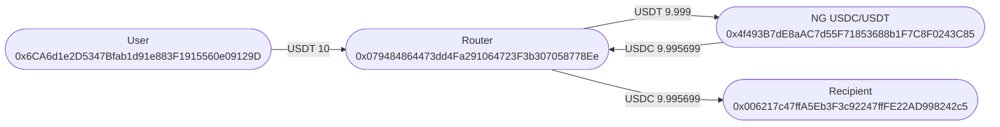
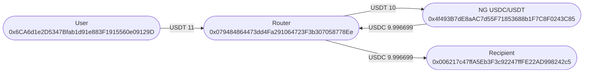
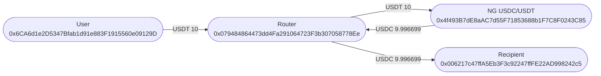
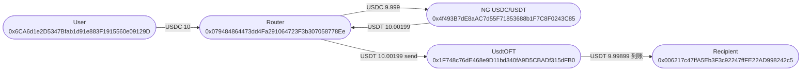
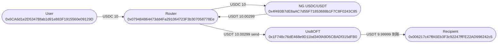
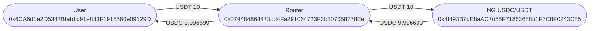
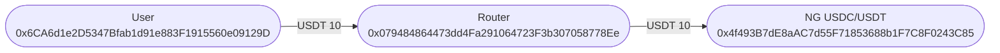
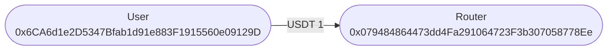
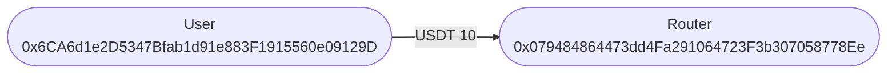

# StablecoinBridgeRouter 小额 fork 测试（旧 trace，勿对照）

下列 traces 为旧 ABI / 旧地址 `0x0794…` 的输出，**不能**用来对接当前主网 Router [`0xcda2c4ea…AD121`](https://etherscan.io/address/0xcda2c4eac941f9d4b6003bceebf3d2c5805ad121#code)（`0x4A760E…` 亦已废弃）。请以 `StablecoinBridgeRouter.md` 与 `test/StablecoinBridgeRouter.small.fork.t.sol` 为准。
本金 **10** USDT/USDC；USDC↔USDT 一律 `swapType=1`（NG，小额协议汇率更好）；比例费 **万分之一**（`feeRate=100`，本金 10 扣 0.001）；固定费 **1**。
跨链仅波场。边上是 Transfer / OFT 到账数量。traces 自动换行。顺序：Rate → Fixed → Free。

---

## 兑换矩阵

|  | 比例费 | 固定费 | 免费 |
|---|---|---|---|
| 只兑 USDT→USDC（NG） | `SwapRate` | `SwapFixed` | `SwapFree` |
| 兑后跨链 USDC→USDT→波场（NG） | `SwapBridgeRate` | `SwapBridgeFixed` | `SwapBridgeFree` |
| 只跨链 USDT | | | `BridgeUsdtFree` |

## 成交汇率（本页 10，一律 NG）

免 Router 费、USDT→USDC：`10 → 9.996699`（约 3.30 bps）。万分之一比例费：进池 9.999，出 `9.995699`。相对 3pool 大额（约 4.15 bps）更好；相对同池 10000 NG（约 3.12 bps）几乎一样、略差一点。USDC→USDT 比例费：9.999 → `10.00199`。池状态会变。

---

## 资金流向图

| 角色 | 地址 |
|---|---|
| User | `0x6CA6d1e2D5347Bfab1d91e883F1915560e09129D` |
| Router | `0x079484864473dd4Fa291064723F3b307058778Ee` |
| NG USDC/USDT | `0x4f493B7dE8aAC7d55F71853688b1F7C8F0243C85` |
| Recipient | `0x006217c47ffA5Eb3F3c92247ffFE22AD998242c5` |
| UsdtOFT | `0x1F748c76dE468e9D11bd340fA9D5CBADf315dFB0` |
| USDT | `0xdAC17F958D2ee523a2206206994597C13D831ec7` |
| USDC | `0xA0b86991c6218b36c1d19D4a2e9Eb0cE3606eB48` |


### `test_Ng_SwapRate`



<details>
<summary><code>forge -vvvv</code> 原样 traces（自动换行）</summary>

<pre style="white-space:pre-wrap;overflow-wrap:anywhere;word-break:break-word;font-family:ui-monospace,SFMono-Regular,Menlo,monospace;font-size:12px;line-height:1.4;max-width:100%;overflow-x:hidden;margin:8px 0 0;">[PASS] test_Ng_SwapRate() (gas: 600855)
Traces:
  [756334] StablecoinBridgeRouterSmallForkTest::test_Ng_SwapRate()
    ├─ [2387] 0x079484864473dd4Fa291064723F3b307058778Ee::owner() [staticcall]
    │   └─ ← [Return] 0x23A755FfB0db88E27E3Ee2b2B254064f2CCf3f53
    ├─ [0] VM::prank(0x23A755FfB0db88E27E3Ee2b2B254064f2CCf3f53)
    │   └─ ← [Return]
    ├─ [25040] 0x079484864473dd4Fa291064723F3b307058778Ee::setFeeInfo(FeeInfo({ feeRate: 100, feeRecipient: 0x006217c47ffA5Eb3F3c92247ffFE22AD998242c5 }))
    │   ├─ emit FeeInfoUpdated(feeRate: 100, feeRecipient: recipient: [0x006217c47ffA5Eb3F3c92247ffFE22AD998242c5])
    │   └─ ← [Stop]
    ├─ [5031] 0xdAC17F958D2ee523a2206206994597C13D831ec7::balanceOf(user: [0x6CA6d1e2D5347Bfab1d91e883F1915560e09129D]) [staticcall]
    │   └─ ← [Return] 0
    ├─ [0] VM::record()
    │   └─ ← [Return]
    ├─ [1031] 0xdAC17F958D2ee523a2206206994597C13D831ec7::balanceOf(user: [0x6CA6d1e2D5347Bfab1d91e883F1915560e09129D]) [staticcall]
    │   └─ ← [Return] 0
    ├─ [0] VM::accesses(0xdAC17F958D2ee523a2206206994597C13D831ec7) [staticcall]
    │   └─ ← [Return] [0x000000000000000000000000000000000000000000000000000000000000000a, 0xa538a16e4df34e4bf499ccf9f74cf244c60a53d9ee86f86dadea15e80aa5f68c], []
    ├─ [0] VM::load(0xdAC17F958D2ee523a2206206994597C13D831ec7, 0xa538a16e4df34e4bf499ccf9f74cf244c60a53d9ee86f86dadea15e80aa5f68c) [staticcall]
    │   └─ ← [Return] 0x0000000000000000000000000000000000000000000000000000000000000000
    ├─ emit WARNING_UninitedSlot(who: 0xdAC17F958D2ee523a2206206994597C13D831ec7, slot: 74731677606831646949679148269468332300218948596556520771794951177379418338956 [7.473e76])
    ├─ [0] VM::load(0xdAC17F958D2ee523a2206206994597C13D831ec7, 0xa538a16e4df34e4bf499ccf9f74cf244c60a53d9ee86f86dadea15e80aa5f68c) [staticcall]
    │   └─ ← [Return] 0x0000000000000000000000000000000000000000000000000000000000000000
    ├─ [1031] 0xdAC17F958D2ee523a2206206994597C13D831ec7::balanceOf(user: [0x6CA6d1e2D5347Bfab1d91e883F1915560e09129D]) [staticcall]
    │   └─ ← [Return] 0
    ├─ [0] VM::store(0xdAC17F958D2ee523a2206206994597C13D831ec7, 0xa538a16e4df34e4bf499ccf9f74cf244c60a53d9ee86f86dadea15e80aa5f68c, 0xffffffffffffffffffffffffffffffffffffffffffffffffffffffffffffffff)
    │   └─ ← [Return]
    ├─ [1031] 0xdAC17F958D2ee523a2206206994597C13D831ec7::balanceOf(user: [0x6CA6d1e2D5347Bfab1d91e883F1915560e09129D]) [staticcall]
    │   └─ ← [Return] 115792089237316195423570985008687907853269984665640564039457584007913129639935 [1.157e77]
    ├─ [0] VM::store(0xdAC17F958D2ee523a2206206994597C13D831ec7, 0xa538a16e4df34e4bf499ccf9f74cf244c60a53d9ee86f86dadea15e80aa5f68c, 0x0000000000000000000000000000000000000000000000000000000000000000)
    │   └─ ← [Return]
    ├─ emit SlotFound(who: 0xdAC17F958D2ee523a2206206994597C13D831ec7, fsig: 0x70a08231, keysHash: 0xb4260ebeada881f749f68942b3f0e36ae8ba2751d11fbbad46a58feb7b4cda51, slot: 74731677606831646949679148269468332300218948596556520771794951177379418338956 [7.473e76])
    ├─ [0] VM::load(0xdAC17F958D2ee523a2206206994597C13D831ec7, 0xa538a16e4df34e4bf499ccf9f74cf244c60a53d9ee86f86dadea15e80aa5f68c) [staticcall]
    │   └─ ← [Return] 0x0000000000000000000000000000000000000000000000000000000000000000
    ├─ [0] VM::store(0xdAC17F958D2ee523a2206206994597C13D831ec7, 0xa538a16e4df34e4bf499ccf9f74cf244c60a53d9ee86f86dadea15e80aa5f68c, 0x0000000000000000000000000000000000000000000000000000000000989680)
    │   └─ ← [Return]
    ├─ [1031] 0xdAC17F958D2ee523a2206206994597C13D831ec7::balanceOf(user: [0x6CA6d1e2D5347Bfab1d91e883F1915560e09129D]) [staticcall]
    │   └─ ← [Return] 10000000 [1e7]
    ├─ [2611] 0xdAC17F958D2ee523a2206206994597C13D831ec7::totalSupply() [staticcall]
    │   └─ ← [Return] 0x0000000000000000000000000000000000000000000000000139b9dd91e94bbb
    ├─ [0] VM::record()
    │   └─ ← [Return]
    ├─ [611] 0xdAC17F958D2ee523a2206206994597C13D831ec7::totalSupply() [staticcall]
    │   └─ ← [Return] 0x0000000000000000000000000000000000000000000000000139b9dd91e94bbb
    ├─ [0] VM::accesses(0xdAC17F958D2ee523a2206206994597C13D831ec7) [staticcall]
    │   └─ ← [Return] [0x000000000000000000000000000000000000000000000000000000000000000a, 0x0000000000000000000000000000000000000000000000000000000000000001], []
    ├─ [0] VM::load(0xdAC17F958D2ee523a2206206994597C13D831ec7, 0x0000000000000000000000000000000000000000000000000000000000000001) [staticcall]
    │   └─ ← [Return] 0x0000000000000000000000000000000000000000000000000139b9dd91e94bbb
    ├─ [0] VM::load(0xdAC17F958D2ee523a2206206994597C13D831ec7, 0x0000000000000000000000000000000000000000000000000000000000000001) [staticcall]
    │   └─ ← [Return] 0x0000000000000000000000000000000000000000000000000139b9dd91e94bbb
    ├─ [611] 0xdAC17F958D2ee523a2206206994597C13D831ec7::totalSupply() [staticcall]
    │   └─ ← [Return] 0x0000000000000000000000000000000000000000000000000139b9dd91e94bbb
    ├─ [0] VM::store(0xdAC17F958D2ee523a2206206994597C13D831ec7, 0x0000000000000000000000000000000000000000000000000000000000000001, 0x0000000000000000000000000000000000000000000000000000000000000000)
    │   └─ ← [Return]
    ├─ [611] 0xdAC17F958D2ee523a2206206994597C13D831ec7::totalSupply() [staticcall]
    │   └─ ← [Return] 0x0000000000000000000000000000000000000000000000000000000000000000
    ├─ [0] VM::store(0xdAC17F958D2ee523a2206206994597C13D831ec7, 0x0000000000000000000000000000000000000000000000000000000000000001, 0x0000000000000000000000000000000000000000000000000139b9dd91e94bbb)
    │   └─ ← [Return]
    ├─ emit SlotFound(who: 0xdAC17F958D2ee523a2206206994597C13D831ec7, fsig: 0x18160ddd, keysHash: 0x290decd9548b62a8d60345a988386fc84ba6bc95484008f6362f93160ef3e563, slot: 1)
    ├─ [0] VM::load(0xdAC17F958D2ee523a2206206994597C13D831ec7, 0x0000000000000000000000000000000000000000000000000000000000000001) [staticcall]
    │   └─ ← [Return] 0x0000000000000000000000000000000000000000000000000139b9dd91e94bbb
    ├─ [0] VM::store(0xdAC17F958D2ee523a2206206994597C13D831ec7, 0x0000000000000000000000000000000000000000000000000000000000000001, 0x0000000000000000000000000000000000000000000000000139b9dd9281e23b)
    │   └─ ← [Return]
    ├─ [611] 0xdAC17F958D2ee523a2206206994597C13D831ec7::totalSupply() [staticcall]
    │   └─ ← [Return] 0x0000000000000000000000000000000000000000000000000139b9dd9281e23b
    ├─ [1031] 0xdAC17F958D2ee523a2206206994597C13D831ec7::balanceOf(user: [0x6CA6d1e2D5347Bfab1d91e883F1915560e09129D]) [staticcall]
    │   └─ ← [Return] 10000000 [1e7]
    ├─ [0] VM::startPrank(user: [0x6CA6d1e2D5347Bfab1d91e883F1915560e09129D])
    │   └─ ← [Return]
    ├─ [4860] 0xdAC17F958D2ee523a2206206994597C13D831ec7::approve(0x079484864473dd4Fa291064723F3b307058778Ee, 0)
    │   ├─ emit Approval(owner: user: [0x6CA6d1e2D5347Bfab1d91e883F1915560e09129D], spender: 0x079484864473dd4Fa291064723F3b307058778Ee, value: 0)
    │   └─ ← [Stop]
    ├─ [22953] 0xdAC17F958D2ee523a2206206994597C13D831ec7::approve(0x079484864473dd4Fa291064723F3b307058778Ee, 10000000 [1e7])
    │   ├─ emit Approval(owner: user: [0x6CA6d1e2D5347Bfab1d91e883F1915560e09129D], spender: 0x079484864473dd4Fa291064723F3b307058778Ee, value: 10000000 [1e7])
    │   └─ ← [Stop]
    ├─ [0] VM::stopPrank()
    │   └─ ← [Return]
    ├─ [58089] 0x079484864473dd4Fa291064723F3b307058778Ee::getAmountOut(SwapParam({ swapType: 1, methodType: 32, fillDeadline: 0, swapFee: 0, tokenIn: 0xdAC17F958D2ee523a2206206994597C13D831ec7, tokenOut: 0xA0b86991c6218b36c1d19D4a2e9Eb0cE3606eB48, recipient: 0x006217c47ffA5Eb3F3c92247ffFE22AD998242c5, amountIn: 10000000 [1e7], minAmountOut: 0, destChainId: 728126428 [7.281e8], destToken: 0x0000000000000000000000000000000000000000, destAmount: 0, nativeFee: 0 })) [staticcall]
    │   ├─ [337] 0x4f493B7dE8aAC7d55F71853688b1F7C8F0243C85::coins(0) [staticcall]
    │   │   └─ ← [Return] 0x000000000000000000000000a0b86991c6218b36c1d19d4a2e9eb0ce3606eb48
    │   ├─ [337] 0x4f493B7dE8aAC7d55F71853688b1F7C8F0243C85::coins(1) [staticcall]
    │   │   └─ ← [Return] 0x000000000000000000000000dac17f958d2ee523a2206206994597c13d831ec7
    │   ├─ [337] 0x4f493B7dE8aAC7d55F71853688b1F7C8F0243C85::coins(0) [staticcall]
    │   │   └─ ← [Return] 0x000000000000000000000000a0b86991c6218b36c1d19d4a2e9eb0ce3606eb48
    │   ├─ [49720] 0x4f493B7dE8aAC7d55F71853688b1F7C8F0243C85::get_dy(1, 0, 9999000 [9.999e6]) [staticcall]
    │   │   ├─ [2221] 0x6A8cbed756804B16E05E741eDaBd5cB544AE21bf::views_implementation() [staticcall]
    │   │   │   └─ ← [Return] 0x000000000000000000000000ff53042865df617de4bb871bd0988e7b93439ccf
    │   │   ├─ [41693] 0xFF53042865dF617de4bB871bD0988E7B93439cCF::get_dy(1, 0, 9999000 [9.999e6], 0x4f493B7dE8aAC7d55F71853688b1F7C8F0243C85) [staticcall]
    │   │   │   ├─ [275] 0x4f493B7dE8aAC7d55F71853688b1F7C8F0243C85::N_COINS() [staticcall]
    │   │   │   │   └─ ← [Return] 0x0000000000000000000000000000000000000000000000000000000000000002
    │   │   │   ├─ [1478] 0x4f493B7dE8aAC7d55F71853688b1F7C8F0243C85::stored_rates() [staticcall]
    │   │   │   │   ├─ [24] PRECOMPILES::identity(0x0000000000000000000000000000000000000000000000000000000000000002000000000000000000000000000000000000000c9f2c9cd04674edea40000000000000000000000000000000000000000000000c9f2c9cd04674edea40000000) [staticcall]
    │   │   │   │   │   └─ ← [Return] 0x0000000000000000000000000000000000000000000000000000000000000002000000000000000000000000000000000000000c9f2c9cd04674edea40000000000000000000000000000000000000000000000c9f2c9cd04674edea40000000
    │   │   │   │   └─ ← [Return] 0x00000000000000000000000000000000000000000000000000000000000000200000000000000000000000000000000000000000000000000000000000000002000000000000000000000000000000000000000c9f2c9cd04674edea40000000000000000000000000000000000000000000000c9f2c9cd04674edea40000000
    │   │   │   ├─ [24] PRECOMPILES::identity(0x0000000000000000000000000000000000000000000000000000000000000002000000000000000000000000000000000000000c9f2c9cd04674edea40000000000000000000000000000000000000000000000c9f2c9cd04674edea40000000) [staticcall]
    │   │   │   │   └─ ← [Return] 0x0000000000000000000000000000000000000000000000000000000000000002000000000000000000000000000000000000000c9f2c9cd04674edea40000000000000000000000000000000000000000000000c9f2c9cd04674edea40000000
    │   │   │   ├─ [24] PRECOMPILES::identity(0x0000000000000000000000000000000000000000000000000000000000000002000000000000000000000000000000000000000c9f2c9cd04674edea40000000000000000000000000000000000000000000000c9f2c9cd04674edea40000000) [staticcall]
    │   │   │   │   └─ ← [Return] 0x0000000000000000000000000000000000000000000000000000000000000002000000000000000000000000000000000000000c9f2c9cd04674edea40000000000000000000000000000000000000000000000c9f2c9cd04674edea40000000
    │   │   │   ├─ [14258] 0x4f493B7dE8aAC7d55F71853688b1F7C8F0243C85::get_balances() [staticcall]
    │   │   │   │   ├─ [24] PRECOMPILES::identity(0x00000000000000000000000000000000000000000000000000000000000000020000000000000000000000000000000000000000000000000000010586deb25c000000000000000000000000000000000000000000000000000004421d2bbed0) [staticcall]
    │   │   │   │   │   └─ ← [Return] 0x00000000000000000000000000000000000000000000000000000000000000020000000000000000000000000000000000000000000000000000010586deb25c000000000000000000000000000000000000000000000000000004421d2bbed0
    │   │   │   │   └─ ← [Return] 0x000000000000000000000000000000000000000000000000000000000000002000000000000000000000000000000000000000000000000000000000000000020000000000000000000000000000000000000000000000000000010586deb25c000000000000000000000000000000000000000000000000000004421d2bbed0
    │   │   │   ├─ [24] PRECOMPILES::identity(0x00000000000000000000000000000000000000000000000000000000000000020000000000000000000000000000000000000000000000000000010586deb25c000000000000000000000000000000000000000000000000000004421d2bbed0) [staticcall]
    │   │   │   │   └─ ← [Return] 0x00000000000000000000000000000000000000000000000000000000000000020000000000000000000000000000000000000000000000000000010586deb25c000000000000000000000000000000000000000000000000000004421d2bbed0
    │   │   │   ├─ [24] PRECOMPILES::identity(0x00000000000000000000000000000000000000000000000000000000000000020000000000000000000000000000000000000000000000000000010586deb25c000000000000000000000000000000000000000000000000000004421d2bbed0) [staticcall]
    │   │   │   │   └─ ← [Return] 0x00000000000000000000000000000000000000000000000000000000000000020000000000000000000000000000000000000000000000000000010586deb25c000000000000000000000000000000000000000000000000000004421d2bbed0
    │   │   │   ├─ [24] PRECOMPILES::identity(0x0000000000000000000000000000000000000000000000000000000000000002000000000000000000000000000000000000000c9f2c9cd04674edea40000000000000000000000000000000000000000000000c9f2c9cd04674edea40000000) [staticcall]
    │   │   │   │   └─ ← [Return] 0x0000000000000000000000000000000000000000000000000000000000000002000000000000000000000000000000000000000c9f2c9cd04674edea40000000000000000000000000000000000000000000000c9f2c9cd04674edea40000000
    │   │   │   ├─ [24] PRECOMPILES::identity(0x00000000000000000000000000000000000000000000000000000000000000020000000000000000000000000000000000000000000000000000010586deb25c000000000000000000000000000000000000000000000000000004421d2bbed0) [staticcall]
    │   │   │   │   └─ ← [Return] 0x00000000000000000000000000000000000000000000000000000000000000020000000000000000000000000000000000000000000000000000010586deb25c000000000000000000000000000000000000000000000000000004421d2bbed0
    │   │   │   ├─ [24] PRECOMPILES::identity(0x000000000000000000000000000000000000000000000000000000000000000200000000000000000000000000000000000000000000eddb7622550b1071c00000000000000000000000000000000000000000000003df73eeae1588f7fd0000) [staticcall]
    │   │   │   │   └─ ← [Return] 0x000000000000000000000000000000000000000000000000000000000000000200000000000000000000000000000000000000000000eddb7622550b1071c00000000000000000000000000000000000000000000003df73eeae1588f7fd0000
    │   │   │   ├─ [24] PRECOMPILES::identity(0x0000000000000000000000000000000000000000000000000000000000000002000000000000000000000000000000000000000c9f2c9cd04674edea40000000000000000000000000000000000000000000000c9f2c9cd04674edea40000000) [staticcall]
    │   │   │   │   └─ ← [Return] 0x0000000000000000000000000000000000000000000000000000000000000002000000000000000000000000000000000000000c9f2c9cd04674edea40000000000000000000000000000000000000000000000c9f2c9cd04674edea40000000
    │   │   │   ├─ [24] PRECOMPILES::identity(0x00000000000000000000000000000000000000000000000000000000000000020000000000000000000000000000000000000000000000000000010586deb25c000000000000000000000000000000000000000000000000000004421d2bbed0) [staticcall]
    │   │   │   │   └─ ← [Return] 0x00000000000000000000000000000000000000000000000000000000000000020000000000000000000000000000000000000000000000000000010586deb25c000000000000000000000000000000000000000000000000000004421d2bbed0
    │   │   │   ├─ [24] PRECOMPILES::identity(0x000000000000000000000000000000000000000000000000000000000000000200000000000000000000000000000000000000000000eddb7622550b1071c00000000000000000000000000000000000000000000003df73eeae1588f7fd0000) [staticcall]
    │   │   │   │   └─ ← [Return] 0x000000000000000000000000000000000000000000000000000000000000000200000000000000000000000000000000000000000000eddb7622550b1071c00000000000000000000000000000000000000000000003df73eeae1588f7fd0000
    │   │   │   ├─ [4590] 0x4f493B7dE8aAC7d55F71853688b1F7C8F0243C85::A() [staticcall]
    │   │   │   │   └─ ← [Return] 0x0000000000000000000000000000000000000000000000000000000000002710
    │   │   │   ├─ [24] PRECOMPILES::identity(0x000000000000000000000000000000000000000000000000000000000000000200000000000000000000000000000000000000000000eddb7622550b1071c00000000000000000000000000000000000000000000003df73eeae1588f7fd0000) [staticcall]
    │   │   │   │   └─ ← [Return] 0x000000000000000000000000000000000000000000000000000000000000000200000000000000000000000000000000000000000000eddb7622550b1071c00000000000000000000000000000000000000000000003df73eeae1588f7fd0000
    │   │   │   ├─ [24] PRECOMPILES::identity(0x000000000000000000000000000000000000000000000000000000000000000200000000000000000000000000000000000000000000eddb7622550b1071c00000000000000000000000000000000000000000000003df73eeae1588f7fd0000) [staticcall]
    │   │   │   │   └─ ← [Return] 0x000000000000000000000000000000000000000000000000000000000000000200000000000000000000000000000000000000000000eddb7622550b1071c00000000000000000000000000000000000000000000003df73eeae1588f7fd0000
    │   │   │   ├─ [2369] 0x4f493B7dE8aAC7d55F71853688b1F7C8F0243C85::fee() [staticcall]
    │   │   │   │   └─ ← [Return] 0x00000000000000000000000000000000000000000000000000000000000186a0
    │   │   │   ├─ [2369] 0x4f493B7dE8aAC7d55F71853688b1F7C8F0243C85::offpeg_fee_multiplier() [staticcall]
    │   │   │   │   └─ ← [Return] 0x0000000000000000000000000000000000000000000000000000002e90edd000
    │   │   │   └─ ← [Return] 0x00000000000000000000000000000000000000000000000000000000009885b3
    │   │   └─ ← [Return] 0x00000000000000000000000000000000000000000000000000000000009885b3
    │   └─ ← [Return] 9995699 [9.995e6]
    ├─ [9839] 0xA0b86991c6218b36c1d19D4a2e9Eb0cE3606eB48::balanceOf(recipient: [0x006217c47ffA5Eb3F3c92247ffFE22AD998242c5]) [staticcall]
    │   ├─ [2553] 0x43506849D7C04F9138D1A2050bbF3A0c054402dd::balanceOf(recipient: [0x006217c47ffA5Eb3F3c92247ffFE22AD998242c5]) [delegatecall]
    │   │   └─ ← [Return] 0
    │   └─ ← [Return] 0
    ├─ [598] 0x079484864473dd4Fa291064723F3b307058778Ee::feeInfo() [staticcall]
    │   └─ ← [Return] FeeInfo({ feeRate: 100, feeRecipient: 0x006217c47ffA5Eb3F3c92247ffFE22AD998242c5 })
    ├─ [0] VM::prank(user: [0x6CA6d1e2D5347Bfab1d91e883F1915560e09129D])
    │   └─ ← [Return]
    ├─ [226469] 0x079484864473dd4Fa291064723F3b307058778Ee::execute(SwapParam({ swapType: 1, methodType: 32, fillDeadline: 0, swapFee: 0, tokenIn: 0xdAC17F958D2ee523a2206206994597C13D831ec7, tokenOut: 0xA0b86991c6218b36c1d19D4a2e9Eb0cE3606eB48, recipient: 0x006217c47ffA5Eb3F3c92247ffFE22AD998242c5, amountIn: 10000000 [1e7], minAmountOut: 9895742 [9.895e6], destChainId: 728126428 [7.281e8], destToken: 0x0000000000000000000000000000000000000000, destAmount: 0, nativeFee: 0 }))
    │   ├─ [35224] 0xdAC17F958D2ee523a2206206994597C13D831ec7::transferFrom(user: [0x6CA6d1e2D5347Bfab1d91e883F1915560e09129D], 0x079484864473dd4Fa291064723F3b307058778Ee, 10000000 [1e7])
    │   │   ├─ emit Transfer(from: user: [0x6CA6d1e2D5347Bfab1d91e883F1915560e09129D], to: 0x079484864473dd4Fa291064723F3b307058778Ee, value: 10000000 [1e7])
    │   │   └─ ← [Stop]
    │   ├─ emit FeeCharged(token: 0xdAC17F958D2ee523a2206206994597C13D831ec7, holder: 0x079484864473dd4Fa291064723F3b307058778Ee, fee: 1000, feeMode: 2)
    │   ├─ [337] 0x4f493B7dE8aAC7d55F71853688b1F7C8F0243C85::coins(0) [staticcall]
    │   │   └─ ← [Return] 0x000000000000000000000000a0b86991c6218b36c1d19d4a2e9eb0ce3606eb48
    │   ├─ [337] 0x4f493B7dE8aAC7d55F71853688b1F7C8F0243C85::coins(1) [staticcall]
    │   │   └─ ← [Return] 0x000000000000000000000000dac17f958d2ee523a2206206994597c13d831ec7
    │   ├─ [337] 0x4f493B7dE8aAC7d55F71853688b1F7C8F0243C85::coins(0) [staticcall]
    │   │   └─ ← [Return] 0x000000000000000000000000a0b86991c6218b36c1d19d4a2e9eb0ce3606eb48
    │   ├─ [4860] 0xdAC17F958D2ee523a2206206994597C13D831ec7::approve(0x4f493B7dE8aAC7d55F71853688b1F7C8F0243C85, 0)
    │   │   ├─ emit Approval(owner: 0x079484864473dd4Fa291064723F3b307058778Ee, spender: 0x4f493B7dE8aAC7d55F71853688b1F7C8F0243C85, value: 0)
    │   │   └─ ← [Stop]
    │   ├─ [22953] 0xdAC17F958D2ee523a2206206994597C13D831ec7::approve(0x4f493B7dE8aAC7d55F71853688b1F7C8F0243C85, 9999000 [9.999e6])
    │   │   ├─ emit Approval(owner: 0x079484864473dd4Fa291064723F3b307058778Ee, spender: 0x4f493B7dE8aAC7d55F71853688b1F7C8F0243C85, value: 9999000 [9.999e6])
    │   │   └─ ← [Stop]
    │   ├─ [3339] 0xA0b86991c6218b36c1d19D4a2e9Eb0cE3606eB48::balanceOf(0x079484864473dd4Fa291064723F3b307058778Ee) [staticcall]
    │   │   ├─ [2553] 0x43506849D7C04F9138D1A2050bbF3A0c054402dd::balanceOf(0x079484864473dd4Fa291064723F3b307058778Ee) [delegatecall]
    │   │   │   └─ ← [Return] 0
    │   │   └─ ← [Return] 0
    │   ├─ [111126] 0x4f493B7dE8aAC7d55F71853688b1F7C8F0243C85::exchange(1, 0, 9999000 [9.999e6], 9895742 [9.895e6], 0x079484864473dd4Fa291064723F3b307058778Ee)
    │   │   ├─ [24] PRECOMPILES::identity(0x0000000000000000000000000000000000000000000000000000000000000002000000000000000000000000000000000000000c9f2c9cd04674edea40000000000000000000000000000000000000000000000c9f2c9cd04674edea40000000) [staticcall]
    │   │   │   └─ ← [Return] 0x0000000000000000000000000000000000000000000000000000000000000002000000000000000000000000000000000000000c9f2c9cd04674edea40000000000000000000000000000000000000000000000c9f2c9cd04674edea40000000
    │   │   ├─ [24] PRECOMPILES::identity(0x0000000000000000000000000000000000000000000000000000000000000002000000000000000000000000000000000000000c9f2c9cd04674edea40000000000000000000000000000000000000000000000c9f2c9cd04674edea40000000) [staticcall]
    │   │   │   └─ ← [Return] 0x0000000000000000000000000000000000000000000000000000000000000002000000000000000000000000000000000000000c9f2c9cd04674edea40000000000000000000000000000000000000000000000c9f2c9cd04674edea40000000
    │   │   ├─ [24] PRECOMPILES::identity(0x00000000000000000000000000000000000000000000000000000000000000020000000000000000000000000000000000000000000000000000010586deb25c000000000000000000000000000000000000000000000000000004421d2bbed0) [staticcall]
    │   │   │   └─ ← [Return] 0x00000000000000000000000000000000000000000000000000000000000000020000000000000000000000000000000000000000000000000000010586deb25c000000000000000000000000000000000000000000000000000004421d2bbed0
    │   │   ├─ [24] PRECOMPILES::identity(0x00000000000000000000000000000000000000000000000000000000000000020000000000000000000000000000000000000000000000000000010586deb25c000000000000000000000000000000000000000000000000000004421d2bbed0) [staticcall]
    │   │   │   └─ ← [Return] 0x00000000000000000000000000000000000000000000000000000000000000020000000000000000000000000000000000000000000000000000010586deb25c000000000000000000000000000000000000000000000000000004421d2bbed0
    │   │   ├─ [24] PRECOMPILES::identity(0x0000000000000000000000000000000000000000000000000000000000000002000000000000000000000000000000000000000c9f2c9cd04674edea40000000000000000000000000000000000000000000000c9f2c9cd04674edea40000000) [staticcall]
    │   │   │   └─ ← [Return] 0x0000000000000000000000000000000000000000000000000000000000000002000000000000000000000000000000000000000c9f2c9cd04674edea40000000000000000000000000000000000000000000000c9f2c9cd04674edea40000000
    │   │   ├─ [24] PRECOMPILES::identity(0x00000000000000000000000000000000000000000000000000000000000000020000000000000000000000000000000000000000000000000000010586deb25c000000000000000000000000000000000000000000000000000004421d2bbed0) [staticcall]
    │   │   │   └─ ← [Return] 0x00000000000000000000000000000000000000000000000000000000000000020000000000000000000000000000000000000000000000000000010586deb25c000000000000000000000000000000000000000000000000000004421d2bbed0
    │   │   ├─ [24] PRECOMPILES::identity(0x000000000000000000000000000000000000000000000000000000000000000200000000000000000000000000000000000000000000eddb7622550b1071c00000000000000000000000000000000000000000000003df73eeae1588f7fd0000) [staticcall]
    │   │   │   └─ ← [Return] 0x000000000000000000000000000000000000000000000000000000000000000200000000000000000000000000000000000000000000eddb7622550b1071c00000000000000000000000000000000000000000000003df73eeae1588f7fd0000
    │   │   ├─ [24] PRECOMPILES::identity(0x000000000000000000000000000000000000000000000000000000000000000200000000000000000000000000000000000000000000eddb7622550b1071c00000000000000000000000000000000000000000000003df73eeae1588f7fd0000) [staticcall]
    │   │   │   └─ ← [Return] 0x000000000000000000000000000000000000000000000000000000000000000200000000000000000000000000000000000000000000eddb7622550b1071c00000000000000000000000000000000000000000000003df73eeae1588f7fd0000
    │   │   ├─ [3031] 0xdAC17F958D2ee523a2206206994597C13D831ec7::balanceOf(0x4f493B7dE8aAC7d55F71853688b1F7C8F0243C85) [staticcall]
    │   │   │   └─ ← [Return] 4682010022170 [4.682e12]
    │   │   ├─ [10124] 0xdAC17F958D2ee523a2206206994597C13D831ec7::transferFrom(0x079484864473dd4Fa291064723F3b307058778Ee, 0x4f493B7dE8aAC7d55F71853688b1F7C8F0243C85, 9999000 [9.999e6])
    │   │   │   ├─ emit Transfer(from: 0x079484864473dd4Fa291064723F3b307058778Ee, to: 0x4f493B7dE8aAC7d55F71853688b1F7C8F0243C85, value: 9999000 [9.999e6])
    │   │   │   └─ ← [Stop]
    │   │   ├─ [1031] 0xdAC17F958D2ee523a2206206994597C13D831ec7::balanceOf(0x4f493B7dE8aAC7d55F71853688b1F7C8F0243C85) [staticcall]
    │   │   │   └─ ← [Return] 4682020021170 [4.682e12]
    │   │   ├─ [24] PRECOMPILES::identity(0x000000000000000000000000000000000000000000000000000000000000000200000000000000000000000000000000000000000000eddb7622550b1071c00000000000000000000000000000000000000000000003df73eeae1588f7fd0000) [staticcall]
    │   │   │   └─ ← [Return] 0x000000000000000000000000000000000000000000000000000000000000000200000000000000000000000000000000000000000000eddb7622550b1071c00000000000000000000000000000000000000000000003df73eeae1588f7fd0000
    │   │   ├─ [24] PRECOMPILES::identity(0x0000000000000000000000000000000000000000000000000000000000000002000000000000000000000000000000000000000c9f2c9cd04674edea40000000000000000000000000000000000000000000000c9f2c9cd04674edea40000000) [staticcall]
    │   │   │   └─ ← [Return] 0x0000000000000000000000000000000000000000000000000000000000000002000000000000000000000000000000000000000c9f2c9cd04674edea40000000000000000000000000000000000000000000000c9f2c9cd04674edea40000000
    │   │   ├─ [24] PRECOMPILES::identity(0x000000000000000000000000000000000000000000000000000000000000000200000000000000000000000000000000000000000000eddb7622550b1071c00000000000000000000000000000000000000000000003df73eeae1588f7fd0000) [staticcall]
    │   │   │   └─ ← [Return] 0x000000000000000000000000000000000000000000000000000000000000000200000000000000000000000000000000000000000000eddb7622550b1071c00000000000000000000000000000000000000000000003df73eeae1588f7fd0000
    │   │   ├─ [24] PRECOMPILES::identity(0x000000000000000000000000000000000000000000000000000000000000000200000000000000000000000000000000000000000000eddb7622550b1071c00000000000000000000000000000000000000000000003df73eeae1588f7fd0000) [staticcall]
    │   │   │   └─ ← [Return] 0x000000000000000000000000000000000000000000000000000000000000000200000000000000000000000000000000000000000000eddb7622550b1071c00000000000000000000000000000000000000000000003df73eeae1588f7fd0000
    │   │   ├─ [24] PRECOMPILES::identity(0x000000000000000000000000000000000000000000000000000000000000000200000000000000000000000000000000000000000000eddb7622550b1071c00000000000000000000000000000000000000000000003df73eeae1588f7fd0000) [staticcall]
    │   │   │   └─ ← [Return] 0x000000000000000000000000000000000000000000000000000000000000000200000000000000000000000000000000000000000000eddb7622550b1071c00000000000000000000000000000000000000000000003df73eeae1588f7fd0000
    │   │   ├─ [24] PRECOMPILES::identity(0x000000000000000000000000000000000000000000000000000000000000000200000000000000000000000000000000000000000000eddaeb69ebba87c1ae3100000000000000000000000000000000000000000003df747971ab0edd1e8000) [staticcall]
    │   │   │   └─ ← [Return] 0x000000000000000000000000000000000000000000000000000000000000000200000000000000000000000000000000000000000000eddaeb69ebba87c1ae3100000000000000000000000000000000000000000003df747971ab0edd1e8000
    │   │   ├─ [21] PRECOMPILES::identity(0x000000000000000000000000000000000000000000000000000000006aa3d56f000000000000000000000000000000000000000000000000000000006aa3d56f) [staticcall]
    │   │   │   └─ ← [Return] 0x000000000000000000000000000000000000000000000000000000006aa3d56f000000000000000000000000000000000000000000000000000000006aa3d56f
    │   │   ├─ [21] PRECOMPILES::identity(0x000000000000000000000000000000000000000000000000000000000000000100000000000000000ddf9fd89fa6eaf300000000000000000ddf98a7b21868e4) [staticcall]
    │   │   │   └─ ← [Return] 0x000000000000000000000000000000000000000000000000000000000000000100000000000000000ddf9fd89fa6eaf300000000000000000ddf98a7b21868e4
    │   │   ├─ [24] PRECOMPILES::identity(0x000000000000000000000000000000000000000000000000000000000000000200000000000000000000000000000000000000000000eddaeb69ebba87c1ae3100000000000000000000000000000000000000000003df747971ab0edd1e8000) [staticcall]
    │   │   │   └─ ← [Return] 0x000000000000000000000000000000000000000000000000000000000000000200000000000000000000000000000000000000000000eddaeb69ebba87c1ae3100000000000000000000000000000000000000000003df747971ab0edd1e8000
    │   │   ├─ [21] PRECOMPILES::identity(0x00000000000000000000000000000000000000000000000000000000000000010000000000000000000000000000000000000000000000000ddf98a64b4c225d) [staticcall]
    │   │   │   └─ ← [Return] 0x00000000000000000000000000000000000000000000000000000000000000010000000000000000000000000000000000000000000000000ddf98a64b4c225d
    │   │   ├─ [21] PRECOMPILES::identity(0x00000000000000000000000000000000000000000000000000000000000000010000000000000000000000000000000000000000000000000ddf98a64b4c225d) [staticcall]
    │   │   │   └─ ← [Return] 0x00000000000000000000000000000000000000000000000000000000000000010000000000000000000000000000000000000000000000000ddf98a64b4c225d
    │   │   ├─ [21] PRECOMPILES::identity(0x0000000000000000000000000000000000000000000000000ddf98a64b4c225d0000000000000000000000000000000000000000000000000ddf9ebe9b8410cc) [staticcall]
    │   │   │   └─ ← [Return] 0x0000000000000000000000000000000000000000000000000ddf98a64b4c225d0000000000000000000000000000000000000000000000000ddf9ebe9b8410cc
    │   │   ├─ [21] PRECOMPILES::identity(0x00000000000000000000000000000000000000000004cd45ec1eb87a30836d7d000000000000000000000000000000000000000000046a301defca8389f905c2) [staticcall]
    │   │   │   └─ ← [Return] 0x00000000000000000000000000000000000000000004cd45ec1eb87a30836d7d000000000000000000000000000000000000000000046a301defca8389f905c2
    │   │   ├─ [32152] 0xA0b86991c6218b36c1d19D4a2e9Eb0cE3606eB48::transfer(0x079484864473dd4Fa291064723F3b307058778Ee, 9995699 [9.995e6])
    │   │   │   ├─ [31363] 0x43506849D7C04F9138D1A2050bbF3A0c054402dd::transfer(0x079484864473dd4Fa291064723F3b307058778Ee, 9995699 [9.995e6]) [delegatecall]
    │   │   │   │   ├─ emit Transfer(from: 0x4f493B7dE8aAC7d55F71853688b1F7C8F0243C85, to: 0x079484864473dd4Fa291064723F3b307058778Ee, value: 9995699 [9.995e6])
    │   │   │   │   └─ ← [Return] 0x0000000000000000000000000000000000000000000000000000000000000001
    │   │   │   └─ ← [Return] 0x0000000000000000000000000000000000000000000000000000000000000001
    │   │   ├─ emit TokenExchange(param0: 0x079484864473dd4Fa291064723F3b307058778Ee, param1: 1, param2: 9999000 [9.999e6], param3: 0, param4: 9995699 [9.995e6])
    │   │   └─ ← [Return] 0x00000000000000000000000000000000000000000000000000000000009885b3
    │   ├─ [1339] 0xA0b86991c6218b36c1d19D4a2e9Eb0cE3606eB48::balanceOf(0x079484864473dd4Fa291064723F3b307058778Ee) [staticcall]
    │   │   ├─ [553] 0x43506849D7C04F9138D1A2050bbF3A0c054402dd::balanceOf(0x079484864473dd4Fa291064723F3b307058778Ee) [delegatecall]
    │   │   │   └─ ← [Return] 9995699 [9.995e6]
    │   │   └─ ← [Return] 9995699 [9.995e6]
    │   ├─ [2760] 0xdAC17F958D2ee523a2206206994597C13D831ec7::approve(0x4f493B7dE8aAC7d55F71853688b1F7C8F0243C85, 0)
    │   │   ├─ emit Approval(owner: 0x079484864473dd4Fa291064723F3b307058778Ee, spender: 0x4f493B7dE8aAC7d55F71853688b1F7C8F0243C85, value: 0)
    │   │   └─ ← [Stop]
    │   ├─ emit Swap(sender: user: [0x6CA6d1e2D5347Bfab1d91e883F1915560e09129D], recipient: recipient: [0x006217c47ffA5Eb3F3c92247ffFE22AD998242c5], pool: 0x4f493B7dE8aAC7d55F71853688b1F7C8F0243C85, tokenIn: 0xdAC17F958D2ee523a2206206994597C13D831ec7, tokenOut: 0xA0b86991c6218b36c1d19D4a2e9Eb0cE3606eB48, amountIn: 9999000 [9.999e6], amountOut: 9995699 [9.995e6])
    │   ├─ [25352] 0xA0b86991c6218b36c1d19D4a2e9Eb0cE3606eB48::transfer(recipient: [0x006217c47ffA5Eb3F3c92247ffFE22AD998242c5], 9995699 [9.995e6])
    │   │   ├─ [24563] 0x43506849D7C04F9138D1A2050bbF3A0c054402dd::transfer(recipient: [0x006217c47ffA5Eb3F3c92247ffFE22AD998242c5], 9995699 [9.995e6]) [delegatecall]
    │   │   │   ├─ emit Transfer(from: 0x079484864473dd4Fa291064723F3b307058778Ee, to: recipient: [0x006217c47ffA5Eb3F3c92247ffFE22AD998242c5], value: 9995699 [9.995e6])
    │   │   │   └─ ← [Return] 0x0000000000000000000000000000000000000000000000000000000000000001
    │   │   └─ ← [Return] 0x0000000000000000000000000000000000000000000000000000000000000001
    │   └─ ← [Return] 9995699 [9.995e6]
    ├─ [0] VM::assertApproxEqAbs(9995699 [9.995e6], 9995699 [9.995e6], 2) [staticcall]
    │   └─ ← [Return]
    ├─ [1339] 0xA0b86991c6218b36c1d19D4a2e9Eb0cE3606eB48::balanceOf(recipient: [0x006217c47ffA5Eb3F3c92247ffFE22AD998242c5]) [staticcall]
    │   ├─ [553] 0x43506849D7C04F9138D1A2050bbF3A0c054402dd::balanceOf(recipient: [0x006217c47ffA5Eb3F3c92247ffFE22AD998242c5]) [delegatecall]
    │   │   └─ ← [Return] 9995699 [9.995e6]
    │   └─ ← [Return] 9995699 [9.995e6]
    ├─ [1031] 0xdAC17F958D2ee523a2206206994597C13D831ec7::balanceOf(0x079484864473dd4Fa291064723F3b307058778Ee) [staticcall]
    │   └─ ← [Return] 1000
    └─ ← [Return]
</pre>
</details>

### `test_Ng_SwapFixed`



<details>
<summary><code>forge -vvvv</code> 原样 traces（自动换行）</summary>

<pre style="white-space:pre-wrap;overflow-wrap:anywhere;word-break:break-word;font-family:ui-monospace,SFMono-Regular,Menlo,monospace;font-size:12px;line-height:1.4;max-width:100%;overflow-x:hidden;margin:8px 0 0;">[PASS] test_Ng_SwapFixed() (gas: 576342)
Traces:
  [725693] StablecoinBridgeRouterSmallForkTest::test_Ng_SwapFixed()
    ├─ [5031] 0xdAC17F958D2ee523a2206206994597C13D831ec7::balanceOf(user: [0x6CA6d1e2D5347Bfab1d91e883F1915560e09129D]) [staticcall]
    │   └─ ← [Return] 0
    ├─ [0] VM::record()
    │   └─ ← [Return]
    ├─ [1031] 0xdAC17F958D2ee523a2206206994597C13D831ec7::balanceOf(user: [0x6CA6d1e2D5347Bfab1d91e883F1915560e09129D]) [staticcall]
    │   └─ ← [Return] 0
    ├─ [0] VM::accesses(0xdAC17F958D2ee523a2206206994597C13D831ec7) [staticcall]
    │   └─ ← [Return] [0x000000000000000000000000000000000000000000000000000000000000000a, 0xa538a16e4df34e4bf499ccf9f74cf244c60a53d9ee86f86dadea15e80aa5f68c], []
    ├─ [0] VM::load(0xdAC17F958D2ee523a2206206994597C13D831ec7, 0xa538a16e4df34e4bf499ccf9f74cf244c60a53d9ee86f86dadea15e80aa5f68c) [staticcall]
    │   └─ ← [Return] 0x0000000000000000000000000000000000000000000000000000000000000000
    ├─ emit WARNING_UninitedSlot(who: 0xdAC17F958D2ee523a2206206994597C13D831ec7, slot: 74731677606831646949679148269468332300218948596556520771794951177379418338956 [7.473e76])
    ├─ [0] VM::load(0xdAC17F958D2ee523a2206206994597C13D831ec7, 0xa538a16e4df34e4bf499ccf9f74cf244c60a53d9ee86f86dadea15e80aa5f68c) [staticcall]
    │   └─ ← [Return] 0x0000000000000000000000000000000000000000000000000000000000000000
    ├─ [1031] 0xdAC17F958D2ee523a2206206994597C13D831ec7::balanceOf(user: [0x6CA6d1e2D5347Bfab1d91e883F1915560e09129D]) [staticcall]
    │   └─ ← [Return] 0
    ├─ [0] VM::store(0xdAC17F958D2ee523a2206206994597C13D831ec7, 0xa538a16e4df34e4bf499ccf9f74cf244c60a53d9ee86f86dadea15e80aa5f68c, 0xffffffffffffffffffffffffffffffffffffffffffffffffffffffffffffffff)
    │   └─ ← [Return]
    ├─ [1031] 0xdAC17F958D2ee523a2206206994597C13D831ec7::balanceOf(user: [0x6CA6d1e2D5347Bfab1d91e883F1915560e09129D]) [staticcall]
    │   └─ ← [Return] 115792089237316195423570985008687907853269984665640564039457584007913129639935 [1.157e77]
    ├─ [0] VM::store(0xdAC17F958D2ee523a2206206994597C13D831ec7, 0xa538a16e4df34e4bf499ccf9f74cf244c60a53d9ee86f86dadea15e80aa5f68c, 0x0000000000000000000000000000000000000000000000000000000000000000)
    │   └─ ← [Return]
    ├─ emit SlotFound(who: 0xdAC17F958D2ee523a2206206994597C13D831ec7, fsig: 0x70a08231, keysHash: 0xb4260ebeada881f749f68942b3f0e36ae8ba2751d11fbbad46a58feb7b4cda51, slot: 74731677606831646949679148269468332300218948596556520771794951177379418338956 [7.473e76])
    ├─ [0] VM::load(0xdAC17F958D2ee523a2206206994597C13D831ec7, 0xa538a16e4df34e4bf499ccf9f74cf244c60a53d9ee86f86dadea15e80aa5f68c) [staticcall]
    │   └─ ← [Return] 0x0000000000000000000000000000000000000000000000000000000000000000
    ├─ [0] VM::store(0xdAC17F958D2ee523a2206206994597C13D831ec7, 0xa538a16e4df34e4bf499ccf9f74cf244c60a53d9ee86f86dadea15e80aa5f68c, 0x0000000000000000000000000000000000000000000000000000000000a7d8c0)
    │   └─ ← [Return]
    ├─ [1031] 0xdAC17F958D2ee523a2206206994597C13D831ec7::balanceOf(user: [0x6CA6d1e2D5347Bfab1d91e883F1915560e09129D]) [staticcall]
    │   └─ ← [Return] 11000000 [1.1e7]
    ├─ [2611] 0xdAC17F958D2ee523a2206206994597C13D831ec7::totalSupply() [staticcall]
    │   └─ ← [Return] 0x0000000000000000000000000000000000000000000000000139b9dd91e94bbb
    ├─ [0] VM::record()
    │   └─ ← [Return]
    ├─ [611] 0xdAC17F958D2ee523a2206206994597C13D831ec7::totalSupply() [staticcall]
    │   └─ ← [Return] 0x0000000000000000000000000000000000000000000000000139b9dd91e94bbb
    ├─ [0] VM::accesses(0xdAC17F958D2ee523a2206206994597C13D831ec7) [staticcall]
    │   └─ ← [Return] [0x000000000000000000000000000000000000000000000000000000000000000a, 0x0000000000000000000000000000000000000000000000000000000000000001], []
    ├─ [0] VM::load(0xdAC17F958D2ee523a2206206994597C13D831ec7, 0x0000000000000000000000000000000000000000000000000000000000000001) [staticcall]
    │   └─ ← [Return] 0x0000000000000000000000000000000000000000000000000139b9dd91e94bbb
    ├─ [0] VM::load(0xdAC17F958D2ee523a2206206994597C13D831ec7, 0x0000000000000000000000000000000000000000000000000000000000000001) [staticcall]
    │   └─ ← [Return] 0x0000000000000000000000000000000000000000000000000139b9dd91e94bbb
    ├─ [611] 0xdAC17F958D2ee523a2206206994597C13D831ec7::totalSupply() [staticcall]
    │   └─ ← [Return] 0x0000000000000000000000000000000000000000000000000139b9dd91e94bbb
    ├─ [0] VM::store(0xdAC17F958D2ee523a2206206994597C13D831ec7, 0x0000000000000000000000000000000000000000000000000000000000000001, 0x0000000000000000000000000000000000000000000000000000000000000000)
    │   └─ ← [Return]
    ├─ [611] 0xdAC17F958D2ee523a2206206994597C13D831ec7::totalSupply() [staticcall]
    │   └─ ← [Return] 0x0000000000000000000000000000000000000000000000000000000000000000
    ├─ [0] VM::store(0xdAC17F958D2ee523a2206206994597C13D831ec7, 0x0000000000000000000000000000000000000000000000000000000000000001, 0x0000000000000000000000000000000000000000000000000139b9dd91e94bbb)
    │   └─ ← [Return]
    ├─ emit SlotFound(who: 0xdAC17F958D2ee523a2206206994597C13D831ec7, fsig: 0x18160ddd, keysHash: 0x290decd9548b62a8d60345a988386fc84ba6bc95484008f6362f93160ef3e563, slot: 1)
    ├─ [0] VM::load(0xdAC17F958D2ee523a2206206994597C13D831ec7, 0x0000000000000000000000000000000000000000000000000000000000000001) [staticcall]
    │   └─ ← [Return] 0x0000000000000000000000000000000000000000000000000139b9dd91e94bbb
    ├─ [0] VM::store(0xdAC17F958D2ee523a2206206994597C13D831ec7, 0x0000000000000000000000000000000000000000000000000000000000000001, 0x0000000000000000000000000000000000000000000000000139b9dd9291247b)
    │   └─ ← [Return]
    ├─ [611] 0xdAC17F958D2ee523a2206206994597C13D831ec7::totalSupply() [staticcall]
    │   └─ ← [Return] 0x0000000000000000000000000000000000000000000000000139b9dd9291247b
    ├─ [1031] 0xdAC17F958D2ee523a2206206994597C13D831ec7::balanceOf(user: [0x6CA6d1e2D5347Bfab1d91e883F1915560e09129D]) [staticcall]
    │   └─ ← [Return] 11000000 [1.1e7]
    ├─ [0] VM::startPrank(user: [0x6CA6d1e2D5347Bfab1d91e883F1915560e09129D])
    │   └─ ← [Return]
    ├─ [4860] 0xdAC17F958D2ee523a2206206994597C13D831ec7::approve(0x079484864473dd4Fa291064723F3b307058778Ee, 0)
    │   ├─ emit Approval(owner: user: [0x6CA6d1e2D5347Bfab1d91e883F1915560e09129D], spender: 0x079484864473dd4Fa291064723F3b307058778Ee, value: 0)
    │   └─ ← [Stop]
    ├─ [22953] 0xdAC17F958D2ee523a2206206994597C13D831ec7::approve(0x079484864473dd4Fa291064723F3b307058778Ee, 11000000 [1.1e7])
    │   ├─ emit Approval(owner: user: [0x6CA6d1e2D5347Bfab1d91e883F1915560e09129D], spender: 0x079484864473dd4Fa291064723F3b307058778Ee, value: 11000000 [1.1e7])
    │   └─ ← [Stop]
    ├─ [0] VM::stopPrank()
    │   └─ ← [Return]
    ├─ [58177] 0x079484864473dd4Fa291064723F3b307058778Ee::getAmountOut(SwapParam({ swapType: 1, methodType: 16, fillDeadline: 0, swapFee: 1000000 [1e6], tokenIn: 0xdAC17F958D2ee523a2206206994597C13D831ec7, tokenOut: 0xA0b86991c6218b36c1d19D4a2e9Eb0cE3606eB48, recipient: 0x006217c47ffA5Eb3F3c92247ffFE22AD998242c5, amountIn: 11000000 [1.1e7], minAmountOut: 0, destChainId: 728126428 [7.281e8], destToken: 0x0000000000000000000000000000000000000000, destAmount: 0, nativeFee: 0 })) [staticcall]
    │   ├─ [337] 0x4f493B7dE8aAC7d55F71853688b1F7C8F0243C85::coins(0) [staticcall]
    │   │   └─ ← [Return] 0x000000000000000000000000a0b86991c6218b36c1d19d4a2e9eb0ce3606eb48
    │   ├─ [337] 0x4f493B7dE8aAC7d55F71853688b1F7C8F0243C85::coins(1) [staticcall]
    │   │   └─ ← [Return] 0x000000000000000000000000dac17f958d2ee523a2206206994597c13d831ec7
    │   ├─ [337] 0x4f493B7dE8aAC7d55F71853688b1F7C8F0243C85::coins(0) [staticcall]
    │   │   └─ ← [Return] 0x000000000000000000000000a0b86991c6218b36c1d19d4a2e9eb0ce3606eb48
    │   ├─ [50181] 0x4f493B7dE8aAC7d55F71853688b1F7C8F0243C85::get_dy(1, 0, 10000000 [1e7]) [staticcall]
    │   │   ├─ [2221] 0x6A8cbed756804B16E05E741eDaBd5cB544AE21bf::views_implementation() [staticcall]
    │   │   │   └─ ← [Return] 0x000000000000000000000000ff53042865df617de4bb871bd0988e7b93439ccf
    │   │   ├─ [42154] 0xFF53042865dF617de4bB871bD0988E7B93439cCF::get_dy(1, 0, 10000000 [1e7], 0x4f493B7dE8aAC7d55F71853688b1F7C8F0243C85) [staticcall]
    │   │   │   ├─ [275] 0x4f493B7dE8aAC7d55F71853688b1F7C8F0243C85::N_COINS() [staticcall]
    │   │   │   │   └─ ← [Return] 0x0000000000000000000000000000000000000000000000000000000000000002
    │   │   │   ├─ [1478] 0x4f493B7dE8aAC7d55F71853688b1F7C8F0243C85::stored_rates() [staticcall]
    │   │   │   │   ├─ [24] PRECOMPILES::identity(0x0000000000000000000000000000000000000000000000000000000000000002000000000000000000000000000000000000000c9f2c9cd04674edea40000000000000000000000000000000000000000000000c9f2c9cd04674edea40000000) [staticcall]
    │   │   │   │   │   └─ ← [Return] 0x0000000000000000000000000000000000000000000000000000000000000002000000000000000000000000000000000000000c9f2c9cd04674edea40000000000000000000000000000000000000000000000c9f2c9cd04674edea40000000
    │   │   │   │   └─ ← [Return] 0x00000000000000000000000000000000000000000000000000000000000000200000000000000000000000000000000000000000000000000000000000000002000000000000000000000000000000000000000c9f2c9cd04674edea40000000000000000000000000000000000000000000000c9f2c9cd04674edea40000000
    │   │   │   ├─ [24] PRECOMPILES::identity(0x0000000000000000000000000000000000000000000000000000000000000002000000000000000000000000000000000000000c9f2c9cd04674edea40000000000000000000000000000000000000000000000c9f2c9cd04674edea40000000) [staticcall]
    │   │   │   │   └─ ← [Return] 0x0000000000000000000000000000000000000000000000000000000000000002000000000000000000000000000000000000000c9f2c9cd04674edea40000000000000000000000000000000000000000000000c9f2c9cd04674edea40000000
    │   │   │   ├─ [24] PRECOMPILES::identity(0x0000000000000000000000000000000000000000000000000000000000000002000000000000000000000000000000000000000c9f2c9cd04674edea40000000000000000000000000000000000000000000000c9f2c9cd04674edea40000000) [staticcall]
    │   │   │   │   └─ ← [Return] 0x0000000000000000000000000000000000000000000000000000000000000002000000000000000000000000000000000000000c9f2c9cd04674edea40000000000000000000000000000000000000000000000c9f2c9cd04674edea40000000
    │   │   │   ├─ [14258] 0x4f493B7dE8aAC7d55F71853688b1F7C8F0243C85::get_balances() [staticcall]
    │   │   │   │   ├─ [24] PRECOMPILES::identity(0x00000000000000000000000000000000000000000000000000000000000000020000000000000000000000000000000000000000000000000000010586deb25c000000000000000000000000000000000000000000000000000004421d2bbed0) [staticcall]
    │   │   │   │   │   └─ ← [Return] 0x00000000000000000000000000000000000000000000000000000000000000020000000000000000000000000000000000000000000000000000010586deb25c000000000000000000000000000000000000000000000000000004421d2bbed0
    │   │   │   │   └─ ← [Return] 0x000000000000000000000000000000000000000000000000000000000000002000000000000000000000000000000000000000000000000000000000000000020000000000000000000000000000000000000000000000000000010586deb25c000000000000000000000000000000000000000000000000000004421d2bbed0
    │   │   │   ├─ [24] PRECOMPILES::identity(0x00000000000000000000000000000000000000000000000000000000000000020000000000000000000000000000000000000000000000000000010586deb25c000000000000000000000000000000000000000000000000000004421d2bbed0) [staticcall]
    │   │   │   │   └─ ← [Return] 0x00000000000000000000000000000000000000000000000000000000000000020000000000000000000000000000000000000000000000000000010586deb25c000000000000000000000000000000000000000000000000000004421d2bbed0
    │   │   │   ├─ [24] PRECOMPILES::identity(0x00000000000000000000000000000000000000000000000000000000000000020000000000000000000000000000000000000000000000000000010586deb25c000000000000000000000000000000000000000000000000000004421d2bbed0) [staticcall]
    │   │   │   │   └─ ← [Return] 0x00000000000000000000000000000000000000000000000000000000000000020000000000000000000000000000000000000000000000000000010586deb25c000000000000000000000000000000000000000000000000000004421d2bbed0
    │   │   │   ├─ [24] PRECOMPILES::identity(0x0000000000000000000000000000000000000000000000000000000000000002000000000000000000000000000000000000000c9f2c9cd04674edea40000000000000000000000000000000000000000000000c9f2c9cd04674edea40000000) [staticcall]
    │   │   │   │   └─ ← [Return] 0x0000000000000000000000000000000000000000000000000000000000000002000000000000000000000000000000000000000c9f2c9cd04674edea40000000000000000000000000000000000000000000000c9f2c9cd04674edea40000000
    │   │   │   ├─ [24] PRECOMPILES::identity(0x00000000000000000000000000000000000000000000000000000000000000020000000000000000000000000000000000000000000000000000010586deb25c000000000000000000000000000000000000000000000000000004421d2bbed0) [staticcall]
    │   │   │   │   └─ ← [Return] 0x00000000000000000000000000000000000000000000000000000000000000020000000000000000000000000000000000000000000000000000010586deb25c000000000000000000000000000000000000000000000000000004421d2bbed0
    │   │   │   ├─ [24] PRECOMPILES::identity(0x000000000000000000000000000000000000000000000000000000000000000200000000000000000000000000000000000000000000eddb7622550b1071c00000000000000000000000000000000000000000000003df73eeae1588f7fd0000) [staticcall]
    │   │   │   │   └─ ← [Return] 0x000000000000000000000000000000000000000000000000000000000000000200000000000000000000000000000000000000000000eddb7622550b1071c00000000000000000000000000000000000000000000003df73eeae1588f7fd0000
    │   │   │   ├─ [24] PRECOMPILES::identity(0x0000000000000000000000000000000000000000000000000000000000000002000000000000000000000000000000000000000c9f2c9cd04674edea40000000000000000000000000000000000000000000000c9f2c9cd04674edea40000000) [staticcall]
    │   │   │   │   └─ ← [Return] 0x0000000000000000000000000000000000000000000000000000000000000002000000000000000000000000000000000000000c9f2c9cd04674edea40000000000000000000000000000000000000000000000c9f2c9cd04674edea40000000
    │   │   │   ├─ [24] PRECOMPILES::identity(0x00000000000000000000000000000000000000000000000000000000000000020000000000000000000000000000000000000000000000000000010586deb25c000000000000000000000000000000000000000000000000000004421d2bbed0) [staticcall]
    │   │   │   │   └─ ← [Return] 0x00000000000000000000000000000000000000000000000000000000000000020000000000000000000000000000000000000000000000000000010586deb25c000000000000000000000000000000000000000000000000000004421d2bbed0
    │   │   │   ├─ [24] PRECOMPILES::identity(0x000000000000000000000000000000000000000000000000000000000000000200000000000000000000000000000000000000000000eddb7622550b1071c00000000000000000000000000000000000000000000003df73eeae1588f7fd0000) [staticcall]
    │   │   │   │   └─ ← [Return] 0x000000000000000000000000000000000000000000000000000000000000000200000000000000000000000000000000000000000000eddb7622550b1071c00000000000000000000000000000000000000000000003df73eeae1588f7fd0000
    │   │   │   ├─ [4590] 0x4f493B7dE8aAC7d55F71853688b1F7C8F0243C85::A() [staticcall]
    │   │   │   │   └─ ← [Return] 0x0000000000000000000000000000000000000000000000000000000000002710
    │   │   │   ├─ [24] PRECOMPILES::identity(0x000000000000000000000000000000000000000000000000000000000000000200000000000000000000000000000000000000000000eddb7622550b1071c00000000000000000000000000000000000000000000003df73eeae1588f7fd0000) [staticcall]
    │   │   │   │   └─ ← [Return] 0x000000000000000000000000000000000000000000000000000000000000000200000000000000000000000000000000000000000000eddb7622550b1071c00000000000000000000000000000000000000000000003df73eeae1588f7fd0000
    │   │   │   ├─ [24] PRECOMPILES::identity(0x000000000000000000000000000000000000000000000000000000000000000200000000000000000000000000000000000000000000eddb7622550b1071c00000000000000000000000000000000000000000000003df73eeae1588f7fd0000) [staticcall]
    │   │   │   │   └─ ← [Return] 0x000000000000000000000000000000000000000000000000000000000000000200000000000000000000000000000000000000000000eddb7622550b1071c00000000000000000000000000000000000000000000003df73eeae1588f7fd0000
    │   │   │   ├─ [2369] 0x4f493B7dE8aAC7d55F71853688b1F7C8F0243C85::fee() [staticcall]
    │   │   │   │   └─ ← [Return] 0x00000000000000000000000000000000000000000000000000000000000186a0
    │   │   │   ├─ [2369] 0x4f493B7dE8aAC7d55F71853688b1F7C8F0243C85::offpeg_fee_multiplier() [staticcall]
    │   │   │   │   └─ ← [Return] 0x0000000000000000000000000000000000000000000000000000002e90edd000
    │   │   │   └─ ← [Return] 0x000000000000000000000000000000000000000000000000000000000098899b
    │   │   └─ ← [Return] 0x000000000000000000000000000000000000000000000000000000000098899b
    │   └─ ← [Return] 9996699 [9.996e6]
    ├─ [9839] 0xA0b86991c6218b36c1d19D4a2e9Eb0cE3606eB48::balanceOf(recipient: [0x006217c47ffA5Eb3F3c92247ffFE22AD998242c5]) [staticcall]
    │   ├─ [2553] 0x43506849D7C04F9138D1A2050bbF3A0c054402dd::balanceOf(recipient: [0x006217c47ffA5Eb3F3c92247ffFE22AD998242c5]) [delegatecall]
    │   │   └─ ← [Return] 0
    │   └─ ← [Return] 0
    ├─ [0] VM::prank(user: [0x6CA6d1e2D5347Bfab1d91e883F1915560e09129D])
    │   └─ ← [Return]
    ├─ [226557] 0x079484864473dd4Fa291064723F3b307058778Ee::execute(SwapParam({ swapType: 1, methodType: 16, fillDeadline: 0, swapFee: 1000000 [1e6], tokenIn: 0xdAC17F958D2ee523a2206206994597C13D831ec7, tokenOut: 0xA0b86991c6218b36c1d19D4a2e9Eb0cE3606eB48, recipient: 0x006217c47ffA5Eb3F3c92247ffFE22AD998242c5, amountIn: 11000000 [1.1e7], minAmountOut: 9896732 [9.896e6], destChainId: 728126428 [7.281e8], destToken: 0x0000000000000000000000000000000000000000, destAmount: 0, nativeFee: 0 }))
    │   ├─ [35224] 0xdAC17F958D2ee523a2206206994597C13D831ec7::transferFrom(user: [0x6CA6d1e2D5347Bfab1d91e883F1915560e09129D], 0x079484864473dd4Fa291064723F3b307058778Ee, 11000000 [1.1e7])
    │   │   ├─ emit Transfer(from: user: [0x6CA6d1e2D5347Bfab1d91e883F1915560e09129D], to: 0x079484864473dd4Fa291064723F3b307058778Ee, value: 11000000 [1.1e7])
    │   │   └─ ← [Stop]
    │   ├─ emit FeeCharged(token: 0xdAC17F958D2ee523a2206206994597C13D831ec7, holder: 0x079484864473dd4Fa291064723F3b307058778Ee, fee: 1000000 [1e6], feeMode: 1)
    │   ├─ [337] 0x4f493B7dE8aAC7d55F71853688b1F7C8F0243C85::coins(0) [staticcall]
    │   │   └─ ← [Return] 0x000000000000000000000000a0b86991c6218b36c1d19d4a2e9eb0ce3606eb48
    │   ├─ [337] 0x4f493B7dE8aAC7d55F71853688b1F7C8F0243C85::coins(1) [staticcall]
    │   │   └─ ← [Return] 0x000000000000000000000000dac17f958d2ee523a2206206994597c13d831ec7
    │   ├─ [337] 0x4f493B7dE8aAC7d55F71853688b1F7C8F0243C85::coins(0) [staticcall]
    │   │   └─ ← [Return] 0x000000000000000000000000a0b86991c6218b36c1d19d4a2e9eb0ce3606eb48
    │   ├─ [4860] 0xdAC17F958D2ee523a2206206994597C13D831ec7::approve(0x4f493B7dE8aAC7d55F71853688b1F7C8F0243C85, 0)
    │   │   ├─ emit Approval(owner: 0x079484864473dd4Fa291064723F3b307058778Ee, spender: 0x4f493B7dE8aAC7d55F71853688b1F7C8F0243C85, value: 0)
    │   │   └─ ← [Stop]
    │   ├─ [22953] 0xdAC17F958D2ee523a2206206994597C13D831ec7::approve(0x4f493B7dE8aAC7d55F71853688b1F7C8F0243C85, 10000000 [1e7])
    │   │   ├─ emit Approval(owner: 0x079484864473dd4Fa291064723F3b307058778Ee, spender: 0x4f493B7dE8aAC7d55F71853688b1F7C8F0243C85, value: 10000000 [1e7])
    │   │   └─ ← [Stop]
    │   ├─ [3339] 0xA0b86991c6218b36c1d19D4a2e9Eb0cE3606eB48::balanceOf(0x079484864473dd4Fa291064723F3b307058778Ee) [staticcall]
    │   │   ├─ [2553] 0x43506849D7C04F9138D1A2050bbF3A0c054402dd::balanceOf(0x079484864473dd4Fa291064723F3b307058778Ee) [delegatecall]
    │   │   │   └─ ← [Return] 0
    │   │   └─ ← [Return] 0
    │   ├─ [111587] 0x4f493B7dE8aAC7d55F71853688b1F7C8F0243C85::exchange(1, 0, 10000000 [1e7], 9896732 [9.896e6], 0x079484864473dd4Fa291064723F3b307058778Ee)
    │   │   ├─ [24] PRECOMPILES::identity(0x0000000000000000000000000000000000000000000000000000000000000002000000000000000000000000000000000000000c9f2c9cd04674edea40000000000000000000000000000000000000000000000c9f2c9cd04674edea40000000) [staticcall]
    │   │   │   └─ ← [Return] 0x0000000000000000000000000000000000000000000000000000000000000002000000000000000000000000000000000000000c9f2c9cd04674edea40000000000000000000000000000000000000000000000c9f2c9cd04674edea40000000
    │   │   ├─ [24] PRECOMPILES::identity(0x0000000000000000000000000000000000000000000000000000000000000002000000000000000000000000000000000000000c9f2c9cd04674edea40000000000000000000000000000000000000000000000c9f2c9cd04674edea40000000) [staticcall]
    │   │   │   └─ ← [Return] 0x0000000000000000000000000000000000000000000000000000000000000002000000000000000000000000000000000000000c9f2c9cd04674edea40000000000000000000000000000000000000000000000c9f2c9cd04674edea40000000
    │   │   ├─ [24] PRECOMPILES::identity(0x00000000000000000000000000000000000000000000000000000000000000020000000000000000000000000000000000000000000000000000010586deb25c000000000000000000000000000000000000000000000000000004421d2bbed0) [staticcall]
    │   │   │   └─ ← [Return] 0x00000000000000000000000000000000000000000000000000000000000000020000000000000000000000000000000000000000000000000000010586deb25c000000000000000000000000000000000000000000000000000004421d2bbed0
    │   │   ├─ [24] PRECOMPILES::identity(0x00000000000000000000000000000000000000000000000000000000000000020000000000000000000000000000000000000000000000000000010586deb25c000000000000000000000000000000000000000000000000000004421d2bbed0) [staticcall]
    │   │   │   └─ ← [Return] 0x00000000000000000000000000000000000000000000000000000000000000020000000000000000000000000000000000000000000000000000010586deb25c000000000000000000000000000000000000000000000000000004421d2bbed0
    │   │   ├─ [24] PRECOMPILES::identity(0x0000000000000000000000000000000000000000000000000000000000000002000000000000000000000000000000000000000c9f2c9cd04674edea40000000000000000000000000000000000000000000000c9f2c9cd04674edea40000000) [staticcall]
    │   │   │   └─ ← [Return] 0x0000000000000000000000000000000000000000000000000000000000000002000000000000000000000000000000000000000c9f2c9cd04674edea40000000000000000000000000000000000000000000000c9f2c9cd04674edea40000000
    │   │   ├─ [24] PRECOMPILES::identity(0x00000000000000000000000000000000000000000000000000000000000000020000000000000000000000000000000000000000000000000000010586deb25c000000000000000000000000000000000000000000000000000004421d2bbed0) [staticcall]
    │   │   │   └─ ← [Return] 0x00000000000000000000000000000000000000000000000000000000000000020000000000000000000000000000000000000000000000000000010586deb25c000000000000000000000000000000000000000000000000000004421d2bbed0
    │   │   ├─ [24] PRECOMPILES::identity(0x000000000000000000000000000000000000000000000000000000000000000200000000000000000000000000000000000000000000eddb7622550b1071c00000000000000000000000000000000000000000000003df73eeae1588f7fd0000) [staticcall]
    │   │   │   └─ ← [Return] 0x000000000000000000000000000000000000000000000000000000000000000200000000000000000000000000000000000000000000eddb7622550b1071c00000000000000000000000000000000000000000000003df73eeae1588f7fd0000
    │   │   ├─ [24] PRECOMPILES::identity(0x000000000000000000000000000000000000000000000000000000000000000200000000000000000000000000000000000000000000eddb7622550b1071c00000000000000000000000000000000000000000000003df73eeae1588f7fd0000) [staticcall]
    │   │   │   └─ ← [Return] 0x000000000000000000000000000000000000000000000000000000000000000200000000000000000000000000000000000000000000eddb7622550b1071c00000000000000000000000000000000000000000000003df73eeae1588f7fd0000
    │   │   ├─ [3031] 0xdAC17F958D2ee523a2206206994597C13D831ec7::balanceOf(0x4f493B7dE8aAC7d55F71853688b1F7C8F0243C85) [staticcall]
    │   │   │   └─ ← [Return] 4682010022170 [4.682e12]
    │   │   ├─ [10124] 0xdAC17F958D2ee523a2206206994597C13D831ec7::transferFrom(0x079484864473dd4Fa291064723F3b307058778Ee, 0x4f493B7dE8aAC7d55F71853688b1F7C8F0243C85, 10000000 [1e7])
    │   │   │   ├─ emit Transfer(from: 0x079484864473dd4Fa291064723F3b307058778Ee, to: 0x4f493B7dE8aAC7d55F71853688b1F7C8F0243C85, value: 10000000 [1e7])
    │   │   │   └─ ← [Stop]
    │   │   ├─ [1031] 0xdAC17F958D2ee523a2206206994597C13D831ec7::balanceOf(0x4f493B7dE8aAC7d55F71853688b1F7C8F0243C85) [staticcall]
    │   │   │   └─ ← [Return] 4682020022170 [4.682e12]
    │   │   ├─ [24] PRECOMPILES::identity(0x000000000000000000000000000000000000000000000000000000000000000200000000000000000000000000000000000000000000eddb7622550b1071c00000000000000000000000000000000000000000000003df73eeae1588f7fd0000) [staticcall]
    │   │   │   └─ ← [Return] 0x000000000000000000000000000000000000000000000000000000000000000200000000000000000000000000000000000000000000eddb7622550b1071c00000000000000000000000000000000000000000000003df73eeae1588f7fd0000
    │   │   ├─ [24] PRECOMPILES::identity(0x0000000000000000000000000000000000000000000000000000000000000002000000000000000000000000000000000000000c9f2c9cd04674edea40000000000000000000000000000000000000000000000c9f2c9cd04674edea40000000) [staticcall]
    │   │   │   └─ ← [Return] 0x0000000000000000000000000000000000000000000000000000000000000002000000000000000000000000000000000000000c9f2c9cd04674edea40000000000000000000000000000000000000000000000c9f2c9cd04674edea40000000
    │   │   ├─ [24] PRECOMPILES::identity(0x000000000000000000000000000000000000000000000000000000000000000200000000000000000000000000000000000000000000eddb7622550b1071c00000000000000000000000000000000000000000000003df73eeae1588f7fd0000) [staticcall]
    │   │   │   └─ ← [Return] 0x000000000000000000000000000000000000000000000000000000000000000200000000000000000000000000000000000000000000eddb7622550b1071c00000000000000000000000000000000000000000000003df73eeae1588f7fd0000
    │   │   ├─ [24] PRECOMPILES::identity(0x000000000000000000000000000000000000000000000000000000000000000200000000000000000000000000000000000000000000eddb7622550b1071c00000000000000000000000000000000000000000000003df73eeae1588f7fd0000) [staticcall]
    │   │   │   └─ ← [Return] 0x000000000000000000000000000000000000000000000000000000000000000200000000000000000000000000000000000000000000eddb7622550b1071c00000000000000000000000000000000000000000000003df73eeae1588f7fd0000
    │   │   ├─ [24] PRECOMPILES::identity(0x000000000000000000000000000000000000000000000000000000000000000200000000000000000000000000000000000000000000eddb7622550b1071c00000000000000000000000000000000000000000000003df73eeae1588f7fd0000) [staticcall]
    │   │   │   └─ ← [Return] 0x000000000000000000000000000000000000000000000000000000000000000200000000000000000000000000000000000000000000eddb7622550b1071c00000000000000000000000000000000000000000000003df73eeae1588f7fd0000
    │   │   ├─ [24] PRECOMPILES::identity(0x000000000000000000000000000000000000000000000000000000000000000200000000000000000000000000000000000000000000eddaeb665e851db2814000000000000000000000000000000000000000000003df747975388d81e50000) [staticcall]
    │   │   │   └─ ← [Return] 0x000000000000000000000000000000000000000000000000000000000000000200000000000000000000000000000000000000000000eddaeb665e851db2814000000000000000000000000000000000000000000003df747975388d81e50000
    │   │   ├─ [21] PRECOMPILES::identity(0x000000000000000000000000000000000000000000000000000000006aa3d56f000000000000000000000000000000000000000000000000000000006aa3d56f) [staticcall]
    │   │   │   └─ ← [Return] 0x000000000000000000000000000000000000000000000000000000006aa3d56f000000000000000000000000000000000000000000000000000000006aa3d56f
    │   │   ├─ [21] PRECOMPILES::identity(0x000000000000000000000000000000000000000000000000000000000000000100000000000000000ddf9fd89fa6eaf300000000000000000ddf98a7b21868e4) [staticcall]
    │   │   │   └─ ← [Return] 0x000000000000000000000000000000000000000000000000000000000000000100000000000000000ddf9fd89fa6eaf300000000000000000ddf98a7b21868e4
    │   │   ├─ [24] PRECOMPILES::identity(0x000000000000000000000000000000000000000000000000000000000000000200000000000000000000000000000000000000000000eddaeb665e851db2814000000000000000000000000000000000000000000003df747975388d81e50000) [staticcall]
    │   │   │   └─ ← [Return] 0x000000000000000000000000000000000000000000000000000000000000000200000000000000000000000000000000000000000000eddaeb665e851db2814000000000000000000000000000000000000000000003df747975388d81e50000
    │   │   ├─ [21] PRECOMPILES::identity(0x00000000000000000000000000000000000000000000000000000000000000010000000000000000000000000000000000000000000000000ddf98a64b42f2bd) [staticcall]
    │   │   │   └─ ← [Return] 0x00000000000000000000000000000000000000000000000000000000000000010000000000000000000000000000000000000000000000000ddf98a64b42f2bd
    │   │   ├─ [21] PRECOMPILES::identity(0x00000000000000000000000000000000000000000000000000000000000000010000000000000000000000000000000000000000000000000ddf98a64b42f2bd) [staticcall]
    │   │   │   └─ ← [Return] 0x00000000000000000000000000000000000000000000000000000000000000010000000000000000000000000000000000000000000000000ddf98a64b42f2bd
    │   │   ├─ [21] PRECOMPILES::identity(0x0000000000000000000000000000000000000000000000000ddf98a64b42f2bd0000000000000000000000000000000000000000000000000ddf9ebe9b8410cc) [staticcall]
    │   │   │   └─ ← [Return] 0x0000000000000000000000000000000000000000000000000ddf98a64b42f2bd0000000000000000000000000000000000000000000000000ddf9ebe9b8410cc
    │   │   ├─ [21] PRECOMPILES::identity(0x00000000000000000000000000000000000000000004cd45ec1eb87a30836d7d000000000000000000000000000000000000000000046a301defca8389f905c2) [staticcall]
    │   │   │   └─ ← [Return] 0x00000000000000000000000000000000000000000004cd45ec1eb87a30836d7d000000000000000000000000000000000000000000046a301defca8389f905c2
    │   │   ├─ [32152] 0xA0b86991c6218b36c1d19D4a2e9Eb0cE3606eB48::transfer(0x079484864473dd4Fa291064723F3b307058778Ee, 9996699 [9.996e6])
    │   │   │   ├─ [31363] 0x43506849D7C04F9138D1A2050bbF3A0c054402dd::transfer(0x079484864473dd4Fa291064723F3b307058778Ee, 9996699 [9.996e6]) [delegatecall]
    │   │   │   │   ├─ emit Transfer(from: 0x4f493B7dE8aAC7d55F71853688b1F7C8F0243C85, to: 0x079484864473dd4Fa291064723F3b307058778Ee, value: 9996699 [9.996e6])
    │   │   │   │   └─ ← [Return] 0x0000000000000000000000000000000000000000000000000000000000000001
    │   │   │   └─ ← [Return] 0x0000000000000000000000000000000000000000000000000000000000000001
    │   │   ├─ emit TokenExchange(param0: 0x079484864473dd4Fa291064723F3b307058778Ee, param1: 1, param2: 10000000 [1e7], param3: 0, param4: 9996699 [9.996e6])
    │   │   └─ ← [Return] 0x000000000000000000000000000000000000000000000000000000000098899b
    │   ├─ [1339] 0xA0b86991c6218b36c1d19D4a2e9Eb0cE3606eB48::balanceOf(0x079484864473dd4Fa291064723F3b307058778Ee) [staticcall]
    │   │   ├─ [553] 0x43506849D7C04F9138D1A2050bbF3A0c054402dd::balanceOf(0x079484864473dd4Fa291064723F3b307058778Ee) [delegatecall]
    │   │   │   └─ ← [Return] 9996699 [9.996e6]
    │   │   └─ ← [Return] 9996699 [9.996e6]
    │   ├─ [2760] 0xdAC17F958D2ee523a2206206994597C13D831ec7::approve(0x4f493B7dE8aAC7d55F71853688b1F7C8F0243C85, 0)
    │   │   ├─ emit Approval(owner: 0x079484864473dd4Fa291064723F3b307058778Ee, spender: 0x4f493B7dE8aAC7d55F71853688b1F7C8F0243C85, value: 0)
    │   │   └─ ← [Stop]
    │   ├─ emit Swap(sender: user: [0x6CA6d1e2D5347Bfab1d91e883F1915560e09129D], recipient: recipient: [0x006217c47ffA5Eb3F3c92247ffFE22AD998242c5], pool: 0x4f493B7dE8aAC7d55F71853688b1F7C8F0243C85, tokenIn: 0xdAC17F958D2ee523a2206206994597C13D831ec7, tokenOut: 0xA0b86991c6218b36c1d19D4a2e9Eb0cE3606eB48, amountIn: 10000000 [1e7], amountOut: 9996699 [9.996e6])
    │   ├─ [25352] 0xA0b86991c6218b36c1d19D4a2e9Eb0cE3606eB48::transfer(recipient: [0x006217c47ffA5Eb3F3c92247ffFE22AD998242c5], 9996699 [9.996e6])
    │   │   ├─ [24563] 0x43506849D7C04F9138D1A2050bbF3A0c054402dd::transfer(recipient: [0x006217c47ffA5Eb3F3c92247ffFE22AD998242c5], 9996699 [9.996e6]) [delegatecall]
    │   │   │   ├─ emit Transfer(from: 0x079484864473dd4Fa291064723F3b307058778Ee, to: recipient: [0x006217c47ffA5Eb3F3c92247ffFE22AD998242c5], value: 9996699 [9.996e6])
    │   │   │   └─ ← [Return] 0x0000000000000000000000000000000000000000000000000000000000000001
    │   │   └─ ← [Return] 0x0000000000000000000000000000000000000000000000000000000000000001
    │   └─ ← [Return] 9996699 [9.996e6]
    ├─ [0] VM::assertApproxEqAbs(9996699 [9.996e6], 9996699 [9.996e6], 2) [staticcall]
    │   └─ ← [Return]
    ├─ [1339] 0xA0b86991c6218b36c1d19D4a2e9Eb0cE3606eB48::balanceOf(recipient: [0x006217c47ffA5Eb3F3c92247ffFE22AD998242c5]) [staticcall]
    │   ├─ [553] 0x43506849D7C04F9138D1A2050bbF3A0c054402dd::balanceOf(recipient: [0x006217c47ffA5Eb3F3c92247ffFE22AD998242c5]) [delegatecall]
    │   │   └─ ← [Return] 9996699 [9.996e6]
    │   └─ ← [Return] 9996699 [9.996e6]
    ├─ [1031] 0xdAC17F958D2ee523a2206206994597C13D831ec7::balanceOf(0x079484864473dd4Fa291064723F3b307058778Ee) [staticcall]
    │   └─ ← [Return] 1000000 [1e6]
    └─ ← [Return]
</pre>
</details>

### `test_Ng_SwapFree`



<details>
<summary><code>forge -vvvv</code> 原样 traces（自动换行）</summary>

<pre style="white-space:pre-wrap;overflow-wrap:anywhere;word-break:break-word;font-family:ui-monospace,SFMono-Regular,Menlo,monospace;font-size:12px;line-height:1.4;max-width:100%;overflow-x:hidden;margin:8px 0 0;">[PASS] test_Ng_SwapFree() (gas: 574828)
Traces:
  [723800] StablecoinBridgeRouterSmallForkTest::test_Ng_SwapFree()
    ├─ [5031] 0xdAC17F958D2ee523a2206206994597C13D831ec7::balanceOf(user: [0x6CA6d1e2D5347Bfab1d91e883F1915560e09129D]) [staticcall]
    │   └─ ← [Return] 0
    ├─ [0] VM::record()
    │   └─ ← [Return]
    ├─ [1031] 0xdAC17F958D2ee523a2206206994597C13D831ec7::balanceOf(user: [0x6CA6d1e2D5347Bfab1d91e883F1915560e09129D]) [staticcall]
    │   └─ ← [Return] 0
    ├─ [0] VM::accesses(0xdAC17F958D2ee523a2206206994597C13D831ec7) [staticcall]
    │   └─ ← [Return] [0x000000000000000000000000000000000000000000000000000000000000000a, 0xa538a16e4df34e4bf499ccf9f74cf244c60a53d9ee86f86dadea15e80aa5f68c], []
    ├─ [0] VM::load(0xdAC17F958D2ee523a2206206994597C13D831ec7, 0xa538a16e4df34e4bf499ccf9f74cf244c60a53d9ee86f86dadea15e80aa5f68c) [staticcall]
    │   └─ ← [Return] 0x0000000000000000000000000000000000000000000000000000000000000000
    ├─ emit WARNING_UninitedSlot(who: 0xdAC17F958D2ee523a2206206994597C13D831ec7, slot: 74731677606831646949679148269468332300218948596556520771794951177379418338956 [7.473e76])
    ├─ [0] VM::load(0xdAC17F958D2ee523a2206206994597C13D831ec7, 0xa538a16e4df34e4bf499ccf9f74cf244c60a53d9ee86f86dadea15e80aa5f68c) [staticcall]
    │   └─ ← [Return] 0x0000000000000000000000000000000000000000000000000000000000000000
    ├─ [1031] 0xdAC17F958D2ee523a2206206994597C13D831ec7::balanceOf(user: [0x6CA6d1e2D5347Bfab1d91e883F1915560e09129D]) [staticcall]
    │   └─ ← [Return] 0
    ├─ [0] VM::store(0xdAC17F958D2ee523a2206206994597C13D831ec7, 0xa538a16e4df34e4bf499ccf9f74cf244c60a53d9ee86f86dadea15e80aa5f68c, 0xffffffffffffffffffffffffffffffffffffffffffffffffffffffffffffffff)
    │   └─ ← [Return]
    ├─ [1031] 0xdAC17F958D2ee523a2206206994597C13D831ec7::balanceOf(user: [0x6CA6d1e2D5347Bfab1d91e883F1915560e09129D]) [staticcall]
    │   └─ ← [Return] 115792089237316195423570985008687907853269984665640564039457584007913129639935 [1.157e77]
    ├─ [0] VM::store(0xdAC17F958D2ee523a2206206994597C13D831ec7, 0xa538a16e4df34e4bf499ccf9f74cf244c60a53d9ee86f86dadea15e80aa5f68c, 0x0000000000000000000000000000000000000000000000000000000000000000)
    │   └─ ← [Return]
    ├─ emit SlotFound(who: 0xdAC17F958D2ee523a2206206994597C13D831ec7, fsig: 0x70a08231, keysHash: 0xb4260ebeada881f749f68942b3f0e36ae8ba2751d11fbbad46a58feb7b4cda51, slot: 74731677606831646949679148269468332300218948596556520771794951177379418338956 [7.473e76])
    ├─ [0] VM::load(0xdAC17F958D2ee523a2206206994597C13D831ec7, 0xa538a16e4df34e4bf499ccf9f74cf244c60a53d9ee86f86dadea15e80aa5f68c) [staticcall]
    │   └─ ← [Return] 0x0000000000000000000000000000000000000000000000000000000000000000
    ├─ [0] VM::store(0xdAC17F958D2ee523a2206206994597C13D831ec7, 0xa538a16e4df34e4bf499ccf9f74cf244c60a53d9ee86f86dadea15e80aa5f68c, 0x0000000000000000000000000000000000000000000000000000000000989680)
    │   └─ ← [Return]
    ├─ [1031] 0xdAC17F958D2ee523a2206206994597C13D831ec7::balanceOf(user: [0x6CA6d1e2D5347Bfab1d91e883F1915560e09129D]) [staticcall]
    │   └─ ← [Return] 10000000 [1e7]
    ├─ [2611] 0xdAC17F958D2ee523a2206206994597C13D831ec7::totalSupply() [staticcall]
    │   └─ ← [Return] 0x0000000000000000000000000000000000000000000000000139b9dd91e94bbb
    ├─ [0] VM::record()
    │   └─ ← [Return]
    ├─ [611] 0xdAC17F958D2ee523a2206206994597C13D831ec7::totalSupply() [staticcall]
    │   └─ ← [Return] 0x0000000000000000000000000000000000000000000000000139b9dd91e94bbb
    ├─ [0] VM::accesses(0xdAC17F958D2ee523a2206206994597C13D831ec7) [staticcall]
    │   └─ ← [Return] [0x000000000000000000000000000000000000000000000000000000000000000a, 0x0000000000000000000000000000000000000000000000000000000000000001], []
    ├─ [0] VM::load(0xdAC17F958D2ee523a2206206994597C13D831ec7, 0x0000000000000000000000000000000000000000000000000000000000000001) [staticcall]
    │   └─ ← [Return] 0x0000000000000000000000000000000000000000000000000139b9dd91e94bbb
    ├─ [0] VM::load(0xdAC17F958D2ee523a2206206994597C13D831ec7, 0x0000000000000000000000000000000000000000000000000000000000000001) [staticcall]
    │   └─ ← [Return] 0x0000000000000000000000000000000000000000000000000139b9dd91e94bbb
    ├─ [611] 0xdAC17F958D2ee523a2206206994597C13D831ec7::totalSupply() [staticcall]
    │   └─ ← [Return] 0x0000000000000000000000000000000000000000000000000139b9dd91e94bbb
    ├─ [0] VM::store(0xdAC17F958D2ee523a2206206994597C13D831ec7, 0x0000000000000000000000000000000000000000000000000000000000000001, 0x0000000000000000000000000000000000000000000000000000000000000000)
    │   └─ ← [Return]
    ├─ [611] 0xdAC17F958D2ee523a2206206994597C13D831ec7::totalSupply() [staticcall]
    │   └─ ← [Return] 0x0000000000000000000000000000000000000000000000000000000000000000
    ├─ [0] VM::store(0xdAC17F958D2ee523a2206206994597C13D831ec7, 0x0000000000000000000000000000000000000000000000000000000000000001, 0x0000000000000000000000000000000000000000000000000139b9dd91e94bbb)
    │   └─ ← [Return]
    ├─ emit SlotFound(who: 0xdAC17F958D2ee523a2206206994597C13D831ec7, fsig: 0x18160ddd, keysHash: 0x290decd9548b62a8d60345a988386fc84ba6bc95484008f6362f93160ef3e563, slot: 1)
    ├─ [0] VM::load(0xdAC17F958D2ee523a2206206994597C13D831ec7, 0x0000000000000000000000000000000000000000000000000000000000000001) [staticcall]
    │   └─ ← [Return] 0x0000000000000000000000000000000000000000000000000139b9dd91e94bbb
    ├─ [0] VM::store(0xdAC17F958D2ee523a2206206994597C13D831ec7, 0x0000000000000000000000000000000000000000000000000000000000000001, 0x0000000000000000000000000000000000000000000000000139b9dd9281e23b)
    │   └─ ← [Return]
    ├─ [611] 0xdAC17F958D2ee523a2206206994597C13D831ec7::totalSupply() [staticcall]
    │   └─ ← [Return] 0x0000000000000000000000000000000000000000000000000139b9dd9281e23b
    ├─ [1031] 0xdAC17F958D2ee523a2206206994597C13D831ec7::balanceOf(user: [0x6CA6d1e2D5347Bfab1d91e883F1915560e09129D]) [staticcall]
    │   └─ ← [Return] 10000000 [1e7]
    ├─ [0] VM::startPrank(user: [0x6CA6d1e2D5347Bfab1d91e883F1915560e09129D])
    │   └─ ← [Return]
    ├─ [4860] 0xdAC17F958D2ee523a2206206994597C13D831ec7::approve(0x079484864473dd4Fa291064723F3b307058778Ee, 0)
    │   ├─ emit Approval(owner: user: [0x6CA6d1e2D5347Bfab1d91e883F1915560e09129D], spender: 0x079484864473dd4Fa291064723F3b307058778Ee, value: 0)
    │   └─ ← [Stop]
    ├─ [22953] 0xdAC17F958D2ee523a2206206994597C13D831ec7::approve(0x079484864473dd4Fa291064723F3b307058778Ee, 10000000 [1e7])
    │   ├─ emit Approval(owner: user: [0x6CA6d1e2D5347Bfab1d91e883F1915560e09129D], spender: 0x079484864473dd4Fa291064723F3b307058778Ee, value: 10000000 [1e7])
    │   └─ ← [Stop]
    ├─ [0] VM::stopPrank()
    │   └─ ← [Return]
    ├─ [58130] 0x079484864473dd4Fa291064723F3b307058778Ee::getAmountOut(SwapParam({ swapType: 1, methodType: 0, fillDeadline: 0, swapFee: 0, tokenIn: 0xdAC17F958D2ee523a2206206994597C13D831ec7, tokenOut: 0xA0b86991c6218b36c1d19D4a2e9Eb0cE3606eB48, recipient: 0x006217c47ffA5Eb3F3c92247ffFE22AD998242c5, amountIn: 10000000 [1e7], minAmountOut: 0, destChainId: 728126428 [7.281e8], destToken: 0x0000000000000000000000000000000000000000, destAmount: 0, nativeFee: 0 })) [staticcall]
    │   ├─ [337] 0x4f493B7dE8aAC7d55F71853688b1F7C8F0243C85::coins(0) [staticcall]
    │   │   └─ ← [Return] 0x000000000000000000000000a0b86991c6218b36c1d19d4a2e9eb0ce3606eb48
    │   ├─ [337] 0x4f493B7dE8aAC7d55F71853688b1F7C8F0243C85::coins(1) [staticcall]
    │   │   └─ ← [Return] 0x000000000000000000000000dac17f958d2ee523a2206206994597c13d831ec7
    │   ├─ [337] 0x4f493B7dE8aAC7d55F71853688b1F7C8F0243C85::coins(0) [staticcall]
    │   │   └─ ← [Return] 0x000000000000000000000000a0b86991c6218b36c1d19d4a2e9eb0ce3606eb48
    │   ├─ [50181] 0x4f493B7dE8aAC7d55F71853688b1F7C8F0243C85::get_dy(1, 0, 10000000 [1e7]) [staticcall]
    │   │   ├─ [2221] 0x6A8cbed756804B16E05E741eDaBd5cB544AE21bf::views_implementation() [staticcall]
    │   │   │   └─ ← [Return] 0x000000000000000000000000ff53042865df617de4bb871bd0988e7b93439ccf
    │   │   ├─ [42154] 0xFF53042865dF617de4bB871bD0988E7B93439cCF::get_dy(1, 0, 10000000 [1e7], 0x4f493B7dE8aAC7d55F71853688b1F7C8F0243C85) [staticcall]
    │   │   │   ├─ [275] 0x4f493B7dE8aAC7d55F71853688b1F7C8F0243C85::N_COINS() [staticcall]
    │   │   │   │   └─ ← [Return] 0x0000000000000000000000000000000000000000000000000000000000000002
    │   │   │   ├─ [1478] 0x4f493B7dE8aAC7d55F71853688b1F7C8F0243C85::stored_rates() [staticcall]
    │   │   │   │   ├─ [24] PRECOMPILES::identity(0x0000000000000000000000000000000000000000000000000000000000000002000000000000000000000000000000000000000c9f2c9cd04674edea40000000000000000000000000000000000000000000000c9f2c9cd04674edea40000000) [staticcall]
    │   │   │   │   │   └─ ← [Return] 0x0000000000000000000000000000000000000000000000000000000000000002000000000000000000000000000000000000000c9f2c9cd04674edea40000000000000000000000000000000000000000000000c9f2c9cd04674edea40000000
    │   │   │   │   └─ ← [Return] 0x00000000000000000000000000000000000000000000000000000000000000200000000000000000000000000000000000000000000000000000000000000002000000000000000000000000000000000000000c9f2c9cd04674edea40000000000000000000000000000000000000000000000c9f2c9cd04674edea40000000
    │   │   │   ├─ [24] PRECOMPILES::identity(0x0000000000000000000000000000000000000000000000000000000000000002000000000000000000000000000000000000000c9f2c9cd04674edea40000000000000000000000000000000000000000000000c9f2c9cd04674edea40000000) [staticcall]
    │   │   │   │   └─ ← [Return] 0x0000000000000000000000000000000000000000000000000000000000000002000000000000000000000000000000000000000c9f2c9cd04674edea40000000000000000000000000000000000000000000000c9f2c9cd04674edea40000000
    │   │   │   ├─ [24] PRECOMPILES::identity(0x0000000000000000000000000000000000000000000000000000000000000002000000000000000000000000000000000000000c9f2c9cd04674edea40000000000000000000000000000000000000000000000c9f2c9cd04674edea40000000) [staticcall]
    │   │   │   │   └─ ← [Return] 0x0000000000000000000000000000000000000000000000000000000000000002000000000000000000000000000000000000000c9f2c9cd04674edea40000000000000000000000000000000000000000000000c9f2c9cd04674edea40000000
    │   │   │   ├─ [14258] 0x4f493B7dE8aAC7d55F71853688b1F7C8F0243C85::get_balances() [staticcall]
    │   │   │   │   ├─ [24] PRECOMPILES::identity(0x00000000000000000000000000000000000000000000000000000000000000020000000000000000000000000000000000000000000000000000010586deb25c000000000000000000000000000000000000000000000000000004421d2bbed0) [staticcall]
    │   │   │   │   │   └─ ← [Return] 0x00000000000000000000000000000000000000000000000000000000000000020000000000000000000000000000000000000000000000000000010586deb25c000000000000000000000000000000000000000000000000000004421d2bbed0
    │   │   │   │   └─ ← [Return] 0x000000000000000000000000000000000000000000000000000000000000002000000000000000000000000000000000000000000000000000000000000000020000000000000000000000000000000000000000000000000000010586deb25c000000000000000000000000000000000000000000000000000004421d2bbed0
    │   │   │   ├─ [24] PRECOMPILES::identity(0x00000000000000000000000000000000000000000000000000000000000000020000000000000000000000000000000000000000000000000000010586deb25c000000000000000000000000000000000000000000000000000004421d2bbed0) [staticcall]
    │   │   │   │   └─ ← [Return] 0x00000000000000000000000000000000000000000000000000000000000000020000000000000000000000000000000000000000000000000000010586deb25c000000000000000000000000000000000000000000000000000004421d2bbed0
    │   │   │   ├─ [24] PRECOMPILES::identity(0x00000000000000000000000000000000000000000000000000000000000000020000000000000000000000000000000000000000000000000000010586deb25c000000000000000000000000000000000000000000000000000004421d2bbed0) [staticcall]
    │   │   │   │   └─ ← [Return] 0x00000000000000000000000000000000000000000000000000000000000000020000000000000000000000000000000000000000000000000000010586deb25c000000000000000000000000000000000000000000000000000004421d2bbed0
    │   │   │   ├─ [24] PRECOMPILES::identity(0x0000000000000000000000000000000000000000000000000000000000000002000000000000000000000000000000000000000c9f2c9cd04674edea40000000000000000000000000000000000000000000000c9f2c9cd04674edea40000000) [staticcall]
    │   │   │   │   └─ ← [Return] 0x0000000000000000000000000000000000000000000000000000000000000002000000000000000000000000000000000000000c9f2c9cd04674edea40000000000000000000000000000000000000000000000c9f2c9cd04674edea40000000
    │   │   │   ├─ [24] PRECOMPILES::identity(0x00000000000000000000000000000000000000000000000000000000000000020000000000000000000000000000000000000000000000000000010586deb25c000000000000000000000000000000000000000000000000000004421d2bbed0) [staticcall]
    │   │   │   │   └─ ← [Return] 0x00000000000000000000000000000000000000000000000000000000000000020000000000000000000000000000000000000000000000000000010586deb25c000000000000000000000000000000000000000000000000000004421d2bbed0
    │   │   │   ├─ [24] PRECOMPILES::identity(0x000000000000000000000000000000000000000000000000000000000000000200000000000000000000000000000000000000000000eddb7622550b1071c00000000000000000000000000000000000000000000003df73eeae1588f7fd0000) [staticcall]
    │   │   │   │   └─ ← [Return] 0x000000000000000000000000000000000000000000000000000000000000000200000000000000000000000000000000000000000000eddb7622550b1071c00000000000000000000000000000000000000000000003df73eeae1588f7fd0000
    │   │   │   ├─ [24] PRECOMPILES::identity(0x0000000000000000000000000000000000000000000000000000000000000002000000000000000000000000000000000000000c9f2c9cd04674edea40000000000000000000000000000000000000000000000c9f2c9cd04674edea40000000) [staticcall]
    │   │   │   │   └─ ← [Return] 0x0000000000000000000000000000000000000000000000000000000000000002000000000000000000000000000000000000000c9f2c9cd04674edea40000000000000000000000000000000000000000000000c9f2c9cd04674edea40000000
    │   │   │   ├─ [24] PRECOMPILES::identity(0x00000000000000000000000000000000000000000000000000000000000000020000000000000000000000000000000000000000000000000000010586deb25c000000000000000000000000000000000000000000000000000004421d2bbed0) [staticcall]
    │   │   │   │   └─ ← [Return] 0x00000000000000000000000000000000000000000000000000000000000000020000000000000000000000000000000000000000000000000000010586deb25c000000000000000000000000000000000000000000000000000004421d2bbed0
    │   │   │   ├─ [24] PRECOMPILES::identity(0x000000000000000000000000000000000000000000000000000000000000000200000000000000000000000000000000000000000000eddb7622550b1071c00000000000000000000000000000000000000000000003df73eeae1588f7fd0000) [staticcall]
    │   │   │   │   └─ ← [Return] 0x000000000000000000000000000000000000000000000000000000000000000200000000000000000000000000000000000000000000eddb7622550b1071c00000000000000000000000000000000000000000000003df73eeae1588f7fd0000
    │   │   │   ├─ [4590] 0x4f493B7dE8aAC7d55F71853688b1F7C8F0243C85::A() [staticcall]
    │   │   │   │   └─ ← [Return] 0x0000000000000000000000000000000000000000000000000000000000002710
    │   │   │   ├─ [24] PRECOMPILES::identity(0x000000000000000000000000000000000000000000000000000000000000000200000000000000000000000000000000000000000000eddb7622550b1071c00000000000000000000000000000000000000000000003df73eeae1588f7fd0000) [staticcall]
    │   │   │   │   └─ ← [Return] 0x000000000000000000000000000000000000000000000000000000000000000200000000000000000000000000000000000000000000eddb7622550b1071c00000000000000000000000000000000000000000000003df73eeae1588f7fd0000
    │   │   │   ├─ [24] PRECOMPILES::identity(0x000000000000000000000000000000000000000000000000000000000000000200000000000000000000000000000000000000000000eddb7622550b1071c00000000000000000000000000000000000000000000003df73eeae1588f7fd0000) [staticcall]
    │   │   │   │   └─ ← [Return] 0x000000000000000000000000000000000000000000000000000000000000000200000000000000000000000000000000000000000000eddb7622550b1071c00000000000000000000000000000000000000000000003df73eeae1588f7fd0000
    │   │   │   ├─ [2369] 0x4f493B7dE8aAC7d55F71853688b1F7C8F0243C85::fee() [staticcall]
    │   │   │   │   └─ ← [Return] 0x00000000000000000000000000000000000000000000000000000000000186a0
    │   │   │   ├─ [2369] 0x4f493B7dE8aAC7d55F71853688b1F7C8F0243C85::offpeg_fee_multiplier() [staticcall]
    │   │   │   │   └─ ← [Return] 0x0000000000000000000000000000000000000000000000000000002e90edd000
    │   │   │   └─ ← [Return] 0x000000000000000000000000000000000000000000000000000000000098899b
    │   │   └─ ← [Return] 0x000000000000000000000000000000000000000000000000000000000098899b
    │   └─ ← [Return] 9996699 [9.996e6]
    ├─ [9839] 0xA0b86991c6218b36c1d19D4a2e9Eb0cE3606eB48::balanceOf(recipient: [0x006217c47ffA5Eb3F3c92247ffFE22AD998242c5]) [staticcall]
    │   ├─ [2553] 0x43506849D7C04F9138D1A2050bbF3A0c054402dd::balanceOf(recipient: [0x006217c47ffA5Eb3F3c92247ffFE22AD998242c5]) [delegatecall]
    │   │   └─ ← [Return] 0
    │   └─ ← [Return] 0
    ├─ [0] VM::prank(user: [0x6CA6d1e2D5347Bfab1d91e883F1915560e09129D])
    │   └─ ← [Return]
    ├─ [224403] 0x079484864473dd4Fa291064723F3b307058778Ee::execute(SwapParam({ swapType: 1, methodType: 0, fillDeadline: 0, swapFee: 0, tokenIn: 0xdAC17F958D2ee523a2206206994597C13D831ec7, tokenOut: 0xA0b86991c6218b36c1d19D4a2e9Eb0cE3606eB48, recipient: 0x006217c47ffA5Eb3F3c92247ffFE22AD998242c5, amountIn: 10000000 [1e7], minAmountOut: 9896732 [9.896e6], destChainId: 728126428 [7.281e8], destToken: 0x0000000000000000000000000000000000000000, destAmount: 0, nativeFee: 0 }))
    │   ├─ [35224] 0xdAC17F958D2ee523a2206206994597C13D831ec7::transferFrom(user: [0x6CA6d1e2D5347Bfab1d91e883F1915560e09129D], 0x079484864473dd4Fa291064723F3b307058778Ee, 10000000 [1e7])
    │   │   ├─ emit Transfer(from: user: [0x6CA6d1e2D5347Bfab1d91e883F1915560e09129D], to: 0x079484864473dd4Fa291064723F3b307058778Ee, value: 10000000 [1e7])
    │   │   └─ ← [Stop]
    │   ├─ [337] 0x4f493B7dE8aAC7d55F71853688b1F7C8F0243C85::coins(0) [staticcall]
    │   │   └─ ← [Return] 0x000000000000000000000000a0b86991c6218b36c1d19d4a2e9eb0ce3606eb48
    │   ├─ [337] 0x4f493B7dE8aAC7d55F71853688b1F7C8F0243C85::coins(1) [staticcall]
    │   │   └─ ← [Return] 0x000000000000000000000000dac17f958d2ee523a2206206994597c13d831ec7
    │   ├─ [337] 0x4f493B7dE8aAC7d55F71853688b1F7C8F0243C85::coins(0) [staticcall]
    │   │   └─ ← [Return] 0x000000000000000000000000a0b86991c6218b36c1d19d4a2e9eb0ce3606eb48
    │   ├─ [4860] 0xdAC17F958D2ee523a2206206994597C13D831ec7::approve(0x4f493B7dE8aAC7d55F71853688b1F7C8F0243C85, 0)
    │   │   ├─ emit Approval(owner: 0x079484864473dd4Fa291064723F3b307058778Ee, spender: 0x4f493B7dE8aAC7d55F71853688b1F7C8F0243C85, value: 0)
    │   │   └─ ← [Stop]
    │   ├─ [22953] 0xdAC17F958D2ee523a2206206994597C13D831ec7::approve(0x4f493B7dE8aAC7d55F71853688b1F7C8F0243C85, 10000000 [1e7])
    │   │   ├─ emit Approval(owner: 0x079484864473dd4Fa291064723F3b307058778Ee, spender: 0x4f493B7dE8aAC7d55F71853688b1F7C8F0243C85, value: 10000000 [1e7])
    │   │   └─ ← [Stop]
    │   ├─ [3339] 0xA0b86991c6218b36c1d19D4a2e9Eb0cE3606eB48::balanceOf(0x079484864473dd4Fa291064723F3b307058778Ee) [staticcall]
    │   │   ├─ [2553] 0x43506849D7C04F9138D1A2050bbF3A0c054402dd::balanceOf(0x079484864473dd4Fa291064723F3b307058778Ee) [delegatecall]
    │   │   │   └─ ← [Return] 0
    │   │   └─ ← [Return] 0
    │   ├─ [111587] 0x4f493B7dE8aAC7d55F71853688b1F7C8F0243C85::exchange(1, 0, 10000000 [1e7], 9896732 [9.896e6], 0x079484864473dd4Fa291064723F3b307058778Ee)
    │   │   ├─ [24] PRECOMPILES::identity(0x0000000000000000000000000000000000000000000000000000000000000002000000000000000000000000000000000000000c9f2c9cd04674edea40000000000000000000000000000000000000000000000c9f2c9cd04674edea40000000) [staticcall]
    │   │   │   └─ ← [Return] 0x0000000000000000000000000000000000000000000000000000000000000002000000000000000000000000000000000000000c9f2c9cd04674edea40000000000000000000000000000000000000000000000c9f2c9cd04674edea40000000
    │   │   ├─ [24] PRECOMPILES::identity(0x0000000000000000000000000000000000000000000000000000000000000002000000000000000000000000000000000000000c9f2c9cd04674edea40000000000000000000000000000000000000000000000c9f2c9cd04674edea40000000) [staticcall]
    │   │   │   └─ ← [Return] 0x0000000000000000000000000000000000000000000000000000000000000002000000000000000000000000000000000000000c9f2c9cd04674edea40000000000000000000000000000000000000000000000c9f2c9cd04674edea40000000
    │   │   ├─ [24] PRECOMPILES::identity(0x00000000000000000000000000000000000000000000000000000000000000020000000000000000000000000000000000000000000000000000010586deb25c000000000000000000000000000000000000000000000000000004421d2bbed0) [staticcall]
    │   │   │   └─ ← [Return] 0x00000000000000000000000000000000000000000000000000000000000000020000000000000000000000000000000000000000000000000000010586deb25c000000000000000000000000000000000000000000000000000004421d2bbed0
    │   │   ├─ [24] PRECOMPILES::identity(0x00000000000000000000000000000000000000000000000000000000000000020000000000000000000000000000000000000000000000000000010586deb25c000000000000000000000000000000000000000000000000000004421d2bbed0) [staticcall]
    │   │   │   └─ ← [Return] 0x00000000000000000000000000000000000000000000000000000000000000020000000000000000000000000000000000000000000000000000010586deb25c000000000000000000000000000000000000000000000000000004421d2bbed0
    │   │   ├─ [24] PRECOMPILES::identity(0x0000000000000000000000000000000000000000000000000000000000000002000000000000000000000000000000000000000c9f2c9cd04674edea40000000000000000000000000000000000000000000000c9f2c9cd04674edea40000000) [staticcall]
    │   │   │   └─ ← [Return] 0x0000000000000000000000000000000000000000000000000000000000000002000000000000000000000000000000000000000c9f2c9cd04674edea40000000000000000000000000000000000000000000000c9f2c9cd04674edea40000000
    │   │   ├─ [24] PRECOMPILES::identity(0x00000000000000000000000000000000000000000000000000000000000000020000000000000000000000000000000000000000000000000000010586deb25c000000000000000000000000000000000000000000000000000004421d2bbed0) [staticcall]
    │   │   │   └─ ← [Return] 0x00000000000000000000000000000000000000000000000000000000000000020000000000000000000000000000000000000000000000000000010586deb25c000000000000000000000000000000000000000000000000000004421d2bbed0
    │   │   ├─ [24] PRECOMPILES::identity(0x000000000000000000000000000000000000000000000000000000000000000200000000000000000000000000000000000000000000eddb7622550b1071c00000000000000000000000000000000000000000000003df73eeae1588f7fd0000) [staticcall]
    │   │   │   └─ ← [Return] 0x000000000000000000000000000000000000000000000000000000000000000200000000000000000000000000000000000000000000eddb7622550b1071c00000000000000000000000000000000000000000000003df73eeae1588f7fd0000
    │   │   ├─ [24] PRECOMPILES::identity(0x000000000000000000000000000000000000000000000000000000000000000200000000000000000000000000000000000000000000eddb7622550b1071c00000000000000000000000000000000000000000000003df73eeae1588f7fd0000) [staticcall]
    │   │   │   └─ ← [Return] 0x000000000000000000000000000000000000000000000000000000000000000200000000000000000000000000000000000000000000eddb7622550b1071c00000000000000000000000000000000000000000000003df73eeae1588f7fd0000
    │   │   ├─ [3031] 0xdAC17F958D2ee523a2206206994597C13D831ec7::balanceOf(0x4f493B7dE8aAC7d55F71853688b1F7C8F0243C85) [staticcall]
    │   │   │   └─ ← [Return] 4682010022170 [4.682e12]
    │   │   ├─ [10124] 0xdAC17F958D2ee523a2206206994597C13D831ec7::transferFrom(0x079484864473dd4Fa291064723F3b307058778Ee, 0x4f493B7dE8aAC7d55F71853688b1F7C8F0243C85, 10000000 [1e7])
    │   │   │   ├─ emit Transfer(from: 0x079484864473dd4Fa291064723F3b307058778Ee, to: 0x4f493B7dE8aAC7d55F71853688b1F7C8F0243C85, value: 10000000 [1e7])
    │   │   │   └─ ← [Stop]
    │   │   ├─ [1031] 0xdAC17F958D2ee523a2206206994597C13D831ec7::balanceOf(0x4f493B7dE8aAC7d55F71853688b1F7C8F0243C85) [staticcall]
    │   │   │   └─ ← [Return] 4682020022170 [4.682e12]
    │   │   ├─ [24] PRECOMPILES::identity(0x000000000000000000000000000000000000000000000000000000000000000200000000000000000000000000000000000000000000eddb7622550b1071c00000000000000000000000000000000000000000000003df73eeae1588f7fd0000) [staticcall]
    │   │   │   └─ ← [Return] 0x000000000000000000000000000000000000000000000000000000000000000200000000000000000000000000000000000000000000eddb7622550b1071c00000000000000000000000000000000000000000000003df73eeae1588f7fd0000
    │   │   ├─ [24] PRECOMPILES::identity(0x0000000000000000000000000000000000000000000000000000000000000002000000000000000000000000000000000000000c9f2c9cd04674edea40000000000000000000000000000000000000000000000c9f2c9cd04674edea40000000) [staticcall]
    │   │   │   └─ ← [Return] 0x0000000000000000000000000000000000000000000000000000000000000002000000000000000000000000000000000000000c9f2c9cd04674edea40000000000000000000000000000000000000000000000c9f2c9cd04674edea40000000
    │   │   ├─ [24] PRECOMPILES::identity(0x000000000000000000000000000000000000000000000000000000000000000200000000000000000000000000000000000000000000eddb7622550b1071c00000000000000000000000000000000000000000000003df73eeae1588f7fd0000) [staticcall]
    │   │   │   └─ ← [Return] 0x000000000000000000000000000000000000000000000000000000000000000200000000000000000000000000000000000000000000eddb7622550b1071c00000000000000000000000000000000000000000000003df73eeae1588f7fd0000
    │   │   ├─ [24] PRECOMPILES::identity(0x000000000000000000000000000000000000000000000000000000000000000200000000000000000000000000000000000000000000eddb7622550b1071c00000000000000000000000000000000000000000000003df73eeae1588f7fd0000) [staticcall]
    │   │   │   └─ ← [Return] 0x000000000000000000000000000000000000000000000000000000000000000200000000000000000000000000000000000000000000eddb7622550b1071c00000000000000000000000000000000000000000000003df73eeae1588f7fd0000
    │   │   ├─ [24] PRECOMPILES::identity(0x000000000000000000000000000000000000000000000000000000000000000200000000000000000000000000000000000000000000eddb7622550b1071c00000000000000000000000000000000000000000000003df73eeae1588f7fd0000) [staticcall]
    │   │   │   └─ ← [Return] 0x000000000000000000000000000000000000000000000000000000000000000200000000000000000000000000000000000000000000eddb7622550b1071c00000000000000000000000000000000000000000000003df73eeae1588f7fd0000
    │   │   ├─ [24] PRECOMPILES::identity(0x000000000000000000000000000000000000000000000000000000000000000200000000000000000000000000000000000000000000eddaeb665e851db2814000000000000000000000000000000000000000000003df747975388d81e50000) [staticcall]
    │   │   │   └─ ← [Return] 0x000000000000000000000000000000000000000000000000000000000000000200000000000000000000000000000000000000000000eddaeb665e851db2814000000000000000000000000000000000000000000003df747975388d81e50000
    │   │   ├─ [21] PRECOMPILES::identity(0x000000000000000000000000000000000000000000000000000000006aa3d56f000000000000000000000000000000000000000000000000000000006aa3d56f) [staticcall]
    │   │   │   └─ ← [Return] 0x000000000000000000000000000000000000000000000000000000006aa3d56f000000000000000000000000000000000000000000000000000000006aa3d56f
    │   │   ├─ [21] PRECOMPILES::identity(0x000000000000000000000000000000000000000000000000000000000000000100000000000000000ddf9fd89fa6eaf300000000000000000ddf98a7b21868e4) [staticcall]
    │   │   │   └─ ← [Return] 0x000000000000000000000000000000000000000000000000000000000000000100000000000000000ddf9fd89fa6eaf300000000000000000ddf98a7b21868e4
    │   │   ├─ [24] PRECOMPILES::identity(0x000000000000000000000000000000000000000000000000000000000000000200000000000000000000000000000000000000000000eddaeb665e851db2814000000000000000000000000000000000000000000003df747975388d81e50000) [staticcall]
    │   │   │   └─ ← [Return] 0x000000000000000000000000000000000000000000000000000000000000000200000000000000000000000000000000000000000000eddaeb665e851db2814000000000000000000000000000000000000000000003df747975388d81e50000
    │   │   ├─ [21] PRECOMPILES::identity(0x00000000000000000000000000000000000000000000000000000000000000010000000000000000000000000000000000000000000000000ddf98a64b42f2bd) [staticcall]
    │   │   │   └─ ← [Return] 0x00000000000000000000000000000000000000000000000000000000000000010000000000000000000000000000000000000000000000000ddf98a64b42f2bd
    │   │   ├─ [21] PRECOMPILES::identity(0x00000000000000000000000000000000000000000000000000000000000000010000000000000000000000000000000000000000000000000ddf98a64b42f2bd) [staticcall]
    │   │   │   └─ ← [Return] 0x00000000000000000000000000000000000000000000000000000000000000010000000000000000000000000000000000000000000000000ddf98a64b42f2bd
    │   │   ├─ [21] PRECOMPILES::identity(0x0000000000000000000000000000000000000000000000000ddf98a64b42f2bd0000000000000000000000000000000000000000000000000ddf9ebe9b8410cc) [staticcall]
    │   │   │   └─ ← [Return] 0x0000000000000000000000000000000000000000000000000ddf98a64b42f2bd0000000000000000000000000000000000000000000000000ddf9ebe9b8410cc
    │   │   ├─ [21] PRECOMPILES::identity(0x00000000000000000000000000000000000000000004cd45ec1eb87a30836d7d000000000000000000000000000000000000000000046a301defca8389f905c2) [staticcall]
    │   │   │   └─ ← [Return] 0x00000000000000000000000000000000000000000004cd45ec1eb87a30836d7d000000000000000000000000000000000000000000046a301defca8389f905c2
    │   │   ├─ [32152] 0xA0b86991c6218b36c1d19D4a2e9Eb0cE3606eB48::transfer(0x079484864473dd4Fa291064723F3b307058778Ee, 9996699 [9.996e6])
    │   │   │   ├─ [31363] 0x43506849D7C04F9138D1A2050bbF3A0c054402dd::transfer(0x079484864473dd4Fa291064723F3b307058778Ee, 9996699 [9.996e6]) [delegatecall]
    │   │   │   │   ├─ emit Transfer(from: 0x4f493B7dE8aAC7d55F71853688b1F7C8F0243C85, to: 0x079484864473dd4Fa291064723F3b307058778Ee, value: 9996699 [9.996e6])
    │   │   │   │   └─ ← [Return] 0x0000000000000000000000000000000000000000000000000000000000000001
    │   │   │   └─ ← [Return] 0x0000000000000000000000000000000000000000000000000000000000000001
    │   │   ├─ emit TokenExchange(param0: 0x079484864473dd4Fa291064723F3b307058778Ee, param1: 1, param2: 10000000 [1e7], param3: 0, param4: 9996699 [9.996e6])
    │   │   └─ ← [Return] 0x000000000000000000000000000000000000000000000000000000000098899b
    │   ├─ [1339] 0xA0b86991c6218b36c1d19D4a2e9Eb0cE3606eB48::balanceOf(0x079484864473dd4Fa291064723F3b307058778Ee) [staticcall]
    │   │   ├─ [553] 0x43506849D7C04F9138D1A2050bbF3A0c054402dd::balanceOf(0x079484864473dd4Fa291064723F3b307058778Ee) [delegatecall]
    │   │   │   └─ ← [Return] 9996699 [9.996e6]
    │   │   └─ ← [Return] 9996699 [9.996e6]
    │   ├─ [2760] 0xdAC17F958D2ee523a2206206994597C13D831ec7::approve(0x4f493B7dE8aAC7d55F71853688b1F7C8F0243C85, 0)
    │   │   ├─ emit Approval(owner: 0x079484864473dd4Fa291064723F3b307058778Ee, spender: 0x4f493B7dE8aAC7d55F71853688b1F7C8F0243C85, value: 0)
    │   │   └─ ← [Stop]
    │   ├─ emit Swap(sender: user: [0x6CA6d1e2D5347Bfab1d91e883F1915560e09129D], recipient: recipient: [0x006217c47ffA5Eb3F3c92247ffFE22AD998242c5], pool: 0x4f493B7dE8aAC7d55F71853688b1F7C8F0243C85, tokenIn: 0xdAC17F958D2ee523a2206206994597C13D831ec7, tokenOut: 0xA0b86991c6218b36c1d19D4a2e9Eb0cE3606eB48, amountIn: 10000000 [1e7], amountOut: 9996699 [9.996e6])
    │   ├─ [25352] 0xA0b86991c6218b36c1d19D4a2e9Eb0cE3606eB48::transfer(recipient: [0x006217c47ffA5Eb3F3c92247ffFE22AD998242c5], 9996699 [9.996e6])
    │   │   ├─ [24563] 0x43506849D7C04F9138D1A2050bbF3A0c054402dd::transfer(recipient: [0x006217c47ffA5Eb3F3c92247ffFE22AD998242c5], 9996699 [9.996e6]) [delegatecall]
    │   │   │   ├─ emit Transfer(from: 0x079484864473dd4Fa291064723F3b307058778Ee, to: recipient: [0x006217c47ffA5Eb3F3c92247ffFE22AD998242c5], value: 9996699 [9.996e6])
    │   │   │   └─ ← [Return] 0x0000000000000000000000000000000000000000000000000000000000000001
    │   │   └─ ← [Return] 0x0000000000000000000000000000000000000000000000000000000000000001
    │   └─ ← [Return] 9996699 [9.996e6]
    ├─ [0] VM::assertApproxEqAbs(9996699 [9.996e6], 9996699 [9.996e6], 2) [staticcall]
    │   └─ ← [Return]
    ├─ [1339] 0xA0b86991c6218b36c1d19D4a2e9Eb0cE3606eB48::balanceOf(recipient: [0x006217c47ffA5Eb3F3c92247ffFE22AD998242c5]) [staticcall]
    │   ├─ [553] 0x43506849D7C04F9138D1A2050bbF3A0c054402dd::balanceOf(recipient: [0x006217c47ffA5Eb3F3c92247ffFE22AD998242c5]) [delegatecall]
    │   │   └─ ← [Return] 9996699 [9.996e6]
    │   └─ ← [Return] 9996699 [9.996e6]
    ├─ [1031] 0xdAC17F958D2ee523a2206206994597C13D831ec7::balanceOf(0x079484864473dd4Fa291064723F3b307058778Ee) [staticcall]
    │   └─ ← [Return] 0
    └─ ← [Return]
</pre>
</details>

### `test_Ng_SwapBridgeRate`



<details>
<summary><code>forge -vvvv</code> 原样 traces（自动换行）</summary>

<pre style="white-space:pre-wrap;overflow-wrap:anywhere;word-break:break-word;font-family:ui-monospace,SFMono-Regular,Menlo,monospace;font-size:12px;line-height:1.4;max-width:100%;overflow-x:hidden;margin:8px 0 0;">[PASS] test_Ng_SwapBridgeRate() (gas: 909429)
Traces:
  [1136729] StablecoinBridgeRouterSmallForkTest::test_Ng_SwapBridgeRate()
    ├─ [2387] 0x079484864473dd4Fa291064723F3b307058778Ee::owner() [staticcall]
    │   └─ ← [Return] 0x23A755FfB0db88E27E3Ee2b2B254064f2CCf3f53
    ├─ [0] VM::prank(0x23A755FfB0db88E27E3Ee2b2B254064f2CCf3f53)
    │   └─ ← [Return]
    ├─ [25040] 0x079484864473dd4Fa291064723F3b307058778Ee::setFeeInfo(FeeInfo({ feeRate: 100, feeRecipient: 0x006217c47ffA5Eb3F3c92247ffFE22AD998242c5 }))
    │   ├─ emit FeeInfoUpdated(feeRate: 100, feeRecipient: recipient: [0x006217c47ffA5Eb3F3c92247ffFE22AD998242c5])
    │   └─ ← [Stop]
    ├─ [9839] 0xA0b86991c6218b36c1d19D4a2e9Eb0cE3606eB48::balanceOf(user: [0x6CA6d1e2D5347Bfab1d91e883F1915560e09129D]) [staticcall]
    │   ├─ [2553] 0x43506849D7C04F9138D1A2050bbF3A0c054402dd::balanceOf(user: [0x6CA6d1e2D5347Bfab1d91e883F1915560e09129D]) [delegatecall]
    │   │   └─ ← [Return] 0
    │   └─ ← [Return] 0
    ├─ [0] VM::record()
    │   └─ ← [Return]
    ├─ [1339] 0xA0b86991c6218b36c1d19D4a2e9Eb0cE3606eB48::balanceOf(user: [0x6CA6d1e2D5347Bfab1d91e883F1915560e09129D]) [staticcall]
    │   ├─ [553] 0x43506849D7C04F9138D1A2050bbF3A0c054402dd::balanceOf(user: [0x6CA6d1e2D5347Bfab1d91e883F1915560e09129D]) [delegatecall]
    │   │   └─ ← [Return] 0
    │   └─ ← [Return] 0
    ├─ [0] VM::accesses(0xA0b86991c6218b36c1d19D4a2e9Eb0cE3606eB48) [staticcall]
    │   └─ ← [Return] [0x10d6a54a4754c8869d6886b5f5d7fbfa5b4522237ea5c60d11bc4e7a1ff9390b, 0x7050c9e0f4ca769c69bd3a8ef740bc37934f8e2c036e5a723fd8ee048ed3f8c3, 0x8bbc4a9be9544343f1fbe013b7de489c3216e8b1896dbc6b2961cb3e47735e4e], []
    ├─ [0] VM::load(0xA0b86991c6218b36c1d19D4a2e9Eb0cE3606eB48, 0x8bbc4a9be9544343f1fbe013b7de489c3216e8b1896dbc6b2961cb3e47735e4e) [staticcall]
    │   └─ ← [Return] 0x0000000000000000000000000000000000000000000000000000000000000000
    ├─ emit WARNING_UninitedSlot(who: 0xA0b86991c6218b36c1d19D4a2e9Eb0cE3606eB48, slot: 63204168133846187793748935659197381111303415789805576409186943508283542167118 [6.32e76])
    ├─ [0] VM::load(0xA0b86991c6218b36c1d19D4a2e9Eb0cE3606eB48, 0x8bbc4a9be9544343f1fbe013b7de489c3216e8b1896dbc6b2961cb3e47735e4e) [staticcall]
    │   └─ ← [Return] 0x0000000000000000000000000000000000000000000000000000000000000000
    ├─ [1339] 0xA0b86991c6218b36c1d19D4a2e9Eb0cE3606eB48::balanceOf(user: [0x6CA6d1e2D5347Bfab1d91e883F1915560e09129D]) [staticcall]
    │   ├─ [553] 0x43506849D7C04F9138D1A2050bbF3A0c054402dd::balanceOf(user: [0x6CA6d1e2D5347Bfab1d91e883F1915560e09129D]) [delegatecall]
    │   │   └─ ← [Return] 0
    │   └─ ← [Return] 0
    ├─ [0] VM::store(0xA0b86991c6218b36c1d19D4a2e9Eb0cE3606eB48, 0x8bbc4a9be9544343f1fbe013b7de489c3216e8b1896dbc6b2961cb3e47735e4e, 0xffffffffffffffffffffffffffffffffffffffffffffffffffffffffffffffff)
    │   └─ ← [Return]
    ├─ [1339] 0xA0b86991c6218b36c1d19D4a2e9Eb0cE3606eB48::balanceOf(user: [0x6CA6d1e2D5347Bfab1d91e883F1915560e09129D]) [staticcall]
    │   ├─ [553] 0x43506849D7C04F9138D1A2050bbF3A0c054402dd::balanceOf(user: [0x6CA6d1e2D5347Bfab1d91e883F1915560e09129D]) [delegatecall]
    │   │   └─ ← [Return] 57896044618658097711785492504343953926634992332820282019728792003956564819967 [5.789e76]
    │   └─ ← [Return] 57896044618658097711785492504343953926634992332820282019728792003956564819967 [5.789e76]
    ├─ [0] VM::store(0xA0b86991c6218b36c1d19D4a2e9Eb0cE3606eB48, 0x8bbc4a9be9544343f1fbe013b7de489c3216e8b1896dbc6b2961cb3e47735e4e, 0x0000000000000000000000000000000000000000000000000000000000000000)
    │   └─ ← [Return]
    ├─ emit SlotFound(who: 0xA0b86991c6218b36c1d19D4a2e9Eb0cE3606eB48, fsig: 0x70a08231, keysHash: 0xb4260ebeada881f749f68942b3f0e36ae8ba2751d11fbbad46a58feb7b4cda51, slot: 63204168133846187793748935659197381111303415789805576409186943508283542167118 [6.32e76])
    ├─ [0] VM::load(0xA0b86991c6218b36c1d19D4a2e9Eb0cE3606eB48, 0x8bbc4a9be9544343f1fbe013b7de489c3216e8b1896dbc6b2961cb3e47735e4e) [staticcall]
    │   └─ ← [Return] 0x0000000000000000000000000000000000000000000000000000000000000000
    ├─ [0] VM::store(0xA0b86991c6218b36c1d19D4a2e9Eb0cE3606eB48, 0x8bbc4a9be9544343f1fbe013b7de489c3216e8b1896dbc6b2961cb3e47735e4e, 0x0000000000000000000000000000000000000000000000000000000000989680)
    │   └─ ← [Return]
    ├─ [1339] 0xA0b86991c6218b36c1d19D4a2e9Eb0cE3606eB48::balanceOf(user: [0x6CA6d1e2D5347Bfab1d91e883F1915560e09129D]) [staticcall]
    │   ├─ [553] 0x43506849D7C04F9138D1A2050bbF3A0c054402dd::balanceOf(user: [0x6CA6d1e2D5347Bfab1d91e883F1915560e09129D]) [delegatecall]
    │   │   └─ ← [Return] 10000000 [1e7]
    │   └─ ← [Return] 10000000 [1e7]
    ├─ [3195] 0xA0b86991c6218b36c1d19D4a2e9Eb0cE3606eB48::totalSupply() [staticcall]
    │   ├─ [2412] 0x43506849D7C04F9138D1A2050bbF3A0c054402dd::totalSupply() [delegatecall]
    │   │   └─ ← [Return] 0x00000000000000000000000000000000000000000000000000b3f7fa5dd00d8e
    │   └─ ← [Return] 0x00000000000000000000000000000000000000000000000000b3f7fa5dd00d8e
    ├─ [0] VM::record()
    │   └─ ← [Return]
    ├─ [1195] 0xA0b86991c6218b36c1d19D4a2e9Eb0cE3606eB48::totalSupply() [staticcall]
    │   ├─ [412] 0x43506849D7C04F9138D1A2050bbF3A0c054402dd::totalSupply() [delegatecall]
    │   │   └─ ← [Return] 0x00000000000000000000000000000000000000000000000000b3f7fa5dd00d8e
    │   └─ ← [Return] 0x00000000000000000000000000000000000000000000000000b3f7fa5dd00d8e
    ├─ [0] VM::accesses(0xA0b86991c6218b36c1d19D4a2e9Eb0cE3606eB48) [staticcall]
    │   └─ ← [Return] [0x10d6a54a4754c8869d6886b5f5d7fbfa5b4522237ea5c60d11bc4e7a1ff9390b, 0x7050c9e0f4ca769c69bd3a8ef740bc37934f8e2c036e5a723fd8ee048ed3f8c3, 0x000000000000000000000000000000000000000000000000000000000000000b], []
    ├─ [0] VM::load(0xA0b86991c6218b36c1d19D4a2e9Eb0cE3606eB48, 0x000000000000000000000000000000000000000000000000000000000000000b) [staticcall]
    │   └─ ← [Return] 0x00000000000000000000000000000000000000000000000000b3f7fa5dd00d8e
    ├─ [0] VM::load(0xA0b86991c6218b36c1d19D4a2e9Eb0cE3606eB48, 0x000000000000000000000000000000000000000000000000000000000000000b) [staticcall]
    │   └─ ← [Return] 0x00000000000000000000000000000000000000000000000000b3f7fa5dd00d8e
    ├─ [1195] 0xA0b86991c6218b36c1d19D4a2e9Eb0cE3606eB48::totalSupply() [staticcall]
    │   ├─ [412] 0x43506849D7C04F9138D1A2050bbF3A0c054402dd::totalSupply() [delegatecall]
    │   │   └─ ← [Return] 0x00000000000000000000000000000000000000000000000000b3f7fa5dd00d8e
    │   └─ ← [Return] 0x00000000000000000000000000000000000000000000000000b3f7fa5dd00d8e
    ├─ [0] VM::store(0xA0b86991c6218b36c1d19D4a2e9Eb0cE3606eB48, 0x000000000000000000000000000000000000000000000000000000000000000b, 0x0000000000000000000000000000000000000000000000000000000000000000)
    │   └─ ← [Return]
    ├─ [1195] 0xA0b86991c6218b36c1d19D4a2e9Eb0cE3606eB48::totalSupply() [staticcall]
    │   ├─ [412] 0x43506849D7C04F9138D1A2050bbF3A0c054402dd::totalSupply() [delegatecall]
    │   │   └─ ← [Return] 0x0000000000000000000000000000000000000000000000000000000000000000
    │   └─ ← [Return] 0x0000000000000000000000000000000000000000000000000000000000000000
    ├─ [0] VM::store(0xA0b86991c6218b36c1d19D4a2e9Eb0cE3606eB48, 0x000000000000000000000000000000000000000000000000000000000000000b, 0x00000000000000000000000000000000000000000000000000b3f7fa5dd00d8e)
    │   └─ ← [Return]
    ├─ emit SlotFound(who: 0xA0b86991c6218b36c1d19D4a2e9Eb0cE3606eB48, fsig: 0x18160ddd, keysHash: 0x290decd9548b62a8d60345a988386fc84ba6bc95484008f6362f93160ef3e563, slot: 11)
    ├─ [0] VM::load(0xA0b86991c6218b36c1d19D4a2e9Eb0cE3606eB48, 0x000000000000000000000000000000000000000000000000000000000000000b) [staticcall]
    │   └─ ← [Return] 0x00000000000000000000000000000000000000000000000000b3f7fa5dd00d8e
    ├─ [0] VM::store(0xA0b86991c6218b36c1d19D4a2e9Eb0cE3606eB48, 0x000000000000000000000000000000000000000000000000000000000000000b, 0x00000000000000000000000000000000000000000000000000b3f7fa5e68a40e)
    │   └─ ← [Return]
    ├─ [1195] 0xA0b86991c6218b36c1d19D4a2e9Eb0cE3606eB48::totalSupply() [staticcall]
    │   ├─ [412] 0x43506849D7C04F9138D1A2050bbF3A0c054402dd::totalSupply() [delegatecall]
    │   │   └─ ← [Return] 0x00000000000000000000000000000000000000000000000000b3f7fa5e68a40e
    │   └─ ← [Return] 0x00000000000000000000000000000000000000000000000000b3f7fa5e68a40e
    ├─ [0] VM::startPrank(user: [0x6CA6d1e2D5347Bfab1d91e883F1915560e09129D])
    │   └─ ← [Return]
    ├─ [7562] 0xA0b86991c6218b36c1d19D4a2e9Eb0cE3606eB48::approve(0x079484864473dd4Fa291064723F3b307058778Ee, 0)
    │   ├─ [6773] 0x43506849D7C04F9138D1A2050bbF3A0c054402dd::approve(0x079484864473dd4Fa291064723F3b307058778Ee, 0) [delegatecall]
    │   │   ├─ emit Approval(owner: user: [0x6CA6d1e2D5347Bfab1d91e883F1915560e09129D], spender: 0x079484864473dd4Fa291064723F3b307058778Ee, value: 0)
    │   │   └─ ← [Return] 0x0000000000000000000000000000000000000000000000000000000000000001
    │   └─ ← [Return] 0x0000000000000000000000000000000000000000000000000000000000000001
    ├─ [23362] 0xA0b86991c6218b36c1d19D4a2e9Eb0cE3606eB48::approve(0x079484864473dd4Fa291064723F3b307058778Ee, 10000000 [1e7])
    │   ├─ [22573] 0x43506849D7C04F9138D1A2050bbF3A0c054402dd::approve(0x079484864473dd4Fa291064723F3b307058778Ee, 10000000 [1e7]) [delegatecall]
    │   │   ├─ emit Approval(owner: user: [0x6CA6d1e2D5347Bfab1d91e883F1915560e09129D], spender: 0x079484864473dd4Fa291064723F3b307058778Ee, value: 10000000 [1e7])
    │   │   └─ ← [Return] 0x0000000000000000000000000000000000000000000000000000000000000001
    │   └─ ← [Return] 0x0000000000000000000000000000000000000000000000000000000000000001
    ├─ [0] VM::stopPrank()
    │   └─ ← [Return]
    ├─ [226753] 0x079484864473dd4Fa291064723F3b307058778Ee::quoteBridge(SwapParam({ swapType: 1, methodType: 33, fillDeadline: 0, swapFee: 0, tokenIn: 0xA0b86991c6218b36c1d19D4a2e9Eb0cE3606eB48, tokenOut: 0xdAC17F958D2ee523a2206206994597C13D831ec7, recipient: 0x006217c47ffA5Eb3F3c92247ffFE22AD998242c5, amountIn: 10000000 [1e7], minAmountOut: 1, destChainId: 728126428 [7.281e8], destToken: 0x0000000000000000000000000000000000000000, destAmount: 0, nativeFee: 0 })) [staticcall]
    │   ├─ [337] 0x4f493B7dE8aAC7d55F71853688b1F7C8F0243C85::coins(0) [staticcall]
    │   │   └─ ← [Return] 0x000000000000000000000000a0b86991c6218b36c1d19d4a2e9eb0ce3606eb48
    │   ├─ [337] 0x4f493B7dE8aAC7d55F71853688b1F7C8F0243C85::coins(0) [staticcall]
    │   │   └─ ← [Return] 0x000000000000000000000000a0b86991c6218b36c1d19d4a2e9eb0ce3606eb48
    │   ├─ [337] 0x4f493B7dE8aAC7d55F71853688b1F7C8F0243C85::coins(1) [staticcall]
    │   │   └─ ← [Return] 0x000000000000000000000000dac17f958d2ee523a2206206994597c13d831ec7
    │   ├─ [48798] 0x4f493B7dE8aAC7d55F71853688b1F7C8F0243C85::get_dy(0, 1, 9999000 [9.999e6]) [staticcall]
    │   │   ├─ [2221] 0x6A8cbed756804B16E05E741eDaBd5cB544AE21bf::views_implementation() [staticcall]
    │   │   │   └─ ← [Return] 0x000000000000000000000000ff53042865df617de4bb871bd0988e7b93439ccf
    │   │   ├─ [40771] 0xFF53042865dF617de4bB871bD0988E7B93439cCF::get_dy(0, 1, 9999000 [9.999e6], 0x4f493B7dE8aAC7d55F71853688b1F7C8F0243C85) [staticcall]
    │   │   │   ├─ [275] 0x4f493B7dE8aAC7d55F71853688b1F7C8F0243C85::N_COINS() [staticcall]
    │   │   │   │   └─ ← [Return] 0x0000000000000000000000000000000000000000000000000000000000000002
    │   │   │   ├─ [1478] 0x4f493B7dE8aAC7d55F71853688b1F7C8F0243C85::stored_rates() [staticcall]
    │   │   │   │   ├─ [24] PRECOMPILES::identity(0x0000000000000000000000000000000000000000000000000000000000000002000000000000000000000000000000000000000c9f2c9cd04674edea40000000000000000000000000000000000000000000000c9f2c9cd04674edea40000000) [staticcall]
    │   │   │   │   │   └─ ← [Return] 0x0000000000000000000000000000000000000000000000000000000000000002000000000000000000000000000000000000000c9f2c9cd04674edea40000000000000000000000000000000000000000000000c9f2c9cd04674edea40000000
    │   │   │   │   └─ ← [Return] 0x00000000000000000000000000000000000000000000000000000000000000200000000000000000000000000000000000000000000000000000000000000002000000000000000000000000000000000000000c9f2c9cd04674edea40000000000000000000000000000000000000000000000c9f2c9cd04674edea40000000
    │   │   │   ├─ [24] PRECOMPILES::identity(0x0000000000000000000000000000000000000000000000000000000000000002000000000000000000000000000000000000000c9f2c9cd04674edea40000000000000000000000000000000000000000000000c9f2c9cd04674edea40000000) [staticcall]
    │   │   │   │   └─ ← [Return] 0x0000000000000000000000000000000000000000000000000000000000000002000000000000000000000000000000000000000c9f2c9cd04674edea40000000000000000000000000000000000000000000000c9f2c9cd04674edea40000000
    │   │   │   ├─ [24] PRECOMPILES::identity(0x0000000000000000000000000000000000000000000000000000000000000002000000000000000000000000000000000000000c9f2c9cd04674edea40000000000000000000000000000000000000000000000c9f2c9cd04674edea40000000) [staticcall]
    │   │   │   │   └─ ← [Return] 0x0000000000000000000000000000000000000000000000000000000000000002000000000000000000000000000000000000000c9f2c9cd04674edea40000000000000000000000000000000000000000000000c9f2c9cd04674edea40000000
    │   │   │   ├─ [14258] 0x4f493B7dE8aAC7d55F71853688b1F7C8F0243C85::get_balances() [staticcall]
    │   │   │   │   ├─ [24] PRECOMPILES::identity(0x00000000000000000000000000000000000000000000000000000000000000020000000000000000000000000000000000000000000000000000010586deb25c000000000000000000000000000000000000000000000000000004421d2bbed0) [staticcall]
    │   │   │   │   │   └─ ← [Return] 0x00000000000000000000000000000000000000000000000000000000000000020000000000000000000000000000000000000000000000000000010586deb25c000000000000000000000000000000000000000000000000000004421d2bbed0
    │   │   │   │   └─ ← [Return] 0x000000000000000000000000000000000000000000000000000000000000002000000000000000000000000000000000000000000000000000000000000000020000000000000000000000000000000000000000000000000000010586deb25c000000000000000000000000000000000000000000000000000004421d2bbed0
    │   │   │   ├─ [24] PRECOMPILES::identity(0x00000000000000000000000000000000000000000000000000000000000000020000000000000000000000000000000000000000000000000000010586deb25c000000000000000000000000000000000000000000000000000004421d2bbed0) [staticcall]
    │   │   │   │   └─ ← [Return] 0x00000000000000000000000000000000000000000000000000000000000000020000000000000000000000000000000000000000000000000000010586deb25c000000000000000000000000000000000000000000000000000004421d2bbed0
    │   │   │   ├─ [24] PRECOMPILES::identity(0x00000000000000000000000000000000000000000000000000000000000000020000000000000000000000000000000000000000000000000000010586deb25c000000000000000000000000000000000000000000000000000004421d2bbed0) [staticcall]
    │   │   │   │   └─ ← [Return] 0x00000000000000000000000000000000000000000000000000000000000000020000000000000000000000000000000000000000000000000000010586deb25c000000000000000000000000000000000000000000000000000004421d2bbed0
    │   │   │   ├─ [24] PRECOMPILES::identity(0x0000000000000000000000000000000000000000000000000000000000000002000000000000000000000000000000000000000c9f2c9cd04674edea40000000000000000000000000000000000000000000000c9f2c9cd04674edea40000000) [staticcall]
    │   │   │   │   └─ ← [Return] 0x0000000000000000000000000000000000000000000000000000000000000002000000000000000000000000000000000000000c9f2c9cd04674edea40000000000000000000000000000000000000000000000c9f2c9cd04674edea40000000
    │   │   │   ├─ [24] PRECOMPILES::identity(0x00000000000000000000000000000000000000000000000000000000000000020000000000000000000000000000000000000000000000000000010586deb25c000000000000000000000000000000000000000000000000000004421d2bbed0) [staticcall]
    │   │   │   │   └─ ← [Return] 0x00000000000000000000000000000000000000000000000000000000000000020000000000000000000000000000000000000000000000000000010586deb25c000000000000000000000000000000000000000000000000000004421d2bbed0
    │   │   │   ├─ [24] PRECOMPILES::identity(0x000000000000000000000000000000000000000000000000000000000000000200000000000000000000000000000000000000000000eddb7622550b1071c00000000000000000000000000000000000000000000003df73eeae1588f7fd0000) [staticcall]
    │   │   │   │   └─ ← [Return] 0x000000000000000000000000000000000000000000000000000000000000000200000000000000000000000000000000000000000000eddb7622550b1071c00000000000000000000000000000000000000000000003df73eeae1588f7fd0000
    │   │   │   ├─ [24] PRECOMPILES::identity(0x0000000000000000000000000000000000000000000000000000000000000002000000000000000000000000000000000000000c9f2c9cd04674edea40000000000000000000000000000000000000000000000c9f2c9cd04674edea40000000) [staticcall]
    │   │   │   │   └─ ← [Return] 0x0000000000000000000000000000000000000000000000000000000000000002000000000000000000000000000000000000000c9f2c9cd04674edea40000000000000000000000000000000000000000000000c9f2c9cd04674edea40000000
    │   │   │   ├─ [24] PRECOMPILES::identity(0x00000000000000000000000000000000000000000000000000000000000000020000000000000000000000000000000000000000000000000000010586deb25c000000000000000000000000000000000000000000000000000004421d2bbed0) [staticcall]
    │   │   │   │   └─ ← [Return] 0x00000000000000000000000000000000000000000000000000000000000000020000000000000000000000000000000000000000000000000000010586deb25c000000000000000000000000000000000000000000000000000004421d2bbed0
    │   │   │   ├─ [24] PRECOMPILES::identity(0x000000000000000000000000000000000000000000000000000000000000000200000000000000000000000000000000000000000000eddb7622550b1071c00000000000000000000000000000000000000000000003df73eeae1588f7fd0000) [staticcall]
    │   │   │   │   └─ ← [Return] 0x000000000000000000000000000000000000000000000000000000000000000200000000000000000000000000000000000000000000eddb7622550b1071c00000000000000000000000000000000000000000000003df73eeae1588f7fd0000
    │   │   │   ├─ [4590] 0x4f493B7dE8aAC7d55F71853688b1F7C8F0243C85::A() [staticcall]
    │   │   │   │   └─ ← [Return] 0x0000000000000000000000000000000000000000000000000000000000002710
    │   │   │   ├─ [24] PRECOMPILES::identity(0x000000000000000000000000000000000000000000000000000000000000000200000000000000000000000000000000000000000000eddb7622550b1071c00000000000000000000000000000000000000000000003df73eeae1588f7fd0000) [staticcall]
    │   │   │   │   └─ ← [Return] 0x000000000000000000000000000000000000000000000000000000000000000200000000000000000000000000000000000000000000eddb7622550b1071c00000000000000000000000000000000000000000000003df73eeae1588f7fd0000
    │   │   │   ├─ [24] PRECOMPILES::identity(0x000000000000000000000000000000000000000000000000000000000000000200000000000000000000000000000000000000000000eddb7622550b1071c00000000000000000000000000000000000000000000003df73eeae1588f7fd0000) [staticcall]
    │   │   │   │   └─ ← [Return] 0x000000000000000000000000000000000000000000000000000000000000000200000000000000000000000000000000000000000000eddb7622550b1071c00000000000000000000000000000000000000000000003df73eeae1588f7fd0000
    │   │   │   ├─ [2369] 0x4f493B7dE8aAC7d55F71853688b1F7C8F0243C85::fee() [staticcall]
    │   │   │   │   └─ ← [Return] 0x00000000000000000000000000000000000000000000000000000000000186a0
    │   │   │   ├─ [2369] 0x4f493B7dE8aAC7d55F71853688b1F7C8F0243C85::offpeg_fee_multiplier() [staticcall]
    │   │   │   │   └─ ← [Return] 0x0000000000000000000000000000000000000000000000000000002e90edd000
    │   │   │   └─ ← [Return] 0x0000000000000000000000000000000000000000000000000000000000989e46
    │   │   └─ ← [Return] 0x0000000000000000000000000000000000000000000000000000000000989e46
    │   ├─ [5979] 0x1F748c76dE468e9D11bd340fA9D5CBADf315dFB0::quoteOFT((30420 [3.042e4], 0x000000000000000000000041006217c47ffa5eb3f3c92247fffe22ad998242c5, 10001990 [1e7], 0, 0x, 0x, 0x)) [staticcall]
    │   │   └─ ← [Return] 0x000000000000000000000000000000000000000000000000000000000000000000000000000000000000000000000000000000000000000000000069041d414400000000000000000000000000000000000000000000000000000000000000a00000000000000000000000000000000000000000000000000000000000989e46000000000000000000000000000000000000000000000000000000000098928e0000000000000000000000000000000000000000000000000000000000000000
    │   ├─ [157712] 0x1F748c76dE468e9D11bd340fA9D5CBADf315dFB0::quoteSend((30420 [3.042e4], 0x000000000000000000000041006217c47ffa5eb3f3c92247fffe22ad998242c5, 10001990 [1e7], 9998990 [9.998e6], 0x, 0x, 0x), false) [staticcall]
    │   │   ├─ [145117] 0x1a44076050125825900e736c501f859c50fE728c::quote((30420 [3.042e4], 0x0000000000000000000000003a08f76772e200653bb55c2a92998daca62e0e97, 0x0002000000000000000000000041006217c47ffa5eb3f3c92247fffe22ad998242c5000000000098928e, 0x00030100110100000000000000000000000000030d40, false), 0x1F748c76dE468e9D11bd340fA9D5CBADf315dFB0) [staticcall]
    │   │   │   ├─ [133713] 0xbB2Ea70C9E858123480642Cf96acbcCE1372dCe1::quote((28138 [2.813e4], 30101 [3.01e4], 0x1F748c76dE468e9D11bd340fA9D5CBADf315dFB0, 30420 [3.042e4], 0x0000000000000000000000003a08f76772e200653bb55c2a92998daca62e0e97, 0x7c3b13b5a68e327565e5b66810980cbca529a88455e942fdec0deed4ba92a696, 0x0002000000000000000000000041006217c47ffa5eb3f3c92247fffe22ad998242c5000000000098928e), 0x00030100110100000000000000000000000000030d40, false) [staticcall]
    │   │   │   │   ├─ [37527] 0x3b0531eB02Ab4aD72e7a531180beeF9493a00dD2::getFee(30420 [3.042e4], 16, 0x1F748c76dE468e9D11bd340fA9D5CBADf315dFB0, 0x) [staticcall]
    │   │   │   │   │   ├─ [22147] 0x7087B8011caC9541b388B639a1460D9cbA4eA0A2::getFee((0xC03f31fD86a9077785b7bCf6598Ce3598Fa91113, 30420 [3.042e4], 16, 0x1F748c76dE468e9D11bd340fA9D5CBADf315dFB0, 1, 12000 [1.2e4]), (38000 [3.8e4], 12000 [1.2e4], 0), 0x) [staticcall]
    │   │   │   │   │   │   ├─ [15790] 0xC03f31fD86a9077785b7bCf6598Ce3598Fa91113::estimateFeeByEid(30420 [3.042e4], 676, 38000 [3.8e4]) [staticcall]
    │   │   │   │   │   │   │   ├─ [10703] 0x319AE539b5BA554b09A46791cdb88b10E4d8F627::estimateFeeByEid(30420 [3.042e4], 676, 38000 [3.8e4]) [delegatecall]
    │   │   │   │   │   │   │   │   └─ ← [Return] 0x00000000000000000000000000000000000000000000000000018cb98c2f127400000000000000000000000000000000000000002c03b59f1830708510661ff40000000000000000000000000000000000000000000000056bc75e2d6310000000000000000000000000000000000000000000000000351e11c3c728e2910000
    │   │   │   │   │   │   │   └─ ← [Return] 0x00000000000000000000000000000000000000000000000000018cb98c2f127400000000000000000000000000000000000000002c03b59f1830708510661ff40000000000000000000000000000000000000000000000056bc75e2d6310000000000000000000000000000000000000000000000000351e11c3c728e2910000
    │   │   │   │   │   │   └─ ← [Return] 0x0000000000000000000000000000000000000000000000000001dc11db6bafbe
    │   │   │   │   │   └─ ← [Return] 0x0000000000000000000000000000000000000000000000000001dc11db6bafbe
    │   │   │   │   ├─ [22150] 0x589dEDbD617e0CBcB916A9223F4d1300c294236b::getFee(30420 [3.042e4], 16, 0x1F748c76dE468e9D11bd340fA9D5CBADf315dFB0, 0x) [staticcall]
    │   │   │   │   │   ├─ [6780] 0xb3e790273f0A89e53d2C20dD4dFe82AA00bbf91b::getFee((0xC03f31fD86a9077785b7bCf6598Ce3598Fa91113, 30420 [3.042e4], 16, 0x1F748c76dE468e9D11bd340fA9D5CBADf315dFB0, 2, 12200 [1.22e4]), (38000 [3.8e4], 12000 [1.2e4], 0), 0x) [staticcall]
    │   │   │   │   │   │   ├─ [3290] 0xC03f31fD86a9077785b7bCf6598Ce3598Fa91113::estimateFeeByEid(30420 [3.042e4], 516, 38000 [3.8e4]) [staticcall]
    │   │   │   │   │   │   │   ├─ [2703] 0x319AE539b5BA554b09A46791cdb88b10E4d8F627::estimateFeeByEid(30420 [3.042e4], 516, 38000 [3.8e4]) [delegatecall]
    │   │   │   │   │   │   │   │   └─ ← [Return] 0x000000000000000000000000000000000000000000000000000187f7a95ad76500000000000000000000000000000000000000002c03b59f1830708510661ff40000000000000000000000000000000000000000000000056bc75e2d6310000000000000000000000000000000000000000000000000351e11c3c728e2910000
    │   │   │   │   │   │   │   └─ ← [Return] 0x000000000000000000000000000000000000000000000000000187f7a95ad76500000000000000000000000000000000000000002c03b59f1830708510661ff40000000000000000000000000000000000000000000000056bc75e2d6310000000000000000000000000000000000000000000000000351e11c3c728e2910000
    │   │   │   │   │   │   └─ ← [Return] 0x0000000000000000000000000000000000000000000000000001d65c64d368df
    │   │   │   │   │   └─ ← [Return] 0x0000000000000000000000000000000000000000000000000001d65c64d368df
    │   │   │   │   ├─ [31818] 0x173272739Bd7Aa6e4e214714048a9fE699453059::getFee(30420 [3.042e4], 0x1F748c76dE468e9D11bd340fA9D5CBADf315dFB0, 42, 0x0100110100000000000000000000000000030d40) [staticcall]
    │   │   │   │   │   ├─ [26722] 0xfE9AB78eD4f9f3DbB168d9f5E5213d78605C9805::getFee(30420 [3.042e4], 0x1F748c76dE468e9D11bd340fA9D5CBADf315dFB0, 42, 0x0100110100000000000000000000000000030d40) [delegatecall]
    │   │   │   │   │   │   ├─ [9321] 0x4e9C57FD2Bd0f47C43F2D62642C1b05894fb9ed0::getFee((0xC03f31fD86a9077785b7bCf6598Ce3598Fa91113, 30420 [3.042e4], 0x1F748c76dE468e9D11bd340fA9D5CBADf315dFB0, 42, 12000 [1.2e4]), (71000 [7.1e4], 12000 [1.2e4], 150000000000000000000 [1.5e20], 200000000 [2e8], 71000 [7.1e4]), 0x0100110100000000000000000000000000030d40) [staticcall]
    │   │   │   │   │   │   │   ├─ [3290] 0xC03f31fD86a9077785b7bCf6598Ce3598Fa91113::estimateFeeByEid(30420 [3.042e4], 42, 271000 [2.71e5]) [staticcall]
    │   │   │   │   │   │   │   │   ├─ [2703] 0x319AE539b5BA554b09A46791cdb88b10E4d8F627::estimateFeeByEid(30420 [3.042e4], 42, 271000 [2.71e5]) [delegatecall]
    │   │   │   │   │   │   │   │   │   └─ ← [Return] 0x000000000000000000000000000000000000000000000000000a7f2ddc7f3a8800000000000000000000000000000000000000002c03b59f1830708510661ff40000000000000000000000000000000000000000000000056bc75e2d6310000000000000000000000000000000000000000000000000351e11c3c728e2910000
    │   │   │   │   │   │   │   │   └─ ← [Return] 0x000000000000000000000000000000000000000000000000000a7f2ddc7f3a8800000000000000000000000000000000000000002c03b59f1830708510661ff40000000000000000000000000000000000000000000000056bc75e2d6310000000000000000000000000000000000000000000000000351e11c3c728e2910000
    │   │   │   │   │   │   │   └─ ← [Return] 0x000000000000000000000000000000000000000000000000000c9f0c5fbb5990
    │   │   │   │   │   │   └─ ← [Return] 0x000000000000000000000000000000000000000000000000000c9f0c5fbb5990
    │   │   │   │   │   └─ ← [Return] 0x000000000000000000000000000000000000000000000000000c9f0c5fbb5990
    │   │   │   │   ├─ [2896] 0x5ebB3f2feaA15271101a927869B3A56837e73056::getFee(0x1F748c76dE468e9D11bd340fA9D5CBADf315dFB0, 30420 [3.042e4], 4593186739221037 [4.593e15], false) [staticcall]
    │   │   │   │   │   └─ ← [Return] 0x0000000000000000000000000000000000000000000000000000000000000000
    │   │   │   │   └─ ← [Return] 0x0000000000000000000000000000000000000000000000000010517a9ffa722d0000000000000000000000000000000000000000000000000000000000000000
    │   │   │   └─ ← [Return] 0x0000000000000000000000000000000000000000000000000010517a9ffa722d0000000000000000000000000000000000000000000000000000000000000000
    │   │   └─ ← [Return] 0x0000000000000000000000000000000000000000000000000010517a9ffa722d0000000000000000000000000000000000000000000000000000000000000000
    │   └─ ← [Return] SendParam({ dstEid: 30420 [3.042e4], to: 0x000000000000000000000041006217c47ffa5eb3f3c92247fffe22ad998242c5, amountLD: 10001990 [1e7], minAmountLD: 9998990 [9.998e6], extraOptions: 0x, composeMsg: 0x, oftCmd: 0x }), 4593186739221037 [4.593e15], 9998990 [9.998e6]
    ├─ [31512] 0x079484864473dd4Fa291064723F3b307058778Ee::getAmountOut(SwapParam({ swapType: 1, methodType: 33, fillDeadline: 0, swapFee: 0, tokenIn: 0xA0b86991c6218b36c1d19D4a2e9Eb0cE3606eB48, tokenOut: 0xdAC17F958D2ee523a2206206994597C13D831ec7, recipient: 0x006217c47ffA5Eb3F3c92247ffFE22AD998242c5, amountIn: 10000000 [1e7], minAmountOut: 1, destChainId: 728126428 [7.281e8], destToken: 0x0000000000000000000000000000000000000000, destAmount: 9998990 [9.998e6], nativeFee: 4593186739221037 [4.593e15] })) [staticcall]
    │   ├─ [337] 0x4f493B7dE8aAC7d55F71853688b1F7C8F0243C85::coins(0) [staticcall]
    │   │   └─ ← [Return] 0x000000000000000000000000a0b86991c6218b36c1d19d4a2e9eb0ce3606eb48
    │   ├─ [337] 0x4f493B7dE8aAC7d55F71853688b1F7C8F0243C85::coins(0) [staticcall]
    │   │   └─ ← [Return] 0x000000000000000000000000a0b86991c6218b36c1d19d4a2e9eb0ce3606eb48
    │   ├─ [337] 0x4f493B7dE8aAC7d55F71853688b1F7C8F0243C85::coins(1) [staticcall]
    │   │   └─ ← [Return] 0x000000000000000000000000dac17f958d2ee523a2206206994597c13d831ec7
    │   ├─ [21798] 0x4f493B7dE8aAC7d55F71853688b1F7C8F0243C85::get_dy(0, 1, 9999000 [9.999e6]) [staticcall]
    │   │   ├─ [221] 0x6A8cbed756804B16E05E741eDaBd5cB544AE21bf::views_implementation() [staticcall]
    │   │   │   └─ ← [Return] 0x000000000000000000000000ff53042865df617de4bb871bd0988e7b93439ccf
    │   │   ├─ [20771] 0xFF53042865dF617de4bB871bD0988E7B93439cCF::get_dy(0, 1, 9999000 [9.999e6], 0x4f493B7dE8aAC7d55F71853688b1F7C8F0243C85) [staticcall]
    │   │   │   ├─ [275] 0x4f493B7dE8aAC7d55F71853688b1F7C8F0243C85::N_COINS() [staticcall]
    │   │   │   │   └─ ← [Return] 0x0000000000000000000000000000000000000000000000000000000000000002
    │   │   │   ├─ [1478] 0x4f493B7dE8aAC7d55F71853688b1F7C8F0243C85::stored_rates() [staticcall]
    │   │   │   │   ├─ [24] PRECOMPILES::identity(0x0000000000000000000000000000000000000000000000000000000000000002000000000000000000000000000000000000000c9f2c9cd04674edea40000000000000000000000000000000000000000000000c9f2c9cd04674edea40000000) [staticcall]
    │   │   │   │   │   └─ ← [Return] 0x0000000000000000000000000000000000000000000000000000000000000002000000000000000000000000000000000000000c9f2c9cd04674edea40000000000000000000000000000000000000000000000c9f2c9cd04674edea40000000
    │   │   │   │   └─ ← [Return] 0x00000000000000000000000000000000000000000000000000000000000000200000000000000000000000000000000000000000000000000000000000000002000000000000000000000000000000000000000c9f2c9cd04674edea40000000000000000000000000000000000000000000000c9f2c9cd04674edea40000000
    │   │   │   ├─ [24] PRECOMPILES::identity(0x0000000000000000000000000000000000000000000000000000000000000002000000000000000000000000000000000000000c9f2c9cd04674edea40000000000000000000000000000000000000000000000c9f2c9cd04674edea40000000) [staticcall]
    │   │   │   │   └─ ← [Return] 0x0000000000000000000000000000000000000000000000000000000000000002000000000000000000000000000000000000000c9f2c9cd04674edea40000000000000000000000000000000000000000000000c9f2c9cd04674edea40000000
    │   │   │   ├─ [24] PRECOMPILES::identity(0x0000000000000000000000000000000000000000000000000000000000000002000000000000000000000000000000000000000c9f2c9cd04674edea40000000000000000000000000000000000000000000000c9f2c9cd04674edea40000000) [staticcall]
    │   │   │   │   └─ ← [Return] 0x0000000000000000000000000000000000000000000000000000000000000002000000000000000000000000000000000000000c9f2c9cd04674edea40000000000000000000000000000000000000000000000c9f2c9cd04674edea40000000
    │   │   │   ├─ [2258] 0x4f493B7dE8aAC7d55F71853688b1F7C8F0243C85::get_balances() [staticcall]
    │   │   │   │   ├─ [24] PRECOMPILES::identity(0x00000000000000000000000000000000000000000000000000000000000000020000000000000000000000000000000000000000000000000000010586deb25c000000000000000000000000000000000000000000000000000004421d2bbed0) [staticcall]
    │   │   │   │   │   └─ ← [Return] 0x00000000000000000000000000000000000000000000000000000000000000020000000000000000000000000000000000000000000000000000010586deb25c000000000000000000000000000000000000000000000000000004421d2bbed0
    │   │   │   │   └─ ← [Return] 0x000000000000000000000000000000000000000000000000000000000000002000000000000000000000000000000000000000000000000000000000000000020000000000000000000000000000000000000000000000000000010586deb25c000000000000000000000000000000000000000000000000000004421d2bbed0
    │   │   │   ├─ [24] PRECOMPILES::identity(0x00000000000000000000000000000000000000000000000000000000000000020000000000000000000000000000000000000000000000000000010586deb25c000000000000000000000000000000000000000000000000000004421d2bbed0) [staticcall]
    │   │   │   │   └─ ← [Return] 0x00000000000000000000000000000000000000000000000000000000000000020000000000000000000000000000000000000000000000000000010586deb25c000000000000000000000000000000000000000000000000000004421d2bbed0
    │   │   │   ├─ [24] PRECOMPILES::identity(0x00000000000000000000000000000000000000000000000000000000000000020000000000000000000000000000000000000000000000000000010586deb25c000000000000000000000000000000000000000000000000000004421d2bbed0) [staticcall]
    │   │   │   │   └─ ← [Return] 0x00000000000000000000000000000000000000000000000000000000000000020000000000000000000000000000000000000000000000000000010586deb25c000000000000000000000000000000000000000000000000000004421d2bbed0
    │   │   │   ├─ [24] PRECOMPILES::identity(0x0000000000000000000000000000000000000000000000000000000000000002000000000000000000000000000000000000000c9f2c9cd04674edea40000000000000000000000000000000000000000000000c9f2c9cd04674edea40000000) [staticcall]
    │   │   │   │   └─ ← [Return] 0x0000000000000000000000000000000000000000000000000000000000000002000000000000000000000000000000000000000c9f2c9cd04674edea40000000000000000000000000000000000000000000000c9f2c9cd04674edea40000000
    │   │   │   ├─ [24] PRECOMPILES::identity(0x00000000000000000000000000000000000000000000000000000000000000020000000000000000000000000000000000000000000000000000010586deb25c000000000000000000000000000000000000000000000000000004421d2bbed0) [staticcall]
    │   │   │   │   └─ ← [Return] 0x00000000000000000000000000000000000000000000000000000000000000020000000000000000000000000000000000000000000000000000010586deb25c000000000000000000000000000000000000000000000000000004421d2bbed0
    │   │   │   ├─ [24] PRECOMPILES::identity(0x000000000000000000000000000000000000000000000000000000000000000200000000000000000000000000000000000000000000eddb7622550b1071c00000000000000000000000000000000000000000000003df73eeae1588f7fd0000) [staticcall]
    │   │   │   │   └─ ← [Return] 0x000000000000000000000000000000000000000000000000000000000000000200000000000000000000000000000000000000000000eddb7622550b1071c00000000000000000000000000000000000000000000003df73eeae1588f7fd0000
    │   │   │   ├─ [24] PRECOMPILES::identity(0x0000000000000000000000000000000000000000000000000000000000000002000000000000000000000000000000000000000c9f2c9cd04674edea40000000000000000000000000000000000000000000000c9f2c9cd04674edea40000000) [staticcall]
    │   │   │   │   └─ ← [Return] 0x0000000000000000000000000000000000000000000000000000000000000002000000000000000000000000000000000000000c9f2c9cd04674edea40000000000000000000000000000000000000000000000c9f2c9cd04674edea40000000
    │   │   │   ├─ [24] PRECOMPILES::identity(0x00000000000000000000000000000000000000000000000000000000000000020000000000000000000000000000000000000000000000000000010586deb25c000000000000000000000000000000000000000000000000000004421d2bbed0) [staticcall]
    │   │   │   │   └─ ← [Return] 0x00000000000000000000000000000000000000000000000000000000000000020000000000000000000000000000000000000000000000000000010586deb25c000000000000000000000000000000000000000000000000000004421d2bbed0
    │   │   │   ├─ [24] PRECOMPILES::identity(0x000000000000000000000000000000000000000000000000000000000000000200000000000000000000000000000000000000000000eddb7622550b1071c00000000000000000000000000000000000000000000003df73eeae1588f7fd0000) [staticcall]
    │   │   │   │   └─ ← [Return] 0x000000000000000000000000000000000000000000000000000000000000000200000000000000000000000000000000000000000000eddb7622550b1071c00000000000000000000000000000000000000000000003df73eeae1588f7fd0000
    │   │   │   ├─ [590] 0x4f493B7dE8aAC7d55F71853688b1F7C8F0243C85::A() [staticcall]
    │   │   │   │   └─ ← [Return] 0x0000000000000000000000000000000000000000000000000000000000002710
    │   │   │   ├─ [24] PRECOMPILES::identity(0x000000000000000000000000000000000000000000000000000000000000000200000000000000000000000000000000000000000000eddb7622550b1071c00000000000000000000000000000000000000000000003df73eeae1588f7fd0000) [staticcall]
    │   │   │   │   └─ ← [Return] 0x000000000000000000000000000000000000000000000000000000000000000200000000000000000000000000000000000000000000eddb7622550b1071c00000000000000000000000000000000000000000000003df73eeae1588f7fd0000
    │   │   │   ├─ [24] PRECOMPILES::identity(0x000000000000000000000000000000000000000000000000000000000000000200000000000000000000000000000000000000000000eddb7622550b1071c00000000000000000000000000000000000000000000003df73eeae1588f7fd0000) [staticcall]
    │   │   │   │   └─ ← [Return] 0x000000000000000000000000000000000000000000000000000000000000000200000000000000000000000000000000000000000000eddb7622550b1071c00000000000000000000000000000000000000000000003df73eeae1588f7fd0000
    │   │   │   ├─ [369] 0x4f493B7dE8aAC7d55F71853688b1F7C8F0243C85::fee() [staticcall]
    │   │   │   │   └─ ← [Return] 0x00000000000000000000000000000000000000000000000000000000000186a0
    │   │   │   ├─ [369] 0x4f493B7dE8aAC7d55F71853688b1F7C8F0243C85::offpeg_fee_multiplier() [staticcall]
    │   │   │   │   └─ ← [Return] 0x0000000000000000000000000000000000000000000000000000002e90edd000
    │   │   │   └─ ← [Return] 0x0000000000000000000000000000000000000000000000000000000000989e46
    │   │   └─ ← [Return] 0x0000000000000000000000000000000000000000000000000000000000989e46
    │   ├─ [1979] 0x1F748c76dE468e9D11bd340fA9D5CBADf315dFB0::quoteOFT((30420 [3.042e4], 0x000000000000000000000041006217c47ffa5eb3f3c92247fffe22ad998242c5, 10001990 [1e7], 9998990 [9.998e6], 0x, 0x, 0x)) [staticcall]
    │   │   └─ ← [Return] 0x000000000000000000000000000000000000000000000000000000000000000000000000000000000000000000000000000000000000000000000069041d414400000000000000000000000000000000000000000000000000000000000000a00000000000000000000000000000000000000000000000000000000000989e46000000000000000000000000000000000000000000000000000000000098928e0000000000000000000000000000000000000000000000000000000000000000
    │   └─ ← [Return] 9998990 [9.998e6]
    ├─ [0] VM::prank(user: [0x6CA6d1e2D5347Bfab1d91e883F1915560e09129D])
    │   └─ ← [Return]
    ├─ [400601] 0x079484864473dd4Fa291064723F3b307058778Ee::execute{value: 4593186739221037}(SwapParam({ swapType: 1, methodType: 33, fillDeadline: 0, swapFee: 0, tokenIn: 0xA0b86991c6218b36c1d19D4a2e9Eb0cE3606eB48, tokenOut: 0xdAC17F958D2ee523a2206206994597C13D831ec7, recipient: 0x006217c47ffA5Eb3F3c92247ffFE22AD998242c5, amountIn: 10000000 [1e7], minAmountOut: 1, destChainId: 728126428 [7.281e8], destToken: 0x0000000000000000000000000000000000000000, destAmount: 9998990 [9.998e6], nativeFee: 4593186739221037 [4.593e15] }))
    │   ├─ [28449] 0xA0b86991c6218b36c1d19D4a2e9Eb0cE3606eB48::transferFrom(user: [0x6CA6d1e2D5347Bfab1d91e883F1915560e09129D], 0x079484864473dd4Fa291064723F3b307058778Ee, 10000000 [1e7])
    │   │   ├─ [27654] 0x43506849D7C04F9138D1A2050bbF3A0c054402dd::transferFrom(user: [0x6CA6d1e2D5347Bfab1d91e883F1915560e09129D], 0x079484864473dd4Fa291064723F3b307058778Ee, 10000000 [1e7]) [delegatecall]
    │   │   │   ├─ emit Transfer(from: user: [0x6CA6d1e2D5347Bfab1d91e883F1915560e09129D], to: 0x079484864473dd4Fa291064723F3b307058778Ee, value: 10000000 [1e7])
    │   │   │   └─ ← [Return] true
    │   │   └─ ← [Return] true
    │   ├─ emit FeeCharged(token: 0xA0b86991c6218b36c1d19D4a2e9Eb0cE3606eB48, holder: 0x079484864473dd4Fa291064723F3b307058778Ee, fee: 1000, feeMode: 2)
    │   ├─ [337] 0x4f493B7dE8aAC7d55F71853688b1F7C8F0243C85::coins(0) [staticcall]
    │   │   └─ ← [Return] 0x000000000000000000000000a0b86991c6218b36c1d19d4a2e9eb0ce3606eb48
    │   ├─ [337] 0x4f493B7dE8aAC7d55F71853688b1F7C8F0243C85::coins(0) [staticcall]
    │   │   └─ ← [Return] 0x000000000000000000000000a0b86991c6218b36c1d19d4a2e9eb0ce3606eb48
    │   ├─ [337] 0x4f493B7dE8aAC7d55F71853688b1F7C8F0243C85::coins(1) [staticcall]
    │   │   └─ ← [Return] 0x000000000000000000000000dac17f958d2ee523a2206206994597c13d831ec7
    │   ├─ [5562] 0xA0b86991c6218b36c1d19D4a2e9Eb0cE3606eB48::approve(0x4f493B7dE8aAC7d55F71853688b1F7C8F0243C85, 0)
    │   │   ├─ [4773] 0x43506849D7C04F9138D1A2050bbF3A0c054402dd::approve(0x4f493B7dE8aAC7d55F71853688b1F7C8F0243C85, 0) [delegatecall]
    │   │   │   ├─ emit Approval(owner: 0x079484864473dd4Fa291064723F3b307058778Ee, spender: 0x4f493B7dE8aAC7d55F71853688b1F7C8F0243C85, value: 0)
    │   │   │   └─ ← [Return] 0x0000000000000000000000000000000000000000000000000000000000000001
    │   │   └─ ← [Return] 0x0000000000000000000000000000000000000000000000000000000000000001
    │   ├─ [23362] 0xA0b86991c6218b36c1d19D4a2e9Eb0cE3606eB48::approve(0x4f493B7dE8aAC7d55F71853688b1F7C8F0243C85, 9999000 [9.999e6])
    │   │   ├─ [22573] 0x43506849D7C04F9138D1A2050bbF3A0c054402dd::approve(0x4f493B7dE8aAC7d55F71853688b1F7C8F0243C85, 9999000 [9.999e6]) [delegatecall]
    │   │   │   ├─ emit Approval(owner: 0x079484864473dd4Fa291064723F3b307058778Ee, spender: 0x4f493B7dE8aAC7d55F71853688b1F7C8F0243C85, value: 9999000 [9.999e6])
    │   │   │   └─ ← [Return] 0x0000000000000000000000000000000000000000000000000000000000000001
    │   │   └─ ← [Return] 0x0000000000000000000000000000000000000000000000000000000000000001
    │   ├─ [5031] 0xdAC17F958D2ee523a2206206994597C13D831ec7::balanceOf(0x079484864473dd4Fa291064723F3b307058778Ee) [staticcall]
    │   │   └─ ← [Return] 0
    │   ├─ [115494] 0x4f493B7dE8aAC7d55F71853688b1F7C8F0243C85::exchange(0, 1, 9999000 [9.999e6], 1, 0x079484864473dd4Fa291064723F3b307058778Ee)
    │   │   ├─ [24] PRECOMPILES::identity(0x0000000000000000000000000000000000000000000000000000000000000002000000000000000000000000000000000000000c9f2c9cd04674edea40000000000000000000000000000000000000000000000c9f2c9cd04674edea40000000) [staticcall]
    │   │   │   └─ ← [Return] 0x0000000000000000000000000000000000000000000000000000000000000002000000000000000000000000000000000000000c9f2c9cd04674edea40000000000000000000000000000000000000000000000c9f2c9cd04674edea40000000
    │   │   ├─ [24] PRECOMPILES::identity(0x0000000000000000000000000000000000000000000000000000000000000002000000000000000000000000000000000000000c9f2c9cd04674edea40000000000000000000000000000000000000000000000c9f2c9cd04674edea40000000) [staticcall]
    │   │   │   └─ ← [Return] 0x0000000000000000000000000000000000000000000000000000000000000002000000000000000000000000000000000000000c9f2c9cd04674edea40000000000000000000000000000000000000000000000c9f2c9cd04674edea40000000
    │   │   ├─ [24] PRECOMPILES::identity(0x00000000000000000000000000000000000000000000000000000000000000020000000000000000000000000000000000000000000000000000010586deb25c000000000000000000000000000000000000000000000000000004421d2bbed0) [staticcall]
    │   │   │   └─ ← [Return] 0x00000000000000000000000000000000000000000000000000000000000000020000000000000000000000000000000000000000000000000000010586deb25c000000000000000000000000000000000000000000000000000004421d2bbed0
    │   │   ├─ [24] PRECOMPILES::identity(0x00000000000000000000000000000000000000000000000000000000000000020000000000000000000000000000000000000000000000000000010586deb25c000000000000000000000000000000000000000000000000000004421d2bbed0) [staticcall]
    │   │   │   └─ ← [Return] 0x00000000000000000000000000000000000000000000000000000000000000020000000000000000000000000000000000000000000000000000010586deb25c000000000000000000000000000000000000000000000000000004421d2bbed0
    │   │   ├─ [24] PRECOMPILES::identity(0x0000000000000000000000000000000000000000000000000000000000000002000000000000000000000000000000000000000c9f2c9cd04674edea40000000000000000000000000000000000000000000000c9f2c9cd04674edea40000000) [staticcall]
    │   │   │   └─ ← [Return] 0x0000000000000000000000000000000000000000000000000000000000000002000000000000000000000000000000000000000c9f2c9cd04674edea40000000000000000000000000000000000000000000000c9f2c9cd04674edea40000000
    │   │   ├─ [24] PRECOMPILES::identity(0x00000000000000000000000000000000000000000000000000000000000000020000000000000000000000000000000000000000000000000000010586deb25c000000000000000000000000000000000000000000000000000004421d2bbed0) [staticcall]
    │   │   │   └─ ← [Return] 0x00000000000000000000000000000000000000000000000000000000000000020000000000000000000000000000000000000000000000000000010586deb25c000000000000000000000000000000000000000000000000000004421d2bbed0
    │   │   ├─ [24] PRECOMPILES::identity(0x000000000000000000000000000000000000000000000000000000000000000200000000000000000000000000000000000000000000eddb7622550b1071c00000000000000000000000000000000000000000000003df73eeae1588f7fd0000) [staticcall]
    │   │   │   └─ ← [Return] 0x000000000000000000000000000000000000000000000000000000000000000200000000000000000000000000000000000000000000eddb7622550b1071c00000000000000000000000000000000000000000000003df73eeae1588f7fd0000
    │   │   ├─ [24] PRECOMPILES::identity(0x000000000000000000000000000000000000000000000000000000000000000200000000000000000000000000000000000000000000eddb7622550b1071c00000000000000000000000000000000000000000000003df73eeae1588f7fd0000) [staticcall]
    │   │   │   └─ ← [Return] 0x000000000000000000000000000000000000000000000000000000000000000200000000000000000000000000000000000000000000eddb7622550b1071c00000000000000000000000000000000000000000000003df73eeae1588f7fd0000
    │   │   ├─ [3339] 0xA0b86991c6218b36c1d19D4a2e9Eb0cE3606eB48::balanceOf(0x4f493B7dE8aAC7d55F71853688b1F7C8F0243C85) [staticcall]
    │   │   │   ├─ [2553] 0x43506849D7C04F9138D1A2050bbF3A0c054402dd::balanceOf(0x4f493B7dE8aAC7d55F71853688b1F7C8F0243C85) [delegatecall]
    │   │   │   │   └─ ← [Return] 1123255736321 [1.123e12]
    │   │   │   └─ ← [Return] 1123255736321 [1.123e12]
    │   │   ├─ [9349] 0xA0b86991c6218b36c1d19D4a2e9Eb0cE3606eB48::transferFrom(0x079484864473dd4Fa291064723F3b307058778Ee, 0x4f493B7dE8aAC7d55F71853688b1F7C8F0243C85, 9999000 [9.999e6])
    │   │   │   ├─ [8554] 0x43506849D7C04F9138D1A2050bbF3A0c054402dd::transferFrom(0x079484864473dd4Fa291064723F3b307058778Ee, 0x4f493B7dE8aAC7d55F71853688b1F7C8F0243C85, 9999000 [9.999e6]) [delegatecall]
    │   │   │   │   ├─ emit Transfer(from: 0x079484864473dd4Fa291064723F3b307058778Ee, to: 0x4f493B7dE8aAC7d55F71853688b1F7C8F0243C85, value: 9999000 [9.999e6])
    │   │   │   │   └─ ← [Return] true
    │   │   │   └─ ← [Return] true
    │   │   ├─ [1339] 0xA0b86991c6218b36c1d19D4a2e9Eb0cE3606eB48::balanceOf(0x4f493B7dE8aAC7d55F71853688b1F7C8F0243C85) [staticcall]
    │   │   │   ├─ [553] 0x43506849D7C04F9138D1A2050bbF3A0c054402dd::balanceOf(0x4f493B7dE8aAC7d55F71853688b1F7C8F0243C85) [delegatecall]
    │   │   │   │   └─ ← [Return] 1123265735321 [1.123e12]
    │   │   │   └─ ← [Return] 1123265735321 [1.123e12]
    │   │   ├─ [24] PRECOMPILES::identity(0x000000000000000000000000000000000000000000000000000000000000000200000000000000000000000000000000000000000000eddb7622550b1071c00000000000000000000000000000000000000000000003df73eeae1588f7fd0000) [staticcall]
    │   │   │   └─ ← [Return] 0x000000000000000000000000000000000000000000000000000000000000000200000000000000000000000000000000000000000000eddb7622550b1071c00000000000000000000000000000000000000000000003df73eeae1588f7fd0000
    │   │   ├─ [24] PRECOMPILES::identity(0x0000000000000000000000000000000000000000000000000000000000000002000000000000000000000000000000000000000c9f2c9cd04674edea40000000000000000000000000000000000000000000000c9f2c9cd04674edea40000000) [staticcall]
    │   │   │   └─ ← [Return] 0x0000000000000000000000000000000000000000000000000000000000000002000000000000000000000000000000000000000c9f2c9cd04674edea40000000000000000000000000000000000000000000000c9f2c9cd04674edea40000000
    │   │   ├─ [24] PRECOMPILES::identity(0x000000000000000000000000000000000000000000000000000000000000000200000000000000000000000000000000000000000000eddb7622550b1071c00000000000000000000000000000000000000000000003df73eeae1588f7fd0000) [staticcall]
    │   │   │   └─ ← [Return] 0x000000000000000000000000000000000000000000000000000000000000000200000000000000000000000000000000000000000000eddb7622550b1071c00000000000000000000000000000000000000000000003df73eeae1588f7fd0000
    │   │   ├─ [24] PRECOMPILES::identity(0x000000000000000000000000000000000000000000000000000000000000000200000000000000000000000000000000000000000000eddb7622550b1071c00000000000000000000000000000000000000000000003df73eeae1588f7fd0000) [staticcall]
    │   │   │   └─ ← [Return] 0x000000000000000000000000000000000000000000000000000000000000000200000000000000000000000000000000000000000000eddb7622550b1071c00000000000000000000000000000000000000000000003df73eeae1588f7fd0000
    │   │   ├─ [24] PRECOMPILES::identity(0x000000000000000000000000000000000000000000000000000000000000000200000000000000000000000000000000000000000000eddb7622550b1071c00000000000000000000000000000000000000000000003df73eeae1588f7fd0000) [staticcall]
    │   │   │   └─ ← [Return] 0x000000000000000000000000000000000000000000000000000000000000000200000000000000000000000000000000000000000000eddb7622550b1071c00000000000000000000000000000000000000000000003df73eeae1588f7fd0000
    │   │   ├─ [24] PRECOMPILES::identity(0x000000000000000000000000000000000000000000000000000000000000000200000000000000000000000000000000000000000000eddc00e5ea90f593400000000000000000000000000000000000000000000003df7363df52f55f7495b4) [staticcall]
    │   │   │   └─ ← [Return] 0x000000000000000000000000000000000000000000000000000000000000000200000000000000000000000000000000000000000000eddc00e5ea90f593400000000000000000000000000000000000000000000003df7363df52f55f7495b4
    │   │   ├─ [21] PRECOMPILES::identity(0x000000000000000000000000000000000000000000000000000000006aa3d56f000000000000000000000000000000000000000000000000000000006aa3d56f) [staticcall]
    │   │   │   └─ ← [Return] 0x000000000000000000000000000000000000000000000000000000006aa3d56f000000000000000000000000000000000000000000000000000000006aa3d56f
    │   │   ├─ [21] PRECOMPILES::identity(0x000000000000000000000000000000000000000000000000000000000000000100000000000000000ddf9fd89fa6eaf300000000000000000ddf98a7b21868e4) [staticcall]
    │   │   │   └─ ← [Return] 0x000000000000000000000000000000000000000000000000000000000000000100000000000000000ddf9fd89fa6eaf300000000000000000ddf98a7b21868e4
    │   │   ├─ [24] PRECOMPILES::identity(0x000000000000000000000000000000000000000000000000000000000000000200000000000000000000000000000000000000000000eddc00e5ea90f593400000000000000000000000000000000000000000000003df7363df52f55f7495b4) [staticcall]
    │   │   │   └─ ← [Return] 0x000000000000000000000000000000000000000000000000000000000000000200000000000000000000000000000000000000000000eddc00e5ea90f593400000000000000000000000000000000000000000000003df7363df52f55f7495b4
    │   │   ├─ [21] PRECOMPILES::identity(0x00000000000000000000000000000000000000000000000000000000000000010000000000000000000000000000000000000000000000000ddf98a918fa8d0d) [staticcall]
    │   │   │   └─ ← [Return] 0x00000000000000000000000000000000000000000000000000000000000000010000000000000000000000000000000000000000000000000ddf98a918fa8d0d
    │   │   ├─ [21] PRECOMPILES::identity(0x00000000000000000000000000000000000000000000000000000000000000010000000000000000000000000000000000000000000000000ddf98a918fa8d0d) [staticcall]
    │   │   │   └─ ← [Return] 0x00000000000000000000000000000000000000000000000000000000000000010000000000000000000000000000000000000000000000000ddf98a918fa8d0d
    │   │   ├─ [21] PRECOMPILES::identity(0x0000000000000000000000000000000000000000000000000ddf98a918fa8d0d0000000000000000000000000000000000000000000000000ddf9ebe9b8410cc) [staticcall]
    │   │   │   └─ ← [Return] 0x0000000000000000000000000000000000000000000000000ddf98a918fa8d0d0000000000000000000000000000000000000000000000000ddf9ebe9b8410cc
    │   │   ├─ [21] PRECOMPILES::identity(0x00000000000000000000000000000000000000000004cd45ec1eb87a30836d7d000000000000000000000000000000000000000000046a301defca8389f905c2) [staticcall]
    │   │   │   └─ ← [Return] 0x00000000000000000000000000000000000000000004cd45ec1eb87a30836d7d000000000000000000000000000000000000000000046a301defca8389f905c2
    │   │   ├─ [37601] 0xdAC17F958D2ee523a2206206994597C13D831ec7::transfer(0x079484864473dd4Fa291064723F3b307058778Ee, 10001990 [1e7])
    │   │   │   ├─ emit Transfer(from: 0x4f493B7dE8aAC7d55F71853688b1F7C8F0243C85, to: 0x079484864473dd4Fa291064723F3b307058778Ee, value: 10001990 [1e7])
    │   │   │   └─ ← [Stop]
    │   │   ├─ emit TokenExchange(param0: 0x079484864473dd4Fa291064723F3b307058778Ee, param1: 0, param2: 9999000 [9.999e6], param3: 1, param4: 10001990 [1e7])
    │   │   └─ ← [Return] 0x0000000000000000000000000000000000000000000000000000000000989e46
    │   ├─ [1031] 0xdAC17F958D2ee523a2206206994597C13D831ec7::balanceOf(0x079484864473dd4Fa291064723F3b307058778Ee) [staticcall]
    │   │   └─ ← [Return] 10001990 [1e7]
    │   ├─ [3462] 0xA0b86991c6218b36c1d19D4a2e9Eb0cE3606eB48::approve(0x4f493B7dE8aAC7d55F71853688b1F7C8F0243C85, 0)
    │   │   ├─ [2673] 0x43506849D7C04F9138D1A2050bbF3A0c054402dd::approve(0x4f493B7dE8aAC7d55F71853688b1F7C8F0243C85, 0) [delegatecall]
    │   │   │   ├─ emit Approval(owner: 0x079484864473dd4Fa291064723F3b307058778Ee, spender: 0x4f493B7dE8aAC7d55F71853688b1F7C8F0243C85, value: 0)
    │   │   │   └─ ← [Return] 0x0000000000000000000000000000000000000000000000000000000000000001
    │   │   └─ ← [Return] 0x0000000000000000000000000000000000000000000000000000000000000001
    │   ├─ emit Swap(sender: user: [0x6CA6d1e2D5347Bfab1d91e883F1915560e09129D], recipient: recipient: [0x006217c47ffA5Eb3F3c92247ffFE22AD998242c5], pool: 0x4f493B7dE8aAC7d55F71853688b1F7C8F0243C85, tokenIn: 0xA0b86991c6218b36c1d19D4a2e9Eb0cE3606eB48, tokenOut: 0xdAC17F958D2ee523a2206206994597C13D831ec7, amountIn: 9999000 [9.999e6], amountOut: 10001990 [1e7])
    │   ├─ [1979] 0x1F748c76dE468e9D11bd340fA9D5CBADf315dFB0::quoteOFT((30420 [3.042e4], 0x000000000000000000000041006217c47ffa5eb3f3c92247fffe22ad998242c5, 10001990 [1e7], 9998990 [9.998e6], 0x, 0x, 0x)) [staticcall]
    │   │   └─ ← [Return] 0x000000000000000000000000000000000000000000000000000000000000000000000000000000000000000000000000000000000000000000000069041d414400000000000000000000000000000000000000000000000000000000000000a00000000000000000000000000000000000000000000000000000000000989e46000000000000000000000000000000000000000000000000000000000098928e0000000000000000000000000000000000000000000000000000000000000000
    │   ├─ [4860] 0xdAC17F958D2ee523a2206206994597C13D831ec7::approve(0x1F748c76dE468e9D11bd340fA9D5CBADf315dFB0, 0)
    │   │   ├─ emit Approval(owner: 0x079484864473dd4Fa291064723F3b307058778Ee, spender: 0x1F748c76dE468e9D11bd340fA9D5CBADf315dFB0, value: 0)
    │   │   └─ ← [Stop]
    │   ├─ [22953] 0xdAC17F958D2ee523a2206206994597C13D831ec7::approve(0x1F748c76dE468e9D11bd340fA9D5CBADf315dFB0, 10001990 [1e7])
    │   │   ├─ emit Approval(owner: 0x079484864473dd4Fa291064723F3b307058778Ee, spender: 0x1F748c76dE468e9D11bd340fA9D5CBADf315dFB0, value: 10001990 [1e7])
    │   │   └─ ← [Stop]
    │   ├─ [151525] 0x1F748c76dE468e9D11bd340fA9D5CBADf315dFB0::send{value: 4593186739221037}((30420 [3.042e4], 0x000000000000000000000041006217c47ffa5eb3f3c92247fffe22ad998242c5, 10001990 [1e7], 9998990 [9.998e6], 0x, 0x, 0x), (4593186739221037 [4.593e15], 0), user: [0x6CA6d1e2D5347Bfab1d91e883F1915560e09129D])
    │   │   ├─ [12124] 0xdAC17F958D2ee523a2206206994597C13D831ec7::transferFrom(0x079484864473dd4Fa291064723F3b307058778Ee, 0x1F748c76dE468e9D11bd340fA9D5CBADf315dFB0, 10001990 [1e7])
    │   │   │   ├─ emit Transfer(from: 0x079484864473dd4Fa291064723F3b307058778Ee, to: 0x1F748c76dE468e9D11bd340fA9D5CBADf315dFB0, value: 10001990 [1e7])
    │   │   │   └─ ← [Stop]
    │   │   ├─ [108625] 0x1a44076050125825900e736c501f859c50fE728c::send{value: 4593186739221037}((30420 [3.042e4], 0x0000000000000000000000003a08f76772e200653bb55c2a92998daca62e0e97, 0x0002000000000000000000000041006217c47ffa5eb3f3c92247fffe22ad998242c5000000000098928e, 0x00030100110100000000000000000000000000030d40, false), user: [0x6CA6d1e2D5347Bfab1d91e883F1915560e09129D])
    │   │   │   ├─ [79862] 0xbB2Ea70C9E858123480642Cf96acbcCE1372dCe1::send((28138 [2.813e4], 30101 [3.01e4], 0x1F748c76dE468e9D11bd340fA9D5CBADf315dFB0, 30420 [3.042e4], 0x0000000000000000000000003a08f76772e200653bb55c2a92998daca62e0e97, 0x7c3b13b5a68e327565e5b66810980cbca529a88455e942fdec0deed4ba92a696, 0x0002000000000000000000000041006217c47ffa5eb3f3c92247fffe22ad998242c5000000000098928e), 0x00030100110100000000000000000000000000030d40, false)
    │   │   │   │   ├─ [15210] 0x173272739Bd7Aa6e4e214714048a9fE699453059::assignJob(30420 [3.042e4], 0x1F748c76dE468e9D11bd340fA9D5CBADf315dFB0, 42, 0x0100110100000000000000000000000000030d40)
    │   │   │   │   │   ├─ [14614] 0xfE9AB78eD4f9f3DbB168d9f5E5213d78605C9805::assignJob(30420 [3.042e4], 0x1F748c76dE468e9D11bd340fA9D5CBADf315dFB0, 42, 0x0100110100000000000000000000000000030d40) [delegatecall]
    │   │   │   │   │   │   ├─ [9354] 0x4e9C57FD2Bd0f47C43F2D62642C1b05894fb9ed0::getFeeOnSend((0xC03f31fD86a9077785b7bCf6598Ce3598Fa91113, 30420 [3.042e4], 0x1F748c76dE468e9D11bd340fA9D5CBADf315dFB0, 42, 12000 [1.2e4]), (71000 [7.1e4], 12000 [1.2e4], 150000000000000000000 [1.5e20], 200000000 [2e8], 71000 [7.1e4]), 0x0100110100000000000000000000000000030d40)
    │   │   │   │   │   │   │   ├─ [3290] 0xC03f31fD86a9077785b7bCf6598Ce3598Fa91113::estimateFeeByEid(30420 [3.042e4], 42, 271000 [2.71e5]) [staticcall]
    │   │   │   │   │   │   │   │   ├─ [2703] 0x319AE539b5BA554b09A46791cdb88b10E4d8F627::estimateFeeByEid(30420 [3.042e4], 42, 271000 [2.71e5]) [delegatecall]
    │   │   │   │   │   │   │   │   │   └─ ← [Return] 0x000000000000000000000000000000000000000000000000000a7f2ddc7f3a8800000000000000000000000000000000000000002c03b59f1830708510661ff40000000000000000000000000000000000000000000000056bc75e2d6310000000000000000000000000000000000000000000000000351e11c3c728e2910000
    │   │   │   │   │   │   │   │   └─ ← [Return] 0x000000000000000000000000000000000000000000000000000a7f2ddc7f3a8800000000000000000000000000000000000000002c03b59f1830708510661ff40000000000000000000000000000000000000000000000056bc75e2d6310000000000000000000000000000000000000000000000000351e11c3c728e2910000
    │   │   │   │   │   │   │   └─ ← [Return] 0x000000000000000000000000000000000000000000000000000c9f0c5fbb5990
    │   │   │   │   │   │   └─ ← [Return] 0x000000000000000000000000000000000000000000000000000c9f0c5fbb5990
    │   │   │   │   │   └─ ← [Return] 0x000000000000000000000000000000000000000000000000000c9f0c5fbb5990
    │   │   │   │   ├─ emit ExecutorFeePaid(: 0x173272739Bd7Aa6e4e214714048a9fE699453059, : 3552575215065488 [3.552e15])
    │   │   │   │   ├─ [13001] 0x3b0531eB02Ab4aD72e7a531180beeF9493a00dD2::assignJob((30420 [3.042e4], 0x010000000000006dea000075950000000000000000000000001f748c76de468e9d11bd340fa9d5cbadf315dfb0000076d40000000000000000000000003a08f76772e200653bb55c2a92998daca62e0e97, 0xd52a33e3cb5482e87a71a9573e8eab22f692bbf7da55e8c2bfb198c6fc135200, 16, 0x1F748c76dE468e9D11bd340fA9D5CBADf315dFB0), 0x)
    │   │   │   │   │   ├─ [7133] 0x7087B8011caC9541b388B639a1460D9cbA4eA0A2::getFeeOnSend((0xC03f31fD86a9077785b7bCf6598Ce3598Fa91113, 30420 [3.042e4], 16, 0x1F748c76dE468e9D11bd340fA9D5CBADf315dFB0, 1, 12000 [1.2e4]), (38000 [3.8e4], 12000 [1.2e4], 0), 0x)
    │   │   │   │   │   │   ├─ [3290] 0xC03f31fD86a9077785b7bCf6598Ce3598Fa91113::estimateFeeByEid(30420 [3.042e4], 676, 38000 [3.8e4]) [staticcall]
    │   │   │   │   │   │   │   ├─ [2703] 0x319AE539b5BA554b09A46791cdb88b10E4d8F627::estimateFeeByEid(30420 [3.042e4], 676, 38000 [3.8e4]) [delegatecall]
    │   │   │   │   │   │   │   │   └─ ← [Return] 0x00000000000000000000000000000000000000000000000000018cb98c2f127400000000000000000000000000000000000000002c03b59f1830708510661ff40000000000000000000000000000000000000000000000056bc75e2d6310000000000000000000000000000000000000000000000000351e11c3c728e2910000
    │   │   │   │   │   │   │   └─ ← [Return] 0x00000000000000000000000000000000000000000000000000018cb98c2f127400000000000000000000000000000000000000002c03b59f1830708510661ff40000000000000000000000000000000000000000000000056bc75e2d6310000000000000000000000000000000000000000000000000351e11c3c728e2910000
    │   │   │   │   │   │   └─ ← [Return] 0x0000000000000000000000000000000000000000000000000001dc11db6bafbe
    │   │   │   │   │   └─ ← [Return] 0x0000000000000000000000000000000000000000000000000001dc11db6bafbe
    │   │   │   │   ├─ [12519] 0x589dEDbD617e0CBcB916A9223F4d1300c294236b::assignJob((30420 [3.042e4], 0x010000000000006dea000075950000000000000000000000001f748c76de468e9d11bd340fa9d5cbadf315dfb0000076d40000000000000000000000003a08f76772e200653bb55c2a92998daca62e0e97, 0xd52a33e3cb5482e87a71a9573e8eab22f692bbf7da55e8c2bfb198c6fc135200, 16, 0x1F748c76dE468e9D11bd340fA9D5CBADf315dFB0), 0x)
    │   │   │   │   │   ├─ [6663] 0xb3e790273f0A89e53d2C20dD4dFe82AA00bbf91b::getFeeOnSend((0xC03f31fD86a9077785b7bCf6598Ce3598Fa91113, 30420 [3.042e4], 16, 0x1F748c76dE468e9D11bd340fA9D5CBADf315dFB0, 2, 12200 [1.22e4]), (38000 [3.8e4], 12000 [1.2e4], 0), 0x)
    │   │   │   │   │   │   ├─ [3217] 0xC03f31fD86a9077785b7bCf6598Ce3598Fa91113::estimateFeeOnSend(30420 [3.042e4], 516, 38000 [3.8e4])
    │   │   │   │   │   │   │   ├─ [2630] 0x319AE539b5BA554b09A46791cdb88b10E4d8F627::estimateFeeOnSend(30420 [3.042e4], 516, 38000 [3.8e4]) [delegatecall]
    │   │   │   │   │   │   │   │   └─ ← [Return] 0x000000000000000000000000000000000000000000000000000187f7a95ad76500000000000000000000000000000000000000002c03b59f1830708510661ff40000000000000000000000000000000000000000000000056bc75e2d6310000000000000000000000000000000000000000000000000351e11c3c728e2910000
    │   │   │   │   │   │   │   └─ ← [Return] 0x000000000000000000000000000000000000000000000000000187f7a95ad76500000000000000000000000000000000000000002c03b59f1830708510661ff40000000000000000000000000000000000000000000000056bc75e2d6310000000000000000000000000000000000000000000000000351e11c3c728e2910000
    │   │   │   │   │   │   └─ ← [Return] 0x0000000000000000000000000000000000000000000000000001d65c64d368df
    │   │   │   │   │   └─ ← [Return] 0x0000000000000000000000000000000000000000000000000001d65c64d368df
    │   │   │   │   ├─ emit DVNFeePaid(: [0x3b0531eB02Ab4aD72e7a531180beeF9493a00dD2, 0x589dEDbD617e0CBcB916A9223F4d1300c294236b], : [], : [523444230533054 [5.234e14], 517167293622495 [5.171e14]])
    │   │   │   │   ├─ [894] 0x5ebB3f2feaA15271101a927869B3A56837e73056::payFee(0x1F748c76dE468e9D11bd340fA9D5CBADf315dFB0, 30420 [3.042e4], 4593186739221037 [4.593e15], false)
    │   │   │   │   │   └─ ← [Return] 0x0000000000000000000000000000000000000000000000000000000000000000
    │   │   │   │   └─ ← [Return] 0x0000000000000000000000000000000000000000000000000010517a9ffa722d00000000000000000000000000000000000000000000000000000000000000000000000000000000000000000000000000000000000000000000000000000060000000000000000000000000000000000000000000000000000000000000009b010000000000006dea000075950000000000000000000000001f748c76de468e9d11bd340fa9d5cbadf315dfb0000076d40000000000000000000000003a08f76772e200653bb55c2a92998daca62e0e977c3b13b5a68e327565e5b66810980cbca529a88455e942fdec0deed4ba92a6960002000000000000000000000041006217c47ffa5eb3f3c92247fffe22ad998242c5000000000098928e0000000000
    │   │   │   ├─ emit PacketSent(: 0x010000000000006dea000075950000000000000000000000001f748c76de468e9d11bd340fa9d5cbadf315dfb0000076d40000000000000000000000003a08f76772e200653bb55c2a92998daca62e0e977c3b13b5a68e327565e5b66810980cbca529a88455e942fdec0deed4ba92a6960002000000000000000000000041006217c47ffa5eb3f3c92247fffe22ad998242c5000000000098928e, : 0x00030100110100000000000000000000000000030d40, : 0xbB2Ea70C9E858123480642Cf96acbcCE1372dCe1)
    │   │   │   ├─ [55] 0xbB2Ea70C9E858123480642Cf96acbcCE1372dCe1::fallback{value: 4593186739221037}()
    │   │   │   │   └─ ← [Stop]
    │   │   │   └─ ← [Return] 0x7c3b13b5a68e327565e5b66810980cbca529a88455e942fdec0deed4ba92a6960000000000000000000000000000000000000000000000000000000000006dea0000000000000000000000000000000000000000000000000010517a9ffa722d0000000000000000000000000000000000000000000000000000000000000000
    │   │   ├─  emit topic 0: 0x85496b760a4b7f8d66384b9df21b381f5d1b1e79f229a47aaf4c232edc2fe59a
    │   │   │        topic 1: 0x7c3b13b5a68e327565e5b66810980cbca529a88455e942fdec0deed4ba92a696
    │   │   │        topic 2: 0x000000000000000000000000079484864473dd4fa291064723f3b307058778ee
    │   │   │           data: 0x00000000000000000000000000000000000000000000000000000000000076d40000000000000000000000000000000000000000000000000000000000989e46000000000000000000000000000000000000000000000000000000000098928e
    │   │   └─ ← [Return] 0x7c3b13b5a68e327565e5b66810980cbca529a88455e942fdec0deed4ba92a6960000000000000000000000000000000000000000000000000000000000006dea0000000000000000000000000000000000000000000000000010517a9ffa722d00000000000000000000000000000000000000000000000000000000000000000000000000000000000000000000000000000000000000000000000000989e46000000000000000000000000000000000000000000000000000000000098928e
    │   ├─ [2760] 0xdAC17F958D2ee523a2206206994597C13D831ec7::approve(0x1F748c76dE468e9D11bd340fA9D5CBADf315dFB0, 0)
    │   │   ├─ emit Approval(owner: 0x079484864473dd4Fa291064723F3b307058778Ee, spender: 0x1F748c76dE468e9D11bd340fA9D5CBADf315dFB0, value: 0)
    │   │   └─ ← [Stop]
    │   ├─ emit Bridge(sender: user: [0x6CA6d1e2D5347Bfab1d91e883F1915560e09129D], recipient: recipient: [0x006217c47ffA5Eb3F3c92247ffFE22AD998242c5], token: 0xdAC17F958D2ee523a2206206994597C13D831ec7, amount: 9998990 [9.998e6], destChainId: 728126428 [7.281e8])
    │   └─ ← [Return] 9998990 [9.998e6]
    ├─ [0] VM::assertApproxEqAbs(9998990 [9.998e6], 9998990 [9.998e6], 2) [staticcall]
    │   └─ ← [Return]
    ├─ [1339] 0xA0b86991c6218b36c1d19D4a2e9Eb0cE3606eB48::balanceOf(0x079484864473dd4Fa291064723F3b307058778Ee) [staticcall]
    │   ├─ [553] 0x43506849D7C04F9138D1A2050bbF3A0c054402dd::balanceOf(0x079484864473dd4Fa291064723F3b307058778Ee) [delegatecall]
    │   │   └─ ← [Return] 1000
    │   └─ ← [Return] 1000
    ├─ [598] 0x079484864473dd4Fa291064723F3b307058778Ee::feeInfo() [staticcall]
    │   └─ ← [Return] FeeInfo({ feeRate: 100, feeRecipient: 0x006217c47ffA5Eb3F3c92247ffFE22AD998242c5 })
    └─ ← [Return]
</pre>
</details>

### `test_Ng_SwapBridgeFixed`


<details>
<summary><code>forge -vvvv</code> 原样 traces（自动换行）</summary>

<pre style="white-space:pre-wrap;overflow-wrap:anywhere;word-break:break-word;font-family:ui-monospace,SFMono-Regular,Menlo,monospace;font-size:12px;line-height:1.4;max-width:100%;overflow-x:hidden;margin:8px 0 0;">[PASS] test_Ng_SwapBridgeFixed() (gas: 879330)
Traces:
  [1104428] StablecoinBridgeRouterSmallForkTest::test_Ng_SwapBridgeFixed()
    ├─ [9839] 0xA0b86991c6218b36c1d19D4a2e9Eb0cE3606eB48::balanceOf(user: [0x6CA6d1e2D5347Bfab1d91e883F1915560e09129D]) [staticcall]
    │   ├─ [2553] 0x43506849D7C04F9138D1A2050bbF3A0c054402dd::balanceOf(user: [0x6CA6d1e2D5347Bfab1d91e883F1915560e09129D]) [delegatecall]
    │   │   └─ ← [Return] 0
    │   └─ ← [Return] 0
    ├─ [0] VM::record()
    │   └─ ← [Return]
    ├─ [1339] 0xA0b86991c6218b36c1d19D4a2e9Eb0cE3606eB48::balanceOf(user: [0x6CA6d1e2D5347Bfab1d91e883F1915560e09129D]) [staticcall]
    │   ├─ [553] 0x43506849D7C04F9138D1A2050bbF3A0c054402dd::balanceOf(user: [0x6CA6d1e2D5347Bfab1d91e883F1915560e09129D]) [delegatecall]
    │   │   └─ ← [Return] 0
    │   └─ ← [Return] 0
    ├─ [0] VM::accesses(0xA0b86991c6218b36c1d19D4a2e9Eb0cE3606eB48) [staticcall]
    │   └─ ← [Return] [0x10d6a54a4754c8869d6886b5f5d7fbfa5b4522237ea5c60d11bc4e7a1ff9390b, 0x7050c9e0f4ca769c69bd3a8ef740bc37934f8e2c036e5a723fd8ee048ed3f8c3, 0x8bbc4a9be9544343f1fbe013b7de489c3216e8b1896dbc6b2961cb3e47735e4e], []
    ├─ [0] VM::load(0xA0b86991c6218b36c1d19D4a2e9Eb0cE3606eB48, 0x8bbc4a9be9544343f1fbe013b7de489c3216e8b1896dbc6b2961cb3e47735e4e) [staticcall]
    │   └─ ← [Return] 0x0000000000000000000000000000000000000000000000000000000000000000
    ├─ emit WARNING_UninitedSlot(who: 0xA0b86991c6218b36c1d19D4a2e9Eb0cE3606eB48, slot: 63204168133846187793748935659197381111303415789805576409186943508283542167118 [6.32e76])
    ├─ [0] VM::load(0xA0b86991c6218b36c1d19D4a2e9Eb0cE3606eB48, 0x8bbc4a9be9544343f1fbe013b7de489c3216e8b1896dbc6b2961cb3e47735e4e) [staticcall]
    │   └─ ← [Return] 0x0000000000000000000000000000000000000000000000000000000000000000
    ├─ [1339] 0xA0b86991c6218b36c1d19D4a2e9Eb0cE3606eB48::balanceOf(user: [0x6CA6d1e2D5347Bfab1d91e883F1915560e09129D]) [staticcall]
    │   ├─ [553] 0x43506849D7C04F9138D1A2050bbF3A0c054402dd::balanceOf(user: [0x6CA6d1e2D5347Bfab1d91e883F1915560e09129D]) [delegatecall]
    │   │   └─ ← [Return] 0
    │   └─ ← [Return] 0
    ├─ [0] VM::store(0xA0b86991c6218b36c1d19D4a2e9Eb0cE3606eB48, 0x8bbc4a9be9544343f1fbe013b7de489c3216e8b1896dbc6b2961cb3e47735e4e, 0xffffffffffffffffffffffffffffffffffffffffffffffffffffffffffffffff)
    │   └─ ← [Return]
    ├─ [1339] 0xA0b86991c6218b36c1d19D4a2e9Eb0cE3606eB48::balanceOf(user: [0x6CA6d1e2D5347Bfab1d91e883F1915560e09129D]) [staticcall]
    │   ├─ [553] 0x43506849D7C04F9138D1A2050bbF3A0c054402dd::balanceOf(user: [0x6CA6d1e2D5347Bfab1d91e883F1915560e09129D]) [delegatecall]
    │   │   └─ ← [Return] 57896044618658097711785492504343953926634992332820282019728792003956564819967 [5.789e76]
    │   └─ ← [Return] 57896044618658097711785492504343953926634992332820282019728792003956564819967 [5.789e76]
    ├─ [0] VM::store(0xA0b86991c6218b36c1d19D4a2e9Eb0cE3606eB48, 0x8bbc4a9be9544343f1fbe013b7de489c3216e8b1896dbc6b2961cb3e47735e4e, 0x0000000000000000000000000000000000000000000000000000000000000000)
    │   └─ ← [Return]
    ├─ emit SlotFound(who: 0xA0b86991c6218b36c1d19D4a2e9Eb0cE3606eB48, fsig: 0x70a08231, keysHash: 0xb4260ebeada881f749f68942b3f0e36ae8ba2751d11fbbad46a58feb7b4cda51, slot: 63204168133846187793748935659197381111303415789805576409186943508283542167118 [6.32e76])
    ├─ [0] VM::load(0xA0b86991c6218b36c1d19D4a2e9Eb0cE3606eB48, 0x8bbc4a9be9544343f1fbe013b7de489c3216e8b1896dbc6b2961cb3e47735e4e) [staticcall]
    │   └─ ← [Return] 0x0000000000000000000000000000000000000000000000000000000000000000
    ├─ [0] VM::store(0xA0b86991c6218b36c1d19D4a2e9Eb0cE3606eB48, 0x8bbc4a9be9544343f1fbe013b7de489c3216e8b1896dbc6b2961cb3e47735e4e, 0x0000000000000000000000000000000000000000000000000000000000a7d8c0)
    │   └─ ← [Return]
    ├─ [1339] 0xA0b86991c6218b36c1d19D4a2e9Eb0cE3606eB48::balanceOf(user: [0x6CA6d1e2D5347Bfab1d91e883F1915560e09129D]) [staticcall]
    │   ├─ [553] 0x43506849D7C04F9138D1A2050bbF3A0c054402dd::balanceOf(user: [0x6CA6d1e2D5347Bfab1d91e883F1915560e09129D]) [delegatecall]
    │   │   └─ ← [Return] 11000000 [1.1e7]
    │   └─ ← [Return] 11000000 [1.1e7]
    ├─ [3195] 0xA0b86991c6218b36c1d19D4a2e9Eb0cE3606eB48::totalSupply() [staticcall]
    │   ├─ [2412] 0x43506849D7C04F9138D1A2050bbF3A0c054402dd::totalSupply() [delegatecall]
    │   │   └─ ← [Return] 0x00000000000000000000000000000000000000000000000000b3f7fa5dd00d8e
    │   └─ ← [Return] 0x00000000000000000000000000000000000000000000000000b3f7fa5dd00d8e
    ├─ [0] VM::record()
    │   └─ ← [Return]
    ├─ [1195] 0xA0b86991c6218b36c1d19D4a2e9Eb0cE3606eB48::totalSupply() [staticcall]
    │   ├─ [412] 0x43506849D7C04F9138D1A2050bbF3A0c054402dd::totalSupply() [delegatecall]
    │   │   └─ ← [Return] 0x00000000000000000000000000000000000000000000000000b3f7fa5dd00d8e
    │   └─ ← [Return] 0x00000000000000000000000000000000000000000000000000b3f7fa5dd00d8e
    ├─ [0] VM::accesses(0xA0b86991c6218b36c1d19D4a2e9Eb0cE3606eB48) [staticcall]
    │   └─ ← [Return] [0x10d6a54a4754c8869d6886b5f5d7fbfa5b4522237ea5c60d11bc4e7a1ff9390b, 0x7050c9e0f4ca769c69bd3a8ef740bc37934f8e2c036e5a723fd8ee048ed3f8c3, 0x000000000000000000000000000000000000000000000000000000000000000b], []
    ├─ [0] VM::load(0xA0b86991c6218b36c1d19D4a2e9Eb0cE3606eB48, 0x000000000000000000000000000000000000000000000000000000000000000b) [staticcall]
    │   └─ ← [Return] 0x00000000000000000000000000000000000000000000000000b3f7fa5dd00d8e
    ├─ [0] VM::load(0xA0b86991c6218b36c1d19D4a2e9Eb0cE3606eB48, 0x000000000000000000000000000000000000000000000000000000000000000b) [staticcall]
    │   └─ ← [Return] 0x00000000000000000000000000000000000000000000000000b3f7fa5dd00d8e
    ├─ [1195] 0xA0b86991c6218b36c1d19D4a2e9Eb0cE3606eB48::totalSupply() [staticcall]
    │   ├─ [412] 0x43506849D7C04F9138D1A2050bbF3A0c054402dd::totalSupply() [delegatecall]
    │   │   └─ ← [Return] 0x00000000000000000000000000000000000000000000000000b3f7fa5dd00d8e
    │   └─ ← [Return] 0x00000000000000000000000000000000000000000000000000b3f7fa5dd00d8e
    ├─ [0] VM::store(0xA0b86991c6218b36c1d19D4a2e9Eb0cE3606eB48, 0x000000000000000000000000000000000000000000000000000000000000000b, 0x0000000000000000000000000000000000000000000000000000000000000000)
    │   └─ ← [Return]
    ├─ [1195] 0xA0b86991c6218b36c1d19D4a2e9Eb0cE3606eB48::totalSupply() [staticcall]
    │   ├─ [412] 0x43506849D7C04F9138D1A2050bbF3A0c054402dd::totalSupply() [delegatecall]
    │   │   └─ ← [Return] 0x0000000000000000000000000000000000000000000000000000000000000000
    │   └─ ← [Return] 0x0000000000000000000000000000000000000000000000000000000000000000
    ├─ [0] VM::store(0xA0b86991c6218b36c1d19D4a2e9Eb0cE3606eB48, 0x000000000000000000000000000000000000000000000000000000000000000b, 0x00000000000000000000000000000000000000000000000000b3f7fa5dd00d8e)
    │   └─ ← [Return]
    ├─ emit SlotFound(who: 0xA0b86991c6218b36c1d19D4a2e9Eb0cE3606eB48, fsig: 0x18160ddd, keysHash: 0x290decd9548b62a8d60345a988386fc84ba6bc95484008f6362f93160ef3e563, slot: 11)
    ├─ [0] VM::load(0xA0b86991c6218b36c1d19D4a2e9Eb0cE3606eB48, 0x000000000000000000000000000000000000000000000000000000000000000b) [staticcall]
    │   └─ ← [Return] 0x00000000000000000000000000000000000000000000000000b3f7fa5dd00d8e
    ├─ [0] VM::store(0xA0b86991c6218b36c1d19D4a2e9Eb0cE3606eB48, 0x000000000000000000000000000000000000000000000000000000000000000b, 0x00000000000000000000000000000000000000000000000000b3f7fa5e77e64e)
    │   └─ ← [Return]
    ├─ [1195] 0xA0b86991c6218b36c1d19D4a2e9Eb0cE3606eB48::totalSupply() [staticcall]
    │   ├─ [412] 0x43506849D7C04F9138D1A2050bbF3A0c054402dd::totalSupply() [delegatecall]
    │   │   └─ ← [Return] 0x00000000000000000000000000000000000000000000000000b3f7fa5e77e64e
    │   └─ ← [Return] 0x00000000000000000000000000000000000000000000000000b3f7fa5e77e64e
    ├─ [0] VM::startPrank(user: [0x6CA6d1e2D5347Bfab1d91e883F1915560e09129D])
    │   └─ ← [Return]
    ├─ [7562] 0xA0b86991c6218b36c1d19D4a2e9Eb0cE3606eB48::approve(0x079484864473dd4Fa291064723F3b307058778Ee, 0)
    │   ├─ [6773] 0x43506849D7C04F9138D1A2050bbF3A0c054402dd::approve(0x079484864473dd4Fa291064723F3b307058778Ee, 0) [delegatecall]
    │   │   ├─ emit Approval(owner: user: [0x6CA6d1e2D5347Bfab1d91e883F1915560e09129D], spender: 0x079484864473dd4Fa291064723F3b307058778Ee, value: 0)
    │   │   └─ ← [Return] 0x0000000000000000000000000000000000000000000000000000000000000001
    │   └─ ← [Return] 0x0000000000000000000000000000000000000000000000000000000000000001
    ├─ [23362] 0xA0b86991c6218b36c1d19D4a2e9Eb0cE3606eB48::approve(0x079484864473dd4Fa291064723F3b307058778Ee, 11000000 [1.1e7])
    │   ├─ [22573] 0x43506849D7C04F9138D1A2050bbF3A0c054402dd::approve(0x079484864473dd4Fa291064723F3b307058778Ee, 11000000 [1.1e7]) [delegatecall]
    │   │   ├─ emit Approval(owner: user: [0x6CA6d1e2D5347Bfab1d91e883F1915560e09129D], spender: 0x079484864473dd4Fa291064723F3b307058778Ee, value: 11000000 [1.1e7])
    │   │   └─ ← [Return] 0x0000000000000000000000000000000000000000000000000000000000000001
    │   └─ ← [Return] 0x0000000000000000000000000000000000000000000000000000000000000001
    ├─ [0] VM::stopPrank()
    │   └─ ← [Return]
    ├─ [226380] 0x079484864473dd4Fa291064723F3b307058778Ee::quoteBridge(SwapParam({ swapType: 1, methodType: 17, fillDeadline: 0, swapFee: 1000000 [1e6], tokenIn: 0xA0b86991c6218b36c1d19D4a2e9Eb0cE3606eB48, tokenOut: 0xdAC17F958D2ee523a2206206994597C13D831ec7, recipient: 0x006217c47ffA5Eb3F3c92247ffFE22AD998242c5, amountIn: 11000000 [1.1e7], minAmountOut: 1, destChainId: 728126428 [7.281e8], destToken: 0x0000000000000000000000000000000000000000, destAmount: 0, nativeFee: 0 })) [staticcall]
    │   ├─ [337] 0x4f493B7dE8aAC7d55F71853688b1F7C8F0243C85::coins(0) [staticcall]
    │   │   └─ ← [Return] 0x000000000000000000000000a0b86991c6218b36c1d19d4a2e9eb0ce3606eb48
    │   ├─ [337] 0x4f493B7dE8aAC7d55F71853688b1F7C8F0243C85::coins(0) [staticcall]
    │   │   └─ ← [Return] 0x000000000000000000000000a0b86991c6218b36c1d19d4a2e9eb0ce3606eb48
    │   ├─ [337] 0x4f493B7dE8aAC7d55F71853688b1F7C8F0243C85::coins(1) [staticcall]
    │   │   └─ ← [Return] 0x000000000000000000000000dac17f958d2ee523a2206206994597c13d831ec7
    │   ├─ [48798] 0x4f493B7dE8aAC7d55F71853688b1F7C8F0243C85::get_dy(0, 1, 10000000 [1e7]) [staticcall]
    │   │   ├─ [2221] 0x6A8cbed756804B16E05E741eDaBd5cB544AE21bf::views_implementation() [staticcall]
    │   │   │   └─ ← [Return] 0x000000000000000000000000ff53042865df617de4bb871bd0988e7b93439ccf
    │   │   ├─ [40771] 0xFF53042865dF617de4bB871bD0988E7B93439cCF::get_dy(0, 1, 10000000 [1e7], 0x4f493B7dE8aAC7d55F71853688b1F7C8F0243C85) [staticcall]
    │   │   │   ├─ [275] 0x4f493B7dE8aAC7d55F71853688b1F7C8F0243C85::N_COINS() [staticcall]
    │   │   │   │   └─ ← [Return] 0x0000000000000000000000000000000000000000000000000000000000000002
    │   │   │   ├─ [1478] 0x4f493B7dE8aAC7d55F71853688b1F7C8F0243C85::stored_rates() [staticcall]
    │   │   │   │   ├─ [24] PRECOMPILES::identity(0x0000000000000000000000000000000000000000000000000000000000000002000000000000000000000000000000000000000c9f2c9cd04674edea40000000000000000000000000000000000000000000000c9f2c9cd04674edea40000000) [staticcall]
    │   │   │   │   │   └─ ← [Return] 0x0000000000000000000000000000000000000000000000000000000000000002000000000000000000000000000000000000000c9f2c9cd04674edea40000000000000000000000000000000000000000000000c9f2c9cd04674edea40000000
    │   │   │   │   └─ ← [Return] 0x00000000000000000000000000000000000000000000000000000000000000200000000000000000000000000000000000000000000000000000000000000002000000000000000000000000000000000000000c9f2c9cd04674edea40000000000000000000000000000000000000000000000c9f2c9cd04674edea40000000
    │   │   │   ├─ [24] PRECOMPILES::identity(0x0000000000000000000000000000000000000000000000000000000000000002000000000000000000000000000000000000000c9f2c9cd04674edea40000000000000000000000000000000000000000000000c9f2c9cd04674edea40000000) [staticcall]
    │   │   │   │   └─ ← [Return] 0x0000000000000000000000000000000000000000000000000000000000000002000000000000000000000000000000000000000c9f2c9cd04674edea40000000000000000000000000000000000000000000000c9f2c9cd04674edea40000000
    │   │   │   ├─ [24] PRECOMPILES::identity(0x0000000000000000000000000000000000000000000000000000000000000002000000000000000000000000000000000000000c9f2c9cd04674edea40000000000000000000000000000000000000000000000c9f2c9cd04674edea40000000) [staticcall]
    │   │   │   │   └─ ← [Return] 0x0000000000000000000000000000000000000000000000000000000000000002000000000000000000000000000000000000000c9f2c9cd04674edea40000000000000000000000000000000000000000000000c9f2c9cd04674edea40000000
    │   │   │   ├─ [14258] 0x4f493B7dE8aAC7d55F71853688b1F7C8F0243C85::get_balances() [staticcall]
    │   │   │   │   ├─ [24] PRECOMPILES::identity(0x00000000000000000000000000000000000000000000000000000000000000020000000000000000000000000000000000000000000000000000010586deb25c000000000000000000000000000000000000000000000000000004421d2bbed0) [staticcall]
    │   │   │   │   │   └─ ← [Return] 0x00000000000000000000000000000000000000000000000000000000000000020000000000000000000000000000000000000000000000000000010586deb25c000000000000000000000000000000000000000000000000000004421d2bbed0
    │   │   │   │   └─ ← [Return] 0x000000000000000000000000000000000000000000000000000000000000002000000000000000000000000000000000000000000000000000000000000000020000000000000000000000000000000000000000000000000000010586deb25c000000000000000000000000000000000000000000000000000004421d2bbed0
    │   │   │   ├─ [24] PRECOMPILES::identity(0x00000000000000000000000000000000000000000000000000000000000000020000000000000000000000000000000000000000000000000000010586deb25c000000000000000000000000000000000000000000000000000004421d2bbed0) [staticcall]
    │   │   │   │   └─ ← [Return] 0x00000000000000000000000000000000000000000000000000000000000000020000000000000000000000000000000000000000000000000000010586deb25c000000000000000000000000000000000000000000000000000004421d2bbed0
    │   │   │   ├─ [24] PRECOMPILES::identity(0x00000000000000000000000000000000000000000000000000000000000000020000000000000000000000000000000000000000000000000000010586deb25c000000000000000000000000000000000000000000000000000004421d2bbed0) [staticcall]
    │   │   │   │   └─ ← [Return] 0x00000000000000000000000000000000000000000000000000000000000000020000000000000000000000000000000000000000000000000000010586deb25c000000000000000000000000000000000000000000000000000004421d2bbed0
    │   │   │   ├─ [24] PRECOMPILES::identity(0x0000000000000000000000000000000000000000000000000000000000000002000000000000000000000000000000000000000c9f2c9cd04674edea40000000000000000000000000000000000000000000000c9f2c9cd04674edea40000000) [staticcall]
    │   │   │   │   └─ ← [Return] 0x0000000000000000000000000000000000000000000000000000000000000002000000000000000000000000000000000000000c9f2c9cd04674edea40000000000000000000000000000000000000000000000c9f2c9cd04674edea40000000
    │   │   │   ├─ [24] PRECOMPILES::identity(0x00000000000000000000000000000000000000000000000000000000000000020000000000000000000000000000000000000000000000000000010586deb25c000000000000000000000000000000000000000000000000000004421d2bbed0) [staticcall]
    │   │   │   │   └─ ← [Return] 0x00000000000000000000000000000000000000000000000000000000000000020000000000000000000000000000000000000000000000000000010586deb25c000000000000000000000000000000000000000000000000000004421d2bbed0
    │   │   │   ├─ [24] PRECOMPILES::identity(0x000000000000000000000000000000000000000000000000000000000000000200000000000000000000000000000000000000000000eddb7622550b1071c00000000000000000000000000000000000000000000003df73eeae1588f7fd0000) [staticcall]
    │   │   │   │   └─ ← [Return] 0x000000000000000000000000000000000000000000000000000000000000000200000000000000000000000000000000000000000000eddb7622550b1071c00000000000000000000000000000000000000000000003df73eeae1588f7fd0000
    │   │   │   ├─ [24] PRECOMPILES::identity(0x0000000000000000000000000000000000000000000000000000000000000002000000000000000000000000000000000000000c9f2c9cd04674edea40000000000000000000000000000000000000000000000c9f2c9cd04674edea40000000) [staticcall]
    │   │   │   │   └─ ← [Return] 0x0000000000000000000000000000000000000000000000000000000000000002000000000000000000000000000000000000000c9f2c9cd04674edea40000000000000000000000000000000000000000000000c9f2c9cd04674edea40000000
    │   │   │   ├─ [24] PRECOMPILES::identity(0x00000000000000000000000000000000000000000000000000000000000000020000000000000000000000000000000000000000000000000000010586deb25c000000000000000000000000000000000000000000000000000004421d2bbed0) [staticcall]
    │   │   │   │   └─ ← [Return] 0x00000000000000000000000000000000000000000000000000000000000000020000000000000000000000000000000000000000000000000000010586deb25c000000000000000000000000000000000000000000000000000004421d2bbed0
    │   │   │   ├─ [24] PRECOMPILES::identity(0x000000000000000000000000000000000000000000000000000000000000000200000000000000000000000000000000000000000000eddb7622550b1071c00000000000000000000000000000000000000000000003df73eeae1588f7fd0000) [staticcall]
    │   │   │   │   └─ ← [Return] 0x000000000000000000000000000000000000000000000000000000000000000200000000000000000000000000000000000000000000eddb7622550b1071c00000000000000000000000000000000000000000000003df73eeae1588f7fd0000
    │   │   │   ├─ [4590] 0x4f493B7dE8aAC7d55F71853688b1F7C8F0243C85::A() [staticcall]
    │   │   │   │   └─ ← [Return] 0x0000000000000000000000000000000000000000000000000000000000002710
    │   │   │   ├─ [24] PRECOMPILES::identity(0x000000000000000000000000000000000000000000000000000000000000000200000000000000000000000000000000000000000000eddb7622550b1071c00000000000000000000000000000000000000000000003df73eeae1588f7fd0000) [staticcall]
    │   │   │   │   └─ ← [Return] 0x000000000000000000000000000000000000000000000000000000000000000200000000000000000000000000000000000000000000eddb7622550b1071c00000000000000000000000000000000000000000000003df73eeae1588f7fd0000
    │   │   │   ├─ [24] PRECOMPILES::identity(0x000000000000000000000000000000000000000000000000000000000000000200000000000000000000000000000000000000000000eddb7622550b1071c00000000000000000000000000000000000000000000003df73eeae1588f7fd0000) [staticcall]
    │   │   │   │   └─ ← [Return] 0x000000000000000000000000000000000000000000000000000000000000000200000000000000000000000000000000000000000000eddb7622550b1071c00000000000000000000000000000000000000000000003df73eeae1588f7fd0000
    │   │   │   ├─ [2369] 0x4f493B7dE8aAC7d55F71853688b1F7C8F0243C85::fee() [staticcall]
    │   │   │   │   └─ ← [Return] 0x00000000000000000000000000000000000000000000000000000000000186a0
    │   │   │   ├─ [2369] 0x4f493B7dE8aAC7d55F71853688b1F7C8F0243C85::offpeg_fee_multiplier() [staticcall]
    │   │   │   │   └─ ← [Return] 0x0000000000000000000000000000000000000000000000000000002e90edd000
    │   │   │   └─ ← [Return] 0x000000000000000000000000000000000000000000000000000000000098a22e
    │   │   └─ ← [Return] 0x000000000000000000000000000000000000000000000000000000000098a22e
    │   ├─ [5979] 0x1F748c76dE468e9D11bd340fA9D5CBADf315dFB0::quoteOFT((30420 [3.042e4], 0x000000000000000000000041006217c47ffa5eb3f3c92247fffe22ad998242c5, 10002990 [1e7], 0, 0x, 0x, 0x)) [staticcall]
    │   │   └─ ← [Return] 0x000000000000000000000000000000000000000000000000000000000000000000000000000000000000000000000000000000000000000000000069041d414400000000000000000000000000000000000000000000000000000000000000a0000000000000000000000000000000000000000000000000000000000098a22e00000000000000000000000000000000000000000000000000000000009896760000000000000000000000000000000000000000000000000000000000000000
    │   ├─ [157712] 0x1F748c76dE468e9D11bd340fA9D5CBADf315dFB0::quoteSend((30420 [3.042e4], 0x000000000000000000000041006217c47ffa5eb3f3c92247fffe22ad998242c5, 10002990 [1e7], 9999990 [9.999e6], 0x, 0x, 0x), false) [staticcall]
    │   │   ├─ [145117] 0x1a44076050125825900e736c501f859c50fE728c::quote((30420 [3.042e4], 0x0000000000000000000000003a08f76772e200653bb55c2a92998daca62e0e97, 0x0002000000000000000000000041006217c47ffa5eb3f3c92247fffe22ad998242c50000000000989676, 0x00030100110100000000000000000000000000030d40, false), 0x1F748c76dE468e9D11bd340fA9D5CBADf315dFB0) [staticcall]
    │   │   │   ├─ [133713] 0xbB2Ea70C9E858123480642Cf96acbcCE1372dCe1::quote((28138 [2.813e4], 30101 [3.01e4], 0x1F748c76dE468e9D11bd340fA9D5CBADf315dFB0, 30420 [3.042e4], 0x0000000000000000000000003a08f76772e200653bb55c2a92998daca62e0e97, 0x7c3b13b5a68e327565e5b66810980cbca529a88455e942fdec0deed4ba92a696, 0x0002000000000000000000000041006217c47ffa5eb3f3c92247fffe22ad998242c50000000000989676), 0x00030100110100000000000000000000000000030d40, false) [staticcall]
    │   │   │   │   ├─ [37527] 0x3b0531eB02Ab4aD72e7a531180beeF9493a00dD2::getFee(30420 [3.042e4], 16, 0x1F748c76dE468e9D11bd340fA9D5CBADf315dFB0, 0x) [staticcall]
    │   │   │   │   │   ├─ [22147] 0x7087B8011caC9541b388B639a1460D9cbA4eA0A2::getFee((0xC03f31fD86a9077785b7bCf6598Ce3598Fa91113, 30420 [3.042e4], 16, 0x1F748c76dE468e9D11bd340fA9D5CBADf315dFB0, 1, 12000 [1.2e4]), (38000 [3.8e4], 12000 [1.2e4], 0), 0x) [staticcall]
    │   │   │   │   │   │   ├─ [15790] 0xC03f31fD86a9077785b7bCf6598Ce3598Fa91113::estimateFeeByEid(30420 [3.042e4], 676, 38000 [3.8e4]) [staticcall]
    │   │   │   │   │   │   │   ├─ [10703] 0x319AE539b5BA554b09A46791cdb88b10E4d8F627::estimateFeeByEid(30420 [3.042e4], 676, 38000 [3.8e4]) [delegatecall]
    │   │   │   │   │   │   │   │   └─ ← [Return] 0x00000000000000000000000000000000000000000000000000018cb98c2f127400000000000000000000000000000000000000002c03b59f1830708510661ff40000000000000000000000000000000000000000000000056bc75e2d6310000000000000000000000000000000000000000000000000351e11c3c728e2910000
    │   │   │   │   │   │   │   └─ ← [Return] 0x00000000000000000000000000000000000000000000000000018cb98c2f127400000000000000000000000000000000000000002c03b59f1830708510661ff40000000000000000000000000000000000000000000000056bc75e2d6310000000000000000000000000000000000000000000000000351e11c3c728e2910000
    │   │   │   │   │   │   └─ ← [Return] 0x0000000000000000000000000000000000000000000000000001dc11db6bafbe
    │   │   │   │   │   └─ ← [Return] 0x0000000000000000000000000000000000000000000000000001dc11db6bafbe
    │   │   │   │   ├─ [22150] 0x589dEDbD617e0CBcB916A9223F4d1300c294236b::getFee(30420 [3.042e4], 16, 0x1F748c76dE468e9D11bd340fA9D5CBADf315dFB0, 0x) [staticcall]
    │   │   │   │   │   ├─ [6780] 0xb3e790273f0A89e53d2C20dD4dFe82AA00bbf91b::getFee((0xC03f31fD86a9077785b7bCf6598Ce3598Fa91113, 30420 [3.042e4], 16, 0x1F748c76dE468e9D11bd340fA9D5CBADf315dFB0, 2, 12200 [1.22e4]), (38000 [3.8e4], 12000 [1.2e4], 0), 0x) [staticcall]
    │   │   │   │   │   │   ├─ [3290] 0xC03f31fD86a9077785b7bCf6598Ce3598Fa91113::estimateFeeByEid(30420 [3.042e4], 516, 38000 [3.8e4]) [staticcall]
    │   │   │   │   │   │   │   ├─ [2703] 0x319AE539b5BA554b09A46791cdb88b10E4d8F627::estimateFeeByEid(30420 [3.042e4], 516, 38000 [3.8e4]) [delegatecall]
    │   │   │   │   │   │   │   │   └─ ← [Return] 0x000000000000000000000000000000000000000000000000000187f7a95ad76500000000000000000000000000000000000000002c03b59f1830708510661ff40000000000000000000000000000000000000000000000056bc75e2d6310000000000000000000000000000000000000000000000000351e11c3c728e2910000
    │   │   │   │   │   │   │   └─ ← [Return] 0x000000000000000000000000000000000000000000000000000187f7a95ad76500000000000000000000000000000000000000002c03b59f1830708510661ff40000000000000000000000000000000000000000000000056bc75e2d6310000000000000000000000000000000000000000000000000351e11c3c728e2910000
    │   │   │   │   │   │   └─ ← [Return] 0x0000000000000000000000000000000000000000000000000001d65c64d368df
    │   │   │   │   │   └─ ← [Return] 0x0000000000000000000000000000000000000000000000000001d65c64d368df
    │   │   │   │   ├─ [31818] 0x173272739Bd7Aa6e4e214714048a9fE699453059::getFee(30420 [3.042e4], 0x1F748c76dE468e9D11bd340fA9D5CBADf315dFB0, 42, 0x0100110100000000000000000000000000030d40) [staticcall]
    │   │   │   │   │   ├─ [26722] 0xfE9AB78eD4f9f3DbB168d9f5E5213d78605C9805::getFee(30420 [3.042e4], 0x1F748c76dE468e9D11bd340fA9D5CBADf315dFB0, 42, 0x0100110100000000000000000000000000030d40) [delegatecall]
    │   │   │   │   │   │   ├─ [9321] 0x4e9C57FD2Bd0f47C43F2D62642C1b05894fb9ed0::getFee((0xC03f31fD86a9077785b7bCf6598Ce3598Fa91113, 30420 [3.042e4], 0x1F748c76dE468e9D11bd340fA9D5CBADf315dFB0, 42, 12000 [1.2e4]), (71000 [7.1e4], 12000 [1.2e4], 150000000000000000000 [1.5e20], 200000000 [2e8], 71000 [7.1e4]), 0x0100110100000000000000000000000000030d40) [staticcall]
    │   │   │   │   │   │   │   ├─ [3290] 0xC03f31fD86a9077785b7bCf6598Ce3598Fa91113::estimateFeeByEid(30420 [3.042e4], 42, 271000 [2.71e5]) [staticcall]
    │   │   │   │   │   │   │   │   ├─ [2703] 0x319AE539b5BA554b09A46791cdb88b10E4d8F627::estimateFeeByEid(30420 [3.042e4], 42, 271000 [2.71e5]) [delegatecall]
    │   │   │   │   │   │   │   │   │   └─ ← [Return] 0x000000000000000000000000000000000000000000000000000a7f2ddc7f3a8800000000000000000000000000000000000000002c03b59f1830708510661ff40000000000000000000000000000000000000000000000056bc75e2d6310000000000000000000000000000000000000000000000000351e11c3c728e2910000
    │   │   │   │   │   │   │   │   └─ ← [Return] 0x000000000000000000000000000000000000000000000000000a7f2ddc7f3a8800000000000000000000000000000000000000002c03b59f1830708510661ff40000000000000000000000000000000000000000000000056bc75e2d6310000000000000000000000000000000000000000000000000351e11c3c728e2910000
    │   │   │   │   │   │   │   └─ ← [Return] 0x000000000000000000000000000000000000000000000000000c9f0c5fbb5990
    │   │   │   │   │   │   └─ ← [Return] 0x000000000000000000000000000000000000000000000000000c9f0c5fbb5990
    │   │   │   │   │   └─ ← [Return] 0x000000000000000000000000000000000000000000000000000c9f0c5fbb5990
    │   │   │   │   ├─ [2896] 0x5ebB3f2feaA15271101a927869B3A56837e73056::getFee(0x1F748c76dE468e9D11bd340fA9D5CBADf315dFB0, 30420 [3.042e4], 4593186739221037 [4.593e15], false) [staticcall]
    │   │   │   │   │   └─ ← [Return] 0x0000000000000000000000000000000000000000000000000000000000000000
    │   │   │   │   └─ ← [Return] 0x0000000000000000000000000000000000000000000000000010517a9ffa722d0000000000000000000000000000000000000000000000000000000000000000
    │   │   │   └─ ← [Return] 0x0000000000000000000000000000000000000000000000000010517a9ffa722d0000000000000000000000000000000000000000000000000000000000000000
    │   │   └─ ← [Return] 0x0000000000000000000000000000000000000000000000000010517a9ffa722d0000000000000000000000000000000000000000000000000000000000000000
    │   └─ ← [Return] SendParam({ dstEid: 30420 [3.042e4], to: 0x000000000000000000000041006217c47ffa5eb3f3c92247fffe22ad998242c5, amountLD: 10002990 [1e7], minAmountLD: 9999990 [9.999e6], extraOptions: 0x, composeMsg: 0x, oftCmd: 0x }), 4593186739221037 [4.593e15], 9999990 [9.999e6]
    ├─ [31139] 0x079484864473dd4Fa291064723F3b307058778Ee::getAmountOut(SwapParam({ swapType: 1, methodType: 17, fillDeadline: 0, swapFee: 1000000 [1e6], tokenIn: 0xA0b86991c6218b36c1d19D4a2e9Eb0cE3606eB48, tokenOut: 0xdAC17F958D2ee523a2206206994597C13D831ec7, recipient: 0x006217c47ffA5Eb3F3c92247ffFE22AD998242c5, amountIn: 11000000 [1.1e7], minAmountOut: 1, destChainId: 728126428 [7.281e8], destToken: 0x0000000000000000000000000000000000000000, destAmount: 9999990 [9.999e6], nativeFee: 4593186739221037 [4.593e15] })) [staticcall]
    │   ├─ [337] 0x4f493B7dE8aAC7d55F71853688b1F7C8F0243C85::coins(0) [staticcall]
    │   │   └─ ← [Return] 0x000000000000000000000000a0b86991c6218b36c1d19d4a2e9eb0ce3606eb48
    │   ├─ [337] 0x4f493B7dE8aAC7d55F71853688b1F7C8F0243C85::coins(0) [staticcall]
    │   │   └─ ← [Return] 0x000000000000000000000000a0b86991c6218b36c1d19d4a2e9eb0ce3606eb48
    │   ├─ [337] 0x4f493B7dE8aAC7d55F71853688b1F7C8F0243C85::coins(1) [staticcall]
    │   │   └─ ← [Return] 0x000000000000000000000000dac17f958d2ee523a2206206994597c13d831ec7
    │   ├─ [21798] 0x4f493B7dE8aAC7d55F71853688b1F7C8F0243C85::get_dy(0, 1, 10000000 [1e7]) [staticcall]
    │   │   ├─ [221] 0x6A8cbed756804B16E05E741eDaBd5cB544AE21bf::views_implementation() [staticcall]
    │   │   │   └─ ← [Return] 0x000000000000000000000000ff53042865df617de4bb871bd0988e7b93439ccf
    │   │   ├─ [20771] 0xFF53042865dF617de4bB871bD0988E7B93439cCF::get_dy(0, 1, 10000000 [1e7], 0x4f493B7dE8aAC7d55F71853688b1F7C8F0243C85) [staticcall]
    │   │   │   ├─ [275] 0x4f493B7dE8aAC7d55F71853688b1F7C8F0243C85::N_COINS() [staticcall]
    │   │   │   │   └─ ← [Return] 0x0000000000000000000000000000000000000000000000000000000000000002
    │   │   │   ├─ [1478] 0x4f493B7dE8aAC7d55F71853688b1F7C8F0243C85::stored_rates() [staticcall]
    │   │   │   │   ├─ [24] PRECOMPILES::identity(0x0000000000000000000000000000000000000000000000000000000000000002000000000000000000000000000000000000000c9f2c9cd04674edea40000000000000000000000000000000000000000000000c9f2c9cd04674edea40000000) [staticcall]
    │   │   │   │   │   └─ ← [Return] 0x0000000000000000000000000000000000000000000000000000000000000002000000000000000000000000000000000000000c9f2c9cd04674edea40000000000000000000000000000000000000000000000c9f2c9cd04674edea40000000
    │   │   │   │   └─ ← [Return] 0x00000000000000000000000000000000000000000000000000000000000000200000000000000000000000000000000000000000000000000000000000000002000000000000000000000000000000000000000c9f2c9cd04674edea40000000000000000000000000000000000000000000000c9f2c9cd04674edea40000000
    │   │   │   ├─ [24] PRECOMPILES::identity(0x0000000000000000000000000000000000000000000000000000000000000002000000000000000000000000000000000000000c9f2c9cd04674edea40000000000000000000000000000000000000000000000c9f2c9cd04674edea40000000) [staticcall]
    │   │   │   │   └─ ← [Return] 0x0000000000000000000000000000000000000000000000000000000000000002000000000000000000000000000000000000000c9f2c9cd04674edea40000000000000000000000000000000000000000000000c9f2c9cd04674edea40000000
    │   │   │   ├─ [24] PRECOMPILES::identity(0x0000000000000000000000000000000000000000000000000000000000000002000000000000000000000000000000000000000c9f2c9cd04674edea40000000000000000000000000000000000000000000000c9f2c9cd04674edea40000000) [staticcall]
    │   │   │   │   └─ ← [Return] 0x0000000000000000000000000000000000000000000000000000000000000002000000000000000000000000000000000000000c9f2c9cd04674edea40000000000000000000000000000000000000000000000c9f2c9cd04674edea40000000
    │   │   │   ├─ [2258] 0x4f493B7dE8aAC7d55F71853688b1F7C8F0243C85::get_balances() [staticcall]
    │   │   │   │   ├─ [24] PRECOMPILES::identity(0x00000000000000000000000000000000000000000000000000000000000000020000000000000000000000000000000000000000000000000000010586deb25c000000000000000000000000000000000000000000000000000004421d2bbed0) [staticcall]
    │   │   │   │   │   └─ ← [Return] 0x00000000000000000000000000000000000000000000000000000000000000020000000000000000000000000000000000000000000000000000010586deb25c000000000000000000000000000000000000000000000000000004421d2bbed0
    │   │   │   │   └─ ← [Return] 0x000000000000000000000000000000000000000000000000000000000000002000000000000000000000000000000000000000000000000000000000000000020000000000000000000000000000000000000000000000000000010586deb25c000000000000000000000000000000000000000000000000000004421d2bbed0
    │   │   │   ├─ [24] PRECOMPILES::identity(0x00000000000000000000000000000000000000000000000000000000000000020000000000000000000000000000000000000000000000000000010586deb25c000000000000000000000000000000000000000000000000000004421d2bbed0) [staticcall]
    │   │   │   │   └─ ← [Return] 0x00000000000000000000000000000000000000000000000000000000000000020000000000000000000000000000000000000000000000000000010586deb25c000000000000000000000000000000000000000000000000000004421d2bbed0
    │   │   │   ├─ [24] PRECOMPILES::identity(0x00000000000000000000000000000000000000000000000000000000000000020000000000000000000000000000000000000000000000000000010586deb25c000000000000000000000000000000000000000000000000000004421d2bbed0) [staticcall]
    │   │   │   │   └─ ← [Return] 0x00000000000000000000000000000000000000000000000000000000000000020000000000000000000000000000000000000000000000000000010586deb25c000000000000000000000000000000000000000000000000000004421d2bbed0
    │   │   │   ├─ [24] PRECOMPILES::identity(0x0000000000000000000000000000000000000000000000000000000000000002000000000000000000000000000000000000000c9f2c9cd04674edea40000000000000000000000000000000000000000000000c9f2c9cd04674edea40000000) [staticcall]
    │   │   │   │   └─ ← [Return] 0x0000000000000000000000000000000000000000000000000000000000000002000000000000000000000000000000000000000c9f2c9cd04674edea40000000000000000000000000000000000000000000000c9f2c9cd04674edea40000000
    │   │   │   ├─ [24] PRECOMPILES::identity(0x00000000000000000000000000000000000000000000000000000000000000020000000000000000000000000000000000000000000000000000010586deb25c000000000000000000000000000000000000000000000000000004421d2bbed0) [staticcall]
    │   │   │   │   └─ ← [Return] 0x00000000000000000000000000000000000000000000000000000000000000020000000000000000000000000000000000000000000000000000010586deb25c000000000000000000000000000000000000000000000000000004421d2bbed0
    │   │   │   ├─ [24] PRECOMPILES::identity(0x000000000000000000000000000000000000000000000000000000000000000200000000000000000000000000000000000000000000eddb7622550b1071c00000000000000000000000000000000000000000000003df73eeae1588f7fd0000) [staticcall]
    │   │   │   │   └─ ← [Return] 0x000000000000000000000000000000000000000000000000000000000000000200000000000000000000000000000000000000000000eddb7622550b1071c00000000000000000000000000000000000000000000003df73eeae1588f7fd0000
    │   │   │   ├─ [24] PRECOMPILES::identity(0x0000000000000000000000000000000000000000000000000000000000000002000000000000000000000000000000000000000c9f2c9cd04674edea40000000000000000000000000000000000000000000000c9f2c9cd04674edea40000000) [staticcall]
    │   │   │   │   └─ ← [Return] 0x0000000000000000000000000000000000000000000000000000000000000002000000000000000000000000000000000000000c9f2c9cd04674edea40000000000000000000000000000000000000000000000c9f2c9cd04674edea40000000
    │   │   │   ├─ [24] PRECOMPILES::identity(0x00000000000000000000000000000000000000000000000000000000000000020000000000000000000000000000000000000000000000000000010586deb25c000000000000000000000000000000000000000000000000000004421d2bbed0) [staticcall]
    │   │   │   │   └─ ← [Return] 0x00000000000000000000000000000000000000000000000000000000000000020000000000000000000000000000000000000000000000000000010586deb25c000000000000000000000000000000000000000000000000000004421d2bbed0
    │   │   │   ├─ [24] PRECOMPILES::identity(0x000000000000000000000000000000000000000000000000000000000000000200000000000000000000000000000000000000000000eddb7622550b1071c00000000000000000000000000000000000000000000003df73eeae1588f7fd0000) [staticcall]
    │   │   │   │   └─ ← [Return] 0x000000000000000000000000000000000000000000000000000000000000000200000000000000000000000000000000000000000000eddb7622550b1071c00000000000000000000000000000000000000000000003df73eeae1588f7fd0000
    │   │   │   ├─ [590] 0x4f493B7dE8aAC7d55F71853688b1F7C8F0243C85::A() [staticcall]
    │   │   │   │   └─ ← [Return] 0x0000000000000000000000000000000000000000000000000000000000002710
    │   │   │   ├─ [24] PRECOMPILES::identity(0x000000000000000000000000000000000000000000000000000000000000000200000000000000000000000000000000000000000000eddb7622550b1071c00000000000000000000000000000000000000000000003df73eeae1588f7fd0000) [staticcall]
    │   │   │   │   └─ ← [Return] 0x000000000000000000000000000000000000000000000000000000000000000200000000000000000000000000000000000000000000eddb7622550b1071c00000000000000000000000000000000000000000000003df73eeae1588f7fd0000
    │   │   │   ├─ [24] PRECOMPILES::identity(0x000000000000000000000000000000000000000000000000000000000000000200000000000000000000000000000000000000000000eddb7622550b1071c00000000000000000000000000000000000000000000003df73eeae1588f7fd0000) [staticcall]
    │   │   │   │   └─ ← [Return] 0x000000000000000000000000000000000000000000000000000000000000000200000000000000000000000000000000000000000000eddb7622550b1071c00000000000000000000000000000000000000000000003df73eeae1588f7fd0000
    │   │   │   ├─ [369] 0x4f493B7dE8aAC7d55F71853688b1F7C8F0243C85::fee() [staticcall]
    │   │   │   │   └─ ← [Return] 0x00000000000000000000000000000000000000000000000000000000000186a0
    │   │   │   ├─ [369] 0x4f493B7dE8aAC7d55F71853688b1F7C8F0243C85::offpeg_fee_multiplier() [staticcall]
    │   │   │   │   └─ ← [Return] 0x0000000000000000000000000000000000000000000000000000002e90edd000
    │   │   │   └─ ← [Return] 0x000000000000000000000000000000000000000000000000000000000098a22e
    │   │   └─ ← [Return] 0x000000000000000000000000000000000000000000000000000000000098a22e
    │   ├─ [1979] 0x1F748c76dE468e9D11bd340fA9D5CBADf315dFB0::quoteOFT((30420 [3.042e4], 0x000000000000000000000041006217c47ffa5eb3f3c92247fffe22ad998242c5, 10002990 [1e7], 9999990 [9.999e6], 0x, 0x, 0x)) [staticcall]
    │   │   └─ ← [Return] 0x000000000000000000000000000000000000000000000000000000000000000000000000000000000000000000000000000000000000000000000069041d414400000000000000000000000000000000000000000000000000000000000000a0000000000000000000000000000000000000000000000000000000000098a22e00000000000000000000000000000000000000000000000000000000009896760000000000000000000000000000000000000000000000000000000000000000
    │   └─ ← [Return] 9999990 [9.999e6]
    ├─ [0] VM::prank(user: [0x6CA6d1e2D5347Bfab1d91e883F1915560e09129D])
    │   └─ ← [Return]
    ├─ [400228] 0x079484864473dd4Fa291064723F3b307058778Ee::execute{value: 4593186739221037}(SwapParam({ swapType: 1, methodType: 17, fillDeadline: 0, swapFee: 1000000 [1e6], tokenIn: 0xA0b86991c6218b36c1d19D4a2e9Eb0cE3606eB48, tokenOut: 0xdAC17F958D2ee523a2206206994597C13D831ec7, recipient: 0x006217c47ffA5Eb3F3c92247ffFE22AD998242c5, amountIn: 11000000 [1.1e7], minAmountOut: 1, destChainId: 728126428 [7.281e8], destToken: 0x0000000000000000000000000000000000000000, destAmount: 9999990 [9.999e6], nativeFee: 4593186739221037 [4.593e15] }))
    │   ├─ [28449] 0xA0b86991c6218b36c1d19D4a2e9Eb0cE3606eB48::transferFrom(user: [0x6CA6d1e2D5347Bfab1d91e883F1915560e09129D], 0x079484864473dd4Fa291064723F3b307058778Ee, 11000000 [1.1e7])
    │   │   ├─ [27654] 0x43506849D7C04F9138D1A2050bbF3A0c054402dd::transferFrom(user: [0x6CA6d1e2D5347Bfab1d91e883F1915560e09129D], 0x079484864473dd4Fa291064723F3b307058778Ee, 11000000 [1.1e7]) [delegatecall]
    │   │   │   ├─ emit Transfer(from: user: [0x6CA6d1e2D5347Bfab1d91e883F1915560e09129D], to: 0x079484864473dd4Fa291064723F3b307058778Ee, value: 11000000 [1.1e7])
    │   │   │   └─ ← [Return] true
    │   │   └─ ← [Return] true
    │   ├─ emit FeeCharged(token: 0xA0b86991c6218b36c1d19D4a2e9Eb0cE3606eB48, holder: 0x079484864473dd4Fa291064723F3b307058778Ee, fee: 1000000 [1e6], feeMode: 1)
    │   ├─ [337] 0x4f493B7dE8aAC7d55F71853688b1F7C8F0243C85::coins(0) [staticcall]
    │   │   └─ ← [Return] 0x000000000000000000000000a0b86991c6218b36c1d19d4a2e9eb0ce3606eb48
    │   ├─ [337] 0x4f493B7dE8aAC7d55F71853688b1F7C8F0243C85::coins(0) [staticcall]
    │   │   └─ ← [Return] 0x000000000000000000000000a0b86991c6218b36c1d19d4a2e9eb0ce3606eb48
    │   ├─ [337] 0x4f493B7dE8aAC7d55F71853688b1F7C8F0243C85::coins(1) [staticcall]
    │   │   └─ ← [Return] 0x000000000000000000000000dac17f958d2ee523a2206206994597c13d831ec7
    │   ├─ [5562] 0xA0b86991c6218b36c1d19D4a2e9Eb0cE3606eB48::approve(0x4f493B7dE8aAC7d55F71853688b1F7C8F0243C85, 0)
    │   │   ├─ [4773] 0x43506849D7C04F9138D1A2050bbF3A0c054402dd::approve(0x4f493B7dE8aAC7d55F71853688b1F7C8F0243C85, 0) [delegatecall]
    │   │   │   ├─ emit Approval(owner: 0x079484864473dd4Fa291064723F3b307058778Ee, spender: 0x4f493B7dE8aAC7d55F71853688b1F7C8F0243C85, value: 0)
    │   │   │   └─ ← [Return] 0x0000000000000000000000000000000000000000000000000000000000000001
    │   │   └─ ← [Return] 0x0000000000000000000000000000000000000000000000000000000000000001
    │   ├─ [23362] 0xA0b86991c6218b36c1d19D4a2e9Eb0cE3606eB48::approve(0x4f493B7dE8aAC7d55F71853688b1F7C8F0243C85, 10000000 [1e7])
    │   │   ├─ [22573] 0x43506849D7C04F9138D1A2050bbF3A0c054402dd::approve(0x4f493B7dE8aAC7d55F71853688b1F7C8F0243C85, 10000000 [1e7]) [delegatecall]
    │   │   │   ├─ emit Approval(owner: 0x079484864473dd4Fa291064723F3b307058778Ee, spender: 0x4f493B7dE8aAC7d55F71853688b1F7C8F0243C85, value: 10000000 [1e7])
    │   │   │   └─ ← [Return] 0x0000000000000000000000000000000000000000000000000000000000000001
    │   │   └─ ← [Return] 0x0000000000000000000000000000000000000000000000000000000000000001
    │   ├─ [5031] 0xdAC17F958D2ee523a2206206994597C13D831ec7::balanceOf(0x079484864473dd4Fa291064723F3b307058778Ee) [staticcall]
    │   │   └─ ← [Return] 0
    │   ├─ [115494] 0x4f493B7dE8aAC7d55F71853688b1F7C8F0243C85::exchange(0, 1, 10000000 [1e7], 1, 0x079484864473dd4Fa291064723F3b307058778Ee)
    │   │   ├─ [24] PRECOMPILES::identity(0x0000000000000000000000000000000000000000000000000000000000000002000000000000000000000000000000000000000c9f2c9cd04674edea40000000000000000000000000000000000000000000000c9f2c9cd04674edea40000000) [staticcall]
    │   │   │   └─ ← [Return] 0x0000000000000000000000000000000000000000000000000000000000000002000000000000000000000000000000000000000c9f2c9cd04674edea40000000000000000000000000000000000000000000000c9f2c9cd04674edea40000000
    │   │   ├─ [24] PRECOMPILES::identity(0x0000000000000000000000000000000000000000000000000000000000000002000000000000000000000000000000000000000c9f2c9cd04674edea40000000000000000000000000000000000000000000000c9f2c9cd04674edea40000000) [staticcall]
    │   │   │   └─ ← [Return] 0x0000000000000000000000000000000000000000000000000000000000000002000000000000000000000000000000000000000c9f2c9cd04674edea40000000000000000000000000000000000000000000000c9f2c9cd04674edea40000000
    │   │   ├─ [24] PRECOMPILES::identity(0x00000000000000000000000000000000000000000000000000000000000000020000000000000000000000000000000000000000000000000000010586deb25c000000000000000000000000000000000000000000000000000004421d2bbed0) [staticcall]
    │   │   │   └─ ← [Return] 0x00000000000000000000000000000000000000000000000000000000000000020000000000000000000000000000000000000000000000000000010586deb25c000000000000000000000000000000000000000000000000000004421d2bbed0
    │   │   ├─ [24] PRECOMPILES::identity(0x00000000000000000000000000000000000000000000000000000000000000020000000000000000000000000000000000000000000000000000010586deb25c000000000000000000000000000000000000000000000000000004421d2bbed0) [staticcall]
    │   │   │   └─ ← [Return] 0x00000000000000000000000000000000000000000000000000000000000000020000000000000000000000000000000000000000000000000000010586deb25c000000000000000000000000000000000000000000000000000004421d2bbed0
    │   │   ├─ [24] PRECOMPILES::identity(0x0000000000000000000000000000000000000000000000000000000000000002000000000000000000000000000000000000000c9f2c9cd04674edea40000000000000000000000000000000000000000000000c9f2c9cd04674edea40000000) [staticcall]
    │   │   │   └─ ← [Return] 0x0000000000000000000000000000000000000000000000000000000000000002000000000000000000000000000000000000000c9f2c9cd04674edea40000000000000000000000000000000000000000000000c9f2c9cd04674edea40000000
    │   │   ├─ [24] PRECOMPILES::identity(0x00000000000000000000000000000000000000000000000000000000000000020000000000000000000000000000000000000000000000000000010586deb25c000000000000000000000000000000000000000000000000000004421d2bbed0) [staticcall]
    │   │   │   └─ ← [Return] 0x00000000000000000000000000000000000000000000000000000000000000020000000000000000000000000000000000000000000000000000010586deb25c000000000000000000000000000000000000000000000000000004421d2bbed0
    │   │   ├─ [24] PRECOMPILES::identity(0x000000000000000000000000000000000000000000000000000000000000000200000000000000000000000000000000000000000000eddb7622550b1071c00000000000000000000000000000000000000000000003df73eeae1588f7fd0000) [staticcall]
    │   │   │   └─ ← [Return] 0x000000000000000000000000000000000000000000000000000000000000000200000000000000000000000000000000000000000000eddb7622550b1071c00000000000000000000000000000000000000000000003df73eeae1588f7fd0000
    │   │   ├─ [24] PRECOMPILES::identity(0x000000000000000000000000000000000000000000000000000000000000000200000000000000000000000000000000000000000000eddb7622550b1071c00000000000000000000000000000000000000000000003df73eeae1588f7fd0000) [staticcall]
    │   │   │   └─ ← [Return] 0x000000000000000000000000000000000000000000000000000000000000000200000000000000000000000000000000000000000000eddb7622550b1071c00000000000000000000000000000000000000000000003df73eeae1588f7fd0000
    │   │   ├─ [3339] 0xA0b86991c6218b36c1d19D4a2e9Eb0cE3606eB48::balanceOf(0x4f493B7dE8aAC7d55F71853688b1F7C8F0243C85) [staticcall]
    │   │   │   ├─ [2553] 0x43506849D7C04F9138D1A2050bbF3A0c054402dd::balanceOf(0x4f493B7dE8aAC7d55F71853688b1F7C8F0243C85) [delegatecall]
    │   │   │   │   └─ ← [Return] 1123255736321 [1.123e12]
    │   │   │   └─ ← [Return] 1123255736321 [1.123e12]
    │   │   ├─ [9349] 0xA0b86991c6218b36c1d19D4a2e9Eb0cE3606eB48::transferFrom(0x079484864473dd4Fa291064723F3b307058778Ee, 0x4f493B7dE8aAC7d55F71853688b1F7C8F0243C85, 10000000 [1e7])
    │   │   │   ├─ [8554] 0x43506849D7C04F9138D1A2050bbF3A0c054402dd::transferFrom(0x079484864473dd4Fa291064723F3b307058778Ee, 0x4f493B7dE8aAC7d55F71853688b1F7C8F0243C85, 10000000 [1e7]) [delegatecall]
    │   │   │   │   ├─ emit Transfer(from: 0x079484864473dd4Fa291064723F3b307058778Ee, to: 0x4f493B7dE8aAC7d55F71853688b1F7C8F0243C85, value: 10000000 [1e7])
    │   │   │   │   └─ ← [Return] true
    │   │   │   └─ ← [Return] true
    │   │   ├─ [1339] 0xA0b86991c6218b36c1d19D4a2e9Eb0cE3606eB48::balanceOf(0x4f493B7dE8aAC7d55F71853688b1F7C8F0243C85) [staticcall]
    │   │   │   ├─ [553] 0x43506849D7C04F9138D1A2050bbF3A0c054402dd::balanceOf(0x4f493B7dE8aAC7d55F71853688b1F7C8F0243C85) [delegatecall]
    │   │   │   │   └─ ← [Return] 1123265736321 [1.123e12]
    │   │   │   └─ ← [Return] 1123265736321 [1.123e12]
    │   │   ├─ [24] PRECOMPILES::identity(0x000000000000000000000000000000000000000000000000000000000000000200000000000000000000000000000000000000000000eddb7622550b1071c00000000000000000000000000000000000000000000003df73eeae1588f7fd0000) [staticcall]
    │   │   │   └─ ← [Return] 0x000000000000000000000000000000000000000000000000000000000000000200000000000000000000000000000000000000000000eddb7622550b1071c00000000000000000000000000000000000000000000003df73eeae1588f7fd0000
    │   │   ├─ [24] PRECOMPILES::identity(0x0000000000000000000000000000000000000000000000000000000000000002000000000000000000000000000000000000000c9f2c9cd04674edea40000000000000000000000000000000000000000000000c9f2c9cd04674edea40000000) [staticcall]
    │   │   │   └─ ← [Return] 0x0000000000000000000000000000000000000000000000000000000000000002000000000000000000000000000000000000000c9f2c9cd04674edea40000000000000000000000000000000000000000000000c9f2c9cd04674edea40000000
    │   │   ├─ [24] PRECOMPILES::identity(0x000000000000000000000000000000000000000000000000000000000000000200000000000000000000000000000000000000000000eddb7622550b1071c00000000000000000000000000000000000000000000003df73eeae1588f7fd0000) [staticcall]
    │   │   │   └─ ← [Return] 0x000000000000000000000000000000000000000000000000000000000000000200000000000000000000000000000000000000000000eddb7622550b1071c00000000000000000000000000000000000000000000003df73eeae1588f7fd0000
    │   │   ├─ [24] PRECOMPILES::identity(0x000000000000000000000000000000000000000000000000000000000000000200000000000000000000000000000000000000000000eddb7622550b1071c00000000000000000000000000000000000000000000003df73eeae1588f7fd0000) [staticcall]
    │   │   │   └─ ← [Return] 0x000000000000000000000000000000000000000000000000000000000000000200000000000000000000000000000000000000000000eddb7622550b1071c00000000000000000000000000000000000000000000003df73eeae1588f7fd0000
    │   │   ├─ [24] PRECOMPILES::identity(0x000000000000000000000000000000000000000000000000000000000000000200000000000000000000000000000000000000000000eddb7622550b1071c00000000000000000000000000000000000000000000003df73eeae1588f7fd0000) [staticcall]
    │   │   │   └─ ← [Return] 0x000000000000000000000000000000000000000000000000000000000000000200000000000000000000000000000000000000000000eddb7622550b1071c00000000000000000000000000000000000000000000003df73eeae1588f7fd0000
    │   │   ├─ [24] PRECOMPILES::identity(0x000000000000000000000000000000000000000000000000000000000000000200000000000000000000000000000000000000000000eddc00e9780f9a59c00000000000000000000000000000000000000000000003df7363dbc52d7ac8b751) [staticcall]
    │   │   │   └─ ← [Return] 0x000000000000000000000000000000000000000000000000000000000000000200000000000000000000000000000000000000000000eddc00e9780f9a59c00000000000000000000000000000000000000000000003df7363dbc52d7ac8b751
    │   │   ├─ [21] PRECOMPILES::identity(0x000000000000000000000000000000000000000000000000000000006aa3d56f000000000000000000000000000000000000000000000000000000006aa3d56f) [staticcall]
    │   │   │   └─ ← [Return] 0x000000000000000000000000000000000000000000000000000000006aa3d56f000000000000000000000000000000000000000000000000000000006aa3d56f
    │   │   ├─ [21] PRECOMPILES::identity(0x000000000000000000000000000000000000000000000000000000000000000100000000000000000ddf9fd89fa6eaf300000000000000000ddf98a7b21868e4) [staticcall]
    │   │   │   └─ ← [Return] 0x000000000000000000000000000000000000000000000000000000000000000100000000000000000ddf9fd89fa6eaf300000000000000000ddf98a7b21868e4
    │   │   ├─ [24] PRECOMPILES::identity(0x000000000000000000000000000000000000000000000000000000000000000200000000000000000000000000000000000000000000eddc00e9780f9a59c00000000000000000000000000000000000000000000003df7363dbc52d7ac8b751) [staticcall]
    │   │   │   └─ ← [Return] 0x000000000000000000000000000000000000000000000000000000000000000200000000000000000000000000000000000000000000eddc00e9780f9a59c00000000000000000000000000000000000000000000003df7363dbc52d7ac8b751
    │   │   ├─ [21] PRECOMPILES::identity(0x00000000000000000000000000000000000000000000000000000000000000010000000000000000000000000000000000000000000000000ddf98a91903bd4b) [staticcall]
    │   │   │   └─ ← [Return] 0x00000000000000000000000000000000000000000000000000000000000000010000000000000000000000000000000000000000000000000ddf98a91903bd4b
    │   │   ├─ [21] PRECOMPILES::identity(0x00000000000000000000000000000000000000000000000000000000000000010000000000000000000000000000000000000000000000000ddf98a91903bd4b) [staticcall]
    │   │   │   └─ ← [Return] 0x00000000000000000000000000000000000000000000000000000000000000010000000000000000000000000000000000000000000000000ddf98a91903bd4b
    │   │   ├─ [21] PRECOMPILES::identity(0x0000000000000000000000000000000000000000000000000ddf98a91903bd4b0000000000000000000000000000000000000000000000000ddf9ebe9b8410cc) [staticcall]
    │   │   │   └─ ← [Return] 0x0000000000000000000000000000000000000000000000000ddf98a91903bd4b0000000000000000000000000000000000000000000000000ddf9ebe9b8410cc
    │   │   ├─ [21] PRECOMPILES::identity(0x00000000000000000000000000000000000000000004cd45ec1eb87a30836d7d000000000000000000000000000000000000000000046a301defca8389f905c2) [staticcall]
    │   │   │   └─ ← [Return] 0x00000000000000000000000000000000000000000004cd45ec1eb87a30836d7d000000000000000000000000000000000000000000046a301defca8389f905c2
    │   │   ├─ [37601] 0xdAC17F958D2ee523a2206206994597C13D831ec7::transfer(0x079484864473dd4Fa291064723F3b307058778Ee, 10002990 [1e7])
    │   │   │   ├─ emit Transfer(from: 0x4f493B7dE8aAC7d55F71853688b1F7C8F0243C85, to: 0x079484864473dd4Fa291064723F3b307058778Ee, value: 10002990 [1e7])
    │   │   │   └─ ← [Stop]
    │   │   ├─ emit TokenExchange(param0: 0x079484864473dd4Fa291064723F3b307058778Ee, param1: 0, param2: 10000000 [1e7], param3: 1, param4: 10002990 [1e7])
    │   │   └─ ← [Return] 0x000000000000000000000000000000000000000000000000000000000098a22e
    │   ├─ [1031] 0xdAC17F958D2ee523a2206206994597C13D831ec7::balanceOf(0x079484864473dd4Fa291064723F3b307058778Ee) [staticcall]
    │   │   └─ ← [Return] 10002990 [1e7]
    │   ├─ [3462] 0xA0b86991c6218b36c1d19D4a2e9Eb0cE3606eB48::approve(0x4f493B7dE8aAC7d55F71853688b1F7C8F0243C85, 0)
    │   │   ├─ [2673] 0x43506849D7C04F9138D1A2050bbF3A0c054402dd::approve(0x4f493B7dE8aAC7d55F71853688b1F7C8F0243C85, 0) [delegatecall]
    │   │   │   ├─ emit Approval(owner: 0x079484864473dd4Fa291064723F3b307058778Ee, spender: 0x4f493B7dE8aAC7d55F71853688b1F7C8F0243C85, value: 0)
    │   │   │   └─ ← [Return] 0x0000000000000000000000000000000000000000000000000000000000000001
    │   │   └─ ← [Return] 0x0000000000000000000000000000000000000000000000000000000000000001
    │   ├─ emit Swap(sender: user: [0x6CA6d1e2D5347Bfab1d91e883F1915560e09129D], recipient: recipient: [0x006217c47ffA5Eb3F3c92247ffFE22AD998242c5], pool: 0x4f493B7dE8aAC7d55F71853688b1F7C8F0243C85, tokenIn: 0xA0b86991c6218b36c1d19D4a2e9Eb0cE3606eB48, tokenOut: 0xdAC17F958D2ee523a2206206994597C13D831ec7, amountIn: 10000000 [1e7], amountOut: 10002990 [1e7])
    │   ├─ [1979] 0x1F748c76dE468e9D11bd340fA9D5CBADf315dFB0::quoteOFT((30420 [3.042e4], 0x000000000000000000000041006217c47ffa5eb3f3c92247fffe22ad998242c5, 10002990 [1e7], 9999990 [9.999e6], 0x, 0x, 0x)) [staticcall]
    │   │   └─ ← [Return] 0x000000000000000000000000000000000000000000000000000000000000000000000000000000000000000000000000000000000000000000000069041d414400000000000000000000000000000000000000000000000000000000000000a0000000000000000000000000000000000000000000000000000000000098a22e00000000000000000000000000000000000000000000000000000000009896760000000000000000000000000000000000000000000000000000000000000000
    │   ├─ [4860] 0xdAC17F958D2ee523a2206206994597C13D831ec7::approve(0x1F748c76dE468e9D11bd340fA9D5CBADf315dFB0, 0)
    │   │   ├─ emit Approval(owner: 0x079484864473dd4Fa291064723F3b307058778Ee, spender: 0x1F748c76dE468e9D11bd340fA9D5CBADf315dFB0, value: 0)
    │   │   └─ ← [Stop]
    │   ├─ [22953] 0xdAC17F958D2ee523a2206206994597C13D831ec7::approve(0x1F748c76dE468e9D11bd340fA9D5CBADf315dFB0, 10002990 [1e7])
    │   │   ├─ emit Approval(owner: 0x079484864473dd4Fa291064723F3b307058778Ee, spender: 0x1F748c76dE468e9D11bd340fA9D5CBADf315dFB0, value: 10002990 [1e7])
    │   │   └─ ← [Stop]
    │   ├─ [151525] 0x1F748c76dE468e9D11bd340fA9D5CBADf315dFB0::send{value: 4593186739221037}((30420 [3.042e4], 0x000000000000000000000041006217c47ffa5eb3f3c92247fffe22ad998242c5, 10002990 [1e7], 9999990 [9.999e6], 0x, 0x, 0x), (4593186739221037 [4.593e15], 0), user: [0x6CA6d1e2D5347Bfab1d91e883F1915560e09129D])
    │   │   ├─ [12124] 0xdAC17F958D2ee523a2206206994597C13D831ec7::transferFrom(0x079484864473dd4Fa291064723F3b307058778Ee, 0x1F748c76dE468e9D11bd340fA9D5CBADf315dFB0, 10002990 [1e7])
    │   │   │   ├─ emit Transfer(from: 0x079484864473dd4Fa291064723F3b307058778Ee, to: 0x1F748c76dE468e9D11bd340fA9D5CBADf315dFB0, value: 10002990 [1e7])
    │   │   │   └─ ← [Stop]
    │   │   ├─ [108625] 0x1a44076050125825900e736c501f859c50fE728c::send{value: 4593186739221037}((30420 [3.042e4], 0x0000000000000000000000003a08f76772e200653bb55c2a92998daca62e0e97, 0x0002000000000000000000000041006217c47ffa5eb3f3c92247fffe22ad998242c50000000000989676, 0x00030100110100000000000000000000000000030d40, false), user: [0x6CA6d1e2D5347Bfab1d91e883F1915560e09129D])
    │   │   │   ├─ [79862] 0xbB2Ea70C9E858123480642Cf96acbcCE1372dCe1::send((28138 [2.813e4], 30101 [3.01e4], 0x1F748c76dE468e9D11bd340fA9D5CBADf315dFB0, 30420 [3.042e4], 0x0000000000000000000000003a08f76772e200653bb55c2a92998daca62e0e97, 0x7c3b13b5a68e327565e5b66810980cbca529a88455e942fdec0deed4ba92a696, 0x0002000000000000000000000041006217c47ffa5eb3f3c92247fffe22ad998242c50000000000989676), 0x00030100110100000000000000000000000000030d40, false)
    │   │   │   │   ├─ [15210] 0x173272739Bd7Aa6e4e214714048a9fE699453059::assignJob(30420 [3.042e4], 0x1F748c76dE468e9D11bd340fA9D5CBADf315dFB0, 42, 0x0100110100000000000000000000000000030d40)
    │   │   │   │   │   ├─ [14614] 0xfE9AB78eD4f9f3DbB168d9f5E5213d78605C9805::assignJob(30420 [3.042e4], 0x1F748c76dE468e9D11bd340fA9D5CBADf315dFB0, 42, 0x0100110100000000000000000000000000030d40) [delegatecall]
    │   │   │   │   │   │   ├─ [9354] 0x4e9C57FD2Bd0f47C43F2D62642C1b05894fb9ed0::getFeeOnSend((0xC03f31fD86a9077785b7bCf6598Ce3598Fa91113, 30420 [3.042e4], 0x1F748c76dE468e9D11bd340fA9D5CBADf315dFB0, 42, 12000 [1.2e4]), (71000 [7.1e4], 12000 [1.2e4], 150000000000000000000 [1.5e20], 200000000 [2e8], 71000 [7.1e4]), 0x0100110100000000000000000000000000030d40)
    │   │   │   │   │   │   │   ├─ [3290] 0xC03f31fD86a9077785b7bCf6598Ce3598Fa91113::estimateFeeByEid(30420 [3.042e4], 42, 271000 [2.71e5]) [staticcall]
    │   │   │   │   │   │   │   │   ├─ [2703] 0x319AE539b5BA554b09A46791cdb88b10E4d8F627::estimateFeeByEid(30420 [3.042e4], 42, 271000 [2.71e5]) [delegatecall]
    │   │   │   │   │   │   │   │   │   └─ ← [Return] 0x000000000000000000000000000000000000000000000000000a7f2ddc7f3a8800000000000000000000000000000000000000002c03b59f1830708510661ff40000000000000000000000000000000000000000000000056bc75e2d6310000000000000000000000000000000000000000000000000351e11c3c728e2910000
    │   │   │   │   │   │   │   │   └─ ← [Return] 0x000000000000000000000000000000000000000000000000000a7f2ddc7f3a8800000000000000000000000000000000000000002c03b59f1830708510661ff40000000000000000000000000000000000000000000000056bc75e2d6310000000000000000000000000000000000000000000000000351e11c3c728e2910000
    │   │   │   │   │   │   │   └─ ← [Return] 0x000000000000000000000000000000000000000000000000000c9f0c5fbb5990
    │   │   │   │   │   │   └─ ← [Return] 0x000000000000000000000000000000000000000000000000000c9f0c5fbb5990
    │   │   │   │   │   └─ ← [Return] 0x000000000000000000000000000000000000000000000000000c9f0c5fbb5990
    │   │   │   │   ├─ emit ExecutorFeePaid(: 0x173272739Bd7Aa6e4e214714048a9fE699453059, : 3552575215065488 [3.552e15])
    │   │   │   │   ├─ [13001] 0x3b0531eB02Ab4aD72e7a531180beeF9493a00dD2::assignJob((30420 [3.042e4], 0x010000000000006dea000075950000000000000000000000001f748c76de468e9d11bd340fa9d5cbadf315dfb0000076d40000000000000000000000003a08f76772e200653bb55c2a92998daca62e0e97, 0xfda8ffffbf9c35f9c3146fbd13e5f1b1d23116f8fe71cbf84c3d5ce8ca1b1a8c, 16, 0x1F748c76dE468e9D11bd340fA9D5CBADf315dFB0), 0x)
    │   │   │   │   │   ├─ [7133] 0x7087B8011caC9541b388B639a1460D9cbA4eA0A2::getFeeOnSend((0xC03f31fD86a9077785b7bCf6598Ce3598Fa91113, 30420 [3.042e4], 16, 0x1F748c76dE468e9D11bd340fA9D5CBADf315dFB0, 1, 12000 [1.2e4]), (38000 [3.8e4], 12000 [1.2e4], 0), 0x)
    │   │   │   │   │   │   ├─ [3290] 0xC03f31fD86a9077785b7bCf6598Ce3598Fa91113::estimateFeeByEid(30420 [3.042e4], 676, 38000 [3.8e4]) [staticcall]
    │   │   │   │   │   │   │   ├─ [2703] 0x319AE539b5BA554b09A46791cdb88b10E4d8F627::estimateFeeByEid(30420 [3.042e4], 676, 38000 [3.8e4]) [delegatecall]
    │   │   │   │   │   │   │   │   └─ ← [Return] 0x00000000000000000000000000000000000000000000000000018cb98c2f127400000000000000000000000000000000000000002c03b59f1830708510661ff40000000000000000000000000000000000000000000000056bc75e2d6310000000000000000000000000000000000000000000000000351e11c3c728e2910000
    │   │   │   │   │   │   │   └─ ← [Return] 0x00000000000000000000000000000000000000000000000000018cb98c2f127400000000000000000000000000000000000000002c03b59f1830708510661ff40000000000000000000000000000000000000000000000056bc75e2d6310000000000000000000000000000000000000000000000000351e11c3c728e2910000
    │   │   │   │   │   │   └─ ← [Return] 0x0000000000000000000000000000000000000000000000000001dc11db6bafbe
    │   │   │   │   │   └─ ← [Return] 0x0000000000000000000000000000000000000000000000000001dc11db6bafbe
    │   │   │   │   ├─ [12519] 0x589dEDbD617e0CBcB916A9223F4d1300c294236b::assignJob((30420 [3.042e4], 0x010000000000006dea000075950000000000000000000000001f748c76de468e9d11bd340fa9d5cbadf315dfb0000076d40000000000000000000000003a08f76772e200653bb55c2a92998daca62e0e97, 0xfda8ffffbf9c35f9c3146fbd13e5f1b1d23116f8fe71cbf84c3d5ce8ca1b1a8c, 16, 0x1F748c76dE468e9D11bd340fA9D5CBADf315dFB0), 0x)
    │   │   │   │   │   ├─ [6663] 0xb3e790273f0A89e53d2C20dD4dFe82AA00bbf91b::getFeeOnSend((0xC03f31fD86a9077785b7bCf6598Ce3598Fa91113, 30420 [3.042e4], 16, 0x1F748c76dE468e9D11bd340fA9D5CBADf315dFB0, 2, 12200 [1.22e4]), (38000 [3.8e4], 12000 [1.2e4], 0), 0x)
    │   │   │   │   │   │   ├─ [3217] 0xC03f31fD86a9077785b7bCf6598Ce3598Fa91113::estimateFeeOnSend(30420 [3.042e4], 516, 38000 [3.8e4])
    │   │   │   │   │   │   │   ├─ [2630] 0x319AE539b5BA554b09A46791cdb88b10E4d8F627::estimateFeeOnSend(30420 [3.042e4], 516, 38000 [3.8e4]) [delegatecall]
    │   │   │   │   │   │   │   │   └─ ← [Return] 0x000000000000000000000000000000000000000000000000000187f7a95ad76500000000000000000000000000000000000000002c03b59f1830708510661ff40000000000000000000000000000000000000000000000056bc75e2d6310000000000000000000000000000000000000000000000000351e11c3c728e2910000
    │   │   │   │   │   │   │   └─ ← [Return] 0x000000000000000000000000000000000000000000000000000187f7a95ad76500000000000000000000000000000000000000002c03b59f1830708510661ff40000000000000000000000000000000000000000000000056bc75e2d6310000000000000000000000000000000000000000000000000351e11c3c728e2910000
    │   │   │   │   │   │   └─ ← [Return] 0x0000000000000000000000000000000000000000000000000001d65c64d368df
    │   │   │   │   │   └─ ← [Return] 0x0000000000000000000000000000000000000000000000000001d65c64d368df
    │   │   │   │   ├─ emit DVNFeePaid(: [0x3b0531eB02Ab4aD72e7a531180beeF9493a00dD2, 0x589dEDbD617e0CBcB916A9223F4d1300c294236b], : [], : [523444230533054 [5.234e14], 517167293622495 [5.171e14]])
    │   │   │   │   ├─ [894] 0x5ebB3f2feaA15271101a927869B3A56837e73056::payFee(0x1F748c76dE468e9D11bd340fA9D5CBADf315dFB0, 30420 [3.042e4], 4593186739221037 [4.593e15], false)
    │   │   │   │   │   └─ ← [Return] 0x0000000000000000000000000000000000000000000000000000000000000000
    │   │   │   │   └─ ← [Return] 0x0000000000000000000000000000000000000000000000000010517a9ffa722d00000000000000000000000000000000000000000000000000000000000000000000000000000000000000000000000000000000000000000000000000000060000000000000000000000000000000000000000000000000000000000000009b010000000000006dea000075950000000000000000000000001f748c76de468e9d11bd340fa9d5cbadf315dfb0000076d40000000000000000000000003a08f76772e200653bb55c2a92998daca62e0e977c3b13b5a68e327565e5b66810980cbca529a88455e942fdec0deed4ba92a6960002000000000000000000000041006217c47ffa5eb3f3c92247fffe22ad998242c500000000009896760000000000
    │   │   │   ├─ emit PacketSent(: 0x010000000000006dea000075950000000000000000000000001f748c76de468e9d11bd340fa9d5cbadf315dfb0000076d40000000000000000000000003a08f76772e200653bb55c2a92998daca62e0e977c3b13b5a68e327565e5b66810980cbca529a88455e942fdec0deed4ba92a6960002000000000000000000000041006217c47ffa5eb3f3c92247fffe22ad998242c50000000000989676, : 0x00030100110100000000000000000000000000030d40, : 0xbB2Ea70C9E858123480642Cf96acbcCE1372dCe1)
    │   │   │   ├─ [55] 0xbB2Ea70C9E858123480642Cf96acbcCE1372dCe1::fallback{value: 4593186739221037}()
    │   │   │   │   └─ ← [Stop]
    │   │   │   └─ ← [Return] 0x7c3b13b5a68e327565e5b66810980cbca529a88455e942fdec0deed4ba92a6960000000000000000000000000000000000000000000000000000000000006dea0000000000000000000000000000000000000000000000000010517a9ffa722d0000000000000000000000000000000000000000000000000000000000000000
    │   │   ├─  emit topic 0: 0x85496b760a4b7f8d66384b9df21b381f5d1b1e79f229a47aaf4c232edc2fe59a
    │   │   │        topic 1: 0x7c3b13b5a68e327565e5b66810980cbca529a88455e942fdec0deed4ba92a696
    │   │   │        topic 2: 0x000000000000000000000000079484864473dd4fa291064723f3b307058778ee
    │   │   │           data: 0x00000000000000000000000000000000000000000000000000000000000076d4000000000000000000000000000000000000000000000000000000000098a22e0000000000000000000000000000000000000000000000000000000000989676
    │   │   └─ ← [Return] 0x7c3b13b5a68e327565e5b66810980cbca529a88455e942fdec0deed4ba92a6960000000000000000000000000000000000000000000000000000000000006dea0000000000000000000000000000000000000000000000000010517a9ffa722d0000000000000000000000000000000000000000000000000000000000000000000000000000000000000000000000000000000000000000000000000098a22e0000000000000000000000000000000000000000000000000000000000989676
    │   ├─ [2760] 0xdAC17F958D2ee523a2206206994597C13D831ec7::approve(0x1F748c76dE468e9D11bd340fA9D5CBADf315dFB0, 0)
    │   │   ├─ emit Approval(owner: 0x079484864473dd4Fa291064723F3b307058778Ee, spender: 0x1F748c76dE468e9D11bd340fA9D5CBADf315dFB0, value: 0)
    │   │   └─ ← [Stop]
    │   ├─ emit Bridge(sender: user: [0x6CA6d1e2D5347Bfab1d91e883F1915560e09129D], recipient: recipient: [0x006217c47ffA5Eb3F3c92247ffFE22AD998242c5], token: 0xdAC17F958D2ee523a2206206994597C13D831ec7, amount: 9999990 [9.999e6], destChainId: 728126428 [7.281e8])
    │   └─ ← [Return] 9999990 [9.999e6]
    ├─ [0] VM::assertApproxEqAbs(9999990 [9.999e6], 9999990 [9.999e6], 2) [staticcall]
    │   └─ ← [Return]
    ├─ [1339] 0xA0b86991c6218b36c1d19D4a2e9Eb0cE3606eB48::balanceOf(0x079484864473dd4Fa291064723F3b307058778Ee) [staticcall]
    │   ├─ [553] 0x43506849D7C04F9138D1A2050bbF3A0c054402dd::balanceOf(0x079484864473dd4Fa291064723F3b307058778Ee) [delegatecall]
    │   │   └─ ← [Return] 1000000 [1e6]
    │   └─ ← [Return] 1000000 [1e6]
    └─ ← [Return]
</pre>
</details>

### `test_Ng_SwapBridgeFree`



<details>
<summary><code>forge -vvvv</code> 原样 traces（自动换行）</summary>

<pre style="white-space:pre-wrap;overflow-wrap:anywhere;word-break:break-word;font-family:ui-monospace,SFMono-Regular,Menlo,monospace;font-size:12px;line-height:1.4;max-width:100%;overflow-x:hidden;margin:8px 0 0;">[PASS] test_Ng_SwapBridgeFree() (gas: 877783)
Traces:
  [1102494] StablecoinBridgeRouterSmallForkTest::test_Ng_SwapBridgeFree()
    ├─ [9839] 0xA0b86991c6218b36c1d19D4a2e9Eb0cE3606eB48::balanceOf(user: [0x6CA6d1e2D5347Bfab1d91e883F1915560e09129D]) [staticcall]
    │   ├─ [2553] 0x43506849D7C04F9138D1A2050bbF3A0c054402dd::balanceOf(user: [0x6CA6d1e2D5347Bfab1d91e883F1915560e09129D]) [delegatecall]
    │   │   └─ ← [Return] 0
    │   └─ ← [Return] 0
    ├─ [0] VM::record()
    │   └─ ← [Return]
    ├─ [1339] 0xA0b86991c6218b36c1d19D4a2e9Eb0cE3606eB48::balanceOf(user: [0x6CA6d1e2D5347Bfab1d91e883F1915560e09129D]) [staticcall]
    │   ├─ [553] 0x43506849D7C04F9138D1A2050bbF3A0c054402dd::balanceOf(user: [0x6CA6d1e2D5347Bfab1d91e883F1915560e09129D]) [delegatecall]
    │   │   └─ ← [Return] 0
    │   └─ ← [Return] 0
    ├─ [0] VM::accesses(0xA0b86991c6218b36c1d19D4a2e9Eb0cE3606eB48) [staticcall]
    │   └─ ← [Return] [0x10d6a54a4754c8869d6886b5f5d7fbfa5b4522237ea5c60d11bc4e7a1ff9390b, 0x7050c9e0f4ca769c69bd3a8ef740bc37934f8e2c036e5a723fd8ee048ed3f8c3, 0x8bbc4a9be9544343f1fbe013b7de489c3216e8b1896dbc6b2961cb3e47735e4e], []
    ├─ [0] VM::load(0xA0b86991c6218b36c1d19D4a2e9Eb0cE3606eB48, 0x8bbc4a9be9544343f1fbe013b7de489c3216e8b1896dbc6b2961cb3e47735e4e) [staticcall]
    │   └─ ← [Return] 0x0000000000000000000000000000000000000000000000000000000000000000
    ├─ emit WARNING_UninitedSlot(who: 0xA0b86991c6218b36c1d19D4a2e9Eb0cE3606eB48, slot: 63204168133846187793748935659197381111303415789805576409186943508283542167118 [6.32e76])
    ├─ [0] VM::load(0xA0b86991c6218b36c1d19D4a2e9Eb0cE3606eB48, 0x8bbc4a9be9544343f1fbe013b7de489c3216e8b1896dbc6b2961cb3e47735e4e) [staticcall]
    │   └─ ← [Return] 0x0000000000000000000000000000000000000000000000000000000000000000
    ├─ [1339] 0xA0b86991c6218b36c1d19D4a2e9Eb0cE3606eB48::balanceOf(user: [0x6CA6d1e2D5347Bfab1d91e883F1915560e09129D]) [staticcall]
    │   ├─ [553] 0x43506849D7C04F9138D1A2050bbF3A0c054402dd::balanceOf(user: [0x6CA6d1e2D5347Bfab1d91e883F1915560e09129D]) [delegatecall]
    │   │   └─ ← [Return] 0
    │   └─ ← [Return] 0
    ├─ [0] VM::store(0xA0b86991c6218b36c1d19D4a2e9Eb0cE3606eB48, 0x8bbc4a9be9544343f1fbe013b7de489c3216e8b1896dbc6b2961cb3e47735e4e, 0xffffffffffffffffffffffffffffffffffffffffffffffffffffffffffffffff)
    │   └─ ← [Return]
    ├─ [1339] 0xA0b86991c6218b36c1d19D4a2e9Eb0cE3606eB48::balanceOf(user: [0x6CA6d1e2D5347Bfab1d91e883F1915560e09129D]) [staticcall]
    │   ├─ [553] 0x43506849D7C04F9138D1A2050bbF3A0c054402dd::balanceOf(user: [0x6CA6d1e2D5347Bfab1d91e883F1915560e09129D]) [delegatecall]
    │   │   └─ ← [Return] 57896044618658097711785492504343953926634992332820282019728792003956564819967 [5.789e76]
    │   └─ ← [Return] 57896044618658097711785492504343953926634992332820282019728792003956564819967 [5.789e76]
    ├─ [0] VM::store(0xA0b86991c6218b36c1d19D4a2e9Eb0cE3606eB48, 0x8bbc4a9be9544343f1fbe013b7de489c3216e8b1896dbc6b2961cb3e47735e4e, 0x0000000000000000000000000000000000000000000000000000000000000000)
    │   └─ ← [Return]
    ├─ emit SlotFound(who: 0xA0b86991c6218b36c1d19D4a2e9Eb0cE3606eB48, fsig: 0x70a08231, keysHash: 0xb4260ebeada881f749f68942b3f0e36ae8ba2751d11fbbad46a58feb7b4cda51, slot: 63204168133846187793748935659197381111303415789805576409186943508283542167118 [6.32e76])
    ├─ [0] VM::load(0xA0b86991c6218b36c1d19D4a2e9Eb0cE3606eB48, 0x8bbc4a9be9544343f1fbe013b7de489c3216e8b1896dbc6b2961cb3e47735e4e) [staticcall]
    │   └─ ← [Return] 0x0000000000000000000000000000000000000000000000000000000000000000
    ├─ [0] VM::store(0xA0b86991c6218b36c1d19D4a2e9Eb0cE3606eB48, 0x8bbc4a9be9544343f1fbe013b7de489c3216e8b1896dbc6b2961cb3e47735e4e, 0x0000000000000000000000000000000000000000000000000000000000989680)
    │   └─ ← [Return]
    ├─ [1339] 0xA0b86991c6218b36c1d19D4a2e9Eb0cE3606eB48::balanceOf(user: [0x6CA6d1e2D5347Bfab1d91e883F1915560e09129D]) [staticcall]
    │   ├─ [553] 0x43506849D7C04F9138D1A2050bbF3A0c054402dd::balanceOf(user: [0x6CA6d1e2D5347Bfab1d91e883F1915560e09129D]) [delegatecall]
    │   │   └─ ← [Return] 10000000 [1e7]
    │   └─ ← [Return] 10000000 [1e7]
    ├─ [3195] 0xA0b86991c6218b36c1d19D4a2e9Eb0cE3606eB48::totalSupply() [staticcall]
    │   ├─ [2412] 0x43506849D7C04F9138D1A2050bbF3A0c054402dd::totalSupply() [delegatecall]
    │   │   └─ ← [Return] 0x00000000000000000000000000000000000000000000000000b3f7fa5dd00d8e
    │   └─ ← [Return] 0x00000000000000000000000000000000000000000000000000b3f7fa5dd00d8e
    ├─ [0] VM::record()
    │   └─ ← [Return]
    ├─ [1195] 0xA0b86991c6218b36c1d19D4a2e9Eb0cE3606eB48::totalSupply() [staticcall]
    │   ├─ [412] 0x43506849D7C04F9138D1A2050bbF3A0c054402dd::totalSupply() [delegatecall]
    │   │   └─ ← [Return] 0x00000000000000000000000000000000000000000000000000b3f7fa5dd00d8e
    │   └─ ← [Return] 0x00000000000000000000000000000000000000000000000000b3f7fa5dd00d8e
    ├─ [0] VM::accesses(0xA0b86991c6218b36c1d19D4a2e9Eb0cE3606eB48) [staticcall]
    │   └─ ← [Return] [0x10d6a54a4754c8869d6886b5f5d7fbfa5b4522237ea5c60d11bc4e7a1ff9390b, 0x7050c9e0f4ca769c69bd3a8ef740bc37934f8e2c036e5a723fd8ee048ed3f8c3, 0x000000000000000000000000000000000000000000000000000000000000000b], []
    ├─ [0] VM::load(0xA0b86991c6218b36c1d19D4a2e9Eb0cE3606eB48, 0x000000000000000000000000000000000000000000000000000000000000000b) [staticcall]
    │   └─ ← [Return] 0x00000000000000000000000000000000000000000000000000b3f7fa5dd00d8e
    ├─ [0] VM::load(0xA0b86991c6218b36c1d19D4a2e9Eb0cE3606eB48, 0x000000000000000000000000000000000000000000000000000000000000000b) [staticcall]
    │   └─ ← [Return] 0x00000000000000000000000000000000000000000000000000b3f7fa5dd00d8e
    ├─ [1195] 0xA0b86991c6218b36c1d19D4a2e9Eb0cE3606eB48::totalSupply() [staticcall]
    │   ├─ [412] 0x43506849D7C04F9138D1A2050bbF3A0c054402dd::totalSupply() [delegatecall]
    │   │   └─ ← [Return] 0x00000000000000000000000000000000000000000000000000b3f7fa5dd00d8e
    │   └─ ← [Return] 0x00000000000000000000000000000000000000000000000000b3f7fa5dd00d8e
    ├─ [0] VM::store(0xA0b86991c6218b36c1d19D4a2e9Eb0cE3606eB48, 0x000000000000000000000000000000000000000000000000000000000000000b, 0x0000000000000000000000000000000000000000000000000000000000000000)
    │   └─ ← [Return]
    ├─ [1195] 0xA0b86991c6218b36c1d19D4a2e9Eb0cE3606eB48::totalSupply() [staticcall]
    │   ├─ [412] 0x43506849D7C04F9138D1A2050bbF3A0c054402dd::totalSupply() [delegatecall]
    │   │   └─ ← [Return] 0x0000000000000000000000000000000000000000000000000000000000000000
    │   └─ ← [Return] 0x0000000000000000000000000000000000000000000000000000000000000000
    ├─ [0] VM::store(0xA0b86991c6218b36c1d19D4a2e9Eb0cE3606eB48, 0x000000000000000000000000000000000000000000000000000000000000000b, 0x00000000000000000000000000000000000000000000000000b3f7fa5dd00d8e)
    │   └─ ← [Return]
    ├─ emit SlotFound(who: 0xA0b86991c6218b36c1d19D4a2e9Eb0cE3606eB48, fsig: 0x18160ddd, keysHash: 0x290decd9548b62a8d60345a988386fc84ba6bc95484008f6362f93160ef3e563, slot: 11)
    ├─ [0] VM::load(0xA0b86991c6218b36c1d19D4a2e9Eb0cE3606eB48, 0x000000000000000000000000000000000000000000000000000000000000000b) [staticcall]
    │   └─ ← [Return] 0x00000000000000000000000000000000000000000000000000b3f7fa5dd00d8e
    ├─ [0] VM::store(0xA0b86991c6218b36c1d19D4a2e9Eb0cE3606eB48, 0x000000000000000000000000000000000000000000000000000000000000000b, 0x00000000000000000000000000000000000000000000000000b3f7fa5e68a40e)
    │   └─ ← [Return]
    ├─ [1195] 0xA0b86991c6218b36c1d19D4a2e9Eb0cE3606eB48::totalSupply() [staticcall]
    │   ├─ [412] 0x43506849D7C04F9138D1A2050bbF3A0c054402dd::totalSupply() [delegatecall]
    │   │   └─ ← [Return] 0x00000000000000000000000000000000000000000000000000b3f7fa5e68a40e
    │   └─ ← [Return] 0x00000000000000000000000000000000000000000000000000b3f7fa5e68a40e
    ├─ [0] VM::startPrank(user: [0x6CA6d1e2D5347Bfab1d91e883F1915560e09129D])
    │   └─ ← [Return]
    ├─ [7562] 0xA0b86991c6218b36c1d19D4a2e9Eb0cE3606eB48::approve(0x079484864473dd4Fa291064723F3b307058778Ee, 0)
    │   ├─ [6773] 0x43506849D7C04F9138D1A2050bbF3A0c054402dd::approve(0x079484864473dd4Fa291064723F3b307058778Ee, 0) [delegatecall]
    │   │   ├─ emit Approval(owner: user: [0x6CA6d1e2D5347Bfab1d91e883F1915560e09129D], spender: 0x079484864473dd4Fa291064723F3b307058778Ee, value: 0)
    │   │   └─ ← [Return] 0x0000000000000000000000000000000000000000000000000000000000000001
    │   └─ ← [Return] 0x0000000000000000000000000000000000000000000000000000000000000001
    ├─ [23362] 0xA0b86991c6218b36c1d19D4a2e9Eb0cE3606eB48::approve(0x079484864473dd4Fa291064723F3b307058778Ee, 10000000 [1e7])
    │   ├─ [22573] 0x43506849D7C04F9138D1A2050bbF3A0c054402dd::approve(0x079484864473dd4Fa291064723F3b307058778Ee, 10000000 [1e7]) [delegatecall]
    │   │   ├─ emit Approval(owner: user: [0x6CA6d1e2D5347Bfab1d91e883F1915560e09129D], spender: 0x079484864473dd4Fa291064723F3b307058778Ee, value: 10000000 [1e7])
    │   │   └─ ← [Return] 0x0000000000000000000000000000000000000000000000000000000000000001
    │   └─ ← [Return] 0x0000000000000000000000000000000000000000000000000000000000000001
    ├─ [0] VM::stopPrank()
    │   └─ ← [Return]
    ├─ [226333] 0x079484864473dd4Fa291064723F3b307058778Ee::quoteBridge(SwapParam({ swapType: 1, methodType: 1, fillDeadline: 0, swapFee: 0, tokenIn: 0xA0b86991c6218b36c1d19D4a2e9Eb0cE3606eB48, tokenOut: 0xdAC17F958D2ee523a2206206994597C13D831ec7, recipient: 0x006217c47ffA5Eb3F3c92247ffFE22AD998242c5, amountIn: 10000000 [1e7], minAmountOut: 1, destChainId: 728126428 [7.281e8], destToken: 0x0000000000000000000000000000000000000000, destAmount: 0, nativeFee: 0 })) [staticcall]
    │   ├─ [337] 0x4f493B7dE8aAC7d55F71853688b1F7C8F0243C85::coins(0) [staticcall]
    │   │   └─ ← [Return] 0x000000000000000000000000a0b86991c6218b36c1d19d4a2e9eb0ce3606eb48
    │   ├─ [337] 0x4f493B7dE8aAC7d55F71853688b1F7C8F0243C85::coins(0) [staticcall]
    │   │   └─ ← [Return] 0x000000000000000000000000a0b86991c6218b36c1d19d4a2e9eb0ce3606eb48
    │   ├─ [337] 0x4f493B7dE8aAC7d55F71853688b1F7C8F0243C85::coins(1) [staticcall]
    │   │   └─ ← [Return] 0x000000000000000000000000dac17f958d2ee523a2206206994597c13d831ec7
    │   ├─ [48798] 0x4f493B7dE8aAC7d55F71853688b1F7C8F0243C85::get_dy(0, 1, 10000000 [1e7]) [staticcall]
    │   │   ├─ [2221] 0x6A8cbed756804B16E05E741eDaBd5cB544AE21bf::views_implementation() [staticcall]
    │   │   │   └─ ← [Return] 0x000000000000000000000000ff53042865df617de4bb871bd0988e7b93439ccf
    │   │   ├─ [40771] 0xFF53042865dF617de4bB871bD0988E7B93439cCF::get_dy(0, 1, 10000000 [1e7], 0x4f493B7dE8aAC7d55F71853688b1F7C8F0243C85) [staticcall]
    │   │   │   ├─ [275] 0x4f493B7dE8aAC7d55F71853688b1F7C8F0243C85::N_COINS() [staticcall]
    │   │   │   │   └─ ← [Return] 0x0000000000000000000000000000000000000000000000000000000000000002
    │   │   │   ├─ [1478] 0x4f493B7dE8aAC7d55F71853688b1F7C8F0243C85::stored_rates() [staticcall]
    │   │   │   │   ├─ [24] PRECOMPILES::identity(0x0000000000000000000000000000000000000000000000000000000000000002000000000000000000000000000000000000000c9f2c9cd04674edea40000000000000000000000000000000000000000000000c9f2c9cd04674edea40000000) [staticcall]
    │   │   │   │   │   └─ ← [Return] 0x0000000000000000000000000000000000000000000000000000000000000002000000000000000000000000000000000000000c9f2c9cd04674edea40000000000000000000000000000000000000000000000c9f2c9cd04674edea40000000
    │   │   │   │   └─ ← [Return] 0x00000000000000000000000000000000000000000000000000000000000000200000000000000000000000000000000000000000000000000000000000000002000000000000000000000000000000000000000c9f2c9cd04674edea40000000000000000000000000000000000000000000000c9f2c9cd04674edea40000000
    │   │   │   ├─ [24] PRECOMPILES::identity(0x0000000000000000000000000000000000000000000000000000000000000002000000000000000000000000000000000000000c9f2c9cd04674edea40000000000000000000000000000000000000000000000c9f2c9cd04674edea40000000) [staticcall]
    │   │   │   │   └─ ← [Return] 0x0000000000000000000000000000000000000000000000000000000000000002000000000000000000000000000000000000000c9f2c9cd04674edea40000000000000000000000000000000000000000000000c9f2c9cd04674edea40000000
    │   │   │   ├─ [24] PRECOMPILES::identity(0x0000000000000000000000000000000000000000000000000000000000000002000000000000000000000000000000000000000c9f2c9cd04674edea40000000000000000000000000000000000000000000000c9f2c9cd04674edea40000000) [staticcall]
    │   │   │   │   └─ ← [Return] 0x0000000000000000000000000000000000000000000000000000000000000002000000000000000000000000000000000000000c9f2c9cd04674edea40000000000000000000000000000000000000000000000c9f2c9cd04674edea40000000
    │   │   │   ├─ [14258] 0x4f493B7dE8aAC7d55F71853688b1F7C8F0243C85::get_balances() [staticcall]
    │   │   │   │   ├─ [24] PRECOMPILES::identity(0x00000000000000000000000000000000000000000000000000000000000000020000000000000000000000000000000000000000000000000000010586deb25c000000000000000000000000000000000000000000000000000004421d2bbed0) [staticcall]
    │   │   │   │   │   └─ ← [Return] 0x00000000000000000000000000000000000000000000000000000000000000020000000000000000000000000000000000000000000000000000010586deb25c000000000000000000000000000000000000000000000000000004421d2bbed0
    │   │   │   │   └─ ← [Return] 0x000000000000000000000000000000000000000000000000000000000000002000000000000000000000000000000000000000000000000000000000000000020000000000000000000000000000000000000000000000000000010586deb25c000000000000000000000000000000000000000000000000000004421d2bbed0
    │   │   │   ├─ [24] PRECOMPILES::identity(0x00000000000000000000000000000000000000000000000000000000000000020000000000000000000000000000000000000000000000000000010586deb25c000000000000000000000000000000000000000000000000000004421d2bbed0) [staticcall]
    │   │   │   │   └─ ← [Return] 0x00000000000000000000000000000000000000000000000000000000000000020000000000000000000000000000000000000000000000000000010586deb25c000000000000000000000000000000000000000000000000000004421d2bbed0
    │   │   │   ├─ [24] PRECOMPILES::identity(0x00000000000000000000000000000000000000000000000000000000000000020000000000000000000000000000000000000000000000000000010586deb25c000000000000000000000000000000000000000000000000000004421d2bbed0) [staticcall]
    │   │   │   │   └─ ← [Return] 0x00000000000000000000000000000000000000000000000000000000000000020000000000000000000000000000000000000000000000000000010586deb25c000000000000000000000000000000000000000000000000000004421d2bbed0
    │   │   │   ├─ [24] PRECOMPILES::identity(0x0000000000000000000000000000000000000000000000000000000000000002000000000000000000000000000000000000000c9f2c9cd04674edea40000000000000000000000000000000000000000000000c9f2c9cd04674edea40000000) [staticcall]
    │   │   │   │   └─ ← [Return] 0x0000000000000000000000000000000000000000000000000000000000000002000000000000000000000000000000000000000c9f2c9cd04674edea40000000000000000000000000000000000000000000000c9f2c9cd04674edea40000000
    │   │   │   ├─ [24] PRECOMPILES::identity(0x00000000000000000000000000000000000000000000000000000000000000020000000000000000000000000000000000000000000000000000010586deb25c000000000000000000000000000000000000000000000000000004421d2bbed0) [staticcall]
    │   │   │   │   └─ ← [Return] 0x00000000000000000000000000000000000000000000000000000000000000020000000000000000000000000000000000000000000000000000010586deb25c000000000000000000000000000000000000000000000000000004421d2bbed0
    │   │   │   ├─ [24] PRECOMPILES::identity(0x000000000000000000000000000000000000000000000000000000000000000200000000000000000000000000000000000000000000eddb7622550b1071c00000000000000000000000000000000000000000000003df73eeae1588f7fd0000) [staticcall]
    │   │   │   │   └─ ← [Return] 0x000000000000000000000000000000000000000000000000000000000000000200000000000000000000000000000000000000000000eddb7622550b1071c00000000000000000000000000000000000000000000003df73eeae1588f7fd0000
    │   │   │   ├─ [24] PRECOMPILES::identity(0x0000000000000000000000000000000000000000000000000000000000000002000000000000000000000000000000000000000c9f2c9cd04674edea40000000000000000000000000000000000000000000000c9f2c9cd04674edea40000000) [staticcall]
    │   │   │   │   └─ ← [Return] 0x0000000000000000000000000000000000000000000000000000000000000002000000000000000000000000000000000000000c9f2c9cd04674edea40000000000000000000000000000000000000000000000c9f2c9cd04674edea40000000
    │   │   │   ├─ [24] PRECOMPILES::identity(0x00000000000000000000000000000000000000000000000000000000000000020000000000000000000000000000000000000000000000000000010586deb25c000000000000000000000000000000000000000000000000000004421d2bbed0) [staticcall]
    │   │   │   │   └─ ← [Return] 0x00000000000000000000000000000000000000000000000000000000000000020000000000000000000000000000000000000000000000000000010586deb25c000000000000000000000000000000000000000000000000000004421d2bbed0
    │   │   │   ├─ [24] PRECOMPILES::identity(0x000000000000000000000000000000000000000000000000000000000000000200000000000000000000000000000000000000000000eddb7622550b1071c00000000000000000000000000000000000000000000003df73eeae1588f7fd0000) [staticcall]
    │   │   │   │   └─ ← [Return] 0x000000000000000000000000000000000000000000000000000000000000000200000000000000000000000000000000000000000000eddb7622550b1071c00000000000000000000000000000000000000000000003df73eeae1588f7fd0000
    │   │   │   ├─ [4590] 0x4f493B7dE8aAC7d55F71853688b1F7C8F0243C85::A() [staticcall]
    │   │   │   │   └─ ← [Return] 0x0000000000000000000000000000000000000000000000000000000000002710
    │   │   │   ├─ [24] PRECOMPILES::identity(0x000000000000000000000000000000000000000000000000000000000000000200000000000000000000000000000000000000000000eddb7622550b1071c00000000000000000000000000000000000000000000003df73eeae1588f7fd0000) [staticcall]
    │   │   │   │   └─ ← [Return] 0x000000000000000000000000000000000000000000000000000000000000000200000000000000000000000000000000000000000000eddb7622550b1071c00000000000000000000000000000000000000000000003df73eeae1588f7fd0000
    │   │   │   ├─ [24] PRECOMPILES::identity(0x000000000000000000000000000000000000000000000000000000000000000200000000000000000000000000000000000000000000eddb7622550b1071c00000000000000000000000000000000000000000000003df73eeae1588f7fd0000) [staticcall]
    │   │   │   │   └─ ← [Return] 0x000000000000000000000000000000000000000000000000000000000000000200000000000000000000000000000000000000000000eddb7622550b1071c00000000000000000000000000000000000000000000003df73eeae1588f7fd0000
    │   │   │   ├─ [2369] 0x4f493B7dE8aAC7d55F71853688b1F7C8F0243C85::fee() [staticcall]
    │   │   │   │   └─ ← [Return] 0x00000000000000000000000000000000000000000000000000000000000186a0
    │   │   │   ├─ [2369] 0x4f493B7dE8aAC7d55F71853688b1F7C8F0243C85::offpeg_fee_multiplier() [staticcall]
    │   │   │   │   └─ ← [Return] 0x0000000000000000000000000000000000000000000000000000002e90edd000
    │   │   │   └─ ← [Return] 0x000000000000000000000000000000000000000000000000000000000098a22e
    │   │   └─ ← [Return] 0x000000000000000000000000000000000000000000000000000000000098a22e
    │   ├─ [5979] 0x1F748c76dE468e9D11bd340fA9D5CBADf315dFB0::quoteOFT((30420 [3.042e4], 0x000000000000000000000041006217c47ffa5eb3f3c92247fffe22ad998242c5, 10002990 [1e7], 0, 0x, 0x, 0x)) [staticcall]
    │   │   └─ ← [Return] 0x000000000000000000000000000000000000000000000000000000000000000000000000000000000000000000000000000000000000000000000069041d414400000000000000000000000000000000000000000000000000000000000000a0000000000000000000000000000000000000000000000000000000000098a22e00000000000000000000000000000000000000000000000000000000009896760000000000000000000000000000000000000000000000000000000000000000
    │   ├─ [157712] 0x1F748c76dE468e9D11bd340fA9D5CBADf315dFB0::quoteSend((30420 [3.042e4], 0x000000000000000000000041006217c47ffa5eb3f3c92247fffe22ad998242c5, 10002990 [1e7], 9999990 [9.999e6], 0x, 0x, 0x), false) [staticcall]
    │   │   ├─ [145117] 0x1a44076050125825900e736c501f859c50fE728c::quote((30420 [3.042e4], 0x0000000000000000000000003a08f76772e200653bb55c2a92998daca62e0e97, 0x0002000000000000000000000041006217c47ffa5eb3f3c92247fffe22ad998242c50000000000989676, 0x00030100110100000000000000000000000000030d40, false), 0x1F748c76dE468e9D11bd340fA9D5CBADf315dFB0) [staticcall]
    │   │   │   ├─ [133713] 0xbB2Ea70C9E858123480642Cf96acbcCE1372dCe1::quote((28138 [2.813e4], 30101 [3.01e4], 0x1F748c76dE468e9D11bd340fA9D5CBADf315dFB0, 30420 [3.042e4], 0x0000000000000000000000003a08f76772e200653bb55c2a92998daca62e0e97, 0x7c3b13b5a68e327565e5b66810980cbca529a88455e942fdec0deed4ba92a696, 0x0002000000000000000000000041006217c47ffa5eb3f3c92247fffe22ad998242c50000000000989676), 0x00030100110100000000000000000000000000030d40, false) [staticcall]
    │   │   │   │   ├─ [37527] 0x3b0531eB02Ab4aD72e7a531180beeF9493a00dD2::getFee(30420 [3.042e4], 16, 0x1F748c76dE468e9D11bd340fA9D5CBADf315dFB0, 0x) [staticcall]
    │   │   │   │   │   ├─ [22147] 0x7087B8011caC9541b388B639a1460D9cbA4eA0A2::getFee((0xC03f31fD86a9077785b7bCf6598Ce3598Fa91113, 30420 [3.042e4], 16, 0x1F748c76dE468e9D11bd340fA9D5CBADf315dFB0, 1, 12000 [1.2e4]), (38000 [3.8e4], 12000 [1.2e4], 0), 0x) [staticcall]
    │   │   │   │   │   │   ├─ [15790] 0xC03f31fD86a9077785b7bCf6598Ce3598Fa91113::estimateFeeByEid(30420 [3.042e4], 676, 38000 [3.8e4]) [staticcall]
    │   │   │   │   │   │   │   ├─ [10703] 0x319AE539b5BA554b09A46791cdb88b10E4d8F627::estimateFeeByEid(30420 [3.042e4], 676, 38000 [3.8e4]) [delegatecall]
    │   │   │   │   │   │   │   │   └─ ← [Return] 0x00000000000000000000000000000000000000000000000000018cb98c2f127400000000000000000000000000000000000000002c03b59f1830708510661ff40000000000000000000000000000000000000000000000056bc75e2d6310000000000000000000000000000000000000000000000000351e11c3c728e2910000
    │   │   │   │   │   │   │   └─ ← [Return] 0x00000000000000000000000000000000000000000000000000018cb98c2f127400000000000000000000000000000000000000002c03b59f1830708510661ff40000000000000000000000000000000000000000000000056bc75e2d6310000000000000000000000000000000000000000000000000351e11c3c728e2910000
    │   │   │   │   │   │   └─ ← [Return] 0x0000000000000000000000000000000000000000000000000001dc11db6bafbe
    │   │   │   │   │   └─ ← [Return] 0x0000000000000000000000000000000000000000000000000001dc11db6bafbe
    │   │   │   │   ├─ [22150] 0x589dEDbD617e0CBcB916A9223F4d1300c294236b::getFee(30420 [3.042e4], 16, 0x1F748c76dE468e9D11bd340fA9D5CBADf315dFB0, 0x) [staticcall]
    │   │   │   │   │   ├─ [6780] 0xb3e790273f0A89e53d2C20dD4dFe82AA00bbf91b::getFee((0xC03f31fD86a9077785b7bCf6598Ce3598Fa91113, 30420 [3.042e4], 16, 0x1F748c76dE468e9D11bd340fA9D5CBADf315dFB0, 2, 12200 [1.22e4]), (38000 [3.8e4], 12000 [1.2e4], 0), 0x) [staticcall]
    │   │   │   │   │   │   ├─ [3290] 0xC03f31fD86a9077785b7bCf6598Ce3598Fa91113::estimateFeeByEid(30420 [3.042e4], 516, 38000 [3.8e4]) [staticcall]
    │   │   │   │   │   │   │   ├─ [2703] 0x319AE539b5BA554b09A46791cdb88b10E4d8F627::estimateFeeByEid(30420 [3.042e4], 516, 38000 [3.8e4]) [delegatecall]
    │   │   │   │   │   │   │   │   └─ ← [Return] 0x000000000000000000000000000000000000000000000000000187f7a95ad76500000000000000000000000000000000000000002c03b59f1830708510661ff40000000000000000000000000000000000000000000000056bc75e2d6310000000000000000000000000000000000000000000000000351e11c3c728e2910000
    │   │   │   │   │   │   │   └─ ← [Return] 0x000000000000000000000000000000000000000000000000000187f7a95ad76500000000000000000000000000000000000000002c03b59f1830708510661ff40000000000000000000000000000000000000000000000056bc75e2d6310000000000000000000000000000000000000000000000000351e11c3c728e2910000
    │   │   │   │   │   │   └─ ← [Return] 0x0000000000000000000000000000000000000000000000000001d65c64d368df
    │   │   │   │   │   └─ ← [Return] 0x0000000000000000000000000000000000000000000000000001d65c64d368df
    │   │   │   │   ├─ [31818] 0x173272739Bd7Aa6e4e214714048a9fE699453059::getFee(30420 [3.042e4], 0x1F748c76dE468e9D11bd340fA9D5CBADf315dFB0, 42, 0x0100110100000000000000000000000000030d40) [staticcall]
    │   │   │   │   │   ├─ [26722] 0xfE9AB78eD4f9f3DbB168d9f5E5213d78605C9805::getFee(30420 [3.042e4], 0x1F748c76dE468e9D11bd340fA9D5CBADf315dFB0, 42, 0x0100110100000000000000000000000000030d40) [delegatecall]
    │   │   │   │   │   │   ├─ [9321] 0x4e9C57FD2Bd0f47C43F2D62642C1b05894fb9ed0::getFee((0xC03f31fD86a9077785b7bCf6598Ce3598Fa91113, 30420 [3.042e4], 0x1F748c76dE468e9D11bd340fA9D5CBADf315dFB0, 42, 12000 [1.2e4]), (71000 [7.1e4], 12000 [1.2e4], 150000000000000000000 [1.5e20], 200000000 [2e8], 71000 [7.1e4]), 0x0100110100000000000000000000000000030d40) [staticcall]
    │   │   │   │   │   │   │   ├─ [3290] 0xC03f31fD86a9077785b7bCf6598Ce3598Fa91113::estimateFeeByEid(30420 [3.042e4], 42, 271000 [2.71e5]) [staticcall]
    │   │   │   │   │   │   │   │   ├─ [2703] 0x319AE539b5BA554b09A46791cdb88b10E4d8F627::estimateFeeByEid(30420 [3.042e4], 42, 271000 [2.71e5]) [delegatecall]
    │   │   │   │   │   │   │   │   │   └─ ← [Return] 0x000000000000000000000000000000000000000000000000000a7f2ddc7f3a8800000000000000000000000000000000000000002c03b59f1830708510661ff40000000000000000000000000000000000000000000000056bc75e2d6310000000000000000000000000000000000000000000000000351e11c3c728e2910000
    │   │   │   │   │   │   │   │   └─ ← [Return] 0x000000000000000000000000000000000000000000000000000a7f2ddc7f3a8800000000000000000000000000000000000000002c03b59f1830708510661ff40000000000000000000000000000000000000000000000056bc75e2d6310000000000000000000000000000000000000000000000000351e11c3c728e2910000
    │   │   │   │   │   │   │   └─ ← [Return] 0x000000000000000000000000000000000000000000000000000c9f0c5fbb5990
    │   │   │   │   │   │   └─ ← [Return] 0x000000000000000000000000000000000000000000000000000c9f0c5fbb5990
    │   │   │   │   │   └─ ← [Return] 0x000000000000000000000000000000000000000000000000000c9f0c5fbb5990
    │   │   │   │   ├─ [2896] 0x5ebB3f2feaA15271101a927869B3A56837e73056::getFee(0x1F748c76dE468e9D11bd340fA9D5CBADf315dFB0, 30420 [3.042e4], 4593186739221037 [4.593e15], false) [staticcall]
    │   │   │   │   │   └─ ← [Return] 0x0000000000000000000000000000000000000000000000000000000000000000
    │   │   │   │   └─ ← [Return] 0x0000000000000000000000000000000000000000000000000010517a9ffa722d0000000000000000000000000000000000000000000000000000000000000000
    │   │   │   └─ ← [Return] 0x0000000000000000000000000000000000000000000000000010517a9ffa722d0000000000000000000000000000000000000000000000000000000000000000
    │   │   └─ ← [Return] 0x0000000000000000000000000000000000000000000000000010517a9ffa722d0000000000000000000000000000000000000000000000000000000000000000
    │   └─ ← [Return] SendParam({ dstEid: 30420 [3.042e4], to: 0x000000000000000000000041006217c47ffa5eb3f3c92247fffe22ad998242c5, amountLD: 10002990 [1e7], minAmountLD: 9999990 [9.999e6], extraOptions: 0x, composeMsg: 0x, oftCmd: 0x }), 4593186739221037 [4.593e15], 9999990 [9.999e6]
    ├─ [31092] 0x079484864473dd4Fa291064723F3b307058778Ee::getAmountOut(SwapParam({ swapType: 1, methodType: 1, fillDeadline: 0, swapFee: 0, tokenIn: 0xA0b86991c6218b36c1d19D4a2e9Eb0cE3606eB48, tokenOut: 0xdAC17F958D2ee523a2206206994597C13D831ec7, recipient: 0x006217c47ffA5Eb3F3c92247ffFE22AD998242c5, amountIn: 10000000 [1e7], minAmountOut: 1, destChainId: 728126428 [7.281e8], destToken: 0x0000000000000000000000000000000000000000, destAmount: 9999990 [9.999e6], nativeFee: 4593186739221037 [4.593e15] })) [staticcall]
    │   ├─ [337] 0x4f493B7dE8aAC7d55F71853688b1F7C8F0243C85::coins(0) [staticcall]
    │   │   └─ ← [Return] 0x000000000000000000000000a0b86991c6218b36c1d19d4a2e9eb0ce3606eb48
    │   ├─ [337] 0x4f493B7dE8aAC7d55F71853688b1F7C8F0243C85::coins(0) [staticcall]
    │   │   └─ ← [Return] 0x000000000000000000000000a0b86991c6218b36c1d19d4a2e9eb0ce3606eb48
    │   ├─ [337] 0x4f493B7dE8aAC7d55F71853688b1F7C8F0243C85::coins(1) [staticcall]
    │   │   └─ ← [Return] 0x000000000000000000000000dac17f958d2ee523a2206206994597c13d831ec7
    │   ├─ [21798] 0x4f493B7dE8aAC7d55F71853688b1F7C8F0243C85::get_dy(0, 1, 10000000 [1e7]) [staticcall]
    │   │   ├─ [221] 0x6A8cbed756804B16E05E741eDaBd5cB544AE21bf::views_implementation() [staticcall]
    │   │   │   └─ ← [Return] 0x000000000000000000000000ff53042865df617de4bb871bd0988e7b93439ccf
    │   │   ├─ [20771] 0xFF53042865dF617de4bB871bD0988E7B93439cCF::get_dy(0, 1, 10000000 [1e7], 0x4f493B7dE8aAC7d55F71853688b1F7C8F0243C85) [staticcall]
    │   │   │   ├─ [275] 0x4f493B7dE8aAC7d55F71853688b1F7C8F0243C85::N_COINS() [staticcall]
    │   │   │   │   └─ ← [Return] 0x0000000000000000000000000000000000000000000000000000000000000002
    │   │   │   ├─ [1478] 0x4f493B7dE8aAC7d55F71853688b1F7C8F0243C85::stored_rates() [staticcall]
    │   │   │   │   ├─ [24] PRECOMPILES::identity(0x0000000000000000000000000000000000000000000000000000000000000002000000000000000000000000000000000000000c9f2c9cd04674edea40000000000000000000000000000000000000000000000c9f2c9cd04674edea40000000) [staticcall]
    │   │   │   │   │   └─ ← [Return] 0x0000000000000000000000000000000000000000000000000000000000000002000000000000000000000000000000000000000c9f2c9cd04674edea40000000000000000000000000000000000000000000000c9f2c9cd04674edea40000000
    │   │   │   │   └─ ← [Return] 0x00000000000000000000000000000000000000000000000000000000000000200000000000000000000000000000000000000000000000000000000000000002000000000000000000000000000000000000000c9f2c9cd04674edea40000000000000000000000000000000000000000000000c9f2c9cd04674edea40000000
    │   │   │   ├─ [24] PRECOMPILES::identity(0x0000000000000000000000000000000000000000000000000000000000000002000000000000000000000000000000000000000c9f2c9cd04674edea40000000000000000000000000000000000000000000000c9f2c9cd04674edea40000000) [staticcall]
    │   │   │   │   └─ ← [Return] 0x0000000000000000000000000000000000000000000000000000000000000002000000000000000000000000000000000000000c9f2c9cd04674edea40000000000000000000000000000000000000000000000c9f2c9cd04674edea40000000
    │   │   │   ├─ [24] PRECOMPILES::identity(0x0000000000000000000000000000000000000000000000000000000000000002000000000000000000000000000000000000000c9f2c9cd04674edea40000000000000000000000000000000000000000000000c9f2c9cd04674edea40000000) [staticcall]
    │   │   │   │   └─ ← [Return] 0x0000000000000000000000000000000000000000000000000000000000000002000000000000000000000000000000000000000c9f2c9cd04674edea40000000000000000000000000000000000000000000000c9f2c9cd04674edea40000000
    │   │   │   ├─ [2258] 0x4f493B7dE8aAC7d55F71853688b1F7C8F0243C85::get_balances() [staticcall]
    │   │   │   │   ├─ [24] PRECOMPILES::identity(0x00000000000000000000000000000000000000000000000000000000000000020000000000000000000000000000000000000000000000000000010586deb25c000000000000000000000000000000000000000000000000000004421d2bbed0) [staticcall]
    │   │   │   │   │   └─ ← [Return] 0x00000000000000000000000000000000000000000000000000000000000000020000000000000000000000000000000000000000000000000000010586deb25c000000000000000000000000000000000000000000000000000004421d2bbed0
    │   │   │   │   └─ ← [Return] 0x000000000000000000000000000000000000000000000000000000000000002000000000000000000000000000000000000000000000000000000000000000020000000000000000000000000000000000000000000000000000010586deb25c000000000000000000000000000000000000000000000000000004421d2bbed0
    │   │   │   ├─ [24] PRECOMPILES::identity(0x00000000000000000000000000000000000000000000000000000000000000020000000000000000000000000000000000000000000000000000010586deb25c000000000000000000000000000000000000000000000000000004421d2bbed0) [staticcall]
    │   │   │   │   └─ ← [Return] 0x00000000000000000000000000000000000000000000000000000000000000020000000000000000000000000000000000000000000000000000010586deb25c000000000000000000000000000000000000000000000000000004421d2bbed0
    │   │   │   ├─ [24] PRECOMPILES::identity(0x00000000000000000000000000000000000000000000000000000000000000020000000000000000000000000000000000000000000000000000010586deb25c000000000000000000000000000000000000000000000000000004421d2bbed0) [staticcall]
    │   │   │   │   └─ ← [Return] 0x00000000000000000000000000000000000000000000000000000000000000020000000000000000000000000000000000000000000000000000010586deb25c000000000000000000000000000000000000000000000000000004421d2bbed0
    │   │   │   ├─ [24] PRECOMPILES::identity(0x0000000000000000000000000000000000000000000000000000000000000002000000000000000000000000000000000000000c9f2c9cd04674edea40000000000000000000000000000000000000000000000c9f2c9cd04674edea40000000) [staticcall]
    │   │   │   │   └─ ← [Return] 0x0000000000000000000000000000000000000000000000000000000000000002000000000000000000000000000000000000000c9f2c9cd04674edea40000000000000000000000000000000000000000000000c9f2c9cd04674edea40000000
    │   │   │   ├─ [24] PRECOMPILES::identity(0x00000000000000000000000000000000000000000000000000000000000000020000000000000000000000000000000000000000000000000000010586deb25c000000000000000000000000000000000000000000000000000004421d2bbed0) [staticcall]
    │   │   │   │   └─ ← [Return] 0x00000000000000000000000000000000000000000000000000000000000000020000000000000000000000000000000000000000000000000000010586deb25c000000000000000000000000000000000000000000000000000004421d2bbed0
    │   │   │   ├─ [24] PRECOMPILES::identity(0x000000000000000000000000000000000000000000000000000000000000000200000000000000000000000000000000000000000000eddb7622550b1071c00000000000000000000000000000000000000000000003df73eeae1588f7fd0000) [staticcall]
    │   │   │   │   └─ ← [Return] 0x000000000000000000000000000000000000000000000000000000000000000200000000000000000000000000000000000000000000eddb7622550b1071c00000000000000000000000000000000000000000000003df73eeae1588f7fd0000
    │   │   │   ├─ [24] PRECOMPILES::identity(0x0000000000000000000000000000000000000000000000000000000000000002000000000000000000000000000000000000000c9f2c9cd04674edea40000000000000000000000000000000000000000000000c9f2c9cd04674edea40000000) [staticcall]
    │   │   │   │   └─ ← [Return] 0x0000000000000000000000000000000000000000000000000000000000000002000000000000000000000000000000000000000c9f2c9cd04674edea40000000000000000000000000000000000000000000000c9f2c9cd04674edea40000000
    │   │   │   ├─ [24] PRECOMPILES::identity(0x00000000000000000000000000000000000000000000000000000000000000020000000000000000000000000000000000000000000000000000010586deb25c000000000000000000000000000000000000000000000000000004421d2bbed0) [staticcall]
    │   │   │   │   └─ ← [Return] 0x00000000000000000000000000000000000000000000000000000000000000020000000000000000000000000000000000000000000000000000010586deb25c000000000000000000000000000000000000000000000000000004421d2bbed0
    │   │   │   ├─ [24] PRECOMPILES::identity(0x000000000000000000000000000000000000000000000000000000000000000200000000000000000000000000000000000000000000eddb7622550b1071c00000000000000000000000000000000000000000000003df73eeae1588f7fd0000) [staticcall]
    │   │   │   │   └─ ← [Return] 0x000000000000000000000000000000000000000000000000000000000000000200000000000000000000000000000000000000000000eddb7622550b1071c00000000000000000000000000000000000000000000003df73eeae1588f7fd0000
    │   │   │   ├─ [590] 0x4f493B7dE8aAC7d55F71853688b1F7C8F0243C85::A() [staticcall]
    │   │   │   │   └─ ← [Return] 0x0000000000000000000000000000000000000000000000000000000000002710
    │   │   │   ├─ [24] PRECOMPILES::identity(0x000000000000000000000000000000000000000000000000000000000000000200000000000000000000000000000000000000000000eddb7622550b1071c00000000000000000000000000000000000000000000003df73eeae1588f7fd0000) [staticcall]
    │   │   │   │   └─ ← [Return] 0x000000000000000000000000000000000000000000000000000000000000000200000000000000000000000000000000000000000000eddb7622550b1071c00000000000000000000000000000000000000000000003df73eeae1588f7fd0000
    │   │   │   ├─ [24] PRECOMPILES::identity(0x000000000000000000000000000000000000000000000000000000000000000200000000000000000000000000000000000000000000eddb7622550b1071c00000000000000000000000000000000000000000000003df73eeae1588f7fd0000) [staticcall]
    │   │   │   │   └─ ← [Return] 0x000000000000000000000000000000000000000000000000000000000000000200000000000000000000000000000000000000000000eddb7622550b1071c00000000000000000000000000000000000000000000003df73eeae1588f7fd0000
    │   │   │   ├─ [369] 0x4f493B7dE8aAC7d55F71853688b1F7C8F0243C85::fee() [staticcall]
    │   │   │   │   └─ ← [Return] 0x00000000000000000000000000000000000000000000000000000000000186a0
    │   │   │   ├─ [369] 0x4f493B7dE8aAC7d55F71853688b1F7C8F0243C85::offpeg_fee_multiplier() [staticcall]
    │   │   │   │   └─ ← [Return] 0x0000000000000000000000000000000000000000000000000000002e90edd000
    │   │   │   └─ ← [Return] 0x000000000000000000000000000000000000000000000000000000000098a22e
    │   │   └─ ← [Return] 0x000000000000000000000000000000000000000000000000000000000098a22e
    │   ├─ [1979] 0x1F748c76dE468e9D11bd340fA9D5CBADf315dFB0::quoteOFT((30420 [3.042e4], 0x000000000000000000000041006217c47ffa5eb3f3c92247fffe22ad998242c5, 10002990 [1e7], 9999990 [9.999e6], 0x, 0x, 0x)) [staticcall]
    │   │   └─ ← [Return] 0x000000000000000000000000000000000000000000000000000000000000000000000000000000000000000000000000000000000000000000000069041d414400000000000000000000000000000000000000000000000000000000000000a0000000000000000000000000000000000000000000000000000000000098a22e00000000000000000000000000000000000000000000000000000000009896760000000000000000000000000000000000000000000000000000000000000000
    │   └─ ← [Return] 9999990 [9.999e6]
    ├─ [0] VM::prank(user: [0x6CA6d1e2D5347Bfab1d91e883F1915560e09129D])
    │   └─ ← [Return]
    ├─ [398074] 0x079484864473dd4Fa291064723F3b307058778Ee::execute{value: 4593186739221037}(SwapParam({ swapType: 1, methodType: 1, fillDeadline: 0, swapFee: 0, tokenIn: 0xA0b86991c6218b36c1d19D4a2e9Eb0cE3606eB48, tokenOut: 0xdAC17F958D2ee523a2206206994597C13D831ec7, recipient: 0x006217c47ffA5Eb3F3c92247ffFE22AD998242c5, amountIn: 10000000 [1e7], minAmountOut: 1, destChainId: 728126428 [7.281e8], destToken: 0x0000000000000000000000000000000000000000, destAmount: 9999990 [9.999e6], nativeFee: 4593186739221037 [4.593e15] }))
    │   ├─ [28449] 0xA0b86991c6218b36c1d19D4a2e9Eb0cE3606eB48::transferFrom(user: [0x6CA6d1e2D5347Bfab1d91e883F1915560e09129D], 0x079484864473dd4Fa291064723F3b307058778Ee, 10000000 [1e7])
    │   │   ├─ [27654] 0x43506849D7C04F9138D1A2050bbF3A0c054402dd::transferFrom(user: [0x6CA6d1e2D5347Bfab1d91e883F1915560e09129D], 0x079484864473dd4Fa291064723F3b307058778Ee, 10000000 [1e7]) [delegatecall]
    │   │   │   ├─ emit Transfer(from: user: [0x6CA6d1e2D5347Bfab1d91e883F1915560e09129D], to: 0x079484864473dd4Fa291064723F3b307058778Ee, value: 10000000 [1e7])
    │   │   │   └─ ← [Return] true
    │   │   └─ ← [Return] true
    │   ├─ [337] 0x4f493B7dE8aAC7d55F71853688b1F7C8F0243C85::coins(0) [staticcall]
    │   │   └─ ← [Return] 0x000000000000000000000000a0b86991c6218b36c1d19d4a2e9eb0ce3606eb48
    │   ├─ [337] 0x4f493B7dE8aAC7d55F71853688b1F7C8F0243C85::coins(0) [staticcall]
    │   │   └─ ← [Return] 0x000000000000000000000000a0b86991c6218b36c1d19d4a2e9eb0ce3606eb48
    │   ├─ [337] 0x4f493B7dE8aAC7d55F71853688b1F7C8F0243C85::coins(1) [staticcall]
    │   │   └─ ← [Return] 0x000000000000000000000000dac17f958d2ee523a2206206994597c13d831ec7
    │   ├─ [5562] 0xA0b86991c6218b36c1d19D4a2e9Eb0cE3606eB48::approve(0x4f493B7dE8aAC7d55F71853688b1F7C8F0243C85, 0)
    │   │   ├─ [4773] 0x43506849D7C04F9138D1A2050bbF3A0c054402dd::approve(0x4f493B7dE8aAC7d55F71853688b1F7C8F0243C85, 0) [delegatecall]
    │   │   │   ├─ emit Approval(owner: 0x079484864473dd4Fa291064723F3b307058778Ee, spender: 0x4f493B7dE8aAC7d55F71853688b1F7C8F0243C85, value: 0)
    │   │   │   └─ ← [Return] 0x0000000000000000000000000000000000000000000000000000000000000001
    │   │   └─ ← [Return] 0x0000000000000000000000000000000000000000000000000000000000000001
    │   ├─ [23362] 0xA0b86991c6218b36c1d19D4a2e9Eb0cE3606eB48::approve(0x4f493B7dE8aAC7d55F71853688b1F7C8F0243C85, 10000000 [1e7])
    │   │   ├─ [22573] 0x43506849D7C04F9138D1A2050bbF3A0c054402dd::approve(0x4f493B7dE8aAC7d55F71853688b1F7C8F0243C85, 10000000 [1e7]) [delegatecall]
    │   │   │   ├─ emit Approval(owner: 0x079484864473dd4Fa291064723F3b307058778Ee, spender: 0x4f493B7dE8aAC7d55F71853688b1F7C8F0243C85, value: 10000000 [1e7])
    │   │   │   └─ ← [Return] 0x0000000000000000000000000000000000000000000000000000000000000001
    │   │   └─ ← [Return] 0x0000000000000000000000000000000000000000000000000000000000000001
    │   ├─ [5031] 0xdAC17F958D2ee523a2206206994597C13D831ec7::balanceOf(0x079484864473dd4Fa291064723F3b307058778Ee) [staticcall]
    │   │   └─ ← [Return] 0
    │   ├─ [115494] 0x4f493B7dE8aAC7d55F71853688b1F7C8F0243C85::exchange(0, 1, 10000000 [1e7], 1, 0x079484864473dd4Fa291064723F3b307058778Ee)
    │   │   ├─ [24] PRECOMPILES::identity(0x0000000000000000000000000000000000000000000000000000000000000002000000000000000000000000000000000000000c9f2c9cd04674edea40000000000000000000000000000000000000000000000c9f2c9cd04674edea40000000) [staticcall]
    │   │   │   └─ ← [Return] 0x0000000000000000000000000000000000000000000000000000000000000002000000000000000000000000000000000000000c9f2c9cd04674edea40000000000000000000000000000000000000000000000c9f2c9cd04674edea40000000
    │   │   ├─ [24] PRECOMPILES::identity(0x0000000000000000000000000000000000000000000000000000000000000002000000000000000000000000000000000000000c9f2c9cd04674edea40000000000000000000000000000000000000000000000c9f2c9cd04674edea40000000) [staticcall]
    │   │   │   └─ ← [Return] 0x0000000000000000000000000000000000000000000000000000000000000002000000000000000000000000000000000000000c9f2c9cd04674edea40000000000000000000000000000000000000000000000c9f2c9cd04674edea40000000
    │   │   ├─ [24] PRECOMPILES::identity(0x00000000000000000000000000000000000000000000000000000000000000020000000000000000000000000000000000000000000000000000010586deb25c000000000000000000000000000000000000000000000000000004421d2bbed0) [staticcall]
    │   │   │   └─ ← [Return] 0x00000000000000000000000000000000000000000000000000000000000000020000000000000000000000000000000000000000000000000000010586deb25c000000000000000000000000000000000000000000000000000004421d2bbed0
    │   │   ├─ [24] PRECOMPILES::identity(0x00000000000000000000000000000000000000000000000000000000000000020000000000000000000000000000000000000000000000000000010586deb25c000000000000000000000000000000000000000000000000000004421d2bbed0) [staticcall]
    │   │   │   └─ ← [Return] 0x00000000000000000000000000000000000000000000000000000000000000020000000000000000000000000000000000000000000000000000010586deb25c000000000000000000000000000000000000000000000000000004421d2bbed0
    │   │   ├─ [24] PRECOMPILES::identity(0x0000000000000000000000000000000000000000000000000000000000000002000000000000000000000000000000000000000c9f2c9cd04674edea40000000000000000000000000000000000000000000000c9f2c9cd04674edea40000000) [staticcall]
    │   │   │   └─ ← [Return] 0x0000000000000000000000000000000000000000000000000000000000000002000000000000000000000000000000000000000c9f2c9cd04674edea40000000000000000000000000000000000000000000000c9f2c9cd04674edea40000000
    │   │   ├─ [24] PRECOMPILES::identity(0x00000000000000000000000000000000000000000000000000000000000000020000000000000000000000000000000000000000000000000000010586deb25c000000000000000000000000000000000000000000000000000004421d2bbed0) [staticcall]
    │   │   │   └─ ← [Return] 0x00000000000000000000000000000000000000000000000000000000000000020000000000000000000000000000000000000000000000000000010586deb25c000000000000000000000000000000000000000000000000000004421d2bbed0
    │   │   ├─ [24] PRECOMPILES::identity(0x000000000000000000000000000000000000000000000000000000000000000200000000000000000000000000000000000000000000eddb7622550b1071c00000000000000000000000000000000000000000000003df73eeae1588f7fd0000) [staticcall]
    │   │   │   └─ ← [Return] 0x000000000000000000000000000000000000000000000000000000000000000200000000000000000000000000000000000000000000eddb7622550b1071c00000000000000000000000000000000000000000000003df73eeae1588f7fd0000
    │   │   ├─ [24] PRECOMPILES::identity(0x000000000000000000000000000000000000000000000000000000000000000200000000000000000000000000000000000000000000eddb7622550b1071c00000000000000000000000000000000000000000000003df73eeae1588f7fd0000) [staticcall]
    │   │   │   └─ ← [Return] 0x000000000000000000000000000000000000000000000000000000000000000200000000000000000000000000000000000000000000eddb7622550b1071c00000000000000000000000000000000000000000000003df73eeae1588f7fd0000
    │   │   ├─ [3339] 0xA0b86991c6218b36c1d19D4a2e9Eb0cE3606eB48::balanceOf(0x4f493B7dE8aAC7d55F71853688b1F7C8F0243C85) [staticcall]
    │   │   │   ├─ [2553] 0x43506849D7C04F9138D1A2050bbF3A0c054402dd::balanceOf(0x4f493B7dE8aAC7d55F71853688b1F7C8F0243C85) [delegatecall]
    │   │   │   │   └─ ← [Return] 1123255736321 [1.123e12]
    │   │   │   └─ ← [Return] 1123255736321 [1.123e12]
    │   │   ├─ [9349] 0xA0b86991c6218b36c1d19D4a2e9Eb0cE3606eB48::transferFrom(0x079484864473dd4Fa291064723F3b307058778Ee, 0x4f493B7dE8aAC7d55F71853688b1F7C8F0243C85, 10000000 [1e7])
    │   │   │   ├─ [8554] 0x43506849D7C04F9138D1A2050bbF3A0c054402dd::transferFrom(0x079484864473dd4Fa291064723F3b307058778Ee, 0x4f493B7dE8aAC7d55F71853688b1F7C8F0243C85, 10000000 [1e7]) [delegatecall]
    │   │   │   │   ├─ emit Transfer(from: 0x079484864473dd4Fa291064723F3b307058778Ee, to: 0x4f493B7dE8aAC7d55F71853688b1F7C8F0243C85, value: 10000000 [1e7])
    │   │   │   │   └─ ← [Return] true
    │   │   │   └─ ← [Return] true
    │   │   ├─ [1339] 0xA0b86991c6218b36c1d19D4a2e9Eb0cE3606eB48::balanceOf(0x4f493B7dE8aAC7d55F71853688b1F7C8F0243C85) [staticcall]
    │   │   │   ├─ [553] 0x43506849D7C04F9138D1A2050bbF3A0c054402dd::balanceOf(0x4f493B7dE8aAC7d55F71853688b1F7C8F0243C85) [delegatecall]
    │   │   │   │   └─ ← [Return] 1123265736321 [1.123e12]
    │   │   │   └─ ← [Return] 1123265736321 [1.123e12]
    │   │   ├─ [24] PRECOMPILES::identity(0x000000000000000000000000000000000000000000000000000000000000000200000000000000000000000000000000000000000000eddb7622550b1071c00000000000000000000000000000000000000000000003df73eeae1588f7fd0000) [staticcall]
    │   │   │   └─ ← [Return] 0x000000000000000000000000000000000000000000000000000000000000000200000000000000000000000000000000000000000000eddb7622550b1071c00000000000000000000000000000000000000000000003df73eeae1588f7fd0000
    │   │   ├─ [24] PRECOMPILES::identity(0x0000000000000000000000000000000000000000000000000000000000000002000000000000000000000000000000000000000c9f2c9cd04674edea40000000000000000000000000000000000000000000000c9f2c9cd04674edea40000000) [staticcall]
    │   │   │   └─ ← [Return] 0x0000000000000000000000000000000000000000000000000000000000000002000000000000000000000000000000000000000c9f2c9cd04674edea40000000000000000000000000000000000000000000000c9f2c9cd04674edea40000000
    │   │   ├─ [24] PRECOMPILES::identity(0x000000000000000000000000000000000000000000000000000000000000000200000000000000000000000000000000000000000000eddb7622550b1071c00000000000000000000000000000000000000000000003df73eeae1588f7fd0000) [staticcall]
    │   │   │   └─ ← [Return] 0x000000000000000000000000000000000000000000000000000000000000000200000000000000000000000000000000000000000000eddb7622550b1071c00000000000000000000000000000000000000000000003df73eeae1588f7fd0000
    │   │   ├─ [24] PRECOMPILES::identity(0x000000000000000000000000000000000000000000000000000000000000000200000000000000000000000000000000000000000000eddb7622550b1071c00000000000000000000000000000000000000000000003df73eeae1588f7fd0000) [staticcall]
    │   │   │   └─ ← [Return] 0x000000000000000000000000000000000000000000000000000000000000000200000000000000000000000000000000000000000000eddb7622550b1071c00000000000000000000000000000000000000000000003df73eeae1588f7fd0000
    │   │   ├─ [24] PRECOMPILES::identity(0x000000000000000000000000000000000000000000000000000000000000000200000000000000000000000000000000000000000000eddb7622550b1071c00000000000000000000000000000000000000000000003df73eeae1588f7fd0000) [staticcall]
    │   │   │   └─ ← [Return] 0x000000000000000000000000000000000000000000000000000000000000000200000000000000000000000000000000000000000000eddb7622550b1071c00000000000000000000000000000000000000000000003df73eeae1588f7fd0000
    │   │   ├─ [24] PRECOMPILES::identity(0x000000000000000000000000000000000000000000000000000000000000000200000000000000000000000000000000000000000000eddc00e9780f9a59c00000000000000000000000000000000000000000000003df7363dbc52d7ac8b751) [staticcall]
    │   │   │   └─ ← [Return] 0x000000000000000000000000000000000000000000000000000000000000000200000000000000000000000000000000000000000000eddc00e9780f9a59c00000000000000000000000000000000000000000000003df7363dbc52d7ac8b751
    │   │   ├─ [21] PRECOMPILES::identity(0x000000000000000000000000000000000000000000000000000000006aa3d56f000000000000000000000000000000000000000000000000000000006aa3d56f) [staticcall]
    │   │   │   └─ ← [Return] 0x000000000000000000000000000000000000000000000000000000006aa3d56f000000000000000000000000000000000000000000000000000000006aa3d56f
    │   │   ├─ [21] PRECOMPILES::identity(0x000000000000000000000000000000000000000000000000000000000000000100000000000000000ddf9fd89fa6eaf300000000000000000ddf98a7b21868e4) [staticcall]
    │   │   │   └─ ← [Return] 0x000000000000000000000000000000000000000000000000000000000000000100000000000000000ddf9fd89fa6eaf300000000000000000ddf98a7b21868e4
    │   │   ├─ [24] PRECOMPILES::identity(0x000000000000000000000000000000000000000000000000000000000000000200000000000000000000000000000000000000000000eddc00e9780f9a59c00000000000000000000000000000000000000000000003df7363dbc52d7ac8b751) [staticcall]
    │   │   │   └─ ← [Return] 0x000000000000000000000000000000000000000000000000000000000000000200000000000000000000000000000000000000000000eddc00e9780f9a59c00000000000000000000000000000000000000000000003df7363dbc52d7ac8b751
    │   │   ├─ [21] PRECOMPILES::identity(0x00000000000000000000000000000000000000000000000000000000000000010000000000000000000000000000000000000000000000000ddf98a91903bd4b) [staticcall]
    │   │   │   └─ ← [Return] 0x00000000000000000000000000000000000000000000000000000000000000010000000000000000000000000000000000000000000000000ddf98a91903bd4b
    │   │   ├─ [21] PRECOMPILES::identity(0x00000000000000000000000000000000000000000000000000000000000000010000000000000000000000000000000000000000000000000ddf98a91903bd4b) [staticcall]
    │   │   │   └─ ← [Return] 0x00000000000000000000000000000000000000000000000000000000000000010000000000000000000000000000000000000000000000000ddf98a91903bd4b
    │   │   ├─ [21] PRECOMPILES::identity(0x0000000000000000000000000000000000000000000000000ddf98a91903bd4b0000000000000000000000000000000000000000000000000ddf9ebe9b8410cc) [staticcall]
    │   │   │   └─ ← [Return] 0x0000000000000000000000000000000000000000000000000ddf98a91903bd4b0000000000000000000000000000000000000000000000000ddf9ebe9b8410cc
    │   │   ├─ [21] PRECOMPILES::identity(0x00000000000000000000000000000000000000000004cd45ec1eb87a30836d7d000000000000000000000000000000000000000000046a301defca8389f905c2) [staticcall]
    │   │   │   └─ ← [Return] 0x00000000000000000000000000000000000000000004cd45ec1eb87a30836d7d000000000000000000000000000000000000000000046a301defca8389f905c2
    │   │   ├─ [37601] 0xdAC17F958D2ee523a2206206994597C13D831ec7::transfer(0x079484864473dd4Fa291064723F3b307058778Ee, 10002990 [1e7])
    │   │   │   ├─ emit Transfer(from: 0x4f493B7dE8aAC7d55F71853688b1F7C8F0243C85, to: 0x079484864473dd4Fa291064723F3b307058778Ee, value: 10002990 [1e7])
    │   │   │   └─ ← [Stop]
    │   │   ├─ emit TokenExchange(param0: 0x079484864473dd4Fa291064723F3b307058778Ee, param1: 0, param2: 10000000 [1e7], param3: 1, param4: 10002990 [1e7])
    │   │   └─ ← [Return] 0x000000000000000000000000000000000000000000000000000000000098a22e
    │   ├─ [1031] 0xdAC17F958D2ee523a2206206994597C13D831ec7::balanceOf(0x079484864473dd4Fa291064723F3b307058778Ee) [staticcall]
    │   │   └─ ← [Return] 10002990 [1e7]
    │   ├─ [3462] 0xA0b86991c6218b36c1d19D4a2e9Eb0cE3606eB48::approve(0x4f493B7dE8aAC7d55F71853688b1F7C8F0243C85, 0)
    │   │   ├─ [2673] 0x43506849D7C04F9138D1A2050bbF3A0c054402dd::approve(0x4f493B7dE8aAC7d55F71853688b1F7C8F0243C85, 0) [delegatecall]
    │   │   │   ├─ emit Approval(owner: 0x079484864473dd4Fa291064723F3b307058778Ee, spender: 0x4f493B7dE8aAC7d55F71853688b1F7C8F0243C85, value: 0)
    │   │   │   └─ ← [Return] 0x0000000000000000000000000000000000000000000000000000000000000001
    │   │   └─ ← [Return] 0x0000000000000000000000000000000000000000000000000000000000000001
    │   ├─ emit Swap(sender: user: [0x6CA6d1e2D5347Bfab1d91e883F1915560e09129D], recipient: recipient: [0x006217c47ffA5Eb3F3c92247ffFE22AD998242c5], pool: 0x4f493B7dE8aAC7d55F71853688b1F7C8F0243C85, tokenIn: 0xA0b86991c6218b36c1d19D4a2e9Eb0cE3606eB48, tokenOut: 0xdAC17F958D2ee523a2206206994597C13D831ec7, amountIn: 10000000 [1e7], amountOut: 10002990 [1e7])
    │   ├─ [1979] 0x1F748c76dE468e9D11bd340fA9D5CBADf315dFB0::quoteOFT((30420 [3.042e4], 0x000000000000000000000041006217c47ffa5eb3f3c92247fffe22ad998242c5, 10002990 [1e7], 9999990 [9.999e6], 0x, 0x, 0x)) [staticcall]
    │   │   └─ ← [Return] 0x000000000000000000000000000000000000000000000000000000000000000000000000000000000000000000000000000000000000000000000069041d414400000000000000000000000000000000000000000000000000000000000000a0000000000000000000000000000000000000000000000000000000000098a22e00000000000000000000000000000000000000000000000000000000009896760000000000000000000000000000000000000000000000000000000000000000
    │   ├─ [4860] 0xdAC17F958D2ee523a2206206994597C13D831ec7::approve(0x1F748c76dE468e9D11bd340fA9D5CBADf315dFB0, 0)
    │   │   ├─ emit Approval(owner: 0x079484864473dd4Fa291064723F3b307058778Ee, spender: 0x1F748c76dE468e9D11bd340fA9D5CBADf315dFB0, value: 0)
    │   │   └─ ← [Stop]
    │   ├─ [22953] 0xdAC17F958D2ee523a2206206994597C13D831ec7::approve(0x1F748c76dE468e9D11bd340fA9D5CBADf315dFB0, 10002990 [1e7])
    │   │   ├─ emit Approval(owner: 0x079484864473dd4Fa291064723F3b307058778Ee, spender: 0x1F748c76dE468e9D11bd340fA9D5CBADf315dFB0, value: 10002990 [1e7])
    │   │   └─ ← [Stop]
    │   ├─ [151525] 0x1F748c76dE468e9D11bd340fA9D5CBADf315dFB0::send{value: 4593186739221037}((30420 [3.042e4], 0x000000000000000000000041006217c47ffa5eb3f3c92247fffe22ad998242c5, 10002990 [1e7], 9999990 [9.999e6], 0x, 0x, 0x), (4593186739221037 [4.593e15], 0), user: [0x6CA6d1e2D5347Bfab1d91e883F1915560e09129D])
    │   │   ├─ [12124] 0xdAC17F958D2ee523a2206206994597C13D831ec7::transferFrom(0x079484864473dd4Fa291064723F3b307058778Ee, 0x1F748c76dE468e9D11bd340fA9D5CBADf315dFB0, 10002990 [1e7])
    │   │   │   ├─ emit Transfer(from: 0x079484864473dd4Fa291064723F3b307058778Ee, to: 0x1F748c76dE468e9D11bd340fA9D5CBADf315dFB0, value: 10002990 [1e7])
    │   │   │   └─ ← [Stop]
    │   │   ├─ [108625] 0x1a44076050125825900e736c501f859c50fE728c::send{value: 4593186739221037}((30420 [3.042e4], 0x0000000000000000000000003a08f76772e200653bb55c2a92998daca62e0e97, 0x0002000000000000000000000041006217c47ffa5eb3f3c92247fffe22ad998242c50000000000989676, 0x00030100110100000000000000000000000000030d40, false), user: [0x6CA6d1e2D5347Bfab1d91e883F1915560e09129D])
    │   │   │   ├─ [79862] 0xbB2Ea70C9E858123480642Cf96acbcCE1372dCe1::send((28138 [2.813e4], 30101 [3.01e4], 0x1F748c76dE468e9D11bd340fA9D5CBADf315dFB0, 30420 [3.042e4], 0x0000000000000000000000003a08f76772e200653bb55c2a92998daca62e0e97, 0x7c3b13b5a68e327565e5b66810980cbca529a88455e942fdec0deed4ba92a696, 0x0002000000000000000000000041006217c47ffa5eb3f3c92247fffe22ad998242c50000000000989676), 0x00030100110100000000000000000000000000030d40, false)
    │   │   │   │   ├─ [15210] 0x173272739Bd7Aa6e4e214714048a9fE699453059::assignJob(30420 [3.042e4], 0x1F748c76dE468e9D11bd340fA9D5CBADf315dFB0, 42, 0x0100110100000000000000000000000000030d40)
    │   │   │   │   │   ├─ [14614] 0xfE9AB78eD4f9f3DbB168d9f5E5213d78605C9805::assignJob(30420 [3.042e4], 0x1F748c76dE468e9D11bd340fA9D5CBADf315dFB0, 42, 0x0100110100000000000000000000000000030d40) [delegatecall]
    │   │   │   │   │   │   ├─ [9354] 0x4e9C57FD2Bd0f47C43F2D62642C1b05894fb9ed0::getFeeOnSend((0xC03f31fD86a9077785b7bCf6598Ce3598Fa91113, 30420 [3.042e4], 0x1F748c76dE468e9D11bd340fA9D5CBADf315dFB0, 42, 12000 [1.2e4]), (71000 [7.1e4], 12000 [1.2e4], 150000000000000000000 [1.5e20], 200000000 [2e8], 71000 [7.1e4]), 0x0100110100000000000000000000000000030d40)
    │   │   │   │   │   │   │   ├─ [3290] 0xC03f31fD86a9077785b7bCf6598Ce3598Fa91113::estimateFeeByEid(30420 [3.042e4], 42, 271000 [2.71e5]) [staticcall]
    │   │   │   │   │   │   │   │   ├─ [2703] 0x319AE539b5BA554b09A46791cdb88b10E4d8F627::estimateFeeByEid(30420 [3.042e4], 42, 271000 [2.71e5]) [delegatecall]
    │   │   │   │   │   │   │   │   │   └─ ← [Return] 0x000000000000000000000000000000000000000000000000000a7f2ddc7f3a8800000000000000000000000000000000000000002c03b59f1830708510661ff40000000000000000000000000000000000000000000000056bc75e2d6310000000000000000000000000000000000000000000000000351e11c3c728e2910000
    │   │   │   │   │   │   │   │   └─ ← [Return] 0x000000000000000000000000000000000000000000000000000a7f2ddc7f3a8800000000000000000000000000000000000000002c03b59f1830708510661ff40000000000000000000000000000000000000000000000056bc75e2d6310000000000000000000000000000000000000000000000000351e11c3c728e2910000
    │   │   │   │   │   │   │   └─ ← [Return] 0x000000000000000000000000000000000000000000000000000c9f0c5fbb5990
    │   │   │   │   │   │   └─ ← [Return] 0x000000000000000000000000000000000000000000000000000c9f0c5fbb5990
    │   │   │   │   │   └─ ← [Return] 0x000000000000000000000000000000000000000000000000000c9f0c5fbb5990
    │   │   │   │   ├─ emit ExecutorFeePaid(: 0x173272739Bd7Aa6e4e214714048a9fE699453059, : 3552575215065488 [3.552e15])
    │   │   │   │   ├─ [13001] 0x3b0531eB02Ab4aD72e7a531180beeF9493a00dD2::assignJob((30420 [3.042e4], 0x010000000000006dea000075950000000000000000000000001f748c76de468e9d11bd340fa9d5cbadf315dfb0000076d40000000000000000000000003a08f76772e200653bb55c2a92998daca62e0e97, 0xfda8ffffbf9c35f9c3146fbd13e5f1b1d23116f8fe71cbf84c3d5ce8ca1b1a8c, 16, 0x1F748c76dE468e9D11bd340fA9D5CBADf315dFB0), 0x)
    │   │   │   │   │   ├─ [7133] 0x7087B8011caC9541b388B639a1460D9cbA4eA0A2::getFeeOnSend((0xC03f31fD86a9077785b7bCf6598Ce3598Fa91113, 30420 [3.042e4], 16, 0x1F748c76dE468e9D11bd340fA9D5CBADf315dFB0, 1, 12000 [1.2e4]), (38000 [3.8e4], 12000 [1.2e4], 0), 0x)
    │   │   │   │   │   │   ├─ [3290] 0xC03f31fD86a9077785b7bCf6598Ce3598Fa91113::estimateFeeByEid(30420 [3.042e4], 676, 38000 [3.8e4]) [staticcall]
    │   │   │   │   │   │   │   ├─ [2703] 0x319AE539b5BA554b09A46791cdb88b10E4d8F627::estimateFeeByEid(30420 [3.042e4], 676, 38000 [3.8e4]) [delegatecall]
    │   │   │   │   │   │   │   │   └─ ← [Return] 0x00000000000000000000000000000000000000000000000000018cb98c2f127400000000000000000000000000000000000000002c03b59f1830708510661ff40000000000000000000000000000000000000000000000056bc75e2d6310000000000000000000000000000000000000000000000000351e11c3c728e2910000
    │   │   │   │   │   │   │   └─ ← [Return] 0x00000000000000000000000000000000000000000000000000018cb98c2f127400000000000000000000000000000000000000002c03b59f1830708510661ff40000000000000000000000000000000000000000000000056bc75e2d6310000000000000000000000000000000000000000000000000351e11c3c728e2910000
    │   │   │   │   │   │   └─ ← [Return] 0x0000000000000000000000000000000000000000000000000001dc11db6bafbe
    │   │   │   │   │   └─ ← [Return] 0x0000000000000000000000000000000000000000000000000001dc11db6bafbe
    │   │   │   │   ├─ [12519] 0x589dEDbD617e0CBcB916A9223F4d1300c294236b::assignJob((30420 [3.042e4], 0x010000000000006dea000075950000000000000000000000001f748c76de468e9d11bd340fa9d5cbadf315dfb0000076d40000000000000000000000003a08f76772e200653bb55c2a92998daca62e0e97, 0xfda8ffffbf9c35f9c3146fbd13e5f1b1d23116f8fe71cbf84c3d5ce8ca1b1a8c, 16, 0x1F748c76dE468e9D11bd340fA9D5CBADf315dFB0), 0x)
    │   │   │   │   │   ├─ [6663] 0xb3e790273f0A89e53d2C20dD4dFe82AA00bbf91b::getFeeOnSend((0xC03f31fD86a9077785b7bCf6598Ce3598Fa91113, 30420 [3.042e4], 16, 0x1F748c76dE468e9D11bd340fA9D5CBADf315dFB0, 2, 12200 [1.22e4]), (38000 [3.8e4], 12000 [1.2e4], 0), 0x)
    │   │   │   │   │   │   ├─ [3217] 0xC03f31fD86a9077785b7bCf6598Ce3598Fa91113::estimateFeeOnSend(30420 [3.042e4], 516, 38000 [3.8e4])
    │   │   │   │   │   │   │   ├─ [2630] 0x319AE539b5BA554b09A46791cdb88b10E4d8F627::estimateFeeOnSend(30420 [3.042e4], 516, 38000 [3.8e4]) [delegatecall]
    │   │   │   │   │   │   │   │   └─ ← [Return] 0x000000000000000000000000000000000000000000000000000187f7a95ad76500000000000000000000000000000000000000002c03b59f1830708510661ff40000000000000000000000000000000000000000000000056bc75e2d6310000000000000000000000000000000000000000000000000351e11c3c728e2910000
    │   │   │   │   │   │   │   └─ ← [Return] 0x000000000000000000000000000000000000000000000000000187f7a95ad76500000000000000000000000000000000000000002c03b59f1830708510661ff40000000000000000000000000000000000000000000000056bc75e2d6310000000000000000000000000000000000000000000000000351e11c3c728e2910000
    │   │   │   │   │   │   └─ ← [Return] 0x0000000000000000000000000000000000000000000000000001d65c64d368df
    │   │   │   │   │   └─ ← [Return] 0x0000000000000000000000000000000000000000000000000001d65c64d368df
    │   │   │   │   ├─ emit DVNFeePaid(: [0x3b0531eB02Ab4aD72e7a531180beeF9493a00dD2, 0x589dEDbD617e0CBcB916A9223F4d1300c294236b], : [], : [523444230533054 [5.234e14], 517167293622495 [5.171e14]])
    │   │   │   │   ├─ [894] 0x5ebB3f2feaA15271101a927869B3A56837e73056::payFee(0x1F748c76dE468e9D11bd340fA9D5CBADf315dFB0, 30420 [3.042e4], 4593186739221037 [4.593e15], false)
    │   │   │   │   │   └─ ← [Return] 0x0000000000000000000000000000000000000000000000000000000000000000
    │   │   │   │   └─ ← [Return] 0x0000000000000000000000000000000000000000000000000010517a9ffa722d00000000000000000000000000000000000000000000000000000000000000000000000000000000000000000000000000000000000000000000000000000060000000000000000000000000000000000000000000000000000000000000009b010000000000006dea000075950000000000000000000000001f748c76de468e9d11bd340fa9d5cbadf315dfb0000076d40000000000000000000000003a08f76772e200653bb55c2a92998daca62e0e977c3b13b5a68e327565e5b66810980cbca529a88455e942fdec0deed4ba92a6960002000000000000000000000041006217c47ffa5eb3f3c92247fffe22ad998242c500000000009896760000000000
    │   │   │   ├─ emit PacketSent(: 0x010000000000006dea000075950000000000000000000000001f748c76de468e9d11bd340fa9d5cbadf315dfb0000076d40000000000000000000000003a08f76772e200653bb55c2a92998daca62e0e977c3b13b5a68e327565e5b66810980cbca529a88455e942fdec0deed4ba92a6960002000000000000000000000041006217c47ffa5eb3f3c92247fffe22ad998242c50000000000989676, : 0x00030100110100000000000000000000000000030d40, : 0xbB2Ea70C9E858123480642Cf96acbcCE1372dCe1)
    │   │   │   ├─ [55] 0xbB2Ea70C9E858123480642Cf96acbcCE1372dCe1::fallback{value: 4593186739221037}()
    │   │   │   │   └─ ← [Stop]
    │   │   │   └─ ← [Return] 0x7c3b13b5a68e327565e5b66810980cbca529a88455e942fdec0deed4ba92a6960000000000000000000000000000000000000000000000000000000000006dea0000000000000000000000000000000000000000000000000010517a9ffa722d0000000000000000000000000000000000000000000000000000000000000000
    │   │   ├─  emit topic 0: 0x85496b760a4b7f8d66384b9df21b381f5d1b1e79f229a47aaf4c232edc2fe59a
    │   │   │        topic 1: 0x7c3b13b5a68e327565e5b66810980cbca529a88455e942fdec0deed4ba92a696
    │   │   │        topic 2: 0x000000000000000000000000079484864473dd4fa291064723f3b307058778ee
    │   │   │           data: 0x00000000000000000000000000000000000000000000000000000000000076d4000000000000000000000000000000000000000000000000000000000098a22e0000000000000000000000000000000000000000000000000000000000989676
    │   │   └─ ← [Return] 0x7c3b13b5a68e327565e5b66810980cbca529a88455e942fdec0deed4ba92a6960000000000000000000000000000000000000000000000000000000000006dea0000000000000000000000000000000000000000000000000010517a9ffa722d0000000000000000000000000000000000000000000000000000000000000000000000000000000000000000000000000000000000000000000000000098a22e0000000000000000000000000000000000000000000000000000000000989676
    │   ├─ [2760] 0xdAC17F958D2ee523a2206206994597C13D831ec7::approve(0x1F748c76dE468e9D11bd340fA9D5CBADf315dFB0, 0)
    │   │   ├─ emit Approval(owner: 0x079484864473dd4Fa291064723F3b307058778Ee, spender: 0x1F748c76dE468e9D11bd340fA9D5CBADf315dFB0, value: 0)
    │   │   └─ ← [Stop]
    │   ├─ emit Bridge(sender: user: [0x6CA6d1e2D5347Bfab1d91e883F1915560e09129D], recipient: recipient: [0x006217c47ffA5Eb3F3c92247ffFE22AD998242c5], token: 0xdAC17F958D2ee523a2206206994597C13D831ec7, amount: 9999990 [9.999e6], destChainId: 728126428 [7.281e8])
    │   └─ ← [Return] 9999990 [9.999e6]
    ├─ [0] VM::assertApproxEqAbs(9999990 [9.999e6], 9999990 [9.999e6], 2) [staticcall]
    │   └─ ← [Return]
    ├─ [1339] 0xA0b86991c6218b36c1d19D4a2e9Eb0cE3606eB48::balanceOf(0x079484864473dd4Fa291064723F3b307058778Ee) [staticcall]
    │   ├─ [553] 0x43506849D7C04F9138D1A2050bbF3A0c054402dd::balanceOf(0x079484864473dd4Fa291064723F3b307058778Ee) [delegatecall]
    │   │   └─ ← [Return] 0
    │   └─ ← [Return] 0
    └─ ← [Return]
</pre>
</details>

### `test_Ng_BridgeUsdtFree`

```mermaid
flowchart LR
  User(["User\n0x6CA6d1e2D5347Bfab1d91e883F1915560e09129D"])
  Router(["Router\n0x079484864473dd4Fa291064723F3b307058778Ee"])
  Oft(["UsdtOFT\n0x1F748c76dE468e9D11bd340fA9D5CBADf315dFB0"])
  Recipient(["Recipient\n0x006217c47ffA5Eb3F3c92247ffFE22AD998242c5"])
  User -->|"USDT 10"| Router
  Router -->|"USDT 10 send"| Oft
  Oft -->|"USDT 9.997 到账"| Recipient
```



<details>
<summary><code>forge -vvvv</code> 原样 traces（自动换行）</summary>

<pre style="white-space:pre-wrap;overflow-wrap:anywhere;word-break:break-word;font-family:ui-monospace,SFMono-Regular,Menlo,monospace;font-size:12px;line-height:1.4;max-width:100%;overflow-x:hidden;margin:8px 0 0;">[PASS] test_Ng_BridgeUsdtFree() (gas: 677856)
Traces:
  [852586] StablecoinBridgeRouterSmallForkTest::test_Ng_BridgeUsdtFree()
    ├─ [5031] 0xdAC17F958D2ee523a2206206994597C13D831ec7::balanceOf(user: [0x6CA6d1e2D5347Bfab1d91e883F1915560e09129D]) [staticcall]
    │   └─ ← [Return] 0
    ├─ [0] VM::record()
    │   └─ ← [Return]
    ├─ [1031] 0xdAC17F958D2ee523a2206206994597C13D831ec7::balanceOf(user: [0x6CA6d1e2D5347Bfab1d91e883F1915560e09129D]) [staticcall]
    │   └─ ← [Return] 0
    ├─ [0] VM::accesses(0xdAC17F958D2ee523a2206206994597C13D831ec7) [staticcall]
    │   └─ ← [Return] [0x000000000000000000000000000000000000000000000000000000000000000a, 0xa538a16e4df34e4bf499ccf9f74cf244c60a53d9ee86f86dadea15e80aa5f68c], []
    ├─ [0] VM::load(0xdAC17F958D2ee523a2206206994597C13D831ec7, 0xa538a16e4df34e4bf499ccf9f74cf244c60a53d9ee86f86dadea15e80aa5f68c) [staticcall]
    │   └─ ← [Return] 0x0000000000000000000000000000000000000000000000000000000000000000
    ├─ emit WARNING_UninitedSlot(who: 0xdAC17F958D2ee523a2206206994597C13D831ec7, slot: 74731677606831646949679148269468332300218948596556520771794951177379418338956 [7.473e76])
    ├─ [0] VM::load(0xdAC17F958D2ee523a2206206994597C13D831ec7, 0xa538a16e4df34e4bf499ccf9f74cf244c60a53d9ee86f86dadea15e80aa5f68c) [staticcall]
    │   └─ ← [Return] 0x0000000000000000000000000000000000000000000000000000000000000000
    ├─ [1031] 0xdAC17F958D2ee523a2206206994597C13D831ec7::balanceOf(user: [0x6CA6d1e2D5347Bfab1d91e883F1915560e09129D]) [staticcall]
    │   └─ ← [Return] 0
    ├─ [0] VM::store(0xdAC17F958D2ee523a2206206994597C13D831ec7, 0xa538a16e4df34e4bf499ccf9f74cf244c60a53d9ee86f86dadea15e80aa5f68c, 0xffffffffffffffffffffffffffffffffffffffffffffffffffffffffffffffff)
    │   └─ ← [Return]
    ├─ [1031] 0xdAC17F958D2ee523a2206206994597C13D831ec7::balanceOf(user: [0x6CA6d1e2D5347Bfab1d91e883F1915560e09129D]) [staticcall]
    │   └─ ← [Return] 115792089237316195423570985008687907853269984665640564039457584007913129639935 [1.157e77]
    ├─ [0] VM::store(0xdAC17F958D2ee523a2206206994597C13D831ec7, 0xa538a16e4df34e4bf499ccf9f74cf244c60a53d9ee86f86dadea15e80aa5f68c, 0x0000000000000000000000000000000000000000000000000000000000000000)
    │   └─ ← [Return]
    ├─ emit SlotFound(who: 0xdAC17F958D2ee523a2206206994597C13D831ec7, fsig: 0x70a08231, keysHash: 0xb4260ebeada881f749f68942b3f0e36ae8ba2751d11fbbad46a58feb7b4cda51, slot: 74731677606831646949679148269468332300218948596556520771794951177379418338956 [7.473e76])
    ├─ [0] VM::load(0xdAC17F958D2ee523a2206206994597C13D831ec7, 0xa538a16e4df34e4bf499ccf9f74cf244c60a53d9ee86f86dadea15e80aa5f68c) [staticcall]
    │   └─ ← [Return] 0x0000000000000000000000000000000000000000000000000000000000000000
    ├─ [0] VM::store(0xdAC17F958D2ee523a2206206994597C13D831ec7, 0xa538a16e4df34e4bf499ccf9f74cf244c60a53d9ee86f86dadea15e80aa5f68c, 0x0000000000000000000000000000000000000000000000000000000000989680)
    │   └─ ← [Return]
    ├─ [1031] 0xdAC17F958D2ee523a2206206994597C13D831ec7::balanceOf(user: [0x6CA6d1e2D5347Bfab1d91e883F1915560e09129D]) [staticcall]
    │   └─ ← [Return] 10000000 [1e7]
    ├─ [2611] 0xdAC17F958D2ee523a2206206994597C13D831ec7::totalSupply() [staticcall]
    │   └─ ← [Return] 0x0000000000000000000000000000000000000000000000000139b9dd91e94bbb
    ├─ [0] VM::record()
    │   └─ ← [Return]
    ├─ [611] 0xdAC17F958D2ee523a2206206994597C13D831ec7::totalSupply() [staticcall]
    │   └─ ← [Return] 0x0000000000000000000000000000000000000000000000000139b9dd91e94bbb
    ├─ [0] VM::accesses(0xdAC17F958D2ee523a2206206994597C13D831ec7) [staticcall]
    │   └─ ← [Return] [0x000000000000000000000000000000000000000000000000000000000000000a, 0x0000000000000000000000000000000000000000000000000000000000000001], []
    ├─ [0] VM::load(0xdAC17F958D2ee523a2206206994597C13D831ec7, 0x0000000000000000000000000000000000000000000000000000000000000001) [staticcall]
    │   └─ ← [Return] 0x0000000000000000000000000000000000000000000000000139b9dd91e94bbb
    ├─ [0] VM::load(0xdAC17F958D2ee523a2206206994597C13D831ec7, 0x0000000000000000000000000000000000000000000000000000000000000001) [staticcall]
    │   └─ ← [Return] 0x0000000000000000000000000000000000000000000000000139b9dd91e94bbb
    ├─ [611] 0xdAC17F958D2ee523a2206206994597C13D831ec7::totalSupply() [staticcall]
    │   └─ ← [Return] 0x0000000000000000000000000000000000000000000000000139b9dd91e94bbb
    ├─ [0] VM::store(0xdAC17F958D2ee523a2206206994597C13D831ec7, 0x0000000000000000000000000000000000000000000000000000000000000001, 0x0000000000000000000000000000000000000000000000000000000000000000)
    │   └─ ← [Return]
    ├─ [611] 0xdAC17F958D2ee523a2206206994597C13D831ec7::totalSupply() [staticcall]
    │   └─ ← [Return] 0x0000000000000000000000000000000000000000000000000000000000000000
    ├─ [0] VM::store(0xdAC17F958D2ee523a2206206994597C13D831ec7, 0x0000000000000000000000000000000000000000000000000000000000000001, 0x0000000000000000000000000000000000000000000000000139b9dd91e94bbb)
    │   └─ ← [Return]
    ├─ emit SlotFound(who: 0xdAC17F958D2ee523a2206206994597C13D831ec7, fsig: 0x18160ddd, keysHash: 0x290decd9548b62a8d60345a988386fc84ba6bc95484008f6362f93160ef3e563, slot: 1)
    ├─ [0] VM::load(0xdAC17F958D2ee523a2206206994597C13D831ec7, 0x0000000000000000000000000000000000000000000000000000000000000001) [staticcall]
    │   └─ ← [Return] 0x0000000000000000000000000000000000000000000000000139b9dd91e94bbb
    ├─ [0] VM::store(0xdAC17F958D2ee523a2206206994597C13D831ec7, 0x0000000000000000000000000000000000000000000000000000000000000001, 0x0000000000000000000000000000000000000000000000000139b9dd9281e23b)
    │   └─ ← [Return]
    ├─ [611] 0xdAC17F958D2ee523a2206206994597C13D831ec7::totalSupply() [staticcall]
    │   └─ ← [Return] 0x0000000000000000000000000000000000000000000000000139b9dd9281e23b
    ├─ [1031] 0xdAC17F958D2ee523a2206206994597C13D831ec7::balanceOf(user: [0x6CA6d1e2D5347Bfab1d91e883F1915560e09129D]) [staticcall]
    │   └─ ← [Return] 10000000 [1e7]
    ├─ [0] VM::startPrank(user: [0x6CA6d1e2D5347Bfab1d91e883F1915560e09129D])
    │   └─ ← [Return]
    ├─ [4860] 0xdAC17F958D2ee523a2206206994597C13D831ec7::approve(0x079484864473dd4Fa291064723F3b307058778Ee, 0)
    │   ├─ emit Approval(owner: user: [0x6CA6d1e2D5347Bfab1d91e883F1915560e09129D], spender: 0x079484864473dd4Fa291064723F3b307058778Ee, value: 0)
    │   └─ ← [Stop]
    ├─ [22953] 0xdAC17F958D2ee523a2206206994597C13D831ec7::approve(0x079484864473dd4Fa291064723F3b307058778Ee, 10000000 [1e7])
    │   ├─ emit Approval(owner: user: [0x6CA6d1e2D5347Bfab1d91e883F1915560e09129D], spender: 0x079484864473dd4Fa291064723F3b307058778Ee, value: 10000000 [1e7])
    │   └─ ← [Stop]
    ├─ [0] VM::stopPrank()
    │   └─ ← [Return]
    ├─ [171506] 0x079484864473dd4Fa291064723F3b307058778Ee::quoteBridge(SwapParam({ swapType: 1, methodType: 2, fillDeadline: 0, swapFee: 0, tokenIn: 0xdAC17F958D2ee523a2206206994597C13D831ec7, tokenOut: 0xdAC17F958D2ee523a2206206994597C13D831ec7, recipient: 0x006217c47ffA5Eb3F3c92247ffFE22AD998242c5, amountIn: 10000000 [1e7], minAmountOut: 0, destChainId: 728126428 [7.281e8], destToken: 0x0000000000000000000000000000000000000000, destAmount: 0, nativeFee: 0 })) [staticcall]
    │   ├─ [5979] 0x1F748c76dE468e9D11bd340fA9D5CBADf315dFB0::quoteOFT((30420 [3.042e4], 0x000000000000000000000041006217c47ffa5eb3f3c92247fffe22ad998242c5, 10000000 [1e7], 0, 0x, 0x, 0x)) [staticcall]
    │   │   └─ ← [Return] 0x000000000000000000000000000000000000000000000000000000000000000000000000000000000000000000000000000000000000000000000069041d414400000000000000000000000000000000000000000000000000000000000000a000000000000000000000000000000000000000000000000000000000009896800000000000000000000000000000000000000000000000000000000000988ac80000000000000000000000000000000000000000000000000000000000000000
    │   ├─ [157712] 0x1F748c76dE468e9D11bd340fA9D5CBADf315dFB0::quoteSend((30420 [3.042e4], 0x000000000000000000000041006217c47ffa5eb3f3c92247fffe22ad998242c5, 10000000 [1e7], 9997000 [9.997e6], 0x, 0x, 0x), false) [staticcall]
    │   │   ├─ [145117] 0x1a44076050125825900e736c501f859c50fE728c::quote((30420 [3.042e4], 0x0000000000000000000000003a08f76772e200653bb55c2a92998daca62e0e97, 0x0002000000000000000000000041006217c47ffa5eb3f3c92247fffe22ad998242c50000000000988ac8, 0x00030100110100000000000000000000000000030d40, false), 0x1F748c76dE468e9D11bd340fA9D5CBADf315dFB0) [staticcall]
    │   │   │   ├─ [133713] 0xbB2Ea70C9E858123480642Cf96acbcCE1372dCe1::quote((28138 [2.813e4], 30101 [3.01e4], 0x1F748c76dE468e9D11bd340fA9D5CBADf315dFB0, 30420 [3.042e4], 0x0000000000000000000000003a08f76772e200653bb55c2a92998daca62e0e97, 0x7c3b13b5a68e327565e5b66810980cbca529a88455e942fdec0deed4ba92a696, 0x0002000000000000000000000041006217c47ffa5eb3f3c92247fffe22ad998242c50000000000988ac8), 0x00030100110100000000000000000000000000030d40, false) [staticcall]
    │   │   │   │   ├─ [37527] 0x3b0531eB02Ab4aD72e7a531180beeF9493a00dD2::getFee(30420 [3.042e4], 16, 0x1F748c76dE468e9D11bd340fA9D5CBADf315dFB0, 0x) [staticcall]
    │   │   │   │   │   ├─ [22147] 0x7087B8011caC9541b388B639a1460D9cbA4eA0A2::getFee((0xC03f31fD86a9077785b7bCf6598Ce3598Fa91113, 30420 [3.042e4], 16, 0x1F748c76dE468e9D11bd340fA9D5CBADf315dFB0, 1, 12000 [1.2e4]), (38000 [3.8e4], 12000 [1.2e4], 0), 0x) [staticcall]
    │   │   │   │   │   │   ├─ [15790] 0xC03f31fD86a9077785b7bCf6598Ce3598Fa91113::estimateFeeByEid(30420 [3.042e4], 676, 38000 [3.8e4]) [staticcall]
    │   │   │   │   │   │   │   ├─ [10703] 0x319AE539b5BA554b09A46791cdb88b10E4d8F627::estimateFeeByEid(30420 [3.042e4], 676, 38000 [3.8e4]) [delegatecall]
    │   │   │   │   │   │   │   │   └─ ← [Return] 0x00000000000000000000000000000000000000000000000000018cb98c2f127400000000000000000000000000000000000000002c03b59f1830708510661ff40000000000000000000000000000000000000000000000056bc75e2d6310000000000000000000000000000000000000000000000000351e11c3c728e2910000
    │   │   │   │   │   │   │   └─ ← [Return] 0x00000000000000000000000000000000000000000000000000018cb98c2f127400000000000000000000000000000000000000002c03b59f1830708510661ff40000000000000000000000000000000000000000000000056bc75e2d6310000000000000000000000000000000000000000000000000351e11c3c728e2910000
    │   │   │   │   │   │   └─ ← [Return] 0x0000000000000000000000000000000000000000000000000001dc11db6bafbe
    │   │   │   │   │   └─ ← [Return] 0x0000000000000000000000000000000000000000000000000001dc11db6bafbe
    │   │   │   │   ├─ [22150] 0x589dEDbD617e0CBcB916A9223F4d1300c294236b::getFee(30420 [3.042e4], 16, 0x1F748c76dE468e9D11bd340fA9D5CBADf315dFB0, 0x) [staticcall]
    │   │   │   │   │   ├─ [6780] 0xb3e790273f0A89e53d2C20dD4dFe82AA00bbf91b::getFee((0xC03f31fD86a9077785b7bCf6598Ce3598Fa91113, 30420 [3.042e4], 16, 0x1F748c76dE468e9D11bd340fA9D5CBADf315dFB0, 2, 12200 [1.22e4]), (38000 [3.8e4], 12000 [1.2e4], 0), 0x) [staticcall]
    │   │   │   │   │   │   ├─ [3290] 0xC03f31fD86a9077785b7bCf6598Ce3598Fa91113::estimateFeeByEid(30420 [3.042e4], 516, 38000 [3.8e4]) [staticcall]
    │   │   │   │   │   │   │   ├─ [2703] 0x319AE539b5BA554b09A46791cdb88b10E4d8F627::estimateFeeByEid(30420 [3.042e4], 516, 38000 [3.8e4]) [delegatecall]
    │   │   │   │   │   │   │   │   └─ ← [Return] 0x000000000000000000000000000000000000000000000000000187f7a95ad76500000000000000000000000000000000000000002c03b59f1830708510661ff40000000000000000000000000000000000000000000000056bc75e2d6310000000000000000000000000000000000000000000000000351e11c3c728e2910000
    │   │   │   │   │   │   │   └─ ← [Return] 0x000000000000000000000000000000000000000000000000000187f7a95ad76500000000000000000000000000000000000000002c03b59f1830708510661ff40000000000000000000000000000000000000000000000056bc75e2d6310000000000000000000000000000000000000000000000000351e11c3c728e2910000
    │   │   │   │   │   │   └─ ← [Return] 0x0000000000000000000000000000000000000000000000000001d65c64d368df
    │   │   │   │   │   └─ ← [Return] 0x0000000000000000000000000000000000000000000000000001d65c64d368df
    │   │   │   │   ├─ [31818] 0x173272739Bd7Aa6e4e214714048a9fE699453059::getFee(30420 [3.042e4], 0x1F748c76dE468e9D11bd340fA9D5CBADf315dFB0, 42, 0x0100110100000000000000000000000000030d40) [staticcall]
    │   │   │   │   │   ├─ [26722] 0xfE9AB78eD4f9f3DbB168d9f5E5213d78605C9805::getFee(30420 [3.042e4], 0x1F748c76dE468e9D11bd340fA9D5CBADf315dFB0, 42, 0x0100110100000000000000000000000000030d40) [delegatecall]
    │   │   │   │   │   │   ├─ [9321] 0x4e9C57FD2Bd0f47C43F2D62642C1b05894fb9ed0::getFee((0xC03f31fD86a9077785b7bCf6598Ce3598Fa91113, 30420 [3.042e4], 0x1F748c76dE468e9D11bd340fA9D5CBADf315dFB0, 42, 12000 [1.2e4]), (71000 [7.1e4], 12000 [1.2e4], 150000000000000000000 [1.5e20], 200000000 [2e8], 71000 [7.1e4]), 0x0100110100000000000000000000000000030d40) [staticcall]
    │   │   │   │   │   │   │   ├─ [3290] 0xC03f31fD86a9077785b7bCf6598Ce3598Fa91113::estimateFeeByEid(30420 [3.042e4], 42, 271000 [2.71e5]) [staticcall]
    │   │   │   │   │   │   │   │   ├─ [2703] 0x319AE539b5BA554b09A46791cdb88b10E4d8F627::estimateFeeByEid(30420 [3.042e4], 42, 271000 [2.71e5]) [delegatecall]
    │   │   │   │   │   │   │   │   │   └─ ← [Return] 0x000000000000000000000000000000000000000000000000000a7f2ddc7f3a8800000000000000000000000000000000000000002c03b59f1830708510661ff40000000000000000000000000000000000000000000000056bc75e2d6310000000000000000000000000000000000000000000000000351e11c3c728e2910000
    │   │   │   │   │   │   │   │   └─ ← [Return] 0x000000000000000000000000000000000000000000000000000a7f2ddc7f3a8800000000000000000000000000000000000000002c03b59f1830708510661ff40000000000000000000000000000000000000000000000056bc75e2d6310000000000000000000000000000000000000000000000000351e11c3c728e2910000
    │   │   │   │   │   │   │   └─ ← [Return] 0x000000000000000000000000000000000000000000000000000c9f0c5fbb5990
    │   │   │   │   │   │   └─ ← [Return] 0x000000000000000000000000000000000000000000000000000c9f0c5fbb5990
    │   │   │   │   │   └─ ← [Return] 0x000000000000000000000000000000000000000000000000000c9f0c5fbb5990
    │   │   │   │   ├─ [2896] 0x5ebB3f2feaA15271101a927869B3A56837e73056::getFee(0x1F748c76dE468e9D11bd340fA9D5CBADf315dFB0, 30420 [3.042e4], 4593186739221037 [4.593e15], false) [staticcall]
    │   │   │   │   │   └─ ← [Return] 0x0000000000000000000000000000000000000000000000000000000000000000
    │   │   │   │   └─ ← [Return] 0x0000000000000000000000000000000000000000000000000010517a9ffa722d0000000000000000000000000000000000000000000000000000000000000000
    │   │   │   └─ ← [Return] 0x0000000000000000000000000000000000000000000000000010517a9ffa722d0000000000000000000000000000000000000000000000000000000000000000
    │   │   └─ ← [Return] 0x0000000000000000000000000000000000000000000000000010517a9ffa722d0000000000000000000000000000000000000000000000000000000000000000
    │   └─ ← [Return] SendParam({ dstEid: 30420 [3.042e4], to: 0x000000000000000000000041006217c47ffa5eb3f3c92247fffe22ad998242c5, amountLD: 10000000 [1e7], minAmountLD: 9997000 [9.997e6], extraOptions: 0x, composeMsg: 0x, oftCmd: 0x }), 4593186739221037 [4.593e15], 9997000 [9.997e6]
    ├─ [5765] 0x079484864473dd4Fa291064723F3b307058778Ee::getAmountOut(SwapParam({ swapType: 1, methodType: 2, fillDeadline: 0, swapFee: 0, tokenIn: 0xdAC17F958D2ee523a2206206994597C13D831ec7, tokenOut: 0xdAC17F958D2ee523a2206206994597C13D831ec7, recipient: 0x006217c47ffA5Eb3F3c92247ffFE22AD998242c5, amountIn: 10000000 [1e7], minAmountOut: 0, destChainId: 728126428 [7.281e8], destToken: 0x0000000000000000000000000000000000000000, destAmount: 9997000 [9.997e6], nativeFee: 4593186739221037 [4.593e15] })) [staticcall]
    │   ├─ [1979] 0x1F748c76dE468e9D11bd340fA9D5CBADf315dFB0::quoteOFT((30420 [3.042e4], 0x000000000000000000000041006217c47ffa5eb3f3c92247fffe22ad998242c5, 10000000 [1e7], 9997000 [9.997e6], 0x, 0x, 0x)) [staticcall]
    │   │   └─ ← [Return] 0x000000000000000000000000000000000000000000000000000000000000000000000000000000000000000000000000000000000000000000000069041d414400000000000000000000000000000000000000000000000000000000000000a000000000000000000000000000000000000000000000000000000000009896800000000000000000000000000000000000000000000000000000000000988ac80000000000000000000000000000000000000000000000000000000000000000
    │   └─ ← [Return] 9997000 [9.997e6]
    ├─ [0] VM::prank(user: [0x6CA6d1e2D5347Bfab1d91e883F1915560e09129D])
    │   └─ ← [Return]
    ├─ [239816] 0x079484864473dd4Fa291064723F3b307058778Ee::execute{value: 4593186739221037}(SwapParam({ swapType: 1, methodType: 2, fillDeadline: 0, swapFee: 0, tokenIn: 0xdAC17F958D2ee523a2206206994597C13D831ec7, tokenOut: 0xdAC17F958D2ee523a2206206994597C13D831ec7, recipient: 0x006217c47ffA5Eb3F3c92247ffFE22AD998242c5, amountIn: 10000000 [1e7], minAmountOut: 0, destChainId: 728126428 [7.281e8], destToken: 0x0000000000000000000000000000000000000000, destAmount: 9997000 [9.997e6], nativeFee: 4593186739221037 [4.593e15] }))
    │   ├─ [35224] 0xdAC17F958D2ee523a2206206994597C13D831ec7::transferFrom(user: [0x6CA6d1e2D5347Bfab1d91e883F1915560e09129D], 0x079484864473dd4Fa291064723F3b307058778Ee, 10000000 [1e7])
    │   │   ├─ emit Transfer(from: user: [0x6CA6d1e2D5347Bfab1d91e883F1915560e09129D], to: 0x079484864473dd4Fa291064723F3b307058778Ee, value: 10000000 [1e7])
    │   │   └─ ← [Stop]
    │   ├─ [1979] 0x1F748c76dE468e9D11bd340fA9D5CBADf315dFB0::quoteOFT((30420 [3.042e4], 0x000000000000000000000041006217c47ffa5eb3f3c92247fffe22ad998242c5, 10000000 [1e7], 9997000 [9.997e6], 0x, 0x, 0x)) [staticcall]
    │   │   └─ ← [Return] 0x000000000000000000000000000000000000000000000000000000000000000000000000000000000000000000000000000000000000000000000069041d414400000000000000000000000000000000000000000000000000000000000000a000000000000000000000000000000000000000000000000000000000009896800000000000000000000000000000000000000000000000000000000000988ac80000000000000000000000000000000000000000000000000000000000000000
    │   ├─ [4860] 0xdAC17F958D2ee523a2206206994597C13D831ec7::approve(0x1F748c76dE468e9D11bd340fA9D5CBADf315dFB0, 0)
    │   │   ├─ emit Approval(owner: 0x079484864473dd4Fa291064723F3b307058778Ee, spender: 0x1F748c76dE468e9D11bd340fA9D5CBADf315dFB0, value: 0)
    │   │   └─ ← [Stop]
    │   ├─ [22953] 0xdAC17F958D2ee523a2206206994597C13D831ec7::approve(0x1F748c76dE468e9D11bd340fA9D5CBADf315dFB0, 10000000 [1e7])
    │   │   ├─ emit Approval(owner: 0x079484864473dd4Fa291064723F3b307058778Ee, spender: 0x1F748c76dE468e9D11bd340fA9D5CBADf315dFB0, value: 10000000 [1e7])
    │   │   └─ ← [Stop]
    │   ├─ [151525] 0x1F748c76dE468e9D11bd340fA9D5CBADf315dFB0::send{value: 4593186739221037}((30420 [3.042e4], 0x000000000000000000000041006217c47ffa5eb3f3c92247fffe22ad998242c5, 10000000 [1e7], 9997000 [9.997e6], 0x, 0x, 0x), (4593186739221037 [4.593e15], 0), user: [0x6CA6d1e2D5347Bfab1d91e883F1915560e09129D])
    │   │   ├─ [12124] 0xdAC17F958D2ee523a2206206994597C13D831ec7::transferFrom(0x079484864473dd4Fa291064723F3b307058778Ee, 0x1F748c76dE468e9D11bd340fA9D5CBADf315dFB0, 10000000 [1e7])
    │   │   │   ├─ emit Transfer(from: 0x079484864473dd4Fa291064723F3b307058778Ee, to: 0x1F748c76dE468e9D11bd340fA9D5CBADf315dFB0, value: 10000000 [1e7])
    │   │   │   └─ ← [Stop]
    │   │   ├─ [108625] 0x1a44076050125825900e736c501f859c50fE728c::send{value: 4593186739221037}((30420 [3.042e4], 0x0000000000000000000000003a08f76772e200653bb55c2a92998daca62e0e97, 0x0002000000000000000000000041006217c47ffa5eb3f3c92247fffe22ad998242c50000000000988ac8, 0x00030100110100000000000000000000000000030d40, false), user: [0x6CA6d1e2D5347Bfab1d91e883F1915560e09129D])
    │   │   │   ├─ [79862] 0xbB2Ea70C9E858123480642Cf96acbcCE1372dCe1::send((28138 [2.813e4], 30101 [3.01e4], 0x1F748c76dE468e9D11bd340fA9D5CBADf315dFB0, 30420 [3.042e4], 0x0000000000000000000000003a08f76772e200653bb55c2a92998daca62e0e97, 0x7c3b13b5a68e327565e5b66810980cbca529a88455e942fdec0deed4ba92a696, 0x0002000000000000000000000041006217c47ffa5eb3f3c92247fffe22ad998242c50000000000988ac8), 0x00030100110100000000000000000000000000030d40, false)
    │   │   │   │   ├─ [15210] 0x173272739Bd7Aa6e4e214714048a9fE699453059::assignJob(30420 [3.042e4], 0x1F748c76dE468e9D11bd340fA9D5CBADf315dFB0, 42, 0x0100110100000000000000000000000000030d40)
    │   │   │   │   │   ├─ [14614] 0xfE9AB78eD4f9f3DbB168d9f5E5213d78605C9805::assignJob(30420 [3.042e4], 0x1F748c76dE468e9D11bd340fA9D5CBADf315dFB0, 42, 0x0100110100000000000000000000000000030d40) [delegatecall]
    │   │   │   │   │   │   ├─ [9354] 0x4e9C57FD2Bd0f47C43F2D62642C1b05894fb9ed0::getFeeOnSend((0xC03f31fD86a9077785b7bCf6598Ce3598Fa91113, 30420 [3.042e4], 0x1F748c76dE468e9D11bd340fA9D5CBADf315dFB0, 42, 12000 [1.2e4]), (71000 [7.1e4], 12000 [1.2e4], 150000000000000000000 [1.5e20], 200000000 [2e8], 71000 [7.1e4]), 0x0100110100000000000000000000000000030d40)
    │   │   │   │   │   │   │   ├─ [3290] 0xC03f31fD86a9077785b7bCf6598Ce3598Fa91113::estimateFeeByEid(30420 [3.042e4], 42, 271000 [2.71e5]) [staticcall]
    │   │   │   │   │   │   │   │   ├─ [2703] 0x319AE539b5BA554b09A46791cdb88b10E4d8F627::estimateFeeByEid(30420 [3.042e4], 42, 271000 [2.71e5]) [delegatecall]
    │   │   │   │   │   │   │   │   │   └─ ← [Return] 0x000000000000000000000000000000000000000000000000000a7f2ddc7f3a8800000000000000000000000000000000000000002c03b59f1830708510661ff40000000000000000000000000000000000000000000000056bc75e2d6310000000000000000000000000000000000000000000000000351e11c3c728e2910000
    │   │   │   │   │   │   │   │   └─ ← [Return] 0x000000000000000000000000000000000000000000000000000a7f2ddc7f3a8800000000000000000000000000000000000000002c03b59f1830708510661ff40000000000000000000000000000000000000000000000056bc75e2d6310000000000000000000000000000000000000000000000000351e11c3c728e2910000
    │   │   │   │   │   │   │   └─ ← [Return] 0x000000000000000000000000000000000000000000000000000c9f0c5fbb5990
    │   │   │   │   │   │   └─ ← [Return] 0x000000000000000000000000000000000000000000000000000c9f0c5fbb5990
    │   │   │   │   │   └─ ← [Return] 0x000000000000000000000000000000000000000000000000000c9f0c5fbb5990
    │   │   │   │   ├─ emit ExecutorFeePaid(: 0x173272739Bd7Aa6e4e214714048a9fE699453059, : 3552575215065488 [3.552e15])
    │   │   │   │   ├─ [13001] 0x3b0531eB02Ab4aD72e7a531180beeF9493a00dD2::assignJob((30420 [3.042e4], 0x010000000000006dea000075950000000000000000000000001f748c76de468e9d11bd340fa9d5cbadf315dfb0000076d40000000000000000000000003a08f76772e200653bb55c2a92998daca62e0e97, 0xff716889a66275d38e5adab12bc0f497da34edbab4c5080a3d04acb94cb6c4ec, 16, 0x1F748c76dE468e9D11bd340fA9D5CBADf315dFB0), 0x)
    │   │   │   │   │   ├─ [7133] 0x7087B8011caC9541b388B639a1460D9cbA4eA0A2::getFeeOnSend((0xC03f31fD86a9077785b7bCf6598Ce3598Fa91113, 30420 [3.042e4], 16, 0x1F748c76dE468e9D11bd340fA9D5CBADf315dFB0, 1, 12000 [1.2e4]), (38000 [3.8e4], 12000 [1.2e4], 0), 0x)
    │   │   │   │   │   │   ├─ [3290] 0xC03f31fD86a9077785b7bCf6598Ce3598Fa91113::estimateFeeByEid(30420 [3.042e4], 676, 38000 [3.8e4]) [staticcall]
    │   │   │   │   │   │   │   ├─ [2703] 0x319AE539b5BA554b09A46791cdb88b10E4d8F627::estimateFeeByEid(30420 [3.042e4], 676, 38000 [3.8e4]) [delegatecall]
    │   │   │   │   │   │   │   │   └─ ← [Return] 0x00000000000000000000000000000000000000000000000000018cb98c2f127400000000000000000000000000000000000000002c03b59f1830708510661ff40000000000000000000000000000000000000000000000056bc75e2d6310000000000000000000000000000000000000000000000000351e11c3c728e2910000
    │   │   │   │   │   │   │   └─ ← [Return] 0x00000000000000000000000000000000000000000000000000018cb98c2f127400000000000000000000000000000000000000002c03b59f1830708510661ff40000000000000000000000000000000000000000000000056bc75e2d6310000000000000000000000000000000000000000000000000351e11c3c728e2910000
    │   │   │   │   │   │   └─ ← [Return] 0x0000000000000000000000000000000000000000000000000001dc11db6bafbe
    │   │   │   │   │   └─ ← [Return] 0x0000000000000000000000000000000000000000000000000001dc11db6bafbe
    │   │   │   │   ├─ [12519] 0x589dEDbD617e0CBcB916A9223F4d1300c294236b::assignJob((30420 [3.042e4], 0x010000000000006dea000075950000000000000000000000001f748c76de468e9d11bd340fa9d5cbadf315dfb0000076d40000000000000000000000003a08f76772e200653bb55c2a92998daca62e0e97, 0xff716889a66275d38e5adab12bc0f497da34edbab4c5080a3d04acb94cb6c4ec, 16, 0x1F748c76dE468e9D11bd340fA9D5CBADf315dFB0), 0x)
    │   │   │   │   │   ├─ [6663] 0xb3e790273f0A89e53d2C20dD4dFe82AA00bbf91b::getFeeOnSend((0xC03f31fD86a9077785b7bCf6598Ce3598Fa91113, 30420 [3.042e4], 16, 0x1F748c76dE468e9D11bd340fA9D5CBADf315dFB0, 2, 12200 [1.22e4]), (38000 [3.8e4], 12000 [1.2e4], 0), 0x)
    │   │   │   │   │   │   ├─ [3217] 0xC03f31fD86a9077785b7bCf6598Ce3598Fa91113::estimateFeeOnSend(30420 [3.042e4], 516, 38000 [3.8e4])
    │   │   │   │   │   │   │   ├─ [2630] 0x319AE539b5BA554b09A46791cdb88b10E4d8F627::estimateFeeOnSend(30420 [3.042e4], 516, 38000 [3.8e4]) [delegatecall]
    │   │   │   │   │   │   │   │   └─ ← [Return] 0x000000000000000000000000000000000000000000000000000187f7a95ad76500000000000000000000000000000000000000002c03b59f1830708510661ff40000000000000000000000000000000000000000000000056bc75e2d6310000000000000000000000000000000000000000000000000351e11c3c728e2910000
    │   │   │   │   │   │   │   └─ ← [Return] 0x000000000000000000000000000000000000000000000000000187f7a95ad76500000000000000000000000000000000000000002c03b59f1830708510661ff40000000000000000000000000000000000000000000000056bc75e2d6310000000000000000000000000000000000000000000000000351e11c3c728e2910000
    │   │   │   │   │   │   └─ ← [Return] 0x0000000000000000000000000000000000000000000000000001d65c64d368df
    │   │   │   │   │   └─ ← [Return] 0x0000000000000000000000000000000000000000000000000001d65c64d368df
    │   │   │   │   ├─ emit DVNFeePaid(: [0x3b0531eB02Ab4aD72e7a531180beeF9493a00dD2, 0x589dEDbD617e0CBcB916A9223F4d1300c294236b], : [], : [523444230533054 [5.234e14], 517167293622495 [5.171e14]])
    │   │   │   │   ├─ [894] 0x5ebB3f2feaA15271101a927869B3A56837e73056::payFee(0x1F748c76dE468e9D11bd340fA9D5CBADf315dFB0, 30420 [3.042e4], 4593186739221037 [4.593e15], false)
    │   │   │   │   │   └─ ← [Return] 0x0000000000000000000000000000000000000000000000000000000000000000
    │   │   │   │   └─ ← [Return] 0x0000000000000000000000000000000000000000000000000010517a9ffa722d00000000000000000000000000000000000000000000000000000000000000000000000000000000000000000000000000000000000000000000000000000060000000000000000000000000000000000000000000000000000000000000009b010000000000006dea000075950000000000000000000000001f748c76de468e9d11bd340fa9d5cbadf315dfb0000076d40000000000000000000000003a08f76772e200653bb55c2a92998daca62e0e977c3b13b5a68e327565e5b66810980cbca529a88455e942fdec0deed4ba92a6960002000000000000000000000041006217c47ffa5eb3f3c92247fffe22ad998242c50000000000988ac80000000000
    │   │   │   ├─ emit PacketSent(: 0x010000000000006dea000075950000000000000000000000001f748c76de468e9d11bd340fa9d5cbadf315dfb0000076d40000000000000000000000003a08f76772e200653bb55c2a92998daca62e0e977c3b13b5a68e327565e5b66810980cbca529a88455e942fdec0deed4ba92a6960002000000000000000000000041006217c47ffa5eb3f3c92247fffe22ad998242c50000000000988ac8, : 0x00030100110100000000000000000000000000030d40, : 0xbB2Ea70C9E858123480642Cf96acbcCE1372dCe1)
    │   │   │   ├─ [55] 0xbB2Ea70C9E858123480642Cf96acbcCE1372dCe1::fallback{value: 4593186739221037}()
    │   │   │   │   └─ ← [Stop]
    │   │   │   └─ ← [Return] 0x7c3b13b5a68e327565e5b66810980cbca529a88455e942fdec0deed4ba92a6960000000000000000000000000000000000000000000000000000000000006dea0000000000000000000000000000000000000000000000000010517a9ffa722d0000000000000000000000000000000000000000000000000000000000000000
    │   │   ├─  emit topic 0: 0x85496b760a4b7f8d66384b9df21b381f5d1b1e79f229a47aaf4c232edc2fe59a
    │   │   │        topic 1: 0x7c3b13b5a68e327565e5b66810980cbca529a88455e942fdec0deed4ba92a696
    │   │   │        topic 2: 0x000000000000000000000000079484864473dd4fa291064723f3b307058778ee
    │   │   │           data: 0x00000000000000000000000000000000000000000000000000000000000076d400000000000000000000000000000000000000000000000000000000009896800000000000000000000000000000000000000000000000000000000000988ac8
    │   │   └─ ← [Return] 0x7c3b13b5a68e327565e5b66810980cbca529a88455e942fdec0deed4ba92a6960000000000000000000000000000000000000000000000000000000000006dea0000000000000000000000000000000000000000000000000010517a9ffa722d000000000000000000000000000000000000000000000000000000000000000000000000000000000000000000000000000000000000000000000000009896800000000000000000000000000000000000000000000000000000000000988ac8
    │   ├─ [2760] 0xdAC17F958D2ee523a2206206994597C13D831ec7::approve(0x1F748c76dE468e9D11bd340fA9D5CBADf315dFB0, 0)
    │   │   ├─ emit Approval(owner: 0x079484864473dd4Fa291064723F3b307058778Ee, spender: 0x1F748c76dE468e9D11bd340fA9D5CBADf315dFB0, value: 0)
    │   │   └─ ← [Stop]
    │   ├─ emit Bridge(sender: user: [0x6CA6d1e2D5347Bfab1d91e883F1915560e09129D], recipient: recipient: [0x006217c47ffA5Eb3F3c92247ffFE22AD998242c5], token: 0xdAC17F958D2ee523a2206206994597C13D831ec7, amount: 9997000 [9.997e6], destChainId: 728126428 [7.281e8])
    │   └─ ← [Return] 9997000 [9.997e6]
    ├─ [0] VM::assertApproxEqAbs(9997000 [9.997e6], 9997000 [9.997e6], 2) [staticcall]
    │   └─ ← [Return]
    ├─ [1031] 0xdAC17F958D2ee523a2206206994597C13D831ec7::balanceOf(0x079484864473dd4Fa291064723F3b307058778Ee) [staticcall]
    │   └─ ← [Return] 0
    └─ ← [Return]
</pre>
</details>

### `test_Ng_RecipientZeroGoesToSender`



<details>
<summary><code>forge -vvvv</code> 原样 traces（自动换行）</summary>

<pre style="white-space:pre-wrap;overflow-wrap:anywhere;word-break:break-word;font-family:ui-monospace,SFMono-Regular,Menlo,monospace;font-size:12px;line-height:1.4;max-width:100%;overflow-x:hidden;margin:8px 0 0;">[PASS] test_Ng_RecipientZeroGoesToSender() (gas: 575828)
Traces:
  [725051] StablecoinBridgeRouterSmallForkTest::test_Ng_RecipientZeroGoesToSender()
    ├─ [5031] 0xdAC17F958D2ee523a2206206994597C13D831ec7::balanceOf(user: [0x6CA6d1e2D5347Bfab1d91e883F1915560e09129D]) [staticcall]
    │   └─ ← [Return] 0
    ├─ [0] VM::record()
    │   └─ ← [Return]
    ├─ [1031] 0xdAC17F958D2ee523a2206206994597C13D831ec7::balanceOf(user: [0x6CA6d1e2D5347Bfab1d91e883F1915560e09129D]) [staticcall]
    │   └─ ← [Return] 0
    ├─ [0] VM::accesses(0xdAC17F958D2ee523a2206206994597C13D831ec7) [staticcall]
    │   └─ ← [Return] [0x000000000000000000000000000000000000000000000000000000000000000a, 0xa538a16e4df34e4bf499ccf9f74cf244c60a53d9ee86f86dadea15e80aa5f68c], []
    ├─ [0] VM::load(0xdAC17F958D2ee523a2206206994597C13D831ec7, 0xa538a16e4df34e4bf499ccf9f74cf244c60a53d9ee86f86dadea15e80aa5f68c) [staticcall]
    │   └─ ← [Return] 0x0000000000000000000000000000000000000000000000000000000000000000
    ├─ emit WARNING_UninitedSlot(who: 0xdAC17F958D2ee523a2206206994597C13D831ec7, slot: 74731677606831646949679148269468332300218948596556520771794951177379418338956 [7.473e76])
    ├─ [0] VM::load(0xdAC17F958D2ee523a2206206994597C13D831ec7, 0xa538a16e4df34e4bf499ccf9f74cf244c60a53d9ee86f86dadea15e80aa5f68c) [staticcall]
    │   └─ ← [Return] 0x0000000000000000000000000000000000000000000000000000000000000000
    ├─ [1031] 0xdAC17F958D2ee523a2206206994597C13D831ec7::balanceOf(user: [0x6CA6d1e2D5347Bfab1d91e883F1915560e09129D]) [staticcall]
    │   └─ ← [Return] 0
    ├─ [0] VM::store(0xdAC17F958D2ee523a2206206994597C13D831ec7, 0xa538a16e4df34e4bf499ccf9f74cf244c60a53d9ee86f86dadea15e80aa5f68c, 0xffffffffffffffffffffffffffffffffffffffffffffffffffffffffffffffff)
    │   └─ ← [Return]
    ├─ [1031] 0xdAC17F958D2ee523a2206206994597C13D831ec7::balanceOf(user: [0x6CA6d1e2D5347Bfab1d91e883F1915560e09129D]) [staticcall]
    │   └─ ← [Return] 115792089237316195423570985008687907853269984665640564039457584007913129639935 [1.157e77]
    ├─ [0] VM::store(0xdAC17F958D2ee523a2206206994597C13D831ec7, 0xa538a16e4df34e4bf499ccf9f74cf244c60a53d9ee86f86dadea15e80aa5f68c, 0x0000000000000000000000000000000000000000000000000000000000000000)
    │   └─ ← [Return]
    ├─ emit SlotFound(who: 0xdAC17F958D2ee523a2206206994597C13D831ec7, fsig: 0x70a08231, keysHash: 0xb4260ebeada881f749f68942b3f0e36ae8ba2751d11fbbad46a58feb7b4cda51, slot: 74731677606831646949679148269468332300218948596556520771794951177379418338956 [7.473e76])
    ├─ [0] VM::load(0xdAC17F958D2ee523a2206206994597C13D831ec7, 0xa538a16e4df34e4bf499ccf9f74cf244c60a53d9ee86f86dadea15e80aa5f68c) [staticcall]
    │   └─ ← [Return] 0x0000000000000000000000000000000000000000000000000000000000000000
    ├─ [0] VM::store(0xdAC17F958D2ee523a2206206994597C13D831ec7, 0xa538a16e4df34e4bf499ccf9f74cf244c60a53d9ee86f86dadea15e80aa5f68c, 0x0000000000000000000000000000000000000000000000000000000000989680)
    │   └─ ← [Return]
    ├─ [1031] 0xdAC17F958D2ee523a2206206994597C13D831ec7::balanceOf(user: [0x6CA6d1e2D5347Bfab1d91e883F1915560e09129D]) [staticcall]
    │   └─ ← [Return] 10000000 [1e7]
    ├─ [2611] 0xdAC17F958D2ee523a2206206994597C13D831ec7::totalSupply() [staticcall]
    │   └─ ← [Return] 0x0000000000000000000000000000000000000000000000000139b9dd91e94bbb
    ├─ [0] VM::record()
    │   └─ ← [Return]
    ├─ [611] 0xdAC17F958D2ee523a2206206994597C13D831ec7::totalSupply() [staticcall]
    │   └─ ← [Return] 0x0000000000000000000000000000000000000000000000000139b9dd91e94bbb
    ├─ [0] VM::accesses(0xdAC17F958D2ee523a2206206994597C13D831ec7) [staticcall]
    │   └─ ← [Return] [0x000000000000000000000000000000000000000000000000000000000000000a, 0x0000000000000000000000000000000000000000000000000000000000000001], []
    ├─ [0] VM::load(0xdAC17F958D2ee523a2206206994597C13D831ec7, 0x0000000000000000000000000000000000000000000000000000000000000001) [staticcall]
    │   └─ ← [Return] 0x0000000000000000000000000000000000000000000000000139b9dd91e94bbb
    ├─ [0] VM::load(0xdAC17F958D2ee523a2206206994597C13D831ec7, 0x0000000000000000000000000000000000000000000000000000000000000001) [staticcall]
    │   └─ ← [Return] 0x0000000000000000000000000000000000000000000000000139b9dd91e94bbb
    ├─ [611] 0xdAC17F958D2ee523a2206206994597C13D831ec7::totalSupply() [staticcall]
    │   └─ ← [Return] 0x0000000000000000000000000000000000000000000000000139b9dd91e94bbb
    ├─ [0] VM::store(0xdAC17F958D2ee523a2206206994597C13D831ec7, 0x0000000000000000000000000000000000000000000000000000000000000001, 0x0000000000000000000000000000000000000000000000000000000000000000)
    │   └─ ← [Return]
    ├─ [611] 0xdAC17F958D2ee523a2206206994597C13D831ec7::totalSupply() [staticcall]
    │   └─ ← [Return] 0x0000000000000000000000000000000000000000000000000000000000000000
    ├─ [0] VM::store(0xdAC17F958D2ee523a2206206994597C13D831ec7, 0x0000000000000000000000000000000000000000000000000000000000000001, 0x0000000000000000000000000000000000000000000000000139b9dd91e94bbb)
    │   └─ ← [Return]
    ├─ emit SlotFound(who: 0xdAC17F958D2ee523a2206206994597C13D831ec7, fsig: 0x18160ddd, keysHash: 0x290decd9548b62a8d60345a988386fc84ba6bc95484008f6362f93160ef3e563, slot: 1)
    ├─ [0] VM::load(0xdAC17F958D2ee523a2206206994597C13D831ec7, 0x0000000000000000000000000000000000000000000000000000000000000001) [staticcall]
    │   └─ ← [Return] 0x0000000000000000000000000000000000000000000000000139b9dd91e94bbb
    ├─ [0] VM::store(0xdAC17F958D2ee523a2206206994597C13D831ec7, 0x0000000000000000000000000000000000000000000000000000000000000001, 0x0000000000000000000000000000000000000000000000000139b9dd9281e23b)
    │   └─ ← [Return]
    ├─ [611] 0xdAC17F958D2ee523a2206206994597C13D831ec7::totalSupply() [staticcall]
    │   └─ ← [Return] 0x0000000000000000000000000000000000000000000000000139b9dd9281e23b
    ├─ [1031] 0xdAC17F958D2ee523a2206206994597C13D831ec7::balanceOf(user: [0x6CA6d1e2D5347Bfab1d91e883F1915560e09129D]) [staticcall]
    │   └─ ← [Return] 10000000 [1e7]
    ├─ [0] VM::startPrank(user: [0x6CA6d1e2D5347Bfab1d91e883F1915560e09129D])
    │   └─ ← [Return]
    ├─ [4860] 0xdAC17F958D2ee523a2206206994597C13D831ec7::approve(0x079484864473dd4Fa291064723F3b307058778Ee, 0)
    │   ├─ emit Approval(owner: user: [0x6CA6d1e2D5347Bfab1d91e883F1915560e09129D], spender: 0x079484864473dd4Fa291064723F3b307058778Ee, value: 0)
    │   └─ ← [Stop]
    ├─ [22953] 0xdAC17F958D2ee523a2206206994597C13D831ec7::approve(0x079484864473dd4Fa291064723F3b307058778Ee, 10000000 [1e7])
    │   ├─ emit Approval(owner: user: [0x6CA6d1e2D5347Bfab1d91e883F1915560e09129D], spender: 0x079484864473dd4Fa291064723F3b307058778Ee, value: 10000000 [1e7])
    │   └─ ← [Stop]
    ├─ [0] VM::stopPrank()
    │   └─ ← [Return]
    ├─ [58130] 0x079484864473dd4Fa291064723F3b307058778Ee::getAmountOut(SwapParam({ swapType: 1, methodType: 0, fillDeadline: 0, swapFee: 0, tokenIn: 0xdAC17F958D2ee523a2206206994597C13D831ec7, tokenOut: 0xA0b86991c6218b36c1d19D4a2e9Eb0cE3606eB48, recipient: 0x0000000000000000000000000000000000000000, amountIn: 10000000 [1e7], minAmountOut: 0, destChainId: 728126428 [7.281e8], destToken: 0x0000000000000000000000000000000000000000, destAmount: 0, nativeFee: 0 })) [staticcall]
    │   ├─ [337] 0x4f493B7dE8aAC7d55F71853688b1F7C8F0243C85::coins(0) [staticcall]
    │   │   └─ ← [Return] 0x000000000000000000000000a0b86991c6218b36c1d19d4a2e9eb0ce3606eb48
    │   ├─ [337] 0x4f493B7dE8aAC7d55F71853688b1F7C8F0243C85::coins(1) [staticcall]
    │   │   └─ ← [Return] 0x000000000000000000000000dac17f958d2ee523a2206206994597c13d831ec7
    │   ├─ [337] 0x4f493B7dE8aAC7d55F71853688b1F7C8F0243C85::coins(0) [staticcall]
    │   │   └─ ← [Return] 0x000000000000000000000000a0b86991c6218b36c1d19d4a2e9eb0ce3606eb48
    │   ├─ [50181] 0x4f493B7dE8aAC7d55F71853688b1F7C8F0243C85::get_dy(1, 0, 10000000 [1e7]) [staticcall]
    │   │   ├─ [2221] 0x6A8cbed756804B16E05E741eDaBd5cB544AE21bf::views_implementation() [staticcall]
    │   │   │   └─ ← [Return] 0x000000000000000000000000ff53042865df617de4bb871bd0988e7b93439ccf
    │   │   ├─ [42154] 0xFF53042865dF617de4bB871bD0988E7B93439cCF::get_dy(1, 0, 10000000 [1e7], 0x4f493B7dE8aAC7d55F71853688b1F7C8F0243C85) [staticcall]
    │   │   │   ├─ [275] 0x4f493B7dE8aAC7d55F71853688b1F7C8F0243C85::N_COINS() [staticcall]
    │   │   │   │   └─ ← [Return] 0x0000000000000000000000000000000000000000000000000000000000000002
    │   │   │   ├─ [1478] 0x4f493B7dE8aAC7d55F71853688b1F7C8F0243C85::stored_rates() [staticcall]
    │   │   │   │   ├─ [24] PRECOMPILES::identity(0x0000000000000000000000000000000000000000000000000000000000000002000000000000000000000000000000000000000c9f2c9cd04674edea40000000000000000000000000000000000000000000000c9f2c9cd04674edea40000000) [staticcall]
    │   │   │   │   │   └─ ← [Return] 0x0000000000000000000000000000000000000000000000000000000000000002000000000000000000000000000000000000000c9f2c9cd04674edea40000000000000000000000000000000000000000000000c9f2c9cd04674edea40000000
    │   │   │   │   └─ ← [Return] 0x00000000000000000000000000000000000000000000000000000000000000200000000000000000000000000000000000000000000000000000000000000002000000000000000000000000000000000000000c9f2c9cd04674edea40000000000000000000000000000000000000000000000c9f2c9cd04674edea40000000
    │   │   │   ├─ [24] PRECOMPILES::identity(0x0000000000000000000000000000000000000000000000000000000000000002000000000000000000000000000000000000000c9f2c9cd04674edea40000000000000000000000000000000000000000000000c9f2c9cd04674edea40000000) [staticcall]
    │   │   │   │   └─ ← [Return] 0x0000000000000000000000000000000000000000000000000000000000000002000000000000000000000000000000000000000c9f2c9cd04674edea40000000000000000000000000000000000000000000000c9f2c9cd04674edea40000000
    │   │   │   ├─ [24] PRECOMPILES::identity(0x0000000000000000000000000000000000000000000000000000000000000002000000000000000000000000000000000000000c9f2c9cd04674edea40000000000000000000000000000000000000000000000c9f2c9cd04674edea40000000) [staticcall]
    │   │   │   │   └─ ← [Return] 0x0000000000000000000000000000000000000000000000000000000000000002000000000000000000000000000000000000000c9f2c9cd04674edea40000000000000000000000000000000000000000000000c9f2c9cd04674edea40000000
    │   │   │   ├─ [14258] 0x4f493B7dE8aAC7d55F71853688b1F7C8F0243C85::get_balances() [staticcall]
    │   │   │   │   ├─ [24] PRECOMPILES::identity(0x00000000000000000000000000000000000000000000000000000000000000020000000000000000000000000000000000000000000000000000010586deb25c000000000000000000000000000000000000000000000000000004421d2bbed0) [staticcall]
    │   │   │   │   │   └─ ← [Return] 0x00000000000000000000000000000000000000000000000000000000000000020000000000000000000000000000000000000000000000000000010586deb25c000000000000000000000000000000000000000000000000000004421d2bbed0
    │   │   │   │   └─ ← [Return] 0x000000000000000000000000000000000000000000000000000000000000002000000000000000000000000000000000000000000000000000000000000000020000000000000000000000000000000000000000000000000000010586deb25c000000000000000000000000000000000000000000000000000004421d2bbed0
    │   │   │   ├─ [24] PRECOMPILES::identity(0x00000000000000000000000000000000000000000000000000000000000000020000000000000000000000000000000000000000000000000000010586deb25c000000000000000000000000000000000000000000000000000004421d2bbed0) [staticcall]
    │   │   │   │   └─ ← [Return] 0x00000000000000000000000000000000000000000000000000000000000000020000000000000000000000000000000000000000000000000000010586deb25c000000000000000000000000000000000000000000000000000004421d2bbed0
    │   │   │   ├─ [24] PRECOMPILES::identity(0x00000000000000000000000000000000000000000000000000000000000000020000000000000000000000000000000000000000000000000000010586deb25c000000000000000000000000000000000000000000000000000004421d2bbed0) [staticcall]
    │   │   │   │   └─ ← [Return] 0x00000000000000000000000000000000000000000000000000000000000000020000000000000000000000000000000000000000000000000000010586deb25c000000000000000000000000000000000000000000000000000004421d2bbed0
    │   │   │   ├─ [24] PRECOMPILES::identity(0x0000000000000000000000000000000000000000000000000000000000000002000000000000000000000000000000000000000c9f2c9cd04674edea40000000000000000000000000000000000000000000000c9f2c9cd04674edea40000000) [staticcall]
    │   │   │   │   └─ ← [Return] 0x0000000000000000000000000000000000000000000000000000000000000002000000000000000000000000000000000000000c9f2c9cd04674edea40000000000000000000000000000000000000000000000c9f2c9cd04674edea40000000
    │   │   │   ├─ [24] PRECOMPILES::identity(0x00000000000000000000000000000000000000000000000000000000000000020000000000000000000000000000000000000000000000000000010586deb25c000000000000000000000000000000000000000000000000000004421d2bbed0) [staticcall]
    │   │   │   │   └─ ← [Return] 0x00000000000000000000000000000000000000000000000000000000000000020000000000000000000000000000000000000000000000000000010586deb25c000000000000000000000000000000000000000000000000000004421d2bbed0
    │   │   │   ├─ [24] PRECOMPILES::identity(0x000000000000000000000000000000000000000000000000000000000000000200000000000000000000000000000000000000000000eddb7622550b1071c00000000000000000000000000000000000000000000003df73eeae1588f7fd0000) [staticcall]
    │   │   │   │   └─ ← [Return] 0x000000000000000000000000000000000000000000000000000000000000000200000000000000000000000000000000000000000000eddb7622550b1071c00000000000000000000000000000000000000000000003df73eeae1588f7fd0000
    │   │   │   ├─ [24] PRECOMPILES::identity(0x0000000000000000000000000000000000000000000000000000000000000002000000000000000000000000000000000000000c9f2c9cd04674edea40000000000000000000000000000000000000000000000c9f2c9cd04674edea40000000) [staticcall]
    │   │   │   │   └─ ← [Return] 0x0000000000000000000000000000000000000000000000000000000000000002000000000000000000000000000000000000000c9f2c9cd04674edea40000000000000000000000000000000000000000000000c9f2c9cd04674edea40000000
    │   │   │   ├─ [24] PRECOMPILES::identity(0x00000000000000000000000000000000000000000000000000000000000000020000000000000000000000000000000000000000000000000000010586deb25c000000000000000000000000000000000000000000000000000004421d2bbed0) [staticcall]
    │   │   │   │   └─ ← [Return] 0x00000000000000000000000000000000000000000000000000000000000000020000000000000000000000000000000000000000000000000000010586deb25c000000000000000000000000000000000000000000000000000004421d2bbed0
    │   │   │   ├─ [24] PRECOMPILES::identity(0x000000000000000000000000000000000000000000000000000000000000000200000000000000000000000000000000000000000000eddb7622550b1071c00000000000000000000000000000000000000000000003df73eeae1588f7fd0000) [staticcall]
    │   │   │   │   └─ ← [Return] 0x000000000000000000000000000000000000000000000000000000000000000200000000000000000000000000000000000000000000eddb7622550b1071c00000000000000000000000000000000000000000000003df73eeae1588f7fd0000
    │   │   │   ├─ [4590] 0x4f493B7dE8aAC7d55F71853688b1F7C8F0243C85::A() [staticcall]
    │   │   │   │   └─ ← [Return] 0x0000000000000000000000000000000000000000000000000000000000002710
    │   │   │   ├─ [24] PRECOMPILES::identity(0x000000000000000000000000000000000000000000000000000000000000000200000000000000000000000000000000000000000000eddb7622550b1071c00000000000000000000000000000000000000000000003df73eeae1588f7fd0000) [staticcall]
    │   │   │   │   └─ ← [Return] 0x000000000000000000000000000000000000000000000000000000000000000200000000000000000000000000000000000000000000eddb7622550b1071c00000000000000000000000000000000000000000000003df73eeae1588f7fd0000
    │   │   │   ├─ [24] PRECOMPILES::identity(0x000000000000000000000000000000000000000000000000000000000000000200000000000000000000000000000000000000000000eddb7622550b1071c00000000000000000000000000000000000000000000003df73eeae1588f7fd0000) [staticcall]
    │   │   │   │   └─ ← [Return] 0x000000000000000000000000000000000000000000000000000000000000000200000000000000000000000000000000000000000000eddb7622550b1071c00000000000000000000000000000000000000000000003df73eeae1588f7fd0000
    │   │   │   ├─ [2369] 0x4f493B7dE8aAC7d55F71853688b1F7C8F0243C85::fee() [staticcall]
    │   │   │   │   └─ ← [Return] 0x00000000000000000000000000000000000000000000000000000000000186a0
    │   │   │   ├─ [2369] 0x4f493B7dE8aAC7d55F71853688b1F7C8F0243C85::offpeg_fee_multiplier() [staticcall]
    │   │   │   │   └─ ← [Return] 0x0000000000000000000000000000000000000000000000000000002e90edd000
    │   │   │   └─ ← [Return] 0x000000000000000000000000000000000000000000000000000000000098899b
    │   │   └─ ← [Return] 0x000000000000000000000000000000000000000000000000000000000098899b
    │   └─ ← [Return] 9996699 [9.996e6]
    ├─ [9839] 0xA0b86991c6218b36c1d19D4a2e9Eb0cE3606eB48::balanceOf(user: [0x6CA6d1e2D5347Bfab1d91e883F1915560e09129D]) [staticcall]
    │   ├─ [2553] 0x43506849D7C04F9138D1A2050bbF3A0c054402dd::balanceOf(user: [0x6CA6d1e2D5347Bfab1d91e883F1915560e09129D]) [delegatecall]
    │   │   └─ ← [Return] 0
    │   └─ ← [Return] 0
    ├─ [0] VM::prank(user: [0x6CA6d1e2D5347Bfab1d91e883F1915560e09129D])
    │   └─ ← [Return]
    ├─ [224407] 0x079484864473dd4Fa291064723F3b307058778Ee::execute(SwapParam({ swapType: 1, methodType: 0, fillDeadline: 0, swapFee: 0, tokenIn: 0xdAC17F958D2ee523a2206206994597C13D831ec7, tokenOut: 0xA0b86991c6218b36c1d19D4a2e9Eb0cE3606eB48, recipient: 0x0000000000000000000000000000000000000000, amountIn: 10000000 [1e7], minAmountOut: 9896732 [9.896e6], destChainId: 728126428 [7.281e8], destToken: 0x0000000000000000000000000000000000000000, destAmount: 0, nativeFee: 0 }))
    │   ├─ [35224] 0xdAC17F958D2ee523a2206206994597C13D831ec7::transferFrom(user: [0x6CA6d1e2D5347Bfab1d91e883F1915560e09129D], 0x079484864473dd4Fa291064723F3b307058778Ee, 10000000 [1e7])
    │   │   ├─ emit Transfer(from: user: [0x6CA6d1e2D5347Bfab1d91e883F1915560e09129D], to: 0x079484864473dd4Fa291064723F3b307058778Ee, value: 10000000 [1e7])
    │   │   └─ ← [Stop]
    │   ├─ [337] 0x4f493B7dE8aAC7d55F71853688b1F7C8F0243C85::coins(0) [staticcall]
    │   │   └─ ← [Return] 0x000000000000000000000000a0b86991c6218b36c1d19d4a2e9eb0ce3606eb48
    │   ├─ [337] 0x4f493B7dE8aAC7d55F71853688b1F7C8F0243C85::coins(1) [staticcall]
    │   │   └─ ← [Return] 0x000000000000000000000000dac17f958d2ee523a2206206994597c13d831ec7
    │   ├─ [337] 0x4f493B7dE8aAC7d55F71853688b1F7C8F0243C85::coins(0) [staticcall]
    │   │   └─ ← [Return] 0x000000000000000000000000a0b86991c6218b36c1d19d4a2e9eb0ce3606eb48
    │   ├─ [4860] 0xdAC17F958D2ee523a2206206994597C13D831ec7::approve(0x4f493B7dE8aAC7d55F71853688b1F7C8F0243C85, 0)
    │   │   ├─ emit Approval(owner: 0x079484864473dd4Fa291064723F3b307058778Ee, spender: 0x4f493B7dE8aAC7d55F71853688b1F7C8F0243C85, value: 0)
    │   │   └─ ← [Stop]
    │   ├─ [22953] 0xdAC17F958D2ee523a2206206994597C13D831ec7::approve(0x4f493B7dE8aAC7d55F71853688b1F7C8F0243C85, 10000000 [1e7])
    │   │   ├─ emit Approval(owner: 0x079484864473dd4Fa291064723F3b307058778Ee, spender: 0x4f493B7dE8aAC7d55F71853688b1F7C8F0243C85, value: 10000000 [1e7])
    │   │   └─ ← [Stop]
    │   ├─ [3339] 0xA0b86991c6218b36c1d19D4a2e9Eb0cE3606eB48::balanceOf(0x079484864473dd4Fa291064723F3b307058778Ee) [staticcall]
    │   │   ├─ [2553] 0x43506849D7C04F9138D1A2050bbF3A0c054402dd::balanceOf(0x079484864473dd4Fa291064723F3b307058778Ee) [delegatecall]
    │   │   │   └─ ← [Return] 0
    │   │   └─ ← [Return] 0
    │   ├─ [111587] 0x4f493B7dE8aAC7d55F71853688b1F7C8F0243C85::exchange(1, 0, 10000000 [1e7], 9896732 [9.896e6], 0x079484864473dd4Fa291064723F3b307058778Ee)
    │   │   ├─ [24] PRECOMPILES::identity(0x0000000000000000000000000000000000000000000000000000000000000002000000000000000000000000000000000000000c9f2c9cd04674edea40000000000000000000000000000000000000000000000c9f2c9cd04674edea40000000) [staticcall]
    │   │   │   └─ ← [Return] 0x0000000000000000000000000000000000000000000000000000000000000002000000000000000000000000000000000000000c9f2c9cd04674edea40000000000000000000000000000000000000000000000c9f2c9cd04674edea40000000
    │   │   ├─ [24] PRECOMPILES::identity(0x0000000000000000000000000000000000000000000000000000000000000002000000000000000000000000000000000000000c9f2c9cd04674edea40000000000000000000000000000000000000000000000c9f2c9cd04674edea40000000) [staticcall]
    │   │   │   └─ ← [Return] 0x0000000000000000000000000000000000000000000000000000000000000002000000000000000000000000000000000000000c9f2c9cd04674edea40000000000000000000000000000000000000000000000c9f2c9cd04674edea40000000
    │   │   ├─ [24] PRECOMPILES::identity(0x00000000000000000000000000000000000000000000000000000000000000020000000000000000000000000000000000000000000000000000010586deb25c000000000000000000000000000000000000000000000000000004421d2bbed0) [staticcall]
    │   │   │   └─ ← [Return] 0x00000000000000000000000000000000000000000000000000000000000000020000000000000000000000000000000000000000000000000000010586deb25c000000000000000000000000000000000000000000000000000004421d2bbed0
    │   │   ├─ [24] PRECOMPILES::identity(0x00000000000000000000000000000000000000000000000000000000000000020000000000000000000000000000000000000000000000000000010586deb25c000000000000000000000000000000000000000000000000000004421d2bbed0) [staticcall]
    │   │   │   └─ ← [Return] 0x00000000000000000000000000000000000000000000000000000000000000020000000000000000000000000000000000000000000000000000010586deb25c000000000000000000000000000000000000000000000000000004421d2bbed0
    │   │   ├─ [24] PRECOMPILES::identity(0x0000000000000000000000000000000000000000000000000000000000000002000000000000000000000000000000000000000c9f2c9cd04674edea40000000000000000000000000000000000000000000000c9f2c9cd04674edea40000000) [staticcall]
    │   │   │   └─ ← [Return] 0x0000000000000000000000000000000000000000000000000000000000000002000000000000000000000000000000000000000c9f2c9cd04674edea40000000000000000000000000000000000000000000000c9f2c9cd04674edea40000000
    │   │   ├─ [24] PRECOMPILES::identity(0x00000000000000000000000000000000000000000000000000000000000000020000000000000000000000000000000000000000000000000000010586deb25c000000000000000000000000000000000000000000000000000004421d2bbed0) [staticcall]
    │   │   │   └─ ← [Return] 0x00000000000000000000000000000000000000000000000000000000000000020000000000000000000000000000000000000000000000000000010586deb25c000000000000000000000000000000000000000000000000000004421d2bbed0
    │   │   ├─ [24] PRECOMPILES::identity(0x000000000000000000000000000000000000000000000000000000000000000200000000000000000000000000000000000000000000eddb7622550b1071c00000000000000000000000000000000000000000000003df73eeae1588f7fd0000) [staticcall]
    │   │   │   └─ ← [Return] 0x000000000000000000000000000000000000000000000000000000000000000200000000000000000000000000000000000000000000eddb7622550b1071c00000000000000000000000000000000000000000000003df73eeae1588f7fd0000
    │   │   ├─ [24] PRECOMPILES::identity(0x000000000000000000000000000000000000000000000000000000000000000200000000000000000000000000000000000000000000eddb7622550b1071c00000000000000000000000000000000000000000000003df73eeae1588f7fd0000) [staticcall]
    │   │   │   └─ ← [Return] 0x000000000000000000000000000000000000000000000000000000000000000200000000000000000000000000000000000000000000eddb7622550b1071c00000000000000000000000000000000000000000000003df73eeae1588f7fd0000
    │   │   ├─ [3031] 0xdAC17F958D2ee523a2206206994597C13D831ec7::balanceOf(0x4f493B7dE8aAC7d55F71853688b1F7C8F0243C85) [staticcall]
    │   │   │   └─ ← [Return] 4682010022170 [4.682e12]
    │   │   ├─ [10124] 0xdAC17F958D2ee523a2206206994597C13D831ec7::transferFrom(0x079484864473dd4Fa291064723F3b307058778Ee, 0x4f493B7dE8aAC7d55F71853688b1F7C8F0243C85, 10000000 [1e7])
    │   │   │   ├─ emit Transfer(from: 0x079484864473dd4Fa291064723F3b307058778Ee, to: 0x4f493B7dE8aAC7d55F71853688b1F7C8F0243C85, value: 10000000 [1e7])
    │   │   │   └─ ← [Stop]
    │   │   ├─ [1031] 0xdAC17F958D2ee523a2206206994597C13D831ec7::balanceOf(0x4f493B7dE8aAC7d55F71853688b1F7C8F0243C85) [staticcall]
    │   │   │   └─ ← [Return] 4682020022170 [4.682e12]
    │   │   ├─ [24] PRECOMPILES::identity(0x000000000000000000000000000000000000000000000000000000000000000200000000000000000000000000000000000000000000eddb7622550b1071c00000000000000000000000000000000000000000000003df73eeae1588f7fd0000) [staticcall]
    │   │   │   └─ ← [Return] 0x000000000000000000000000000000000000000000000000000000000000000200000000000000000000000000000000000000000000eddb7622550b1071c00000000000000000000000000000000000000000000003df73eeae1588f7fd0000
    │   │   ├─ [24] PRECOMPILES::identity(0x0000000000000000000000000000000000000000000000000000000000000002000000000000000000000000000000000000000c9f2c9cd04674edea40000000000000000000000000000000000000000000000c9f2c9cd04674edea40000000) [staticcall]
    │   │   │   └─ ← [Return] 0x0000000000000000000000000000000000000000000000000000000000000002000000000000000000000000000000000000000c9f2c9cd04674edea40000000000000000000000000000000000000000000000c9f2c9cd04674edea40000000
    │   │   ├─ [24] PRECOMPILES::identity(0x000000000000000000000000000000000000000000000000000000000000000200000000000000000000000000000000000000000000eddb7622550b1071c00000000000000000000000000000000000000000000003df73eeae1588f7fd0000) [staticcall]
    │   │   │   └─ ← [Return] 0x000000000000000000000000000000000000000000000000000000000000000200000000000000000000000000000000000000000000eddb7622550b1071c00000000000000000000000000000000000000000000003df73eeae1588f7fd0000
    │   │   ├─ [24] PRECOMPILES::identity(0x000000000000000000000000000000000000000000000000000000000000000200000000000000000000000000000000000000000000eddb7622550b1071c00000000000000000000000000000000000000000000003df73eeae1588f7fd0000) [staticcall]
    │   │   │   └─ ← [Return] 0x000000000000000000000000000000000000000000000000000000000000000200000000000000000000000000000000000000000000eddb7622550b1071c00000000000000000000000000000000000000000000003df73eeae1588f7fd0000
    │   │   ├─ [24] PRECOMPILES::identity(0x000000000000000000000000000000000000000000000000000000000000000200000000000000000000000000000000000000000000eddb7622550b1071c00000000000000000000000000000000000000000000003df73eeae1588f7fd0000) [staticcall]
    │   │   │   └─ ← [Return] 0x000000000000000000000000000000000000000000000000000000000000000200000000000000000000000000000000000000000000eddb7622550b1071c00000000000000000000000000000000000000000000003df73eeae1588f7fd0000
    │   │   ├─ [24] PRECOMPILES::identity(0x000000000000000000000000000000000000000000000000000000000000000200000000000000000000000000000000000000000000eddaeb665e851db2814000000000000000000000000000000000000000000003df747975388d81e50000) [staticcall]
    │   │   │   └─ ← [Return] 0x000000000000000000000000000000000000000000000000000000000000000200000000000000000000000000000000000000000000eddaeb665e851db2814000000000000000000000000000000000000000000003df747975388d81e50000
    │   │   ├─ [21] PRECOMPILES::identity(0x000000000000000000000000000000000000000000000000000000006aa3d56f000000000000000000000000000000000000000000000000000000006aa3d56f) [staticcall]
    │   │   │   └─ ← [Return] 0x000000000000000000000000000000000000000000000000000000006aa3d56f000000000000000000000000000000000000000000000000000000006aa3d56f
    │   │   ├─ [21] PRECOMPILES::identity(0x000000000000000000000000000000000000000000000000000000000000000100000000000000000ddf9fd89fa6eaf300000000000000000ddf98a7b21868e4) [staticcall]
    │   │   │   └─ ← [Return] 0x000000000000000000000000000000000000000000000000000000000000000100000000000000000ddf9fd89fa6eaf300000000000000000ddf98a7b21868e4
    │   │   ├─ [24] PRECOMPILES::identity(0x000000000000000000000000000000000000000000000000000000000000000200000000000000000000000000000000000000000000eddaeb665e851db2814000000000000000000000000000000000000000000003df747975388d81e50000) [staticcall]
    │   │   │   └─ ← [Return] 0x000000000000000000000000000000000000000000000000000000000000000200000000000000000000000000000000000000000000eddaeb665e851db2814000000000000000000000000000000000000000000003df747975388d81e50000
    │   │   ├─ [21] PRECOMPILES::identity(0x00000000000000000000000000000000000000000000000000000000000000010000000000000000000000000000000000000000000000000ddf98a64b42f2bd) [staticcall]
    │   │   │   └─ ← [Return] 0x00000000000000000000000000000000000000000000000000000000000000010000000000000000000000000000000000000000000000000ddf98a64b42f2bd
    │   │   ├─ [21] PRECOMPILES::identity(0x00000000000000000000000000000000000000000000000000000000000000010000000000000000000000000000000000000000000000000ddf98a64b42f2bd) [staticcall]
    │   │   │   └─ ← [Return] 0x00000000000000000000000000000000000000000000000000000000000000010000000000000000000000000000000000000000000000000ddf98a64b42f2bd
    │   │   ├─ [21] PRECOMPILES::identity(0x0000000000000000000000000000000000000000000000000ddf98a64b42f2bd0000000000000000000000000000000000000000000000000ddf9ebe9b8410cc) [staticcall]
    │   │   │   └─ ← [Return] 0x0000000000000000000000000000000000000000000000000ddf98a64b42f2bd0000000000000000000000000000000000000000000000000ddf9ebe9b8410cc
    │   │   ├─ [21] PRECOMPILES::identity(0x00000000000000000000000000000000000000000004cd45ec1eb87a30836d7d000000000000000000000000000000000000000000046a301defca8389f905c2) [staticcall]
    │   │   │   └─ ← [Return] 0x00000000000000000000000000000000000000000004cd45ec1eb87a30836d7d000000000000000000000000000000000000000000046a301defca8389f905c2
    │   │   ├─ [32152] 0xA0b86991c6218b36c1d19D4a2e9Eb0cE3606eB48::transfer(0x079484864473dd4Fa291064723F3b307058778Ee, 9996699 [9.996e6])
    │   │   │   ├─ [31363] 0x43506849D7C04F9138D1A2050bbF3A0c054402dd::transfer(0x079484864473dd4Fa291064723F3b307058778Ee, 9996699 [9.996e6]) [delegatecall]
    │   │   │   │   ├─ emit Transfer(from: 0x4f493B7dE8aAC7d55F71853688b1F7C8F0243C85, to: 0x079484864473dd4Fa291064723F3b307058778Ee, value: 9996699 [9.996e6])
    │   │   │   │   └─ ← [Return] 0x0000000000000000000000000000000000000000000000000000000000000001
    │   │   │   └─ ← [Return] 0x0000000000000000000000000000000000000000000000000000000000000001
    │   │   ├─ emit TokenExchange(param0: 0x079484864473dd4Fa291064723F3b307058778Ee, param1: 1, param2: 10000000 [1e7], param3: 0, param4: 9996699 [9.996e6])
    │   │   └─ ← [Return] 0x000000000000000000000000000000000000000000000000000000000098899b
    │   ├─ [1339] 0xA0b86991c6218b36c1d19D4a2e9Eb0cE3606eB48::balanceOf(0x079484864473dd4Fa291064723F3b307058778Ee) [staticcall]
    │   │   ├─ [553] 0x43506849D7C04F9138D1A2050bbF3A0c054402dd::balanceOf(0x079484864473dd4Fa291064723F3b307058778Ee) [delegatecall]
    │   │   │   └─ ← [Return] 9996699 [9.996e6]
    │   │   └─ ← [Return] 9996699 [9.996e6]
    │   ├─ [2760] 0xdAC17F958D2ee523a2206206994597C13D831ec7::approve(0x4f493B7dE8aAC7d55F71853688b1F7C8F0243C85, 0)
    │   │   ├─ emit Approval(owner: 0x079484864473dd4Fa291064723F3b307058778Ee, spender: 0x4f493B7dE8aAC7d55F71853688b1F7C8F0243C85, value: 0)
    │   │   └─ ← [Stop]
    │   ├─ emit Swap(sender: user: [0x6CA6d1e2D5347Bfab1d91e883F1915560e09129D], recipient: user: [0x6CA6d1e2D5347Bfab1d91e883F1915560e09129D], pool: 0x4f493B7dE8aAC7d55F71853688b1F7C8F0243C85, tokenIn: 0xdAC17F958D2ee523a2206206994597C13D831ec7, tokenOut: 0xA0b86991c6218b36c1d19D4a2e9Eb0cE3606eB48, amountIn: 10000000 [1e7], amountOut: 9996699 [9.996e6])
    │   ├─ [25352] 0xA0b86991c6218b36c1d19D4a2e9Eb0cE3606eB48::transfer(user: [0x6CA6d1e2D5347Bfab1d91e883F1915560e09129D], 9996699 [9.996e6])
    │   │   ├─ [24563] 0x43506849D7C04F9138D1A2050bbF3A0c054402dd::transfer(user: [0x6CA6d1e2D5347Bfab1d91e883F1915560e09129D], 9996699 [9.996e6]) [delegatecall]
    │   │   │   ├─ emit Transfer(from: 0x079484864473dd4Fa291064723F3b307058778Ee, to: user: [0x6CA6d1e2D5347Bfab1d91e883F1915560e09129D], value: 9996699 [9.996e6])
    │   │   │   └─ ← [Return] 0x0000000000000000000000000000000000000000000000000000000000000001
    │   │   └─ ← [Return] 0x0000000000000000000000000000000000000000000000000000000000000001
    │   └─ ← [Return] 9996699 [9.996e6]
    ├─ [1339] 0xA0b86991c6218b36c1d19D4a2e9Eb0cE3606eB48::balanceOf(user: [0x6CA6d1e2D5347Bfab1d91e883F1915560e09129D]) [staticcall]
    │   ├─ [553] 0x43506849D7C04F9138D1A2050bbF3A0c054402dd::balanceOf(user: [0x6CA6d1e2D5347Bfab1d91e883F1915560e09129D]) [delegatecall]
    │   │   └─ ← [Return] 9996699 [9.996e6]
    │   └─ ← [Return] 9996699 [9.996e6]
    ├─ [3339] 0xA0b86991c6218b36c1d19D4a2e9Eb0cE3606eB48::balanceOf(recipient: [0x006217c47ffA5Eb3F3c92247ffFE22AD998242c5]) [staticcall]
    │   ├─ [2553] 0x43506849D7C04F9138D1A2050bbF3A0c054402dd::balanceOf(recipient: [0x006217c47ffA5Eb3F3c92247ffFE22AD998242c5]) [delegatecall]
    │   │   └─ ← [Return] 0
    │   └─ ← [Return] 0
    └─ ← [Return]
</pre>
</details>

### `test_Ng_SlippageReverts`



<details>
<summary><code>forge -vvvv</code> 原样 traces（自动换行）</summary>

<pre style="white-space:pre-wrap;overflow-wrap:anywhere;word-break:break-word;font-family:ui-monospace,SFMono-Regular,Menlo,monospace;font-size:12px;line-height:1.4;max-width:100%;overflow-x:hidden;margin:8px 0 0;">[PASS] test_Ng_SlippageReverts() (gas: 510252)
Traces:
  [643080] StablecoinBridgeRouterSmallForkTest::test_Ng_SlippageReverts()
    ├─ [5031] 0xdAC17F958D2ee523a2206206994597C13D831ec7::balanceOf(user: [0x6CA6d1e2D5347Bfab1d91e883F1915560e09129D]) [staticcall]
    │   └─ ← [Return] 0
    ├─ [0] VM::record()
    │   └─ ← [Return]
    ├─ [1031] 0xdAC17F958D2ee523a2206206994597C13D831ec7::balanceOf(user: [0x6CA6d1e2D5347Bfab1d91e883F1915560e09129D]) [staticcall]
    │   └─ ← [Return] 0
    ├─ [0] VM::accesses(0xdAC17F958D2ee523a2206206994597C13D831ec7) [staticcall]
    │   └─ ← [Return] [0x000000000000000000000000000000000000000000000000000000000000000a, 0xa538a16e4df34e4bf499ccf9f74cf244c60a53d9ee86f86dadea15e80aa5f68c], []
    ├─ [0] VM::load(0xdAC17F958D2ee523a2206206994597C13D831ec7, 0xa538a16e4df34e4bf499ccf9f74cf244c60a53d9ee86f86dadea15e80aa5f68c) [staticcall]
    │   └─ ← [Return] 0x0000000000000000000000000000000000000000000000000000000000000000
    ├─ emit WARNING_UninitedSlot(who: 0xdAC17F958D2ee523a2206206994597C13D831ec7, slot: 74731677606831646949679148269468332300218948596556520771794951177379418338956 [7.473e76])
    ├─ [0] VM::load(0xdAC17F958D2ee523a2206206994597C13D831ec7, 0xa538a16e4df34e4bf499ccf9f74cf244c60a53d9ee86f86dadea15e80aa5f68c) [staticcall]
    │   └─ ← [Return] 0x0000000000000000000000000000000000000000000000000000000000000000
    ├─ [1031] 0xdAC17F958D2ee523a2206206994597C13D831ec7::balanceOf(user: [0x6CA6d1e2D5347Bfab1d91e883F1915560e09129D]) [staticcall]
    │   └─ ← [Return] 0
    ├─ [0] VM::store(0xdAC17F958D2ee523a2206206994597C13D831ec7, 0xa538a16e4df34e4bf499ccf9f74cf244c60a53d9ee86f86dadea15e80aa5f68c, 0xffffffffffffffffffffffffffffffffffffffffffffffffffffffffffffffff)
    │   └─ ← [Return]
    ├─ [1031] 0xdAC17F958D2ee523a2206206994597C13D831ec7::balanceOf(user: [0x6CA6d1e2D5347Bfab1d91e883F1915560e09129D]) [staticcall]
    │   └─ ← [Return] 115792089237316195423570985008687907853269984665640564039457584007913129639935 [1.157e77]
    ├─ [0] VM::store(0xdAC17F958D2ee523a2206206994597C13D831ec7, 0xa538a16e4df34e4bf499ccf9f74cf244c60a53d9ee86f86dadea15e80aa5f68c, 0x0000000000000000000000000000000000000000000000000000000000000000)
    │   └─ ← [Return]
    ├─ emit SlotFound(who: 0xdAC17F958D2ee523a2206206994597C13D831ec7, fsig: 0x70a08231, keysHash: 0xb4260ebeada881f749f68942b3f0e36ae8ba2751d11fbbad46a58feb7b4cda51, slot: 74731677606831646949679148269468332300218948596556520771794951177379418338956 [7.473e76])
    ├─ [0] VM::load(0xdAC17F958D2ee523a2206206994597C13D831ec7, 0xa538a16e4df34e4bf499ccf9f74cf244c60a53d9ee86f86dadea15e80aa5f68c) [staticcall]
    │   └─ ← [Return] 0x0000000000000000000000000000000000000000000000000000000000000000
    ├─ [0] VM::store(0xdAC17F958D2ee523a2206206994597C13D831ec7, 0xa538a16e4df34e4bf499ccf9f74cf244c60a53d9ee86f86dadea15e80aa5f68c, 0x0000000000000000000000000000000000000000000000000000000000989680)
    │   └─ ← [Return]
    ├─ [1031] 0xdAC17F958D2ee523a2206206994597C13D831ec7::balanceOf(user: [0x6CA6d1e2D5347Bfab1d91e883F1915560e09129D]) [staticcall]
    │   └─ ← [Return] 10000000 [1e7]
    ├─ [2611] 0xdAC17F958D2ee523a2206206994597C13D831ec7::totalSupply() [staticcall]
    │   └─ ← [Return] 0x0000000000000000000000000000000000000000000000000139b9dd91e94bbb
    ├─ [0] VM::record()
    │   └─ ← [Return]
    ├─ [611] 0xdAC17F958D2ee523a2206206994597C13D831ec7::totalSupply() [staticcall]
    │   └─ ← [Return] 0x0000000000000000000000000000000000000000000000000139b9dd91e94bbb
    ├─ [0] VM::accesses(0xdAC17F958D2ee523a2206206994597C13D831ec7) [staticcall]
    │   └─ ← [Return] [0x000000000000000000000000000000000000000000000000000000000000000a, 0x0000000000000000000000000000000000000000000000000000000000000001], []
    ├─ [0] VM::load(0xdAC17F958D2ee523a2206206994597C13D831ec7, 0x0000000000000000000000000000000000000000000000000000000000000001) [staticcall]
    │   └─ ← [Return] 0x0000000000000000000000000000000000000000000000000139b9dd91e94bbb
    ├─ [0] VM::load(0xdAC17F958D2ee523a2206206994597C13D831ec7, 0x0000000000000000000000000000000000000000000000000000000000000001) [staticcall]
    │   └─ ← [Return] 0x0000000000000000000000000000000000000000000000000139b9dd91e94bbb
    ├─ [611] 0xdAC17F958D2ee523a2206206994597C13D831ec7::totalSupply() [staticcall]
    │   └─ ← [Return] 0x0000000000000000000000000000000000000000000000000139b9dd91e94bbb
    ├─ [0] VM::store(0xdAC17F958D2ee523a2206206994597C13D831ec7, 0x0000000000000000000000000000000000000000000000000000000000000001, 0x0000000000000000000000000000000000000000000000000000000000000000)
    │   └─ ← [Return]
    ├─ [611] 0xdAC17F958D2ee523a2206206994597C13D831ec7::totalSupply() [staticcall]
    │   └─ ← [Return] 0x0000000000000000000000000000000000000000000000000000000000000000
    ├─ [0] VM::store(0xdAC17F958D2ee523a2206206994597C13D831ec7, 0x0000000000000000000000000000000000000000000000000000000000000001, 0x0000000000000000000000000000000000000000000000000139b9dd91e94bbb)
    │   └─ ← [Return]
    ├─ emit SlotFound(who: 0xdAC17F958D2ee523a2206206994597C13D831ec7, fsig: 0x18160ddd, keysHash: 0x290decd9548b62a8d60345a988386fc84ba6bc95484008f6362f93160ef3e563, slot: 1)
    ├─ [0] VM::load(0xdAC17F958D2ee523a2206206994597C13D831ec7, 0x0000000000000000000000000000000000000000000000000000000000000001) [staticcall]
    │   └─ ← [Return] 0x0000000000000000000000000000000000000000000000000139b9dd91e94bbb
    ├─ [0] VM::store(0xdAC17F958D2ee523a2206206994597C13D831ec7, 0x0000000000000000000000000000000000000000000000000000000000000001, 0x0000000000000000000000000000000000000000000000000139b9dd9281e23b)
    │   └─ ← [Return]
    ├─ [611] 0xdAC17F958D2ee523a2206206994597C13D831ec7::totalSupply() [staticcall]
    │   └─ ← [Return] 0x0000000000000000000000000000000000000000000000000139b9dd9281e23b
    ├─ [1031] 0xdAC17F958D2ee523a2206206994597C13D831ec7::balanceOf(user: [0x6CA6d1e2D5347Bfab1d91e883F1915560e09129D]) [staticcall]
    │   └─ ← [Return] 10000000 [1e7]
    ├─ [0] VM::startPrank(user: [0x6CA6d1e2D5347Bfab1d91e883F1915560e09129D])
    │   └─ ← [Return]
    ├─ [4860] 0xdAC17F958D2ee523a2206206994597C13D831ec7::approve(0x079484864473dd4Fa291064723F3b307058778Ee, 0)
    │   ├─ emit Approval(owner: user: [0x6CA6d1e2D5347Bfab1d91e883F1915560e09129D], spender: 0x079484864473dd4Fa291064723F3b307058778Ee, value: 0)
    │   └─ ← [Stop]
    ├─ [22953] 0xdAC17F958D2ee523a2206206994597C13D831ec7::approve(0x079484864473dd4Fa291064723F3b307058778Ee, 10000000 [1e7])
    │   ├─ emit Approval(owner: user: [0x6CA6d1e2D5347Bfab1d91e883F1915560e09129D], spender: 0x079484864473dd4Fa291064723F3b307058778Ee, value: 10000000 [1e7])
    │   └─ ← [Stop]
    ├─ [0] VM::stopPrank()
    │   └─ ← [Return]
    ├─ [58130] 0x079484864473dd4Fa291064723F3b307058778Ee::getAmountOut(SwapParam({ swapType: 1, methodType: 0, fillDeadline: 0, swapFee: 0, tokenIn: 0xdAC17F958D2ee523a2206206994597C13D831ec7, tokenOut: 0xA0b86991c6218b36c1d19D4a2e9Eb0cE3606eB48, recipient: 0x006217c47ffA5Eb3F3c92247ffFE22AD998242c5, amountIn: 10000000 [1e7], minAmountOut: 0, destChainId: 728126428 [7.281e8], destToken: 0x0000000000000000000000000000000000000000, destAmount: 0, nativeFee: 0 })) [staticcall]
    │   ├─ [337] 0x4f493B7dE8aAC7d55F71853688b1F7C8F0243C85::coins(0) [staticcall]
    │   │   └─ ← [Return] 0x000000000000000000000000a0b86991c6218b36c1d19d4a2e9eb0ce3606eb48
    │   ├─ [337] 0x4f493B7dE8aAC7d55F71853688b1F7C8F0243C85::coins(1) [staticcall]
    │   │   └─ ← [Return] 0x000000000000000000000000dac17f958d2ee523a2206206994597c13d831ec7
    │   ├─ [337] 0x4f493B7dE8aAC7d55F71853688b1F7C8F0243C85::coins(0) [staticcall]
    │   │   └─ ← [Return] 0x000000000000000000000000a0b86991c6218b36c1d19d4a2e9eb0ce3606eb48
    │   ├─ [50181] 0x4f493B7dE8aAC7d55F71853688b1F7C8F0243C85::get_dy(1, 0, 10000000 [1e7]) [staticcall]
    │   │   ├─ [2221] 0x6A8cbed756804B16E05E741eDaBd5cB544AE21bf::views_implementation() [staticcall]
    │   │   │   └─ ← [Return] 0x000000000000000000000000ff53042865df617de4bb871bd0988e7b93439ccf
    │   │   ├─ [42154] 0xFF53042865dF617de4bB871bD0988E7B93439cCF::get_dy(1, 0, 10000000 [1e7], 0x4f493B7dE8aAC7d55F71853688b1F7C8F0243C85) [staticcall]
    │   │   │   ├─ [275] 0x4f493B7dE8aAC7d55F71853688b1F7C8F0243C85::N_COINS() [staticcall]
    │   │   │   │   └─ ← [Return] 0x0000000000000000000000000000000000000000000000000000000000000002
    │   │   │   ├─ [1478] 0x4f493B7dE8aAC7d55F71853688b1F7C8F0243C85::stored_rates() [staticcall]
    │   │   │   │   ├─ [24] PRECOMPILES::identity(0x0000000000000000000000000000000000000000000000000000000000000002000000000000000000000000000000000000000c9f2c9cd04674edea40000000000000000000000000000000000000000000000c9f2c9cd04674edea40000000) [staticcall]
    │   │   │   │   │   └─ ← [Return] 0x0000000000000000000000000000000000000000000000000000000000000002000000000000000000000000000000000000000c9f2c9cd04674edea40000000000000000000000000000000000000000000000c9f2c9cd04674edea40000000
    │   │   │   │   └─ ← [Return] 0x00000000000000000000000000000000000000000000000000000000000000200000000000000000000000000000000000000000000000000000000000000002000000000000000000000000000000000000000c9f2c9cd04674edea40000000000000000000000000000000000000000000000c9f2c9cd04674edea40000000
    │   │   │   ├─ [24] PRECOMPILES::identity(0x0000000000000000000000000000000000000000000000000000000000000002000000000000000000000000000000000000000c9f2c9cd04674edea40000000000000000000000000000000000000000000000c9f2c9cd04674edea40000000) [staticcall]
    │   │   │   │   └─ ← [Return] 0x0000000000000000000000000000000000000000000000000000000000000002000000000000000000000000000000000000000c9f2c9cd04674edea40000000000000000000000000000000000000000000000c9f2c9cd04674edea40000000
    │   │   │   ├─ [24] PRECOMPILES::identity(0x0000000000000000000000000000000000000000000000000000000000000002000000000000000000000000000000000000000c9f2c9cd04674edea40000000000000000000000000000000000000000000000c9f2c9cd04674edea40000000) [staticcall]
    │   │   │   │   └─ ← [Return] 0x0000000000000000000000000000000000000000000000000000000000000002000000000000000000000000000000000000000c9f2c9cd04674edea40000000000000000000000000000000000000000000000c9f2c9cd04674edea40000000
    │   │   │   ├─ [14258] 0x4f493B7dE8aAC7d55F71853688b1F7C8F0243C85::get_balances() [staticcall]
    │   │   │   │   ├─ [24] PRECOMPILES::identity(0x00000000000000000000000000000000000000000000000000000000000000020000000000000000000000000000000000000000000000000000010586deb25c000000000000000000000000000000000000000000000000000004421d2bbed0) [staticcall]
    │   │   │   │   │   └─ ← [Return] 0x00000000000000000000000000000000000000000000000000000000000000020000000000000000000000000000000000000000000000000000010586deb25c000000000000000000000000000000000000000000000000000004421d2bbed0
    │   │   │   │   └─ ← [Return] 0x000000000000000000000000000000000000000000000000000000000000002000000000000000000000000000000000000000000000000000000000000000020000000000000000000000000000000000000000000000000000010586deb25c000000000000000000000000000000000000000000000000000004421d2bbed0
    │   │   │   ├─ [24] PRECOMPILES::identity(0x00000000000000000000000000000000000000000000000000000000000000020000000000000000000000000000000000000000000000000000010586deb25c000000000000000000000000000000000000000000000000000004421d2bbed0) [staticcall]
    │   │   │   │   └─ ← [Return] 0x00000000000000000000000000000000000000000000000000000000000000020000000000000000000000000000000000000000000000000000010586deb25c000000000000000000000000000000000000000000000000000004421d2bbed0
    │   │   │   ├─ [24] PRECOMPILES::identity(0x00000000000000000000000000000000000000000000000000000000000000020000000000000000000000000000000000000000000000000000010586deb25c000000000000000000000000000000000000000000000000000004421d2bbed0) [staticcall]
    │   │   │   │   └─ ← [Return] 0x00000000000000000000000000000000000000000000000000000000000000020000000000000000000000000000000000000000000000000000010586deb25c000000000000000000000000000000000000000000000000000004421d2bbed0
    │   │   │   ├─ [24] PRECOMPILES::identity(0x0000000000000000000000000000000000000000000000000000000000000002000000000000000000000000000000000000000c9f2c9cd04674edea40000000000000000000000000000000000000000000000c9f2c9cd04674edea40000000) [staticcall]
    │   │   │   │   └─ ← [Return] 0x0000000000000000000000000000000000000000000000000000000000000002000000000000000000000000000000000000000c9f2c9cd04674edea40000000000000000000000000000000000000000000000c9f2c9cd04674edea40000000
    │   │   │   ├─ [24] PRECOMPILES::identity(0x00000000000000000000000000000000000000000000000000000000000000020000000000000000000000000000000000000000000000000000010586deb25c000000000000000000000000000000000000000000000000000004421d2bbed0) [staticcall]
    │   │   │   │   └─ ← [Return] 0x00000000000000000000000000000000000000000000000000000000000000020000000000000000000000000000000000000000000000000000010586deb25c000000000000000000000000000000000000000000000000000004421d2bbed0
    │   │   │   ├─ [24] PRECOMPILES::identity(0x000000000000000000000000000000000000000000000000000000000000000200000000000000000000000000000000000000000000eddb7622550b1071c00000000000000000000000000000000000000000000003df73eeae1588f7fd0000) [staticcall]
    │   │   │   │   └─ ← [Return] 0x000000000000000000000000000000000000000000000000000000000000000200000000000000000000000000000000000000000000eddb7622550b1071c00000000000000000000000000000000000000000000003df73eeae1588f7fd0000
    │   │   │   ├─ [24] PRECOMPILES::identity(0x0000000000000000000000000000000000000000000000000000000000000002000000000000000000000000000000000000000c9f2c9cd04674edea40000000000000000000000000000000000000000000000c9f2c9cd04674edea40000000) [staticcall]
    │   │   │   │   └─ ← [Return] 0x0000000000000000000000000000000000000000000000000000000000000002000000000000000000000000000000000000000c9f2c9cd04674edea40000000000000000000000000000000000000000000000c9f2c9cd04674edea40000000
    │   │   │   ├─ [24] PRECOMPILES::identity(0x00000000000000000000000000000000000000000000000000000000000000020000000000000000000000000000000000000000000000000000010586deb25c000000000000000000000000000000000000000000000000000004421d2bbed0) [staticcall]
    │   │   │   │   └─ ← [Return] 0x00000000000000000000000000000000000000000000000000000000000000020000000000000000000000000000000000000000000000000000010586deb25c000000000000000000000000000000000000000000000000000004421d2bbed0
    │   │   │   ├─ [24] PRECOMPILES::identity(0x000000000000000000000000000000000000000000000000000000000000000200000000000000000000000000000000000000000000eddb7622550b1071c00000000000000000000000000000000000000000000003df73eeae1588f7fd0000) [staticcall]
    │   │   │   │   └─ ← [Return] 0x000000000000000000000000000000000000000000000000000000000000000200000000000000000000000000000000000000000000eddb7622550b1071c00000000000000000000000000000000000000000000003df73eeae1588f7fd0000
    │   │   │   ├─ [4590] 0x4f493B7dE8aAC7d55F71853688b1F7C8F0243C85::A() [staticcall]
    │   │   │   │   └─ ← [Return] 0x0000000000000000000000000000000000000000000000000000000000002710
    │   │   │   ├─ [24] PRECOMPILES::identity(0x000000000000000000000000000000000000000000000000000000000000000200000000000000000000000000000000000000000000eddb7622550b1071c00000000000000000000000000000000000000000000003df73eeae1588f7fd0000) [staticcall]
    │   │   │   │   └─ ← [Return] 0x000000000000000000000000000000000000000000000000000000000000000200000000000000000000000000000000000000000000eddb7622550b1071c00000000000000000000000000000000000000000000003df73eeae1588f7fd0000
    │   │   │   ├─ [24] PRECOMPILES::identity(0x000000000000000000000000000000000000000000000000000000000000000200000000000000000000000000000000000000000000eddb7622550b1071c00000000000000000000000000000000000000000000003df73eeae1588f7fd0000) [staticcall]
    │   │   │   │   └─ ← [Return] 0x000000000000000000000000000000000000000000000000000000000000000200000000000000000000000000000000000000000000eddb7622550b1071c00000000000000000000000000000000000000000000003df73eeae1588f7fd0000
    │   │   │   ├─ [2369] 0x4f493B7dE8aAC7d55F71853688b1F7C8F0243C85::fee() [staticcall]
    │   │   │   │   └─ ← [Return] 0x00000000000000000000000000000000000000000000000000000000000186a0
    │   │   │   ├─ [2369] 0x4f493B7dE8aAC7d55F71853688b1F7C8F0243C85::offpeg_fee_multiplier() [staticcall]
    │   │   │   │   └─ ← [Return] 0x0000000000000000000000000000000000000000000000000000002e90edd000
    │   │   │   └─ ← [Return] 0x000000000000000000000000000000000000000000000000000000000098899b
    │   │   └─ ← [Return] 0x000000000000000000000000000000000000000000000000000000000098899b
    │   └─ ← [Return] 9996699 [9.996e6]
    ├─ [0] VM::prank(user: [0x6CA6d1e2D5347Bfab1d91e883F1915560e09129D])
    │   └─ ← [Return]
    ├─ [0] VM::expectRevert(custom error 0xf4844814)
    │   └─ ← [Return]
    ├─ [161036] 0x079484864473dd4Fa291064723F3b307058778Ee::execute(SwapParam({ swapType: 1, methodType: 0, fillDeadline: 0, swapFee: 0, tokenIn: 0xdAC17F958D2ee523a2206206994597C13D831ec7, tokenOut: 0xA0b86991c6218b36c1d19D4a2e9Eb0cE3606eB48, recipient: 0x006217c47ffA5Eb3F3c92247ffFE22AD998242c5, amountIn: 10000000 [1e7], minAmountOut: 9996700 [9.996e6], destChainId: 728126428 [7.281e8], destToken: 0x0000000000000000000000000000000000000000, destAmount: 0, nativeFee: 0 }))
    │   ├─ [35224] 0xdAC17F958D2ee523a2206206994597C13D831ec7::transferFrom(user: [0x6CA6d1e2D5347Bfab1d91e883F1915560e09129D], 0x079484864473dd4Fa291064723F3b307058778Ee, 10000000 [1e7])
    │   │   ├─ emit Transfer(from: user: [0x6CA6d1e2D5347Bfab1d91e883F1915560e09129D], to: 0x079484864473dd4Fa291064723F3b307058778Ee, value: 10000000 [1e7])
    │   │   └─ ← [Stop]
    │   ├─ [337] 0x4f493B7dE8aAC7d55F71853688b1F7C8F0243C85::coins(0) [staticcall]
    │   │   └─ ← [Return] 0x000000000000000000000000a0b86991c6218b36c1d19d4a2e9eb0ce3606eb48
    │   ├─ [337] 0x4f493B7dE8aAC7d55F71853688b1F7C8F0243C85::coins(1) [staticcall]
    │   │   └─ ← [Return] 0x000000000000000000000000dac17f958d2ee523a2206206994597c13d831ec7
    │   ├─ [337] 0x4f493B7dE8aAC7d55F71853688b1F7C8F0243C85::coins(0) [staticcall]
    │   │   └─ ← [Return] 0x000000000000000000000000a0b86991c6218b36c1d19d4a2e9eb0ce3606eb48
    │   ├─ [4860] 0xdAC17F958D2ee523a2206206994597C13D831ec7::approve(0x4f493B7dE8aAC7d55F71853688b1F7C8F0243C85, 0)
    │   │   ├─ emit Approval(owner: 0x079484864473dd4Fa291064723F3b307058778Ee, spender: 0x4f493B7dE8aAC7d55F71853688b1F7C8F0243C85, value: 0)
    │   │   └─ ← [Stop]
    │   ├─ [22953] 0xdAC17F958D2ee523a2206206994597C13D831ec7::approve(0x4f493B7dE8aAC7d55F71853688b1F7C8F0243C85, 10000000 [1e7])
    │   │   ├─ emit Approval(owner: 0x079484864473dd4Fa291064723F3b307058778Ee, spender: 0x4f493B7dE8aAC7d55F71853688b1F7C8F0243C85, value: 10000000 [1e7])
    │   │   └─ ← [Stop]
    │   ├─ [9839] 0xA0b86991c6218b36c1d19D4a2e9Eb0cE3606eB48::balanceOf(0x079484864473dd4Fa291064723F3b307058778Ee) [staticcall]
    │   │   ├─ [2553] 0x43506849D7C04F9138D1A2050bbF3A0c054402dd::balanceOf(0x079484864473dd4Fa291064723F3b307058778Ee) [delegatecall]
    │   │   │   └─ ← [Return] 0
    │   │   └─ ← [Return] 0
    │   ├─ [73551] 0x4f493B7dE8aAC7d55F71853688b1F7C8F0243C85::exchange(1, 0, 10000000 [1e7], 9996700 [9.996e6], 0x079484864473dd4Fa291064723F3b307058778Ee)
    │   │   ├─ [24] PRECOMPILES::identity(0x0000000000000000000000000000000000000000000000000000000000000002000000000000000000000000000000000000000c9f2c9cd04674edea40000000000000000000000000000000000000000000000c9f2c9cd04674edea40000000) [staticcall]
    │   │   │   └─ ← [Return] 0x0000000000000000000000000000000000000000000000000000000000000002000000000000000000000000000000000000000c9f2c9cd04674edea40000000000000000000000000000000000000000000000c9f2c9cd04674edea40000000
    │   │   ├─ [24] PRECOMPILES::identity(0x0000000000000000000000000000000000000000000000000000000000000002000000000000000000000000000000000000000c9f2c9cd04674edea40000000000000000000000000000000000000000000000c9f2c9cd04674edea40000000) [staticcall]
    │   │   │   └─ ← [Return] 0x0000000000000000000000000000000000000000000000000000000000000002000000000000000000000000000000000000000c9f2c9cd04674edea40000000000000000000000000000000000000000000000c9f2c9cd04674edea40000000
    │   │   ├─ [24] PRECOMPILES::identity(0x00000000000000000000000000000000000000000000000000000000000000020000000000000000000000000000000000000000000000000000010586deb25c000000000000000000000000000000000000000000000000000004421d2bbed0) [staticcall]
    │   │   │   └─ ← [Return] 0x00000000000000000000000000000000000000000000000000000000000000020000000000000000000000000000000000000000000000000000010586deb25c000000000000000000000000000000000000000000000000000004421d2bbed0
    │   │   ├─ [24] PRECOMPILES::identity(0x00000000000000000000000000000000000000000000000000000000000000020000000000000000000000000000000000000000000000000000010586deb25c000000000000000000000000000000000000000000000000000004421d2bbed0) [staticcall]
    │   │   │   └─ ← [Return] 0x00000000000000000000000000000000000000000000000000000000000000020000000000000000000000000000000000000000000000000000010586deb25c000000000000000000000000000000000000000000000000000004421d2bbed0
    │   │   ├─ [24] PRECOMPILES::identity(0x0000000000000000000000000000000000000000000000000000000000000002000000000000000000000000000000000000000c9f2c9cd04674edea40000000000000000000000000000000000000000000000c9f2c9cd04674edea40000000) [staticcall]
    │   │   │   └─ ← [Return] 0x0000000000000000000000000000000000000000000000000000000000000002000000000000000000000000000000000000000c9f2c9cd04674edea40000000000000000000000000000000000000000000000c9f2c9cd04674edea40000000
    │   │   ├─ [24] PRECOMPILES::identity(0x00000000000000000000000000000000000000000000000000000000000000020000000000000000000000000000000000000000000000000000010586deb25c000000000000000000000000000000000000000000000000000004421d2bbed0) [staticcall]
    │   │   │   └─ ← [Return] 0x00000000000000000000000000000000000000000000000000000000000000020000000000000000000000000000000000000000000000000000010586deb25c000000000000000000000000000000000000000000000000000004421d2bbed0
    │   │   ├─ [24] PRECOMPILES::identity(0x000000000000000000000000000000000000000000000000000000000000000200000000000000000000000000000000000000000000eddb7622550b1071c00000000000000000000000000000000000000000000003df73eeae1588f7fd0000) [staticcall]
    │   │   │   └─ ← [Return] 0x000000000000000000000000000000000000000000000000000000000000000200000000000000000000000000000000000000000000eddb7622550b1071c00000000000000000000000000000000000000000000003df73eeae1588f7fd0000
    │   │   ├─ [24] PRECOMPILES::identity(0x000000000000000000000000000000000000000000000000000000000000000200000000000000000000000000000000000000000000eddb7622550b1071c00000000000000000000000000000000000000000000003df73eeae1588f7fd0000) [staticcall]
    │   │   │   └─ ← [Return] 0x000000000000000000000000000000000000000000000000000000000000000200000000000000000000000000000000000000000000eddb7622550b1071c00000000000000000000000000000000000000000000003df73eeae1588f7fd0000
    │   │   ├─ [3031] 0xdAC17F958D2ee523a2206206994597C13D831ec7::balanceOf(0x4f493B7dE8aAC7d55F71853688b1F7C8F0243C85) [staticcall]
    │   │   │   └─ ← [Return] 4682010022170 [4.682e12]
    │   │   ├─ [10124] 0xdAC17F958D2ee523a2206206994597C13D831ec7::transferFrom(0x079484864473dd4Fa291064723F3b307058778Ee, 0x4f493B7dE8aAC7d55F71853688b1F7C8F0243C85, 10000000 [1e7])
    │   │   │   ├─ emit Transfer(from: 0x079484864473dd4Fa291064723F3b307058778Ee, to: 0x4f493B7dE8aAC7d55F71853688b1F7C8F0243C85, value: 10000000 [1e7])
    │   │   │   └─ ← [Stop]
    │   │   ├─ [1031] 0xdAC17F958D2ee523a2206206994597C13D831ec7::balanceOf(0x4f493B7dE8aAC7d55F71853688b1F7C8F0243C85) [staticcall]
    │   │   │   └─ ← [Return] 4682020022170 [4.682e12]
    │   │   ├─ [24] PRECOMPILES::identity(0x000000000000000000000000000000000000000000000000000000000000000200000000000000000000000000000000000000000000eddb7622550b1071c00000000000000000000000000000000000000000000003df73eeae1588f7fd0000) [staticcall]
    │   │   │   └─ ← [Return] 0x000000000000000000000000000000000000000000000000000000000000000200000000000000000000000000000000000000000000eddb7622550b1071c00000000000000000000000000000000000000000000003df73eeae1588f7fd0000
    │   │   ├─ [24] PRECOMPILES::identity(0x0000000000000000000000000000000000000000000000000000000000000002000000000000000000000000000000000000000c9f2c9cd04674edea40000000000000000000000000000000000000000000000c9f2c9cd04674edea40000000) [staticcall]
    │   │   │   └─ ← [Return] 0x0000000000000000000000000000000000000000000000000000000000000002000000000000000000000000000000000000000c9f2c9cd04674edea40000000000000000000000000000000000000000000000c9f2c9cd04674edea40000000
    │   │   ├─ [24] PRECOMPILES::identity(0x000000000000000000000000000000000000000000000000000000000000000200000000000000000000000000000000000000000000eddb7622550b1071c00000000000000000000000000000000000000000000003df73eeae1588f7fd0000) [staticcall]
    │   │   │   └─ ← [Return] 0x000000000000000000000000000000000000000000000000000000000000000200000000000000000000000000000000000000000000eddb7622550b1071c00000000000000000000000000000000000000000000003df73eeae1588f7fd0000
    │   │   ├─ [24] PRECOMPILES::identity(0x000000000000000000000000000000000000000000000000000000000000000200000000000000000000000000000000000000000000eddb7622550b1071c00000000000000000000000000000000000000000000003df73eeae1588f7fd0000) [staticcall]
    │   │   │   └─ ← [Return] 0x000000000000000000000000000000000000000000000000000000000000000200000000000000000000000000000000000000000000eddb7622550b1071c00000000000000000000000000000000000000000000003df73eeae1588f7fd0000
    │   │   ├─ [24] PRECOMPILES::identity(0x000000000000000000000000000000000000000000000000000000000000000200000000000000000000000000000000000000000000eddb7622550b1071c00000000000000000000000000000000000000000000003df73eeae1588f7fd0000) [staticcall]
    │   │   │   └─ ← [Return] 0x000000000000000000000000000000000000000000000000000000000000000200000000000000000000000000000000000000000000eddb7622550b1071c00000000000000000000000000000000000000000000003df73eeae1588f7fd0000
    │   │   ├─ [24] PRECOMPILES::identity(0x000000000000000000000000000000000000000000000000000000000000000200000000000000000000000000000000000000000000eddaeb665e851db2814000000000000000000000000000000000000000000003df747975388d81e50000) [staticcall]
    │   │   │   └─ ← [Return] 0x000000000000000000000000000000000000000000000000000000000000000200000000000000000000000000000000000000000000eddaeb665e851db2814000000000000000000000000000000000000000000003df747975388d81e50000
    │   │   ├─ [21] PRECOMPILES::identity(0x000000000000000000000000000000000000000000000000000000006aa3d56f000000000000000000000000000000000000000000000000000000006aa3d56f) [staticcall]
    │   │   │   └─ ← [Return] 0x000000000000000000000000000000000000000000000000000000006aa3d56f000000000000000000000000000000000000000000000000000000006aa3d56f
    │   │   ├─ [21] PRECOMPILES::identity(0x000000000000000000000000000000000000000000000000000000000000000100000000000000000ddf9fd89fa6eaf300000000000000000ddf98a7b21868e4) [staticcall]
    │   │   │   └─ ← [Return] 0x000000000000000000000000000000000000000000000000000000000000000100000000000000000ddf9fd89fa6eaf300000000000000000ddf98a7b21868e4
    │   │   ├─ [24] PRECOMPILES::identity(0x000000000000000000000000000000000000000000000000000000000000000200000000000000000000000000000000000000000000eddaeb665e851db2814000000000000000000000000000000000000000000003df747975388d81e50000) [staticcall]
    │   │   │   └─ ← [Return] 0x000000000000000000000000000000000000000000000000000000000000000200000000000000000000000000000000000000000000eddaeb665e851db2814000000000000000000000000000000000000000000003df747975388d81e50000
    │   │   ├─ [21] PRECOMPILES::identity(0x00000000000000000000000000000000000000000000000000000000000000010000000000000000000000000000000000000000000000000ddf98a64b42f2bd) [staticcall]
    │   │   │   └─ ← [Return] 0x00000000000000000000000000000000000000000000000000000000000000010000000000000000000000000000000000000000000000000ddf98a64b42f2bd
    │   │   ├─ [21] PRECOMPILES::identity(0x00000000000000000000000000000000000000000000000000000000000000010000000000000000000000000000000000000000000000000ddf98a64b42f2bd) [staticcall]
    │   │   │   └─ ← [Return] 0x00000000000000000000000000000000000000000000000000000000000000010000000000000000000000000000000000000000000000000ddf98a64b42f2bd
    │   │   ├─ [21] PRECOMPILES::identity(0x0000000000000000000000000000000000000000000000000ddf98a64b42f2bd0000000000000000000000000000000000000000000000000ddf9ebe9b8410cc) [staticcall]
    │   │   │   └─ ← [Return] 0x0000000000000000000000000000000000000000000000000ddf98a64b42f2bd0000000000000000000000000000000000000000000000000ddf9ebe9b8410cc
    │   │   ├─ [21] PRECOMPILES::identity(0x00000000000000000000000000000000000000000004cd45ec1eb87a30836d7d000000000000000000000000000000000000000000046a301defca8389f905c2) [staticcall]
    │   │   │   └─ ← [Return] 0x00000000000000000000000000000000000000000004cd45ec1eb87a30836d7d000000000000000000000000000000000000000000046a301defca8389f905c2
    │   │   └─ ← [Revert] Exchange resulted in fewer coins than expected
    │   └─ ← [Revert] Exchange resulted in fewer coins than expected
    └─ ← [Return]
</pre>
</details>

### `test_Ng_FeeExceedsAmount`



<details>
<summary><code>forge -vvvv</code> 原样 traces（自动换行）</summary>

<pre style="white-space:pre-wrap;overflow-wrap:anywhere;word-break:break-word;font-family:ui-monospace,SFMono-Regular,Menlo,monospace;font-size:12px;line-height:1.4;max-width:100%;overflow-x:hidden;margin:8px 0 0;">[PASS] test_Ng_FeeExceedsAmount() (gas: 368932)
Traces:
  [466431] StablecoinBridgeRouterSmallForkTest::test_Ng_FeeExceedsAmount()
    ├─ [5031] 0xdAC17F958D2ee523a2206206994597C13D831ec7::balanceOf(user: [0x6CA6d1e2D5347Bfab1d91e883F1915560e09129D]) [staticcall]
    │   └─ ← [Return] 0
    ├─ [0] VM::record()
    │   └─ ← [Return]
    ├─ [1031] 0xdAC17F958D2ee523a2206206994597C13D831ec7::balanceOf(user: [0x6CA6d1e2D5347Bfab1d91e883F1915560e09129D]) [staticcall]
    │   └─ ← [Return] 0
    ├─ [0] VM::accesses(0xdAC17F958D2ee523a2206206994597C13D831ec7) [staticcall]
    │   └─ ← [Return] [0x000000000000000000000000000000000000000000000000000000000000000a, 0xa538a16e4df34e4bf499ccf9f74cf244c60a53d9ee86f86dadea15e80aa5f68c], []
    ├─ [0] VM::load(0xdAC17F958D2ee523a2206206994597C13D831ec7, 0xa538a16e4df34e4bf499ccf9f74cf244c60a53d9ee86f86dadea15e80aa5f68c) [staticcall]
    │   └─ ← [Return] 0x0000000000000000000000000000000000000000000000000000000000000000
    ├─ emit WARNING_UninitedSlot(who: 0xdAC17F958D2ee523a2206206994597C13D831ec7, slot: 74731677606831646949679148269468332300218948596556520771794951177379418338956 [7.473e76])
    ├─ [0] VM::load(0xdAC17F958D2ee523a2206206994597C13D831ec7, 0xa538a16e4df34e4bf499ccf9f74cf244c60a53d9ee86f86dadea15e80aa5f68c) [staticcall]
    │   └─ ← [Return] 0x0000000000000000000000000000000000000000000000000000000000000000
    ├─ [1031] 0xdAC17F958D2ee523a2206206994597C13D831ec7::balanceOf(user: [0x6CA6d1e2D5347Bfab1d91e883F1915560e09129D]) [staticcall]
    │   └─ ← [Return] 0
    ├─ [0] VM::store(0xdAC17F958D2ee523a2206206994597C13D831ec7, 0xa538a16e4df34e4bf499ccf9f74cf244c60a53d9ee86f86dadea15e80aa5f68c, 0xffffffffffffffffffffffffffffffffffffffffffffffffffffffffffffffff)
    │   └─ ← [Return]
    ├─ [1031] 0xdAC17F958D2ee523a2206206994597C13D831ec7::balanceOf(user: [0x6CA6d1e2D5347Bfab1d91e883F1915560e09129D]) [staticcall]
    │   └─ ← [Return] 115792089237316195423570985008687907853269984665640564039457584007913129639935 [1.157e77]
    ├─ [0] VM::store(0xdAC17F958D2ee523a2206206994597C13D831ec7, 0xa538a16e4df34e4bf499ccf9f74cf244c60a53d9ee86f86dadea15e80aa5f68c, 0x0000000000000000000000000000000000000000000000000000000000000000)
    │   └─ ← [Return]
    ├─ emit SlotFound(who: 0xdAC17F958D2ee523a2206206994597C13D831ec7, fsig: 0x70a08231, keysHash: 0xb4260ebeada881f749f68942b3f0e36ae8ba2751d11fbbad46a58feb7b4cda51, slot: 74731677606831646949679148269468332300218948596556520771794951177379418338956 [7.473e76])
    ├─ [0] VM::load(0xdAC17F958D2ee523a2206206994597C13D831ec7, 0xa538a16e4df34e4bf499ccf9f74cf244c60a53d9ee86f86dadea15e80aa5f68c) [staticcall]
    │   └─ ← [Return] 0x0000000000000000000000000000000000000000000000000000000000000000
    ├─ [0] VM::store(0xdAC17F958D2ee523a2206206994597C13D831ec7, 0xa538a16e4df34e4bf499ccf9f74cf244c60a53d9ee86f86dadea15e80aa5f68c, 0x00000000000000000000000000000000000000000000000000000000000f4240)
    │   └─ ← [Return]
    ├─ [1031] 0xdAC17F958D2ee523a2206206994597C13D831ec7::balanceOf(user: [0x6CA6d1e2D5347Bfab1d91e883F1915560e09129D]) [staticcall]
    │   └─ ← [Return] 1000000 [1e6]
    ├─ [2611] 0xdAC17F958D2ee523a2206206994597C13D831ec7::totalSupply() [staticcall]
    │   └─ ← [Return] 0x0000000000000000000000000000000000000000000000000139b9dd91e94bbb
    ├─ [0] VM::record()
    │   └─ ← [Return]
    ├─ [611] 0xdAC17F958D2ee523a2206206994597C13D831ec7::totalSupply() [staticcall]
    │   └─ ← [Return] 0x0000000000000000000000000000000000000000000000000139b9dd91e94bbb
    ├─ [0] VM::accesses(0xdAC17F958D2ee523a2206206994597C13D831ec7) [staticcall]
    │   └─ ← [Return] [0x000000000000000000000000000000000000000000000000000000000000000a, 0x0000000000000000000000000000000000000000000000000000000000000001], []
    ├─ [0] VM::load(0xdAC17F958D2ee523a2206206994597C13D831ec7, 0x0000000000000000000000000000000000000000000000000000000000000001) [staticcall]
    │   └─ ← [Return] 0x0000000000000000000000000000000000000000000000000139b9dd91e94bbb
    ├─ [0] VM::load(0xdAC17F958D2ee523a2206206994597C13D831ec7, 0x0000000000000000000000000000000000000000000000000000000000000001) [staticcall]
    │   └─ ← [Return] 0x0000000000000000000000000000000000000000000000000139b9dd91e94bbb
    ├─ [611] 0xdAC17F958D2ee523a2206206994597C13D831ec7::totalSupply() [staticcall]
    │   └─ ← [Return] 0x0000000000000000000000000000000000000000000000000139b9dd91e94bbb
    ├─ [0] VM::store(0xdAC17F958D2ee523a2206206994597C13D831ec7, 0x0000000000000000000000000000000000000000000000000000000000000001, 0x0000000000000000000000000000000000000000000000000000000000000000)
    │   └─ ← [Return]
    ├─ [611] 0xdAC17F958D2ee523a2206206994597C13D831ec7::totalSupply() [staticcall]
    │   └─ ← [Return] 0x0000000000000000000000000000000000000000000000000000000000000000
    ├─ [0] VM::store(0xdAC17F958D2ee523a2206206994597C13D831ec7, 0x0000000000000000000000000000000000000000000000000000000000000001, 0x0000000000000000000000000000000000000000000000000139b9dd91e94bbb)
    │   └─ ← [Return]
    ├─ emit SlotFound(who: 0xdAC17F958D2ee523a2206206994597C13D831ec7, fsig: 0x18160ddd, keysHash: 0x290decd9548b62a8d60345a988386fc84ba6bc95484008f6362f93160ef3e563, slot: 1)
    ├─ [0] VM::load(0xdAC17F958D2ee523a2206206994597C13D831ec7, 0x0000000000000000000000000000000000000000000000000000000000000001) [staticcall]
    │   └─ ← [Return] 0x0000000000000000000000000000000000000000000000000139b9dd91e94bbb
    ├─ [0] VM::store(0xdAC17F958D2ee523a2206206994597C13D831ec7, 0x0000000000000000000000000000000000000000000000000000000000000001, 0x0000000000000000000000000000000000000000000000000139b9dd91f88dfb)
    │   └─ ← [Return]
    ├─ [611] 0xdAC17F958D2ee523a2206206994597C13D831ec7::totalSupply() [staticcall]
    │   └─ ← [Return] 0x0000000000000000000000000000000000000000000000000139b9dd91f88dfb
    ├─ [1031] 0xdAC17F958D2ee523a2206206994597C13D831ec7::balanceOf(user: [0x6CA6d1e2D5347Bfab1d91e883F1915560e09129D]) [staticcall]
    │   └─ ← [Return] 1000000 [1e6]
    ├─ [0] VM::startPrank(user: [0x6CA6d1e2D5347Bfab1d91e883F1915560e09129D])
    │   └─ ← [Return]
    ├─ [4860] 0xdAC17F958D2ee523a2206206994597C13D831ec7::approve(0x079484864473dd4Fa291064723F3b307058778Ee, 0)
    │   ├─ emit Approval(owner: user: [0x6CA6d1e2D5347Bfab1d91e883F1915560e09129D], spender: 0x079484864473dd4Fa291064723F3b307058778Ee, value: 0)
    │   └─ ← [Stop]
    ├─ [22953] 0xdAC17F958D2ee523a2206206994597C13D831ec7::approve(0x079484864473dd4Fa291064723F3b307058778Ee, 1000000 [1e6])
    │   ├─ emit Approval(owner: user: [0x6CA6d1e2D5347Bfab1d91e883F1915560e09129D], spender: 0x079484864473dd4Fa291064723F3b307058778Ee, value: 1000000 [1e6])
    │   └─ ← [Stop]
    ├─ [0] VM::stopPrank()
    │   └─ ← [Return]
    ├─ [0] VM::prank(user: [0x6CA6d1e2D5347Bfab1d91e883F1915560e09129D])
    │   └─ ← [Return]
    ├─ [0] VM::expectRevert(custom error 0xf28dceb3: 000000000000000000000000000000000000000000000000000000000000002000000000000000000000000000000000000000000000000000000000000000445534f9b300000000000000000000000000000000000000000000000000000000000f424100000000000000000000000000000000000000000000000000000000000f424000000000000000000000000000000000000000000000000000000000)
    │   └─ ← [Return]
    ├─ [43428] 0x079484864473dd4Fa291064723F3b307058778Ee::execute(SwapParam({ swapType: 1, methodType: 16, fillDeadline: 0, swapFee: 1000001 [1e6], tokenIn: 0xdAC17F958D2ee523a2206206994597C13D831ec7, tokenOut: 0xA0b86991c6218b36c1d19D4a2e9Eb0cE3606eB48, recipient: 0x006217c47ffA5Eb3F3c92247ffFE22AD998242c5, amountIn: 1000000 [1e6], minAmountOut: 0, destChainId: 728126428 [7.281e8], destToken: 0x0000000000000000000000000000000000000000, destAmount: 0, nativeFee: 0 }))
    │   ├─ [35224] 0xdAC17F958D2ee523a2206206994597C13D831ec7::transferFrom(user: [0x6CA6d1e2D5347Bfab1d91e883F1915560e09129D], 0x079484864473dd4Fa291064723F3b307058778Ee, 1000000 [1e6])
    │   │   ├─ emit Transfer(from: user: [0x6CA6d1e2D5347Bfab1d91e883F1915560e09129D], to: 0x079484864473dd4Fa291064723F3b307058778Ee, value: 1000000 [1e6])
    │   │   └─ ← [Stop]
    │   └─ ← [Revert] FeeExceedsAmount(1000001 [1e6], 1000000 [1e6])
    └─ ← [Return]
</pre>
</details>

### `test_Ng_SameTokenReverts`



<details>
<summary><code>forge -vvvv</code> 原样 traces（自动换行）</summary>

<pre style="white-space:pre-wrap;overflow-wrap:anywhere;word-break:break-word;font-family:ui-monospace,SFMono-Regular,Menlo,monospace;font-size:12px;line-height:1.4;max-width:100%;overflow-x:hidden;margin:8px 0 0;">[PASS] test_Ng_SameTokenReverts() (gas: 373901)
Traces:
  [472642] StablecoinBridgeRouterSmallForkTest::test_Ng_SameTokenReverts()
    ├─ [5031] 0xdAC17F958D2ee523a2206206994597C13D831ec7::balanceOf(user: [0x6CA6d1e2D5347Bfab1d91e883F1915560e09129D]) [staticcall]
    │   └─ ← [Return] 0
    ├─ [0] VM::record()
    │   └─ ← [Return]
    ├─ [1031] 0xdAC17F958D2ee523a2206206994597C13D831ec7::balanceOf(user: [0x6CA6d1e2D5347Bfab1d91e883F1915560e09129D]) [staticcall]
    │   └─ ← [Return] 0
    ├─ [0] VM::accesses(0xdAC17F958D2ee523a2206206994597C13D831ec7) [staticcall]
    │   └─ ← [Return] [0x000000000000000000000000000000000000000000000000000000000000000a, 0xa538a16e4df34e4bf499ccf9f74cf244c60a53d9ee86f86dadea15e80aa5f68c], []
    ├─ [0] VM::load(0xdAC17F958D2ee523a2206206994597C13D831ec7, 0xa538a16e4df34e4bf499ccf9f74cf244c60a53d9ee86f86dadea15e80aa5f68c) [staticcall]
    │   └─ ← [Return] 0x0000000000000000000000000000000000000000000000000000000000000000
    ├─ emit WARNING_UninitedSlot(who: 0xdAC17F958D2ee523a2206206994597C13D831ec7, slot: 74731677606831646949679148269468332300218948596556520771794951177379418338956 [7.473e76])
    ├─ [0] VM::load(0xdAC17F958D2ee523a2206206994597C13D831ec7, 0xa538a16e4df34e4bf499ccf9f74cf244c60a53d9ee86f86dadea15e80aa5f68c) [staticcall]
    │   └─ ← [Return] 0x0000000000000000000000000000000000000000000000000000000000000000
    ├─ [1031] 0xdAC17F958D2ee523a2206206994597C13D831ec7::balanceOf(user: [0x6CA6d1e2D5347Bfab1d91e883F1915560e09129D]) [staticcall]
    │   └─ ← [Return] 0
    ├─ [0] VM::store(0xdAC17F958D2ee523a2206206994597C13D831ec7, 0xa538a16e4df34e4bf499ccf9f74cf244c60a53d9ee86f86dadea15e80aa5f68c, 0xffffffffffffffffffffffffffffffffffffffffffffffffffffffffffffffff)
    │   └─ ← [Return]
    ├─ [1031] 0xdAC17F958D2ee523a2206206994597C13D831ec7::balanceOf(user: [0x6CA6d1e2D5347Bfab1d91e883F1915560e09129D]) [staticcall]
    │   └─ ← [Return] 115792089237316195423570985008687907853269984665640564039457584007913129639935 [1.157e77]
    ├─ [0] VM::store(0xdAC17F958D2ee523a2206206994597C13D831ec7, 0xa538a16e4df34e4bf499ccf9f74cf244c60a53d9ee86f86dadea15e80aa5f68c, 0x0000000000000000000000000000000000000000000000000000000000000000)
    │   └─ ← [Return]
    ├─ emit SlotFound(who: 0xdAC17F958D2ee523a2206206994597C13D831ec7, fsig: 0x70a08231, keysHash: 0xb4260ebeada881f749f68942b3f0e36ae8ba2751d11fbbad46a58feb7b4cda51, slot: 74731677606831646949679148269468332300218948596556520771794951177379418338956 [7.473e76])
    ├─ [0] VM::load(0xdAC17F958D2ee523a2206206994597C13D831ec7, 0xa538a16e4df34e4bf499ccf9f74cf244c60a53d9ee86f86dadea15e80aa5f68c) [staticcall]
    │   └─ ← [Return] 0x0000000000000000000000000000000000000000000000000000000000000000
    ├─ [0] VM::store(0xdAC17F958D2ee523a2206206994597C13D831ec7, 0xa538a16e4df34e4bf499ccf9f74cf244c60a53d9ee86f86dadea15e80aa5f68c, 0x0000000000000000000000000000000000000000000000000000000000989680)
    │   └─ ← [Return]
    ├─ [1031] 0xdAC17F958D2ee523a2206206994597C13D831ec7::balanceOf(user: [0x6CA6d1e2D5347Bfab1d91e883F1915560e09129D]) [staticcall]
    │   └─ ← [Return] 10000000 [1e7]
    ├─ [2611] 0xdAC17F958D2ee523a2206206994597C13D831ec7::totalSupply() [staticcall]
    │   └─ ← [Return] 0x0000000000000000000000000000000000000000000000000139b9dd91e94bbb
    ├─ [0] VM::record()
    │   └─ ← [Return]
    ├─ [611] 0xdAC17F958D2ee523a2206206994597C13D831ec7::totalSupply() [staticcall]
    │   └─ ← [Return] 0x0000000000000000000000000000000000000000000000000139b9dd91e94bbb
    ├─ [0] VM::accesses(0xdAC17F958D2ee523a2206206994597C13D831ec7) [staticcall]
    │   └─ ← [Return] [0x000000000000000000000000000000000000000000000000000000000000000a, 0x0000000000000000000000000000000000000000000000000000000000000001], []
    ├─ [0] VM::load(0xdAC17F958D2ee523a2206206994597C13D831ec7, 0x0000000000000000000000000000000000000000000000000000000000000001) [staticcall]
    │   └─ ← [Return] 0x0000000000000000000000000000000000000000000000000139b9dd91e94bbb
    ├─ [0] VM::load(0xdAC17F958D2ee523a2206206994597C13D831ec7, 0x0000000000000000000000000000000000000000000000000000000000000001) [staticcall]
    │   └─ ← [Return] 0x0000000000000000000000000000000000000000000000000139b9dd91e94bbb
    ├─ [611] 0xdAC17F958D2ee523a2206206994597C13D831ec7::totalSupply() [staticcall]
    │   └─ ← [Return] 0x0000000000000000000000000000000000000000000000000139b9dd91e94bbb
    ├─ [0] VM::store(0xdAC17F958D2ee523a2206206994597C13D831ec7, 0x0000000000000000000000000000000000000000000000000000000000000001, 0x0000000000000000000000000000000000000000000000000000000000000000)
    │   └─ ← [Return]
    ├─ [611] 0xdAC17F958D2ee523a2206206994597C13D831ec7::totalSupply() [staticcall]
    │   └─ ← [Return] 0x0000000000000000000000000000000000000000000000000000000000000000
    ├─ [0] VM::store(0xdAC17F958D2ee523a2206206994597C13D831ec7, 0x0000000000000000000000000000000000000000000000000000000000000001, 0x0000000000000000000000000000000000000000000000000139b9dd91e94bbb)
    │   └─ ← [Return]
    ├─ emit SlotFound(who: 0xdAC17F958D2ee523a2206206994597C13D831ec7, fsig: 0x18160ddd, keysHash: 0x290decd9548b62a8d60345a988386fc84ba6bc95484008f6362f93160ef3e563, slot: 1)
    ├─ [0] VM::load(0xdAC17F958D2ee523a2206206994597C13D831ec7, 0x0000000000000000000000000000000000000000000000000000000000000001) [staticcall]
    │   └─ ← [Return] 0x0000000000000000000000000000000000000000000000000139b9dd91e94bbb
    ├─ [0] VM::store(0xdAC17F958D2ee523a2206206994597C13D831ec7, 0x0000000000000000000000000000000000000000000000000000000000000001, 0x0000000000000000000000000000000000000000000000000139b9dd9281e23b)
    │   └─ ← [Return]
    ├─ [611] 0xdAC17F958D2ee523a2206206994597C13D831ec7::totalSupply() [staticcall]
    │   └─ ← [Return] 0x0000000000000000000000000000000000000000000000000139b9dd9281e23b
    ├─ [1031] 0xdAC17F958D2ee523a2206206994597C13D831ec7::balanceOf(user: [0x6CA6d1e2D5347Bfab1d91e883F1915560e09129D]) [staticcall]
    │   └─ ← [Return] 10000000 [1e7]
    ├─ [0] VM::startPrank(user: [0x6CA6d1e2D5347Bfab1d91e883F1915560e09129D])
    │   └─ ← [Return]
    ├─ [4860] 0xdAC17F958D2ee523a2206206994597C13D831ec7::approve(0x079484864473dd4Fa291064723F3b307058778Ee, 0)
    │   ├─ emit Approval(owner: user: [0x6CA6d1e2D5347Bfab1d91e883F1915560e09129D], spender: 0x079484864473dd4Fa291064723F3b307058778Ee, value: 0)
    │   └─ ← [Stop]
    ├─ [22953] 0xdAC17F958D2ee523a2206206994597C13D831ec7::approve(0x079484864473dd4Fa291064723F3b307058778Ee, 10000000 [1e7])
    │   ├─ emit Approval(owner: user: [0x6CA6d1e2D5347Bfab1d91e883F1915560e09129D], spender: 0x079484864473dd4Fa291064723F3b307058778Ee, value: 10000000 [1e7])
    │   └─ ← [Stop]
    ├─ [0] VM::stopPrank()
    │   └─ ← [Return]
    ├─ [0] VM::prank(user: [0x6CA6d1e2D5347Bfab1d91e883F1915560e09129D])
    │   └─ ← [Return]
    ├─ [0] VM::expectRevert(custom error 0xc31eb0e0:  ─ [49508] 0x079484864473dd4Fa291064723F3b307058778Ee::execute(SwapParam({ swapType: 1, methodType: 0, fillDeadline: 0, swapFee: 0, tokenIn: 0xdAC17F958D2ee523a2206206994597C13D831ec7, tokenOut: 0xdAC17F958D2ee523a2206206994597C13D831ec7, recipient: 0x006217c47ffA5Eb3F3c92247ffFE22AD998242c5, amountIn: 10000000 [1e7], minAmountOut: 0, destChainId: 728126428 [7.281e8], destToken: 0x0000000000000000000000000000000000000000, destAmount: 0, nativeFee: 0 }))
    │   ├─ [35224] 0xdAC17F958D2ee523a2206206994597C13D831ec7::transferFrom(user: [0x6CA6d1e2D5347Bfab1d91e883F1915560e09129D], 0x079484864473dd4Fa291064723F3b307058778Ee, 10000000 [1e7])
    │   │   ├─ emit Transfer(from: user: [0x6CA6d1e2D5347Bfab1d91e883F1915560e09129D], to: 0x079484864473dd4Fa291064723F3b307058778Ee, value: 10000000 [1e7])
    │   │   └─ ← [Stop]
    │   ├─ [337] 0x4f493B7dE8aAC7d55F71853688b1F7C8F0243C85::coins(0) [staticcall]
    │   │   └─ ← [Return] 0x000000000000000000000000a0b86991c6218b36c1d19d4a2e9eb0ce3606eb48
    │   ├─ [337] 0x4f493B7dE8aAC7d55F71853688b1F7C8F0243C85::coins(1) [staticcall]
    │   │   └─ ← [Return] 0x000000000000000000000000dac17f958d2ee523a2206206994597c13d831ec7
    │   ├─ [337] 0x4f493B7dE8aAC7d55F71853688b1F7C8F0243C85::coins(0) [staticcall]
    │   │   └─ ← [Return] 0x000000000000000000000000a0b86991c6218b36c1d19d4a2e9eb0ce3606eb48
    │   ├─ [337] 0x4f493B7dE8aAC7d55F71853688b1F7C8F0243C85::coins(1) [staticcall]
    │   │   └─ ← [Return] 0x000000000000000000000000dac17f958d2ee523a2206206994597c13d831ec7
    │   └─ ← [Revert] SameToken()
    └─ ← [Return]
</pre>
</details>

### `test_Ng_RateZeroActsFree`


<details>
<summary><code>forge -vvvv</code> 原样 traces（自动换行）</summary>

<pre style="white-space:pre-wrap;overflow-wrap:anywhere;word-break:break-word;font-family:ui-monospace,SFMono-Regular,Menlo,monospace;font-size:12px;line-height:1.4;max-width:100%;overflow-x:hidden;margin:8px 0 0;">[PASS] test_Ng_RateZeroActsFree() (gas: 599325)
Traces:
  [754422] StablecoinBridgeRouterSmallForkTest::test_Ng_RateZeroActsFree()
    ├─ [2387] 0x079484864473dd4Fa291064723F3b307058778Ee::owner() [staticcall]
    │   └─ ← [Return] 0x23A755FfB0db88E27E3Ee2b2B254064f2CCf3f53
    ├─ [0] VM::prank(0x23A755FfB0db88E27E3Ee2b2B254064f2CCf3f53)
    │   └─ ← [Return]
    ├─ [24851] 0x079484864473dd4Fa291064723F3b307058778Ee::setFeeInfo(FeeInfo({ feeRate: 0, feeRecipient: 0x006217c47ffA5Eb3F3c92247ffFE22AD998242c5 }))
    │   ├─ emit FeeInfoUpdated(feeRate: 0, feeRecipient: recipient: [0x006217c47ffA5Eb3F3c92247ffFE22AD998242c5])
    │   └─ ← [Stop]
    ├─ [5031] 0xdAC17F958D2ee523a2206206994597C13D831ec7::balanceOf(user: [0x6CA6d1e2D5347Bfab1d91e883F1915560e09129D]) [staticcall]
    │   └─ ← [Return] 0
    ├─ [0] VM::record()
    │   └─ ← [Return]
    ├─ [1031] 0xdAC17F958D2ee523a2206206994597C13D831ec7::balanceOf(user: [0x6CA6d1e2D5347Bfab1d91e883F1915560e09129D]) [staticcall]
    │   └─ ← [Return] 0
    ├─ [0] VM::accesses(0xdAC17F958D2ee523a2206206994597C13D831ec7) [staticcall]
    │   └─ ← [Return] [0x000000000000000000000000000000000000000000000000000000000000000a, 0xa538a16e4df34e4bf499ccf9f74cf244c60a53d9ee86f86dadea15e80aa5f68c], []
    ├─ [0] VM::load(0xdAC17F958D2ee523a2206206994597C13D831ec7, 0xa538a16e4df34e4bf499ccf9f74cf244c60a53d9ee86f86dadea15e80aa5f68c) [staticcall]
    │   └─ ← [Return] 0x0000000000000000000000000000000000000000000000000000000000000000
    ├─ emit WARNING_UninitedSlot(who: 0xdAC17F958D2ee523a2206206994597C13D831ec7, slot: 74731677606831646949679148269468332300218948596556520771794951177379418338956 [7.473e76])
    ├─ [0] VM::load(0xdAC17F958D2ee523a2206206994597C13D831ec7, 0xa538a16e4df34e4bf499ccf9f74cf244c60a53d9ee86f86dadea15e80aa5f68c) [staticcall]
    │   └─ ← [Return] 0x0000000000000000000000000000000000000000000000000000000000000000
    ├─ [1031] 0xdAC17F958D2ee523a2206206994597C13D831ec7::balanceOf(user: [0x6CA6d1e2D5347Bfab1d91e883F1915560e09129D]) [staticcall]
    │   └─ ← [Return] 0
    ├─ [0] VM::store(0xdAC17F958D2ee523a2206206994597C13D831ec7, 0xa538a16e4df34e4bf499ccf9f74cf244c60a53d9ee86f86dadea15e80aa5f68c, 0xffffffffffffffffffffffffffffffffffffffffffffffffffffffffffffffff)
    │   └─ ← [Return]
    ├─ [1031] 0xdAC17F958D2ee523a2206206994597C13D831ec7::balanceOf(user: [0x6CA6d1e2D5347Bfab1d91e883F1915560e09129D]) [staticcall]
    │   └─ ← [Return] 115792089237316195423570985008687907853269984665640564039457584007913129639935 [1.157e77]
    ├─ [0] VM::store(0xdAC17F958D2ee523a2206206994597C13D831ec7, 0xa538a16e4df34e4bf499ccf9f74cf244c60a53d9ee86f86dadea15e80aa5f68c, 0x0000000000000000000000000000000000000000000000000000000000000000)
    │   └─ ← [Return]
    ├─ emit SlotFound(who: 0xdAC17F958D2ee523a2206206994597C13D831ec7, fsig: 0x70a08231, keysHash: 0xb4260ebeada881f749f68942b3f0e36ae8ba2751d11fbbad46a58feb7b4cda51, slot: 74731677606831646949679148269468332300218948596556520771794951177379418338956 [7.473e76])
    ├─ [0] VM::load(0xdAC17F958D2ee523a2206206994597C13D831ec7, 0xa538a16e4df34e4bf499ccf9f74cf244c60a53d9ee86f86dadea15e80aa5f68c) [staticcall]
    │   └─ ← [Return] 0x0000000000000000000000000000000000000000000000000000000000000000
    ├─ [0] VM::store(0xdAC17F958D2ee523a2206206994597C13D831ec7, 0xa538a16e4df34e4bf499ccf9f74cf244c60a53d9ee86f86dadea15e80aa5f68c, 0x0000000000000000000000000000000000000000000000000000000000989680)
    │   └─ ← [Return]
    ├─ [1031] 0xdAC17F958D2ee523a2206206994597C13D831ec7::balanceOf(user: [0x6CA6d1e2D5347Bfab1d91e883F1915560e09129D]) [staticcall]
    │   └─ ← [Return] 10000000 [1e7]
    ├─ [2611] 0xdAC17F958D2ee523a2206206994597C13D831ec7::totalSupply() [staticcall]
    │   └─ ← [Return] 0x0000000000000000000000000000000000000000000000000139b9dd91e94bbb
    ├─ [0] VM::record()
    │   └─ ← [Return]
    ├─ [611] 0xdAC17F958D2ee523a2206206994597C13D831ec7::totalSupply() [staticcall]
    │   └─ ← [Return] 0x0000000000000000000000000000000000000000000000000139b9dd91e94bbb
    ├─ [0] VM::accesses(0xdAC17F958D2ee523a2206206994597C13D831ec7) [staticcall]
    │   └─ ← [Return] [0x000000000000000000000000000000000000000000000000000000000000000a, 0x0000000000000000000000000000000000000000000000000000000000000001], []
    ├─ [0] VM::load(0xdAC17F958D2ee523a2206206994597C13D831ec7, 0x0000000000000000000000000000000000000000000000000000000000000001) [staticcall]
    │   └─ ← [Return] 0x0000000000000000000000000000000000000000000000000139b9dd91e94bbb
    ├─ [0] VM::load(0xdAC17F958D2ee523a2206206994597C13D831ec7, 0x0000000000000000000000000000000000000000000000000000000000000001) [staticcall]
    │   └─ ← [Return] 0x0000000000000000000000000000000000000000000000000139b9dd91e94bbb
    ├─ [611] 0xdAC17F958D2ee523a2206206994597C13D831ec7::totalSupply() [staticcall]
    │   └─ ← [Return] 0x0000000000000000000000000000000000000000000000000139b9dd91e94bbb
    ├─ [0] VM::store(0xdAC17F958D2ee523a2206206994597C13D831ec7, 0x0000000000000000000000000000000000000000000000000000000000000001, 0x0000000000000000000000000000000000000000000000000000000000000000)
    │   └─ ← [Return]
    ├─ [611] 0xdAC17F958D2ee523a2206206994597C13D831ec7::totalSupply() [staticcall]
    │   └─ ← [Return] 0x0000000000000000000000000000000000000000000000000000000000000000
    ├─ [0] VM::store(0xdAC17F958D2ee523a2206206994597C13D831ec7, 0x0000000000000000000000000000000000000000000000000000000000000001, 0x0000000000000000000000000000000000000000000000000139b9dd91e94bbb)
    │   └─ ← [Return]
    ├─ emit SlotFound(who: 0xdAC17F958D2ee523a2206206994597C13D831ec7, fsig: 0x18160ddd, keysHash: 0x290decd9548b62a8d60345a988386fc84ba6bc95484008f6362f93160ef3e563, slot: 1)
    ├─ [0] VM::load(0xdAC17F958D2ee523a2206206994597C13D831ec7, 0x0000000000000000000000000000000000000000000000000000000000000001) [staticcall]
    │   └─ ← [Return] 0x0000000000000000000000000000000000000000000000000139b9dd91e94bbb
    ├─ [0] VM::store(0xdAC17F958D2ee523a2206206994597C13D831ec7, 0x0000000000000000000000000000000000000000000000000000000000000001, 0x0000000000000000000000000000000000000000000000000139b9dd9281e23b)
    │   └─ ← [Return]
    ├─ [611] 0xdAC17F958D2ee523a2206206994597C13D831ec7::totalSupply() [staticcall]
    │   └─ ← [Return] 0x0000000000000000000000000000000000000000000000000139b9dd9281e23b
    ├─ [1031] 0xdAC17F958D2ee523a2206206994597C13D831ec7::balanceOf(user: [0x6CA6d1e2D5347Bfab1d91e883F1915560e09129D]) [staticcall]
    │   └─ ← [Return] 10000000 [1e7]
    ├─ [0] VM::startPrank(user: [0x6CA6d1e2D5347Bfab1d91e883F1915560e09129D])
    │   └─ ← [Return]
    ├─ [4860] 0xdAC17F958D2ee523a2206206994597C13D831ec7::approve(0x079484864473dd4Fa291064723F3b307058778Ee, 0)
    │   ├─ emit Approval(owner: user: [0x6CA6d1e2D5347Bfab1d91e883F1915560e09129D], spender: 0x079484864473dd4Fa291064723F3b307058778Ee, value: 0)
    │   └─ ← [Stop]
    ├─ [22953] 0xdAC17F958D2ee523a2206206994597C13D831ec7::approve(0x079484864473dd4Fa291064723F3b307058778Ee, 10000000 [1e7])
    │   ├─ emit Approval(owner: user: [0x6CA6d1e2D5347Bfab1d91e883F1915560e09129D], spender: 0x079484864473dd4Fa291064723F3b307058778Ee, value: 10000000 [1e7])
    │   └─ ← [Stop]
    ├─ [0] VM::stopPrank()
    │   └─ ← [Return]
    ├─ [58328] 0x079484864473dd4Fa291064723F3b307058778Ee::getAmountOut(SwapParam({ swapType: 1, methodType: 32, fillDeadline: 0, swapFee: 0, tokenIn: 0xdAC17F958D2ee523a2206206994597C13D831ec7, tokenOut: 0xA0b86991c6218b36c1d19D4a2e9Eb0cE3606eB48, recipient: 0x006217c47ffA5Eb3F3c92247ffFE22AD998242c5, amountIn: 10000000 [1e7], minAmountOut: 0, destChainId: 728126428 [7.281e8], destToken: 0x0000000000000000000000000000000000000000, destAmount: 0, nativeFee: 0 })) [staticcall]
    │   ├─ [337] 0x4f493B7dE8aAC7d55F71853688b1F7C8F0243C85::coins(0) [staticcall]
    │   │   └─ ← [Return] 0x000000000000000000000000a0b86991c6218b36c1d19d4a2e9eb0ce3606eb48
    │   ├─ [337] 0x4f493B7dE8aAC7d55F71853688b1F7C8F0243C85::coins(1) [staticcall]
    │   │   └─ ← [Return] 0x000000000000000000000000dac17f958d2ee523a2206206994597c13d831ec7
    │   ├─ [337] 0x4f493B7dE8aAC7d55F71853688b1F7C8F0243C85::coins(0) [staticcall]
    │   │   └─ ← [Return] 0x000000000000000000000000a0b86991c6218b36c1d19d4a2e9eb0ce3606eb48
    │   ├─ [50181] 0x4f493B7dE8aAC7d55F71853688b1F7C8F0243C85::get_dy(1, 0, 10000000 [1e7]) [staticcall]
    │   │   ├─ [2221] 0x6A8cbed756804B16E05E741eDaBd5cB544AE21bf::views_implementation() [staticcall]
    │   │   │   └─ ← [Return] 0x000000000000000000000000ff53042865df617de4bb871bd0988e7b93439ccf
    │   │   ├─ [42154] 0xFF53042865dF617de4bB871bD0988E7B93439cCF::get_dy(1, 0, 10000000 [1e7], 0x4f493B7dE8aAC7d55F71853688b1F7C8F0243C85) [staticcall]
    │   │   │   ├─ [275] 0x4f493B7dE8aAC7d55F71853688b1F7C8F0243C85::N_COINS() [staticcall]
    │   │   │   │   └─ ← [Return] 0x0000000000000000000000000000000000000000000000000000000000000002
    │   │   │   ├─ [1478] 0x4f493B7dE8aAC7d55F71853688b1F7C8F0243C85::stored_rates() [staticcall]
    │   │   │   │   ├─ [24] PRECOMPILES::identity(0x0000000000000000000000000000000000000000000000000000000000000002000000000000000000000000000000000000000c9f2c9cd04674edea40000000000000000000000000000000000000000000000c9f2c9cd04674edea40000000) [staticcall]
    │   │   │   │   │   └─ ← [Return] 0x0000000000000000000000000000000000000000000000000000000000000002000000000000000000000000000000000000000c9f2c9cd04674edea40000000000000000000000000000000000000000000000c9f2c9cd04674edea40000000
    │   │   │   │   └─ ← [Return] 0x00000000000000000000000000000000000000000000000000000000000000200000000000000000000000000000000000000000000000000000000000000002000000000000000000000000000000000000000c9f2c9cd04674edea40000000000000000000000000000000000000000000000c9f2c9cd04674edea40000000
    │   │   │   ├─ [24] PRECOMPILES::identity(0x0000000000000000000000000000000000000000000000000000000000000002000000000000000000000000000000000000000c9f2c9cd04674edea40000000000000000000000000000000000000000000000c9f2c9cd04674edea40000000) [staticcall]
    │   │   │   │   └─ ← [Return] 0x0000000000000000000000000000000000000000000000000000000000000002000000000000000000000000000000000000000c9f2c9cd04674edea40000000000000000000000000000000000000000000000c9f2c9cd04674edea40000000
    │   │   │   ├─ [24] PRECOMPILES::identity(0x0000000000000000000000000000000000000000000000000000000000000002000000000000000000000000000000000000000c9f2c9cd04674edea40000000000000000000000000000000000000000000000c9f2c9cd04674edea40000000) [staticcall]
    │   │   │   │   └─ ← [Return] 0x0000000000000000000000000000000000000000000000000000000000000002000000000000000000000000000000000000000c9f2c9cd04674edea40000000000000000000000000000000000000000000000c9f2c9cd04674edea40000000
    │   │   │   ├─ [14258] 0x4f493B7dE8aAC7d55F71853688b1F7C8F0243C85::get_balances() [staticcall]
    │   │   │   │   ├─ [24] PRECOMPILES::identity(0x00000000000000000000000000000000000000000000000000000000000000020000000000000000000000000000000000000000000000000000010586deb25c000000000000000000000000000000000000000000000000000004421d2bbed0) [staticcall]
    │   │   │   │   │   └─ ← [Return] 0x00000000000000000000000000000000000000000000000000000000000000020000000000000000000000000000000000000000000000000000010586deb25c000000000000000000000000000000000000000000000000000004421d2bbed0
    │   │   │   │   └─ ← [Return] 0x000000000000000000000000000000000000000000000000000000000000002000000000000000000000000000000000000000000000000000000000000000020000000000000000000000000000000000000000000000000000010586deb25c000000000000000000000000000000000000000000000000000004421d2bbed0
    │   │   │   ├─ [24] PRECOMPILES::identity(0x00000000000000000000000000000000000000000000000000000000000000020000000000000000000000000000000000000000000000000000010586deb25c000000000000000000000000000000000000000000000000000004421d2bbed0) [staticcall]
    │   │   │   │   └─ ← [Return] 0x00000000000000000000000000000000000000000000000000000000000000020000000000000000000000000000000000000000000000000000010586deb25c000000000000000000000000000000000000000000000000000004421d2bbed0
    │   │   │   ├─ [24] PRECOMPILES::identity(0x00000000000000000000000000000000000000000000000000000000000000020000000000000000000000000000000000000000000000000000010586deb25c000000000000000000000000000000000000000000000000000004421d2bbed0) [staticcall]
    │   │   │   │   └─ ← [Return] 0x00000000000000000000000000000000000000000000000000000000000000020000000000000000000000000000000000000000000000000000010586deb25c000000000000000000000000000000000000000000000000000004421d2bbed0
    │   │   │   ├─ [24] PRECOMPILES::identity(0x0000000000000000000000000000000000000000000000000000000000000002000000000000000000000000000000000000000c9f2c9cd04674edea40000000000000000000000000000000000000000000000c9f2c9cd04674edea40000000) [staticcall]
    │   │   │   │   └─ ← [Return] 0x0000000000000000000000000000000000000000000000000000000000000002000000000000000000000000000000000000000c9f2c9cd04674edea40000000000000000000000000000000000000000000000c9f2c9cd04674edea40000000
    │   │   │   ├─ [24] PRECOMPILES::identity(0x00000000000000000000000000000000000000000000000000000000000000020000000000000000000000000000000000000000000000000000010586deb25c000000000000000000000000000000000000000000000000000004421d2bbed0) [staticcall]
    │   │   │   │   └─ ← [Return] 0x00000000000000000000000000000000000000000000000000000000000000020000000000000000000000000000000000000000000000000000010586deb25c000000000000000000000000000000000000000000000000000004421d2bbed0
    │   │   │   ├─ [24] PRECOMPILES::identity(0x000000000000000000000000000000000000000000000000000000000000000200000000000000000000000000000000000000000000eddb7622550b1071c00000000000000000000000000000000000000000000003df73eeae1588f7fd0000) [staticcall]
    │   │   │   │   └─ ← [Return] 0x000000000000000000000000000000000000000000000000000000000000000200000000000000000000000000000000000000000000eddb7622550b1071c00000000000000000000000000000000000000000000003df73eeae1588f7fd0000
    │   │   │   ├─ [24] PRECOMPILES::identity(0x0000000000000000000000000000000000000000000000000000000000000002000000000000000000000000000000000000000c9f2c9cd04674edea40000000000000000000000000000000000000000000000c9f2c9cd04674edea40000000) [staticcall]
    │   │   │   │   └─ ← [Return] 0x0000000000000000000000000000000000000000000000000000000000000002000000000000000000000000000000000000000c9f2c9cd04674edea40000000000000000000000000000000000000000000000c9f2c9cd04674edea40000000
    │   │   │   ├─ [24] PRECOMPILES::identity(0x00000000000000000000000000000000000000000000000000000000000000020000000000000000000000000000000000000000000000000000010586deb25c000000000000000000000000000000000000000000000000000004421d2bbed0) [staticcall]
    │   │   │   │   └─ ← [Return] 0x00000000000000000000000000000000000000000000000000000000000000020000000000000000000000000000000000000000000000000000010586deb25c000000000000000000000000000000000000000000000000000004421d2bbed0
    │   │   │   ├─ [24] PRECOMPILES::identity(0x000000000000000000000000000000000000000000000000000000000000000200000000000000000000000000000000000000000000eddb7622550b1071c00000000000000000000000000000000000000000000003df73eeae1588f7fd0000) [staticcall]
    │   │   │   │   └─ ← [Return] 0x000000000000000000000000000000000000000000000000000000000000000200000000000000000000000000000000000000000000eddb7622550b1071c00000000000000000000000000000000000000000000003df73eeae1588f7fd0000
    │   │   │   ├─ [4590] 0x4f493B7dE8aAC7d55F71853688b1F7C8F0243C85::A() [staticcall]
    │   │   │   │   └─ ← [Return] 0x0000000000000000000000000000000000000000000000000000000000002710
    │   │   │   ├─ [24] PRECOMPILES::identity(0x000000000000000000000000000000000000000000000000000000000000000200000000000000000000000000000000000000000000eddb7622550b1071c00000000000000000000000000000000000000000000003df73eeae1588f7fd0000) [staticcall]
    │   │   │   │   └─ ← [Return] 0x000000000000000000000000000000000000000000000000000000000000000200000000000000000000000000000000000000000000eddb7622550b1071c00000000000000000000000000000000000000000000003df73eeae1588f7fd0000
    │   │   │   ├─ [24] PRECOMPILES::identity(0x000000000000000000000000000000000000000000000000000000000000000200000000000000000000000000000000000000000000eddb7622550b1071c00000000000000000000000000000000000000000000003df73eeae1588f7fd0000) [staticcall]
    │   │   │   │   └─ ← [Return] 0x000000000000000000000000000000000000000000000000000000000000000200000000000000000000000000000000000000000000eddb7622550b1071c00000000000000000000000000000000000000000000003df73eeae1588f7fd0000
    │   │   │   ├─ [2369] 0x4f493B7dE8aAC7d55F71853688b1F7C8F0243C85::fee() [staticcall]
    │   │   │   │   └─ ← [Return] 0x00000000000000000000000000000000000000000000000000000000000186a0
    │   │   │   ├─ [2369] 0x4f493B7dE8aAC7d55F71853688b1F7C8F0243C85::offpeg_fee_multiplier() [staticcall]
    │   │   │   │   └─ ← [Return] 0x0000000000000000000000000000000000000000000000000000002e90edd000
    │   │   │   └─ ← [Return] 0x000000000000000000000000000000000000000000000000000000000098899b
    │   │   └─ ← [Return] 0x000000000000000000000000000000000000000000000000000000000098899b
    │   └─ ← [Return] 9996699 [9.996e6]
    ├─ [9839] 0xA0b86991c6218b36c1d19D4a2e9Eb0cE3606eB48::balanceOf(recipient: [0x006217c47ffA5Eb3F3c92247ffFE22AD998242c5]) [staticcall]
    │   ├─ [2553] 0x43506849D7C04F9138D1A2050bbF3A0c054402dd::balanceOf(recipient: [0x006217c47ffA5Eb3F3c92247ffFE22AD998242c5]) [delegatecall]
    │   │   └─ ← [Return] 0
    │   └─ ← [Return] 0
    ├─ [598] 0x079484864473dd4Fa291064723F3b307058778Ee::feeInfo() [staticcall]
    │   └─ ← [Return] FeeInfo({ feeRate: 0, feeRecipient: 0x006217c47ffA5Eb3F3c92247ffFE22AD998242c5 })
    ├─ [0] VM::prank(user: [0x6CA6d1e2D5347Bfab1d91e883F1915560e09129D])
    │   └─ ← [Return]
    ├─ [224601] 0x079484864473dd4Fa291064723F3b307058778Ee::execute(SwapParam({ swapType: 1, methodType: 32, fillDeadline: 0, swapFee: 0, tokenIn: 0xdAC17F958D2ee523a2206206994597C13D831ec7, tokenOut: 0xA0b86991c6218b36c1d19D4a2e9Eb0cE3606eB48, recipient: 0x006217c47ffA5Eb3F3c92247ffFE22AD998242c5, amountIn: 10000000 [1e7], minAmountOut: 9896732 [9.896e6], destChainId: 728126428 [7.281e8], destToken: 0x0000000000000000000000000000000000000000, destAmount: 0, nativeFee: 0 }))
    │   ├─ [35224] 0xdAC17F958D2ee523a2206206994597C13D831ec7::transferFrom(user: [0x6CA6d1e2D5347Bfab1d91e883F1915560e09129D], 0x079484864473dd4Fa291064723F3b307058778Ee, 10000000 [1e7])
    │   │   ├─ emit Transfer(from: user: [0x6CA6d1e2D5347Bfab1d91e883F1915560e09129D], to: 0x079484864473dd4Fa291064723F3b307058778Ee, value: 10000000 [1e7])
    │   │   └─ ← [Stop]
    │   ├─ [337] 0x4f493B7dE8aAC7d55F71853688b1F7C8F0243C85::coins(0) [staticcall]
    │   │   └─ ← [Return] 0x000000000000000000000000a0b86991c6218b36c1d19d4a2e9eb0ce3606eb48
    │   ├─ [337] 0x4f493B7dE8aAC7d55F71853688b1F7C8F0243C85::coins(1) [staticcall]
    │   │   └─ ← [Return] 0x000000000000000000000000dac17f958d2ee523a2206206994597c13d831ec7
    │   ├─ [337] 0x4f493B7dE8aAC7d55F71853688b1F7C8F0243C85::coins(0) [staticcall]
    │   │   └─ ← [Return] 0x000000000000000000000000a0b86991c6218b36c1d19d4a2e9eb0ce3606eb48
    │   ├─ [4860] 0xdAC17F958D2ee523a2206206994597C13D831ec7::approve(0x4f493B7dE8aAC7d55F71853688b1F7C8F0243C85, 0)
    │   │   ├─ emit Approval(owner: 0x079484864473dd4Fa291064723F3b307058778Ee, spender: 0x4f493B7dE8aAC7d55F71853688b1F7C8F0243C85, value: 0)
    │   │   └─ ← [Stop]
    │   ├─ [22953] 0xdAC17F958D2ee523a2206206994597C13D831ec7::approve(0x4f493B7dE8aAC7d55F71853688b1F7C8F0243C85, 10000000 [1e7])
    │   │   ├─ emit Approval(owner: 0x079484864473dd4Fa291064723F3b307058778Ee, spender: 0x4f493B7dE8aAC7d55F71853688b1F7C8F0243C85, value: 10000000 [1e7])
    │   │   └─ ← [Stop]
    │   ├─ [3339] 0xA0b86991c6218b36c1d19D4a2e9Eb0cE3606eB48::balanceOf(0x079484864473dd4Fa291064723F3b307058778Ee) [staticcall]
    │   │   ├─ [2553] 0x43506849D7C04F9138D1A2050bbF3A0c054402dd::balanceOf(0x079484864473dd4Fa291064723F3b307058778Ee) [delegatecall]
    │   │   │   └─ ← [Return] 0
    │   │   └─ ← [Return] 0
    │   ├─ [111587] 0x4f493B7dE8aAC7d55F71853688b1F7C8F0243C85::exchange(1, 0, 10000000 [1e7], 9896732 [9.896e6], 0x079484864473dd4Fa291064723F3b307058778Ee)
    │   │   ├─ [24] PRECOMPILES::identity(0x0000000000000000000000000000000000000000000000000000000000000002000000000000000000000000000000000000000c9f2c9cd04674edea40000000000000000000000000000000000000000000000c9f2c9cd04674edea40000000) [staticcall]
    │   │   │   └─ ← [Return] 0x0000000000000000000000000000000000000000000000000000000000000002000000000000000000000000000000000000000c9f2c9cd04674edea40000000000000000000000000000000000000000000000c9f2c9cd04674edea40000000
    │   │   ├─ [24] PRECOMPILES::identity(0x0000000000000000000000000000000000000000000000000000000000000002000000000000000000000000000000000000000c9f2c9cd04674edea40000000000000000000000000000000000000000000000c9f2c9cd04674edea40000000) [staticcall]
    │   │   │   └─ ← [Return] 0x0000000000000000000000000000000000000000000000000000000000000002000000000000000000000000000000000000000c9f2c9cd04674edea40000000000000000000000000000000000000000000000c9f2c9cd04674edea40000000
    │   │   ├─ [24] PRECOMPILES::identity(0x00000000000000000000000000000000000000000000000000000000000000020000000000000000000000000000000000000000000000000000010586deb25c000000000000000000000000000000000000000000000000000004421d2bbed0) [staticcall]
    │   │   │   └─ ← [Return] 0x00000000000000000000000000000000000000000000000000000000000000020000000000000000000000000000000000000000000000000000010586deb25c000000000000000000000000000000000000000000000000000004421d2bbed0
    │   │   ├─ [24] PRECOMPILES::identity(0x00000000000000000000000000000000000000000000000000000000000000020000000000000000000000000000000000000000000000000000010586deb25c000000000000000000000000000000000000000000000000000004421d2bbed0) [staticcall]
    │   │   │   └─ ← [Return] 0x00000000000000000000000000000000000000000000000000000000000000020000000000000000000000000000000000000000000000000000010586deb25c000000000000000000000000000000000000000000000000000004421d2bbed0
    │   │   ├─ [24] PRECOMPILES::identity(0x0000000000000000000000000000000000000000000000000000000000000002000000000000000000000000000000000000000c9f2c9cd04674edea40000000000000000000000000000000000000000000000c9f2c9cd04674edea40000000) [staticcall]
    │   │   │   └─ ← [Return] 0x0000000000000000000000000000000000000000000000000000000000000002000000000000000000000000000000000000000c9f2c9cd04674edea40000000000000000000000000000000000000000000000c9f2c9cd04674edea40000000
    │   │   ├─ [24] PRECOMPILES::identity(0x00000000000000000000000000000000000000000000000000000000000000020000000000000000000000000000000000000000000000000000010586deb25c000000000000000000000000000000000000000000000000000004421d2bbed0) [staticcall]
    │   │   │   └─ ← [Return] 0x00000000000000000000000000000000000000000000000000000000000000020000000000000000000000000000000000000000000000000000010586deb25c000000000000000000000000000000000000000000000000000004421d2bbed0
    │   │   ├─ [24] PRECOMPILES::identity(0x000000000000000000000000000000000000000000000000000000000000000200000000000000000000000000000000000000000000eddb7622550b1071c00000000000000000000000000000000000000000000003df73eeae1588f7fd0000) [staticcall]
    │   │   │   └─ ← [Return] 0x000000000000000000000000000000000000000000000000000000000000000200000000000000000000000000000000000000000000eddb7622550b1071c00000000000000000000000000000000000000000000003df73eeae1588f7fd0000
    │   │   ├─ [24] PRECOMPILES::identity(0x000000000000000000000000000000000000000000000000000000000000000200000000000000000000000000000000000000000000eddb7622550b1071c00000000000000000000000000000000000000000000003df73eeae1588f7fd0000) [staticcall]
    │   │   │   └─ ← [Return] 0x000000000000000000000000000000000000000000000000000000000000000200000000000000000000000000000000000000000000eddb7622550b1071c00000000000000000000000000000000000000000000003df73eeae1588f7fd0000
    │   │   ├─ [3031] 0xdAC17F958D2ee523a2206206994597C13D831ec7::balanceOf(0x4f493B7dE8aAC7d55F71853688b1F7C8F0243C85) [staticcall]
    │   │   │   └─ ← [Return] 4682010022170 [4.682e12]
    │   │   ├─ [10124] 0xdAC17F958D2ee523a2206206994597C13D831ec7::transferFrom(0x079484864473dd4Fa291064723F3b307058778Ee, 0x4f493B7dE8aAC7d55F71853688b1F7C8F0243C85, 10000000 [1e7])
    │   │   │   ├─ emit Transfer(from: 0x079484864473dd4Fa291064723F3b307058778Ee, to: 0x4f493B7dE8aAC7d55F71853688b1F7C8F0243C85, value: 10000000 [1e7])
    │   │   │   └─ ← [Stop]
    │   │   ├─ [1031] 0xdAC17F958D2ee523a2206206994597C13D831ec7::balanceOf(0x4f493B7dE8aAC7d55F71853688b1F7C8F0243C85) [staticcall]
    │   │   │   └─ ← [Return] 4682020022170 [4.682e12]
    │   │   ├─ [24] PRECOMPILES::identity(0x000000000000000000000000000000000000000000000000000000000000000200000000000000000000000000000000000000000000eddb7622550b1071c00000000000000000000000000000000000000000000003df73eeae1588f7fd0000) [staticcall]
    │   │   │   └─ ← [Return] 0x000000000000000000000000000000000000000000000000000000000000000200000000000000000000000000000000000000000000eddb7622550b1071c00000000000000000000000000000000000000000000003df73eeae1588f7fd0000
    │   │   ├─ [24] PRECOMPILES::identity(0x0000000000000000000000000000000000000000000000000000000000000002000000000000000000000000000000000000000c9f2c9cd04674edea40000000000000000000000000000000000000000000000c9f2c9cd04674edea40000000) [staticcall]
    │   │   │   └─ ← [Return] 0x0000000000000000000000000000000000000000000000000000000000000002000000000000000000000000000000000000000c9f2c9cd04674edea40000000000000000000000000000000000000000000000c9f2c9cd04674edea40000000
    │   │   ├─ [24] PRECOMPILES::identity(0x000000000000000000000000000000000000000000000000000000000000000200000000000000000000000000000000000000000000eddb7622550b1071c00000000000000000000000000000000000000000000003df73eeae1588f7fd0000) [staticcall]
    │   │   │   └─ ← [Return] 0x000000000000000000000000000000000000000000000000000000000000000200000000000000000000000000000000000000000000eddb7622550b1071c00000000000000000000000000000000000000000000003df73eeae1588f7fd0000
    │   │   ├─ [24] PRECOMPILES::identity(0x000000000000000000000000000000000000000000000000000000000000000200000000000000000000000000000000000000000000eddb7622550b1071c00000000000000000000000000000000000000000000003df73eeae1588f7fd0000) [staticcall]
    │   │   │   └─ ← [Return] 0x000000000000000000000000000000000000000000000000000000000000000200000000000000000000000000000000000000000000eddb7622550b1071c00000000000000000000000000000000000000000000003df73eeae1588f7fd0000
    │   │   ├─ [24] PRECOMPILES::identity(0x000000000000000000000000000000000000000000000000000000000000000200000000000000000000000000000000000000000000eddb7622550b1071c00000000000000000000000000000000000000000000003df73eeae1588f7fd0000) [staticcall]
    │   │   │   └─ ← [Return] 0x000000000000000000000000000000000000000000000000000000000000000200000000000000000000000000000000000000000000eddb7622550b1071c00000000000000000000000000000000000000000000003df73eeae1588f7fd0000
    │   │   ├─ [24] PRECOMPILES::identity(0x000000000000000000000000000000000000000000000000000000000000000200000000000000000000000000000000000000000000eddaeb665e851db2814000000000000000000000000000000000000000000003df747975388d81e50000) [staticcall]
    │   │   │   └─ ← [Return] 0x000000000000000000000000000000000000000000000000000000000000000200000000000000000000000000000000000000000000eddaeb665e851db2814000000000000000000000000000000000000000000003df747975388d81e50000
    │   │   ├─ [21] PRECOMPILES::identity(0x000000000000000000000000000000000000000000000000000000006aa3d56f000000000000000000000000000000000000000000000000000000006aa3d56f) [staticcall]
    │   │   │   └─ ← [Return] 0x000000000000000000000000000000000000000000000000000000006aa3d56f000000000000000000000000000000000000000000000000000000006aa3d56f
    │   │   ├─ [21] PRECOMPILES::identity(0x000000000000000000000000000000000000000000000000000000000000000100000000000000000ddf9fd89fa6eaf300000000000000000ddf98a7b21868e4) [staticcall]
    │   │   │   └─ ← [Return] 0x000000000000000000000000000000000000000000000000000000000000000100000000000000000ddf9fd89fa6eaf300000000000000000ddf98a7b21868e4
    │   │   ├─ [24] PRECOMPILES::identity(0x000000000000000000000000000000000000000000000000000000000000000200000000000000000000000000000000000000000000eddaeb665e851db2814000000000000000000000000000000000000000000003df747975388d81e50000) [staticcall]
    │   │   │   └─ ← [Return] 0x000000000000000000000000000000000000000000000000000000000000000200000000000000000000000000000000000000000000eddaeb665e851db2814000000000000000000000000000000000000000000003df747975388d81e50000
    │   │   ├─ [21] PRECOMPILES::identity(0x00000000000000000000000000000000000000000000000000000000000000010000000000000000000000000000000000000000000000000ddf98a64b42f2bd) [staticcall]
    │   │   │   └─ ← [Return] 0x00000000000000000000000000000000000000000000000000000000000000010000000000000000000000000000000000000000000000000ddf98a64b42f2bd
    │   │   ├─ [21] PRECOMPILES::identity(0x00000000000000000000000000000000000000000000000000000000000000010000000000000000000000000000000000000000000000000ddf98a64b42f2bd) [staticcall]
    │   │   │   └─ ← [Return] 0x00000000000000000000000000000000000000000000000000000000000000010000000000000000000000000000000000000000000000000ddf98a64b42f2bd
    │   │   ├─ [21] PRECOMPILES::identity(0x0000000000000000000000000000000000000000000000000ddf98a64b42f2bd0000000000000000000000000000000000000000000000000ddf9ebe9b8410cc) [staticcall]
    │   │   │   └─ ← [Return] 0x0000000000000000000000000000000000000000000000000ddf98a64b42f2bd0000000000000000000000000000000000000000000000000ddf9ebe9b8410cc
    │   │   ├─ [21] PRECOMPILES::identity(0x00000000000000000000000000000000000000000004cd45ec1eb87a30836d7d000000000000000000000000000000000000000000046a301defca8389f905c2) [staticcall]
    │   │   │   └─ ← [Return] 0x00000000000000000000000000000000000000000004cd45ec1eb87a30836d7d000000000000000000000000000000000000000000046a301defca8389f905c2
    │   │   ├─ [32152] 0xA0b86991c6218b36c1d19D4a2e9Eb0cE3606eB48::transfer(0x079484864473dd4Fa291064723F3b307058778Ee, 9996699 [9.996e6])
    │   │   │   ├─ [31363] 0x43506849D7C04F9138D1A2050bbF3A0c054402dd::transfer(0x079484864473dd4Fa291064723F3b307058778Ee, 9996699 [9.996e6]) [delegatecall]
    │   │   │   │   ├─ emit Transfer(from: 0x4f493B7dE8aAC7d55F71853688b1F7C8F0243C85, to: 0x079484864473dd4Fa291064723F3b307058778Ee, value: 9996699 [9.996e6])
    │   │   │   │   └─ ← [Return] 0x0000000000000000000000000000000000000000000000000000000000000001
    │   │   │   └─ ← [Return] 0x0000000000000000000000000000000000000000000000000000000000000001
    │   │   ├─ emit TokenExchange(param0: 0x079484864473dd4Fa291064723F3b307058778Ee, param1: 1, param2: 10000000 [1e7], param3: 0, param4: 9996699 [9.996e6])
    │   │   └─ ← [Return] 0x000000000000000000000000000000000000000000000000000000000098899b
    │   ├─ [1339] 0xA0b86991c6218b36c1d19D4a2e9Eb0cE3606eB48::balanceOf(0x079484864473dd4Fa291064723F3b307058778Ee) [staticcall]
    │   │   ├─ [553] 0x43506849D7C04F9138D1A2050bbF3A0c054402dd::balanceOf(0x079484864473dd4Fa291064723F3b307058778Ee) [delegatecall]
    │   │   │   └─ ← [Return] 9996699 [9.996e6]
    │   │   └─ ← [Return] 9996699 [9.996e6]
    │   ├─ [2760] 0xdAC17F958D2ee523a2206206994597C13D831ec7::approve(0x4f493B7dE8aAC7d55F71853688b1F7C8F0243C85, 0)
    │   │   ├─ emit Approval(owner: 0x079484864473dd4Fa291064723F3b307058778Ee, spender: 0x4f493B7dE8aAC7d55F71853688b1F7C8F0243C85, value: 0)
    │   │   └─ ← [Stop]
    │   ├─ emit Swap(sender: user: [0x6CA6d1e2D5347Bfab1d91e883F1915560e09129D], recipient: recipient: [0x006217c47ffA5Eb3F3c92247ffFE22AD998242c5], pool: 0x4f493B7dE8aAC7d55F71853688b1F7C8F0243C85, tokenIn: 0xdAC17F958D2ee523a2206206994597C13D831ec7, tokenOut: 0xA0b86991c6218b36c1d19D4a2e9Eb0cE3606eB48, amountIn: 10000000 [1e7], amountOut: 9996699 [9.996e6])
    │   ├─ [25352] 0xA0b86991c6218b36c1d19D4a2e9Eb0cE3606eB48::transfer(recipient: [0x006217c47ffA5Eb3F3c92247ffFE22AD998242c5], 9996699 [9.996e6])
    │   │   ├─ [24563] 0x43506849D7C04F9138D1A2050bbF3A0c054402dd::transfer(recipient: [0x006217c47ffA5Eb3F3c92247ffFE22AD998242c5], 9996699 [9.996e6]) [delegatecall]
    │   │   │   ├─ emit Transfer(from: 0x079484864473dd4Fa291064723F3b307058778Ee, to: recipient: [0x006217c47ffA5Eb3F3c92247ffFE22AD998242c5], value: 9996699 [9.996e6])
    │   │   │   └─ ← [Return] 0x0000000000000000000000000000000000000000000000000000000000000001
    │   │   └─ ← [Return] 0x0000000000000000000000000000000000000000000000000000000000000001
    │   └─ ← [Return] 9996699 [9.996e6]
    ├─ [0] VM::assertApproxEqAbs(9996699 [9.996e6], 9996699 [9.996e6], 2) [staticcall]
    │   └─ ← [Return]
    ├─ [1339] 0xA0b86991c6218b36c1d19D4a2e9Eb0cE3606eB48::balanceOf(recipient: [0x006217c47ffA5Eb3F3c92247ffFE22AD998242c5]) [staticcall]
    │   ├─ [553] 0x43506849D7C04F9138D1A2050bbF3A0c054402dd::balanceOf(recipient: [0x006217c47ffA5Eb3F3c92247ffFE22AD998242c5]) [delegatecall]
    │   │   └─ ← [Return] 9996699 [9.996e6]
    │   └─ ← [Return] 9996699 [9.996e6]
    ├─ [1031] 0xdAC17F958D2ee523a2206206994597C13D831ec7::balanceOf(0x079484864473dd4Fa291064723F3b307058778Ee) [staticcall]
    │   └─ ← [Return] 0
    └─ ← [Return]
</pre>
</details>

---

## 测试源码

```solidity
// SPDX-License-Identifier: BUSL-1.1
pragma solidity >=0.8.13 <0.9.0;

import {Test} from "forge-std/Test.sol";
import {StablecoinBridgeRouter} from "StablecoinBridgeRouter.sol";

interface IToken {
    function balanceOf(address) external view returns (uint256);
    function approve(address spender, uint256 amount) external;
    function transfer(address to, uint256 amount) external;
}

/// @notice 小额 fork：本金 10 USDT/USDC，USDC↔USDT 走 NG（协议汇率更好）。
/// Router：`0x079484864473dd4Fa291064723F3b307058778Ee`。
contract StablecoinBridgeRouterSmallForkTest is Test {
    address internal constant ROUTER_DEFAULT = 0x079484864473dd4Fa291064723F3b307058778Ee;
    address internal constant BINANCE = 0x47ac0Fb4F2D84898e4D9E7b4DaB3C24507a6D503;

    uint8 internal constant TYPE_NG = 1;
    uint8 internal constant SWAP_FREE = 0x00;
    uint8 internal constant SWAP_FIXED = 0x10;
    uint8 internal constant SWAP_RATE = 0x20;
    uint8 internal constant SWAP_BRIDGE_FREE = 0x01;
    uint8 internal constant SWAP_BRIDGE_FIXED = 0x11;
    uint8 internal constant SWAP_BRIDGE_RATE = 0x21;
    uint8 internal constant BRIDGE_FREE = 0x02;

    /// 小额 10 USDT/USDC（6 位小数）。
    uint256 internal constant AMT = 10 * 1e6;
    uint256 internal constant FEE = 1 * 1e6;
    /// 万分之一：feeRate=100。
    uint24 internal constant RATE_1_BPS = 100;

    StablecoinBridgeRouter internal router;
    IToken internal usdt;
    IToken internal usdc;
    address internal user;
    address internal recipient;

    function setUp() public {
        if (ROUTER_DEFAULT.code.length == 0) {
            string memory rpc = vm.envOr("ETH_RPC_URL", string("https://ethereum.publicnode.com"));
            try vm.createSelectFork(rpc) {} catch {}
        }
        if (ROUTER_DEFAULT.code.length == 0) {
            vm.createSelectFork("https://ethereum.publicnode.com");
        }
        require(ROUTER_DEFAULT.code.length > 0, "mainnet fork failed");

        router = StablecoinBridgeRouter(payable(ROUTER_DEFAULT));
        require(router.USDT() == router.DEFAULT_USDT(), "wrong chain");

        usdt = IToken(router.USDT());
        usdc = IToken(router.USDC());
        user = makeAddr("user");
        recipient = makeAddr("recipient");
        vm.deal(user, 1 ether);
    }

    function _fundUsdt(uint256 amount) internal {
        deal(address(usdt), user, amount, true);
        if (usdt.balanceOf(user) >= amount) return;
        vm.prank(BINANCE);
        usdt.transfer(user, amount);
        require(usdt.balanceOf(user) >= amount, "fund failed");
    }

    function _approve(uint256 amount) internal {
        vm.startPrank(user);
        usdt.approve(address(router), 0);
        usdt.approve(address(router), amount);
        vm.stopPrank();
    }

    function _setRate(uint24 rate) internal {
        vm.prank(router.owner());
        router.setFeeInfo(StablecoinBridgeRouter.FeeInfo({feeRate: rate, feeRecipient: recipient}));
    }

    function _param(uint8 methodType, uint256 amountIn, uint208 swapFee)
        internal
        view
        returns (StablecoinBridgeRouter.SwapParam memory p)
    {
        p.swapType = TYPE_NG;
        p.methodType = methodType;
        p.swapFee = swapFee;
        p.tokenIn = address(usdt);
        p.tokenOut = address(usdc);
        p.recipient = recipient;
        p.amountIn = amountIn;
        p.destChainId = 728126428;
    }

    function _expectedFee(uint8 methodType, uint256 amountIn, uint208 swapFee) internal view returns (uint256) {
        uint8 mode = methodType >> 4;
        if (mode == 1) return uint256(swapFee);
        if (mode == 2) {
            return (amountIn * router.feeInfo().feeRate) / 1_000_000;
        }
        return 0;
    }

    function _fillOftQuote(StablecoinBridgeRouter.SwapParam memory p)
        internal
        view
        returns (StablecoinBridgeRouter.SwapParam memory)
    {
        (, uint256 nativeFee, uint256 minLd) = router.quoteBridge(p);
        p.nativeFee = nativeFee;
        p.destAmount = minLd;
        return p;
    }

    function _fundUsdc(uint256 amount) internal {
        deal(address(usdc), user, amount, true);
    }

    function _approveUsdc(uint256 amount) internal {
        vm.startPrank(user);
        usdc.approve(address(router), 0);
        usdc.approve(address(router), amount);
        vm.stopPrank();
    }

    function _execUsdtUsdc(uint8 methodType, uint256 amountIn, uint208 swapFee) internal returns (uint256 outAmt) {
        _fundUsdt(amountIn);
        _approve(amountIn);

        StablecoinBridgeRouter.SwapParam memory p = _param(methodType, amountIn, swapFee);
        uint256 quote = router.getAmountOut(p);
        require(quote > 0, "quote=0");
        p.minAmountOut = quote * 99 / 100;

        uint256 usdcBefore = usdc.balanceOf(recipient);
        uint256 fee = _expectedFee(methodType, amountIn, swapFee);

        vm.prank(user);
        outAmt = router.execute(p);

        assertApproxEqAbs(outAmt, quote, 2);
        assertEq(usdc.balanceOf(recipient) - usdcBefore, outAmt);
        assertEq(usdt.balanceOf(address(router)), fee);
    }

    function _execUsdcUsdtBridge(uint8 methodType, uint256 amountIn, uint208 swapFee)
        internal
        returns (uint256 outAmt)
    {
        _fundUsdc(amountIn);
        _approveUsdc(amountIn);
        StablecoinBridgeRouter.SwapParam memory p = _param(methodType, amountIn, swapFee);
        p.tokenIn = address(usdc);
        p.tokenOut = address(usdt);
        p.minAmountOut = 1;
        p = _fillOftQuote(p);
        uint256 quote = router.getAmountOut(p);
        vm.prank(user);
        outAmt = router.execute{value: p.nativeFee}(p);
        assertApproxEqAbs(outAmt, quote, 2);
        assertEq(usdc.balanceOf(address(router)), _expectedFee(methodType, amountIn, swapFee));
    }

    function _execUsdtBridge(uint8 methodType, uint256 amountIn, uint208 swapFee) internal returns (uint256 outAmt) {
        _fundUsdt(amountIn);
        _approve(amountIn);
        StablecoinBridgeRouter.SwapParam memory p = _param(methodType, amountIn, swapFee);
        p.tokenOut = address(usdt);
        p = _fillOftQuote(p);
        uint256 quote = router.getAmountOut(p);
        vm.prank(user);
        outAmt = router.execute{value: p.nativeFee}(p);
        assertApproxEqAbs(outAmt, quote, 2);
        assertEq(usdt.balanceOf(address(router)), _expectedFee(methodType, amountIn, swapFee));
    }

    function test_Ng_SwapRate() public {
        _setRate(RATE_1_BPS);
        _execUsdtUsdc(SWAP_RATE, AMT, 0);
    }

    function test_Ng_SwapFixed() public {
        _execUsdtUsdc(SWAP_FIXED, AMT + FEE, uint208(FEE));
    }

    function test_Ng_SwapFree() public {
        _execUsdtUsdc(SWAP_FREE, AMT, 0);
    }

    function test_Ng_SwapBridgeRate() public {
        _setRate(RATE_1_BPS);
        _execUsdcUsdtBridge(SWAP_BRIDGE_RATE, AMT, 0);
    }

    function test_Ng_SwapBridgeFixed() public {
        _execUsdcUsdtBridge(SWAP_BRIDGE_FIXED, AMT + FEE, uint208(FEE));
    }

    function test_Ng_SwapBridgeFree() public {
        _execUsdcUsdtBridge(SWAP_BRIDGE_FREE, AMT, 0);
    }

    function test_Ng_BridgeUsdtFree() public {
        _execUsdtBridge(BRIDGE_FREE, AMT, 0);
    }

    function test_Ng_RecipientZeroGoesToSender() public {
        _fundUsdt(AMT);
        _approve(AMT);
        StablecoinBridgeRouter.SwapParam memory p = _param(SWAP_FREE, AMT, 0);
        p.recipient = address(0);
        p.minAmountOut = router.getAmountOut(p) * 99 / 100;
        uint256 before = usdc.balanceOf(user);
        vm.prank(user);
        uint256 outAmt = router.execute(p);
        assertEq(usdc.balanceOf(user) - before, outAmt);
        assertEq(usdc.balanceOf(recipient), 0);
    }

    function test_Ng_SlippageReverts() public {
        _fundUsdt(AMT);
        _approve(AMT);
        StablecoinBridgeRouter.SwapParam memory p = _param(SWAP_FREE, AMT, 0);
        uint256 quote = router.getAmountOut(p);
        p.minAmountOut = quote + 1;
        vm.prank(user);
        vm.expectRevert();
        router.execute(p);
    }

    function test_Ng_FeeExceedsAmount() public {
        _fundUsdt(FEE);
        _approve(FEE);
        StablecoinBridgeRouter.SwapParam memory p = _param(SWAP_FIXED, FEE, uint208(FEE + 1));
        vm.prank(user);
        vm.expectRevert(abi.encodeWithSelector(StablecoinBridgeRouter.FeeExceedsAmount.selector, FEE + 1, FEE));
        router.execute(p);
    }

    function test_Ng_SameTokenReverts() public {
        _fundUsdt(AMT);
        _approve(AMT);
        StablecoinBridgeRouter.SwapParam memory p = _param(SWAP_FREE, AMT, 0);
        p.tokenOut = address(usdt);
        vm.prank(user);
        vm.expectRevert(StablecoinBridgeRouter.SameToken.selector);
        router.execute(p);
    }

    function test_Ng_RateZeroActsFree() public {
        _setRate(0);
        _execUsdtUsdc(SWAP_RATE, AMT, 0);
    }

    function test_RateFeeCapViaSwapFee() public {
        _setRate(RATE_1_BPS);
        StablecoinBridgeRouter.SwapParam memory p = _param(SWAP_RATE, AMT, 9);
        vm.expectRevert(abi.encodeWithSelector(StablecoinBridgeRouter.FeeExceedsAmount.selector, 1_000, 9));
        router.getAmountOut(p);
    }

    function test_SwapRejectsMsgValue() public {
        _fundUsdt(AMT);
        _approve(AMT);
        StablecoinBridgeRouter.SwapParam memory p = _param(SWAP_FREE, AMT, 0);
        p.minAmountOut = 1;
        vm.prank(user);
        vm.expectRevert(abi.encodeWithSelector(StablecoinBridgeRouter.NativeFeeMismatch.selector, uint256(0), uint256(1)));
        router.execute{value: 1}(p);
    }

    function test_BridgeRejectsWrongNativeFee() public {
        _fundUsdt(AMT);
        _approve(AMT);
        StablecoinBridgeRouter.SwapParam memory p = _param(BRIDGE_FREE, AMT, 0);
        p.tokenOut = address(usdt);
        p = _fillOftQuote(p);
        vm.prank(user);
        vm.expectRevert(
            abi.encodeWithSelector(StablecoinBridgeRouter.NativeFeeMismatch.selector, p.nativeFee, p.nativeFee + 1)
        );
        router.execute{value: p.nativeFee + 1}(p);
    }

    function test_DestAmountTooLowReverts() public {
        _fundUsdt(AMT);
        _approve(AMT);
        StablecoinBridgeRouter.SwapParam memory p = _param(BRIDGE_FREE, AMT, 0);
        p.tokenOut = address(usdt);
        p = _fillOftQuote(p);
        uint256 quotedOut = router.getAmountOut(p);
        p.destAmount = 1;
        uint256 minOk = (quotedOut * router.OFT_MIN_BPS()) / 10_000;
        vm.prank(user);
        vm.expectRevert(abi.encodeWithSelector(StablecoinBridgeRouter.Slippage.selector, uint256(1), minOk));
        router.execute{value: p.nativeFee}(p);
    }

    function test_BridgeRequiresRecipient() public {
        StablecoinBridgeRouter.SwapParam memory p = _param(BRIDGE_FREE, AMT, 0);
        p.tokenOut = address(usdt);
        p.recipient = address(0);
        vm.expectRevert(StablecoinBridgeRouter.ZeroAddress.selector);
        router.quoteBridge(p);
    }
}
```
